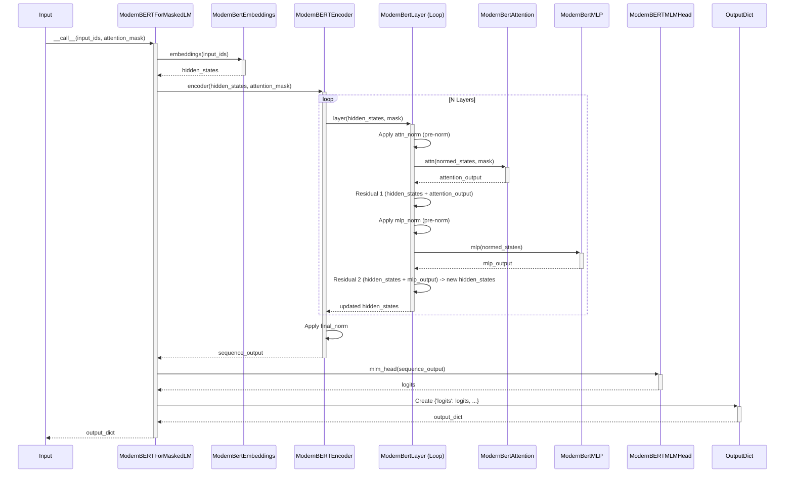

## modernbertformaskedlm

> description: Details the jaxgarden ModernBERTForMaskedLM model, a bidirectional encoder with RoPE, pre-LN, and mixed attention for MLM tasks.

---
description: Details the jaxgarden ModernBERTForMaskedLM model, a bidirectional encoder with RoPE, pre-LN, and mixed attention for MLM tasks.
globs: jaxgarden/models/modernbert.py
alwaysApply: false
---
# Chapter 6: ModernBERTForMaskedLM

In the [previous chapter](generationmixin.mdc), we explored `GenerationMixin`, focusing on autoregressive text generation for causal language models. Now, we shift our focus to a different type of transformer architecture: a bidirectional encoder designed specifically for Masked Language Modeling (MLM) tasks, incorporating modern optimizations. Welcome to `ModernBERTForMaskedLM`.

**Motivation:** While causal models excel at text generation, many NLP tasks benefit from understanding context bidirectionally (both left and right). Traditional BERT achieved this but often suffered from computational inefficiency, especially with long sequences. The ModernBERT architecture, as proposed by Answer.AI, aims to create a "Smarter, Better, Faster, Longer" bidirectional encoder by incorporating techniques like Rotary Position Embeddings (RoPE), pre-Layer Normalization, and efficient attention mechanisms, making it suitable for fast, memory-efficient training and inference, particularly for long contexts. `ModernBERTForMaskedLM` implements this architecture within `jaxgarden` for the MLM pre-training objective.

**Central Use Case:** Pre-training or fine-tuning a language model using the masked language modeling objective, where the model predicts randomly masked tokens in the input sequence. This model can also serve as a powerful feature extractor for downstream NLP tasks requiring bidirectional context understanding, potentially after loading pre-trained weights using the framework provided by [BaseModel](basemodel.mdc).

## Key Concepts

`ModernBERTForMaskedLM` integrates several components and modern architectural choices:

1.  **Inheritance:** It inherits from [BaseModel](basemodel.mdc), gaining standardized configuration management, state handling (Flax NNX), checkpointing (`save`/`load`), and the interface for Hugging Face weight conversion (`from_hf`).
2.  **`ModernBertEmbeddings`:** Handles the initial input processing. It converts token IDs into dense vectors using an embedding layer and applies Layer Normalization. Crucially, unlike traditional BERT, it does *not* include explicit learned position embeddings; positional information is injected later via RoPE.
3.  **`ModernBERTEncoder`:** The core of the model, consisting of a stack of `ModernBertLayer` instances (`num_hidden_layers` defined in `ModernBERTConfig`).
4.  **`ModernBertLayer`:** Implements a single transformer block using the **Pre-LayerNorm** architecture (LayerNorm applied *before* the attention and MLP sub-layers, followed by residual connections). This structure often leads to more stable training compared to the original Post-LayerNorm BERT. Each layer contains:
    *   `ModernBertAttention`: Performs multi-head self-attention.
    *   `ModernBertMLP`: A feed-forward network applied after attention.
5.  **`ModernBertAttention`:**
    *   Calculates query, key, and value projections from the input.
    *   Applies **[Rotary Position Embeddings (RoPE)](rotary_position_embeddings__rope_.mdc)** directly to the query and key vectors before computing attention scores. `RoPEPositionalEmbedding` generates the necessary sinusoidal encodings.
    *   Supports **Mixed Global and Local Attention:** Can operate in standard global attention mode (all tokens attend to all others) or use a sliding window (local attention) where tokens only attend to nearby tokens (`local_attention` parameter). This can be configured to happen only on certain layers (`global_attn_every_n_layers`) to balance global context understanding with computational efficiency.
6.  **`ModernBertMLP`:** Uses GELU activation function within the feed-forward network.
7.  **`ModernBERTMLMHead`:** Added on top of the `ModernBERTEncoder`. It takes the final hidden states, applies Layer Normalization, a dense layer with GELU activation, and finally projects the result to the vocabulary size to produce logits for predicting the original masked tokens. The final projection layer (decoder) is often tied to the token embedding weights.

## Using `ModernBERTForMaskedLM`

Let's see how to instantiate and use the model.

### Initialization

Define a `ModernBERTConfig` and initialize the model. Key parameters in the config control the architecture, including attention behavior.

```python
import jax
import jax.numpy as jnp
from flax import nnx
from jaxgarden.models.modernbert import ModernBERTConfig, ModernBERTForMaskedLM

# Configuration for a smaller ModernBERT model
config = ModernBERTConfig(
    vocab_size=30522, # Example BERT vocab size
    hidden_size=256,
    num_hidden_layers=4,
    num_attention_heads=8,
    intermediate_size=512,
    max_position_embeddings=512, # Max sequence length for RoPE cache
    attention_dropout=0.1,
    hidden_dropout=0.1,
    # Use local attention (window size 128 left, 128 right)
    local_attention=(128, 128),
    # Apply global attention every 2 layers (layers 0, 2)
    global_attn_every_n_layers=2,
    pad_token_id=0
)

# Initialize PRNG keys
rngs = nnx.Rngs(params=0) # Or use more sophisticated key management

# Instantiate the model
model = ModernBERTForMaskedLM(config, rngs=rngs, param_dtype=jnp.float32)

print(f"Initialized ModernBERTForMaskedLM with {config.num_hidden_layers} layers.")
print(f"Local attention window: {config.local_attention}")
print(f"Global attention every {config.global_attn_every_n_layers} layers.")
# Output: Initialized ModernBERTForMaskedLM with 4 layers.
# Output: Local attention window: (128, 128)
# Output: Global attention every 2 layers.
```
**Explanation:** We create a `ModernBERTConfig` instance, customizing parameters like layer count, hidden size, and attention settings (`local_attention`, `global_attn_every_n_layers`). We then instantiate `ModernBERTForMaskedLM` with this config and an `nnx.Rngs` object.

### Forward Pass (`__call__`)

The `__call__` method takes token IDs and an optional attention mask, returning a dictionary containing logits and optionally hidden states and attentions.

```python
# Prepare dummy input (Batch size 2, sequence length 64)
batch_size = 2
seq_len = 64
dummy_input_ids = jnp.ones((batch_size, seq_len), dtype=jnp.int32)
# Mask indicating valid tokens (1) vs padding (0)
dummy_attention_mask = jnp.ones((batch_size, seq_len), dtype=jnp.int32)

# Define forward pass function (typically JIT-compiled)
@jax.jit
def forward_pass(model_state, input_ids, attention_mask):
    # Split graphdef/params for JIT
    graphdef, params = nnx.split(model, nnx.Param, ...) # simplified split
    # Call the model's graph definition
    outputs = graphdef(
        input_ids=input_ids,
        attention_mask=attention_mask,
        deterministic=True # Disable dropout for inference
    )
    return outputs['logits'] # Return only logits for this example

# --- Execution ---
# We won't execute the JITted function here, just show structure/shapes
# logits = forward_pass(model.state, dummy_input_ids, dummy_attention_mask)
# print(f"Output logits shape: {logits.shape}")
# Expected output shape if run: (2, 64, 30522)
print(f"Expected output logits shape: ({batch_size}, {seq_len}, {config.vocab_size})")
# Output: Expected output logits shape: (2, 64, 30522)
```
**Explanation:**
- `input_ids`: `[batch_size, seq_len]` tensor of token IDs.
- `attention_mask`: `[batch_size, seq_len]` tensor (1 for real tokens, 0 for padding). This mask is used by the attention mechanism to prevent attending to padding tokens.
- `deterministic`: If `True`, dropout layers are disabled. Typically `True` for evaluation/inference and `False` for training.
- The output is a dictionary. The primary output for MLM is `logits` (`[batch_size, seq_len, vocab_size]`), representing the model's prediction scores for each token position. Optional keys `hidden_states` and `attentions` can be requested via `output_hidden_states=True` and `output_attentions=True`.

### Loading Pretrained Weights (Conceptual)

Like other `BaseModel` subclasses, `ModernBERTForMaskedLM` can potentially load weights from Hugging Face using `from_hf`, provided a `convert_weights_from_hf` method is implemented for this specific architecture (mapping HF ModernBERT checkpoint names to `jaxgarden` state names).

```python
# hf_model_id = "AnswerDotAI/modernbert-8k-S-500k" # Example HF model ID
# print(f"Attempting to load weights from {hf_model_id}...")
# try:
#     # Ensure config matches the HF model being loaded
#     # config_hf = ModernBERTConfig(...) # Load/define config matching HF model
#     # model_hf = ModernBERTForMaskedLM(config_hf, rngs=nnx.Rngs(1))
#
#     # This call requires a ModernBERT-specific implementation of convert_weights_from_hf
#     # model_hf.from_hf(hf_model_id)
#
#     # print("Weights loaded successfully.")
# except NotImplementedError:
#     print(f"NOTE: {type(model).__name__} does not currently implement HF weight conversion.")
# except Exception as e:
#     # print(f"Skipping HF weight loading example due to error: {e}")
#     pass
print("Skipping actual HF weight loading execution (requires implementation).")
```

## Internal Implementation

Understanding the flow of data within the model helps in debugging and customization.

**High-Level Walkthrough (`__call__`)**:

1.  **Embeddings:** Input `input_ids` are passed to `self.embeddings` (`ModernBertEmbeddings`), which performs token lookup, scales embeddings, applies Layer Normalization, and optional dropout. Result: `hidden_states`.
2.  **Attention Mask Prep:** The input `attention_mask` (e.g., `[1, 1, 0]`) is converted internally by the attention mechanism into an additive mask (e.g., `[0, 0, -inf]`) suitable for adding to attention scores before softmax. Sliding window masks are generated or used if local attention is active for the current layer.
3.  **Encoder:** `hidden_states` and the prepared `attention_mask` (and optionally `position_ids`) are passed to `self.encoder` (`ModernBERTEncoder`).
    *   The encoder iterates through its list of `ModernBertLayer`s.
    *   Each `ModernBertLayer`:
        *   Applies LayerNorm to the input (`attn_norm`, potentially `Identity` for layer 0).
        *   Passes the normalized input to `self.attn` (`ModernBertAttention`), which calculates attention output using RoPE and potentially local masking.
        *   Adds the attention output back to the layer's input (first residual connection).
        *   Applies LayerNorm to the result (`mlp_norm`).
        *   Passes the normalized result to `self.mlp` (`ModernBertMLP`).
        *   Adds the MLP output back (second residual connection).
    *   The final output of the last layer is passed through a final LayerNorm (`self.encoder.final_norm`). Result: `sequence_output`.
4.  **MLM Head:** `sequence_output` is passed to `self.mlm_head` (`ModernBERTMLMHead`).
    *   Applies LayerNorm (`self.mlm_head.norm`).
    *   Applies a dense layer (`self.mlm_head.dense`) followed by GELU activation.
    *   Applies the final decoder/projection layer (`self.mlm_head.decoder`) to get scores over the vocabulary. Result: `logits`.
5.  **Output:** Returns a dictionary containing `logits` and any requested optional outputs (`hidden_states`, `attentions`).



**Code Details (from `jaxgarden/models/modernbert.py`)**:

*   **`ModernBERTForMaskedLM.__init__`**: Initializes the main components (`self.embeddings`, `self.encoder`, `self.mlm_head`) by passing the `config` and `rngs`.
  ```python
  # Simplified from ModernBERTForMaskedLM.__init__
  class ModernBERTForMaskedLM(BaseModel):
      def __init__(self, config: ModernBERTConfig, *, rngs: nnx.Rngs, ...):
          super().__init__(config, rngs=rngs, ...)

          self.embeddings = ModernBertEmbeddings(rngs=rngs, ...) # Pass relevant config fields
          self.encoder = ModernBERTEncoder(rngs=rngs, ...)      # Pass relevant config fields
          self.mlm_head = ModernBERTMLMHead(rngs=rngs, ...)      # Pass relevant config fields
  ```

*   **`ModernBERTForMaskedLM.__call__`**: Orchestrates the forward pass.
  ```python
  # Simplified from ModernBERTForMaskedLM.__call__
  def __call__(self, input_ids, attention_mask=None, ..., deterministic=True, ...):
      # 1. Get embeddings
      hidden_states = self.embeddings(
          input_ids=input_ids, deterministic=deterministic, ...
      )

      # 2. Apply encoder
      encoder_outputs = self.encoder(
          hidden_states, attention_mask=attention_mask, deterministic=deterministic, ...
      )
      sequence_output = encoder_outputs[0]
      # (Handle optional hidden_states/attentions from encoder_outputs)

      # 3. Apply MLM head
      logits = self.mlm_head(sequence_output)

      # 4. Build output dictionary
      outputs = {"logits": logits}
      # (Add optional outputs if requested)
      return outputs
  ```

*   **`ModernBertAttention.__call__`**: Key steps include QKV projection, RoPE application, attention score calculation, mask application (including sliding window if active), softmax, dropout, and output projection.
  ```python
  # Conceptual steps within ModernBertAttention.__call__
  # qkv = self.Wqkv(hidden_states)
  # query, key, value = split_heads_and_transpose(qkv)
  # query = apply_rotary_pos_emb(query, self.rotary_emb.cache, position_ids)
  # key = apply_rotary_pos_emb(key, self.rotary_emb.cache, position_ids)
  # attention_scores = compute_scores(query, key)
  # if self.local_attention != (-1, -1):
  #     sliding_window_mask = create_sliding_window_mask(...) or use provided
  #     attention_scores += sliding_window_mask
  # if attention_mask is not None:
  #     attention_scores += attention_mask # Additive mask
  # attention_probs = softmax(attention_scores)
  # # Apply dropout if needed
  # attention_output = combine_heads(matmul(attention_probs, value))
  # attention_output = self.Wo(attention_output)
  ```

## Conclusion

`ModernBERTForMaskedLM` provides a `jaxgarden` implementation of a modern, efficient bidirectional transformer encoder tailored for masked language modeling. By incorporating features like RoPE, pre-Layer Normalization, and optional sliding window attention, it aims to improve upon traditional BERT architectures in terms of speed, memory usage, and handling of long sequences. It leverages the `BaseModel` foundation for consistency and integrates specialized components like `ModernBertEmbeddings`, `ModernBERTEncoder`, `ModernBertAttention`, `ModernBertMLP`, and `ModernBERTMLMHead`.

Understanding the general principles of attention mechanisms is fundamental to grasping how models like ModernBERT work internally. The next chapter delves into the details of attention itself.

**Next:** [Attention Mechanism (MultiHeadAttention / dot_product_attention)](attention_mechanism__multiheadattention___dot_product_attention_.mdc)


---

Generated by [Rules for AI](https://github.com/altaidevorg/rules-for-ai)

---
> Source: [ml-gde/jaxgarden](https://github.com/ml-gde/jaxgarden) — distributed by [TomeVault](https://tomevault.io).
<!-- tomevault:4.0:gemini_md:2026-05-22 -->
