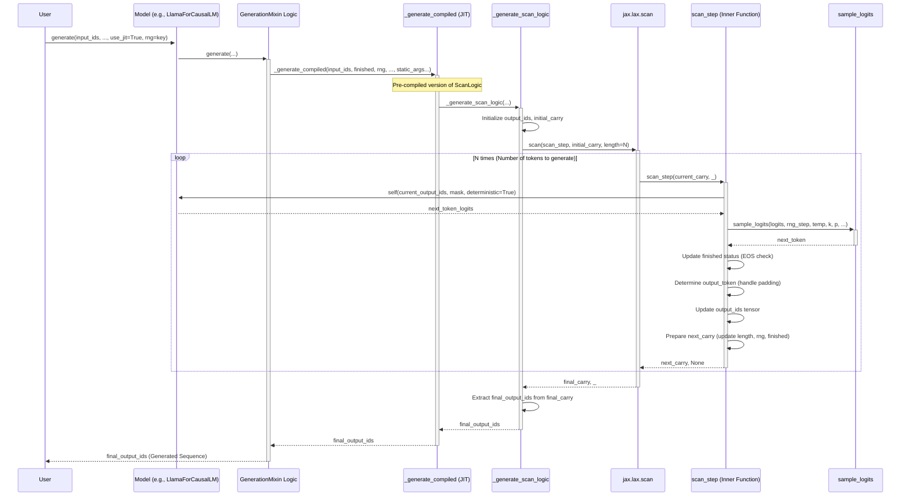

## generationmixin

> description: jaxgarden tutorial on GenerationMixin, providing autoregressive text generation with sampling for JAX models.

---
description: jaxgarden tutorial on GenerationMixin, providing autoregressive text generation with sampling for JAX models.
globs: jaxgarden/models/generation_utils.py
alwaysApply: false
---
# Chapter 5: GenerationMixin

In the [previous chapter](llamaforcausallm.mdc), we explored `LlamaForCausalLM`, a causal language model built using `jaxgarden` components. We saw that it inherits text generation capabilities. This chapter focuses on the `GenerationMixin` class, the source of that functionality.

**Motivation:** Implementing autoregressive text generation involves complex logic: managing the token-by-token loop efficiently, handling various sampling strategies (temperature, top-k, top-p, min-p), managing padding and end-of-sequence tokens, and dealing with JAX's PRNG key management and JIT compilation nuances. Encapsulating this logic in a reusable mixin avoids code duplication across different causal language models and provides a standardized generation interface. `GenerationMixin` solves this by providing a robust `generate` method that can be easily added to any compatible causal LM inheriting from [BaseModel](basemodel.mdc).

**Central Use Case:** Adding the `generate` method to a custom causal language model (or using it via an existing model like `LlamaForCausalLM`). This allows the model instance to perform text generation based on a prompt, controlling the output's creativity and coherence through sampling parameters, and leveraging JAX optimizations like `lax.scan` and JIT compilation for performance on accelerators.

## Key Concepts

1.  **Mixin Pattern:** `GenerationMixin` is not meant to be used standalone. It's designed to be inherited *alongside* a primary base class (like `BaseModel` or a specific model class like `LlamaForCausalLM`). It "mixes in" the `generate` method and its helpers into the inheriting class.
2.  **Autoregressive Loop (`jax.lax.scan`):** Text generation is sequential. The model predicts the next token based on the previously generated tokens. `GenerationMixin` implements this loop using `jax.lax.scan`, which is highly efficient for iterative computations on JAX accelerators (GPU/TPU) as it unrolls the loop within the compiled computation graph.
3.  **Sampling Strategies:** Controls how the next token is chosen from the model's output probability distribution (logits).
    *   `temperature`: Scales logits before sampling. Higher values -> more randomness; lower values -> more determinism.
    *   `top_k`: Restricts sampling to the `k` most likely tokens.
    *   `top_p` (Nucleus Sampling): Restricts sampling to the smallest set of tokens whose cumulative probability exceeds `p`.
    *   `min_p`: Restricts sampling to tokens with probability `p * max_probability` or higher.
    *   `do_sample`: Boolean flag to enable/disable sampling (if `False`, uses greedy decoding - picks the most likely token).
4.  **Helper Functions:** Sampling strategies are implemented via standalone helper functions (`temperature_scale`, `top_k_logits`, `top_p_logits`, `min_p_logits`, `sample_logits`) for clarity and testability.
5.  **State Management:** The generation loop manages the sequence length, detects the End-of-Sequence (EOS) token to stop generation for specific sequences in a batch, handles padding (`pad_token_id`), and correctly splits and passes the JAX PRNG key (`rng`) at each step if sampling is enabled.
6.  **JIT Compilation (`use_jit`):** The `generate` method offers a `use_jit` flag. If `True`, it calls a pre-compiled version of the core generation loop (`_generate_compiled`). This requires specifying `static_argnames` (like `max_length`, `temperature`, `top_k`, etc., and crucially `self`) to `jax.jit`, as these values influence the computation graph structure and cannot be dynamic JAX tracers during compilation.

## Using `GenerationMixin`

You typically don't interact with `GenerationMixin` directly. Instead, you call the `generate` method on a model class that inherits from it, like `LlamaForCausalLM`.

```python
import jax
import jax.numpy as jnp
from flax import nnx
# Assume LlamaForCausalLM and Tokenizer are imported and initialized
# from jaxgarden.models.llama import LlamaConfig, LlamaForCausalLM
# from jaxgarden.tokenization import Tokenizer

# --- Setup (Conceptual) ---
# model_config = LlamaConfig(...) # Load appropriate config
# tokenizer = Tokenizer.from_pretrained(...) # Load matching tokenizer
# rngs = nnx.Rngs(0)
# model = LlamaForCausalLM(model_config, rngs=rngs)
# model.from_hf(...) # Optional: Load pretrained weights

# --- Generation Call ---
# prompt = "The definition of JAX is"
# inputs = tokenizer.encode(prompt, return_tensors="jax")
# input_ids = inputs['input_ids']
# attention_mask = inputs['attention_mask'] # Important for initial prompt

# Set generation parameters
# max_new_tokens = 50
# target_max_length = input_ids.shape[1] + max_new_tokens
# generation_rng = jax.random.PRNGKey(42)
# pad_token_id = tokenizer.pad_token_id
# eos_token_id = tokenizer.eos_token_id

# print(f"Generating text with max_length={target_max_length}, temperature=0.8, top_k=50")

# --- The core call to the generate method ---
# output_ids = model.generate(
#     input_ids=input_ids,
#     attention_mask=attention_mask, # Use mask from prompt encoding
#     max_length=target_max_length,
#     temperature=0.8,
#     top_k=50,
#     top_p=0.9,
#     min_p=None, # Example: min_p not used
#     do_sample=True, # Enable sampling
#     pad_token_id=pad_token_id,
#     eos_token_id=eos_token_id,
#     rng=generation_rng,
#     use_jit=True # Use the compiled version for speed
# )

# --- Decoding ---
# generated_text = tokenizer.decode(output_ids[0], skip_special_tokens=True)
# print(f"\nPrompt: {prompt}")
# print(f"Generated: {generated_text}")

# Example Output (Conceptual - depends heavily on model and sampling):
# Generating text with max_length=58, temperature=0.8, top_k=50
#
# Prompt: The definition of JAX is
# Generated: The definition of JAX is a high-performance numerical computation library
#            focused on machine learning research. It combines automatic differentiation
#            (autograd) and XLA compilation for speed on accelerators like GPUs and TPUs...
print("Skipping actual generation execution.")
```

**Explanation:**
- `input_ids`: The starting token sequence (prompt) as a JAX array `[batch_size, seq_len]`.
- `attention_mask`: A mask indicating which input tokens are real (1) vs padding (0), shape `[batch_size, seq_len]`. Important for the model to ignore padding in the prompt.
- `max_length`: The *total* maximum length of the output sequence (prompt + generated tokens).
- `temperature`, `top_k`, `top_p`, `min_p`: Control the sampling process. Setting `top_k=1` or `do_sample=False` results in greedy decoding.
- `do_sample`: If `True`, performs sampling according to the other parameters; if `False`, performs greedy decoding.
- `pad_token_id`: The ID used for padding shorter sequences in the batch *after* they finish generating (e.g., hit EOS). If not provided, it tries to infer from `model.config.pad_token_id` or defaults to 0.
- `eos_token_id`: The ID that signals the end of a sequence. Generation stops for a sequence once this token is sampled. If not provided, generation continues until `max_length`.
- `rng`: A `jax.random.PRNGKey` required if `do_sample=True`.
- `use_jit`: If `True`, calls the JIT-compiled version of the generation loop. Highly recommended for performance.
- **Output:** The method returns a JAX array `output_ids` of shape `[batch_size, max_length]` containing the prompt and the generated tokens, padded up to `max_length`.

## Internal Implementation

The `generate` method orchestrates the process, while the core token-by-token logic resides in `_generate_scan_logic`, which is wrapped by `jax.lax.scan`.

1.  **`generate` Method:**
    *   Performs input validation (shapes, parameter ranges).
    *   Handles default values for `pad_token_id`, `eos_token_id`, and `rng`.
    *   Determines the initial sequence length (`initial_seq_len`) and batch size.
    *   Initializes the `finished_sequences` boolean array based on whether the *last* token of the input is already EOS.
    *   **Conditional Dispatch:** Based on the `use_jit` flag, it calls either:
        *   `self._generate_compiled(...)`: A pre-compiled version of `_generate_scan_logic` created using `partial(jax.jit, static_argnames=...)`.
        *   `self._generate_scan_logic(...)`: The raw Python function (slower, useful for debugging).

2.  **`_generate_scan_logic` Method (Core Loop Logic):**
    *   Initializes the output tensor `output_ids` of shape `[batch_size, max_length]` filled with `pad_token_id`, and copies the `initial_input_ids` into the beginning.
    *   Sets up the initial `carry` dictionary for `lax.scan`, containing `output_ids`, `current_length`, `rng`, and `finished` status.
    *   Defines the `scan_step` function, which performs one step of generation:
        *   Takes the current `carry` state and a loop counter (`_`) as input.
        *   Splits the PRNG key (`rng`) if `do_sample` is true.
        *   Creates the `attention_mask` for the *current* sequence length within the `max_length` buffer. Note: Causal masking is typically handled *inside* the model's attention mechanism, but this mask handles padding.
        *   **Model Call:** Calls `self(input_ids=current_output_ids, attention_mask=attention_mask, deterministic=True)`. This executes the forward pass of the model (e.g., `LlamaForCausalLM.__call__`). `deterministic=True` ensures dropout etc. are disabled.
        *   Extracts the logits for the *next* token prediction (logits at the `current_length - 1` position).
        *   **Sampling:** Calls `sample_logits` with the extracted logits and sampling parameters (`temperature`, `top_k`, etc.) to get the `next_token`.
        *   **EOS/Padding:** Checks if the `next_token` is the `eos_token_id`. Updates the `finished` status for the sequence. Determines the token to actually write: `pad_token_id` if already finished, otherwise the sampled `next_token`.
        *   Updates the `output_ids` tensor at the `current_length` position with the chosen token.
        *   Updates the `carry` dictionary for the next step (`current_length` incremented, `rng` updated, `finished` status updated).
        *   Returns the updated `carry` and `None` (as `lax.scan` expects `(carry, scan_output)`).
    *   Calls `jax.lax.scan(scan_step, initial_carry, None, length=num_steps_to_generate)`.
    *   Returns the final `output_ids` from the resulting `carry`.

3.  **`sample_logits` Function:**
    *   Takes raw logits, RNG key, and all sampling parameters.
    *   If `do_sample=False`, returns `jnp.argmax(logits)`.
    *   Applies `temperature_scale`.
    *   Sequentially applies filtering functions (`min_p_logits`, `top_k_logits`, `top_p_logits`) if the corresponding parameters are set. These functions mask invalid logits by setting them to `-jnp.inf`.
    *   **Edge Case Handling:** If *all* logits become `-jnp.inf` after filtering (can happen with very restrictive filtering), it falls back to sampling from the *pre-filtered* (but temperature-scaled) logits to prevent errors.
    *   Uses `jax.random.categorical` to sample from the final filtered (or fallback) logit distribution.



4.  **JIT Compilation (`_generate_compiled`)**:
    *   Defined using `partial(jax.jit, static_argnames=...)`.
    *   `static_argnames` must include parameters that affect the *structure* of the computation or are needed as Python values inside the loop logic (not JAX tracers). This includes:
        *   `self`: Needed to call the model's forward pass (`self.__call__`) inside `scan_step`. `self` contains the model's graph definition.
        *   `max_length`: Determines the size of the output tensor and loop length.
        *   `temperature`, `top_k`, `top_p`, `min_p`, `do_sample`: Control conditional logic within `sample_logits` and `scan_step`.
        *   `pad_token_id`, `eos_token_id`: Used in conditional logic (`jnp.where`).
        *   `initial_seq_len`: Affects the number of scan steps.
    *   Arguments *not* listed as static (`initial_input_ids`, `initial_finished_sequences`, `initial_rng`) are treated as dynamic JAX arrays (tracers) during compilation.

*   **Code Location:** `jaxgarden/models/generation_utils.py`

## Conclusion

`GenerationMixin` provides a powerful and reusable mechanism for adding sophisticated autoregressive text generation capabilities to causal language models in `jaxgarden`. By leveraging `jax.lax.scan` for efficiency, offering flexible sampling strategies, and integrating seamlessly with JAX's JIT compilation, it allows developers to easily enable text generation in their models while benefiting from high performance on accelerators. Understanding its parameters and internal workings is key to effectively controlling the generation process.

**Next:** [ModernBERTForMaskedLM](modernbertformaskedlm.mdc)


---

Generated by [Rules for AI](https://github.com/altaidevorg/rules-for-ai)

---
> Source: [ml-gde/jaxgarden](https://github.com/ml-gde/jaxgarden) — distributed by [TomeVault](https://tomevault.io).
<!-- tomevault:4.0:gemini_md:2026-05-22 -->
