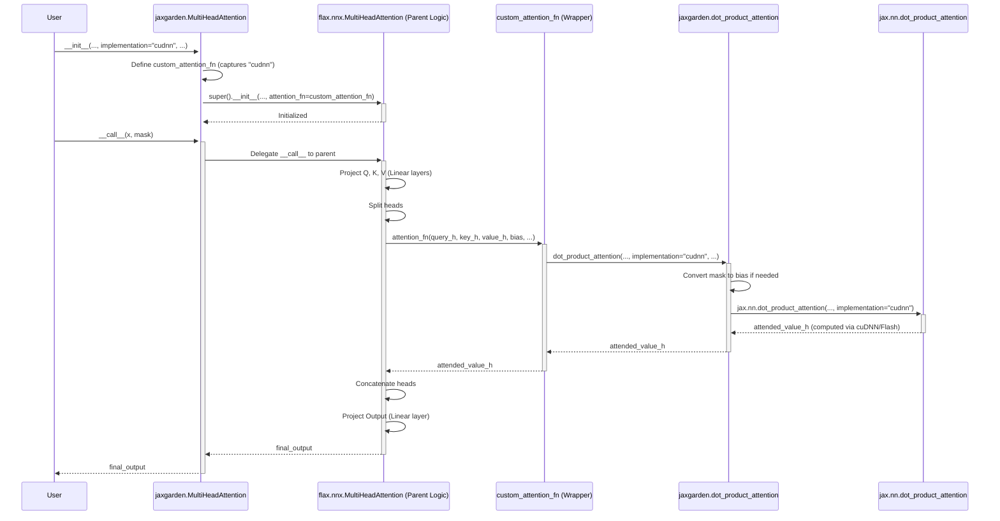

## attention-mechanism-multiheadattention-dot-product-attention

> description: jaxgarden tutorial chapter on Attention Mechanism MultiHeadAttention module using customizable dot_product_attention backend (XLA/cuDNN Flash).

---
description: jaxgarden tutorial chapter on Attention Mechanism MultiHeadAttention module using customizable dot_product_attention backend (XLA/cuDNN Flash).
globs: 
alwaysApply: false
---
# Chapter 7: Attention Mechanism (MultiHeadAttention / dot_product_attention)

In the previous chapters, we explored end-to-end models like [LlamaForCausalLM](llamaforcausallm.mdc) and [ModernBERTForMaskedLM](modernbertformaskedlm.mdc). We saw that a key component within their transformer layers is the attention mechanism (e.g., `LlamaAttention`, `ModernBertAttention`). This chapter delves into the core implementation of attention within `jaxgarden`, specifically the `MultiHeadAttention` module and the underlying `dot_product_attention` function.

**Motivation:** Attention mechanisms, particularly scaled dot-product attention and its multi-head variant, are the computational heart of transformer models. Implementing this efficiently is critical for performance. Furthermore, modern hardware and libraries offer highly optimized kernels like Flash Attention (accessible via cuDNN in JAX) that can significantly speed up computation and reduce memory usage, especially for long sequences. `jaxgarden` aims to provide a flexible attention implementation that leverages these optimizations while integrating smoothly with the Flax NNX framework.

**Central Use Case:** Building or utilizing a transformer layer within `jaxgarden` that requires efficient multi-head self-attention. This involves instantiating `jaxgarden.attention.MultiHeadAttention` (often within a higher-level layer like `LlamaAttention`) and potentially configuring it to use an optimized backend like `"cudnn"` to enable Flash Attention on compatible hardware, thereby accelerating model training and inference.

## Key Concepts

1.  **Scaled Dot-Product Attention:** The fundamental operation defined as `Attention(Q, K, V) = softmax(QK^T / sqrt(d_k))V`. It calculates attention scores by taking the dot product between queries (Q) and keys (K), scaling them, applying a softmax function to get probabilities, and then using these probabilities to compute a weighted sum of the values (V).
2.  **Multi-Head Attention (MHA):** Instead of performing a single attention calculation, MHA projects the Q, K, and V inputs into multiple lower-dimensional "heads", performs scaled dot-product attention independently for each head in parallel, and then concatenates the results and projects them back to the original dimension. This allows the model to jointly attend to information from different representation subspaces at different positions.
3.  **`dot_product_attention` (Functional Interface):** Located in `jaxgarden.functional.attention`, this function provides the low-level implementation of scaled dot-product attention. It's a wrapper around `jax.nn.dot_product_attention`.
    *   **Core Logic:** Handles the matrix multiplications, scaling, and softmax.
    *   **Masking/Bias:** Accepts an optional `mask` or `bias` argument. It automatically converts a boolean mask (where `True` means keep) into an additive bias (0.0 for keep, -inf for mask out) suitable for the underlying JAX function.
    *   **Backend Selection:** Crucially, it accepts an `implementation` argument (`"xla"`, `"cudnn"`, `"flash"` or `None`). This allows specifying which JAX backend implementation to use for the attention computation. `"cudnn"` (aliased as `"flash"`) attempts to use optimized kernels like Flash Attention if supported by the hardware (NVIDIA GPU) and cuDNN version. `None` lets JAX choose the best available option.
4.  **`MultiHeadAttention` (NNX Module):** Located in `jaxgarden.attention.multi_head_attention`, this module provides a standard Flax NNX interface for multi-head attention.
    *   **Inheritance:** It subclasses the standard `flax.nnx.MultiHeadAttention`.
    *   **Integration:** It overrides the default `attention_fn` used by the parent Flax MHA. Instead of using Flax's default attention, it uses a customized function that internally calls `jaxgarden.functional.dot_product_attention`, passing along the desired `implementation` backend specified during the `jaxgarden.MultiHeadAttention` initialization.
    *   **Responsibilities:** Manages the multiple heads, input/output linear projections (for Q, K, V and the final output), dropout, and precision settings, encapsulating the full MHA logic.

## Using the Attention Mechanism

While `dot_product_attention` is a functional component usually called internally, `MultiHeadAttention` is the module you would typically interact with if building custom transformer layers. Higher-level models like `LlamaForCausalLM` use specialized attention modules (`LlamaAttention`) which themselves *might* use `jaxgarden.MultiHeadAttention` or implement similar logic incorporating `dot_product_attention`.

Here's how you could instantiate and use `jaxgarden.MultiHeadAttention`:

```python
import jax
import jax.numpy as jnp
import flax.nnx as nnx
from jaxgarden.attention import MultiHeadAttention # This is jaxgarden's MHA

# --- Configuration ---
batch_size = 2
seq_len = 128
hidden_dim = 256 # Also in_features
num_heads = 8
dropout_rate = 0.1
# Choose the backend: "xla", "cudnn" (Flash), or None (auto)
attention_implementation = "cudnn" # Try to use Flash Attention

# --- Initialization ---
rngs = nnx.Rngs(0)
mha_layer = MultiHeadAttention(
    num_heads=num_heads,
    in_features=hidden_dim,
    dropout_rate=dropout_rate,
    implementation=attention_implementation, # Key argument!
    deterministic=False, # Apply dropout during training
    rngs=rngs,
    param_dtype=jnp.float32 # Specify parameter dtype
)

# --- Dummy Input ---
key = jax.random.PRNGKey(1)
# query, key, value can be the same for self-attention
x = jax.random.normal(key, (batch_size, seq_len, hidden_dim))

# Optional: Create a causal mask (for autoregressive models)
# Mask shape: [batch_size, num_heads, q_len, kv_len] or broadcastable
causal_mask_bool = jnp.tril(jnp.ones((1, 1, seq_len, seq_len), dtype=bool))

# --- Forward Pass ---
# JIT compilation is recommended for performance
@jax.jit
def apply_mha(layer_state, input_tensor, mask_tensor):
    graphdef, params = nnx.split(mha_layer, nnx.Param, ...) # Simplified split
    output = graphdef(input_tensor, mask=mask_tensor) # Pass mask here
    return output

# output = apply_mha(mha_layer.state, x, causal_mask_bool)
# print(f"Output shape: {output.shape}")
# Expected output shape if run: (2, 128, 256) [batch, seq_len, hidden_dim]
print(f"Expected output shape: ({batch_size}, {seq_len}, {hidden_dim})")
```

**Explanation:**
- We import `jaxgarden.attention.MultiHeadAttention`.
- During initialization, we provide standard MHA parameters (`num_heads`, `in_features`) and crucially, the `implementation` argument set to `"cudnn"` to request Flash Attention. We also set `deterministic=False` to enable dropout (useful during training).
- We create dummy input `x`. For self-attention, the same `x` is used implicitly for query, key, and value by the underlying Flax MHA logic.
- We create an optional `causal_mask_bool` (a lower triangular matrix for autoregressive tasks). This boolean mask will be automatically converted to an additive bias by `dot_product_attention`.
- The forward pass applies the layer to the input `x` and the `mask`.
- The output shape matches the input shape `[batch_size, seq_len, hidden_dim]`.

**Note:** You typically wouldn't use `jaxgarden.functional.dot_product_attention` directly unless you are building a completely custom attention mechanism from scratch. It's designed to be the workhorse *inside* modules like `jaxgarden.MultiHeadAttention`.

## Internal Implementation

Let's look at how these two components work together.

### 1. `dot_product_attention` (Functional)

*   **File:** `jaxgarden/functional/attention.py`

**Walkthrough:**
1.  Receives query, key, value tensors, and optional `bias`, `mask`, `dropout_rng`, `deterministic`, `implementation` parameters.
2.  Maps `"flash"` implementation alias to `"cudnn"`.
3.  Checks if a boolean `mask` is provided. If yes, it converts the mask into an additive `bias` (0.0 where mask is True, -1e10 where mask is False). If a `bias` was *also* provided, it combines them. This ensures compatibility with `jax.nn.dot_product_attention` which primarily uses additive bias.
4.  Calls `jax.nn.dot_product_attention`, passing through the Q, K, V, prepared bias, and importantly, the `implementation` string (`"xla"` or `"cudnn"`). It uses default JAX scaling and lets the JAX function handle dropout internally if `dropout_rng` and `dropout_rate` are passed.
5.  Returns the resulting attention output tensor.

```python
# Simplified from jaxgarden/functional/attention.py
from typing import Literal
import jax
import jax.numpy as jnp

def dot_product_attention(
    query: jnp.ndarray,
    key: jnp.ndarray,
    value: jnp.ndarray,
    bias: jnp.ndarray | None = None,
    mask: jnp.ndarray | None = None, # Boolean mask
    # ... other args: dropout_rng, dropout_rate, deterministic, dtype, precision ...
    implementation: Literal["xla", "cudnn", "flash"] | None = None,
    # ... module arg (unused in JAX implementation) ...
) -> jnp.ndarray:

    if implementation == "flash":
        implementation = "cudnn"

    # Convert boolean mask to additive bias if needed
    if mask is not None:
        if bias is None:
            # Where mask is True (keep), bias is 0.0. Where False (mask out), bias is -inf.
            bias = jnp.where(mask, 0.0, -1e10)
        else:
            # Combine existing bias with mask
            bias = jnp.where(mask, bias, -1e10)

    # *** Core Call ***
    # Pass arguments to the underlying JAX implementation
    # Note: JAX handles dropout internally based on rng/rate/deterministic
    output = jax.nn.dot_product_attention(
        query=query,
        key=key,
        value=value,
        bias=bias, # Pass the processed additive bias
        # dropout_rng=dropout_rng, # Pass through dropout args
        # dropout_rate=dropout_rate,
        # deterministic=deterministic,
        scale=None,  # Use default sqrt(dk) scaling
        is_causal=False, # We handle causal masking via bias/mask arg
        implementation=implementation # Specify backend
    )
    return output
```

### 2. `MultiHeadAttention` (Module)

*   **File:** `jaxgarden/attention/multi_head_attention.py`

**Walkthrough:**
1.  **Initialization (`__init__`)**:
    *   Takes standard MHA parameters (`num_heads`, `in_features`, etc.) plus the `implementation` argument.
    *   Defines a *nested helper function* `custom_attention_fn`. This function captures the `implementation` parameter from the outer scope.
    *   Inside `custom_attention_fn`, it simply calls `jaxgarden.functional.dot_product_attention`, passing through the query, key, value, bias/mask, and the captured `implementation`.
    *   It then calls the **parent class constructor** (`super().__init__` for `flax.nnx.MultiHeadAttention`). Crucially, it passes `attention_fn=custom_attention_fn`. This tells the parent Flax MHA to use our custom wrapper instead of its default attention logic.
2.  **Forward Pass (`__call__`)**:
    *   The call is handled by the parent `flax.nnx.MultiHeadAttention`'s `__call__` method.
    *   The parent method performs the Q, K, V linear projections using `nnx.Linear`.
    *   It splits the projections into multiple heads.
    *   It **calls the `attention_fn`** that was provided during `__init__` (which is our `custom_attention_fn`).
    *   Our `custom_attention_fn` executes, calling `jaxgarden.functional.dot_product_attention` with the specified `implementation`.
    *   The result from `dot_product_attention` is returned to the parent Flax MHA method.
    *   The parent method concatenates the head outputs and applies the final output projection.
    *   The final result is returned.



```python
# Simplified from jaxgarden/attention/multi_head_attention.py
from flax.nnx.nn.linear import default_kernel_init
from jaxgarden.functional.attention import dot_product_attention

class MultiHeadAttention(nnx.MultiHeadAttention):
    def __init__(
        self,
        # ... standard MHA args: num_heads, in_features, etc. ...
        attention_fn: Callable | None = None, # Will be overridden
        implementation: Literal["xla", "cudnn", "flash"] | None = None, # Added arg
        rngs: nnx.Rngs,
    ):
        # Create a custom attention function that uses our dot_product_attention
        # with the specified implementation
        if attention_fn is None: # Ensure we override if not explicitly given
            def custom_attention_fn(
                query: jnp.ndarray,
                key: jnp.ndarray,
                value: jnp.ndarray,
                bias: jnp.ndarray | None = None,
                mask: jnp.ndarray | None = None,
                **kwargs: Any,
            ) -> jnp.ndarray:
                # Calls the jaxgarden functional implementation
                return dot_product_attention(
                    query=query,
                    key=key,
                    value=value,
                    bias=bias,
                    mask=mask,
                    implementation=implementation, # Use captured implementation
                    **kwargs,
                )
            # Set the attention_fn to our custom one for the parent class
            attention_fn_to_use = custom_attention_fn
        else:
            # If user explicitly provided an attention_fn, use that
            # (though typical use relies on the implementation arg)
            attention_fn_to_use = attention_fn

        # *** Initialize the parent Flax NNX MultiHeadAttention ***
        # Pass our custom function wrapper as the attention_fn
        super().__init__(
            # ... pass all standard MHA args ...
            attention_fn=attention_fn_to_use, # <<< Key Integration Point
            # ... pass remaining args ...
            rngs=rngs,
        )
        # Note: The 'implementation' arg itself is not stored directly
        # by the parent class, its effect is embedded in the custom_attention_fn.
```

## Conclusion

The `jaxgarden` attention mechanism provides a flexible and performant implementation crucial for transformer models. The low-level `dot_product_attention` function wraps JAX's core attention logic, enabling backend selection for potential hardware acceleration (like Flash Attention via `"cudnn"`). The `MultiHeadAttention` module integrates this functional core into a standard Flax NNX layer, handling projections and head management while allowing users to easily specify the desired backend implementation. This design facilitates building efficient transformer layers within `jaxgarden`.

Attention mechanisms often incorporate positional information to understand sequence order. The next chapter explores a popular technique for injecting this information directly into the query and key vectors *before* the attention calculation.

**Next:** [Rotary Position Embeddings (RoPE)](rotary_position_embeddings__rope_.mdc)


---

Generated by [Rules for AI](https://github.com/altaidevorg/rules-for-ai)

---
> Source: [ml-gde/jaxgarden](https://github.com/ml-gde/jaxgarden) — distributed by [TomeVault](https://tomevault.io).
<!-- tomevault:4.0:gemini_md:2026-05-22 -->
