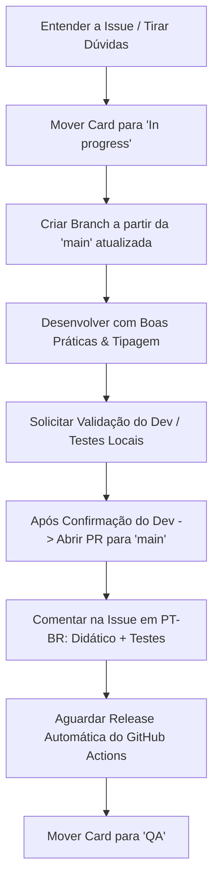

## monky

> Este documento define os princípios de engenharia de software, padrões de arquitetura e o fluxo de trabalho obrigatório para agentes de IA que desenvolvem no repositório **Monky**.

# Diretrizes e Fluxo de Trabalho para Agentes de IA

Este documento define os princípios de engenharia de software, padrões de arquitetura e o fluxo de trabalho obrigatório para agentes de IA que desenvolvem no repositório **Monky**.

---

## 🏛️ Princípios de Engenharia de Software & Arquitetura

Todo código produzido deve seguir as melhores práticas da indústria, com foco em **clareza, robustez, performance e manutenibilidade**, evitando complexidade desnecessária (_sem overengineering_).

### 1. Diretrizes Técnicas por Área do Projeto

#### 🔹 Electron, IPC & Segurança

- **Isolamento Total:** Mantenha `contextIsolation: true` e `nodeIntegration: false`. Nunca exponha módulos inteiros do Node.js ou Electron diretamente no `window` via Preload.
- **Tipagem Estrita de IPC:** Utilize sempre os contratos centralizados em `packages/shared/src/ipc.ts`. Proibido utilizar strings literais soltas ou tipos `any` em chamadas `ipcMain.handle` / `ipcRenderer.invoke`.
- **Prevenção de Memory Leaks no IPC:** Remova listeners e evite registrar handlers IPC repetidamente durante o ciclo de vida da aplicação.
- **Sanitização no Main Process:** Valide todos os payloads recebidos do Renderer antes de executar operações de I/O, rede, arquivos ou navegação externa (`shell.openExternal`).

#### 🔹 WebRTC & Processamento de Áudio/Vídeo

- **Gerenciamento de Ciclo de Vida:** Sempre execute o teardown completo de `RTCPeerConnection` e interrompa trilhas de mídia (`MediaStreamTrack.stop()`) ao encerrar chamadas, desativar câmeras ou mutar microfones.
- **Web Audio API Cleanup:** Feche e desconecte instâncias de `AudioContext`, `MediaStreamAudioSourceNode`, `GainNode` e `AudioWorkletNode` para evitar consumo fantasma de CPU e memória.
- **Resiliência de Rede:** Trate _race conditions_ em trocas de ofertas/respostas SDP e candidatos ICE, garantindo reconexão graciosa em instabilidades de rede.

#### 🔹 Módulos Nativos C++ / Node-API (`@monky/screen-audio`)

- **Memory & Thread Safety:** Garanta a liberação correta de buffers e recursos de áudio do sistema operacional (WASAPI no Windows, CoreAudio no macOS). Nunca trave a thread principal do Node.js — utilize `napi_threadsafe_function` para callbacks assíncronos.
- **Resiliência a Falhas:** Isole erros de captura de áudio com tratamento de exceções robusto para que falhas em dispositivos de som não causem crash no processo Main.

#### 🔹 Renderer Vanilla TypeScript & DOM

- **Limpeza de Event Listeners:** Sempre remova listeners vinculados a `window`, `document`, elementos do DOM ou ao `EventBus` quando uma view, modal ou componente for desmontado/fechado.
- **Gerenciamento de Estado Previsível:** Concentre estados nas Stores dedicadas (`chatStore`, `voiceStore`, `serverStore`, `settingsStore`, `connectionStore`), aplicando mutações claras e sem dependências circulares.
- **Performance de Renderização:** Evite reflows e repaints desnecessários no DOM; prefira mutações cirúrgicas a recriações massivas de HTML.

#### 🔹 Backend / Servidor (Clean Architecture Pragmática)

- **Separação de Responsabilidades:** Respeite a divisão entre `domain` (regras puras), `application` (casos de uso) e `infrastructure` (SQLite, WebSocket, rede).
- **Persistência Segura:** No SQLite, utilize transações para operações em lote e prepare queries parametrizadas para evitar corrupção e injeção de dados.
- **WebSocket Resiliente:** Mantenha rotinas de heartbeat (ping/pong) para identificar conexões zumbis e limpar recursos associados.

#### 🔹 Rigor em TypeScript

- **Sem `any`:** Não utilize `any` nem asserções forçadas (`as unknown as Type`). Modele tipos e interfaces no `@monky/shared` sempre que forem compartilhados.
- **Tratamento Seguro de Nulos/Erros:** Trate explicitamente `null`, `undefined` e exceções com blocos `try/catch` e tipos discriminados.

---

### 2. Pragmatismo & Anti-Overengineering

- **KISS (Keep It Simple, Stupid):** Prefira sempre a solução mais simples e legível que resolva o problema com eficácia.
- **YAGNI (You Aren't Gonna Need It):** Não crie abstrações prematuras, camadas intermediárias vazias, fábricas ou padrões complexos para funcionalidades que não existem no escopo atual.
- **Legibilidade em Primeiro Lugar:** Código limpo é autoexplicativo, bem nomeado e com comentários focados no _porquê_ das decisões não óbvias.

---

## 👨‍🏫 Didática & Comunicação com o Desenvolvedor

A comunicação do agente deve ser sempre **clara, didática, transparente e respeitosa**:

1. **Explique o Raciocínio:** Não se limite a entregar código pronto. Explique de forma didática o que causava o problema anterior e por que a solução adotada é a ideal.
2. **Ensine o Conceito:** Ao corrigir bugs ou aplicar refatorações complexas (ex.: memory leaks, gerenciamento de eventos, concorrência WebRTC), contextualize a causa raiz e a boa prática envolvida.
3. **Transparência em Decisões:** Caso precise escolher entre diferentes abordagens, exponha brevemente os trade-offs (prós e contras) para o desenvolvedor.

---

## 🔍 Rigor ao Afirmar e ao Documentar

- **Verifique antes de afirmar.** Nunca diga que algo está feito, verde ou mergeado sem ter conferido. O estado de um PR muda enquanto você trabalha: consulte `state` junto de `mergeable`, porque `mergeable: UNKNOWN` tanto significa "o GitHub ainda está calculando" quanto "o PR já foi fechado".
- **Documentação apodrece em silêncio.** Link, âncora, caminho de menu e nome de arquivo não dão erro quando ficam errados — apenas passam a apontar para o lugar errado. Ao mexer em documentação, confira o que citou: âncoras contra o render real, caminhos de menu contra a interface, nomes de arquivo e comandos contra o que existe de fato.

---

## 🔄 Fluxo de Trabalho a partir do Board

> ⚠️ **Esta seção só se aplica a quem tem acesso ao board da organização.**
> O board é privado. Se você está contribuindo de fora, ele não é visível nem necessário — siga o [`CONTRIBUTING.md`](CONTRIBUTING.md) e ignore tudo o que vem abaixo.

O board oficial fica em: https://github.com/orgs/MonkyOrg/projects/1

**Nem toda issue está no board.** A entrada é filtrada por label, e bug nasce em Discussions — só vira issue depois de confirmado. Se a issue em que você vai trabalhar não tem card, **não crie um**: pergunte ao desenvolvedor.

Quando houver card, siga rigorosamente as etapas abaixo:



### Etapas Detalhadas:

1. **Antes de começar a codar**: mova o card para **In progress**.
   - ⛔ **Nunca desenvolva cards na coluna `Blocked`.** Se um card estiver bloqueado, solicite que o desenvolvedor responsável o mova para fora de `Blocked` (ex.: `Backlog` ou `In progress`). Nunca altere o status de um item bloqueado sem autorização explícita.
2. **Entenda a issue por completo antes de codar.** Se houver requisitos ambíguos, escopo indefinido ou critérios de aceite vagos, **tire dúvidas com o desenvolvedor** antes de prosseguir. Nunca assuma nada — pergunte e só inicie a implementação após os esclarecimentos.
3. **Crie a branch a partir da `main` atualizada.**
   - Sempre execute `git checkout main && git pull` antes de `git checkout -b <branch>`.
   - Nunca ramifique a partir de uma branch com PR aberto sem combinar previamente o empilhamento (_stacked PRs_) com o desenvolvedor.
4. **Desenvolva a solução completa**, respeitando os princípios de arquitetura e qualidade de código.
5. **Solicitar Confirmação e Validação do Desenvolvedor (Ponto de Parada Obrigatório):**
   - ⛔ **Nunca suba código nem abra PR imediatamente após concluir a edição.**
   - Ao finalizar os ajustes, apresente o que foi implementado, os arquivos modificados e oriente o desenvolvedor a realizar os testes locais.
   - Envie a solicitação de confirmação:
     > _"Os ajustes foram implementados com sucesso. Por favor, realize os testes locais e, se estiver tudo certo, me dê o comando para continuar o fluxo de publicação."_
   - **Aguarde a aprovação/comando explícito do desenvolvedor** antes de prosseguir para as próximas etapas (Push / PR / Merge).
6. **Após a Confirmação: Abra um Pull Request para a branch padrão (`main`).**
   - O branch `main` é protegido; todo merge deve passar por PR com squash e deleção da branch de trabalho.
7. **Comente na Issue/Card do board (em PT-BR)** com explicação didática e passo a passo de validação:
   - **O que foi implementado & Por quê (Explicação Didática):** Resumo claro da solução, motivação técnica e arquivos/módulos alterados.
   - **Como testar (Guia para QA/Dev):** Passo a passo reprodutível, cenários principais, casos de borda e resultados esperados.
8. **Após o merge, aguarde a release ser gerada.**
   - O push na `main` dispara automaticamente o workflow **Release** (GitHub Actions), que gera a versão SemVer (`v<MAJOR>.<MINOR>.<PATCH>`) baseada na convenção de commits:
     - **Patch** (`1.0.X`): Correções de bugs (`fix:`, `fix(...)`, `bugfix:`).
     - **Minor** (`1.X.0`): Novas funcionalidades (`feat:`, `feat(...)`, `feature:`).
     - **Major** (`X.0.0`): Breaking changes / refatorações arquiteturais (`BREAKING CHANGE:`, `feat!:`, `major:`).
   - ⚠️ **Toda mudança de compatibilidade entre cliente e servidor é `major`.** Um cliente e um servidor com `PROTOCOL_VERSION` diferentes se recusam a conectar (`packages/shared/src/validators.ts` exige igualdade exata), então quem não atualizar os dois lados fica sem conseguir entrar. Ao mexer em `PROTOCOL_VERSION` (`packages/shared/src/constants.ts`), no formato das mensagens do WebSocket ou no schema esperado pelo outro lado, use `feat!:`/`major:` no título do PR ou um parágrafo `BREAKING CHANGE:` na mensagem de um commit. O CI (`scripts/check-protocol-bump.js`) reprova o PR que mudar o `PROTOCOL_VERSION` sem esse marcador.
   - A versão é sempre recalculada a partir da **última tag estável** (betas são ignoradas), avaliando todos os commits desde ela. Ou seja, um único commit com marcador de breaking change eleva toda a linha em aberto para a próxima major.
   - Betas saem como `v<MAJOR>.<MINOR>.<PATCH>-beta<NNN>` com 3 dígitos (`v3.0.0-beta001`). O zero à esquerda é obrigatório porque a página de releases do GitHub ordena pelo **nome da tag**: sem o padding, `beta9` apareceria depois de `beta14` (#338). O ponto não pode ser usado (`beta.014` é SemVer inválido).
   - ⚠️ **Só mova o card para `QA` após a release ser publicada com sucesso**, pois a validação do QA ocorre sobre o build compilado.
9. **Não mova para Done automaticamente.** O card deve permanecer em `QA` até a validação do responsável, que solicitará a movimentação para **Done** ou o fará manualmente.

---

## 📝 Modelo de Comentário Obrigatório na Issue

Utilize o comando:

```bash
gh issue comment <NÚMERO_DA_ISSUE> --body "<comentário em PT-BR>"
```

### Estrutura do Comentário:

```markdown
### 💡 Como foi implementado & Decisões Técnicas

- **Resumo Didático:** [Explicação clara do que foi resolvido e do conceito aplicado]
- **Arquivos & Camadas Alteradas:**
  - `apps/client/src/...`: [Mudanças realizadas e motivo]
  - `packages/shared/src/...`: [Tipos/contratos ajustados]
- **Boas Práticas Aplicadas:** [Ex.: remoção de event listeners para evitar memory leaks, tipagem estrita de IPC, isolamento de camadas]

---

### 🧪 Como testar (Guia de Validação para QA)

1. **Pré-requisitos:** [Ex.: Iniciar servidor local / conectar 2 clientes]
2. **Cenário Principal:**
   - Passo 1: [Ação]
   - Passo 2: [Ação]
   - **Resultado Esperado:** [Comportamento correto do app]
3. **Casos de Borda & Resiliência:**
   - [Ex.: Testar desconexão de rede, fechar modal repetidamente, mutar/desmutar rápido]
   - **Resultado Esperado:** [Ausência de erros no console ou travamentos]
```

---

## 🛠️ Referência do Board & Comandos Úteis

- **Project ID:** `PVT_kwDOEws3wM4BhD7I`
- **Campo Status (Field ID):** `PVTSSF_lADOEws3wM4BhD7IzhgBIGI`
- **Opções de Status (`single-select-option-id`):**
  - Discussing: `146d7ce6`
  - Backlog: `f75ad846`
  - Blocked: `7a1e61fe`
  - In progress: `47fc9ee4`
  - Awaiting PR Review: `1187975c`
  - After QA Review: `98330754`
  - QA: `df73e18b`
  - Done: `98236657`
  - Ideias descartadas: `6eeb0bfb`

⚠️ **Tabela é cópia, e cópia envelhece.** O board muda sem avisar: a coluna `Ready` ficou documentada aqui depois de já ter sido removida, e a `Awaiting PR Review` existia no board sem constar desta lista. Confira na API antes de confiar:

```bash
gh api graphql -f query='
{ organization(login: "MonkyOrg") { projectV2(number: 1) {
    field(name: "Status") { ... on ProjectV2SingleSelectField { options { id name } } } } } }'
```

### Mover Card no Board:

```bash
gh project item-edit \
  --id <ITEM_ID> \
  --project-id PVT_kwDOEws3wM4BhD7I \
  --field-id PVTSSF_lADOEws3wM4BhD7IzhgBIGI \
  --single-select-option-id <OPTION_ID>
```

_(Para obter o `<ITEM_ID>`, liste os itens com: `gh project item-list 1 --owner MonkyOrg --format json`)_

### Fluxo Git & Pull Request:

```bash
export GIT_SSH_COMMAND='ssh -o BatchMode=yes'
git checkout main && git pull
git checkout -b <nome-da-branch>

# ... desenvolvimento e commits semânticos ...

git push -u origin <nome-da-branch>
gh pr create --title "<tipo>: <descrição>" --body "<descrição didática das alterações>"
gh pr merge <nome-da-branch> --squash --delete-branch
git checkout main && git pull
```

### Trailer Obrigatório de Co-autoria nos Commits:

```text
Co-authored-by: Copilot <223556219+Copilot@users.noreply.github.com>
```

---
> Source: [MonkyOrg/Monky](https://github.com/MonkyOrg/Monky) — distributed by [TomeVault](https://tomevault.io).
<!-- tomevault:4.0:gemini_md:2026-08-28 -->
