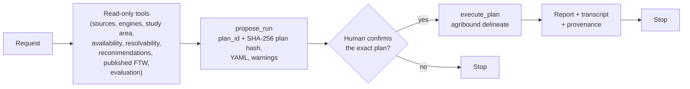

## agribound

> The optional agent layer lets a language model plan an agribound run from a

# Agent Layer

The optional agent layer lets a language model plan an agribound run from a
natural-language request. It is opt-in (`pip install "agribound[agent]"`,
which installs `anthropic` and `mcp`) and works at a deliberately low level of
autonomy:

1. the model investigates with **read-only tools** and proposes **one**
   configuration as a plan (`propose_run`);
2. a **human reviews the full plan** and approves or denies that exact plan;
3. at most **one** approved plan runs per session (`execute_plan` →
   `agribound.pipeline.delineate`);
4. the session **stops** after the run or the denial, without another model
   turn. There is no automatic re-run, re-tuning or retry; another run needs a
   new request by the human.

The deterministic `delineate()` API and CLI remain the way to run scripted,
reproducible pipelines; a plan is an ordinary configuration YAML that
`agribound delineate --config` runs without the agent.



## Usage

```python
import agribound

result = agribound.agent(
    "Delineate fields in this area for 2024 with a label-free approach",
    study_area="area.geojson",
    gee_project="my-gee-project",
)
print(result.status)  # "executed", "denied", "completed", ...
print(result.report)  # deterministic summary written by agribound, not by the model
```

```bash
agribound agent "Delineate fields in this area for 2024 with a label-free approach" \
    --study-area area.geojson --gee-project my-gee-project
agribound agent "..." --study-area area.geojson --dry-run     # plan YAML only, never executes
```

`agribound.agent(...)` and `agribound.agent.agent(...)` are the same call.
Importing `agribound.agent` does not import `anthropic`, `mcp` or `pydantic`;
a missing dependency is reported when a session starts
(`AgentDependencyError`, an `ImportError` with the install hint).

Main arguments (CLI flags in parentheses):

| Argument | Meaning |
|---|---|
| `request` | natural-language request |
| `study_area` (`--study-area`), `gee_project` (`--gee-project`), `reference_boundaries` (`--reference`) | defaults the tools use |
| `model` (`--model`) | model ID; default `$AGRIBOUND_AGENT_MODEL`, else `claude-opus-5` |
| `base_url` (`--base-url`) | Anthropic-compatible endpoint (see [Local models](#local-models)) |
| `dry_run` (`--dry-run`) | do not offer `execute_plan`; plans are written as YAML |
| `workdir` (`--workdir`) | session directory; default `./agribound_agent/<session id>` |
| `max_turns` (`--max-turns`, 20) | maximum model responses |
| `allow_network=False` (`--offline`) | see [Offline sessions](#offline-sessions) |
| `confirm` | Python only: `None` (typed prompt when standard input is a terminal, else deny every plan), `"prompt"`, `"deny"`, or a callable `confirm(plan) -> bool` |
| `max_executions` | Python only: execution limit of the gate (default 1); the loop stops after the first execution attempt whatever the value |

The CLI has no option to skip the confirmation. Without an interactive
terminal it refuses to start unless `--dry-run` is given.

`AgentResult` holds `status` (`completed`, `executed`, `execution_failed`,
`denied`, `refused`, `max_tokens`, `max_turns`, `error`), the model's last
text, the deterministic `report`, the plans and their YAML paths, the
executions, and the transcript path.

## Tools

The same typed tools (`agribound.agent.tools.TOOL_SPECS`, pydantic input and
output models) drive the local loop and the MCP server.

| Tool | Kind | What it does |
|---|---|---|
| `list_sources` | read-only | sources with resolutions, years, coverage, value scale, Earth Engine/restricted access |
| `list_engines` | read-only | engines with approach, `label_free`, `fine_tunable`, supported sources, bands, references, notes (`source_notes` for notes that apply to one source only), and whether their package is installed |
| `describe_study_area` | read-only | area, bounding box, centroid, UTM zones, and the estimated composite size per source |
| `check_availability` | read-only | registry year ranges and coverage; with `live=True`, Earth Engine image counts or TESSERA tile counts over the study area |
| `estimate_resolvability` | read-only | pixels per field (area / GSD²) per source and the share of fields (by count and area) the SAM stage would refine, from one of: a reference layer (default: the session's), published FTW polygons (one prediction year, the latest unless `year` is given), or a representative field area |
| `recommend_configurations` | read-only | ranks (source, engine) candidates with deterministic, documented rules (years, restrictions, US-only coverage, engine-source support, label availability, resolution); every rule is listed in the output; it does not predict accuracy |
| `query_published_ftw` | writes into the work directory | downloads the published FTW polygons for the study area and summarises them (model predictions, not ground truth) |
| `evaluate_against_reference` | read-only | `agribound.evaluate.evaluate` on a prediction layer |
| `propose_run` | writes the plan YAML | validates a configuration and freezes it into a plan; runs nothing |
| `execute_plan` | gated | asks the human to approve the plan and, only then, runs it |

The system prompt tells the model to ground every choice in tool output, keep
package-default thresholds unless the user asked for a value, never change a
threshold to increase or decrease the number of polygons, never modify a
denied plan to obtain approval, and report limitations (ground sampling
distance versus field size, label availability, out-of-distribution inputs,
imagery access).

## The confirmation gate

- `propose_run` stores the fully validated `AgriboundConfig` as canonical JSON
  plus fingerprints of the inputs (study-area geometry via
  `agribound._cache.aoi_fingerprint`; path, size and modification time of the
  reference and local raster files), and a SHA-256 **plan hash** over both.
- The reviewer sees the full resolved configuration, the fields that differ
  from the package defaults, and explicit warnings for non-default thresholds
  and filters (`lulc_filter`, `lulc_crop_threshold`, `lulc_on_error`,
  `aoi_selection`, `min_field_area_m2`, `sam_refine`, `cloud_cover_max`, ...),
  for method-changing fields (`composite_method`, `date_range`,
  `s2_cloud_mask`, `lulc_mode`, `usgs_allow_year_fallback`, `sam_backend`,
  ...) and for fields that change which remote service is contacted or where
  data go (`usgs_service_url`, `export_method`, `gcs_bucket`). The plan's
  `network_services` names the ImageServer host of a non-default
  `usgs_service_url`, the Cloud Storage bucket, or the Google Drive of the
  Earth Engine account. The model's rationale, limitations and alternatives
  are shown after agribound's own sections, each line prefixed with `  | `.
- Every value on the review screen is shown with control characters, format
  characters (such as bidirectional overrides and zero-width characters) and
  line or paragraph separators escaped (for example as `\x1b` or `\u202e`).
  No value can therefore move the cursor, erase lines or add a line that
  looks like one of agribound's own sections. `agribound agent` escapes the
  model's final text and the report in the same way.
- The terminal prompt approves only the answer `yes` (case-insensitive,
  surrounding whitespace ignored); anything else denies.
- An approval is bound to the plan hash and is single-use. Immediately before
  execution the hash is recomputed from the stored configuration and the
  current input files; a changed configuration, study area or input file is
  refused (`PlanChangedError`), and the check also runs before the reviewer is
  asked. When this check fails, every unused approval of that hash is revoked
  (the transcript records when and why), so the approval can never be used
  for a later run.
- The reviewer is asked on every `execute_plan` call, also for a plan that
  was approved before (over MCP: a new elicitation, or the host's prompt for
  that call). In the local agent loop an earlier approval of the plan that
  was not used is revoked before the reviewer is asked, so no approval
  carries over to another attempt without a new answer.
- The gate counts executions against `max_executions` (default 1).

### What a proposal may set

`propose_run` refuses a proposal, with an error the model reads, when:

- `study_area`, `reference_boundaries`, `local_tif_path`, `output_name` or
  any key or value in `config` contains a control or format character (line
  breaks, tabs, escape sequences, bidirectional overrides). Only the free-text
  rationale, limitations and alternatives may span lines; they are escaped
  when shown.
- `config` sets a reserved field. The agent layer controls these: the output
  location (`output_path`, via `output_name`, a plain file name inside the
  session directory), `cache_dir`, `embedding_cache_dir` (the session cache
  is used), `overwrite` (agent runs never overwrite), `provenance` (always
  written), and the credentials and project (`gee_service_account_key`,
  `gee_project`). The Earth Engine project comes from the user: the
  session's `gee_project` (`--gee-project`), else `GEE_PROJECT`, the gcloud
  configuration or the `project_id` of the credentials file, as for
  `delineate()`.
- `config` has unknown fields, or repeats a top-level argument.
- the plan ID (the first 12 hexadecimal characters of the plan hash) is
  already used in the session by a plan with a different hash.

## Transcript

Each session writes `<workdir>/agent_session_<session_id>.json`: the request,
backend and model ID, package and SDK versions, every model turn (stop reason,
text, tool calls, token usage, duration), every tool call (validated
arguments, result summary or error, duration), the plans, the gate's approvals
and denials (who, how, when, and for a revoked approval when and why), the
executions and the final status. Tool calls that the model requested in the
same turn after an execution attempt or a denial are not run; they are
recorded as errors ("Not run: the session ended after the previous tool
call."). It is rewritten after every turn and again when an approved plan starts, so an
interrupted session still leaves a record. The executed run has its own
[provenance record](reproducibility.md#provenance-record) next to its output.

## Offline sessions

`--offline` (`allow_network=False`) forbids the tools to contact Earth Engine,
TESSERA, Source Cooperative or the USGS NAIP Plus ImageServer: the read-only
tools skip or refuse their network parts, `propose_run` lists the remote
services a plan needs (`network_services`), and `execute_plan` refuses such a
plan before the reviewer is asked. The check is made from the configuration
alone, so a plan whose inputs are already cached is still refused; on offline
nodes run the plan YAML directly with `agribound delineate --config`. The flag
does not affect the LLM backend, and it does not block model-weight downloads
from Hugging Face during a run: prefetch them with `agribound prefetch` and set
`HF_HUB_OFFLINE=1`.

## MCP server

`agribound mcp serve` serves the same tools over the Model Context Protocol
(stdio by default) to any MCP host, such as Claude Desktop, Claude Code or a
local-LLM host.

```bash
agribound mcp serve                                   # read-only tools + propose_run
agribound mcp serve --allow-execute                   # also execute_plan (one plan per process)
agribound mcp serve --allow-execute --confirm host    # rely on the host's tool-approval prompt
agribound mcp serve --transport streamable-http --host 127.0.0.1 --port 8000   # loopback, no execute_plan
agribound mcp serve --transport streamable-http --allow-execute       # refused: no authentication
agribound mcp serve --transport streamable-http --allow-execute \
    --allow-unauthenticated-http                                      # runs anyway, logs a WARNING
```

- Without `--allow-execute`, `execute_plan` is not registered: the host can
  investigate and propose plans, and a human runs the plan YAML.
- With `--allow-execute`, at most one plan runs per server process.
  `--confirm elicit` (default) sends an MCP elicitation showing the full plan
  and asks the user to type `yes`; clients without the elicitation capability
  get an error explaining the alternative. MCP lets a client answer
  elicitations itself, so the server cannot prove that a human answered; the
  method is recorded with the approval. The answer approves only the plan
  hash that the elicitation showed: if the plan under that ID has changed
  meanwhile, nothing runs and the denial is recorded. `--confirm host` relies
  on the host's own per-tool approval prompt; use it only with hosts that ask
  before every tool call.
- `--transport streamable-http` has no authentication. Any process or user
  that can reach the host and port can call the tools; with
  `--allow-execute` such a client can also answer its own elicitation and
  run a plan. The server adds only DNS-rebinding protection (Host and Origin
  checks) when `--host` is `127.0.0.1`, `localhost` or `::1`, which does not
  stop other local users. `agribound mcp serve` therefore refuses to start
  (exit status 2, before the server is built) when streamable-http is
  combined with `--allow-execute` or with a `--host` that is not a loopback
  address (`localhost`, `127.0.0.0/8` or `::1`; other host names are not
  resolved and count as not loopback). `--allow-unauthenticated-http`
  starts the server anyway and logs a WARNING that says what is exposed.
  The default host is `127.0.0.1`; stdio is not affected. On shared
  machines, such as HPC login nodes, use the default stdio transport.
- Read-only tools carry `read_only_hint=True`. Unknown argument names are
  rejected.
- `--workdir` defaults to `$XDG_DATA_HOME/agribound/mcp` or
  `~/.local/share/agribound/mcp` (not the host's working directory).
  `--study-area`, `--gee-project` and `--reference` set defaults;
  `--offline` works as above.

**Claude Code** (`claude mcp add <name> -- <command> [args...]`; everything
after `--` is passed to the server):

```bash
claude mcp add agribound -- /path/to/env/bin/agribound mcp serve
claude mcp add --scope project agribound -- /path/to/env/bin/agribound mcp serve --allow-execute
```

**Claude Desktop** (`claude_desktop_config.json`: on macOS
`~/Library/Application Support/Claude/claude_desktop_config.json`, on Windows
`%APPDATA%\Claude\claude_desktop_config.json`; restart Claude Desktop after
editing):

```json
{
  "mcpServers": {
    "agribound": {
      "command": "/path/to/env/bin/agribound",
      "args": ["mcp", "serve"]
    }
  }
}
```

Use the absolute path of the `agribound` executable of the environment where
agribound is installed (`which agribound`). These configuration formats follow
the Claude Code MCP documentation (<https://code.claude.com/docs/en/mcp>) and
the MCP guide for local servers
(<https://modelcontextprotocol.io/docs/develop/connect-local-servers>), read on
2026-09-27.

## Local models

The backend uses the Anthropic Messages API (`anthropic` Python SDK). With
`base_url` (`--base-url`) it talks to any Anthropic-compatible `/v1/messages`
endpoint, for example Ollama (Anthropic compatibility since v0.14, per the
Ollama announcement) or vLLM's Anthropic-compatible server. For such endpoints
agribound sends no beta headers, refusal fallbacks, `cache_control` or
`tool_choice`; `thinking` and `effort` are sent only when given explicitly.
Local servers need a placeholder API key, for example
`ANTHROPIC_API_KEY=ollama`:

```bash
ANTHROPIC_API_KEY=ollama agribound agent "..." --base-url http://localhost:11434 \
    --model <local tool-capable model> --study-area area.geojson --dry-run
```

The model must support tool use. Ollama and vLLM endpoints have not been
tested with agribound, and the first-party API path was tested against the SDK
and its wire format with a mock transport, not against the live API.

## Why the gate

A delineation run downloads imagery (and spends Earth Engine quota), writes
files, and produces polygons that may be used downstream. The design keeps
the human responsible for what runs: the model can only propose, the human
sees exactly what will run, the approval cannot be reused for anything else,
nothing runs twice, and there is no loop that adjusts thresholds until a
result "looks right", which would make the result depend on the model's
judgement instead of a stated configuration. Every decision is recorded in the
transcript, and every run in its provenance record.

---
> Source: [montimaj/agribound](https://github.com/montimaj/agribound) — distributed by [TomeVault](https://tomevault.io).
<!-- tomevault:4.0:gemini_md:2026-10-04 -->
