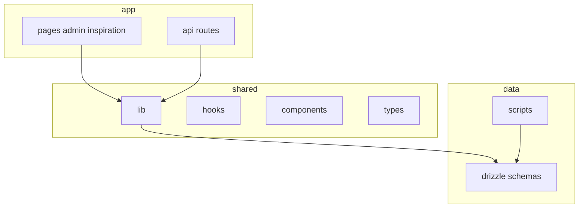

## waken-wa

> 面向在本仓库中协作的人类开发者与 AI Agent：说明项目目的、目录结构、数据与环境约定，以及修改代码时的注意点。

# AGENTS.md — 开发指引

面向在本仓库中协作的人类开发者与 AI Agent：说明项目目的、目录结构、数据与环境约定，以及修改代码时的注意点。

---

## 1. 项目简介

**waken-wa**（见 [package.json](package.json)）是基于 **Next.js App Router** 的个人站点：

- **访客**：首页展示个人状态、日程、动态时间线、灵感内容等；可配置整站访问锁（hCaptcha 等）。
- **管理员**：后台管理用户、设备、API Token、站点设置、灵感素材与活动等。

数据层使用 **Drizzle ORM**。运行时根据环境在 **SQLite**（本地 `file:`，默认开发）与 **PostgreSQL**（部署常见）之间切换。

### 技术栈一览

| 层级 | 说明 |
|------|------|
| 框架 | Next.js 16.x（[package.json](package.json)），`output: 'standalone'`（[next.config.mjs](next.config.mjs)） |
| UI | React 19、Tailwind 4、Radix UI、[components/ui/](components/ui/)（类 shadcn 结构） |
| 数据 | Drizzle、[better-sqlite3](package.json) / [pg](package.json)；双 schema：[drizzle/schema.sqlite.ts](drizzle/schema.sqlite.ts)、[drizzle/schema.pg.ts](drizzle/schema.pg.ts) |
| 统一表导出 | [lib/drizzle-schema.ts](lib/drizzle-schema.ts) 按 `DATABASE_URL` 是否为 Postgres URL 选择 |
| DB 入口 | [lib/db.ts](lib/db.ts)（`server-only`），开发环境会缓存连接实例 |
| 认证 | JWT（[jose](package.json)）+ Cookie；密码 [bcryptjs](package.json)；核心 [lib/auth.ts](lib/auth.ts) |
| 校验 | Zod、react-hook-form |
| 活动实时更新 | [app/api/activity/stream/route.ts](app/api/activity/stream/route.ts)：SSE，服务端定时聚合数据（非 WebSocket） |

---

## 2. 仓库地图

### 顶级目录职责

- **[app/](app/)**
  - **页面**：[app/page.tsx](app/page.tsx) 首页（站点锁、资料、日程横幅、灵感、活动流等，`dynamic = 'force-dynamic'`）；[app/admin/](app/admin/)（登录、仪表盘、[setup](app/admin/setup/page.tsx)）；[app/inspiration/](app/inspiration/) 灵感列表与详情。
  - **API**
    - 认证：[app/api/auth/](app/api/auth/)（login / logout / session）
    - 管理：[app/api/admin/](app/api/admin/)（users、settings、devices、tokens、activity、settings/export、setup/admin、change-password 等）
    - 活动：[app/api/activity/route.ts](app/api/activity/route.ts)、[app/api/activity/stream/route.ts](app/api/activity/stream/route.ts)
    - 灵感：[app/api/inspiration/](app/api/inspiration/)（entries、assets、img）
    - 站点解锁：[app/api/site/unlock/route.ts](app/api/site/unlock/route.ts)
- **[lib/](lib/)**：数据库、认证、活动聚合（含 Steam：[lib/steam.ts](lib/steam.ts)、[lib/activity-feed.ts](lib/activity-feed.ts)）、主题、站点配置、[lib/rate-limit.ts](lib/rate-limit.ts) 等。
- **[components/](components/)**：业务组件（如 [current-status.tsx](components/current-status.tsx)、[activity-feed-provider.tsx](components/activity-feed-provider.tsx)）、[components/admin/](components/admin/)、[components/ui/](components/ui/)。
- **[hooks/](hooks/)**：如 [use-activity-feed.ts](hooks/use-activity-feed.ts)、[use-is-client.ts](hooks/use-is-client.ts)。
- **[types/](types/)**：领域与 API 相关 TypeScript 类型。
- **[drizzle/](drizzle/)**：双 schema；本地开发数据库默认放在 [data/dev.db](data/dev.db)。
- **[scripts/](scripts/)**：环境解析与数据库脚本（见下文）。
- **[proxy.ts](proxy.ts)**：导出 `proxy` 与 `matcher`，对敏感路径限流、对 `/api/admin/*`（除 setup）要求 `session` Cookie。若你使用的 Next.js 版本对边界层文件名或导出约定不同，以**当前仓库能实际生效的配置**为准，并查阅对应版本官方文档。

---

## 3. 本地开发

- **依赖安装与构建**：由开发者在本地执行（例如 `pnpm install`、`pnpm dev`、`pnpm build`）；请勿假设 CI/Agent 环境已安装依赖。
- **Node / 包管理器版本**：[package.json](package.json) 未声明 `engines` 时，以团队约定或部署环境为准。

常用脚本（定义见 [package.json](package.json)）：

| 命令 | 用途 |
|------|------|
| `pnpm dev` | 开发服务器 |
| `pnpm build` / `pnpm start` | 生产构建与启动 |
| `pnpm lint` | ESLint |
| `pnpm db:push` | 按当前环境选择配置执行 `drizzle-kit push`（[scripts/drizzle-push-by-env.mjs](scripts/drizzle-push-by-env.mjs)） |
| `pnpm db:push:postgres` | 强制 PostgreSQL 配置推送 |
| `pnpm db:init` | 数据库初始化脚本 [scripts/init-db.mjs](scripts/init-db.mjs) |

`postinstall` 会运行 [scripts/init-db.mjs](scripts/init-db.mjs)，用于安装后的数据库准备（与脚本实现保持一致）。

---

## 4. 数据库与环境变量

### 选择 SQLite 还是 PostgreSQL

- **`DATABASE_URL`** 为主开关：值为 `postgres(ql)://...` 时使用 PostgreSQL（见 [lib/db-env.ts](lib/db-env.ts)、[lib/db.ts](lib/db.ts)）。
- 未配置或非 Postgres URL 时，应用侧默认使用 SQLite 文件路径（例如 [lib/db.ts](lib/db.ts) 中的 `file:./data/dev.db` 逻辑）。

### 别名与脚本

- [lib/db-env.ts](lib/db-env.ts)：`applyDatabaseUrlAliases()`、`pickPostgresUrlFromEnv()`，在 `DATABASE_URL` 缺失时从 `POSTGRES_URL` 等补齐。
- [scripts/resolve-database-env.mjs](scripts/resolve-database-env.mjs)：加载 `.env` / `.env.local`、选择 Drizzle 配置、`POSTGRES_URL_NON_POOLING` 在初始化时优先（直连）。

### 其他

- **`JWT_SECRET`**：可选；未设置时从数据库 `system_secrets` 读取或生成（[lib/auth.ts](lib/auth.ts)）。
- hCaptcha、反向代理下的公开 URL 等：见各模块注释，例如 [lib/public-request-url.ts](lib/public-request-url.ts) 中的 `PUBLIC_APP_URL`。

### 双 schema 约定

新增或变更表结构时须同时维护：

1. [drizzle/schema.pg.ts](drizzle/schema.pg.ts)
2. [drizzle/schema.sqlite.ts](drizzle/schema.sqlite.ts)
3. 在 [lib/drizzle-schema.ts](lib/drizzle-schema.ts) 中导出并在应用中使用统一符号

推送 schema 使用 `pnpm db:push` 或 `pnpm db:push:postgres`（具体 config 文件见 [drizzle.config.pg.ts](drizzle.config.pg.ts)、[drizzle.config.sqlite.ts](drizzle.config.sqlite.ts)）。

### SQLite JSON 绑定注意事项

- **SQLite（better-sqlite3）参数绑定不接受对象/数组**：写入时只能 bind number/string/bigint/buffer/null。
- 若你在 PG 用 `jsonb(...)`、在 SQLite 用 `text(..., { mode: 'json' })`：
  - **写入 SQLite 时不要直接传 JS object**；请传 `JSON.stringify(value)`（或确保 Drizzle/driver 层会做 stringify）。
  - **读取时兼容 string/object**：在应用层统一 `typeof raw === 'string' ? JSON.parse(raw) : raw`。

### 迁移与已有数据（数据优先）

- **新增列不要加 `.notNull()`**（Agent / 协作者默认遵守）：优先**可空**列 + 可选 `.default(...)`；应用层用 `x === true`、`Boolean(x)` 等把 `null`/`undefined` 当关闭或默认，避免 `db:push` 对已有行触发 data-loss 警告或迁移摩擦。
- 仅在业务**强制**不能接受 `NULL` 时，再对新列使用 `.notNull()`，且必须同时声明服务端 `.default(...)`（PostgreSQL 若 Kit 仍不识别布尔默认，可用 `drizzle-orm` 的 `sql` 模板写字面默认值）。

---

## 5. 认证与安全要点

- **管理会话**：JWT 存 Cookie（逻辑见 [lib/auth.ts](lib/auth.ts)）；管理 API 在 [proxy.ts](proxy.ts) 层要求存在 `session` Cookie（`/api/admin/setup` 除外），路由内仍会校验 JWT。
- **站点锁**：与 `site_lock` 等 Cookie 相关，见 [lib/auth.ts](lib/auth.ts) 与首页 [app/page.tsx](app/page.tsx)。
- **限流**：[proxy.ts](proxy.ts) 对登录、站点解锁、改密等 POST 路径限流；实现依赖 [lib/rate-limit.ts](lib/rate-limit.ts)。

### 缓存策略

- 默认缓存模式采用**进程内内存优先，Redis 次级，数据库/原始源最终源**。
- 适用与例外、serverless 注意事项、以及本仓库的特殊模块说明，统一见 [docs/cache-strategy.md](docs/cache-strategy.md)。
- 新增缓存前，先判断该场景是否需要跨实例原子性；若需要，**不要**强行套用 Standard A。

---

## 6. 功能模块索引（关键文件）

| 模块 | 说明 | 入口参考 |
|------|------|----------|
| 首页与布局 | 动态元数据、全局鼠标倾斜开关 | [app/layout.tsx](app/layout.tsx)、[app/page.tsx](app/page.tsx) |
| 活动流 | REST + SSE | [app/api/activity/route.ts](app/api/activity/route.ts)、[app/api/activity/stream/route.ts](app/api/activity/stream/route.ts)、[lib/activity-feed.ts](lib/activity-feed.ts) |
| 管理后台 UI | 仪表盘、设置、设备等 | [app/admin/](app/admin/)、[components/admin/](components/admin/) |
| 灵感 | 列表页与 API | [app/inspiration/](app/inspiration/)、[app/api/inspiration/](app/api/inspiration/) |
| 站点配置 | 单表配置驱动标题与行为 | [lib/drizzle-schema.ts](lib/drizzle-schema.ts) 中 `siteConfig` |

---

## 7. Agent / 协作者工作准则

1. **数据库变更**：必须同步 PG 与 SQLite 两套 schema，并更新 [lib/drizzle-schema.ts](lib/drizzle-schema.ts)。**新增列不要加 `.notNull()`**（默认可空 + 代码侧默认值）；确需 `NOT NULL` 时须带服务端 `.default`（见上文「迁移与已有数据」）。
2. **优先复用**：业务逻辑放在 [lib/](lib/)，页面与 Route 保持精简。
3. **服务端边界**：数据库与敏感逻辑使用 `server-only`（参见 [lib/db.ts](lib/db.ts)），避免在客户端包中引入服务端专用模块。
4. **大改前**：先阅读相关 `app/api/**/route.ts` 与 [lib/](lib/) 中的既有实现，保持命名与错误处理风格一致。
5. **避免无关重构**：单次变更聚焦需求，不扩大范围重排代码。
6. **代码注释**：使用 **英文**（与仓库惯例一致）。
7. **设计美学**：每个组件需符合设计美学，保持信息层级、留白节奏、视觉一致性与交互反馈的清晰度。
8. **Windows 命令优先级**：在 Windows 环境提供命令示例时，优先给出 **PowerShell** 版本；仅在确有必要时再补充 Bash / `curl` 风格写法。

### 代码风格

- 路径别名：`@/*` 指向仓库根（[tsconfig.json](tsconfig.json)）。
- Import 排序：[eslint.config.mjs](eslint.config.mjs) 启用 `simple-import-sort`。

---

## 8. 配置文件速查

| 文件 | 用途 |
|------|------|
| [next.config.mjs](next.config.mjs) | standalone、外部包、图片、tracing |
| [tsconfig.json](tsconfig.json) | TypeScript 与路径别名 |
| [eslint.config.mjs](eslint.config.mjs) | ESLint |
| [drizzle.config.pg.ts](drizzle.config.pg.ts) / [drizzle.config.sqlite.ts](drizzle.config.sqlite.ts) | Drizzle Kit 配置 |

---
> Source: [MoYoez/waken-wa](https://github.com/MoYoez/waken-wa) — distributed by [TomeVault](https://tomevault.io).
<!-- tomevault:4.0:gemini_md:2026-05-03 -->
