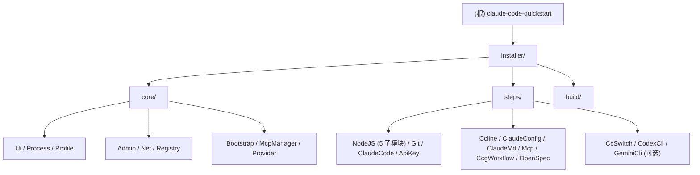

## claude-code-quickstart

> > 生成时间：2026-03-15 | 覆盖率：97% (33/34 文件)

# claude-code-quickstart -- AI 上下文索引

> 生成时间：2026-03-15 | 覆盖率：97% (33/34 文件)

Windows 10/11 平台的 **Claude Code 开发环境自动化安装器**。双阶段 PowerShell 架构，PS 5.1 引导 + PS 7 主安装/管理，13 步依赖链，实时检测机制。

---

## 架构速览

```
claude-code-quickstart/
├── installer/
│   ├── Bootstrap-ClaudeEnv.ps1   # PS 5.1 引导入口
│   ├── Install-ClaudeEnv.ps1     # PS 7+ 安装入口
│   ├── Manage-ClaudeEnv.ps1      # PS 7+ 管理入口
│   ├── build/Build-SingleFile.ps1 # 单文件打包（3 产物）
│   ├── core/                     # 10 个基础功能库
│   └── steps/                    # 13 步骤（NodeJS 含 5 子模块）
├── test-syntax.ps1               # PS7 语法校验
└── _check-syntax.ps1             # 辅助语法检查
```



---

## 步骤依赖图

```
NodeJS ─── ClaudeCode ─── ApiKey / Ccline / ClaudeConfig / Mcp
       ├── CcgWorkflow / OpenSpec / CodexCli [可选] / GeminiCli [可选]
Git (无依赖)    ClaudeMd (无依赖)    CcSwitch [可选, 依赖 ClaudeCode]
```

---

## 模块导航

| 模块 | 详细文档 | 职责 |
|------|---------|------|
| installer/ | [installer/CLAUDE.md](installer/CLAUDE.md) | 双入口脚本（安装/管理）、步骤注册表 |
| installer/core/ | [installer/core/CLAUDE.md](installer/core/CLAUDE.md) | 10 个核心基础库（含 Registry + McpManager + Provider） |
| installer/steps/ | [installer/steps/CLAUDE.md](installer/steps/CLAUDE.md) | 13 个安装步骤模块（NodeJS 含 5 子模块，含 Update 函数） |

---

## 关键约束（HC）速查

| 约束 | 内容 |
|------|------|
| **HC-12** | ApiKey 管 API 连接：`env.ANTHROPIC_AUTH_TOKEN` + `env.ANTHROPIC_BASE_URL` + 可选模型环境键（`ANTHROPIC_DEFAULT_HAIKU_MODEL` / `ANTHROPIC_DEFAULT_OPUS_MODEL` / `ANTHROPIC_DEFAULT_SONNET_MODEL`）+ `providers/` Profile 文件；供应商管理通过 `Manage → 供应商管理` 完成（CRUD + 切换）；ClaudeConfig 管常用配置：语言、权限、超时、归因等（仅补缺失，不覆盖），不写入 `model`（用户自行选择）；供应商支持 智谱GLM / MiniMax / Kimi / 阿里云百炼 / 自定义 |
| **HC-4** | `$PROFILE` 编辑使用标记块 `# >>> Claude Code Quickstart >>>` / `# <<< Claude Code Quickstart <<<` |
| **HC-3** | 实时检测：每次运行都实时检测组件状态，无持久化状态文件 |
| **HC-13** | **PowerShell 数组安全**：`Set-StrictMode -Version Latest` 下，`$null.Count` 会抛异常。接收函数/cmdlet/管道返回值时**必须**用 `@()` 包裹以强制数组上下文（如 `$items = @(SomeFunction)`），禁止裸赋值后直接访问 `.Count`。返回数组的函数应使用 `return ,$array`（逗号阻止展开） |
| **HC-14** | **PS 版本约束**：`Bootstrap-ClaudeEnv.ps1` 兼容 PS 5.1+；`Install-ClaudeEnv.ps1` 和 `Manage-ClaudeEnv.ps1` 及其加载的所有 core/steps 模块**仅需兼容 PS 7.0+**，可安全使用 `ConvertFrom-Json -AsHashtable` 等 PS 7 专有特性 |
| **SC-3** | 状态指示器：`[PASS]` / `[FAIL]` / `[SKIP]` |
| **SC-5** | 错误展示：友好信息 + 按 `D` 展开技术详情 |

---

## 关键文件路径

```
~/.claude/settings.json     # Claude Code 主配置（供应商 + env + 权限）
~/.claude.json              # Claude Code 初始化标记（hasCompletedOnboarding）
~/.claude/CLAUDE.md         # 全局 Claude 工作规范（ClaudeMd 写入）
~/.claude/rules/ccq-ccgworkflow.md  # 多模型协作 + 工作流增强（CcgWorkflow 写入）
~/.claude/rules/ccq-mcp-*.md       # MCP 工具速查（McpManager 动态渲染）
~/.claude/providers/        # 供应商 Profile 目录（ApiKey 写入）
~/.ccq/mcp-meta.json        # MCP Server vault（凭据持久化 + 状态管理）
$PROFILE                    # PowerShell 配置文件（fnm）
%TEMP%\ClaudeEnvInstaller\  # 备份目录（含更新快照 update_* ）
```

---

## 快速调试

```powershell
# 验证全部文件语法
pwsh -File test-syntax.ps1

# 重新运行安装（实时检测，自动跳过已安装组件）
pwsh -File installer/Install-ClaudeEnv.ps1

# 查看步骤列表
pwsh -File installer/Install-ClaudeEnv.ps1 -ListSteps

# 管理已安装环境（更新/供应商/MCP）
pwsh -File installer/Manage-ClaudeEnv.ps1

# 查看可更新步骤
pwsh -File installer/Manage-ClaudeEnv.ps1 -Action Update -ListUpdates
```

---
> Source: [MrNine-666/claude-code-quickstart](https://github.com/MrNine-666/claude-code-quickstart) — distributed by [TomeVault](https://tomevault.io).
<!-- tomevault:4.0:gemini_md:2026-04-21 -->
