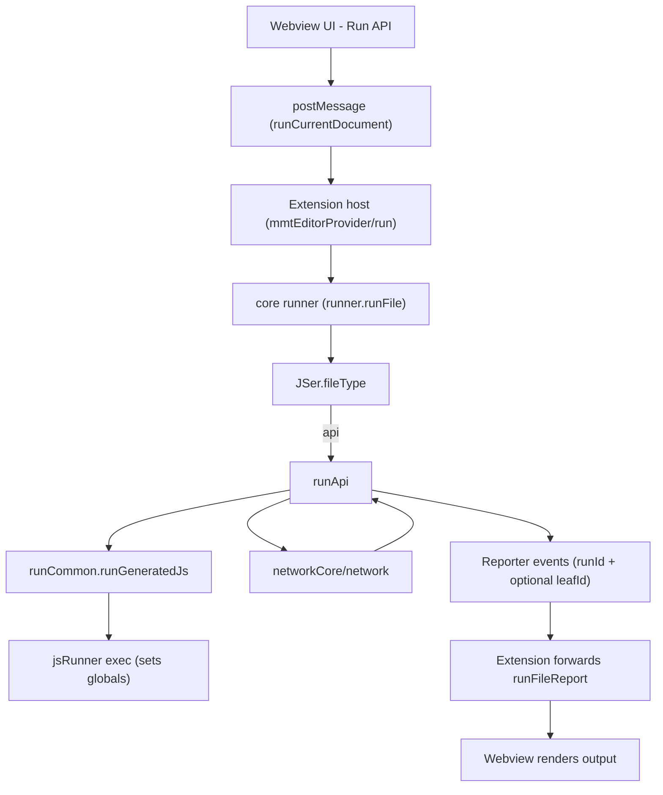
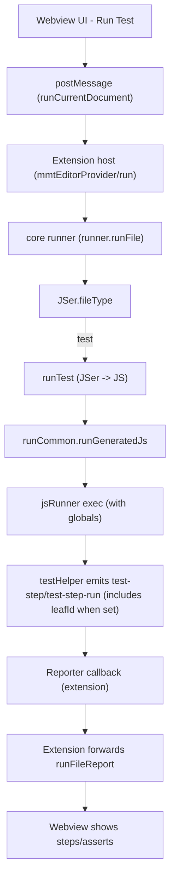
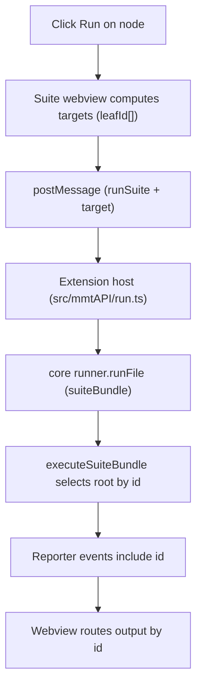

## multimeter

> - **Website**: https://mmt.dev (NOT multimeter.dev). Test server: https://test.mmt.dev

# Copilot Instructions for `multimeter` (mmt)

## Project structure & architecture
- **Website**: https://mmt.dev (NOT multimeter.dev). Test server: https://test.mmt.dev
- **Monorepo layout**:
  - `core/`: pure TypeScript library with all parsing, execution and network logic (no VS Code, no `fs` – use dependency injection).
  - `mmtview/`: React + VS Code webview UI for editing/running `.mmt` files.
  - `mmtcli/`: CLI app; binary is `testlight`, used for CI and local runs.
  - Root `src/`: VS Code extension host code (activation, editor provider, assistant, network bridge).
  - `docs/`: user-facing documentation (API, test, env, suite, CLI, convertor, etc.).
  - `AI/`: internal AI-assisted development artifacts. Not shipped to users.
    - `sdd/`: Software Design Documents (SDDs) — architectural decisions, competitive strategy, feature designs.
    - `skill/`: reusable skill/procedure documents (e.g. release & deploy workflows).
    - `doc/`: handover and context documents for AI agent sessions.
- **Single source of truth** for running `.mmt` files is `core/src/runner.ts`:
  - Use `runner.runFile({ rawFile, filePath, inputs, envvar, fileLoader, jsRunner, logger })`.
  - Do **not** reimplement parsing or execution pipelines in the extension or CLI – always go through `runner`.

## Core library (`core/`) patterns
- Keep `core` platform-neutral:
  - No imports from `vscode`, `fs`, `path`, browser APIs, or Node globals that assume a specific runtime.
  - All file access, code execution, logging, and network plumbing come in via injected functions (`fileLoader`, `jsRunner`, `logger`, etc.).
- Key modules to know:
  - `runner.ts`: orchestrates `.mmt` execution, builds API/test runners, and formats logs/docs.
  - `JSer.ts`, `testParsePack.ts`, `apiParsePack.ts`: turn YAML `.mmt` into executable JS flows.
  - `networkCore.ts`, `network.ts`, `NetworkData.ts`: HTTP/WebSocket client, message routing, and shared network config types.
  - `outputExtractor.ts` + `pathAtPosition.test.ts`: JSON/XML/xpath/jsonpath/regex extraction and “path at cursor” helpers.
  - `variableReplacer.ts`: **single source of truth** for all token-matching regex and replacement logic. All regex patterns and token accessor handling for `e:`, `i:`, `r:`, `c:` tokens (including forms like `[0]`, `[0:3]`, and `.field`) live here. Other modules (`JSerHelper`, `JSerTestFlow`, `JSerAPI`, etc.) import helpers from `variableReplacer` — they must NOT define their own token-matching regexes.
- When extending behavior:
  - First update the relevant data model types in `core/src/*Data.ts` (e.g. `APIData`, `TestData`, `NetworkConfig`).
  - Add/adjust unit tests in `core/src/*.test.ts` that cover the new pure logic.

## VS Code extension + webview
- Extension host (`src/`):
  - `extension.ts`: entrypoint; registers the `.mmt` custom editor, side panels (history, mock server, environment, certificates), and chat participants from `src/assistant.ts`.
  - `mmtEditorProvider.ts`: glue between webview messages and `runner.runFile`. It:
    - Receives `command` messages like `runCurrentDocument`, `runCurlCommand`, etc.
    - Calls `runner.runFile({ rawFile: document.getText(), filePath: document.uri.fsPath, inputs, envvar, fileLoader, jsRunner, logger })`.
  - `vscodeNetwork.ts`: adapts VS Code configuration and environment to `NetworkConfig` and bridges webview/network messages into `core`.
- Webview React app (`mmtview/src/`):
  - Uses `window.vscode.postMessage` via helpers in `vsAPI.ts` instead of importing `core` directly.
  - `text/YamlEditorPanel.tsx` drives run glyphs for `.mmt` files; it sends structured `inputs` shapes (`type: 'defaults' | 'manual' | 'exampleId' | 'exampleIndex'`) back to the extension.
  - Keep UI logic (layout, focus, interactions) here; keep parsing/execution in `core`.

## CLI (`mmtcli/`) workflow
- Entrypoint: `mmtcli/src/cli.ts` wraps `core` and exposes the `testlight` binary.
- Typical usage (see `mmtcli/README.md` and `docs/testlight.md`):
  - `npx testlight run path/to/test.mmt`
  - Pass env via `--env-file`, `--preset`, and `-e KEY=VALUE` flags; types are coerced by `coerceCliValue`/`parsePairs` in `cli.ts` (unquoted numbers/bools → numbers/bools, quoted → strings).
- If you add new CLI flags, wire them through to `runner.runFile` rather than duplicating parsing/execution.

## `.mmt` data model and docs
- `.mmt` is YAML with `type` driving behavior, parsed by `JSer.fileType`:
  - `type: api` → HTTP/WebSocket API definitions (see `docs/api-mmt.md`).
  - `type: test` → executable test flows (`call`, `assert`, `check`, etc.; see `docs/test-mmt.md`).
  - `type: env` → environment and variable files (see `docs/environment-mmt.md`).
- Converters and docs:
  - `core/src/openapiConvertor.ts`, `postmanConvertor.ts`: turn OpenAPI/Postman into `.mmt` API/test files.
  - `core/src/docHtml.ts`, `docMarkdown.ts`, `docParsePack.ts` and `res/doc-template.html`: generate HTML/Markdown API docs from `.mmt`.

## Network, logging, and errors
- All HTTP/WS traffic flows through `core/src/networkCore.ts` + `core/src/network.ts` using `NetworkConfig` from `NetworkData.ts`.
- HTTP helpers always return a structured `HttpResponse`; network-level failures are normalized (e.g. `status = -1`, descriptive `statusText`) so callers can distinguish unreachable hosts from HTTP errors.
- API runs use `buildApiRunnerWrapper` in `runner.ts`:
  - Log `Request`, `Response`, `Environment`, and `Inputs` sections with consistent key/value formatting.
  - If `status < 0`, the wrapper throws after logging so `RunResult.success` is `false`.
- When extending logs, reuse helpers from `createApiLogHelpers` instead of ad-hoc `console.log`, and treat logs as append-only (especially in the extension output channel).

## Workflow / agent rules

- Do **NOT** create, stage, or push git commits unless the user explicitly asks you to do so. Always ask for confirmation before running any `git add`, `git commit`, or `git push` operations. You may edit files in the workspace to make suggested changes, but do not record those changes in version control until the user gives explicit permission. When edits are made without committing, clearly list the modified files and the intended commit message so the user can approve.

### Release workflow

When the user says **"release version X.Y.Z"** (or "release version X.Y.Z pre-release"):

1. Update the `version` field in the root `package.json` to `X.Y.Z`.
2. Update CHANGELOG.md based on commits (consider adding change log of previous versions if missed)
3. Stage all changes and create a git commit with the message: `Release version X.Y.Z`.
4. Run `vsce package` at the repo root to produce the `.vsix`.
   - If the user said **pre-release**, run `vsce package --pre-release` instead.

## Build, test, and packaging
- From repo root:
  - `npm run compile --silent` – build all apps (core, extension, webview, CLI) via the shared pipeline.
  - `npm run test` – run Jest tests (mostly `core/src/*.test.ts`).
- VS Code extension packaging: run `vsce package` at the repo root to create the `.vsix`.
- Avoid per-package custom build scripts; integrate new build steps into the root `package.json`.

## Conventions and change strategy
- Style:
  - 2-space indentation, no tabs; always use braces even for single-line `if`/loops.
  - Always use curly braces for all control structures (e.g. `if`, `else`, `for`, `while`, `do`, `switch`, etc.), even when the body is a single line. This avoids ambiguous or hard-to-read one-line constructs.
  - Keep `core` free of editor/FS/UI dependencies; put VS Code, `fs`, browser, and React code in `src/` or `mmtview/` instead.
  - Commit message style: short, imperative (`Add test auto complete`, `Improve UI of doc view`).
- Change flow:
  - Prefer implementing behavior in `core` first, then wiring it to the extension (`src/`), webview (`mmtview/`), CLI (`mmtcli/`), and finally updating docs under `docs/`.
  - Before refactoring shared APIs like `runner.runFile` or network helpers, search call sites in:
    - `core/src/runner.ts`, `src/mmtEditorProvider.ts`, `src/assistant.ts`, `src/vscodeNetwork.ts`, `mmtcli/src/cli.ts`, `mmtview/src/**`.
  - For new user-facing features (commands, panels, assistant behaviors), keep CLI and VS Code behavior aligned when reasonable and document any intentional differences.

## Real execution flows (current code)

This section captures the current runtime flow through the webview → extension host → `core` runner, including how `leafId` is used end-to-end for suite targeting and report routing.

### Run an API `.mmt` file (`type: api`)



Notes:
- Plain API runs generally don’t originate a `leafId`.

### Run a Test `.mmt` file (`type: test`)



### Run a Suite `.mmt` file (`type: suite`) - suite bundle run (current)

```mermaid
flowchart TD
  A["Suite webview - Run Suite"] --> B["postMessage (runSuite)"]
  B --> C["Extension host (src/mmtAPI/run.ts)"]
  C --> C0["Build suite hierarchy (core/suiteHierarchy)"]
  C0 --> C1["Build suite bundle (core/suiteBundle)"]
  C1 --> D["core runner (runner.runFile + suiteBundle + suiteTargets)"]
  D --> E["executeSuiteBundle"]
  E --> S0["Reporter: scope=suite-run-start"]
  E --> G["Reporter: scope=suite-item + id (running/passed/failed)"]
  E --> H["For each runnable node: run as child with runId + id"]
  H --> D
  D --> I["Child events (test-step/test-step-run/api logs) include id"]
  S0 --> J0["Extension maps to command=suiteRunStart"]
  G --> J1["Extension forwards command=runFileReport"]
  I --> J1
  E --> S1["Reporter: scope=suite-run-finished"]
  S1 --> J2["Extension maps to command=suiteRunEnd"]
  J0 --> K["Webview updates UI"]
  J1 --> K
  J2 --> K

Notes:
- A suite entry can resolve to a `type: test` file or another `type: suite` file. Both are runnable bundle node kinds.
- Targeting is by a single `target` **node id** (webview sends `target: string`), not a `leafId[]`.
- Execution semantics: bundle is traversed sequentially at the top-level, but `group` children run in parallel (mirrors `then` stage behavior).
- Child `runId` values are generated per runnable node and are stable enough for routing within a run.
```

### Run a subtree / node in the suite tree (partial run)

Per-item Run buttons send a single `target: string` (the bundle node `id`). The extension passes this into `suiteBundle.createSuiteBundle({ target })`, and core executes the subtree rooted at `target`.



Notes:
- The bundle is built in the extension using `core` helpers, but execution happens in `core`.
- The UI must never invent ids for targeting; only deterministic bundle node `id`s are valid targets.

## Suite bundle (current)

Suite runs are executed via a core-native **suite bundle** runner.

- **Node identity**: `id` is the single end-to-end identifier for runnable nodes.
- **Lifecycle**: core emits `scope: 'suite-run-start'` / `scope: 'suite-run-finished'` reporter events.
- **Per-item**: core emits `scope: 'suite-item'` with `status: 'running' | 'passed' | 'failed'` and the related `id`.
- **Step routing**: child runs receive `id`, and downstream test-step events should be routed by `id` (extension currently backfills `id` using `runId` mapping when needed).

---
> Source: [mshobeyri/multimeter](https://github.com/mshobeyri/multimeter) — distributed by [TomeVault](https://tomevault.io).
<!-- tomevault:4.0:gemini_md:2026-06-18 -->
