## xbot

> > **本文档为 AI 辅助开发优化而设计**

# xbot - 智能微信机器人系统

> **本文档为 AI 辅助开发优化而设计**
> 最后更新：2026-01-22 18:38:56

---

## ⚠️ 重要：AI 开发规范

### 强制使用 auto-doc 技能

**所有代码变更必须使用 `/auto-doc` 技能自动维护文档**

当进行以下操作时，**必须**在完成后立即调用 `/auto-doc`：

- ✅ 创建新文件
- ✅ 修改现有文件
- ✅ 删除文件
- ✅ 移动/重命名文件
- ✅ 重构代码结构

**使用方法**：
```bash
# 在完成代码修改后执行
/auto-doc
```

**auto-doc 技能说明**：详见 [/auto-doc/SKILL.md](/auto-doc/SKILL.md)

**为什么强制使用**：
- 📝 自动维护三层文档体系（ARCHITECTURE.md、INDEX.md、文件头注释）
- 🔄 确保文档与代码同步
- 🎯 提升代码可维护性
- 📚 为后续 AI 辅助开发提供准确上下文

---

## 📋 变更记录 (Changelog)

### 2026-01-22 18:38:56 - 文档同步：路由契约与统计对齐
- **对齐当前事实**：更新统计数据、关键路径与示例语义（排除 plugins/ 文档）
- **补充管理后台说明**：新增路由注册中心（registry.py）与契约自检工具（tools/route_audit.py）指引
- **修正文档偏差**：对齐 WebChat API 端点说明；修正 README 插件示例返回值语义（True=继续，False=停止）

### 2026-01-22 10:44:12 - 项目文档更新
- **完成全仓清点**：识别 8 个核心模块，12 个插件目录
- **统计数据更新**：186 个配置/代码文件，46,733 行 Python 代码，152 个 Python 文件
- **文档覆盖率**：8/8 核心模块已有 CLAUDE.md（100% 覆盖）
- **导航体系**：所有模块文档已包含面包屑导航
- **Mermaid 图表**：根级文档已包含完整的模块结构图

### 2026-01-22 09:27:29 - 项目文档初始化完成
- **完成全仓清点**：识别 8 个核心模块，13 个插件目录
- **统计数据更新**：188 个配置/代码文件，47,271 行 Python 代码
- **文档覆盖率**：8/8 核心模块已有 CLAUDE.md（100% 覆盖）
- **导航体系**：所有模块文档已包含面包屑导航
- **Mermaid 图表**：根级文档已包含完整的模块结构图

### 2026-01-20 - 统一依赖注入机制
- **修复系统更新功能**：解决"更新进度管理器不可用"错误
- **新增 `init_app_state()` 函数**：统一管理所有全局依赖注入
- **修复导入路径**：修正 `admin.update_with_progress` 模块导入
- **优化依赖管理**：所有依赖通过 `app.state` 统一获取
- **更新文档**：添加依赖注入机制说明到 admin/CLAUDE.md

### 2026-01-20 12:42:09 - 核心模块文档更新（排除插件）
- **新增 bot_core/ 模块文档**：详细说明重构后的 7 个子模块（约 983 行）
- **更新 adapter/ 模块文档**：补充 base.py 基类说明（约 3,170 行）
- **更新 utils/ 模块文档**：更新代码统计（32 个文件，约 9,263 行）
- **确认其他模块文档**：WechatAPI、database、admin 模块文档已完善
- **代码统计更新**：核心模块（不含插件）约 132 个 Python 文件

### 2026-01-19 21:10:00 - 架构文档重构
- **聚焦核心架构**：简化插件系统描述，突出核心模块
- **更新模块统计**：113 个核心 Python 文件，56 个插件
- **优化 Mermaid 图**：清晰展示核心模块关系
- **补充容器化信息**：Docker 部署与 Redis 集成

### 2026-01-18 20:57:24 - 初始化 AI 上下文文档
- 创建根级 CLAUDE.md 及模块级文档
- 完成项目结构扫描与架构分析
- 建立模块索引与导航体系

---

## 🎯 项目愿景

xbot 是一个**基于微信协议的智能机器人系统**，通过插件化架构和多平台适配器设计，提供了以下核心能力：

- **智能对话**：集成多种 AI 平台（Dify、OpenAI、FastGPT、SiliconFlow 等）
- **插件生态**：内置 13 个插件（`plugins/`），并支持通过插件市场扩展更多能力
- **多协议支持**：支持 pad/ipad/mac/ipad2/car/win 等多种微信协议版本
- **管理后台**：基于 FastAPI + Bootstrap 5 的 Web 管理界面
- **容器化部署**：Docker + Docker Compose 开箱即用

**设计哲学**：通过事件驱动的插件系统与优先级调度机制，实现灵活、可扩展、高可维护性的机器人服务。

---

## 🏗️ 架构总览

### 技术栈

| 层级 | 技术选型 |
|------|----------|
| **语言** | Python 3.11+ |
| **Web 框架** | FastAPI + Uvicorn |
| **数据库** | SQLite (aiosqlite) + SQLAlchemy ORM |
| **缓存** | Redis (aioredis) |
| **消息队列** | RabbitMQ (可选，aio_pika) |
| **任务调度** | APScheduler (AsyncIOScheduler) |
| **日志系统** | Loguru |
| **前端** | Bootstrap 5 + Chart.js + Vue 3 |
| **容器化** | Docker + Docker Compose |
| **微信协议** | xywechatpad-binary (多版本支持) |

### 核心架构原则

- **SOLID**：单一职责、开闭原则、依赖倒置
- **DRY**：代码复用通过 `utils/` 模块与基类实现
- **KISS**：插件通过装饰器快速开发，降低心智负担
- **YAGNI**：功能通过插件按需启用，核心保持精简

### 系统分层

```
┌─────────────────────────────────────────┐
│        Web 管理后台 (FastAPI)           │
│    - 插件管理 - 文件管理 - 监控面板      │
├─────────────────────────────────────────┤
│       适配器层 (Adapter Layer)          │
│  QQ | Telegram | Web | Windows         │
├─────────────────────────────────────────┤
│        核心调度 (bot_core/)             │
│  - 消息路由 - 事件分发 - 优先级队列      │
├─────────────────────────────────────────┤
│       插件系统 (Plugin System)          │
│  13 个内置插件 | 装饰器驱动 | 热加载支持  │
├─────────────────────────────────────────┤
│     WechatAPI 客户端 (封装层)           │
│  好友 | 群聊 | 朋友圈 | 红包 | 登录      │
├─────────────────────────────────────────┤
│      数据持久化 (Database Layer)        │
│  SQLite | Redis | KeyvalDB | MessageDB │
└─────────────────────────────────────────┘
```

---

## 📊 模块结构图

```mermaid
graph TD
    A["xbot 项目根目录"] --> B["核心引擎"];
    A --> C["插件系统"];
    A --> D["管理后台"];
    A --> E["适配器层"];
    A --> F["基础设施"];

    B --> B1["bot_core/<br/>986 行 | 核心调度引擎"];
    B --> B2["main.py<br/>477 行 | 程序入口"];
    B --> B3["WechatAPI/<br/>微信客户端封装"];

    C --> C1["plugins/<br/>13 个内置插件"];
    C --> C2["utils/plugin_manager.py<br/>581 行 | 插件管理器"];
    C --> C3["utils/plugin_base.py<br/>插件基类"];

    D --> D1["admin/server.py<br/>279 行 | FastAPI 后台"];
    D --> D2["admin/routes/<br/>模块化路由"];
    D --> D3["admin/static/<br/>前端资源"];

    E --> E1["adapter/qq<br/>QQ 适配器"];
    E --> E2["adapter/tg<br/>Telegram 适配器"];
    E --> E3["adapter/web<br/>Web 适配器"];
    E --> E4["adapter/win<br/>Windows 适配器"];

    F --> F1["database/<br/>数据持久化"];
    F --> F2["utils/<br/>工具模块"];
    F --> F3["Docker<br/>容器化部署"];

    click B1 "./bot_core/CLAUDE.md" "查看核心调度文档"
    click C1 "./plugins/CLAUDE.md" "查看插件系统文档"
    click D1 "./admin/CLAUDE.md" "查看管理后台文档"
    click E1 "./adapter/CLAUDE.md" "查看适配器文档"
    click F1 "./database/CLAUDE.md" "查看数据层文档"
    click F2 "./utils/CLAUDE.md" "查看工具模块文档"
    click B3 "./WechatAPI/CLAUDE.md" "查看 WechatAPI 文档"

    style B1 fill:#e1f5ff
    style D1 fill:#fff3e0
    style C2 fill:#f3e5f5
    style E1 fill:#e8f5e9
```



---

## 📚 模块索引

| 模块路径 | 职责 | 核心文件 | 代码量 | 文档链接 |
|---------|------|----------|--------|---------|
| **核心引擎** | 启动编排、消息调度、插件协调 | `bot_core/` | 986 行（7 文件） | [详细文档](./bot_core/CLAUDE.md) |
| **主程序** | 启动流程、配置管理、监控重启 | `main.py` | 477 行 | - |
| **WechatAPI/** | 微信协议封装（好友/群聊/朋友圈） | `Client/*.py` | 12 个文件 | [详细文档](./WechatAPI/CLAUDE.md) |
| **plugins/** | 内置插件（默认 13 个，可通过插件市场扩展） | 各插件 `main.py` | 13 个插件 | [详细文档](./plugins/CLAUDE.md) |
| **admin/** | Web 管理后台（FastAPI，已重构） | `server.py` | 279 行 | [详细文档](./admin/CLAUDE.md) |
| **adapter/** | 多平台适配器（QQ/TG/Web/Win） | `loader.py` | 120 行 | [详细文档](./adapter/CLAUDE.md) |
| **database/** | 数据持久化（SQLite/Redis） | `*.py` | 8 个 Python 文件 | [详细文档](./database/CLAUDE.md) |
| **utils/** | 工具函数库（装饰器/日志/性能监控） | `*.py` | 32 个 Python 文件 | [详细文档](./utils/CLAUDE.md) |
| **docs/** | 用户手册与开发指南 | `*.md` | 12 个文档 | - |
| **Docker** | 容器化部署配置 | `Dockerfile`, `docker-compose.yml` | - | - |

**统计数据**：
- Python 文件（不含 plugins/）：137 个（36,639 行）
- Python 文件（含 plugins/）：158 个（48,377 行）
- 配置/源码文件（.py/.toml/.yml/.yaml/.json/.ini/.cfg/.conf，排除 .git 与 __pycache__，含 plugins/）：197 个
- plugins/ 内置插件目录：13 个（支持插件市场扩展）
- 核心关键文件行数：bot_core/ 986 + main.py 477 + utils/plugin_manager.py 581 ≈ 2,044 行

---

## 🚀 运行与开发

### 快速启动（Docker 推荐）

```bash
# 使用官方镜像
docker-compose up -d

# 访问管理后台
http://localhost:9090
```

### 本地开发

```bash
# 1. 安装依赖
pip install -r requirements.txt

# 2. 配置文件
cp main_config.template.toml main_config.toml
# 编辑 main_config.toml，设置管理员、协议版本等

# 3. 启动 Redis
redis-server

# 4. 启动主程序
python main.py
```

### 环境要求

- Python 3.11+
- Redis 5.0+
- FFmpeg（语音处理）
- Docker（可选，用于容器化）

---

## 🔑 核心模块详解

### 1. 核心调度引擎（bot_core/）

**职责**：
- 启动编排（加载配置、初始化客户端、登录、服务初始化、消息监听）
- 消息接收与预处理
- 事件分发到插件系统（EventManager）
- 插件优先级调度与消息路由（ReplyRouter）

**关键入口**（见 `bot_core/orchestrator.py`）：
```python
from bot_core import bot_core

async def main():
    await bot_core()  # 6 阶段启动编排，内部阻塞监听消息
```

**启动流程**：
```
main.py → bot_core() → 初始化 WechatAPI → 加载插件 → 启动消息循环
```

---

### 2. 插件系统（plugins/ + utils/plugin_manager.py）

**设计模式**：
- **装饰器驱动**：通过 `@on_text_message(priority=80)` 注册事件处理器
- **优先级队列**：0-99，值越高越优先（默认 50）
- **热加载支持**：运行时启用/禁用插件

**插件开发示例**：
```python
from utils.plugin_base import PluginBase
from utils.decorators import on_text_message

class MyPlugin(PluginBase):
    description = "我的插件"
    author = "作者名"
    version = "1.0.0"

    @on_text_message(priority=80)
    async def handle_text(self, bot, message: dict):
        if message["content"] == "你好":
            await bot.send_text(message["wxid"], "你好！")
            return False  # 停止后续插件处理
        return True  # 继续执行
```

**插件统计**（内置 13 个）：
- AI 平台插件：Dify、DifyConversationManager
- 娱乐插件：FishingPlugin、RandomPicture
- 工具插件：DependencyManager、ManagePlugin、FileDownloader、FileUploadTest、Reminder、VideoSender
- 系统插件：BotStatus、GroupMonitor、GroupWelcome

详细列表见 [plugins/CLAUDE.md](./plugins/CLAUDE.md)

---

### 3. 管理后台（admin/）

**架构亮点**（2026-01-19 重构完成）：
- **模块化路由**：从 9,153 行巨型文件拆分为 13 个独立模块
- **代码减少 97%**：主文件从 391KB 减少到 11KB
- **功能域拆分**：pages、system、plugins、files、contacts、misc

**核心功能**：
- 插件管理：启用/禁用/配置编辑
- 系统监控：CPU/内存/磁盘实时图表
- 文件管理：上传/下载/删除
- 账号管理：多微信账号切换
- 终端管理：Web 终端 WebSocket

**技术栈**：
- 后端：FastAPI + Jinja2
- 前端：Bootstrap 5 + Vue 3 + Chart.js

详细文档见 [admin/CLAUDE.md](./admin/CLAUDE.md)

---

### 4. 适配器层（adapter/）

**支持平台**：
- **QQ**：OneBot 协议
- **Telegram**：Bot API
- **Web**：WebSocket 聊天
- **Windows**：本地通知

**统一消息格式**：
```python
{
    "platform": "qq",            # 平台标识
    "wxid": "user_id",           # 发送者 ID
    "roomid": "group_id",        # 群组 ID（私聊时为空）
    "content": "消息内容",
    "type": 1,                   # 消息类型（1=文本, 3=图片）
    "timestamp": 1234567890,
    "isSelf": False,
    "nickname": "发送者昵称"
}
```

详细文档见 [adapter/CLAUDE.md](./adapter/CLAUDE.md)

---

### 5. 数据持久化（database/）

**数据库模块**：
- `XYBotDB.py`：主数据库（用户、群组、配置）
- `keyvalDB.py`：键值存储（缓存、临时数据）
- `messsagDB.py`：消息历史记录
- `message_counter.py`：消息统计
- `contacts_db.py`：联系人数据库
- `group_members_db.py`：群成员数据库

**技术选型**：
- SQLite + aiosqlite（异步）
- SQLAlchemy ORM
- Redis（缓存与消息队列）

详细文档见 [database/CLAUDE.md](./database/CLAUDE.md)

---

### 6. 工具模块（utils/）

**核心工具**：
- `decorators.py`：事件装饰器、定时任务装饰器
- `event_manager.py`：事件发布订阅、优先级队列
- `plugin_manager.py`：插件加载、启用、禁用
- `config_manager.py`：统一配置管理
- `logger_manager.py`：日志系统初始化
- `performance_monitor.py`：性能监控（CPU/内存/磁盘）
- `reply_router.py`：消息路由与分发
- `notification_service.py`：通知服务（PushPlus）

详细文档见 [utils/CLAUDE.md](./utils/CLAUDE.md)

---

## 🧪 测试策略

**当前状态**：项目暂无独立的测试目录（未检测到 `tests/` 目录）。

**建议**：
- 为核心模块（`bot_core/`, `utils/plugin_manager.py`）添加单元测试
- 使用 `pytest` + `pytest-asyncio` 测试异步逻辑
- 插件开发时编写示例测试用例（参考现有内置插件目录）

**测试示例**：
```bash
# 安装测试依赖
pip install pytest pytest-asyncio pytest-cov

# 运行测试
pytest tests/ -v --cov=.

# 生成覆盖率报告
pytest --cov-report=html
```

---

## 📐 编码规范

### 代码风格

项目使用 `pyproject.toml` 定义的格式化工具：

- **Black**：代码格式化（行长度 100）
- **isort**：导入排序（profile=black）
- **flake8**：代码检查
- **mypy**：类型检查（渐进式，当前未强制）

**建议命令**：
```bash
# 格式化代码
black .

# 排序导入
isort .

# 类型检查
mypy .
```

### 插件开发规范

参考 `docs/插件开发指南.md`，关键原则：

1. **继承 `PluginBase`**：所有插件必须继承 `utils/plugin_base.py`
2. **使用装饰器**：通过 `@on_text_message(priority=N)` 注册事件处理器
3. **优先级控制**：0-99，值越高越优先（默认 50）
4. **配置文件**：`config.toml` 必须包含 `[basic] enable = true/false`
5. **元数据**：设置 `description`, `author`, `version` 属性

---

## 🐳 容器化部署

### Docker 镜像

**官方镜像**：`nanssye/xbot:latest`

**Dockerfile 特性**：
- 基础镜像：`python:3.11-slim`
- 内置 Redis Server
- 预装 FFmpeg（语音处理）
- 支持 7z/unrar（文件解压）
- 时区：Asia/Shanghai

### Docker Compose 配置

```yaml
services:
  allbot:
    image: nanssye/xbot:latest
    container_name: allbot
    restart: unless-stopped
    ports:
      - "9090:9090"  # 管理后台
    volumes:
      - allbot:/app
      - redis_data:/data/redis  # Redis 持久化
```

**启动命令**：
```bash
docker-compose up -d
```

**查看日志**：
```bash
docker logs -f allbot
```

---

## 🤖 AI 使用指引

### 高频操作场景

#### 1. 添加新插件
**路径**：`plugins/YourPlugin/`
**参考**：`plugins/BotStatus/`、`plugins/RandomPicture/`、`plugins/Reminder/`
**关键文件**：
- `__init__.py`（导出插件类）
- `main.py`（插件逻辑）
- `config.toml`（配置项）
- `README.md`（功能说明）

#### 2. 修改核心调度逻辑
**路径**：`bot_core/`（入口：`bot_core/orchestrator.py`）
**注意事项**：
- 阅读现有消息分发逻辑（`ReplyRouter`, `EventManager`）
- 避免破坏优先级队列机制
- 测试多插件并发场景

#### 3. 扩展 WechatAPI 功能
**路径**：`WechatAPI/Client/`
**模块划分**：
- `friend.py`：好友相关
- `chatroom.py`：群聊相关
- `pyq.py`：朋友圈相关
- `hongbao.py`：红包相关
- `login.py`：登录认证

#### 4. 管理后台新增功能
**路径**：`admin/routes/`
**技术栈**：
- 后端：FastAPI 路由 + Jinja2 模板
- 前端：Bootstrap 5 + Vue 3（部分页面）
- API 规范：RESTful 风格

### 关键设计模式

| 模式 | 应用位置 | 作用 |
|------|---------|------|
| **单例模式** | `database/XYBotDB.py` | 全局唯一数据库连接 |
| **装饰器模式** | `utils/decorators.py` | 事件处理器注册 |
| **工厂模式** | `utils/plugin_manager.py` | 插件动态加载 |
| **观察者模式** | `utils/event_manager.py` | 事件发布/订阅 |
| **策略模式** | `adapter/loader.py` | 多平台适配器切换 |

### 性能优化建议

- **异步优先**：所有 I/O 操作使用 `async/await`
- **数据库连接池**：通过 `ThreadPoolExecutor` 避免阻塞
- **Redis 缓存**：热点数据（联系人列表、配置）使用 Redis
- **消息队列**：高并发场景启用 RabbitMQ（配置 `enable-rabbitmq = true`）

---

## 🔍 常见开发问题

### Q1: 如何调试插件不生效？
1. 检查 `config.toml` 中 `enable = true`
2. 查看 `main_config.toml` 中是否在 `disabled-plugins` 列表
3. 查看日志文件 `logs/allbot_*.log` 中的插件加载信息
4. 确认装饰器优先级未被其他插件覆盖

### Q2: 如何添加新的微信协议版本？
1. 在 `WechatAPI/Client/` 中扩展协议适配逻辑
2. 修改 `main_config.toml` 中 `[Protocol] version` 配置
3. 确保协议服务端（如 XYWechatPad）已部署并配置正确

### Q3: 数据库迁移怎么处理？
当前使用 SQLAlchemy 的 `create_all()` 自动建表，不支持复杂迁移。
**建议**：使用 Alembic 进行版本化迁移管理（未集成，需手动添加）。

### Q4: 如何实现定时任务？
使用 `@schedule` 装饰器（基于 APScheduler）：
```python
from utils.decorators import schedule

@schedule('cron', hour=8, minute=0)
async def morning_task(self, bot):
    # 每天早上 8:00 执行
    pass
```

### Q5: 如何查看系统资源占用？
访问管理后台 → 系统监控页面，或使用 API：
```bash
curl http://localhost:9090/api/system/stats
```

---

## 📦 依赖管理

核心依赖（见 `pyproject.toml` 和 `requirements.txt`）：

| 依赖 | 版本 | 用途 |
|------|------|------|
| fastapi | ~0.110.0 | Web 框架 |
| uvicorn | ~0.30.0 | ASGI 服务器 |
| loguru | ~0.7.3 | 日志系统 |
| SQLAlchemy | ~2.0.37 | ORM |
| aiosqlite | ~0.20.0 | 异步 SQLite |
| APScheduler | ~3.11.0 | 任务调度 |
| redis | >=4.2.0 | Redis 客户端 |
| aio_pika | >=9.0.0 | RabbitMQ 客户端 |
| pillow | ~10.4.0 | 图片处理 |
| pydantic | ~2.10.5 | 数据验证 |
| websockets | >=10.0 | WebSocket 支持 |

**插件额外依赖**：部分插件可能有独立的 `requirements.txt`（以各插件目录为准）。

---

## 🎓 学习路径（新手向）

1. **从示例插件开始**：阅读 `plugins/BotStatus/`、`plugins/RandomPicture/`、`plugins/Reminder/`
2. **理解装饰器机制**：`utils/decorators.py` + `utils/event_manager.py`
3. **掌握数据持久化**：`database/XYBotDB.py` 的 CRUD 操作
4. **深入核心调度**：`bot_core/` 的消息处理流程（入口：`bot_core/orchestrator.py`）
5. **扩展前端界面**：`admin/templates/` + `admin/static/`

---

## 📞 技术支持

- **GitHub**：[https://github.com/nanssye/xbot](https://github.com/nanssye/xbot)
- **Telegram 交流群**：[https://t.me/+--ToAPQBj-Q2YjM1](https://t.me/+--ToAPQBj-Q2YjM1)
- **文档中心**：`docs/` 目录下的详细手册

---

## ⚠️ 免责声明

本项目仅供学习交流使用，严禁用于商业用途。使用本项目所产生的一切法律责任和风险，由使用者自行承担，与项目作者无关。请遵守相关法律法规，合法合规使用本项目。

---

**构建者提示**：本文档基于 AI 自动扫描生成，聚焦核心架构。如需了解插件详情，请参考各模块的独立 `CLAUDE.md` 文件或源代码注释。

---
> Source: [NanSsye/xbot](https://github.com/NanSsye/xbot) — distributed by [TomeVault](https://tomevault.io).
<!-- tomevault:4.0:gemini_md:2026-05-06 -->
