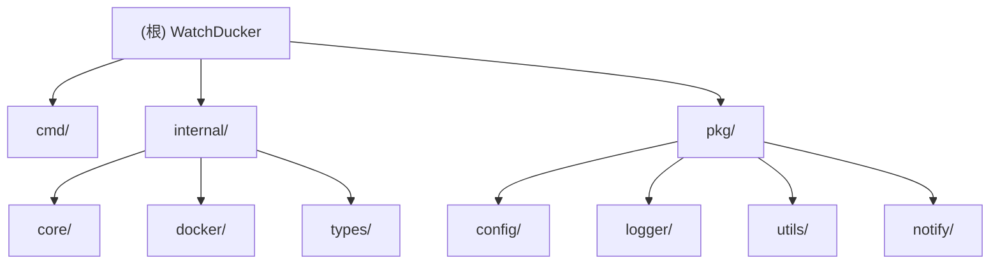

## watchducker

> > 更新时间：2025-11-17 17:41:08

# WatchDucker - Docker 容器自动更新工具

> 更新时间：2025-11-17 17:41:08

## 项目愿景

**WatchDucker** 是一个用 Go 语言编写的 Docker 容器镜像更新检查和自动更新工具，目标是简化 Docker 容器的版本管理，让容器更新变得简单智能。

## 架构总览



## 模块索引

| 模块路径 | 主要职责 | 语言 | 入口文件 | 测试状态 |
|---------|---------|------|----------|----------|
| `cmd/` | 命令行入口与调度器 | Go | `cmd.go` | 无测试 |
| `internal/core/` | 核心业务逻辑（检查器+操作器） | Go | `checker.go`, `operator.go` | 无测试 |
| `internal/docker/` | Docker API 封装与服务 | Go | `client.go`, `container.go`, `image.go` | 无测试 |
| `internal/types/` | 类型定义与数据结构 | Go | `types.go` | 无测试 |
| `pkg/config/` | 配置管理与命令行参数 | Go | `config.go` | 无测试 |
| `pkg/logger/` | 日志系统封装 | Go | `logger.go` | 无测试 |
| `pkg/notify/` | 多平台通知服务 | Go | `notify.go` | 无测试 |
| `pkg/utils/` | 工具函数与显示输出 | Go | `display.go` | 无测试 |

## 运行与开发

### 环境要求
- Go 1.25 或更高版本
- Docker 守护进程运行中
- 网络连接（用于访问镜像仓库）

### 构建方式
```bash
# 开发构建
go build -o watchducker .

# 创建 Docker 镜像
docker build -t watchducker .

# 多平台发布（使用 GoReleaser）
goreleaser build --snapshot
```

### 运行模式
- **单次模式**: `watchducker --once nginx redis`
- **定时模式**: `watchducker --cron "0 2 * * *" --label`
- **全部容器**: `watchducker --all --once`
- **标签驱动**: 通过 `watchducker.update=true` 标签管理容器
- **反向标签**: 通过 `--label-reversed` 参数检查没有 `watchducker.update=true` 标签的容器
- **镜像清理**: `watchducker --clean --once nginx` (更新后清理悬空镜像)
- **容器排除**: `watchducker --disabled-containers "container1,container2" --once` (排除指定容器)
- **通知功能**: 配置 `push.yaml` 文件或环境变量后自动推送更新结果到 15+ 种平台

## 测试策略

> ⚠️ **注意**: 当前项目缺少单元测试和集成测试
- 建议添加针对 core、docker 模块的单元测试
- 考虑添加基于 Docker 的集成测试
- 配置文件解析的测试用例

## 编码规范

- 使用标准的 Go 语言代码风格
- 统一的错误处理模式
- 模块化的包结构设计
- 清晰的接口定义和数据流

## AI 使用指引

### 适合 AI 辅助的场景
- 代码重构和性能优化建议
- 测试用例编写
- 配置解析和安全改进
- Docker API 封装的最佳实践

### 避免的自动化
- 直接修改 Docker 容器操作逻辑
- 重写核心业务逻辑而不理解上下文
- 忽略容器状态检查的安全性

## 变更记录 (Changelog)

### 2025-11-17 17:41:08
- 新增 `--label-reversed` 参数功能，支持检查没有 `watchducker.update=true` 标签的容器
- 更新配置验证逻辑，支持多种检查方式组合
- 优化命令行参数优先级逻辑
- 改进文档和示例说明

### 2025-11-15 15:30:00
- 更新项目文档，同步最新功能变更
- 完善模块索引和配置说明
- 优化文档结构和导航链接

### 2025-11-13 14:26:00
- 添加通知功能模块 `pkg/notify/`，支持 15+ 种通知方式
- 新增 `push.yaml.example` 配置文件示例
- 集成通知服务到核心业务逻辑，自动推送更新结果
- 支持多渠道同时推送，包括 Telegram、微信、钉钉、飞书、邮件等

### 2025-11-12 15:30:00
- 添加 `--clean` 参数功能，支持在容器更新后自动清理悬空镜像
- 更新配置模块支持新的命令行参数和环境变量
- 扩展核心操作器功能，集成镜像清理服务
- 更新命令行执行流程，在容器更新成功后执行镜像清理

### 2025-11-11 14:11:43
- 首次初始化 AI 上下文文档
- 分析并记录项目架构结构
- 创建模块级别的导航文档
- 识别测试缺失情况

---

**文件统计**: 13个源文件，100%覆盖主要模块
**最新功能**: 支持多平台通知推送（15+ 种方式）、反向标签选择、环境变量配置通知
**下一步扫描建议**: 无（已完整扫描所有模块）
**关键缺口**: 测试覆盖率缺失，建议添加单元测试和集成测试

---
> Source: [naomi233/watchducker](https://github.com/naomi233/watchducker) — distributed by [TomeVault](https://tomevault.io).
<!-- tomevault:4.0:gemini_md:2026-04-24 -->
