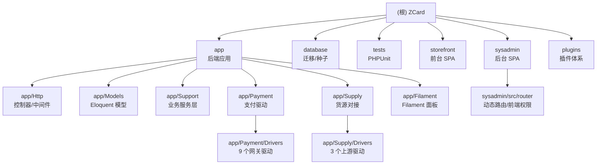

## zcard

> > 本文件由 `init-project` 自动生成，供 AI 助手快速建立全局认知。

# ZCard — AI 上下文索引（根）

> 本文件由 `init-project` 自动生成，供 AI 助手快速建立全局认知。
> 生成时间：2026-08-04 21:06:24 ｜ 仓库版本：`VERSION` = **1.9.5**

---

## 项目愿景

ZCard 是一套**现代化自动发卡 / 虚拟商品销售平台**，目标是替代传统 PHP 发卡系统（如 acg-faka、独角数卡），
以 **Laravel 13 + PHP 8.3 + Filament 5 + Vue 3** 的现代技术栈提供：

- **API-First**：所有业务能力先落在 `app/Support` 服务层与 `routes/api.php`，后台（Filament / sysadmin SPA）与前台（storefront SPA）都只是 API 的消费者。
- **开箱即用的商业化能力**：多货币、多语言、三级分销、分站/白标、优惠券、会员等级、在线更新、Web 安装向导。
- **可对接的生态位**：既能作为**下游**从上游货源（独角数卡 / acg-faka / 另一套 ZCard）拿货，也能作为**上游**对外提供供货 API（HMAC 签名）。
- **Open Core 预留**：`config/zcard.php` 中的 `features.*` 开关用于区分开源版与商业版功能。

法律声明与部署说明见 `README.md`；详细设计规格与迭代计划见 `docs/superpowers/`。

---

## 架构总览

### 分层

| 层 | 位置 | 说明 |
|---|---|---|
| 入口/路由 | `bootstrap/app.php`、`routes/api.php`、`routes/web.php` | 中间件装配、SPA 回退、全部 REST 端点 |
| HTTP 接口层 | `app/Http/Controllers`（45）、`app/Http/Middleware`（11） | 薄控制器，只做参数校验 + 调服务层 |
| 业务服务层 | `app/Support`（22 个 Service） | **真正的业务真理源**，Filament 与 API 共用 |
| 支付适配层 | `app/Payment`（2 契约 + 1 值对象 + 9 驱动） | `PaymentDriver` 接口，统一 `pay()` / `verifyCallback()` |
| 货源适配层 | `app/Supply`（契约 + 3 个驱动 + 编排服务，共 18 文件） | `SupplyDriver` 接口 + HMAC 签名 + Nonce 防重放 |
| 数据层 | `app/Models`（32 个模型）、`database/migrations`（68 个迁移） | 金额一律以「分」整数存储 |
| 事件/异步 | `app/Events`、`app/Listeners`、`app/Jobs` | `OrderPaid` 为核心事件，挂 5 个监听器 |
| 管理端 | `app/Filament`（Filament v5 面板，`/filament`） + `sysadmin/`（Vue3 SPA，`/admin`） | 两套后台并存：Filament 为开发期 CRUD，sysadmin 为正式后台 |
| 前台 | `storefront/`（Vue3 + Tailwind v4 SPA，`/`） | 编译产物落到 `public/storefront/` |
| 插件 | `plugins/` | Phase 2 规划中，当前仅骨架、未接入 |

### 关键运行链路

**下单 → 支付 → 发货**

```
POST /api/orders           OrderService::createOrder()   锁卡(lockForUpdate) → order(pending)
POST /api/payments/create  PaymentService::createPayment() → PaymentDriver::pay()
POST /api/payments/callback/{channel}
                           PaymentService::handleCallback() → verifyCallback + 金额核对 + 幂等
                           → event(OrderPaid)
                              ├─ DeliveryService              本地卡密发货（status/delete 两模式）
                              ├─ FetchFromUpstreamOnOrderPaid 上游商品去货源拿货
                              ├─ CommissionService            三级分销发佣
                              ├─ SubsiteSettlementService     分站利润入账本
                              └─ UpgradeUserGroupOnOrderPaid  会员等级升级
```

**对外供货 API（本站作上游）**：`/api/supply/*`，四头签名
`X-Supply-Key / X-Supply-Timestamp / X-Supply-Nonce / X-Supply-Signature`，
由 `SupplyAuth` + `SupplyRateLimit` 中间件守卫，签名串见 `app/Supply/HmacSigner.php`。

### 模块结构图



---

## 模块索引

| 模块路径 | 语言/技术 | 一句话职责 | 文档 |
|---|---|---|---|
| `app/` | PHP 8.3 / Laravel 13 | 后端应用总入口，聚合下列子模块（214 个 PHP 文件） | [AGENTS.md](./app/AGENTS.md) |
| `app/Http/` | PHP | 45 个控制器 + 11 个中间件，REST API 与 SPA 回退 | [AGENTS.md](./app/Http/AGENTS.md) |
| `app/Models/` | PHP / Eloquent | 32 个数据模型，金额以「分」存储 | [AGENTS.md](./app/Models/AGENTS.md) |
| `app/Support/` | PHP | 22 个业务服务（订单/支付/发货/分销/分站/货币/卡密…） | [AGENTS.md](./app/Support/AGENTS.md) |
| `app/Payment/` | PHP | 支付契约 + 9 个网关驱动（支付宝/微信/Stripe/易支付/USDT…） | [AGENTS.md](./app/Payment/AGENTS.md) |
| `app/Supply/` | PHP | 货源对接：3 个上游驱动 + HMAC 签名 + 同步/拿货编排 | [AGENTS.md](./app/Supply/AGENTS.md) |
| `app/Filament/` | PHP / Filament v5 | 开发期 CRUD 面板（`/filament`），Resources/Pages/Widgets | [AGENTS.md](./app/Filament/AGENTS.md) |
| `database/` | PHP / SQL | 68 个迁移 + 3 个 Seeder + 1 个 Factory | [AGENTS.md](./database/AGENTS.md) |
| `tests/` | PHP / PHPUnit 12 | 36 个测试文件，Unit + Feature 双套件 | [AGENTS.md](./tests/AGENTS.md) |
| `storefront/` | Vue 3 + Vite 8 + Tailwind v4 | 顾客前台 SPA，产物 → `public/storefront/` | [AGENTS.md](./storefront/AGENTS.md) |
| `sysadmin/` | Vue 3 + Element Plus + ECharts | 正式管理后台 SPA，产物 → `public/admin/` | [AGENTS.md](./sysadmin/AGENTS.md) |
| `plugins/` | PHP | 插件体系骨架（Phase 2 规划中，当前不加载） | [AGENTS.md](./plugins/AGENTS.md) |

**深挖子模块**（第二轮补扫，覆盖高风险路径）

| 模块路径 | 一句话职责 | 文档 |
|---|---|---|
| `app/Payment/Drivers/` | 9 个网关的签名口径 / 成功判据 / 金额换算矩阵 | [AGENTS.md](./app/Payment/Drivers/AGENTS.md) |
| `app/Supply/Drivers/` | 3 家上游协议对比 + 字段映射表 + 已知隐患 | [AGENTS.md](./app/Supply/Drivers/AGENTS.md) |
| `sysadmin/src/router/` | 动态路由注册链路 + 前端权限匹配规则 | [AGENTS.md](./sysadmin/src/router/AGENTS.md) |

**非模块但重要的目录**

| 路径 | 说明 |
|---|---|
| `routes/` | `api.php`（全部业务端点，335 行）、`web.php`（SPA 回退）、`console.php` |
| `config/` | 15 个配置文件，其中 `zcard.php` 为项目专有（功能开关、卡密密钥、货源参数） |
| `lang/` | `zh_CN` / `en` 后端多语言，`messages.php` 为业务文案主文件 |
| `docs/` | `superpowers/specs|plans`（设计规格与迭代计划）、`release-notes/`、`部署安装指南.md` |
| `public/admin`、`public/storefront` | **已提交仓库的前端编译产物**，生产部署无需 Node.js |
| `bootstrap/app.php` | 中间件装配、异常渲染（api/* 统一 JSON） |

---

## 运行与开发

### 安装

```bash
composer install
cp .env.example .env

# 方式一：Web 向导  → 浏览器访问 /install
# 方式二：命令行
php artisan key:generate
php artisan zcard:install                      # 交互式
php artisan zcard:install --skip-db --email=admin@example.com --password=xxx
```

### 常用命令

| 命令 | 说明 |
|---|---|
| `composer dev` | 一键并发起 serve + queue:listen + pail + vite |
| `php artisan serve` | 后端开发服务器（storefront vite 代理默认指向 `http://localhost:8092`） |
| `php artisan migrate` | 执行迁移 |
| `php artisan queue:listen` | 队列（大批量卡密导入、异步上游拿货依赖） |
| `composer test` / `php artisan test` | 跑测试（先 `config:clear`） |
| `./vendor/bin/pint` | 代码风格格式化（Laravel Pint） |
| `cd storefront && pnpm dev` / `pnpm build` | 前台开发 / 编译到 `public/storefront` |
| `cd sysadmin && pnpm dev` / `pnpm build` | 后台开发 / 编译到 `public/admin` |
| `cd sysadmin && pnpm lint` / `pnpm fix` | ESLint（sysadmin 独有） |

### 访问入口

| 入口 | 地址 |
|---|---|
| 前台商城 | `/` |
| 正式后台（sysadmin SPA，hash 路由） | `/admin` |
| Filament 面板（开发期 CRUD） | `/filament` |
| 安装向导 | `/install` |
| 健康检查 | `/api/health`、`/up` |

### 环境要求

PHP ≥ 8.3（pdo_mysql/mbstring/openssl/bcmath/curl/gd）、MySQL ≥ 8.0、Redis ≥ 6.0（可选，缺失降级 database 缓存）、Composer ≥ 2.8、Node ≥ 20.19 + pnpm（仅前端开发需要，sysadmin `engines.node` 强制校验）。

---

## 测试策略

- 框架：**PHPUnit 12**（非 Pest），配置见 `phpunit.xml`，两套件 `Unit` / `Feature`。
- 测试环境在 `phpunit.xml` 内内联注入 env：`DB_DATABASE=testing`、`CACHE_STORE=array`、`QUEUE_CONNECTION=sync`、固定 `APP_KEY` 与 `CARD_ENCRYPTION_KEY`。
- 覆盖重心（按文件数量）：**货源对接**（16 个：签名/Nonce/限流/鉴权/同步/下单/定价/回调守卫）、**分站**（7 个）、**多货币**（4 个）、**分销**（3 个）。
- 明显缺口：支付驱动（仅 `PaymentResultTest` 一个单元测试，9 个驱动无回调验签测试）、订单主流程（`OrderService` 无直接测试）、卡密加解密/导入、优惠券、认证、Filament 资源。
- 新增业务代码时的约定：**业务逻辑写在 `app/Support` 或 `app/Supply` 服务里再测**，不要把逻辑埋进控制器（不可测）。

---

## 编码规范

1. **语言**：注释、日志、异常文案、文档一律**简体中文**；标识符用英文。
2. **金额**：所有金额字段以**「分」整数**存储与传递（`amount`、`cost`、`factory_price`、`draft_premium`、`balance_cache`…）。基础货币（默认 CNY）是唯一记账真相源，展示货币仅做换算并在下单瞬间锁快照（`exchange_rate` / `amount_display`）。
3. **API-First**：控制器保持薄；共用逻辑必须落在 `app/Support/*Service`，Filament 页面与 API 控制器调同一个服务。
4. **路由注册顺序**：静态路由必须先于带参数的资源路由注册（`cards/export` 先于 `cards/{id}`、`supply-sources/drivers` 先于 `apiResource`），`routes/api.php` 中有多处显式注释说明，改动时务必保持。
5. **敏感数据**：
   - 卡密内容用 `CardCipher`（AES-256-CBC，密钥 `CARD_ENCRYPTION_KEY`，与 `APP_KEY` 解耦）加密入库，去重靠明文 sha256 存 `content_hash`。
   - `SupplySource.credentials`、`SupplierAccount.api_secret` 手动 `Crypt` 加解密，**解密失败必须降级为空并提示重配，不得让列表接口 500**（见 `SupplySource::getCredentialsAttribute`）。
6. **配置真理源**：运行时业务开关读 `StorefrontConfig`（`settings` 表，后台网页可改）；`config/zcard.php` 的 `env()` 只作首次部署兜底。基础设施配置（DB/Redis/邮件）仍在 `.env`。
7. **前端 base 路径**：`storefront` 产物 base 必须为 `/storefront/`，`sysadmin` 为 `/admin/`，与 `outDir` 层级一致，否则 index.html 引用错路径导致白屏。
8. **SPA HTML 不缓存**：`NoCacheHtml` 中间件保证更新后不会加载旧 index.html。
9. **测试与格式化**：提交前跑 `php artisan test` 与 `./vendor/bin/pint`。
10. **绝不提交** `.env`、`vendor/`、`node_modules/`（见 `.gitignore`）；但**前端编译产物 `public/admin`、`public/storefront` 需要提交**（生产免 Node）。

---

## AI 使用指引

- **改任何业务前先读对应模块 `AGENTS.md`**，再读 `docs/superpowers/specs/` 下相关设计文档（代码注释中大量出现 `spec §x.y` 引用，就是指这些文件）。
- **高风险区域**（改动需格外谨慎、务必补测）：
  - `app/Support/OrderService.php`（锁卡防超卖、分站定价、优惠券叠加）
  - `app/Support/PaymentService.php` + `app/Payment/Drivers/*`（回调验签、金额核对、幂等）
  - `app/Supply/*`（HMAC 签名串格式、Nonce 防重放、上游拿货同步/异步降级）
  - `app/Http/Middleware/SupplyAuth.php`、`ResolveSubsite.php`、`EnsureInstalled.php`（顺序敏感，`EnsureInstalled` 必须在 `StartSession` 之前）
  - `app/Http/Controllers/Api/Admin/UpdateController.php`（以 PHP 进程身份跑 `git reset --hard` / `git clean -fd` / `composer` / `chown`，唯一守卫是 `admin.role`）
- **待办隐患**（详见对应模块文档）：
  - `UsdtDriver` 元↔USDT 往返截断可能触发 `amount mismatch`（付款成功但不发货）→ `app/Payment/Drivers/AGENTS.md`
  - `update/rollback` 无锁、无二次确认、无操作人审计 → `app/Http/AGENTS.md`
- **不要**直接在控制器里写业务；**不要**用浮点表示金额；**不要**改动 `routes/api.php` 中静态路由与资源路由的相对顺序。
- 版本号维护在根 `VERSION` 文件（由 `AppHelper` 读取，不依赖 git 命令），发布记录在 `docs/release-notes/`。
- 两套后台并存是历史现状：新功能优先做在 **sysadmin SPA + API**，Filament 仅保留开发期 CRUD。

---

## 变更记录 (Changelog)

### 2026-08-04（对接复查）— acg-faka 全链路
- 基于 `/Users/mac/Project/Php/acg-faka` 源码重新通读对接流程，修掉 4 个协议 bug：
  查单路径不符合其 Kernel 拆段规则（恒 404）、`upstream_order_id` 存了我们自己的单号、
  多张卡密未按 `PHP_EOL` 拆分（买 N 张只发 1 条）、`amount` 恒 0。
- 修 `sysadmin/src/utils/http/error.ts`：原先只要有 HTTP 状态码就丢弃后端错误体，
  导致所有上游诊断信息（伪静态未配 / WAF 拦截 / 密钥错误）被替换成「服务器内部错误」。
- 补 `tests/Feature/AcgFakaDriverProtocolTest.php`（5 用例，修复前 5/5 红）；重建 `public/admin`。

### 2026-08-04（修复）— 上游驱动签名 bug
- `ZCardDriver` / `DujiaoNextDriver` 对 body 做了双重 md5，与 spec §4.2 的 `md5(rawBody)` 及服务端
  `SupplyAuth` 口径不符 → `driver=zcard` 的货源恒定 401。已修复：`signedHeaders()` 第三参改为 body 原文，
  新增 `MakesHttpRequests::encodeBody()` / `postRaw()` 保证「签名字节 == 发送字节」。
- 新增 `tests/Feature/SupplyDriverSignatureTest.php`（5 用例）。已验证：在旧代码上 5/5 红，修复后 5/5 绿。

### 2026-08-04（第二轮）— 高风险路径深挖
- 新增 3 个深挖子模块文档：`app/Payment/Drivers/`、`app/Supply/Drivers/`、`sysadmin/src/router/`。
- 扩写 `app/Support/AGENTS.md`（OrderService 精读）与 `app/Http/AGENTS.md`（UpdateController 安全边界）。
- Mermaid 结构图补 3 个子模块节点与跳转链接；「AI 使用指引」新增待办隐患清单。
- 精读文件：9 个支付驱动 + `PaymentService` + `PaymentController` + `OrderService` + 3 个货源驱动
  + `SupplyAuth` + `MakesHttpRequests` + `UpdateController` + sysadmin 路由 4 个核心文件（共 21 个）。
- 全部 `AGENTS.md` 与 `.Codex/` 已加入 `.gitignore`，不进仓库。

### 2026-08-04 21:06:24 — 初始化
- 首次生成根 `AGENTS.md` 与 12 个模块级 `AGENTS.md`。
- 建立 `.Codex/index.json`（模块索引 + 覆盖率 + 缺口清单）。
- 基线版本：`VERSION` = 1.9.5，最近提交 `a897c34 fix(v1.9.5): acg-faka ping 字段修复 + items 调试端点`。

---
> Source: [NovaWorks/ZCard](https://github.com/NovaWorks/ZCard) — distributed by [TomeVault](https://tomevault.io).
<!-- tomevault:4.0:gemini_md:2026-09-24 -->
