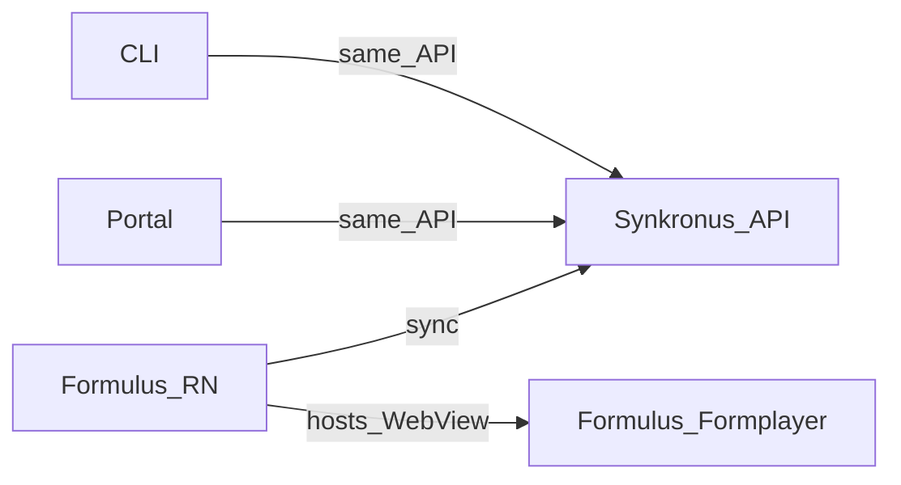

## ode

> This monorepo contains the core platform for **offline-first data collection** and **synchronization**. Use this file when you work across packages or need the big picture. For deep dives, open the **`AGENTS.md`** in the package you are changing.

# Open Data Ensemble (ODE) — AI and developer guide

This monorepo contains the core platform for **offline-first data collection** and **synchronization**. Use this file when you work across packages or need the big picture. For deep dives, open the **`AGENTS.md`** in the package you are changing.

**Published architecture (users and external readers):** [Architecture overview](https://opendataensemble.org/docs/getting-started/architecture-overview) on [opendataensemble.org](https://opendataensemble.org/).

---

## Ecosystem map

ODE is a **clearinghouse** model: data is collected on devices, synchronized through **Synkronus**, and is intended to **flow through** the system for local analysis and stewardship—not to live only on the server.

- **Formulus** — React Native mobile app: runs forms (JSON Forms) and **custom app bundles** in WebViews, offline-first, syncs with Synkronus.
- **Formulus Formplayer** — React web app embedded in Formulus: renders forms inside a WebView; shares the same bridge contract as custom apps.
- **Synkronus** — Go backend: auth, sync, app bundle distribution, export, shared HTTP API.
- **Synkronus Portal** — Web admin UI (React + Vite): same API as other clients; no privileged backend channel.
- **Synkronus CLI** — `synk` command-line client: automation, bundles, sync, export.
- **ODE Desktop** — Tauri app: **Data management** + **Forms / app workbench**; source in [`desktop/`](desktop/). See [ROADMAP.md](ROADMAP.md).



**Design principle:** [One backend, many clients](https://opendataensemble.org/docs/getting-started/architecture-overview) — prefer the public API for all user-facing tools.

---

## User profiles (what to optimize for)

| Profile | Typical focus | Where to work |
|--------|----------------|---------------|
| **Platform developer** | You are editing **this repo**: RN, Go, React, shared packages, CI. | Package `AGENTS.md` below. |
| **Custom app author** | You ship an **HTML/JS/CSS** app bundle and JSON forms for Formulus; you may **not** clone this monorepo. | [Custom app template (AI + author context)](https://github.com/OpenDataEnsemble/custom_app), [documentation](https://opendataensemble.org/docs/), and [FORM_LOCALIZATION_GUIDE.md](FORM_LOCALIZATION_GUIDE.md) for form i18n. |

Do not assume custom app authors have local checkouts of **ODE** or internal example repos.

---

## Monorepo layout

| Package | Role | Stack | Agent guide |
|---------|------|-------|-------------|
| [formulus](formulus/) | Mobile runtime, WebViews, native bridge | React Native | [formulus/AGENTS.md](formulus/AGENTS.md) |
| [formulus-formplayer](formulus-formplayer/) | Form UI in WebView | React, Vite, JSON Forms | [formulus-formplayer/AGENTS.md](formulus-formplayer/AGENTS.md) |
| [synkronus](synkronus/) | Sync API and coordination | Go | [synkronus/AGENTS.md](synkronus/AGENTS.md) |
| [synkronus-cli](synkronus-cli/) | CLI for API operations | Go | [synkronus-cli/AGENTS.md](synkronus-cli/AGENTS.md) |
| [synkronus-portal](synkronus-portal/) | Web administration | React, TypeScript, Vite | [synkronus-portal/AGENTS.md](synkronus-portal/AGENTS.md) |
| [packages/tokens](packages/tokens/) | Design tokens (`@ode/tokens`) | Style Dictionary | [packages/tokens/AGENTS.md](packages/tokens/AGENTS.md) |
| [packages/components](packages/components/) | Shared UI (`@ode/components`) | React | [packages/components/AGENTS.md](packages/components/AGENTS.md) |
| [desktop](desktop/) | Data management + Forms / app workbench (Tauri) | React, Rust | [desktop/AGENTS.md](desktop/AGENTS.md) |

---

## Release version bump checklist

Use this when preparing a new ODE release (pre-release or stable). Full tagging and CI behaviour: [RELEASE.md](RELEASE.md). Android Play/F-Droid `versionCode` rules: [formulus/android/ANDROID_RELEASE.md](formulus/android/ANDROID_RELEASE.md).

### Pre-release vs stable

| Layer | Pre-release (e.g. `v1.1.1-alpha.3`) | Stable (e.g. `v1.1.1`) |
|-------|--------------------------------------|-------------------------|
| Client manifests (`package.json`, `versionName`, CLI, Desktop, Portal) | Target semver **without** suffix (`1.1.1`) | Same (`1.1.1`) |
| Git tag + GitHub release | `v1.1.1-alpha.3` (mark **pre-release**) | `v1.1.1` |
| Synkronus Docker / server `BuildVersion()` | From release tag via CI ldflags | From release tag |

For stable, you usually **do not** re-bump client manifests if they already match the target version; bump Android `versionCode` only when shipping a new Play build.

### What to edit

| File | Field | Purpose |
|------|-------|---------|
| `formulus/package.json` | `version` | Source for `ODE_VERSION` / `x-ode-version` ([`formulus/src/version.ts`](formulus/src/version.ts)) |
| `formulus/android/app/build.gradle` | `versionCode`, `versionName` | Google Play; run `pnpm run sync:version` from `formulus/` after `package.json` bump for `versionName` |
| `formulus/ios/Formulus.xcodeproj/project.pbxproj` | `MARKETING_VERSION`, `CURRENT_PROJECT_VERSION` | iOS display + build number (align `CURRENT_PROJECT_VERSION` with Android `versionCode`) |
| `synkronus-cli/internal/cmd/version.go` | `Version` | `synk version` output |
| `synkronus-cli/versioninfo.json` | Windows file/product version | Windows binary metadata |
| `desktop/package.json`, `desktop/src-tauri/tauri.conf.json`, `desktop/src-tauri/Cargo.toml` | `version` | ODE Desktop app version (keep all three in sync) |
| `desktop/src/lib/synkConstants.ts` | `SYNKRONUS_CLIENT_VERSION` | Desktop `x-ode-version` header |
| `synkronus-portal/package.json` | `version` | Portal `x-ode-version` ([`synkronus-portal/src/version.ts`](synkronus-portal/src/version.ts)) |

**Synkronus server** version is **not** edited in source for releases — CI injects it from the git tag ([`.github/workflows/synkronus-docker.yml`](.github/workflows/synkronus-docker.yml)).

**Synkronus CLI** Docker image (`ghcr.io/opendataensemble/synkronus-cli`) is published by [`.github/workflows/synkronus-cli-docker.yml`](.github/workflows/synkronus-cli-docker.yml) on release; confirm GHCR tags alongside GitHub Release CLI binaries.

### Increment rules

- **Semver:** bump `MAJOR.MINOR.PATCH` in client manifests to match the release line (e.g. `1.1.1`).
- **Android `versionCode`:** must increase monotonically for Google Play (+10 per release is a common convention; +1 per shipped alpha build is also fine).
- **In-app version display:** Formulus About/Settings use native `versionName` + `versionCode` via [`AppVersionService`](formulus/src/services/AppVersionService.ts); Desktop About uses Tauri `getVersion()`.

### Commands

```bash
# After bumping formulus/package.json
cd formulus && pnpm run sync:version

# Pre-flight on touched JS packages
cd formulus-formplayer && pnpm run lint && pnpm run format:check
cd formulus && pnpm run lint && pnpm run format:check
cd desktop && pnpm run lint && pnpm run format:check && pnpm run typecheck && pnpm test
cd synkronus-cli && go build ./cmd/synkronus && ./synk version   # or synkronus-cli.exe on Windows
```

### Do not bump

- `FORMULUS_INTERFACE_VERSION` in [`formulus/src/webview/FormulusInterfaceDefinition.ts`](formulus/src/webview/FormulusInterfaceDefinition.ts) — WebView bridge API contract, not app release version
- `formulus-formplayer/package.json` — embedded library semver
- OpenAPI document version comments in generated API clients
- `synkronus-cli/internal/config/config.go` default `api.version` — Synkronus **API contract** major version for compatibility checks, not CLI display version

### Tag and publish

```bash
git tag v1.1.1-alpha.3    # or v1.1.1 for stable
git push origin v1.1.1-alpha.3
# GitHub → Releases → publish (pre-release checkbox for alpha/rc tags)
```

---

## Cross-cutting contracts

- **Formulus ↔ WebView (custom apps + formplayer):** [`formulus/src/webview/FormulusInterfaceDefinition.ts`](formulus/src/webview/FormulusInterfaceDefinition.ts) is the **source of truth** for the injected JavaScript API. Formplayer copies a synced TypeScript snapshot via `pnpm run sync-interface` in `formulus-formplayer` (see [formulus-formplayer/AGENTS.md](formulus-formplayer/AGENTS.md)).
- **ODE Desktop workbench developer mode:** local custom app mirror under `bundles/dev-local/` (profile-scoped); see [desktop/AGENTS.md](desktop/AGENTS.md) and [developer mode guide](https://opendataensemble.org/docs/guides/ode-desktop-developer-mode).
- **Built-in attachment fields:** `photo`, `audio`, `video`, and generic file (`select_file`) persist attachment **basenames** (and metadata) in observation JSON while binaries live under Formulus **`attachments/`** storage and sync via the attachment pipeline—see published docs ([form specifications](https://opendataensemble.org/docs/reference/form-specifications), [form design guide](https://opendataensemble.org/docs/guides/form-design)) and [`FormulusInterfaceDefinition.ts`](formulus/src/webview/FormulusInterfaceDefinition.ts).
- **Custom app bridge (v1.1.0+):** `persistObservation` (headless write), `sync`, `getConnectivityStatus`, `getCurrentDataRevisionCount`, and `openFormplayer` options `skipFinalize` / `skipDraftSelection` — contract in [`FormulusInterfaceDefinition.ts`](formulus/src/webview/FormulusInterfaceDefinition.ts); run `pnpm run sync-interface` in formplayer after changes.
- **Sub-observations:** Each nested Formplayer session validates its own schema; `skipFinalize` only skips the Finalize page. Custom validators are per-session — see [Custom Extensions — nested sessions](https://opendataensemble.org/docs/guides/custom-extensions#nested-sessions-and-custom-validators) (docs site).
- **Shared UI tokens:** Install **tokens** before **components** / **formplayer** where the docs require it (see package READMEs and formplayer AGENTS).
- **i18n (two layers):** ODE-owned locales (`en`/`pt`/`fr`) for Formulus + Formplayer chrome via Settings → Language; form-owned copy via optional `translations` on `ui.json` elements (preprocessed at form init). See [FORM_LOCALIZATION_GUIDE.md](FORM_LOCALIZATION_GUIDE.md) (monorepo) and [form translations guide](https://opendataensemble.org/docs/guides/form-translations) (published).

---

## CI and code quality

- **Pipelines:** [.github/CICD.md](.github/CICD.md).
- **Lint/format:** Run the relevant scripts in the **package you touch** (see root [README.md](README.md) and each package). On Windows, use LF line endings — root [`.editorconfig`](.editorconfig) and [`.gitattributes`](.gitattributes) match Prettier/CI; run `pnpm run format` in the package if you see `Delete ␍` lint errors.
- **Pre-flight before opening a PR:** each package `AGENTS.md` lists the local `lint` / `format` / `format:check` / `test` / `build` commands that match CI — run them in every package you changed (e.g. [formulus-formplayer/AGENTS.md](formulus-formplayer/AGENTS.md#pre-flight-before-a-pr)).
- **Commits/PRs:** Conventional Commits and PR expectations are documented in [formulus-formplayer/AGENTS.md](formulus-formplayer/AGENTS.md) (project-wide convention).

---

## Roadmap

ODE Desktop ships in [`desktop/`](desktop/) (see [desktop/AGENTS.md](desktop/AGENTS.md)). Broader product direction: [ROADMAP.md](ROADMAP.md) and [opendataensemble.org](https://opendataensemble.org/docs/).

---

## Custom app authors (pointer)

Authoritative **public** documentation: [opendataensemble.org](https://opendataensemble.org/docs/).

Form localization (embedded `ui.json` translations): [FORM_LOCALIZATION_GUIDE.md](FORM_LOCALIZATION_GUIDE.md).

Optional **AI-focused** context (no ODE clone required): [custom_app](https://github.com/OpenDataEnsemble/custom_app) on GitHub (`README.md`, `AGENTS.md`, `CONTEXT_*.md`).

---
> Source: [OpenDataEnsemble/ode](https://github.com/OpenDataEnsemble/ode) — distributed by [TomeVault](https://tomevault.io).
<!-- tomevault:4.0:gemini_md:2026-07-25 -->
