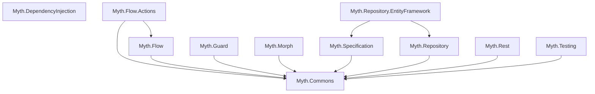

## myth

> Application context (ASP.NET Core, Console App, Test, etc.)


# Myth Ecosystem - Integration Guide

**Version:** 1.0
**Target Framework:** .NET 8.0 / .NET 10.0
**License:** Apache 2.0

> 📚 **For detailed API documentation**, refer to individual library SKILL.md files in each project folder.

---

## Table of Contents

1. [Overview](#overview)
2. [The 12 Libraries](#the-12-libraries)
3. [Quick Start](#quick-start)
4. [Integration Patterns](#integration-patterns)
5. [Complete Workflows](#complete-workflows)
6. [Best Practices](#best-practices)

---

## Overview

**Myth** is a comprehensive ecosystem of 12 .NET libraries designed to work together seamlessly, providing enterprise-grade capabilities for building scalable, maintainable applications following SOLID principles, Clean Architecture, and Domain-Driven Design.

### Core Philosophy

- **Modular**: Use only what you need
- **Composable**: Libraries integrate naturally
- **Type-Safe**: Full compile-time checking
- **Async-First**: Built for modern .NET async/await
- **DI-Native**: Deep integration with Microsoft.Extensions.DependencyInjection
- **Production-Ready**: Battle-tested patterns and resilience

### Key Architectural Concept: Global Service Provider

All Myth libraries share a centralized `MythServiceProvider` for seamless dependency resolution across libraries:

```csharp
// ASP.NET Core - use BuildApp() instead of Build()
var app = builder.BuildApp(); // ✅ Initializes global provider

// Console Apps - use BuildWithGlobalProvider()
var serviceProvider = services.BuildWithGlobalProvider(); // ✅

// Now all libraries can resolve dependencies from each other
```

---

## The 12 Libraries

### Core Foundation

| Library | Purpose | Documentation |
|---------|---------|---------------|
| **Myth.Commons** | Base types, ValueObjects, JSON extensions, global ServiceProvider | [SKILL.md](Myth.Commons/SKILL.md) |
| **Myth.DependencyInjection** | Auto-discovery, convention-based service registration | [SKILL.md](Myth.DependencyInjection/SKILL.md) |

### Data & Persistence

| Library | Purpose | Documentation |
|---------|---------|---------------|
| **Myth.Repository** | Generic repository interfaces with read/write separation | [SKILL.md](Myth.Repository/SKILL.md) |
| **Myth.Repository.EntityFramework** | EF Core implementation with Unit of Work, auto-configuration | [SKILL.md](Myth.Repository.EntityFramework/SKILL.md) |
| **Myth.Specification** | Query specification pattern for encapsulating business rules | [SKILL.md](Myth.Specification/SKILL.md) |

### Validation & Transformation

| Library | Purpose | Documentation |
|---------|---------|---------------|
| **Myth.Guard** | Fluent validation with 100+ rules, context-aware, RFC 9457 errors | [SKILL.md](Myth.Guard/SKILL.md) |
| **Myth.Morph** | Object transformation and mapping with schema-based bindings | [SKILL.md](Myth.Morph/SKILL.md) |

### Workflows & Architecture Patterns

| Library | Purpose | Documentation |
|---------|---------|---------------|
| **Myth.Flow** | Pipeline pattern with Result, retry policies, telemetry | [SKILL.md](Myth.Flow/SKILL.md) |
| **Myth.Flow.Actions** | CQRS, event-driven architecture, message brokers (extends Flow) | [SKILL.md](Myth.Flow.Actions/SKILL.md) |

### HTTP & External Services

| Library | Purpose | Documentation |
|---------|---------|---------------|
| **Myth.Rest** | Fluent REST client with circuit breaker and retry policies | [SKILL.md](Myth.Rest/SKILL.md) |

### Testing & Code Generation

| Library | Purpose | Documentation |
|---------|---------|---------------|
| **Myth.Testing** | Testing utilities, mocks, base test classes (xUnit, Bogus, Moq) | [SKILL.md](Myth.Testing/SKILL.md) |
| **Myth.Tool** | CLI tool for scaffolding CQRS, DDD, and Clean Architecture patterns | [SKILL.md](Myth.Tool/SKILL.md) |

---

## Quick Start

### ASP.NET Core Application (Full Stack)

```csharp
using Myth.Extensions;

var builder = WebApplication.CreateBuilder(args);

// 1. Configure Myth libraries
builder.Services.AddFlow(config => config
    .UseTelemetry()
    .UseRetry(maxAttempts: 3, backoffMs: 1000)
    .UseActions(actions => actions
        .UseRabbitMQ(opts => { /* configure */ })
        .UseCaching(cache => cache.UseRedis("localhost:6379"))
        .ScanAssemblies(typeof(Program).Assembly)
        .AutoSubscribeEventHandlers()));

builder.Services.AddGuard();
builder.Services.AddMorph();

// 2. Configure database
builder.Services.AddDbContext<AppDbContext>(options =>
    options.UseSqlServer(builder.Configuration.GetConnectionString("Default")));

// 3. Register repositories
builder.Services.AddRepositories(); // Auto-registers all repositories
builder.Services.AddUnitOfWorkForContext<AppDbContext>();

// 4. CRITICAL: Build with global provider
var app = builder.BuildApp(); // ✅ NOT builder.Build()

// 5. Add middleware
app.UseGuard(); // Validation exception handling with RFC 9457 format

app.MapControllers();
app.Run();
```

### Console Application (Minimal)

```csharp
using Myth.Extensions;

var services = new ServiceCollection();

services.AddFlow();
services.AddGuard();
services.AddLogging();

// Register your services
services.AddScoped<IDataProcessor, DataProcessor>();

// CRITICAL: Build with global provider
var serviceProvider = services.BuildWithGlobalProvider();

// Use services
var processor = serviceProvider.GetRequiredService<IDataProcessor>();
await processor.ProcessAsync();
```

---

## Integration Patterns

### Pattern 1: CQRS with Validation Pipeline

Combine **Flow.Actions** (CQRS) + **Flow** (Pipeline) + **Guard** (Validation):

```csharp
// Command
public record CreateOrderCommand(Guid CustomerId, List<Guid> ProductIds) : ICommand<Guid>;

// Handler with validation pipeline
public class CreateOrderHandler : ICommandHandler<CreateOrderCommand, Guid> {
    private readonly IOrderRepository _repository;
    private readonly IValidator _validator;

    public async Task<CommandResult<Guid>> HandleAsync(
        CreateOrderCommand command,
        CancellationToken ct) {

        // Use Flow pipeline with Guard validation
        var result = await Pipeline.Start(command)
            .WithTelemetry("CreateOrder")
            .StepResultAsync(async cmd => {
                // Validate with Guard
                await _validator.ValidateAsync(cmd, ValidationContextKey.Create, ct);
                return Result<CreateOrderCommand>.Success(cmd);
            })
            .StepAsync(async cmd => {
                // Create order
                var order = await _repository.CreateAsync(cmd, ct);
                return order.Id;
            })
            .ExecuteAsync(ct);

        return result.IsSuccess
            ? CommandResult<Guid>.Success(result.Value)
            : CommandResult<Guid>.Failure(result.ErrorMessage!);
    }
}
```

### Pattern 2: Query with Specification and Caching

Combine **Specification** + **Repository** + **Flow.Actions** (caching):

```csharp
// Query
public record SearchProductsQuery(string? Name, decimal? MinPrice) : IQuery<List<ProductDto>>;

// Handler
public class SearchProductsHandler : IQueryHandler<SearchProductsQuery, List<ProductDto>> {
    private readonly IProductRepository _repository;

    public async Task<QueryResult<List<ProductDto>>> HandleAsync(
        SearchProductsQuery query,
        CancellationToken ct) {

        // Build specification (static class for business clarity)
        var spec = SpecBuilder<Product>.Create()
            .IsActive()
            .AndIf(!string.IsNullOrEmpty(query.Name), p => p.Name.Contains(query.Name!))
            .AndIf(query.MinPrice.HasValue, p => p.Price >= query.MinPrice!.Value)
            .Order(p => p.Name);

        // Execute via repository
        var products = await _repository.SearchAsync(spec, ct);

        // Transform with Morph
        var dtos = products.Select(p => p.To<ProductDto>()).ToList();

        return QueryResult<List<ProductDto>>.Success(dtos);
    }
}

// In controller - use with caching
[HttpGet]
public async Task<IActionResult> Search([FromQuery] SearchProductsQuery query) {
    var cacheOptions = new CacheOptions {
        Enabled = true,
        CacheKey = $"products:search:{query.Name}:{query.MinPrice}",
        Ttl = TimeSpan.FromMinutes(5)
    };

    var result = await _dispatcher.DispatchQueryAsync<SearchProductsQuery, List<ProductDto>>(
        query, cacheOptions);

    return Ok(result.Data);
}
```

### Pattern 3: Event-Driven Workflow

Combine **Flow.Actions** (events) + **Flow** (pipeline) + **Rest** (external APIs):

```csharp
// Event
public record OrderCreatedEvent : IEvent {
    public string EventId { get; init; }
    public DateTimeOffset OccurredAt { get; init; }
    public Guid OrderId { get; init; }
    public Guid CustomerId { get; init; }
}

// Event Handler - Send email
public class SendOrderConfirmationHandler : IEventHandler<OrderCreatedEvent> {
    private readonly IRestClient _emailClient;

    public async Task HandleAsync(OrderCreatedEvent @event, CancellationToken ct) {
        await Pipeline.Start(@event)
            .WithTelemetry("SendOrderConfirmation")
            .WithRetry(maxAttempts: 3, backoffMs: 1000)
            .StepAsync(async evt => {
                // Call external email API
                var response = await _emailClient
                    .Post("https://api.email.com/send")
                    .WithJsonBody(new {
                        to = evt.CustomerEmail,
                        template = "order-confirmation",
                        data = new { OrderId = evt.OrderId }
                    })
                    .ExecuteAsync<EmailResponse>(ct);

                return evt;
            })
            .TapAsync(evt => {
                // Log success
                _logger.LogInformation("Email sent for order {OrderId}", evt.OrderId);
            })
            .ExecuteAsync(ct);
    }
}

// Event Handler - Update analytics
public class UpdateOrderAnalyticsHandler : IEventHandler<OrderCreatedEvent> {
    private readonly IAnalyticsRepository _repository;

    public async Task HandleAsync(OrderCreatedEvent @event, CancellationToken ct) {
        var analytics = new OrderAnalytics {
            OrderId = @event.OrderId,
            CustomerId = @event.CustomerId,
            CreatedAt = @event.OccurredAt
        };

        await _repository.AddAsync(analytics, ct);
    }
}
```

---

## Complete Workflows

### Workflow 1: CRUD API with Full Stack

**Stack:** Repository + Specification + Guard + Flow + Flow.Actions + Morph

```csharp
// 1. Entity with validation
public class Product : IValidatable<Product> {
    public Guid Id { get; set; }
    public string Name { get; set; }
    public decimal Price { get; set; }

    public void Validate(ValidationBuilder<Product> builder, ValidationContextKey? context = null) {
        builder.For(Name, x => x.NotEmpty().MaximumLength(200));
        builder.For(Price, x => x.GreaterThan(0));
    }
}

// 2. Specification (static class for business clarity)
public static class ProductSpecifications {
    public static ISpec<Product> IsActive(this ISpec<Product> spec) =>
        spec.And(p => !p.IsDeleted);

    public static ISpec<Product> NameContains(this ISpec<Product> spec, string search) =>
        spec.And(p => p.Name.Contains(search));
}

// 3. Repository
public interface IProductRepository : IReadWriteRepositoryAsync<Product> {
    Task<IPaginated<Product>> SearchAsync(ISpec<Product> spec, Pagination pagination, CancellationToken ct);
}

public class ProductRepository : ReadWriteRepositoryAsync<Product>, IProductRepository {
    public ProductRepository(AppDbContext context) : base(context) { }

    public async Task<IPaginated<Product>> SearchAsync(
        ISpec<Product> spec,
        Pagination pagination,
        CancellationToken ct) {
        return await SearchPaginatedAsync(spec.WithPagination(pagination), ct);
    }
}

// 4. CQRS Commands/Queries
public record CreateProductCommand(string Name, decimal Price) : ICommand<Guid>;
public record GetProductQuery(Guid Id) : IQuery<ProductDto>;
public record SearchProductsQuery(string? Search, Pagination Pagination) : IQuery<IPaginated<ProductDto>>;

// 5. Command Handler
public class CreateProductHandler : ICommandHandler<CreateProductCommand, Guid> {
    private readonly IProductRepository _repository;
    private readonly IValidator _validator;
    private readonly IDispatcher _dispatcher;

    public async Task<CommandResult<Guid>> HandleAsync(
        CreateProductCommand command,
        CancellationToken ct) {

        var product = new Product {
            Id = Guid.NewGuid(),
            Name = command.Name,
            Price = command.Price
        };

        // Validate
        await _validator.ValidateAsync(product, ValidationContextKey.Create, ct);

        // Persist
        await _repository.AddAsync(product, ct);

        // Publish event
        await _dispatcher.PublishEventAsync(new ProductCreatedEvent {
            EventId = Guid.NewGuid().ToString(),
            OccurredAt = DateTimeOffset.UtcNow,
            ProductId = product.Id
        }, ct);

        return CommandResult<Guid>.Success(product.Id);
    }
}

// 6. Query Handler with caching
public class SearchProductsHandler : IQueryHandler<SearchProductsQuery, IPaginated<ProductDto>> {
    private readonly IProductRepository _repository;

    public async Task<QueryResult<IPaginated<ProductDto>>> HandleAsync(
        SearchProductsQuery query,
        CancellationToken ct) {

        var spec = SpecBuilder<Product>.Create()
            .IsActive()
            .AndIf(!string.IsNullOrEmpty(query.Search), s => s.NameContains(query.Search!));

        var products = await _repository.SearchAsync(spec, query.Pagination, ct);

        var dtos = new Paginated<ProductDto>(
            products.PageNumber,
            products.PageSize,
            products.TotalItems,
            products.TotalPages,
            products.Items.Select(p => p.To<ProductDto>()).ToList()
        );

        return QueryResult<IPaginated<ProductDto>>.Success(dtos);
    }
}

// 7. Controller
[ApiController]
[Route("api/[controller]")]
public class ProductsController : ControllerBase {
    private readonly IDispatcher _dispatcher;

    public ProductsController(IDispatcher dispatcher) {
        _dispatcher = dispatcher;
    }

    [HttpPost]
    public async Task<IActionResult> Create(CreateProductCommand command) {
        var result = await _dispatcher.DispatchCommandAsync<CreateProductCommand, Guid>(command);
        return result.IsSuccess
            ? CreatedAtAction(nameof(Get), new { id = result.Data }, result.Data)
            : BadRequest(result.ErrorMessage);
    }

    [HttpGet]
    public async Task<IActionResult> Search([FromQuery] SearchProductsQuery query) {
        var cacheOptions = new CacheOptions {
            Enabled = true,
            CacheKey = $"products:search:{query.Search}:{query.Pagination.PageNumber}",
            Ttl = TimeSpan.FromMinutes(5)
        };

        var result = await _dispatcher.DispatchQueryAsync<SearchProductsQuery, IPaginated<ProductDto>>(
            query, cacheOptions);

        return Ok(result.Data);
    }
}
```

### Workflow 2: External API Integration with Resilience

**Stack:** Rest + Flow + Guard

```csharp
// 1. Configure REST client
builder.Services.AddRestClient<IPaymentGateway, PaymentGatewayClient>(client => client
    .WithBaseUrl("https://api.payment.com")
    .WithTimeout(TimeSpan.FromSeconds(30))
    .WithRetry(maxAttempts: 3, backoffMs: 1000)
    .WithCircuitBreaker(failureThreshold: 5, openDuration: TimeSpan.FromSeconds(30))
    .WithHeader("Authorization", "Bearer {token}"));

// 2. Payment Gateway Client
public interface IPaymentGateway {
    Task<PaymentResult> ProcessPaymentAsync(PaymentRequest request, CancellationToken ct);
}

public class PaymentGatewayClient : IPaymentGateway {
    private readonly IRestClient _client;

    public async Task<PaymentResult> ProcessPaymentAsync(
        PaymentRequest request,
        CancellationToken ct) {

        return await Pipeline.Start(request)
            .WithTelemetry("ProcessPayment")
            .StepResultAsync(async req => {
                // Validate request
                await _validator.ValidateAsync(req, ValidationContextKey.Create, ct);
                return Result<PaymentRequest>.Success(req);
            })
            .StepAsync(async req => {
                // Call payment API (with automatic retry and circuit breaker)
                var response = await _client
                    .Post("/payments")
                    .WithJsonBody(req)
                    .ExecuteAsync<PaymentResponse>(ct);

                return new PaymentResult {
                    Success = response.Status == "approved",
                    TransactionId = response.TransactionId
                };
            })
            .ExecuteAsync(ct);
    }
}
```

---

## Best Practices

### 1. Always Use BuildApp() / BuildWithGlobalProvider()

**✅ DO:**
```csharp
var app = builder.BuildApp(); // ASP.NET Core
var serviceProvider = services.BuildWithGlobalProvider(); // Console
```

**❌ DON'T:**
```csharp
var app = builder.Build(); // ❌ Won't initialize global provider
var serviceProvider = services.BuildServiceProvider(); // ❌
```

### 2. Use Static Classes for Specifications

**✅ DO:**
```csharp
public static class UserSpecifications {
    public static ISpec<User> IsActive(this ISpec<User> spec) => ...
}
```

### 3. Never Access DbSets Directly

**✅ DO:**
```csharp
public class UserService {
    private readonly IUserRepository _repository; // ✅
}
```

**❌ DON'T:**
```csharp
public class UserService {
    private readonly AppDbContext _context; // ❌ Use repositories
}
```

### 4. Inject Repositories Directly in Handlers

**✅ DO:**
```csharp
public class CreateOrderHandler : ICommandHandler<CreateOrderCommand, Guid> {
    private readonly IOrderRepository _repository; // ✅ Simple and clean

    public CreateOrderHandler(IOrderRepository repository) {
        _repository = repository;
    }
}
```

**❌ DON'T:**
```csharp
public class CreateOrderHandler : ICommandHandler<CreateOrderCommand, Guid> {
    private readonly IServiceScopeFactory _scopeFactory; // ❌ Unnecessary

    public async Task<CommandResult<Guid>> HandleAsync(...) {
        using var scope = _scopeFactory.CreateScope(); // ❌ Dispatcher creates scope
        var repository = scope.ServiceProvider.GetRequiredService<IOrderRepository>();
    }
}
```

### 5. Use Context-Aware Validation

```csharp
public void Validate(ValidationBuilder<Product> builder, ValidationContextKey? context = null) {
    // Global rules
    builder.For(Name, x => x.NotEmpty());

    // Create-specific
    builder.InContext(ValidationContextKey.Create, b => {
        b.For(SKU, x => x.RespectAsync(async (sku, ct, sp) => {
            var repo = sp.GetRequiredService<IProductRepository>();
            return !await repo.AnyAsync(p => p.SKU == sku, ct);
        }));
    });
}
```

### 6. Use Flow.Actions for CQRS (Not Flow Alone)

- **Myth.Flow**: Base pipeline library for general workflows
- **Myth.Flow.Actions**: Extension for CQRS/Events (requires Flow)

```csharp
// ✅ For CQRS - use Flow.Actions
await _dispatcher.DispatchCommandAsync(command);

// ✅ For general pipelines - use Flow
await Pipeline.Start(data).StepAsync(...).ExecuteAsync();
```

---

## Library Dependencies



---

## Additional Resources

- **Individual Library Documentation**: Each library has a detailed SKILL.md in its project folder
- **Repository**: https://gitlab.com/dotnet-myth/myth
- **License**: Apache 2.0
- **Target Frameworks**: .NET 8.0, .NET 10.0

---

## Quick Reference

| Need | Use | Documentation |
|------|-----|---------------|
| Validation | Myth.Guard | [SKILL.md](Myth.Guard/SKILL.md) |
| CQRS/Events | Myth.Flow.Actions | [SKILL.md](Myth.Flow.Actions/SKILL.md) |
| Pipelines | Myth.Flow | [SKILL.md](Myth.Flow/SKILL.md) |
| Database | Myth.Repository.EntityFramework | [SKILL.md](Myth.Repository.EntityFramework/SKILL.md) |
| Queries | Myth.Specification | [SKILL.md](Myth.Specification/SKILL.md) |
| Mapping | Myth.Morph | [SKILL.md](Myth.Morph/SKILL.md) |
| HTTP Calls | Myth.Rest | [SKILL.md](Myth.Rest/SKILL.md) |
| Testing | Myth.Testing | [SKILL.md](Myth.Testing/SKILL.md) |

---

*This documentation provides ecosystem integration guidance. For detailed API reference, consult individual library SKILL.md files.*

---
> Source: [paulaolileal/myth](https://github.com/paulaolileal/myth) — distributed by [TomeVault](https://tomevault.io).
<!-- tomevault:4.0:gemini_md:2026-06-17 -->
