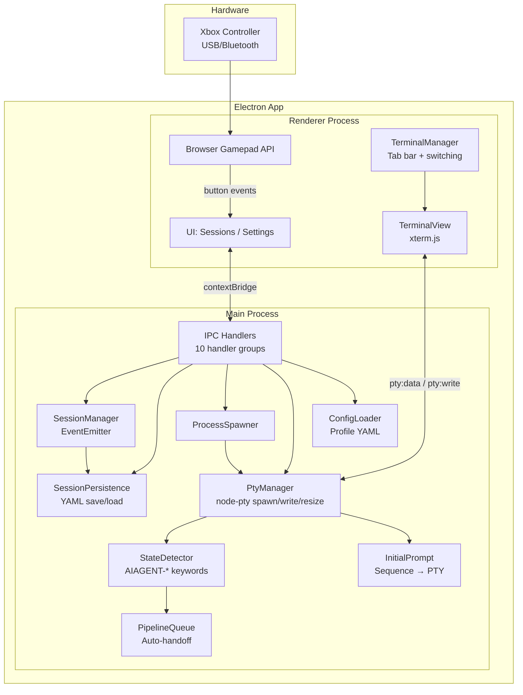
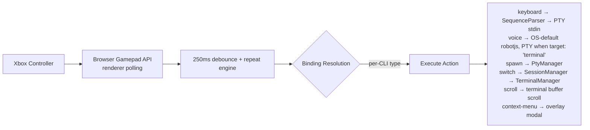
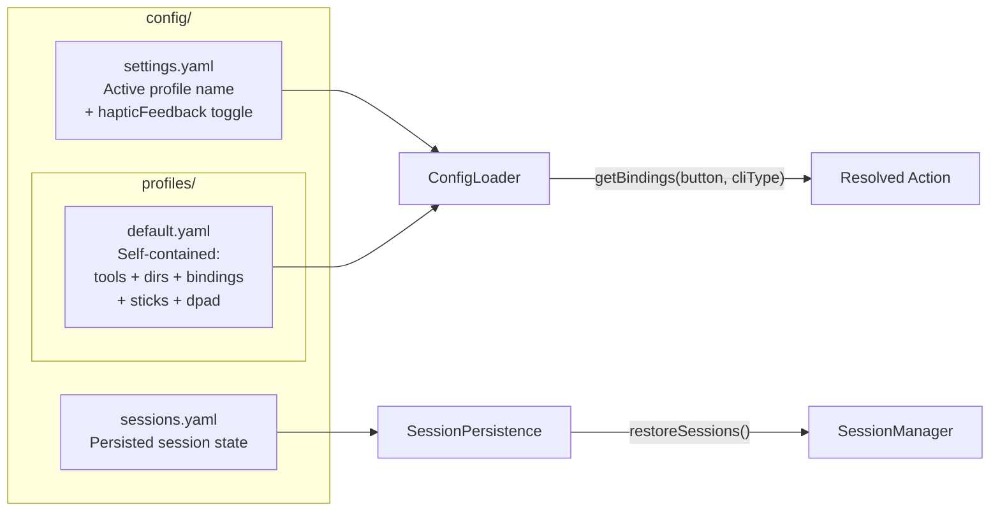

## helm

> DIY Xbox controller → CLI session manager. Control multiple AI coding CLIs (Claude Code, Copilot CLI, etc.) from a single game controller. Embedded terminals via node-pty + xterm.js — no external windows. Built as an Electron 41 desktop app on Windows.

# gamepad-cli-hub — Copilot Instructions

## Project Purpose

DIY Xbox controller → CLI session manager. Control multiple AI coding CLIs (Claude Code, Copilot CLI, etc.) from a single game controller. Embedded terminals via node-pty + xterm.js — no external windows. Built as an Electron 41 desktop app on Windows.

---

## System Overview



### Data Flow Pipeline



**Detailed flow:**
1. Browser Gamepad API polls at 16ms in the renderer process
2. Button presses debounced at 250ms; D-pad and sticks auto-repeat when held (400ms initial delay, 120ms rate for D-pad; displacement-proportional for sticks)
3. Emits button events to subscribers; analog sticks emit virtual button events
4. Binding resolution: check CLI-specific bindings
5. Execute resolved action (keyboard sequence → PTY stdin, voice → OS-default robotjs or PTY when target: 'terminal', spawn → PTY, session-switch, scroll, etc.)
6. Voice bindings: default to OS (robotjs). If active terminal exists and `target === 'terminal'` → convert key to escape sequence via `keyToPtyEscape()` → `ptyWrite()`. Otherwise → robotjs. Hold mode sends escape sequence once (PTY has no key-up).
7. Analog sticks: explicit binding found → execute action; no binding → fall back to stick mode (left=cursor arrows via PTY, right=configurable per-CLI bindings, default: scroll)
8. D-pad / left stick navigates sessions and auto-selects the terminal
9. Keyboard input always routes to the active terminal (PTY stdin)
10. Ctrl+V paste: document-level interceptor reads clipboard text → writes to active PTY via `ptyWrite()` regardless of DOM focus

---

## Key Controls

| Input | Action |
|-------|--------|
| D-Pad Up/Down | Switch sessions (auto-selects terminal) |
| Left Stick | Same as D-pad |
| Right Stick | Scroll terminal buffer |
| A | Activate spawn action / configurable per-CLI binding |
| B | Back to sessions zone / configurable per-CLI binding |
| X | Close terminal |
| Y | Configurable per-CLI binding |
| Left Trigger | Spawn Claude Code |
| Right Bumper | Spawn Copilot CLI |
| Back/Start | Switch profile (previous/next) |
| Sandwich/Guide | Focus hub window + show sessions screen |
| Ctrl+Tab | Next terminal tab |
| Ctrl+Shift+Tab | Previous terminal tab |

---

## Module Reference

| Module | File | Responsibility |
|--------|------|---------------|
| **BrowserGamepad** | `renderer/gamepad.ts` | Browser Gamepad API polling (250ms debounce), button-press events via IPC, analog stick events. Sole gamepad input source — works with both USB and Bluetooth Xbox controllers. |
| **SequenceParser** | `src/input/sequence-parser.ts` | Parses sequence format strings (`{Enter}`, `{Ctrl+C}`, `{Wait 500}`, `{Mod Down/Up}`, `{{`/`}}` escapes, plain text) into typed SequenceAction arrays. Used by both button bindings and initial prompts. |
| **SessionManager** | `src/session/manager.ts` | EventEmitter tracking active/inactive sessions. Emits `session:added`, `session:removed`, `session:changed`. Supports `nextSession()`, `previousSession()`. Calls `persistSessions()` after every state change. |
| **SessionPersistence** | `src/session/persistence.ts` | `saveSessions()`, `loadSessions()`, `clearPersistedSessions()` to `config/sessions.yaml`. `restoreSessions()` on startup loads saved sessions, skips duplicates. `startHealthCheck()`/`stopHealthCheck()` methods exist but are dead code — not called in production; dead processes cleaned up via PTY exit events instead. |
| **ProcessSpawner** | `src/session/spawner.ts` | Spawn detached CLI processes from config, register with SessionManager. Accepts optional `onExit` callback. |
| **PtyManager** | `src/session/pty-manager.ts` | PTY process lifecycle — spawn via node-pty (cmd.exe on Windows, bash on Unix), write to stdin, resize, kill. One PTY per embedded terminal session. |
| **StateDetector** | `src/session/state-detector.ts` | Scans PTY output for AIAGENT-* keywords to detect CLI state (waiting, implementing, etc.). |
| **PipelineQueue** | `src/session/pipeline-queue.ts` | Auto-handoff queue — routes tasks to waiting sessions based on state detection. |
| **InitialPrompt** | `src/session/initial-prompt.ts` | Per-CLI prompt pre-loading — converts sequence parser syntax to PTY escape codes, sends to newly spawned PTY after configurable delay. |
| **ConfigLoader** | `src/config/loader.ts` | Self-contained profile YAML loading + profile/tools/directory/bindings CRUD. Auto-migration from legacy `tools.yaml`/`directories.yaml`. `StickConfig` types, `StickVirtualButton`, `getStickConfig()`, `getHapticFeedback()`, `setHapticFeedback()`, `SidebarPrefs`, `getSidebarPrefs()`, `setSidebarPrefs()`. `ActionType = 'keyboard' \| 'voice' \| 'scroll' \| 'context-menu' \| 'prompt-tree' \| 'new-draft'`. `Binding` union includes `ContextMenuBinding`, `PromptTreeBinding`, `NewDraftBinding`. The legacy per-CLI `sequences` groups were replaced by the global prompt-template library (`PromptTemplateManager`); `getSequences()` remains only as one-time migration input. |
| **ElectronMain** | `src/electron/main.ts` | Window creation, IPC setup, app lifecycle. Renderer crash recovery (auto-reloads on `render-process-gone` — safe because session state lives in main process). Power monitoring (`suspend`/`resume`/`shutdown` logging via `powerMonitor`). |
| **IPC Handlers** | `src/electron/ipc/*.ts` | Orchestrator + 7 domain handler files (session, config, profile, tools, keyboard, pty, system). Dependencies injected via function parameters. Config handlers include `dialog:openFolder` for native OS folder picker. |
| **Preload** | `src/electron/preload.ts` | Context bridge exposing typed IPC API to renderer. Must be .cjs when package.json has "type":"module". |
| **Renderer** | `renderer/*.ts` | Modular vanilla TypeScript UI. Entry point (main.ts) + state, utils (includes `toDirection()` for directional button normalization, `showFormModal` with `FormField` types: text/select/textarea + `browse?: boolean` for native folder picker), bindings (PTY-aware routing with voice OS-default + PTY opt-in via `target: 'terminal'`, context-menu action centers overlay in gamepad mode), paste-handler (Ctrl+V → PTY), navigation, screens (sessions/settings), modals (dir-picker/binding-editor/context-menu/close-confirm/prompt-tree picker). Browser Gamepad API. Session list shows embedded terminals only. D-pad navigation auto-selects terminals. |
| **TerminalView** | `renderer/terminal/terminal-view.ts` | xterm.js wrapper — one Terminal instance per session with fit/search/weblinks addons. Forwards user input + resize events via callbacks. Selection API: `getSelection()`, `hasSelection()`, `clearSelection()`. |
| **TerminalManager** | `renderer/terminal/terminal-manager.ts` | Multi-terminal orchestrator — create, switch, resize, rename, PTY IPC data routing, cleanup. Renders horizontal tab bar with colored state dots (green=implementing, orange=waiting, blue=planning, grey=idle). Exposes onSwitch/onEmpty callbacks. `getActiveView()` returns current TerminalView. Right-click `contextmenu` listener on terminal area shows context menu overlay. |
| **KeyboardSimulator** | `src/output/keyboard.ts` | OS-level key simulation via robotjs for voice bindings. Used when `action: 'voice'` without `target: 'terminal'`. Provides `keyTap`, `sendKeyCombo`, `comboDown`, `comboUp`. |
| **Logger** | `src/utils/logger.ts` | Winston logger with daily rotation. Used across all src/ modules. |

---

## Configuration System



### Binding Resolution Order
1. Check **CLI-specific** bindings for the active session's CLI type
2. This allows the same button to behave differently per CLI type

### Binding Action Types
| Action | Description |
|--------|-------------|
| `keyboard` | Send sequence to PTY stdin. Format: `{ action: 'keyboard', sequence: '{Wait 500}some text{Enter}{Ctrl+C}' }` — sequence parser syntax converted to PTY escape codes. |
| `voice` | Key simulation for voice activation. Format: `{ action: 'voice', key: 'F1', mode: 'tap', target?: 'terminal' }`. **OS-default routing:** defaults to robotjs (OS-level). Only routes through PTY when `target: 'terminal'` is set — converts key to escape sequence via `keyToPtyEscape()` → `ptyWrite()`. Falls back to robotjs when no terminal or `target` is not `'terminal'`. `mode: 'hold'` sends once on press (PTY) or holds/releases (OS). Supports F1-F12 (VT220), navigation keys, combos. |
| `session-switch` | Switch active session (next/previous) |
| `spawn` | Spawn new CLI instance |
| `list-sessions` | Show session status |
| `profile-switch` | Switch config profile (next/previous) |
| `close-session` | Close the active terminal session |
| `scroll` | Scroll terminal buffer. Format: `{ action: 'scroll', direction: 'up'\|'down', lines?: 5 }` |
| `context-menu` | Open context menu overlay. Format: `{ action: 'context-menu' }`. Gamepad binding centers menu in viewport; right-click shows at mouse position. Items: Copy, Paste, Compose in Editor, New Session, New Session with Selection, Cancel. Copy and "New Session with Selection" disabled when no text selected. "Compose in Editor" disabled when no active session. |
| `prompt-tree` | Open the global prompt-template picker tree (`PromptTreeModal`). Format: `{ action: 'prompt-tree' }` (no payload). Picking a template prefills the in-app Prompt Editor (caret at end); Ctrl+Enter delivers to the active PTY via `deliverPromptSequence()`. Replaces the removed `sequence-list` action. |

### Stick Configuration (per profile)
```yaml
sticks:
  left:
    mode: cursor    # cursor | scroll | disabled
    deadzone: 8000
    repeatRate: 60
  right:
    mode: scroll
    deadzone: 0.25
    repeatRate: 60
```

### Settings UI (4 tabs)
Profiles | Per-CLI Bindings | Tools | Directories

Directories tab: add/edit forms include a Browse button (📁) that opens native OS folder picker via `dialog:openFolder` IPC channel and auto-fills path + name fields.

All config supports CRUD via IPC handlers and the Settings UI.

### Tool Config (in profile YAML `tools` section)
```yaml
claude-code:
  name: Claude Code
  command: claude
  initialPrompt:              # Array of {label, sequence} items sent to PTY sequentially after spawn
    - label: "Setup"
      sequence: "/init{Enter}"
  initialPromptDelay: 2000    # ms to wait before sending first item (default 2000 for AI CLIs, 0 for generic)
```

No `terminal` field — all CLIs run as embedded PTY sessions (no external window config). `initialPrompt` items are sent in order; use `{Wait N}` within sequences for inter-item timing.

### Sequence Parser Syntax (used by `sequence` bindings and `initialPrompt`)
| Token | Effect |
|-------|--------|
| Plain text | Sent as literal characters |
| `{Enter}` | Newline / carriage return |
| `{Tab}`, `{Escape}`, `{Delete}`, etc. | Named keys |
| `{Ctrl+C}`, `{Ctrl+Z}`, etc. | Modifier + key combos |
| `{Wait 500}` | Pause N ms (max 30000) |
| `{Ctrl Down}`, `{Ctrl Up}` | Hold/release modifier |
| `{{`, `}}` | Literal `{` and `}` |

---

## File Structure

```
src/
├── electron/
│   ├── main.ts                 # Electron main: window creation, IPC setup, lifecycle, renderer crash recovery, power monitoring
│   ├── preload.ts              # Context bridge (renderer ↔ main IPC)
│   └── ipc/
│       ├── handlers.ts         # Orchestrator — imports + wires 7 domain handlers
│       ├── session-handlers.ts
│       ├── config-handlers.ts
│       ├── profile-handlers.ts
│       ├── tools-handlers.ts
│       ├── keyboard-handlers.ts
│       ├── pty-handlers.ts
│       └── system-handlers.ts
├── input/
│   └── sequence-parser.ts      # {Enter}, {Ctrl+C}, {Wait 500}, {Mod Down/Up}, {{/}} — used by bindings + initialPrompt
├── output/
│   └── keyboard.ts             # OS-level key simulation via robotjs (voice bindings only)
├── session/
│   ├── manager.ts              # Session tracking (EventEmitter), calls persistence on changes
│   ├── persistence.ts          # Save/load/clear sessions to config/sessions.yaml
│   ├── pty-manager.ts          # PTY process management (node-pty: cmd.exe on Windows, bash on Unix)
│   ├── state-detector.ts       # AIAGENT-* keyword scanning for CLI state detection
│   ├── pipeline-queue.ts       # Waiting→implementing auto-handoff queue (FIFO)
│   └── initial-prompt.ts       # Sequence syntax → PTY escape codes, configurable delay
├── config/
│   └── loader.ts               # Self-contained profile YAML config + CRUD + StickConfig + haptic settings + auto-migration
├── types/
│   └── session.ts              # SessionInfo, SessionChangeEvent, AnalogEvent types
└── utils/
    └── logger.ts               # Winston logger (daily rotation, used everywhere)

renderer/
├── index.html                  # Main UI template
├── main.ts                     # Entry point — init, wiring, DOMContentLoaded, terminal manager
├── state.ts                    # Shared AppState type + singleton (currentScreen, sessions, activeSessionId, etc.)
├── utils.ts                    # DOM helpers, logEvent, showScreen, toDirection
├── bindings.ts                 # Config cache, binding dispatch (PTY-aware routing, voice OS-default + PTY via target: 'terminal', F1-F12 VT220 escape sequences)
├── paste-handler.ts            # Document-level Ctrl+V interceptor → clipboard text → active PTY
├── navigation.ts               # Gamepad navigation setup, event routing. Priority chain: sandwich → dirPicker → bindingEditor → formModal → closeConfirm → contextMenu → promptTree → screen routing → configBinding fallback
├── gamepad.ts                  # Browser Gamepad API wrapper
├── terminal/
│   ├── terminal-view.ts        # xterm.js wrapper (fit/search/weblinks addons)
│   └── terminal-manager.ts     # Multi-terminal orchestration (create/switch/resize/destroy + tab bar)
├── screens/
│   ├── sessions.ts             # Vertical session cards + spawn grid + dir picker modal. `doSpawn()` accepts optional `contextText` for spawning with selected text (via `setPendingContextText()`)
│   ├── sessions-state.ts       # Sessions screen navigation state (sessions/spawn zones)
│   ├── settings.ts             # Slide-over settings (profiles, bindings, tools, dirs)
├── modals/
│   ├── dir-picker.ts           # Directory picker modal
│   ├── binding-editor.ts       # Binding editor modal
│   ├── context-menu.ts         # Context menu overlay — Copy/Paste/Compose in Editor/New Session/New Session with Selection/Cancel. Selection-aware items, gamepad D-pad navigation, mouse + right-click support
│   ├── close-confirm.ts        # Close session confirmation popup — centered modal with Close/Cancel, gamepad + keyboard support
│   └── (prompt picker is now the Vue `components/modals/PromptTreeModal.vue` — global prompt-template tree; the legacy DOM sequence-picker was removed in PT-7)
└── styles/
    └── main.css

config/
├── settings.yaml               # Active profile + hapticFeedback toggle
├── sessions.yaml               # Persisted session state (auto-managed)
└── profiles/
    └── default.yaml            # Self-contained: tools + workingDirectories + bindings + sticks + dpad

tests/                                  # 694 tests across 22 files
├── config.test.ts              # Config loading, stick config, haptic, virtual buttons, prompt-tree binding persistence
├── session.test.ts             # Session management
├── persistence.test.ts         # Session persistence
├── keyboard.test.ts            # Keyboard simulation
├── sessions-screen.test.ts     # Session cards + spawn grid navigation + directional buttons
├── sequence-parser.test.ts     # Sequence format parser tests
├── pty-manager.test.ts         # PTY process management tests
├── terminal-manager.test.ts    # Embedded terminal lifecycle tests
├── bindings-pty.test.ts        # PTY escape helpers + routing tests
├── bindings-target.test.ts     # Voice binding target routing (PTY vs OS)
├── paste-routing.test.ts       # Ctrl+V paste → PTY routing tests
├── state-detector.test.ts      # AIAGENT-* keyword detection tests
├── pipeline-queue.test.ts      # Auto-handoff queue tests
├── initial-prompt.test.ts      # Initial prompt delivery tests
├── modal-base.test.ts          # Modal UI base tests
├── gamepad-repeat.test.ts      # D-pad/stick key repeat engine tests
├── close-confirm.test.ts       # Close confirmation modal tests (show/hide, confirm/cancel, gamepad + keyboard navigation)
├── components/modals/prompt-tree-modal.test.ts  # PromptTreeModal picker tests (tree disclosure, selection, gamepad navigation, apply flow)
├── sort-logic.test.ts          # Sort logic tests
├── tab-cycling.test.ts         # Tab cycling tests
├── context-menu.test.ts        # Context menu overlay tests (show/hide, selection-aware items, gamepad navigation, click handlers)
└── utils.test.ts               # Utility function tests
```

---

## Tech Stack

| Component | Technology |
|-----------|-----------|
| Desktop shell | Electron 41 |
| Language | TypeScript (ESM) |
| Bundler | esbuild |
| Tests | Vitest |
| Gamepad input | Browser Gamepad API (sole input source) |
| Embedded terminals | node-pty (PTY) + @xterm/xterm (xterm.js) |
| PTY shell | cmd.exe (Windows), bash (Unix) |
| Haptic feedback | Config setting (implementation pending — PowerShell XInput path removed) |
| Config | YAML (yaml package) |
| Logging | Winston |

---

## Key Design Decisions

### Browser Gamepad API Only
Single input path via Chromium's Gamepad API. Works with both USB and Bluetooth Xbox controllers. XInput/PowerShell path was removed for simplicity.

### Embedded Terminals via PTY
CLIs run inside the Electron app using node-pty + xterm.js. No external terminal windows. PTY spawns cmd.exe on Windows, bash on Unix. All keyboard/sequence input routes through PTY stdin.

### Voice Binding OS-Default Routing
Voice bindings (`action: 'voice'`) default to OS-level robotjs simulation (for external apps like OpenWhisper). Only route through PTY when `target === 'terminal'` is explicitly set: converts key to terminal escape sequence via `keyToPtyEscape()` and writes to PTY via `ptyWrite()`. Falls back to robotjs when no terminal is active or `target` is not `'terminal'`. Hold mode sends the escape sequence once on press (PTY has no key-up concept). `keyToPtyEscape()` supports F1-F12 (VT220 standard), navigation keys, and modifier combos.

### Clipboard Paste via PTY
A document-level `keydown` listener (`renderer/paste-handler.ts`) intercepts Ctrl+V, reads clipboard text via `navigator.clipboard.readText()`, and writes it to the active terminal's PTY via `ptyWrite()`. Works regardless of DOM focus — solves the problem of paste not reaching the terminal when gamepad navigation has focused the sidebar instead of xterm.js.

### D-pad Auto-Selection
D-pad navigation automatically selects and activates the terminal for the focused session. No separate focus/unfocus toggle — keyboard always types into the active terminal, D-pad always navigates sessions.

### Tab Bar with State Dots
Horizontal tab strip above terminal area. Each tab shows session name + colored dot (green=implementing, orange=waiting, blue=planning, grey=idle). Ctrl+Tab / Ctrl+Shift+Tab for keyboard switching, D-pad for gamepad switching.

### Button Pass-Through
Non-navigation buttons (XYAB, bumpers, triggers) return false from session navigation, allowing them to fall through to per-CLI configurable bindings.

### Session Persistence
Sessions saved to `config/sessions.yaml` (as YAML) after every add/remove/change. On startup, `restoreSessions()` reloads saved sessions (skips duplicates). Dead processes are cleaned up via PTY exit events — no periodic health check runs in production. `startHealthCheck()`/`stopHealthCheck()` methods exist on SessionManager but are dead code (tests only). Survives app crashes and restarts.

### Hibernate Resilience
Renderer crash recovery via `render-process-gone` auto-reload — Chromium GPU process often crashes on hibernate resume. Safe because session state lives in `SessionManager` (main process), so terminals reconnect after reload. `powerMonitor` logs `suspend`/`resume`/`shutdown` for diagnostics. `unresponsive`/`responsive` events are also logged for visibility.

### Analog Stick Modes
Left stick emulates D-pad plus cursor-mode arrow keys (sent as PTY escape codes). Right stick provides scroll mode (terminal buffer scroll). Both configurable per-profile via `StickConfig` (`mode: 'cursor' | 'scroll' | 'disabled'`, `deadzone`, `repeatRate`). Each stick emits distinct virtual button names (e.g. `LeftStickUp`, `RightStickDown`) that can be bound like physical buttons. If no explicit binding exists, falls back to stick mode.

### Haptic Feedback
Haptic feedback is a config setting (`hapticFeedback: true/false` in settings.yaml) but the PowerShell XInput implementation was removed. The setting remains for future reimplementation.

### IPC Bridge Pattern
Electron context isolation enforced. `preload.ts` exposes typed API via `contextBridge` (includes `dialogOpenFolder` for native folder picker). IPC handlers are split into 10 domain files (`src/electron/ipc/*-handlers.ts`) with dependency injection — the orchestrator (`handlers.ts`) wires dependencies. Renderer never directly accesses Node.js APIs.

### Self-Contained Profile YAML
Each profile is a single YAML file containing tools, working directories, bindings, stick config, and dpad config. Switching profiles changes everything (tools, directories, bindings). Settings (active profile, haptic, sidebar) stored separately. Auto-migration merges legacy `tools.yaml`/`directories.yaml` into profiles on first load. Profile switch shows a confirmation dialog when terminals are open (keep sessions / close all). `createProfile()` copies tools + dirs from the current profile.

### Per-CLI Button Bindings
Same button can do different things depending on active CLI type. A/B/X/Y are typically per-CLI outside navigation.

### Sequence Parser for Input
Instead of direct key simulation, the `keyboard` action uses a sequence parser syntax (`{Enter}`, `{Ctrl+C}`, `{Wait 500}`, plain text) that converts to PTY escape codes. Same syntax used for button `sequence` bindings and `initialPrompt` config.

### Debouncing
250ms default in the input layer prevents accidental rapid re-presses while staying responsive. Per-button timestamp tracking.

### Sidebar Layout
App runs as a 320px frameless always-on-top sidebar (left or right edge). Sessions screen shows vertical session cards (top) and a spawn grid (bottom) with a directory picker modal. Settings is a slide-over panel. Sandwich button focuses the hub and returns to the sessions screen.

---

## Build & Test Commands

```bash
npm run build    # esbuild: electron (dist-electron/main.js) + renderer (dist/renderer/main.js)
npm run start    # Build and launch the app
npm test         # Vitest suite
```

**Build notes:**
- Renderer output: `dist/renderer/main.js` (not `renderer/main.js`)
- node-pty is `--external` in the electron esbuild (native addon, not bundled)
- No `--allow-overwrite` flag

---

## Coding Conventions

### Principles
- **DRY, YAGNI, KISS** — no premature abstraction or optimisation
- **TDD** — write tests first, then implement
- **Event-driven** — non-blocking, reactive architecture
- **Composition over inheritance** — use dependency injection
- **Clean separation** — input → processing → output pipeline
- **Document why, not how**

### Code Style
- ESM modules throughout (`"type": "module"` in package.json)
- Short methods (<20 lines preferred, 40 hard limit)
- Use mermaid diagrams in documentation

### Testing
- Vitest with behaviour-focused tests (test what, not how)
- Test edge cases implied by the spec
- Never skip broken tests — fix them immediately

---

## When Working on This Project

1. **Run tests before and after changes** — `npm test`
2. **Follow the input → processing → output pipeline** — don't mix concerns
3. **Windows-primary** — app targets Windows (cmd.exe PTY shell) but avoids Windows-specific hacks where possible
4. **Electron security model** — never bypass the preload/IPC bridge
5. **Check config files** before adding hardcoded button mappings or CLI types
6. **Embedded terminals only** — all CLIs run inside the Electron app via PTY, no external windows

---
> Source: [PetePeter/helm](https://github.com/PetePeter/helm) — distributed by [TomeVault](https://tomevault.io).
<!-- tomevault:4.0:gemini_md:2026-08-29 -->
