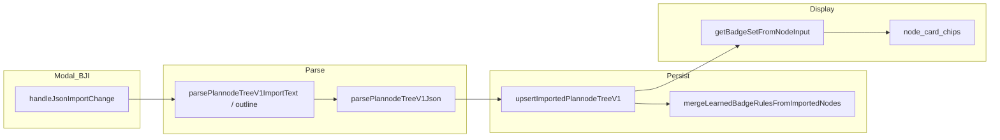

## plannode-badge-mapping

> >


# Plannode 배지 매핑 지침 (가져오기 파이프라인)

**근원:** Cursor 플랜 `가져오기_배지_파이프라인_구현결과_bbe7c690.plan.md`를 규칙용으로 재구성·코드 동기화.  
**제품 의미의 “학습”:** 머신러닝 학습이 아니라 **규칙 테이블 + 브라우저 누적 저장**이다.

---

## 0. 표준 배지 풀 기반 배지 매핑 — 기술 지침

### 0.1 목표 (제품 정렬)

- **표준 배지 풀**이 허용하는 토큼만 최종 칩·저장물에 남긴다: `filterBadgeSetToCanonicalPool`가 최종 게이트.
- 풀 안에서 **동의어·메타 추론·가져오기 누적 규칙**으로 들어갈 수 있는 것은 최대한 매핑한다(외부 임의 문자열 원문 보존은 제품 범위 밖 — PRD·아키텍처와 동일).

### 0.2 단일 진실·호출 순서 (구현 불변)

| 역할 | 코드 정본 |
|------|-----------|
| 런타임 유효 풀(기본 21 + 사용자 확장) | `getEffectiveBadgePool` — `badgePoolConfig.ts` |
| 원문 토큰 → 트랙·표준 대문자 토큰 | `resolveImportedBadgeToken` — `badgeImportAliases.ts` |
| 명시 배지 + 메타 힌트 병합 | `getBadgeSetFromNodeInput` → `inferBadgeHintStringsFromMetadata` 병합 순서 **1→4** — `badgePromptInjector.ts`, `badgeMetadataInference.ts` |
| 저장·가져오기 sanitize | `sanitizeNodeBadgesForTreeV1` / `applySanitizeImportedPlannodeNodeV1` |
| 협업 배지 송수신·projectId | §6.9 · [`plannode-architecture.mdc`](./plannode-architecture.mdc) §10.10.1 |
| 노드 카드 표시 | **동일** `getBadgeSetFromNodeInput` 계열 — 단, 파일럿 `render()`는 **표시 전용 게이트**(§6.2)로 `inferHints`를 제한할 수 있음 |

가져오기·아젠다 생성·클라우드 머지 등 **진입점이 달라도** 위 단일 파이프를 깨거나 **둘째 배지 저장소**를 두지 않는다.

**파일럿 표시 게이트**는 `metadata.badges`·`badges[]`·`sanitize` 결과와 **충돌하지 않게** 동작해야 한다(§6).

### 0.3 표준 풀 확대·증식 시 동기화 (필수)

표준 풀은 **지속적으로 확대할 계획**이므로, 토큰을 추가·변경할 때 아래를 **한 세트**로 갱신한다. 누락 시 가져오기 해석·칩·LLM 프롬프트가 어긋난다.

| 단계 | 할 일 |
|------|--------|
| 1 | `badgePoolConfig.ts` — 기본 풀 정의·검증·스토리지 키 일관성 |
| 2 | `badgeImportAliases.ts` — `ALIAS_GROUPS`·신규 토큰으로 들어올 외부 표기 동의어 |
| 3 | (해당 시) `badgeMetadataInference.ts` — 키워드·extras가 새 도메인 의미를 다루면 정규식·힌트 보강 |
| 4 | Vitest — `badgeImportAliases.test.ts`, CRAZYSHOT·파이프라인 회귀 샘플 갱신 또는 케이스 추가 |
| 5 | 아젠다 프롬프트 등 **인라인 풀 문구** — `.cursor/plans/plannode_dev_spec_v1.0.md` §3-1 `BADGE_SPEC`, `agendaPromptAgent.ts` 동기 래퍼 |
| 6 | UI 칩 라벨·색 — `plannode-ui-identity.mdc`·컴포넌트에서 신규 트랙·토큰 표기 필요 여부 |

제품 공표가 필요하면 **`plannode-prd.mdc`** M1 F1-3 등과 한 줄 교차한다.

### 0.4 지능적 학습 자동화 (향후 고려 — 구현은 TASK·GATE·GP-12)

현재 구현층은 **규칙 기반**: 동의어표·키워드·`mergeLearnedBadgeRulesFromImportedNodes`로 **브라우저에 규칙 누적**. 이것만으로도 풀이 커질수록 **별칭·규칙 테이블 유지 비용**이 늘어난다.

**확대 증식에 맞춘 자동화·지능화 방향(선택·단계적):**

1. **데이터 기반 동의어 후보:** 가져오기 시 `resolveImportedBadgeToken`에 걸리지 않은 원문(또는 빈도)을 개발·디버그 리포트로 모아, `badgeImportAliases` 보강 후보를 만들 수 있다.
2. **사용자 규칙 UI:** `setUserBadgeInferenceRules`를 콘솔 없이 편집 — 비개발자 튜닝·GP-12 범위 내에서 TASK 승인 후.
3. **학습 저장소 정리:** `AI_LEARNED_RULES_MAX`·충돌 시 우선순위를 제품 정책으로 문서화.
4. **진짜 ML·임베딩 매핑**은 PRD·`plan-output`·GATE에 명시되기 전까지 **도입하지 않는다**(오버엔지니어링 견제). 도입 시에도 **구조 골격은 트리·풀 고정**, 모델은 보조 배지 제안 정도로 한정하는 방향이 PRD F2-4·§10.4와 정합하다.

에이전트는 위 **0.3 동기화 표**를 풀 변경 시 1차 체크리스트로 삼고, **0.4**는 설계 메모로만 참고하고 임의 신규 모듈을 추가하지 않는다.

### 0.5 BADGE-ALIGN (2026-05 · DEV 16 · IA 구조 우선)

**목표:** 노드 카드 배지는 **화면 형태(UX)·도메인·구현 조건(DEV)·기획 산출(PRJ)** 만 남기고, 범용 **CRUD·배포 공정**·과광 alias는 기본 풀·추론·프롬프트에서 제거·보수화한다.

| 항목 | 정책 |
|------|------|
| **기본 DEV 풀** | **16종** — `badgePoolConfig.ts` `DEFAULT_DEV_KEYS` 정본 |
| **기본 풀에서 제거** | `CRUD`, `LOCAL`, `STAGING`, `PROD`, `DEPLOY`, `HOTFIX`, `PR`, `JSON`, `RENDER` |
| **가져오기 `crud`** | `badgeImportAliases`에서 `CRUD`로 해석 가능하나 **풀에 없음** → `filterBadgeSetToCanonicalPool` 후 **칩·저장물에서 제거** |
| **추론** | `keywordHints`에 범용 CRUD·배포 토큰 없음 · **§6.2** 설명 없으면 추론 off 유지 |
| **구조 우선** | `inferBadgeHintStringsFromMetadata` — `treeImportExtras` → **`iaGrid.screenType`·`path`** → `keywordHints` → 사용자·AI 규칙(§4.4) |
| **LLM** | `agendaPromptAgent.ts` `BADGE_SPEC` — 16 DEV + UX 26 + PRJ 9, 제거 토큰 예시 없음 |

프로젝트 **커스텀 `badge_pool`**에 레거시 `CRUD`가 남아 있으면 해당 프로젝트만 예외 허용(문서·BACKLOG). 기본 풀·외부 AI JSON은 **≈51 토큰** 기준.

---

## 1. 학습·매핑 저장 계층 (상위 학습기록)

추론 파이프라인은 아래 **브라우저 `localStorage` 키**와 연동된다. 에이전트·구현 시 **동일 키명**을 유지한다.

| 계층 | `localStorage` 키 | 역할 | 누적 |
|------|-------------------|------|------|
| **표준 배지 풀** | `plannode.standardBadgePool.v1` | 기본 **DEV 16 · UX 26 · PRJ 9**(합계 ≈51, BADGE-ALIGN 2026-05) 외 커스텀 토큰·트랙 — `getEffectiveBadgePool` | 사용자가 표준 배지 설정에서 저장 시 갱신 |
| **사용자 추론 규칙** | `plannode.badgeInferenceUserRules.v1` | `UserBadgeInferenceRule[]` — `setUserBadgeInferenceRules` / UI 미구현 시 API·콘솔 | 사용자가 덮어쓰기·초기화 가능 |
| **AI·외부 트리 누적 학습** | `plannode.badgeInferenceAiLearnedRules.v1` | 가져온 노드의 `metadata.badges`(표준 풀로 해석)로 규칙 생성·병합 — **`name` 전체**, 조건부 **`description` 첫 줄 발췌**, **`metadataHaystack` 한 줄 시그니처** | **누적** — 동일 `(field, contains)`면 `suggestBadges`만 합침; 최대 `AI_LEARNED_RULES_MAX`(400) 초과 시 배열 앞쪽 규칙 드롭 |

**AI 학습기록 갱신 트리거 (코드 정본):**

- `src/lib/stores/projects.ts` — `upsertImportedPlannodeTreeV1` 성공 후 **`mergeLearnedBadgeRulesFromImportedNodes(nodeList)`** (원본 가져오기 노드 기준).
- 프로그램적 로드: `mergeLearnedBadgeRulesFromPlannodeExportUnknown(obj)` — `{ nodes: [...] }` 형태 JSON 객체.

**해석:** 외부 AI(예: Crazyshot `BADGE_FULL` 등)가 채운 `metadata.badges`는 **동의어 해석 후 표준 토큰만** 규칙에 들어간다. 풀에 없는 문자열은 `resolveImportedBadgeToken`에서 탈락 — **표준 배지 풀 확장** 시 이후 가져오기부터 학습에 반영 가능.

### 1.1 재검증 — 「매핑율이 낮다」와 실제 동작

| 확인 항목 | 결과(샘플 파일·코드 기준) |
|-----------|---------------------------|
| **CRAZYSHOT `crazyshot_v5_plannode_BADGE_FULL.json`** | 노드 **약 119개** 중 **118개**가 `metadata.badges`에 배지 1개 이상. 파일 내 **고유 토큰 18종**은 모두 기본 풀 표기이거나 `badgeImportAliases` 동의어로 **표준 토큰으로 해석**된다(예: `ANALYSIS`→`API`, `COMPETITIVE`→`USP`). |
| **`sanitizeNodeBadgesForTreeV1` 후 (실측)** | 명시 배지만 역산한 칩 수보다 **축소되지 않음**(키워드·extras 등으로 칩이 추가될 수 있음). **동의어 접기**(예: `ANALYSIS`→`API`)로 **표시 문자열은 바뀌지만 해당 노드에서 칩이 전부 사라지지는 않음**(별칭 미등록 시만 소실). |
| **자동 회귀** | Vitest [`src/lib/ai/crazyshotBadgeFullPipeline.test.ts`](src/lib/ai/crazyshotBadgeFullPipeline.test.ts) — 리포 공식 샘플 [`docs/crazyshot_v5_plannode_BADGE_FULL.json`](docs/crazyshot_v5_plannode_BADGE_FULL.json)(CRAZYSHOT 원본과 동일 내용으로 두고 동기화) 기준: 고유 원문 토큰 전원 해석 가능, `metadata.badges` 슬롯이 있는 노드는 sanitize 후 칩 ≥1, sanitize 후 칩 수 ≥ 명시-only coerce 칩 수. |
| **고도화의 설계 의도** | 파이프라인은 **풀·동의어·키워드·extras·사용자 규칙·AI 학습 규칙**을 포함하지만, **외부 AI 라벨을 원문 그대로 보존하지는 않는다**. 최종은 항상 **현재 표준 배지 풀**(`filterBadgeSetToCanonicalPool`)로 맞춘다. |

**「매핑율」이 낮아 보일 때 점검**

1. **의미 보존 vs 칩 개수:** `ANALYSIS`가 `API`로 접히면 **라벨 종류 수는 줄어들지만**, 칩이 사라지는 것과는 구별해야 한다.
2. **일반 JSON:** 풀·동의어에 없는 문자열만 있으면 해당 슬롯은 비워짐 → **표준 배지 풀 확장** 또는 **동의어 행 추가** 검토.
3. **outline-only MD 등:** 배지 입력이 없으면 비어 있음이 정상.
4. **비교 지표 통일:** 원본 파일의 **임의 문자열 토큰 수**와 Plannode **기본 풀(≈60)** 칩 종류 수를 1:1로 기대하면 불일치가 크게 나온다 — 비교는 **resolve 후 표준 토큰** 또는 **노드당 칩 유무** 기준이 타당하다.

---

## 2. 범위와 진입점

- **UI:** 프로젝트 모달 `#BJI` — `src/routes/+page.svelte` `handleJsonImportChange`.
- **형식:** `.json`/`.txt`, `.md`/`.markdown`(펜스 → outline), `.docx`(outline). 배지 의미는 **트리 JSON 파싱 성공 시**에 한함. outline-only MD는 배지 비어 있음이 정상.
- **다른 진입:** 클라우드 병합 등 동일 `upsertImportedPlannodeTreeV1` 경로(`sync.ts`, `projectAcl.ts` 등) → AI 학습 병합도 동일하게 실행.



- `applySanitizeImportedPlannodeNodeV1`는 파싱 종단·저장 직전 **두 경로**에서 호출; 동일 sanitize라 멱등에 가깝다.

---

## 3. 파일→파싱→영속 (요약)

| 단계 | 위치 |
|------|------|
| 텍스트 로드 | `+page.svelte` |
| MD | `outlineToPlannodeTreeV1.ts` 등 |
| JSON | `plannodeTreeV1.ts` `parsePlannodeTreeV1Json` |
| 영속 | `projects.ts` `upsertImportedPlannodeTreeV1` + 노드 `localStorage` |
| 스키마 | `src/lib/ai/types.ts` `NodeMetadata` |

---

## 4. 메타 ↔ 배지 매핑 파이프라인 (핵심)

**단일 소스:** `getBadgeSetFromNodeInput` → `sanitizeNodeBadgesForTreeV1` (`badgePromptInjector.ts`).

### 4.1 저장 래퍼

- `applySanitizeImportedPlannodeNodeV1` — `sanitizeNodeBadgesForTreeV1`만 호출; `name`/`description`/기능명세 등 비배지 필드는 유지.

### 4.2 배지 풀

- `badgePoolConfig.ts` — `BADGE_POOL_STORAGE_KEY`, `getEffectiveBadgePool`.

### 4.3 명시 배지 정규화

- 3트랙 `metadata.badges` → `coerceImportedBadgeSetFromTracksAndFlat` + `resolveImportedBadgeToken` (`badgeImportAliases.ts`).
- 평면 레거시 → `migrateLegacyBadgesToSet`.

### 4.4 메타데이터 힌트 추론 (`inferBadgeHintStringsFromMetadata`)

**병합 순서 (중복 제거 시 먼저 삽입된 토큰 우선 — 코드 정본 `badgeMetadataInference.ts`):**

1. `metadata.treeImportExtras` 플래그
2. **`metadata.iaGrid`** — `screenType`·`path` 등 화면 archetype (**keywordHints보다 우선**, BADGE-ALIGN)
3. `keywordHints` — functionalSpec·iaGrid·tech 합성 haystack + `name` + `description` 정규식 (범용 CRUD·배포 키워드 없음)
4. **사용자 규칙** — `plannode.badgeInferenceUserRules.v1`
5. **AI 누적 학습 규칙** — `plannode.badgeInferenceAiLearnedRules.v1`

그 후 `getBadgeSetFromNodeInput`에서 base + inferred를 `mergeBadgeSets`, 저장 시 `filterBadgeSetToCanonicalPool`. 파일럿 카드는 **§6.2**로 `description` 비었을 때 2~5단계 병합을 끈다.

**iaGrid 예:** `screenType: "list"` + 짧은 설명 → `LIST`(UX) 우선; 설명만 「CRUD API 설계」여도 **CRUD 칩 없음** · `API` 가능(시나리오 3).

---

## 5. 사용자 규칙·AI 학습 규칙 스키마

**공통 타입:** `UserBadgeInferenceRule` — `field`: `description` | `name` | `metadataHaystack`, `contains`, `suggestBadges`.

- **사용자:** `{ "rules": [ ... ] }` under `plannode.badgeInferenceUserRules.v1`.
- **AI 학습:** `{ "v": 1, "updatedAt": ISO8601, "rules": [ ... ] }` under `plannode.badgeInferenceAiLearnedRules.v1`.

AI 학습 규칙은 가져오기 시 노드별로 주로 **`field: "name"`, `contains`: 노드 제목 전체**를 쓴다(너무 짧거나 구분자-only 제목은 스킵). 동일 키면 `suggestBadges`만 합친다.

---

## 6. 파일럿 노드 카드·설정 모달 — 추론 조건 구조 (정본)

이 절은 **`badgePromptInjector.ts` / `badgeMetadataInference.ts`의 코어 파이프**와 **`src/lib/pilot/plannodePilot.js`의 UX 게이트**를 분리해 기록한다. 향후 AI 추론 자동 반영·배지 UI 고도화 시 **이 구조를 변경하면 회귀**한다(진공 노드·기본 제목 `새 노드`·학습 규칙과의 상호작용).

### 6.1 계층 모델 (코어 vs 표시·편집 게이트)

| 층 | 역할 | 정본 위치 |
|----|------|-----------|
| **L1 — 명시 배지 + 풀 정규화** | `metadata.badges`(3트랙) 또는 평면 `badges[]` → `BadgeSet` | `getBadgeSetFromNodeInput` (`opts`에 따라 추론 병합 여부) |
| **L2 — 메타 힌트 추론 병합** | `inferBadgeHintStringsFromMetadata` 순서 1→4(§4.4)·`mergeBadgeSets` | `getBadgeSetFromNodeInput`에서 **기본값** `inferHints` 미지정 시만 활성 |
| **L3 — 저장 sanitize** | 항상 **추론 비활성**: `{ inferHints: false }` | `sanitizeNodeBadgesForTreeV1` |
| **L4 — 파일럿 표시 게이트** | 카드 칩: **설명 비었으면 추론 병합 금지** | `plannodePilot.js` `render()` |
| **L5 — 파일럿 편집 게이트** | 모달 `working`: **항상 명시만** | `plannodePilot.js` `showEdit()` |
| **L6 — 저장 순간 (진공 입력)** | 제목·설명 **입력란** 모두 빈 문자열이면 클로저 `working` 3트랙 초기화 | `plannodePilot.js` 저장 버튼 콜백 |

**절대 원칙:** 배지의 **영속 단일 경로**는 `sanitizeNodeBadgesForTreeV1` / `applySanitizeImportedPlannodeNodeV1`(가져오기)이다. 파일럿은 **치 레이어에 덮어쓰지 않고**, `getBadgeSetFromNodeInput`의 **`inferHints` 옵션**과 **저장 직전 `working` 초기화**로만 행동을 제한한다.

### 6.2 노드 카드 칩 (`render()`)

**조건식 (정본):**

- `_descEmpty = !String(n.description ?? '').trim()`
- `inferHints = !_descEmpty`  
  - 즉 **`description`이 비어 있으면 `inferHints: false`** → L2(키워드·사용자 규칙·AI 학습 규칙) **병합 안 함**. L1 명시 배지(`badges[]` / `metadata.badges`)만 평탄화되어 표시.

**의도·근거:**

- UI에서 제목만 기본값 `'새 노드'`로 둔 상태에서도, **`name`에만 의존하는 학습 규칙**(`plannode.badgeInferenceAiLearnedRules.v1` 등)이 켜지면 명시 1~2개 저장 후에도 카드에 **과다 칩**이 붙는 문제가 발생할 수 있음. **설명이 없을 때는 제목/메타만으로 추론을 섞지 않는다**는 제품 UX 정책.
- `inferBadgeHintStringsFromMetadata`의 **진공 노드 조기 반환**(`name`·`desc`·구조 hay·treeImportExtras 모두 비었을 때 `[]`)과는 **별개**다. 저장 후 `name === '새 노드'`는 비어 있지 않으므로 진공 조기반환이 깨지지 않아도, L2가 켜지면 학습 규칙이 **`name` 전체 매칭**으로 발동할 수 있다. 이를 카드 단에서 차단하는 것이 §6.2.

**수식 요약:**

```text
카드 칩 = flattenBadgeSet( getBadgeSetFromNodeInput(n, { inferHints: description에 trim 후 문자가 있음 }) )
```

### 6.3 설정 모달 초기 상태 (`showEdit()`)

**조건식 (정본):**

- `working = cloneBadgeSet( getBadgeSetFromNodeInput(n, { inferHints: false }) )`

**의도:**

- 모달에 **“추론으로만 생긴” 배지가 선택된 것처럼 보이지 않게** 한다. 편집기는 **저장된 명시 배지(평면·3트랙 정규화 결과)** 만 반영한다.

### 6.4 저장 버튼 (`showEdit` 내부 콜백)

**입력란 원문 (저장 판정):**

- `nm = document.querySelector('.ein')?.value?.trim() ?? ''`
- `desc = document.querySelector('.eid')?.value?.trim() ?? ''`

**진공 입력 시 `working` 초기화 (정본):**

- `if (!nm && !desc) { working.dev = []; working.ux = []; working.prj = []; }`
- 그 다음 `target.name` / `target.description` 대입(미입력 시 기본 제목 `'새 노드'` 등) → **`working` 초기화 판정은 반드시 대입 전·입력란 기준**이어야 한다.

**이후 공통 파이프:**

- `applyBadgeSetToNode(target, working)` → **`sanitizeNodeBadgesForTreeV1({ badges, metadata, name, description }, curP?.id)`** → `target.badges` / `target.metadata` 갱신. 공유 프로젝트는 **projectId 필수**(§6.9 · R1).

### 6.9 협업 배지 동기화 (공유 프로젝트 · BADGE_STRUCTURE_OPS)

**정본:** [`plannode-architecture.mdc`](./plannode-architecture.mdc) **§10.10.1** — 본 절은 **배지 데이터·sanitize 관점**만 요약한다.

| 규칙 | 내용 |
|------|------|
| **편집 진입점** | 트리 캔버스 배지 변경 = **모달(`showEdit`)만**. 우클릭 `#CTX` `bgt`는 **제거**(2026-06). 재도입 시 §10.10.1 송신 4단계 필수. |
| **저장 sanitize** | 모달 저장·structure op 송신 전 **`curP?.id`** 로 `sanitizeNodeBadgesForTreeV1` — `getEffectiveBadgePool(projectId)`와 슬라이스·가져오기(R1) 정합. |
| **협업 송신** | sanitize 후 `sendUpdateNodeStructureOp`에 **`badges` + `metadata`** (키 있을 때만 수신측 패치). |
| **협업 수신** | `applyBadgeSetToNode` + `inferHints: false` + `projectId: curP?.id` — flat `badges[]`만 두지 않음. |
| **A축 fallback** | Broadcast 누락·slice-only 변경 → `BADGE-SYNC-FIX` · `mergeNodeListsForCloud` 동률 badges(§10.10.1). |
| **금지** | 배지 변경이 **`schedulePersist`만** 타는 UI 추가 · 배지 **둘째 저장소** · projectId 없는 sanitize on collab path. |

**회귀(2계정):** A 모달 배지 저장 → B 카드 칩 수 초 내 · sanitize·Broadcast payload·스토어 badges 일치 · §6.7 시나리오와 **충돌 없음**.

### 6.5 `description`이 생긴 뒤의 추론 (카드)

- `_descEmpty === false` 이면 `inferHints: true`(기본 동작) → §4.4 순서 1→4로 **키워드·사용자·AI 학습** 병합 가능. 제목·설명·구조 메타·가져오기 extras가 풀·규칙과 맞을 때만 칩이 늘어난다.

---

### 6.6 코어 추론과의 관계 (에이전트 체크용)

| 질문 | 답 |
|------|-----|
| 진공 노드 조기반환만으로 카드 과다 표시가 막히는가? | **아님.** `name`이 `'새 노드'` 등으로 채워지면 조기반환 조건이 완화된다. 카드는 §6.2로 **설명 없음 → 추론 끔**. |
| 저장은 추론을 다시 넣는가? | **아니오.** `sanitizeNodeBadgesForTreeV1`는 내부적으로 `{ inferHints: false }`. |
| 스토어 `persistNodesFromPilot`이 배지를 재추론하는가? | **아니오.** 리스트 그대로 저장; sanitize는 import 루트 등 별 경로. |
| 향후 “자동 반영 AI”를 어디에 붙이면 안전한가? | **L2 확장** 시에도 §6.2·§6.3·§6.4를 유지하거나, 동일 정책을 `getBadgeSetFromNodeInput` 옵션으로 **코드 한곳에 합치기** — 파일럿과 이중 기준이 되면 안 된다(GP-12). |

### 6.7 회귀 시나리오 (수동·TASK)

1. 새 노드 추가 → 제목·설명 미입력 저장 → 카드 칩 **없음**, 모달 재오픈 시 칩 **미선택**.
2. 동일 노드에서 DEV 1개만 선택·저장, 설명 비움 유지 → 카드에 **해당 1개만**, **6개 풀 표시 금지**.
3. 설명에 키워드 입력 후 저장 → 카드에서 **추론 병합 허용**(§6.5).
4. 가져오기·클라우드 병합 후에도 **칩 = `getBadgeSetFromNodeInput` + 파일럿 게이트**와 모순 없어야 한다.
5. **(공유)** A 모달 배지 저장 → B 카드 칩 수 초 내(§6.9 · §10.10.1 GATE C).

### 6.8 원인규명 트리북 (저장 ≠ 카드·모달 불일치 시)

**이 절은** `inferBadgeHintStringsFromMetadata`·`sanitize`가 정상인데도 UI만 틀어지는 **계층 혼동**을 줄이기 위한 것이다. 구조 정보는 §6.1~§6.5에 있으나, **현장에서 무엇을 먼저 볼지**를 고정한다.

| 증상 | 먼저 의심할 층 | 확인 방법(개요) |
|------|----------------|-------------------|
| 저장 직후 `san.badges`·`target.badges`는 **기대와 일치**인데 카드만 과다/부족 | **L4** 파일럿 `render()` | 동일 노드 `n`에 대해 `description.trim()`이 비었는지. 비었으면 카드는 `inferHints: false` 경로(§6.2) — **학습 규칙·키워드 병합이 카드에 섞이면 안 됨**. 과거 버그: `inferHints: true` + `name === '새 노드'` + `plannode.badgeInferenceAiLearnedRules.v1`로 카드만 6칩. |
| 모달에 DEV 6개가 **선택**된 것처럼 보임·취소 불가처럼 느껴짐 | **L5** `showEdit()` | `working`은 `getBadgeSetFromNodeInput(n, { inferHints: false })`만 사용(§6.3). 추론 칩이 보이면 **이전 코드·캐시** 또는 **`n.badges` / `metadata.badges`에 실제 명시 값**이 있는지 확인. |
| 제목·설명 미입력 저장인데 저장물에 배지가 들어감 | **L6** 저장 콜백 | 입력란 `nm`·`desc` **둘 다 빈 문자열**인지. 빈 경우 `working` 3트랙 클리어가 **이름 대입 전**에 실행되는지(§6.4). |
| 가져오기·sanitize 후는 정상인데 일정 시간 후 배지가 **되살아남** | **클라우드/번들** (`sync.ts` 등) | 로컬 `persistNodesFromPilot`은 재추론 안 함(§6.6표). 원격 머지·슬라이스가 오래된 노드를 덮어쓸 수 있음 — `pullOwnWorkspaceIfChanged`·충돌 재병합 로그와 시각 정렬. |
| 코드 고쳤는데 브라우저 반응 없음 | **번들/HMR** | `plannodePilot.js` 변경이 Vite 로그에 반영되는지, **하드 리로드** 후 재현. |

**한 번에 비교할 두 값 (디버그용):**

1. **저장 단말:** `sanitizeNodeBadgesForTreeV1(...)` 산출 `badges`(항상 `inferHints: false` 경로, L3).
2. **카드 단말:** `flattenBadgeSet(getBadgeSetFromNodeInput(n, { inferHints: !_descEmpty }))` — §6.2와 동일해야 정상.  
   (1)과 (2)가 같아야 하는 것은 **아님** — (2)는 `_descEmpty`에 따라 L2 병합 여부가 달라짐. **같아야 하는 경우:** `description`이 비어 있을 때 (2)는 L1 명시만, (1)과 명시 배지 집합이 **논리적으로 일치**해야 한다.

**학습 규칙 의심 시:** 브라우저 `localStorage` 키 `plannode.badgeInferenceAiLearnedRules.v1`·`plannode.badgeInferenceUserRules.v1`(§1) — `field: "name"` + `contains`가 `'새 노드'` 등과 맞으면 카드에서 L2가 켜질 때만 과다 매칭(§6.2로 차단).

---

## 7. 한계

- 키워드·규칙 기반; 본문 우연 일치 가능.
- outline-only 가져오기는 배지 입력 부족이 정상.
- 별도 ML·피드백 학습 UI는 **현재 구현 범위** 밖; 풀 확대·자동화 **방향**은 **§0.3·§0.4** 참조.

---

## 8. 부록 — 외부 AI 샘플링용 스펙

정본은 코드: `badgePoolConfig.ts`, `badgeImportAliases.ts`, `badgeMetadataInference.ts`, `badgePromptInjector.ts`, `types.ts` `NodeMetadata`. **표·정규식을 바꾸면 앱과 불일치**한다.

### 8.1 노드 JSON 배지 위치

- 권장: `metadata.badges`: `{ dev[], ux[], prj[] }`.
- 레거시: 평면 `badges[]` — 병합 후 동일 해석기 통과.

### 8.2 기본 풀(DEV 16 · UX 26 · PRJ 9 · 합계 ≈51)

정본: `badgePoolConfig.ts` `DEFAULT_DEV_KEYS` / `DEFAULT_UX_KEYS` / `DEFAULT_PRJ_KEYS` (§0.5 BADGE-ALIGN). **트랙 오류·레거시 alias:** `NAVI`→`GNB`, `BUTT`→`CTA`, `FEED`→`TOAST`. **`crud`→CRUD** 해석 후 **기본 풀에 CRUD 없음** → sanitize·칩에서 제거.

| 트랙 | 토큰 |
|------|------|
| dev | TDD, API, AUTH, REALTIME, PAYMENT, ZINDEX, FLEX, CSSGRID, MQUERY, PADDING, REM, COMP, STATE, HARDCOD, DYNIX, DUMMY |
| ux | GNB, LNB, SNB, FNB, HERO, BREAD, CARO, ACCORD, MODAL, POPUP, TOAST, DROP, CTA, TAB, GRID, COL, GUTTER, MARGIN, BREAKPT, WHSPACE, HEAD, LIST, CARD, FORM, DASH, MEDIA |
| prj | USP, MVP, AI, I18N, MOBILE, WIREF, PROTO, VHIER, AFFORD |

**기본 풀에서 제거된 DEV(가져오기·명시만 있으면 탈락):** CRUD, LOCAL, STAGING, PROD, DEPLOY, HOTFIX, PR, JSON, RENDER.

토큰 형식: `^[A-Z][A-Z0-9]{1,14}$` (풀 설정·프로젝트별 `badge_pool`로 확장 가능, 트랙당 상한 40).

### 8.3 해석 순서

`resolveImportedBadgeToken`: (1) 풀 직접 매칭 (2) 동의어표 `IMPORT_BADGE_ALIAS_TO_CANONICAL`.

### 8.4 동의어 키 정규화

`normalizeBadgeForAliasLookup`: trim, 소문자, 따옴표 제거, 공백/슬래시/하이픈 → `_`, 중복 `_` 축소.

### 8.5 동의어 → 표준 토큰 (요약 — 전체는 `badgeImportAliases.ts` `ALIAS_GROUPS`)

| 표준 | 동의어 예(원문; 정규화 후 매칭) |
|------|----------------------------------|
| TDD | tdd, unit_test, … |
| CRUD | crud — **@deprecated** 기본 풀 밖; resolve 후 canonical이 풀에 없으면 **null** |
| API | api, rest, graphql, …, **analysis**, analytical, analyze, analyse |
| AUTH | auth, …, **jwt_token**, jwt, … |
| REALTIME | realtime, **web_socket**, websocket, ws, … |
| PAYMENT | payment, stripe, … |
| … | (HEAD, CARD, LIST, … 동일 파일 참조) |
| USP | usp, unique_selling, differentiation, **competitive**, competition, competitor, … |
| AI | ai, llm, gpt, … |

※ **analysis → API**, **competitive 계열 → USP** 등은 외부 AI 라벨과 표준 풀을 맞추기 위한 보강이다.

### 8.6 `treeImportExtras` → 토큰

플랜 원문 §8.7과 동일 — `isTDD`, `hasPayment`, `realtime`, … 참조: `hintsFromTreeImportExtras` in `badgeMetadataInference.ts`.

### 8.7 `keywordHints` 정규식

플랜 원문 §8.8과 동일 — 코드 `keywordHints`와 동기.

### 8.8 명시 + 추론 병합

`mergeBadgeSets(base, inferred)` — base 우선 순서, 트랙 내 중복 토큰 스킵.

---

## 9. 관련 문서·샘플

- `docs/plannode-tree-v1-ai-reference.md` — 파일 계약·§6 코드 근거
- **`docs/crazyshot_v5_plannode_BADGE_FULL.json`** — CRAZYSHOT v5 실사 스케일·`version`: 2·배지 매핑 풀 예시(리포 내 복사본; 원본은 CRAZYSHOT 워크스페이스 동명 파일과 동기 권장)
- `docs/plannode-tree-badge-pipeline-sample.json` — 축소 교본(동의어·오트랙·미지원 태그 등 최소 시나리오)

---

## 10. 구현 시 체크리스트

- 가져오기·sanitize·표시가 **`getEffectiveBadgePool`** 단일 풀을 본다.
- 추론 순서 **1→5**(§4.4, iaGrid 포함)를 바꾸면 TASK·QA·제품 문서와 충돌할 수 있다.
- AI 학습 저장소를 비우려면 `clearAiLearnedBadgeInferenceRules()` (테스트·디버그용 API).
- **파일럿:** `render()`에서 `description` 비었을 때 **`inferHints: false`** 유지(§6.2); `showEdit()`에서 **`inferHints: false`** 유지(§6.3); 저장 시 입력란 둘 다 빈 경우 **`working` 3트랙 클리어**(§6.4); **공유 프로젝트** 모달 저장·collab op는 **`sanitizeNodeBadgesForTreeV1(..., curP?.id)`**(§6.9).
- **자동 AI 추론**을 새로 붙일 때: §6.1~§6.6과 **동일 UX 정책**을 깨지 말 것 — 필요하면 `badgePromptInjector.ts`에 옵션으로 흡수하고 파일럿은 얇게 유지.
- **저장 OK·UI만 이상** 시 §6.8 원인규명 트리북으로 층(L3 vs L4·클라우드) 분리 후 수정.

---
> Source: [pseriesadmin/plannode](https://github.com/pseriesadmin/plannode) — distributed by [TomeVault](https://tomevault.io).
<!-- tomevault:4.0:gemini_md:2026-07-14 -->
