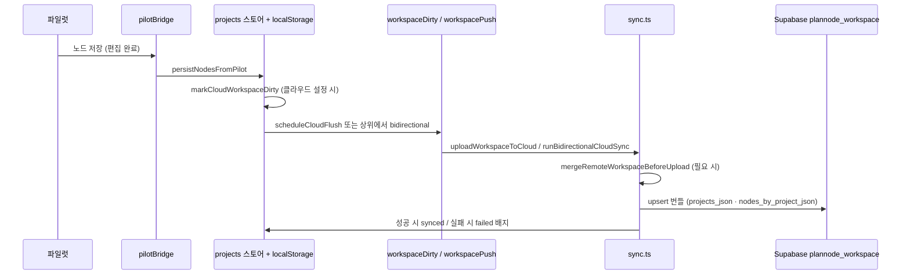
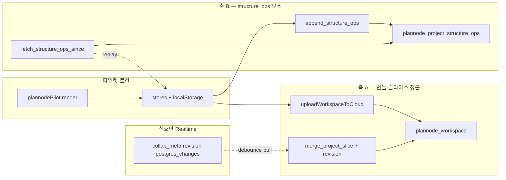
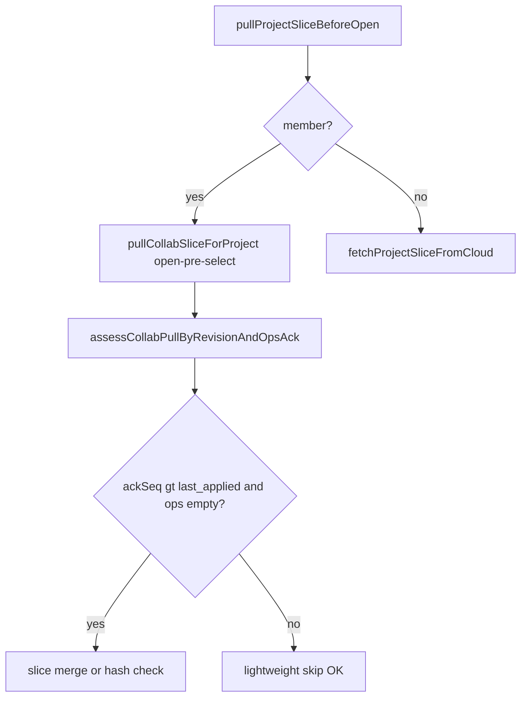

## plannode-architecture

> Plannode SvelteKit·파일럿·Supabase 기능 구조·데이터 흐름 표준 (유지보수·포팅 기준)


# Plannode 소프트웨어 아키텍처 표준

이 문서는 **현재 구현된** Plannode의 계층·모듈·데이터 흐름을 한곳에 묶은 **유지보수용 아키텍처 기준**이다.

**제품 포지션:** **상용 웹앱 개발계획 협업 서비스** (`plannode-prd.mdc` §1.05). **§5·§10(클라우드·노드 CRUD·동기화)** 는 “부가 옵션”이 아니라 **M5 협업의 구현 핵심**이다 — 에이전트는 동기화·ACL·충돌 경로를 **온전한 상용 수준**으로 설계·수정한다(§1.06).

제품 범위·로드맵은 `plannode-prd.mdc`, 파일럿 동작 세부는 `docs/PILOT_FUNCTIONAL_SPEC.md`, 배포·인프라는 `.cursor/plans/PLANNODE_INTEGRATED_GUIDE.md`가 우선한다.

## 1. 전체 구성 (하이브리드)

| 층 | 역할 | 주요 위치 |
|----|------|-----------|
| **앱 셸** | 라우팅·인증 게이트·프로젝트 하이드레이션 | `src/routes/+layout.svelte` |
| **메인 UI·동기화 오케스트레이션** | 툴바·뷰 전환·모달·클라우드 플러시·Presence | `src/routes/+page.svelte` |
| **파일럿 런타임** | 캔버스·노드 DOM·SVG 간선·PRD/명세/AI 패널 갱신 | `src/lib/pilot/plannodePilot.js` (`initPlannode`) |
| **브리지** | 파일럿 ↔ Svelte 스토어 양방향 동기화 | `src/lib/pilot/pilotBridge.ts` |
| **클라이언트 상태** | 프로젝트·노드·뷰·모달 | `src/lib/stores/projects.ts`, `authSession.ts`, `workspaceDirty.ts` |
| **백엔드(클라우드)** | Auth·RLS·워크스페이스 번들·ACL·Realtime | `src/lib/supabase/*`, `docs/supabase/*.sql` |

**원칙:** 트리 캔버스·줌·간선·미니맵의 **단일 진실은 파일럿**이며, Svelte는 **껍질·동기화·권한·저장소**를 맡는다. 파일럿이 기대하는 **DOM id·이벤트 계약**을 바꿀 때는 `docs/PILOT_FUNCTIONAL_SPEC.md` §9~§10과 대조한다.

## 2. 라우팅·부트 순서

1. **`+layout.svelte`**: `initAuthSession()` → Supabase 미설정 시 안내 스플래시 → 로그인 필요 시 `LoginGate` → 그 외 `<slot />`.
2. 로그인 후·클라우드 설정 시: `loadProjectsFromLocalStorage()` (프로젝트 목록·현재 프로젝트 복원).
3. **`+page.svelte`**: `mountPilotBridge()` → 파일럿 초기화 및 `currentProject` 구독으로 캔버스 하이드레이트; 언마운트 시 `destroy()`.

## 3. 파일럿 브리지 계약 (`pilotBridge.ts`)

- `initPlannode({ delegateTabs, delegateProjectModal, seedDemoProjects, onPersist, getStoreNodesForCollabMerge, … })`로 파일럿을 띄운다.
- **`onPersist`**: 파일럿이 노드를 저장할 때 → `pilotNodesToStore`로 `Node[]`로 매핑 후 `persistNodesFromPilot` → 로컬 스토리지 + (설정 시) 클라우드 dirty 마킹.
- **`getStoreNodesForCollabMerge`**: 모달 **저장** 직전 스토어( pull 반영분)를 파일럿에 합칠 때 사용 — `pilotBridge.ts`가 `storeNodesToPilot(get(nodes))` 제공. 상세·CRUD별 경로는 §10.10.
- **`currentProject` 구독**: 프로젝트 변경 시 `hydrateFromStore(project, storeNodesToPilot(nodes))` — **노드 스토어를 먼저 맞춘 뒤** `currentProject`를 세팅하는 순서가 중요하다 (`projects.ts`의 `selectProject` 주석과 동일).
- **뷰 동기화**: `pilotSetActiveView('tree' | 'prd' | 'spec' | 'ai')` — Svelte의 `activeView` 스토어와 함께 호출해 파일럿 내부 탭 상태와 일치시킨다.

## 4. 클라이언트 상태·영속성

| 스토어 / 키 | 용도 |
|-------------|------|
| `projects`, `currentProject`, `nodes` | 프로젝트 메타·플랫 노드 목록 |
| `activeView`, `showProjectModal` | UI |
| `localStorage` `plannode_projects_v3`, `plannode_nodes_v3_<projectId>`, `plannode_current_project_v3` | 오프라인 1차 저장 |
| `workspaceDirty` / `cloudSyncBadge` | 푸시 대기·동기화 UI 배지 |

루트 노드: `makeRootNode` — `id = project.id + '-r'`, `node_type: 'root'`, `num: 'PRD'`.

## 5. Supabase·클라우드 동기화

- **클라이언트**: `src/lib/supabase/client.ts` — URL/anon 미설정 시 placeholder로 모듈 로드 실패 방지; **실제 호출**은 `isSupabaseCloudConfigured()` 등으로 가드.
- **푸시/머지**: `workspacePush.ts`, `sync.ts`, `cloudBackgroundSync.ts` — 주기·가시성·pagehide 시 플러시.
- **ACL·공유**: `projectAcl.ts`, `ProjectAclModal.svelte` — 소유자 행·초대·워크스페이스 소스 복구 RPC와 연계. 스키마·RPC는 `docs/supabase/` SQL 파일명을 코드·주석과 맞출 것.
- **Presence**: `projectPresence.ts` — 현재 프로젝트·ACL 이메일 목록 기반 Realtime. **고장·복원 시 상세는 아래 §5.1 (검색: `PRESENCE_PEER_MERGE` · 「원격선택-null」).**

### 5.1 「원격선택-null」— Presence 피어 메타 배열 병합 (`PRESENCE_PEER_MERGE`)

**공식 검색 태그(grep·Cursor 검색용):** `PRESENCE_PEER_MERGE` · `원격선택-null` · `presenceState` · `메타배열` · `selected_node_id` · `__plannodePresencePeers` · `np-avatar` · `syncPeersFromState`

**목적:** 공유 세션에서 원격 사용자가 선택 중인 노드 id를 `projectPresencePeers` → `window.__plannodePresencePeers` → 파일럿 `.np-avatar`까지 일치시킨다 (PRD M5·협업 방향).

| 구분 | 위치·계약 |
|------|-----------|
| 채널 topic | `plannode:project:<projectId>` — 소유자·공유자 **동일 projectId**여야 같은 방에 있다. |
| track 페이로드 | `user_id`, `email`, `selected_node_id` — `sendPresenceTrack` (`projectPresence.ts`). |
| 로컬 선택 → track | 파일럿 `plannode-node-select` → `+page.svelte` 리스너 → `updateMySelectedNode(nodeId)`. |
| 구독 직후 재동기 | `SUBSCRIBED` 후 `plannode-presence-subscribed` → 파일럿 `maybeEmitNodeSelect`로 `lastEmittedSelIdForPresence` 리셋 후 현재 `selId` 재발행 (구독 전에 나간 선택 이벤트 보정). |
| 스토어 → 파일럿 | `+page.svelte` 반응형으로 `window.__plannodePresencePeers = $projectPresencePeers` 및 `plannode-presence-update` 디스패치. |
| 이벤트 구독 | `presence` **`sync`**와 **`join`** 모두에서 `presenceState()`를 읽어 peers 갱신 — `track()`만 바뀐 경우에도 반영되도록. |

**증상(회귀 시):** 공유자 콘솔에서 `window.__plannodePresencePeers`의 원격 피어 `selected_node_id`가 **항상 `null`**인데, 소유자는 노드를 클릭하고 있다.

**근본 원인(필수 이해):** Supabase Realtime `presenceState()`는 presence **key**(`config.presence.key`, Plannode에서는 `myUserId`)마다 **메타 객체 배열**을 돌려준다. `channel.track({...})`를 짧은 간격으로 여러 번 호출하면 **같은 key 아래에 여러 항목이 쌓일 수 있고**, 그중 **앞쪽 항목의 `selected_node_id`만 null**인 경우가 있다(중간 null track, 캔버스 팬으로 `selId` 해제 등). **배열의 첫 원소만 파싱하면 원격 피어가 영구적으로 null로 보인다.**

**핵심 수정(복원 시 이 로직을 유지):** `subscribeProjectPresence` 내부 `syncPeersFromState`에서, 각 key의 `metas[]`를 **순회하며 하나의 `ProjectPresencePeer`로 병합**한다. 규칙: **`selected_node_id`가 `null`이 아닌 항목이 나오면 그 값으로 덮어쓴다**(배열 전체를 스캔). 이후 필터·`seen`·`projectPresencePeers.set`은 기존과 동일.

**보조 완화(선택·부가):** `updateMySelectedNode(null)`은 캔버스 빈 곳 클릭 등으로 잦을 수 있어 **짧은 debounce 후** null을 track(깜빡임·불필요한 null 브로드캐스트 완화). 과도한 `track` 반복은 메타 스택을 키우므로 **구독 직후 불필요한 재`track` 루프는 넣지 않는다.**

**현장 진단(콘솔):** 공유자 브라우저에서 `channel` 접근이 어려우면, 일시적으로 `projectPresence.ts`의 `syncPeersFromState` 직후에 `presenceState()`를 로그해 **동일 key에 배열이 여러 개인지·null이 앞에 있는지** 확인한다. 정상 시 `window.__plannodePresencePeers`에 원격 `selected_node_id: "n514"` 형태가 보인다.

- **절대 금지**: `owner_id` / `owner_user_id` 하드코딩, RLS 우회 가정 — `AGENTS.md` 도메인 절대 금지 패턴 준수.
- **협업 상한 동기화**: 비소유자 ACL 멤버 상한(`MAX_SHARED_COLLABORATORS` = 4, 소유자 포함 총 5계정)은 Presence 피어 슬라이싱(`MAX_CONCURRENT_PRESENCE_OTHERS` = 4)과 **`plannodeCollabLimits.ts`에서 동일 값으로 유지**한다. DB 트리거·클라이언트 UI·Presence 경계가 정합되지 않으면 협업 UX 파손.

## 6. Svelte ↔ 파일럿 UI 연동 (와이어 싱크)

`+page.svelte`는 파일럿이 붙잡는 **숨은 버튼**(`#BFT`, `#BAR`, `#BMD`, `#BPR`, `#BJN`)을 두고, 툴바 드롭다운에서 `click()`으로 위임한다. 새 출력·뷰포트 액션을 추가할 때는 **파일럿 쪽 핸들러 id와 쌍**을 맞춘다.

클라우드 저장을 파일럿 쪽 출력/편집 후에 태우려면 `window.dispatchEvent(new CustomEvent('plannode-auto-cloud-sync', { detail: { reason } }))` 패턴을 따른다 (`+page.svelte` 리스너와 동일 계약).

## 7. 데이터 교환 형식

- **JSON 백업/가져오기**: `plannodeTreeV1.ts` — v1 스키마 파싱·`upsertImportedPlannodeTreeV1`.
- **타입 단일성**: `Project`, `Node`는 `client.ts`에서 import해 스토어·브리지·UI가 공유한다.

## 8. 디렉터리 맵 (요약)

```
src/routes/          +layout.svelte, +page.svelte, +error.svelte
src/lib/components/  LoginGate, ProjectAclModal
src/lib/stores/      projects, authSession, workspaceDirty
src/lib/supabase/    client, env, sync, workspacePush, projectAcl, projectPresence, …
src/lib/pilot/       pilotBridge.ts, plannodePilot.js
```

## 9. 유지보수 시 체크리스트

- 파일럿만 고칠 경우: Svelte 셸의 **id·클래스·이벤트** 의존성 grep.
- 스토어만 고칠 경우: `pilotBridge`의 `onPersist` / `hydrateFromStore` 경로와 **localStorage 키** 영향.
- Supabase·RLS·RPC 변경: `docs/supabase/`에 스크립트 추가·버전 관리, `.cursor/plans/PLANNODE_INTEGRATED_GUIDE.md`와 환경 변수 반영.
- **Presence `selected_node_id`가 공유자에게만 null (「원격선택-null」·`PRESENCE_PEER_MERGE`):** §5.1 — `presenceState()` key별 **메타 배열 병합·non-null 우선** 여부를 먼저 확인한다.
- **노드 CRUD·클라우드 동기화 파이프:** §10 — 트리거·LWW·한계를 요약한다.
- **공유 프로젝트 + 상세 모달 편집 중 pull:** §10.10 — `MODAL_EDIT_HYDRATE_DEFER` · `MERGE_STORE_ON_MODAL_SAVE` · `SKELETON_NODE_PUSH`.
- **공유 프로젝트 배지·칩 양방향 불일치:** §10.10.1 — `BADGE_STRUCTURE_OPS` · `BADGE-SYNC-FIX` · 모달 4단계 송신 · pull skip · LWW 동률.
- **revision·structure_ops RPC 403/400·이중 동기 축:** §10.11 — `COLLAB_RPC_REVISION` · `STRUCTURE_OPS_PULL` · `COLLAB_FORBIDDEN_CACHE`.
- UI 토큰·톤앤매너: `plannode-ui-identity.mdc`.

## 10. 노드 CRUD·클라우드 동기화 파이프 (기술 정본)

**에이전트·개발 정본:** 동기화·협업(M5) 흐름·충돌·RPC·모달 보호는 **본 §10만** 본다. ~~`docs/plannode_workspace_sync_overview.md`~~ 는 **2026-06-04 제거**(`.mdc`와 중복·파편화 방지). 하네스 **성능 측정 이력**만 `.cursor/harness/GSD_LOG.md`·`TASK.md`에 남긴다.

| 공유 프로젝트 정책 | 내용 |
|------------------|------|
| **노드 트리 편집** | 소유·공유 계정 **동일** — 소유자 `plannode_workspace` 슬라이스를 정본으로 **비실시간 동기**(§10.5·§10.7) |
| **예외** | ACL 모달·프로젝트 삭제는 **소유자만** |
| **구현 축** | `mergeNodeListsForCloudByProjectMeta` · `registerRecentlyDeletedNodeIdsForCloudMerge` · 서버 `plannode_merge_nodes_jsonb_lww` |

이 절은 **노드 CRUD와 동기화 파이프라인**만 다룬다. AI·PRD 뷰·ACL 초대 UI·Presence 세부 복구는 §5.1로 분리한다.

### 10.1 범위

| 포함 | 제외(교차 참조) |
|------|----------------|
| 파일럿 편집 → `onPersist` → 스토어·localStorage·더티 → 업로드/풀·LWW 병합 | LLM·하네스·IA 산출(`plannode-prd.mdc`) |
| `gatherWorkspaceBundle`·`plannode_workspace` 행(JSON 번들) | ACL 모달·초대 플로우 상세(§5·`projectAcl.ts`) |
| 공유 슬라이스가 소유자 행에 붙는 RPC 경로(개념) | Presence 아바타·「원격선택-null」복구 절차(§5.1) |

### 10.2 기술 스택 (본 파이프만)

| 층 | 사용 |
|----|------|
| UI 런타임 | Vanilla 파일럿 `plannodePilot.js` — 노드 DOM·편집 |
| 셸·상태 | SvelteKit, Svelte 스토어 (`projects.ts`, `workspaceDirty.ts`) |
| 브리지 | `pilotBridge.ts` — `onPersist` / `hydrateFromStore` |
| 클라이언트 영속 | `localStorage` 키 `plannode_projects_v3`, `plannode_nodes_v3_<projectId>` |
| 클라우드 | Supabase JS(Auth·PostgREST·RPC), 테이블 `plannode_workspace`(사용자당 번들 JSON) |
| 동기 오케스트레이션 | `workspacePush.ts`, `cloudBackgroundSync.ts`, `sync.ts` |

### 10.3 로직 구조 (데이터 흐름)

```
파일럿 노드 변경 → pilotNodesToStore → persistNodesFromPilot (projects.ts)
  → 노드/프로젝트 localStorage + 필요 시 markCloudWorkspaceDirty
  → scheduleCloudFlush / flushCloudWorkspaceNow / runBidirectionalCloudSync
  → sync.ts: mergeRemoteWorkspaceBeforeUpload (업로드 전) → uploadWorkspaceToCloud
  → pullOwnWorkspaceIfChanged · pullSharedProjectSlicesIfNewer (양방향 시)
```

단일 진실(트리 편집 중): 파일럿 상태; 영속·클라우드 반영은 스토어·번들 경로가 진실을 따라간다(상위 §1·§3 원칙과 동일).

### 10.4 데이터 모델 요약

| 단위 | 역할 |
|------|------|
| `Project`, `Node` | `src/lib/supabase/client.ts` 타입 — 플랫 노드 목록, `parent_id` 트리 |
| `WorkspaceBundle` | `{ projects: Project[], nodesByProject: Record<projectId, Node[]> }` — `gatherWorkspaceBundle()`이 스토어+localStorage에서 조립 |
| `plannode_workspace` (행) | 사용자별 1행 근사: `projects_json`, `nodes_by_project_json`, `updated_at` — 업로드/풀의 교환 단위 |
| 루트 노드 | `makeRootNode` — `id = project.id + '-r'`, `node_type: 'root'` (§4) |

### 10.5 동기화 트리거

| 트리거 | 동작 |
|--------|------|
| 노드·프로젝트 변경으로 `markCloudWorkspaceDirty()` | `workspaceIsDirty`·배지 `pending`; Supabase 미설정이면 무동작 |
| `window` `plannode-auto-cloud-sync` (`+page.svelte`) | 파일럿 출력 등 이후 클라우드 반영 요청과 동일 계약 |
| `scheduleCloudFlush` / `flushCloudWorkspaceNow` (`workspacePush.ts`) | 디바운스(기본 500ms) 또는 즉시 `uploadWorkspaceToCloud` |
| `runBidirectionalCloudSync` | 더티면 업로드 → (잔여 더티 재시도) → `pullOwnWorkspaceIfChanged` → `pullSharedProjectSlicesIfNewer` |
| `startCloudBackgroundSync` (`cloudBackgroundSync.ts`) | 로그인 후 **약 32s 간격** 타이머, **`visibilitychange`·창 focus**, 최초 `start` 호출 |
| 장시간 무활동 | 마지막 포인터/키 입력 후 **5분 초과** 시 주기 틱 이유 `idle-long` |

### 10.6 충돌·병합 정책

- **개인 워크스페이스:** 업로드 직전 `mergeRemoteWorkspaceBeforeUpload` — 서버 `updated_at`이 로컬 캐시(`OWN_WORKSPACE_REMOTE_TS_KEY`)와 다르면 원격 번들을 먼저 **LWW 성격으로** `mergeWorkspaceBundleFromCloudRemote` 후 캐시 갱신.
- **노드 단위:** **OT/CRDT 미구현** — 비실시간 번들 병합 + 공유 슬라이스는 revision·lock RPC로 완화.
- **동일 노드 id 동시 수정:** 필드 병합 없음. 서버 merge는 **`p_nodes`로 프로젝트 키 통째 갱신**; 클라이언트는 **`mergeNodeListsForCloud` / `mergeNodeListsForCloudByProjectMeta`** 의 id 단위 **`updated_at` LWW**.
- **업로드 충돌:** `revision_stale` · `merge_locked` — `uploadWorkspaceToCloud`·`pushProjectSlicesToOwners` 재시도·pull·토스트(§10.3).

#### 10.6.1 FAQ (동시 편집·한 줄)

| 질문 | 현재 구현 |
|------|-----------|
| 같은 노드를 두 명이 동시에 고치면? | **한 벌만 남음** — 마지막 성공 merge의 `p_nodes` 스냅샷 또는 클라이언트 LWW. 필드 합치 없음. |
| 실시간 공동 편집 UI? | **없음** — revision+lock으로 merge **직렬화**만. |
| 주요 RPC | `plannode_workspace_merge_project_slice` · `plannode_project_collab_merge_atomic`(우선) · `plannode_merge_nodes_jsonb_lww` — SQL `docs/supabase/` |
| 클라이언트 병합 함수 | `mergeNodeListsForCloud` · `mergeNodeListsForCloudByProjectMeta` (`projects.ts`) · 공유 pull `mergeSharedProjectSliceFromCloudIfApplicable` (`sync.ts`) |

### 10.7 Realtime 채널 (역할 구분)

| 경로 | 역할 |
|------|------|
| **워크스페이스 번들** | 노드/프로젝트 JSON은 **Postgres 행 읽기·RPC upsert**로 동기 — **Realtime 구독으로 번들 전체를 스트리밍하지 않음**. |
| **공유 revision 신호** | `plannode_project_collab_meta.revision` `postgres_changes` → **200ms** debounce → **`pullCollabSliceForProject`** (pull-only). Realtime 누락 시 **`COLLAB_FALLBACK_POLL_MS`=6s** (`cloudBackgroundSync.ts`) `get_revision` 폴백. |
| **Presence** | 채널 `plannode:project:<projectId>` — **선택 노드 등 메타**만; 노드 본문과 분리(§5.1). |

**용어 3줄:** (1) **번들 동기화 있음** — push/pull·LWW·슬라이스 RPC. (2) **OT·CRDT·번들 JSON Realtime 스트리밍 없음** — 동일 노드는 LWW(§10.6). (3) **revision·Presence Realtime 있음** — 신호·메타만; 본문은 pull RPC.

### 10.8 시퀀스 다이어그램 (편집 → 클라우드)



### 10.9 알려진 한계

- **동시 편집:** 동일 노드에 대한 실시간 문자 단위 병합 없음; 마지막 번들·슬라이스 규칙에 따른 결과만 보장.
- **네트워크:** 업로드 실패 시 `cloudSyncBadge` `failed`·재시도는 다음 플러시/양방향 틱에 의존.
- **오프라인:** 로컬은 먼저 저장되나 클라우드는 설정·세션·네트워크에 종속.
- **공유 프로젝트:** 소유자 행에 반영되는 RPC·revision 경로가 추가로 필요하며 단순 단일 행 upsert만으로는 동치되지 않음(`sync.ts`의 merge·slice 경로).
- **네트워크·poll 부하:** **6s** revision 폴백 poll·hash mismatch streak·dirty upload 재시도로 RPC 폭주 가능 — §10.12·`cloudBackgroundSync.ts`.
- **모달 편집 중 캔버스:** pull은 **스토어에는 즉시**, **파일럿 캔버스는 hydrate 보류** — 모달을 닫거나 저장할 때까지 상대 변경이 **화면에 안 보일 수 있음**(§10.10). 저장 시 스토어 병합으로 상대 노드 **덮어쓰기 누락**은 `mergeStoreNodesIntoPilotBeforePersist`로 완화.

### 10.10 공유·소유 프로젝트 캔버스 CRUD + 상세 모달 동기화 (2026-05)

**검색 태그:** `MODAL_EDIT_HYDRATE_DEFER` · `MERGE_STORE_ON_MODAL_SAVE` · `SKELETON_NODE_PUSH` · `NODE_EDIT_SAVE_GUARD` · `PRESERVE_LOCAL_NEW_ON_PULL`

**평가 요지:** 공유 프로젝트 **추가·작성·수정·삭제·이동**은 **파일럿 → persist → 더티 → 슬라이스/번들 업로드 → revision pull → 스토어 병합**. 모달(`showEdit`) 열림 중 **들어오는 hydrate만 보류**, 나가는 persist는 계속. 회귀·시퀀스는 **본 §10.10** · `.cursor/plans/PLANNODE_SHARED_CANVAS_SYNC_EVALUATION.md`.

| CRUD·동작 | 파일럿 트리거 | 로컬·스토어 | 클라우드 반영 | 모달 열림 시 들어오는 pull |
|-----------|---------------|-------------|---------------|---------------------------|
| **추가** | `addChild` → `render` | `publishNewNodeSkeletonToCloud` → `flushPersistNow` + `schedulePersist` | `touchProjectUpdatedAt` → `plannode-auto-cloud-sync` | 스토어 갱신 · 캔버스 hydrate **보류** |
| **작성(모달)** | `showEdit` 저장 | `mergeStoreNodesIntoPilotBeforePersist` 후 `flushPersistNow({ force: true })` | 동일 + `nodeEditSaveGuard` 8s | 보류 · 저장 시 스토어 병합으로 상대 노드 유지 |
| **수정(캔버스·명세 등)** | `render` 끝 `schedulePersist` / 그리드 `emitAutoCloudSync` | `persistNodesFromPilot` (`isNodesSetFromPilotPersist`로 재hydrate 스킵) | 더티·플러시 | 보류 |
| **삭제** | `cDel` 확인 | `registerRecentlyDeletedNodeIdsForCloudMerge` + `flushPersistNow` | 더티·슬라이스·서버 `p_prune_missing` | 보류 |
| **이동** | 드래그 `pointerup` → `syncSiblingOrderAndNumsAfterDrag` + `flushPersistNow` | `mx`/`my`·`parent_id`·`num` persist | 더티·슬라이스 | 보류 |

**이중 진실(모달 중):**

| 층 | pull 시 | 비고 |
|----|---------|------|
| **스토어 + localStorage** | `mergeSharedProjectSliceFromCloudIfApplicable` → `upsertImportedPlannodeTreeV1` → `nodes.set` | 즉시 병합 |
| **파일럿 캔버스** | `hydrateFromStore` → `pendingHydrateFromStore`에 **마지막 1건**만 저장 후 return | `pilotBridge` `nodes` 구독 |

**모달 보호(유지 필수):**

1. **`hydrateFromStore`**: `isNodeEditModalDomOpen()` 이면 전체 hydrate 보류 — 편집 중 필드 덮어쓰기 방지.
2. **hydrate 실행 시**(모달 닫힘·보류 해소): `mergeProtectedNodeIntoHydrateList` — 편집 id는 모달 입력(`.mbg .ein` 등)을 파일럿에 반영 후 목록에 병합.
3. **모달 저장 직후**: `mergeStoreNodesIntoPilotBeforePersist(protectId)` — pull로만 스토어에 있던 **다른 id**를 파일럿에 합친 뒤 persist(상대 노드 덮어쓰기 누락 방지).
4. **저장 후 8초**: `nodeEditSaveGuard` — hydrate 시 해당 id 스냅샷 우선.
5. **모달 닫기**: 저장 안 함 → `flushPendingNodeEditHydrate`로 pending 1회 반영 · 저장함 → pending 폐기(이미 스토어 병합·persist 완료).

**풀 병합(공유·소유 공통):** `mergeNodeListsForCloudByProjectMeta` — 원격 메타가 더 새로울 때 로컬 전용 id 보존: `node.updated_at > remoteProjectMeta` **또는** `node.updated_at >= localProjectMeta`(동시 추가·스켈레톤). §10.6.

**EPIC E op log (2026-05-26):** Broadcast(`projectStructureOps.ts`) + **`plannode_append_structure_ops`** RPC — 클라이언트 snapshot merge 대신 **op append**가 정본. pull: `pullStructureOpsForProject` · `replayStructureOpsOnNodes`. fallback: `merge_project_slice_deltas`(owner fetch 실패). SQL: `docs/supabase/20260601_plannode_project_structure_ops.sql`.

**회귀 시 먼저 볼 것:** 모달 중 상대 카드 안 보임(보류 정상) · 저장 후 상대 카드 사라짐 → `mergeStoreNodesIntoPilotBeforePersist` · 동시 추가 후 id 삭제 → `mergeNodeListsForCloudByProjectMeta` preserve 규칙 · Presence는 §5.1.

#### 10.10.1 협업 배지 동기화 (BADGE_STRUCTURE_OPS · BADGE-SYNC-FIX)

**검색 태그:** `BADGE_STRUCTURE_OPS` · `BADGE-SYNC-FIX` · `badges` · `update_node` · `sendUpdateNodeStructureOp` · `applyRemoteUpdateNodeFromStructureOp` · `collabPullCanSkipSliceMergeAfterOpsPull` · `preserveBadges` · `mergeNodeListsForCloud`

**PRD:** M5 F5-2 · M1 F1-3 · **배지 풀·sanitize:** [`plannode-badge-mapping.mdc`](./plannode-badge-mapping.mdc) §0·§6 · **플랜 이력:** [`.cursor/plans/배지_동기화_보완_9dcfd225.plan.md`](../plans/배지_동기화_보완_9dcfd225.plan.md)

**문제(과거):** B축 `update_node`가 name/description만 즉시 반영되고 배지는 A축(슬라이스)만 타면 **카드 텍스트와 칩이 어긋남**. `persistNodesFromRemoteStructureOp`가 구 배지 스냅샷을 스토어에 고정 · slice skip · LWW **동률(`>`만 remote 승)** 이 겹치면 공유 프로젝트에서 배지가 양방향 수렴하지 않음.

**이중 축(배지 관점):**

| 축 | 경로 | 배지 | 속도 |
|----|------|------|------|
| **B** | `projectStructureOps.ts` Broadcast + `replayStructureOpsOnNodes` | `UpdateNodeOp.node` **선택** `badges` / `metadata` | ~즉시 |
| **A** | `sync.ts` 슬라이스·번들 merge | 전체 노드 JSON | revision·poll·(조건부) skip |

**정본 UX(2026-06):** 트리 캔버스에서 배지 **편집 진입점 = 모달(`showEdit`)만**. 우클릭 `#CTX`의 3트랙 `bgt` 토글은 **제거됨**(A-only 갭). 재도입 시 **아래 송신 계약** 필수(플랜 REC).

**`UpdateNodeOp` 배지 계약 (하위 호환):**

- JSON에 **`badges` / `metadata` 키가 있을 때만** 패치 — 없으면 수신측 배지 **유지**(이름·좌표만 바꾸는 op).
- `badges: []` = 배지 전체 제거 의도.
- 타입·파싱: `projectStructureOps.ts` · replay: `projects.ts` `replayStructureOpsOnNodes` · 테스트: `structureOpsReplay.test.ts`.

**송신(편집 측 — 모달 저장):** `plannodePilot.js`

1. `applyBadgeSetToNode` → **`sanitizeNodeBadgesForTreeV1(..., curP?.id)`** (R1 projectId 풀).
2. `flushPersistNow({ force: true })`
3. **`sendUpdateNodeStructureOp(target)`** — `badges` + `metadata` 포함.
4. **`emitAutoCloudSync('node-edit')`**

드래그·`move_node` 등은 badges **키 생략**. `sendUpdateNodeStructureOp` 호출부를 늘릴 때 위 4단계 **세트**를 따른다(GP-12: 중복 시 파일럿 내부 1함수로만 추출, 신규 `lib/` 금지).

**수신(상대 측 — Broadcast):**

1. `applyRemoteUpdateNodeFromStructureOp` — metadata merge 후 `applyBadgeSetToNode` + `getBadgeSetFromNodeInput(..., { inferHints: false, projectId: curP?.id })`.
2. `syncRemoteUpdateNodeToEditModal` — 해당 id 모달 열림 시 **`currentModalWorking` 3트랙** + `.bchip` 동기(`textOpsApplyingRemote` 유지).
3. `syncStoreFromRemoteStructureOp` → `persistNodesFromRemoteStructureOp` (§10.10 모달 defer와 별도 — **나가는** persist는 계속).

**A축 fallback · slice skip (BADGE-SYNC-FIX):** `collabPullCanSkipSliceMergeAfterOpsPull` — `op_log_complete` + ack 정합인데 **revision↑ + ops applied=0** 이면 slice merge **생략하지 않음**(배지·metadata만 slice로 올라온 경우). 테스트: `projectStructureOps.test.ts`. push 쪽 `collabPushCanSkipSliceMergeAfterOpsFlush` — `flushed=0`이면 skip fallthrough.

**LWW 동률(배지):** `mergeNodeListsForCloud` **else** 분기 — `updated_at` **동률**이고 `badges` JSON이 다르면 **remote** 채택(`preserveManualCoordsOnCloudMergeWinner`와 함께). `remoteProjectMetaNewer` 분기는 이미 `>=`.

**절대 금지 · 회귀:**

- 협업 공유 프로젝트에서 배지 변경 UI를 **`schedulePersist`만** 타게 두지 않는다(B축 미연결).
- structure op/replay에서 badges 키 **없는** op로 수신측 배지를 **지우지 않는다**.
- 배지용 **둘째 저장소**·파일럿 우회 persist 금지(GP-13 SSoT).
- `sanitizeNodeBadgesForTreeV1` / `getBadgeSetFromNodeInput`에 **projectId 누락**으로 공유 프로젝트 풀 불일치 재발 금지.

**GATE C (2계정 공유):** 모달 배지 저장 → 상대 칩 수 초 내 · 양방향 · Broadcast payload에 badges/metadata · 이름만 변경 시 배지 값 유지 · build + structureOpsReplay·merge·collabPull skip vitest.

### 10.11 프로젝트 노드 동기화 이중 축·협업 RPC (2026-06-04)

**검색 태그:** `COLLAB_RPC_REVISION` · `STRUCTURE_OPS_PULL` · `COLLAB_FORBIDDEN_CACHE` · `cloud_workspace_source_user_id` · `op_log_complete` · `last_applied_seq`

**목적:** 공유·소유 프로젝트에서 **노드 본문이 어디서 오가는지**를 한 장으로 고정한다. §10.3·§10.10의 **번들·슬라이스** 경로와 **structure_ops 증분** 경로를 분리해 이해하고, 2026-06-04에 해결한 **403/400 콘솔 폭주** 회귀를 막는다.

#### 10.11.1 이중 축 (정본 우선순위)

| 축 | 정본 여부 | 저장소·RPC | 클라이언트 진입 |
|----|-----------|------------|-----------------|
| **A — 워크스페이스 번들·공유 슬라이스** | **노드 CRUD·저장·오픈의 1차 정본** | 소유자 `plannode_workspace` (`projects_json`, `nodes_by_project_json`) · `plannode_workspace_merge_project_slice` · revision·lock (`plannode_project_collab_meta`) | `uploadWorkspaceToCloud` · `pullOwnWorkspaceIfChanged` · `pullSharedProjectSlicesIfNewer` · `pushProjectSlicesToOwners` (`sync.ts`) |
| **B — structure_ops op log** | **증분 보조** (Broadcast·append 후 pull) | `plannode_project_structure_ops` · `plannode_append_structure_ops` · `plannode_fetch_structure_ops_since` | `pullStructureOpsForProject` · `replayStructureOpsOnNodes` (`sync.ts` · `projectStructureOps.ts`) |

**운영 원칙:** A가 실패해도 로컬·번들 LWW로 대부분 복구 가능. B가 403이어도 **노드 저장·공유 슬라이스 동기는 A로 계속**된다. B는 **짧은 지연·중복 op 완화**용 — `op_log_complete = true`이고 `last_applied_seq`가 서버 max_seq와 맞을 때만 완전히 신뢰.



#### 10.11.2 공유 프로젝트 식별·`workspace_user_id`

| 필드 | 위치 | 역할 |
|------|------|------|
| `cloud_workspace_source_user_id` | `Project` (`client.ts` · 스토어) | **소유자 Supabase `auth.users.id`(UUID)** — 공유 멤버가 슬라이스·ops·revision RPC에 넘기는 `p_workspace_user_id` |
| `project.id` | 동일 | `p_project_id` (text) |

**클라이언트 가드 (`sync.ts`, 2026-06-04):** `fetchCollabRevision`·일부 push 경로에서 `p_workspace_user_id`가 **유효 UUID가 아니면 RPC 호출 생략** (`UUID_REGEX`). PostgREST는 `uuid` 파라미터에 빈 문자열·잘못된 형식을 넣으면 **함수 진입 전 400**을 반환한다.

**세션 차단:** `_collabForbiddenProjects` · `markCollabProjectForbidden` — 프로젝트별 403/400·forbidden(42501) 확인 후 **해당 `workspaceUserId:projectId` 조합은 세션 동안 revision·ops fetch 생략**(6초 폴링 403 폭주 방지). `isCollabRevisionRpcForbidden` · status 400도 동일 등록.

#### 10.11.3 DB·RPC 계약 (2026-06-04 배포 기준)

| 객체 | 역할 | ACL·RLS (현행) |
|------|------|----------------|
| `plannode_project_acl` | 공유 멤버·이메일·**`user_id`**(백필) | RLS ON · `NO FORCE ROW LEVEL SECURITY`(테이블) — **클라이언트 직접 SELECT**용. revision/ops RPC **내부에서는 더 이상 ACL EXISTS에 의존하지 않음**(2026-06-04). |
| `plannode_project_collab_meta` | `revision`, `last_applied_seq`, `op_log_complete` | RPC·SECURITY DEFINER 경로 |
| `plannode_project_structure_ops` | append된 구조 op (`seq`) | 동일 |

| RPC | 인자 | 반환·용도 | 함수 속성 (유지) |
|-----|------|-----------|------------------|
| `plannode_project_collab_get_revision` | `p_workspace_user_id uuid`, `p_project_id text` | `bigint` revision | `VOLATILE` · `SECURITY DEFINER` · `set search_path = public, auth` · **로그인(`auth.uid()`)만 검사** — revision은 메타 숫자; 노드 본문 노출 없음 |
| `plannode_fetch_structure_ops_since` | 위 + `p_since_seq bigint` | ops JSON + meta + snapshot_nodes | 동일 · **로그인만 검사** — 노드 본문·쓰기 권한은 merge·번들·ACL UI 경로가 담당 |

**403/400 회귀 시 절대 금지:**

- RPC 본문에 `plannode_acl_caller_has_project_access` / email JWT / `plannode_acl_workspace_is_project_owner` **2-step ACL을 다시 넣지 않음** — `security definer` + `plannode_project_acl` SELECT RLS(email `qual`) 조합에서 **EXISTS가 항상 false** → `forbidden`(42501) 재발.
- `stable` + 함수 본문 `SET LOCAL search_path` — Postgres **`SET is not allowed in a non-volatile function`** → 400.
- Dashboard/SQL Editor만 수정하고 **`docs/supabase/` 최종본 미기록** — 재배포 시 구 ACL 버전으로 덮어쓰기.

**SQL 정본:** `docs/supabase/20260604_final_collab_functions_fix.sql` — Dashboard 최종본(`volatile` · auth `search_path` · 로그인만 검사). 삭제 프로젝트 ops 정리: `docs/supabase/20260604_cleanup_deleted_project_ops.sql`. 선행(미적용 시): `20260604_acl_add_user_id_column.sql`(`user_id` 컬럼·백필).

#### 10.11.4 `collab_meta`·ops 정합 (현장 점검, 2026-06-04)

| 상태 | 의미 | 조치 |
|------|------|------|
| `op_log_complete = true` · `last_applied_seq = max(seq)` | B축 정상 (예: active `crazyshot-re_v1.46`) | 유지 |
| ops 많음 · `last_applied_seq` 극소 | B축 미반영 — **A축만 신뢰** | bootstrap RPC 또는 meta 수동 정렬(선택) |
| 삭제된 `project_id`에 ops/meta 잔존 | 기능 영향 없음 · poll·storage 노이즈 | `cleanup_deleted_project_ops` SQL(선택) |

#### 10.11.5 회귀 체크리스트 (GATE C)

1. 로그인 후 공유 프로젝트 3개 열기 — Network에 **`plannode_project_collab_get_revision` 403/400 반복 없음**(프로젝트당 최대 1회 forbidden 등록 후 중단).
2. 노드 추가·모달 저장 — **트리·localStorage·번들** 반영; 상대 계정은 **슬라이스 pull(축 A)** 로 수 초 내 반영(§10.7).
3. DevTools `[collab] project marked forbidden` — **고아·ACL 없는 projectId**에만 1회; 정상 공유 프로젝트에 남지 않을 것.
4. Supabase SQL Editor `postgres` 역할에서 `auth.uid()` NULL — **정상**; 앱(PostgREST JWT)과 혼동 금지.

**교차 참조:** EPIC E SQL — `docs/supabase/20260601_plannode_project_structure_ops.sql` · 협업 RPC 최종본 — §10.11.3.

#### 10.11.4 meta drift · 오픈 pull 불변식 (`COLLAB_META_DRIFT`)

**검색 태그:** `COLLAB_META_DRIFT` · `open-pre-select` · `assessCollabPullByRevisionAndOpsAck` · `collabPullCanSkipSliceMergeAfterOpsPull`

| 불변식 | 규칙 |
|--------|------|
| **I1** | `ackSeq > last_applied_seq` 이고 fetch ops가 **0건**이면 lightweight skip **금지** — hash check 또는 slice merge(`viaLightweight: false`) |
| **I2** | `op_log_complete=true` 이어도 ack drift + ops 미반영이면 slice merge skip **금지** (`collabPullCanSkipSliceMergeAfterOpsPull`) |
| **I3** | post-pull hash: `ackSeq > lastAppliedSeq` 이면 “동기화됨”으로 조기 return **금지** (`collabSliceOutOfSyncAfterPull`) |
| **I4** | 멤버 **프로젝트 오픈** — `pullProjectSliceBeforeOpen` → `pullCollabSliceForProject(..., 'open-pre-select', { forceMerge: true })` (주기 pull·revision poll과 **동일 op-first 트리**) |
| **I5** | ackSeq를 `last_applied_seq`보다 **낮춰 heal 금지** — `replayStructureOpsOnNodes` 비멱등; A축 LWW slice가 정본 복구 |



### 10.12 성능·RPC 부하 (요지)

- **측정·GATE 이력:** `.cursor/harness/GSD_LOG.md`(NOW-E0·GATE-D 등) — DevTools Network·`__pnDiagStart`/`Stop` 절차. **신규 측정 표는 하네스에만** 추가(별도 `docs/` 동기 문서 재도입 금지).
- **upload↔slice 충돌 루프:** `markCloudWorkspaceFailed` 후 `workspaceIsDirty` 유지 · `flushCloudPendingRetryBeforePull` · `UPLOAD_CONFLICT_COOLDOWN_MS` · 공유 멤버 structure-only defer(`E8-3`) — 코드·로그 태그 `uploadWorkspaceToCloud conflict`.
- **structure_ops 409:** `flushStructureOpsPersistForProject` in-flight coalesce · ack 복구(`E9`).

---
> Source: [pseriesadmin/plannode](https://github.com/pseriesadmin/plannode) — distributed by [TomeVault](https://tomevault.io).
<!-- tomevault:4.0:gemini_md:2026-07-14 -->
