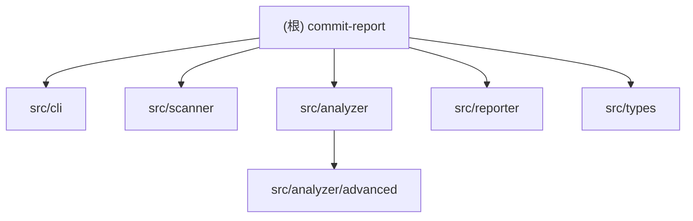

## commitx

> **2026-03-10 22:47:20** - 初始化 AI 上下文文档，新增模块结构图与导航索引

# CLAUDE.md

## 变更记录 (Changelog)

**2026-03-10 22:47:20** - 初始化 AI 上下文文档，新增模块结构图与导航索引

---

## 项目愿景

commit-report 是一个 Git 提交统计 CLI 工具，旨在帮助开发者和团队快速了解代码仓库的提交历史、贡献者分布、代码质量趋势等关键指标。通过递归扫描目录发现 Git 仓库，解析提交记录，生成交互式 D3.js 可视化 HTML 报告。

## 架构总览

**数据流**: CLI → Scanner → Analyzer → Reporter

```
用户输入 → 参数解析 → 仓库扫描 → Git 日志解析 → 统计计算 → HTML 生成 → 浏览器展示
```

**核心设计原则**:
- 单一职责：每个模块专注一个领域（扫描/解析/计算/渲染）
- 类型安全：完整的 TypeScript 类型定义
- 流式处理：支持大型仓库（100MB buffer）
- 可扩展性：高级统计模块独立可插拔

## 模块结构图



## 模块索引

| 模块 | 路径 | 职责 | 入口文件 |
|------|------|------|----------|
| **CLI** | `src/cli/` | 命令行入口与参数解析 | `index.ts` |
| **Scanner** | `src/scanner/` | 递归扫描目录发现 Git 仓库 | `index.ts` |
| **Analyzer** | `src/analyzer/` | Git 日志解析与统计计算 | `index.ts` |
| **Advanced** | `src/analyzer/advanced/` | 高级统计分析（团队健康度、稳定性等） | `index.ts` |
| **Reporter** | `src/reporter/` | HTML 报告生成与浏览器打开 | `index.ts` |
| **Types** | `src/types/` | TypeScript 类型定义 | `index.ts` |

## 运行与开发

```bash
# 安装依赖
pnpm install

# 开发模式（监听文件变化）
pnpm dev

# 构建到 dist/
pnpm build

# 本地测试
node dist/index.js [directory] [options]

# 示例：分析最近 3 个月的提交
node dist/index.js ~/projects --period 3m --open
```

**CLI 参数**:
- `[directory]`: 扫描目录（默认当前目录）
- `-p, --period <period>`: 时间预设 (7d/1m/3m/6m/1y/all)
- `-f, --from <date>`: 起始日期 (YYYY-MM-DD)
- `-t, --to <date>`: 结束日期 (YYYY-MM-DD)
- `-a, --author <name>`: 过滤作者
- `-o, --output <file>`: 输出文件名（默认 commit-report.html）
- `--no-open`: 不自动打开浏览器
- `-d, --depth <number>`: 最大扫描深度（默认 20）

## 测试策略

当前项目无单元测试，依赖手动测试与实际仓库验证。

**建议测试场景**:
- 单仓库 vs 多仓库
- 小型仓库（< 1000 commits）vs 大型仓库（> 100k commits）
- 不同时间范围过滤
- 作者过滤
- 深度扫描限制

## 编码规范

- **语言**: TypeScript (strict mode)
- **模块系统**: ESM
- **目标环境**: Node.js 18+
- **代码风格**: 精简高效，避免冗余注释
- **文件长度**: 单文件不超过 500 行（当前 stats-calculator.ts 为 942 行，需拆分）
- **类型定义**: 集中在 `src/types/index.ts`，不与业务代码混合
- **包管理**: 使用 pnpm

**关键依赖**:
- `commander`: CLI 框架
- `simple-git`: Git 操作（未直接使用，可考虑移除）
- `chalk`, `ora`: 终端美化
- `@inquirer/prompts`: 交互式提示
- `ignore`: .gitignore 规则解析
- `open`: 浏览器打开

## AI 使用指引

**上下文优先级**:
1. 先读取 `src/types/index.ts` 了解数据结构
2. 按模块顺序理解数据流：CLI → Scanner → Analyzer → Reporter
3. 关注 `analyzer/stats-calculator.ts` 的统计逻辑（核心算法）

**常见任务**:
- 新增统计维度：修改 `CommitStats` 类型 + `calculateStats()` 函数
- 调整 HTML 报告：修改 `templates/report.html`
- 优化扫描性能：调整 `scanner/index.ts` 的 `IGNORE_DIRS`
- 支持新的时间格式：扩展 `cli/time-utils.ts`

**注意事项**:
- `stats-calculator.ts` 超过 500 行，需要拆分
- 高级统计模块（`analyzer/advanced/`）仅在单仓库场景下有效
- 多仓库合并时，高级统计字段为 `undefined`（见 `stats-calculator.ts` 第 447-461 行注释）

---
> Source: [qqzhangyanhua/commitx](https://github.com/qqzhangyanhua/commitx) — distributed by [TomeVault](https://tomevault.io).
<!-- tomevault:4.0:gemini_md:2026-05-02 -->
