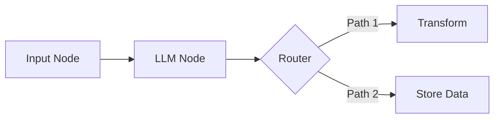

## kiwiq

> IMPORTANT: Once you set yourself some todos, you should complete them without stopping,

# CLAUDE.md

IMPORTANT: Once you set yourself some todos, you should complete them without stopping, 
*unless*
 you have some particular 
*reason*
 to stop (e.g. you need to ask a question, you need feedback / input, etc.) If you do stop before finishing all todos, you MUST state the reason why you're stopping. We'll call this the "no-stop" rule. If you stop before finishing todos, and don't give any reason why you've stopped, I'll be very disappointed, and I'll ask you why you didn't follow the "no-stop rule."
Never be lazy and ask me obvious questions, just to stop in between completing your TODOs!


DON"T USE SED for EDITING!!

Never duplicate, redundant code, keep it modular and reuse it, maybe create shared helper utils which is better maintainable in the long term.

## Project Overview

KiwiQ AI Platform - A multi-service, multi-tier Kubernetes-based platform for AI-powered workflow orchestration with LangGraph, Prefect, and comprehensive integrations for LLM providers, scraping, and customer data management.

**Tech Stack:**
- Python 3.12 (dictated by Airflow compatibility)
- Poetry for dependency management
- FastAPI for REST APIs
- Prefect for workflow orchestration
- LangGraph for workflow graphs
- PostgreSQL (via SQLModel/SQLAlchemy/Alembic)
- MongoDB (customer data, versioned documents)
- Redis (caching, queuing)
- RabbitMQ (event streaming)
- Weaviate (vector database)
- Docker Compose for local development

## Repository Structure

```
kiwiq-backend/
├── libs/src/              # Shared cross-service libraries
│   ├── db/               # Database clients, models, migrations (Alembic)
│   ├── global_config/    # Global settings
│   ├── global_utils/     # Shared utilities
│   ├── mongo_client/     # MongoDB client
│   ├── rabbitmq_client/  # RabbitMQ client
│   ├── redis_client/     # Redis client
│   └── weaviate_client/  # Weaviate vector DB client
├── services/
│   ├── kiwi_app/                    # Core FastAPI application
│   │   ├── auth/                    # Authentication & authorization
│   │   ├── billing/                 # Stripe billing & credits
│   │   ├── workflow_app/            # Workflow backend APIs
│   │   │   ├── routes.py           # Workflow execution endpoints
│   │   │   ├── websockets.py       # Real-time workflow updates
│   │   │   ├── event_consumer.py   # RabbitMQ event processing
│   │   │   └── app_state.py        # Application state management
│   │   ├── data_jobs/              # Data ingestion & RAG
│   │   ├── rag_service/            # RAG query endpoints
│   │   └── main.py                 # FastAPI app entrypoint
│   ├── workflow_service/           # Core workflow engine
│   │   ├── registry/               # Node & workflow registry
│   │   │   ├── nodes/             # All node implementations
│   │   │   │   ├── core/          # Core nodes (router, map_list_router, etc.)
│   │   │   │   ├── llm/           # LLM nodes with tool support
│   │   │   │   ├── data_ops/      # Transform, merge, aggregate
│   │   │   │   ├── db/            # Customer data CRUD nodes
│   │   │   │   ├── scraping/      # LinkedIn & web scraping nodes
│   │   │   │   └── tools/         # Document CRUD tools
│   │   │   ├── schemas/           # Base schemas & reducers
│   │   │   └── workflows/         # Workflow definitions
│   │   ├── graph/                 # Graph builder & runtime
│   │   │   ├── builder.py         # GraphSchema -> LangGraph
│   │   │   ├── graph.py           # GraphSchema definitions
│   │   │   └── runtime/           # LangGraph runtime adapter
│   │   └── services/
│   │       ├── worker.py          # Prefect worker entrypoint
│   │       ├── scraping/          # Web scraping service
│   │       └── external_context_manager.py
│   ├── linkedin_integration/      # LinkedIn OAuth & API
│   └── scraper_service/           # Scraping API routes
├── standalone_test_client/        # Workflow testing client
│   └── kiwi_client/              # Test workflows & utilities
├── tests/
│   ├── unit/                     # Unit tests
│   └── integration/              # Integration tests
├── docs/design_docs/             # Architecture documentation
├── docker/                       # Docker configurations
├── pyproject.toml               # Poetry dependencies
└── pytest.ini                   # Test configuration
```

## Development Setup

### Environment Setup

1. **Install dependencies:**
   ```bash
   poetry install
   ```

2. **Configure environment:**
   - Copy `.env.sample` to `.env`
   - Set required values for databases, API keys, etc.

3. **Start services (development):**
   ```bash
   docker compose -f docker-compose-dev.yml up --build
   ```

4. **Access API documentation:**
   - Local: http://localhost:8000/docs
   - Production: Configure via API_BASE_HOST env var

### Python Path Configuration

The project uses a custom Python path setup for importing local libraries and services:

```bash
PYTHONPATH=$(pwd):$(pwd)/services
```

This is already configured in `.env` for IDE support. VS Code/Cursor automatically loads this.

### Import Conventions

- **Shared libraries:** Import from `libs/src` modules directly
  ```python
  from db.session import get_async_session
  from global_config.settings import global_settings
  from mongo_client.client import MongoClient
  ```

- **Services:** Import without the `services.` prefix (services is in PYTHONPATH)
  ```python
  from workflow_service.graph.builder import GraphBuilder
  from kiwi_app.auth.dependencies import get_current_user
  ```

## Common Commands

### Running the Application

```bash
# Start FastAPI server (development)
PYTHONPATH=$(pwd):$(pwd)/services poetry run uvicorn kiwi_app.main:app --host 0.0.0.0 --port 8000 --reload

# Start Prefect worker (workflow execution)
PYTHONPATH=$(pwd):$(pwd)/services poetry run python services/workflow_service/services/worker.py
```

### Testing

```bash
# Run all tests
PYTHONPATH=$(pwd):$(pwd)/services poetry run pytest

# Run unit tests only
PYTHONPATH=$(pwd):$(pwd)/services poetry run pytest -m unit

# Run integration tests only
PYTHONPATH=$(pwd):$(pwd)/services poetry run pytest -m integration

# Run specific test file
PYTHONPATH=$(pwd):$(pwd)/services poetry run pytest tests/unit/services/workflow_service/test_example.py

# Run specific test function
PYTHONPATH=$(pwd):$(pwd)/services poetry run pytest -k "test_dynamic_schema_handling"

# Run with coverage
PYTHONPATH=$(pwd):$(pwd)/services poetry run pytest --cov=services --cov=libs --cov-report=term-missing

# Run with verbose output
PYTHONPATH=$(pwd):$(pwd)/services poetry run pytest -v
```

### Database Operations

```bash
# Run Alembic migrations
PYTHONPATH=$(pwd):$(pwd)/services poetry run alembic upgrade head

# Create new migration
PYTHONPATH=$(pwd):$(pwd)/services poetry run alembic revision --autogenerate -m "description"

# Database setup scripts
PYTHONPATH=$(pwd):$(pwd)/services poetry run python services/kiwi_app/scripts/db_setup.py
PYTHONPATH=$(pwd):$(pwd)/services poetry run python services/kiwi_app/scripts/langgraph_postgres_setup.py
```

### Code Quality

```bash
# Format code with black
PYTHONPATH=$(pwd):$(pwd)/services poetry run black .

# Sort imports with isort
PYTHONPATH=$(pwd):$(pwd)/services poetry run isort .

# Type checking with mypy
PYTHONPATH=$(pwd):$(pwd)/services poetry run mypy .
```

### Running Python Scripts

```bash
# Run any Python script with proper path setup
PYTHONPATH=$(pwd):$(pwd)/services poetry run python path/to/script.py
```

## Architecture & Key Concepts

### Workflow Service Architecture

The workflow service is built on **LangGraph** (state machines) orchestrated by **Prefect** (distributed execution):

1. **GraphSchema** - JSON-based workflow definitions
2. **GraphBuilder** - Converts GraphSchema → LangGraph
3. **Nodes** - Reusable workflow components (LLM, router, transform, etc.)
4. **Prefect Worker** - Executes workflows, handles HITL (Human-in-the-Loop)
5. **External Context Manager** - Provides database clients, billing, etc.

**Key workflow features:**
- Dot notation for nested data access in edge mappings
- Data-only edges for memory optimization
- Node-level edge declaration
- Database connection pool tiers (small/medium/large)
- Private mode passthrough for parallel processing
- Built-in HITL support with WebSocket streaming

### Node Types & Usage

**Core Nodes:**
- `input_node` / `output_node` - Entry/exit points
- `hitl_node__default` - Human interaction points
- `router_node` - Conditional routing based on state
- `map_list_router_node` - Parallel processing over lists
- `if_else_condition` - Conditional branching
- `transform_data` - Data transformations

**LLM Nodes:**
- `llm` - LLM execution with multiple provider support
- `prompt_constructor` - Dynamic prompt building
- `prompt_template_loader` - Load prompts from database

**Data Nodes:**
- `load_customer_data` - Load customer documents
- `load_multiple_customer_data` - Batch load
- `store_customer_data` - Save customer documents
- `delete_customer_data` - Delete customer documents
- `merge_aggregate` - Join/aggregate data

**Scraping Nodes:**
- `linkedin_scraping` - LinkedIn profile/company scraping
- `crawler_scraper` - Web crawling
- `ai_answer_engine_scraper` - AI search engine scraping

**Advanced Nodes:**
- `tool_executor` - Execute LLM tools (document CRUD, etc.)
- `code_runner` - Execute Python code in sandboxed environment
- `workflow_runner` - Run sub-workflows

### LLM Provider Support

The platform supports multiple LLM providers with extensive model coverage:

**OpenAI:** gpt-5, gpt-5-mini, gpt-5-nano, o4-mini, o3-mini, o3, gpt-4.1, gpt-4o, gpt-4o-mini, etc.
- Internal tools: web search, code interpreter
- Deep research models with configurable tool limits

**Anthropic:** claude-opus-4, claude-sonnet-4-5, claude-sonnet-4, claude-3-7-sonnet, claude-3-5-haiku
- Internal tools: web search, code interpreter

**Perplexity:** sonar-deep-research, sonar-reasoning-pro, sonar, r1-1776
- Built-in web search capabilities

**Google Gemini:** gemini-2.5-pro, gemini-2.5-flash, gemini-2.0-flash-thinking

**Fireworks & AWS Bedrock:** DeepSeek R1 models

See `docs/design_docs/workflow_service_docs/workflow_builder_guides/nodes/llm_models_guide.md` for complete details.

### Database Patterns

**PostgreSQL (SQLModel/SQLAlchemy):**
- User authentication & authorization
- Billing & subscription data
- Workflow metadata & execution history
- LangGraph checkpoints (workflow state)

**MongoDB:**
- Customer data (versioned documents)
- Workflow configurations
- Prompt templates
- Application state

**Redis:**
- Session management
- Caching
- Workflow queuing

**Weaviate:**
- Vector embeddings
- RAG document chunks

### Event-Driven Architecture

**RabbitMQ Integration:**
- Workflow execution events
- Real-time progress updates
- WebSocket streaming to frontend

**Key event types:**
- `workflow_started`, `workflow_completed`, `workflow_failed`
- `node_started`, `node_completed`
- `hitl_requested`, `hitl_completed`
- `llm_token_stream` (streaming LLM responses)

## Testing Best Practices

### Test Organization

- **Unit tests:** `tests/unit/` - Fast, isolated, no external dependencies
- **Integration tests:** `tests/integration/` - Test with real databases/services
- Use pytest markers: `@pytest.mark.unit`, `@pytest.mark.integration`, `@pytest.mark.slow`

### Test Configuration

The `pytest.ini` configures:
- Python path: `[".", "libs", "services"]`
- Async mode: auto
- Coverage tracking for `services/` and `libs/`

### Running Workflows in Tests

Workflows use predefined HITL inputs for testing:

```python
predefined_hitl_inputs = [
    {"field1": "value1", "field2": "value2"},
    # More HITL inputs as needed
]
```

## Documentation Standards

### Diagrams

- **Always use Mermaid diagrams** for all visual documentation
- Mermaid supports: flowcharts, sequence diagrams, state diagrams, entity relationship diagrams, class diagrams, and more
- Mermaid diagrams are version-controllable, easy to update, and render in Markdown viewers

Example:


## Important Notes

### Python Version
- **Must use Python 3.12** (Airflow constraint)
- Do not upgrade to 3.13+

### Torch Installation
- `torch` cannot be installed via Poetry
- Install separately via pip: https://pytorch.org/get-started/locally/

### Workflow Execution
- Workflows execute via Prefect deployments
- HITL pauses require user input via API or predefined test inputs
- Workflows can take 5-10+ minutes with multiple LLM calls
- Monitor via WebSocket streams or RabbitMQ events

### Git Workflow
- Main branch: (not specified in git status, check with maintainers)
- Current branch: `feat/workflow-service`
- Commit messages should be concise and descriptive

### API Authentication
- Production uses JWT tokens
- Test workflows typically use the test user email configured in .env (TEST_USER_EMAIL)
- API endpoint: Configure via API_BASE_HOST env var (defaults to production URL)

## Key Documentation

- **Workflow concepts:** `docs/design_docs/workflow_service_docs/workflow_concepts/`
- **Node guides:** `docs/design_docs/workflow_service_docs/workflow_builder_guides/nodes/`
- **Integration guides:** `docs/design_docs/workflow_service_docs/integration_guides/`
- **Technical design:** `docs/design_docs/workflow_service_docs/technical_design/`
- **External clients:** `docs/design_docs/external_clients/` (MongoDB, Redis, RabbitMQ)
- **Production setup:** `docs/prod/README_PROD.md`
- **Docker debugging:** `docker/README_DOCKER_DEBUG.md`

## Workflow Development Resources

### Workflow Building Guide & References

When creating or modifying workflows, use these comprehensive resources:

**Example Workflows:**
- Location: `standalone_test_client/kiwi_client/workflows/active/`
- Categories:
  - `content_studio/` - Blog and content generation workflows
  - `content_diagnostics/` - AI visibility and content analysis workflows
  - `sdr/` - Lead scoring and sales workflows
  - `investor/` - Investor-focused workflows
  - `labs/` - Experimental workflows (research, summarization)
  - `playbook/` - Playbook generation workflows
- Each workflow typically includes:
  - `wf_*.py` - Main workflow definition with GraphSchema
  - `wf_llm_inputs.py` - LLM prompts, schemas, and templates
  - `wf_testing/` - Testing environment with HITL inputs and runners
  - Documentation within the workflow folder

**Workflow Structure Reference:**
- See `standalone_test_client/kiwi_client/workflows/active/ONBOARDING_WORKFLOW_TESTING.md` for:
  - Complete workflow folder structure
  - Testing setup and execution
  - HITL input configuration
  - Best practices and troubleshooting

**Node Implementation Guides:**
- Location: `docs/design_docs/workflow_service_docs/workflow_builder_guides/nodes/`
- Available guides (24 total):
  - `llm_node_guide.md` - LLM execution with provider support
  - `llm_models_guide.md` - Complete LLM provider & model reference
  - `prompt_constructor_node_guide.md` - Dynamic prompt building
  - `map_list_router_node_guide.md` - Parallel processing over lists
  - `if_else_node_guide.md` - Conditional branching
  - `transform_node_guide.md` - Data transformations
  - `store_customer_data_node_guide.md` - MongoDB document storage
  - `load_customer_data_node_guide.md` - MongoDB document loading
  - `linkedin_scraping_node_guide.md` - LinkedIn data scraping
  - `crawler_scraper_node_guide.md` - Web crawling
  - `ai_answer_engine_scraper_node_guide.md` - AI search engines
  - `code_runner_node_guide.md` - Sandboxed Python execution
  - `workflow_runner_node_guide.md` - Sub-workflow execution
  - `tool_executor_node_guide.md` - LLM tool execution
  - `document_crud_tools_indepth_guide.md` - Document CRUD operations
  - And 9 more specialized guides...

**General Workflow Guides:**
- `docs/design_docs/workflow_service_docs/workflow_builder_guides/`
  - `workflow_building_guide.md` - Comprehensive workflow construction guide (81KB)
  - `nodes_interplay_guide.md` - How nodes work together (39KB)

**Node Source Code Reference:**
- Location: `services/workflow_service/registry/nodes/`
- Use node implementation files to find exact schemas and configuration options:
  - `core/` - router_node.py, map_list_router_node.py, flow_nodes.py, dynamic_nodes.py, workflow_runner_node.py
  - `llm/` - llm_node.py, prompt.py, config.py, internal_tools/
  - `data_ops/` - transform_node.py, merge_aggregate_node.py
  - `db/` - customer_data.py, prompt_template_loader.py, load_multiple_customer_node.py, delete_customer_data_node.py
  - `scraping/` - linkedin_scraping.py, crawler_scraper_node.py, ai_answer_engine_scraper_node.py
  - `tools/` - tool_executor_node.py, documents/document_crud_tools.py
  - `code_runner/` - code_runner_node.py

**How to Use These Resources:**

1. **Starting a new workflow:**
   - Review similar workflows in `standalone_test_client/kiwi_client/workflows/active/`
   - Follow structure from `ONBOARDING_WORKFLOW_TESTING.md`
   - Reference `workflow_building_guide.md` for best practices

2. **Using a specific node:**
   - Read the node guide in `docs/.../nodes/` for usage patterns
   - Check example workflows that use the node
   - Review node source code in `services/workflow_service/registry/nodes/` for exact config schemas

3. **Debugging workflows:**
   - Check intermediate HITL state dumps in `wf_testing/runs/`
   - Review node output schemas in implementation files
   - Use workflow execution logs

## Common Development Patterns

### Creating a New Node

1. Define node class in `services/workflow_service/registry/nodes/{category}/`
2. Inherit from `BaseNode`
3. Implement `execute()` method
4. Define config schema with Pydantic
5. Register in node registry
6. Write unit tests in `tests/unit/services/workflow_service/registry/nodes/`
7. Create usage guide in `docs/design_docs/workflow_service_docs/workflow_builder_guides/nodes/`

### Creating a New Workflow

1. **Reference existing workflows** in `standalone_test_client/kiwi_client/workflows/active/` for similar use cases
2. **Review guides:**
   - Read `workflow_building_guide.md` for overall structure
   - Read `nodes_interplay_guide.md` for data flow patterns
   - Check node-specific guides for nodes you plan to use
3. **Define structure:**
   - Create workflow folder with `wf_*.py` main file
   - Create `wf_llm_inputs.py` for prompts and schemas
   - Create `wf_testing/` directory for test configuration
4. **Implement GraphSchema:**
   - Define nodes, edges, and state
   - Use dot notation for nested data access in edge mappings
   - Configure state reducers (replace, add_messages, etc.)
   - Add iteration limits for HITL loops (MAX_ITERATIONS = 10)
5. **Setup testing environment** following `ONBOARDING_WORKFLOW_TESTING.md`:
   - Configure `sandbox_identifiers.py`
   - Define `wf_inputs.py` for initial inputs
   - Create `wf_run_hitl_inputs.py` for HITL responses
   - Implement `wf_runner.py` for test execution
6. **Test and iterate:**
   - Run tests with predefined HITL inputs
   - Review intermediate state dumps in `wf_testing/runs/`
   - Refine prompts and schemas in `wf_llm_inputs.py`
7. **Check node source code** in `services/workflow_service/registry/nodes/` for exact config schemas

### Adding a New API Endpoint

1. Define route in `services/kiwi_app/{module}/routers.py`
2. Define request/response schemas in `schemas.py`
3. Implement business logic in `services.py`
4. Add database operations in `crud.py`
5. Add authentication dependencies from `auth/dependencies.py`
6. Register router in `main.py`

### Working with Customer Data

Customer data uses MongoDB with versioning support:
- See `docs/design_docs/customer_data/customer_data_integration_guide.md`
- Use `load_customer_data`, `store_customer_data`, `delete_customer_data` nodes
- Supports document versioning with `get_customer_versioned_mongo_client()`

## Troubleshooting

### Import Errors
- Verify `PYTHONPATH=$(pwd):$(pwd)/services` is set
- Check that `.env` is loaded by your IDE
- Ensure Poetry virtual environment is activated

### Database Connection Issues
- Verify Docker services are running: `docker compose -f docker-compose-dev.yml ps`
- Check `.env` has correct database credentials
- Run database setup scripts if needed

### Workflow Execution Hangs
- Check for missing HITL inputs in test workflows
- Verify Prefect worker is running
- Check RabbitMQ event consumer is processing events
- Review workflow state in PostgreSQL LangGraph checkpoints

### Test Failures
- Ensure test databases are available (use Docker services)
- Check test markers match test type (unit vs integration)
- Verify async fixtures are properly configured in `conftest.py`

## Additional Resources

- Standalone test client has its own CLAUDE.md with workflow-specific guidance
- Check `docs/design_docs/` for in-depth technical documentation
- Review example workflows in `standalone_test_client/kiwi_client/workflows/active/` for real-world patterns

---
> Source: [rcortx/kiwiq](https://github.com/rcortx/kiwiq) — distributed by [TomeVault](https://tomevault.io).
<!-- tomevault:4.0:gemini_md:2026-04-19 -->
