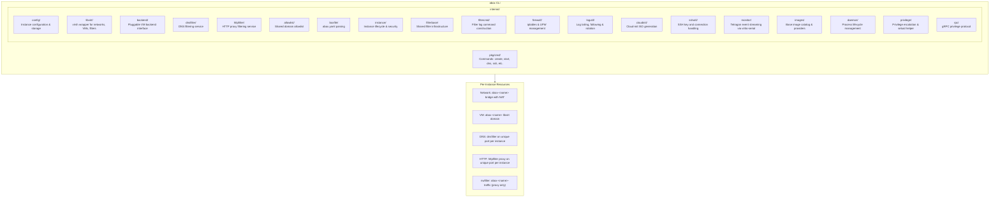

## abox

> Handles operations requiring root (iptables, ufw, qemu-img, etc.) via a gRPC protocol. For e2e tests, set `ABOX_PRIVILEGE_SOCKET` and `ABOX_PRIVILEGE_TOKEN` to connect to a pre-existing helper. See [docs/privilege-helper.md](docs/privilege-helper.md) for setup options.

# CLAUDE.md

This file provides guidance to Claude Code (claude.ai/code) when working with code in this repository.

## Project Overview

**abox** is a CLI tool for creating security-isolated VM environments for AI coding agents. Each instance gets its own network, DNS filtering, and configuration.

## Development

```bash
make build              # Build abox CLI (CGO_ENABLED=0)
make build-helper       # Build setuid privilege helper
make install            # Install abox to ~/.local/bin/
make install-helper     # Install abox-helper to /usr/local/bin/ (sudo)
make test               # Unit tests (go test -v -race)
make test-e2e           # E2E tests (requires running system, 30m timeout)
make test-e2e-short     # E2E tests with -short flag (5m timeout)
make test-e2e-all       # E2E matrix across distributions
make test-e2e-all-short # E2E matrix with -short flag
make proto              # Regenerate protobuf Go code
make lint               # golangci-lint
make clean              # Remove build artifacts
make release-dry-run    # Build release artifacts without publishing
```

Manual build (without version info):
```bash
go build -o abox ./cmd/abox
go build -o abox-helper ./cmd/abox-helper
```

## CLI Reference

Run `abox --help` or `abox <command> --help` for CLI usage, flags, and aliases.
For user documentation, see [docs/](docs/README.md).

## Architecture



## Key Files

| Path | Purpose |
|------|---------|
| `pkg/cmd/*/` | CLI commands (each command in its own package) |
| `pkg/cmd/root/root.go` | Root command and subcommand registration |
| `internal/instance/` | Instance lifecycle and security (create, start, stop, remove) |
| `internal/backend/` | Pluggable VM backend interface and registry |
| `internal/libvirt/` | XML generation, virsh commands |
| `internal/config/` | Instance config, paths, allocation |
| `internal/boxfile/` | abox.yaml parsing and validation |
| `internal/dnsfilter/` | DNS filtering service and radix tree |
| `internal/httpfilter/` | HTTP proxy filtering service |
| `internal/allowlist/` | Shared domain allowlist (radix tree) |
| `internal/firewall/` | Host-level firewall management (iptables, UFW) |
| `internal/filterbase/` | Shared filter infrastructure, status display, SSRF protection |
| `internal/filtercmd/` | Filter log command construction (shared by dns/http/monitor) |
| `internal/logutil/` | Log file tailing, following, and rotation |
| `internal/privilege/` | Privilege escalation, validation, and setuid helper |
| `internal/monitor/` | Tetragon event streaming via virtio-serial |
| `internal/images/` | Base image catalog and providers |
| `internal/daemon/` | Daemon process lifecycle |
| `internal/rpc/` | gRPC privilege helper protocol |
| `cmd/abox-helper/` | Setuid privilege helper binary |
| `~/.local/share/abox/instances/<name>/` | Instance data |

## Instance Configuration

Each instance is stored at `~/.local/share/abox/instances/<name>/` with a `config.yaml`, SSH keys, allowlist, and logs. For the full abox.yaml configuration reference, see [docs/abox-yaml.md](docs/abox-yaml.md). For log file locations and troubleshooting, see [docs/troubleshooting.md](docs/troubleshooting.md#log-locations).

## libvirt Integration

Uses `virsh` commands (not go-libvirt library):
- `virsh net-define/start/destroy` - Network management
- `virsh define/start/shutdown/destroy` - VM management
- `virsh nwfilter-define` - Packet filtering
- `virsh update-device` - Apply/remove nwfilter at runtime

## Network Filtering

Each instance runs separate dnsfilter and httpfilter processes sharing a unified allowlist with radix tree matching. Both use Unix socket APIs for runtime control and support hot-reload via `abox allowlist reload`. For architecture details, see [docs/filtering.md](docs/filtering.md).

## Monitor Daemon

Streams Tetragon security events from the VM via virtio-serial. Spawned by `abox start` when `monitor.enabled: true`. See [docs/troubleshooting.md](docs/troubleshooting.md#log-locations) for log locations.

## Privilege Helper

Handles operations requiring root (iptables, ufw, qemu-img, etc.) via a gRPC protocol. For e2e tests, set `ABOX_PRIVILEGE_SOCKET` and `ABOX_PRIVILEGE_TOKEN` to connect to a pre-existing helper. See [docs/privilege-helper.md](docs/privilege-helper.md) for setup options.

## Adding Features

When adding new commands:
1. Create `pkg/cmd/<command>/<command>.go`
2. Add to `rootCmd` in `pkg/cmd/root/root.go`
3. Use `config.Load()` to get instance config
4. Use backend abstraction via `factory.BackendFor(name)` for VM/network operations

Note: The codebase uses a backend abstraction layer (`internal/backend/`) to support multiple VM backends. Currently only libvirt is implemented, but commands should use the backend interface rather than calling `internal/libvirt/` directly.

---
> Source: [sandialabs/abox](https://github.com/sandialabs/abox) — distributed by [TomeVault](https://tomevault.io).
<!-- tomevault:4.0:gemini_md:2026-04-23 -->
