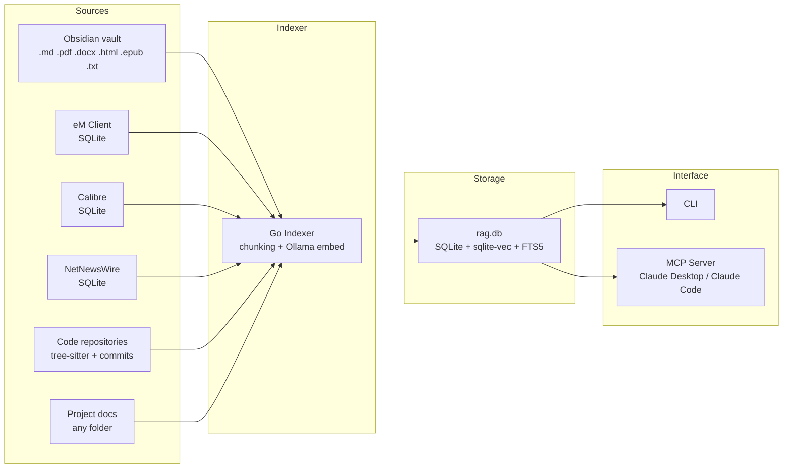

## local-rag

> A fully local, privacy-preserving RAG (Retrieval Augmented Generation) system for macOS. Indexes personal knowledge from multiple sources into a single SQLite database with vector + full-text hybrid search. Exposes search via CLI and an MCP server so Claude Desktop and Claude Code can query it directly.

# CLAUDE.md

## Project: local-rag

A fully local, privacy-preserving RAG (Retrieval Augmented Generation) system for macOS. Indexes personal knowledge from multiple sources into a single SQLite database with vector + full-text hybrid search. Exposes search via CLI and an MCP server so Claude Desktop and Claude Code can query it directly.

---

## Quick Start

```bash
# Prerequisites
brew install ollama go
ollama pull bge-m3

# Optional: OCR support for scanned PDFs
brew install tesseract tesseract-lang

# Build
git clone https://github.com/sebastianhutter/local-rag.git
cd local-rag
make build            # binary at bin/local-rag

# Index sources
local-rag index obsidian
local-rag index email
local-rag index calibre
local-rag index rss
local-rag index code rustyquill
local-rag index code                    # all groups
local-rag index code rustyquill --history  # code + commit history
local-rag index project                  # all projects
local-rag index project "Project Alpha"  # specific project

# Search
local-rag search "kubernetes deployment strategy"
local-rag search "invoice from supplier" --collection email
local-rag search "API specification" --collection "Project Alpha"

# Remove entries whose originals are gone
local-rag prune                          # all collections
local-rag prune obsidian                 # one collection

# Run MCP server (for Claude Desktop / Claude Code integration)
local-rag serve
```

---

## Architecture



### Core Concepts

**Collections**: Every indexed source belongs to a collection. System collections ("obsidian", "email", "calibre", "rss") have dedicated parsers. Code repositories are collections of type "code" that contain one or more git repos grouped by org or topic. Project folders create project-type collections. Search can target a specific collection or search across all of them.

**Hybrid search**: Every query runs both vector similarity search (semantic) and FTS5 full-text search (keyword). Results are merged using Reciprocal Rank Fusion (RRF). This ensures that both "what does this mean" and "find the exact phrase" queries work well.

Vector search is two-stage for speed: a fast Hamming-distance KNN over binary-quantized vectors (`vec_documents_bin`) gathers a candidate pool, which is then reranked with the exact float vectors (`vec_documents`). This avoids a full-precision scan of every stored vector on each query. See `docs/hybrid-search-and-rrf.md`.

**Incremental indexing**: Track file hashes, modification times, and watermarks. Only re-embed changed or new content. Use `--force` to re-index everything.

**Pruning**: Indexing removes what indexing cannot see. Before indexing `obsidian`, `code`, `project` or `all`, a prune pass drops sources whose file no longer exists on disk, so deleted and moved files leave search results without a manual step; `--no-prune` skips it. The standalone `local-rag prune [COLLECTION]` covers every collection type — including email, calibre and rss, which are pruned against their source databases rather than the filesystem. `prune --vectors` is a separate repair path: it deletes embeddings in `vec_documents`/`vec_documents_bin` whose `document_id` no longer resolves, which CASCADE cannot do because the vec0 virtual tables have no foreign keys.

---

## Supported Sources

| Source | Collection | CLI Command | Data Source |
|--------|------------|-------------|-------------|
| **Obsidian** | `obsidian` | `index obsidian` | Vault directory — all file types (.md, .pdf, .docx, .html, .txt, .epub) |
| **eM Client** | `email` | `index email` | SQLite databases (read-only) — subject, body, sender, recipients, date, folder |
| **Calibre** | `calibre` | `index calibre` | SQLite metadata.db + book files (read-only) — EPUB/PDF content with author, tags, series metadata |
| **NetNewsWire** | `rss` | `index rss` | SQLite databases (read-only) — RSS article title, author, content, feed name |
| **Code Repositories** | repo name | `index code [NAME]` | Git repos grouped by org/topic — paths can be direct repos or parent directories (repos are discovered recursively). Tree-sitter structural parsing + commit history (messages and per-file diffs), respects .gitignore |
| **Project Docs** | user name | `index project [NAME]` | Any folder — files dispatched to correct parser by extension, paths from config |

---

## Tech Stack

| Component    | Choice                     | Notes                                  |
|--------------|----------------------------|----------------------------------------|
| Language     | Go 1.26+                   | CGO required for SQLite                |
| Database     | SQLite + sqlite-vec + FTS5 | Single file, no server                 |
| Embeddings   | Ollama + bge-m3 (1024d)    | Fully local, no API keys               |
| GUI          | Fyne v2 + systray          | macOS menu bar app                     |
| MCP          | mcp-go                     | SSE and stdio transports               |
| PDF          | go-pdfium (WASM/Wazero)    | No CGO needed for PDF                  |
| PDF OCR      | tesseract (optional)       | Fallback for scanned/image-only PDFs   |
| DOCX         | archive/zip + encoding/xml | Word document extraction (.docx, .dotx)|
| Code parsing | go-tree-sitter             | 13 languages; AST split-then-merge (cAST) chunking |
| CLI          | Cobra                      | Subcommands, flags, help               |
| HTML cleanup | golang.org/x/net/html      | Strip tags from email/RSS              |

---

## Database Schema

The database lives at `~/.local-rag/rag.db` by default (configurable).

```sql
-- Collections: namespaces for organizing indexed content
-- System collections: 'obsidian', 'email', 'calibre', 'rss'
-- User collections: any name, used for project-based grouping
CREATE TABLE collections (
    id INTEGER PRIMARY KEY AUTOINCREMENT,
    name TEXT NOT NULL UNIQUE,
    collection_type TEXT NOT NULL DEFAULT 'project',  -- 'system', 'project', or 'code'
    description TEXT,
    paths TEXT,                               -- JSON array of source paths (used by project collections)
    created_at TEXT DEFAULT (datetime('now'))
);

-- Sources: individual files or email accounts that have been indexed
CREATE TABLE sources (
    id INTEGER PRIMARY KEY AUTOINCREMENT,
    collection_id INTEGER NOT NULL REFERENCES collections(id) ON DELETE CASCADE,
    source_type TEXT NOT NULL,           -- 'markdown', 'email', 'pdf', 'docx', 'txt', 'html', 'epub', 'code', 'rss'
    source_path TEXT NOT NULL,           -- file path or email message ID
    file_hash TEXT,                      -- SHA256 of file content for change detection
    file_modified_at TEXT,               -- filesystem mtime
    last_indexed_at TEXT,
    UNIQUE(collection_id, source_path)
);

-- Documents: chunked content with metadata
CREATE TABLE documents (
    id INTEGER PRIMARY KEY AUTOINCREMENT,
    source_id INTEGER NOT NULL REFERENCES sources(id) ON DELETE CASCADE,
    collection_id INTEGER NOT NULL REFERENCES collections(id) ON DELETE CASCADE,
    chunk_index INTEGER NOT NULL,
    title TEXT,                           -- note title, email subject, PDF filename
    content TEXT NOT NULL,                -- the text chunk
    metadata TEXT,                        -- JSON: tags, sender, dates, heading path, page number, etc.
    created_at TEXT DEFAULT (datetime('now')),
    UNIQUE(source_id, chunk_index)
);

-- Vector index (sqlite-vec virtual table) — exact float embeddings, used for reranking
CREATE VIRTUAL TABLE vec_documents USING vec0(
    embedding float[1024],
    document_id INTEGER
);

-- Binary-quantized mirror of vec_documents (1 bit/dim, ~32x smaller). Shares each
-- row's rowid with vec_documents so the exact float vector can be fetched by rowid.
-- Vector search runs a fast Hamming-distance KNN here to gather candidates, then
-- reranks them with the exact float vectors above. Kept in sync on insert/delete.
CREATE VIRTUAL TABLE vec_documents_bin USING vec0(
    embedding bit[1024],
    document_id INTEGER
);

-- Speeds up per-collection COUNT/aggregation (collections list/info) and
-- collection-scoped deletes; without it those queries full-scan documents.
CREATE INDEX idx_documents_collection_id ON documents(collection_id);

-- Full-text search index (FTS5)
CREATE VIRTUAL TABLE documents_fts USING fts5(
    title,
    content,
    content='documents',
    content_rowid='id'
);

-- Key/value store for schema bookkeeping: 'schema_version' drives db.Migrate,
-- 'binary_backfill_done' marks vec_documents_bin as fully populated so the
-- one-time backfill is not re-checked on every open.
CREATE TABLE meta (
    key TEXT PRIMARY KEY,
    value TEXT
);

-- Triggers to keep FTS in sync with documents table
CREATE TRIGGER documents_ai AFTER INSERT ON documents BEGIN
    INSERT INTO documents_fts(rowid, title, content) VALUES (new.id, new.title, new.content);
END;
CREATE TRIGGER documents_ad AFTER DELETE ON documents BEGIN
    INSERT INTO documents_fts(documents_fts, rowid, title, content) VALUES('delete', old.id, old.title, old.content);
END;
CREATE TRIGGER documents_au AFTER UPDATE ON documents BEGIN
    INSERT INTO documents_fts(documents_fts, rowid, title, content) VALUES('delete', old.id, old.title, old.content);
    INSERT INTO documents_fts(rowid, title, content) VALUES (new.id, new.title, new.content);
END;
```

**Schema changes.** Every statement above is `CREATE ... IF NOT EXISTS`, so `InitSchema` is idempotent and adding a new table, index or virtual table there is enough — existing databases pick it up on the next open. `db.Migrate` handles only what a re-run of `InitSchema` cannot fix: data that must be rewritten (`collection_type` reclassification), columns added to an existing table (`ALTER TABLE`), and one-time backfills. Bump `SchemaVersion` and add a `if current < N` block when a change needs that; otherwise `InitSchema` alone is the migration path.

---

## File Structure

```
local-rag/
├── CLAUDE.md                        # This file
├── Makefile                         # Build targets (build, test, lint, app, dmg)
├── README.md
├── go.mod / go.sum                  # Go module dependencies
├── cmd/
│   └── local-rag/
│       ├── main.go                  # Cobra root command, global flags, version
│       ├── cmd_index.go             # index (obsidian/email/calibre/rss/code/project/all)
│       ├── cmd_search.go            # search
│       ├── cmd_collections.go       # collections list/info/delete/export/paths
│       ├── cmd_prune.go             # prune, prune --vectors
│       ├── cmd_status.go            # status
│       ├── cmd_serve.go             # serve (stdio / SSE)
│       └── cmd_gui.go               # gui
├── configs/
│   └── config.example.json          # Annotated configuration template
├── .github/
│   └── workflows/release.yml        # Tagged release build
├── docs/
│   ├── architecture.md              # System architecture overview
│   ├── emclient-schema.md           # eM Client SQLite schema documentation
│   ├── hybrid-search-and-rrf.md     # How hybrid search and RRF work
│   └── ollama-and-embeddings.md     # Ollama setup and embedding models
├── internal/
│   ├── config/                      # Configuration loading and defaults
│   ├── db/                          # SQLite + sqlite-vec + FTS5 setup, migrations, orphan/prune queries
│   ├── embeddings/                  # Ollama embedding client + host resolution
│   ├── chunker/                     # Text chunking strategies (per file type)
│   ├── search/                      # Hybrid search engine (vector + FTS + RRF)
│   ├── parser/                      # File parsers (markdown, pdf, docx, epub, html, code, rss, email, calibre)
│   ├── indexer/                     # Source indexers (obsidian, email, calibre, rss, git, project),
│   │                                #   shared batching (batch.go), pruning (prune.go)
│   ├── mcp/                         # MCP server (tools, SSE, stdio)
│   └── gui/                         # Fyne menu bar app, settings, log viewer
└── scripts/
    ├── build-app.sh                 # Create macOS .app bundle
    └── build-dmg.sh                 # Create DMG installer
```

---

## CLI Commands

```bash
# Indexing
local-rag index obsidian [--vault/-V PATH]...    # Index Obsidian vaults (from config or args)
local-rag index email                             # Index eM Client emails
local-rag index calibre [--library/-l PATH]...   # Index Calibre ebook libraries
local-rag index rss                               # Index NetNewsWire RSS articles
local-rag index code [NAME] [--history]          # Index repository collection(s), --history for commit history
local-rag index project [NAME]                    # Index project(s) from config
local-rag index all                               # Index all configured sources at once

# All index commands support --force to re-index everything, and --no-prune to skip
# the automatic prune pass that runs for obsidian/code/project/all

# Pruning
local-rag prune [COLLECTION] [-y]                 # Drop sources whose originals are gone; omit NAME for all
local-rag prune --vectors [-y]                    # Drop orphaned embeddings (no surviving document)

# Searching
local-rag search "query text"                     # Search all collections
local-rag search "query" --collection obsidian    # Search specific collection
local-rag search "query" --collection "Project A" # Search a project
local-rag search "query" --type pdf               # Filter by source type
local-rag search "query" --path infra/modules      # Filter by source path (substring of the file path)
local-rag search "query" --collection code --path backend/services  # Scope to a subfolder/repo
local-rag search "query" --from "sender@mail.com" # Filter by email sender
local-rag search "query" --author "Author Name"   # Filter by book author
local-rag search "query" --after 2025-01-01       # Filter by date
local-rag search "query" --meta source=jira       # Filter by metadata field
local-rag search "query" --meta issue_key=CB-123  # Filter by specific metadata value
local-rag search "query" --top 20                 # Number of results

# Collection management
local-rag collections list                       # List all collections with counts
local-rag collections info NAME                  # Show collection details
local-rag collections delete NAME [-y]           # Delete a collection and all its data
local-rag collections export NAME                # Export collection metadata as JSON
local-rag collections paths list NAME            # List configured paths for a collection
local-rag collections paths add NAME PATH...     # Add paths to a collection in config
local-rag collections paths remove NAME PATH...  # Remove paths from a collection in config
local-rag collections paths update NAME \        # Rewrite path prefixes in-place
  --old-prefix OLD --new-prefix NEW              # (config paths + source paths in DB)

# Status and GUI
local-rag status                        # Overall stats: collections, doc counts, DB size, Ollama status
local-rag gui                           # Start menu bar app (default when no subcommand)
local-rag --version                     # Print version
local-rag -v, --verbose                 # Debug logging (global flag)

# MCP server
local-rag serve                         # Start MCP server (stdio transport)
local-rag serve --port 31123            # Start with HTTP/SSE transport

# Five MCP tools: rag_search, rag_list_collections, rag_collection_info, rag_index, rag_prune
# rag_search with metadata_filter: {"source": "jira"} filters by frontmatter fields
# rag_search also accepts a "path" param: a case-insensitive substring of the
# source path to scope results to a subfolder or repo (e.g. "backend/services")
# rag_search's "collection" param takes a name OR a type ('system', 'project', 'code')
```

---

## Configuration

Config file location: `~/.local-rag/config.json`

```json
{
  "db_path": "~/.local-rag/rag.db",
  "embedding_model": "bge-m3",
  "embedding_dimensions": 1024,
  "embedding_hosts": [
    "http://192.168.30.90:11434",
    "http://127.0.0.1:11434"
  ],
  "embedding_batch_size": 32,
  "embedding_workers": 4,
  "embedding_num_batch": 0,
  "chunk_size_tokens": 500,
  "chunk_overlap_tokens": 50,
  "obsidian_vaults": [
    "~/Documents/MyVault"
  ],
  "obsidian_exclude_folders": [
    "_Inbox",
    "_Templates"
  ],
  "emclient_db_path": "~/Library/Application Support/eM Client",
  "calibre_libraries": [
    "~/CalibreLibrary"
  ],
  "netnewswire_db_path": "~/Library/Containers/com.ranchero.NetNewsWire-Evergreen/Data/Library/Application Support/NetNewsWire/Accounts",
  "repositories": {
    "my-org": ["~/Repository/my-org"],
    "terraform": ["~/Repository/my-org/tf-infra", "~/Repository/other-org/tf-modules"]
  },
  "projects": {
    "client-docs": ["~/Documents/client-project/specs", "~/Documents/client-project/notes"],
    "research": ["~/Documents/research-papers"]
  },
  "disabled_collections": [],
  "skip_cloud_placeholders": true,
  "git_history_in_months": 6,
  "git_commit_subject_blacklist": [
    "Automated show, episode and transcript sync"
  ],
  "search_defaults": {
    "top_k": 10,
    "rrf_k": 60,
    "vector_weight": 0.7,
    "fts_weight": 0.3
  },
  "ocr": {
    "enabled": false,
    "languages": ["eng"],
    "max_pages": 50,
    "max_file_size_mb": 100,
    "min_word_count": 10
  }
}
```

**`embedding_hosts`** (optional): an ordered list of Ollama endpoints. At startup (index/search/serve/GUI) the first host that is reachable **and already serves `embedding_model`** is selected and exported as `OLLAMA_HOST`; if none qualify it falls back to Ollama's default (localhost). An `OLLAMA_HOST` already set in the environment overrides the list. This lets a fast remote/GPU Ollama be used when available (e.g. for a heavy reindex) and transparently fall back to local otherwise. **All listed hosts must serve the same embedding model** (identical weights) or vectors will be inconsistent with the existing corpus. `index code` / `index all` process collections in sorted (deterministic) order.

**`embedding_batch_size`** (optional, default `32`): number of texts sent per Ollama embedding request. Larger batches keep a GPU host better fed — throughput scales up to ~128 (diminishing returns beyond) — at the cost of more memory per request, so a small/CPU/memory-constrained host may prefer a lower value. All of `embedding_model`, `embedding_hosts`, and `embedding_batch_size` are editable in the menu-bar app under **Settings → General** (embedding batch size field + the *Ollama Hosts* card).

**`embedding_workers`** (optional, default `4`): how many embedding requests are in flight at once. A single request leaves a remote host idle between round trips; several keep a GPU fed. Database writes stay on one goroutine — SQLite takes no concurrent writers — so this only parallelises the network-bound part. Raise it for a fast remote host, set it to `1` to serialise. Editable under **Settings → General**.

**All** indexers share one batching path (`internal/indexer/batch.go`): every source reduces its unit of work to an `indexItem` (identity, chunks, metadata), and the batcher groups *several items* into a single embedding request rather than sending one request per item, so `embedding_batch_size` is actually filled. Previously each file, article, email, book and commit paid its own network round trip — dominant cost when Ollama is remote. Measured against a remote GPU host: 200 RSS articles went from ~85s over 200 requests to ~2.8s over 2 (**~30x**).

Items are built lazily as batches fill, so memory is bounded to `embedding_workers × embedding_batch_size` chunks, and expensive extraction (PDF text, OCR, tree-sitter, `git show`) only runs for items that are actually going to be re-embedded — an unchanged file is never opened. Writes stay on one goroutine because SQLite takes no concurrent writers.

**`embedding_num_batch`** (optional, default `0` = server default): sent to Ollama as the `num_batch` model option when non-zero. llama.cpp must fit an entire embedding input into one *physical batch*, so an input longer than this is rejected with `input (N tokens) is too large to process` — even though Ollama has already truncated it to the model's context. With bge-m3's 8192-token context and Ollama's default physical batch of 2048, any chunk over ~2048 tokens fails. Setting this to the context length makes everything the model accepts also processable. Measured throughput is unchanged by this option (53-56 texts/sec at 0, 2048, 4096 and 8192), but Ollama applies it at model load, so a non-zero value reloads the model once. Left at `0` by default; raise it only if the log shows inputs being rejected. Editable under **Settings → General**.

Note that `chunk_size_tokens` counts whitespace-separated **words**, not model tokens, so dense content (code, minified data, non-English text) can produce chunks several times larger in tokens than the setting suggests. A batch whose embedding request fails is retried one item at a time, so a single unembeddable item costs only itself instead of discarding everything batched with it.

`--force` clears the collection (or, for code, the repository) up front rather than purging batch by batch. Deleting from the vec0 vector tables filters on an un-indexed column and full-scans them, which at ~800k vectors costs ~6.6s per 512-item wave — comparable to the embedding it accompanies. Clearing once costs ~9s for the whole run and drops the per-wave write to ~80ms.

**`skip_cloud_placeholders`** (optional, default `true`): skip files that exist only in the cloud. macOS marks on-demand files from OneDrive, iCloud Drive, Google Drive and Synology Drive with the `SF_DATALESS` flag — the name, size and mtime are local but the data is not. Opening one makes macOS download it from the provider first, so indexing a mostly-online folder is bounded by network speed and materialises the files on disk (a OneDrive shared library can be hundreds of GB). Placeholders are stat-ed but never opened, so a skipped file costs nothing; a per-path warning reports how many were skipped. Set to `false` to download and index them anyway, or mark the folders *Always Keep on This Device* in Finder. Editable under **Settings → General** (*Cloud Storage* card). Pruning is unaffected — a placeholder still exists on disk, so previously indexed content is not removed.

Indexing skips unchanged files by comparing the stored `file_modified_at` against the filesystem before hashing. The content hash still decides whether a file is re-embedded, but an untouched file is never opened — without this, every run re-read every file, which on cloud storage meant re-downloading anything the provider had evicted.

---

## MCP Server Registration

### GUI Mode (SSE) — recommended for Claude Code

When the menu bar app is running, its built-in MCP server uses SSE on `http://127.0.0.1:31123/sse`.

Add to the project's `.mcp.json`:
```json
{
  "mcpServers": {
    "local-rag": {
      "type": "sse",
      "url": "http://127.0.0.1:31123/sse"
    }
  }
}
```

### Standalone Mode (stdio) — for Claude Desktop

For **Claude Desktop**, add to `~/Library/Application Support/Claude/claude_desktop_config.json`:
```json
{
  "mcpServers": {
    "local-rag": {
      "command": "/path/to/local-rag",
      "args": ["serve"]
    }
  }
}
```

---

## Key Constraints & Rules

- **Everything runs locally.** No cloud APIs, no API keys, no data leaves the machine.
- **Embedding model must be configurable.** Default to `bge-m3` (1024) but support switching to `mxbai-embed-large` (1024d) or others. If the model changes, all existing embeddings must be regenerated (warn the user).
- **Incremental indexing by default.** Use file hashes (SHA256) for document files, message IDs for email, and watermarks for date-based sources. Provide `--force` flag to re-index everything.
- **Collection isolation.** Collections are independent. Deleting a collection removes all its sources, documents, and embeddings cleanly (CASCADE).
- **Collection names are unique across all source types.** A name used by both `repositories` and `projects` (or shadowing a system collection) would resolve to one row and merge two unrelated corpora into a single collection — indexing both appears to succeed while the collections list shows one entry. Config loading logs a warning, and indexing that name fails with a clear message; other collections are unaffected. Rename one of them, then index under the new name.
- **Graceful error handling.** If Ollama is not running, print a clear error. If a PDF has no extractable text, warn and skip. Never crash mid-index — log errors and continue.
- **Search always returns source attribution.** Every result includes the collection name, source file path, and chunk context so the user can trace back to the original document.
- **Read-only access to external databases.** eM Client, Calibre, and NetNewsWire databases are always opened in SQLite read-only mode to prevent accidental writes.
- **Collections can be disabled.** Add collection names to `disabled_collections` in config to stop indexing without deleting existing data. Works with any collection name: system collections (`obsidian`, `email`, `calibre`, `rss`) or user-created ones (repository collection names, project names).

---

## Coding Standards

- Exported types and functions have Go doc comments
- Structs for structured data (Chunk, SearchResult, etc.) — no untyped maps for public API
- Error values returned, not panics; wrap errors with `fmt.Errorf("...: %w", err)`
- No global state — pass `*sql.DB` and `*config.Config` explicitly through call stack
- Use `log/slog` for structured logging, not `fmt.Print`
- Build with `make build` and test with `make test` (both require `-tags sqlite_fts5`)
- Tests live in `_test.go` files alongside the code they test

---

## References

- sqlite-vec: https://github.com/asg017/sqlite-vec
- Ollama embedding docs: https://ollama.com/blog/embedding-models
- mcp-go: https://github.com/mark3labs/mcp-go
- MCP specification: https://modelcontextprotocol.io
- go-pdfium: https://github.com/klippa-app/go-pdfium
- go-tree-sitter: https://github.com/smacker/go-tree-sitter
- eM Client forensic schema analysis: https://github.com/SecurityAura/Aura-Research/blob/main/DFIR/BEC/eM%20Client/eMClient.md

---
> Source: [sebastianhutter/local-rag](https://github.com/sebastianhutter/local-rag) — distributed by [TomeVault](https://tomevault.io).
<!-- tomevault:4.0:gemini_md:2026-08-21 -->
