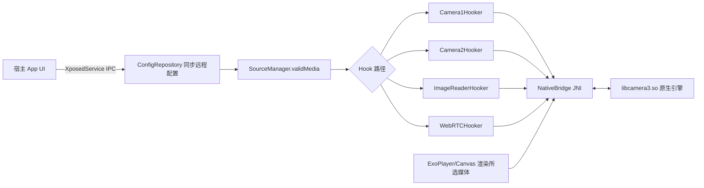

## camera2magic

> > 本文件用于帮助 AI（Codex 等）快速理解 `Camera2Magic` 项目，并在修改代码时遵守开发规范。

# Camera2 Magic - AI 项目指南

> 本文件用于帮助 AI（Codex 等）快速理解 `Camera2Magic` 项目，并在修改代码时遵守开发规范。
> 适用读者：任何需要在仓库内阅读、修改、构建代码的开发者或 AI 代理。

## 1. 项目是什么

**Camera2 Magic（包名 `com.nothing.camera2magic`，产物名 CAM2Magic）** 是一个基于
**LSPosed / libxposed（API 102）** 的 **Android 虚拟摄像头模块**：

- 用户在“作用域”页的每个应用配置（AppConfig）中按应用选择照片 / 视频作为“虚拟摄像头”内容；
- 当被 Hook 的应用调用
  Camera1 / Camera2 / ImageReader / WebRTC 等路径请求摄像头时，
  模块用所选媒体替换真实画面；
- 宿主 App 与 Hook 进程通过 `XposedService` IPC 共享配置和媒体文件。

架构上它是 **“Xposed Hook 引擎 + Compose 宿主 UI”一体化单模块工程**，且带有一个
**预编译的 C++ 原生库 `libcamera3.so`**（源码不在本仓库内）。

## 2. 技术栈与关键版本

| 项目 | 版本 / 值 |
| --- | --- |
| 构建系统 | Gradle 9.5.0（腾讯云镜像分发），AGP 9.3.0 |
| 原生依赖 | libjpeg-turbo 3.1.3（预编译 `.so` 静态链入，源码不入库） |
| Kotlin | 2.4.10（jvmTarget 11，官方代码风格） |
| SDK | compileSdk 37（release DSL），minSdk 33，targetSdk 36 |
| NDK | 29.0.14206865（仅本地原生构建需要；源码不入库，公开仓库不配置 CMake） |
| UI | Jetpack Compose + **Miuix 0.9.3**（HyperOS 风格组件库） |
| 导航 | androidx.navigation3 1.1.4（`Route` 为 @Serializable sealed 层级）+ `miuix-navigation3-ui`（随 Miuix 0.9.3） |
| 播放器 | media3-exoplayer 1.10.0（`ExoPlayer` + 自定义 `DataSource`） |
| Hook 框架 | libxposed：`compileOnly api:102.0.0` + `implementation service:102.0.0` |
| 序列化 | kotlinx.serialization-json 1.7.3（导航栈持久化） |
| 其他 | hiddenapibypass 6.1、accompanist-permissions、kotlinx-collections-immutable |

## 3. 目录结构

```text
Camera2Magic/
├── app/
│   ├── build.gradle                 # 版本、签名、ABI split、打包 jniLibs
│   ├── cam2magic.keystore*          # 本地 release 密钥（gitignored，不入库）
│   ├── keystore.properties*         # 本地 release 签名配置（gitignored，不入库）
│   ├── proguard-rules.pro           # keep native 方法与 com.nothing.camera2magic.**
│   └── src/main/
│       ├── AndroidManifest.xml      # 单 Activity，QUERY_ALL_PACKAGES + FileProvider
│       ├── java/com/nothing/camera2magic/
│       │   ├── MagicHook.kt         # Xposed 入口（java_init.list）
│       │   ├── GlobalState.kt       # 跨进程内存态（appContext/processName/activityCount）
│       │   ├── MainActivity.kt      # 宿主 UI 入口 + AppNavigation + 主题装载
│       │   ├── hook/                # ★ Hook 引擎（核心）
│       │   │   ├── Camera1Hooker.kt / Camera2Hooker.kt
│       │   │   ├── ImageReaderHooker.kt / WebRTCHooker.kt
│       │   │   ├── Camera3.kt / Camera3Extended.kt   # ExoPlayer 渲染端
│       │   │   ├── NativeBridge.kt  # JNI 桥（external fun 列表）
│       │   │   ├── BlackHole.kt / ShortId.kt         # 假 Surface 池 / 日志标识
│       │   │   ├── MagicDataSource.kt / MagicMedia.kt / SourceManager.kt
│       │   │   └── HookManager.kt  # safeHook 工具接口
│       │   ├── ui/                  # Compose UI（screen/component/navigation3/theme/util）
│       │   ├── utils/Dog.kt         # 日志单例（StateFlow + logcat 桥接监听）
│       │   ├── utils/MediaPathResolver.kt  # content:// 媒体解析为可展示路径
│       │   └── viewmodel/           # ConfigRepository + 3 个 ViewModel + Factory + CompositionLocals
│       ├── res/values{, -zh-rCN}/strings.xml  # 英文 + 中文文案
│       ├── res/xml/file_paths.xml   # FileProvider 导出路径
│       ├── jniLibs/{arm64-v8a}/libcamera3.so   # 预编译原生库（闭源，源码不入库）
│       └── resources/META-INF/xposed/  # module.prop / java_init.list / native_init.list / scope.list
├── app/src/test/                   # 单元测试（LogcatParserTest 等）
├── build.gradle / settings.gradle / gradle.properties / gradle/libs.versions.toml
└── local.properties                # 本机 SDK 路径，不入库
```

> 注意：公开仓库只含预编译 `.so`，原生源码仅在本地工作区维护（`app/src/main/cpp/`，
> 已加入 `.gitignore` 不入库）。常规构建直接使用 `jniLibs`。

## 4. 核心架构与数据流

### 4.1 总体流程



### 4.2 配置流（宿主 → Hook 进程）

1. 宿主 UI 通过 `ConfigRepository`（本地 `SharedPreferences("camera_magic_config")`）读写配置；
2. `XposedServiceHelper.registerListener` 绑定成功后 `syncAllToRemote()` 把本地全部键推到
   `service.getRemotePreferences("camera_magic_config")`；
3. 媒体文件通过 `openRemoteFile(fileName)` 写入 Hook 进程可读的文件描述符
   （`prepareRemoteMedia`），`MagicHook.openRemoteFile` 在 Hook 侧读取；
4. Hook 进程内 `SourceManager.refreshPrefs()` 按当前包（`GlobalState.processName`）读取
   **按应用配置**并计算 `validMedia`：`app_media_mode_<pkg>` 为 `photo`/`video` 时取
   `app_remote_photo/video_<pkg>` 远程文件；否则 `validMedia = null`（不替换）。
   全局媒体键已移除。

### 4.3 运行流（Hook 侧）

1. `MagicHook.onPackageReady`（仅 `isFirstPackage`）→ `SourceManager.init` →
   Hook `Application.onCreate` 取得 `appContext`，并注册前台 Activity 监听，
   首个 Activity 启动时 `refreshAndDispatch()`（重新解析媒体、可弹 Toast）；
2. `Camera1Hooker` / `Camera2Hooker`：把应用真实预览 Surface 换成 `BlackHole`
   假 Surface，原 Surface 通过 `NativeBridge.addRenderTarget` 交给原生引擎；
3. 同一时刻 `Camera3.start` 用 ExoPlayer 播放所选视频（或 Canvas 以 ~30fps
   绘制静态图）到 OES 纹理 → `SurfaceTexture` → 原生引擎注入到目标 Surface；
   `main_manually_rotate` 变化时通过改写 `updateCameraBaseData` 的
   sensorOri/displayOri 实时生效；
4. `ImageReaderHooker`：`format=256`(JPEG) 拍照时用所选图片按原始尺寸缩放替换
   （保留 EXIF，按字节数二分搜索压缩质量，JPEG 结果按媒体+开关缓存）；
   `format=35`(YUV) 走 `overwriteYuvBuffer` 原生覆盖；`main_fix_photo_rotation`
   开启时忽略相机 EXIF、按媒体自身方向烘焙旋转；Camera1 拍照路径同样支持
   （关闭时走原生 `overwriteJPEGBytes`）；
5. `WebRTCHooker`：解析 `org.webrtc.Logging.nativeLog` 中的 rotation 消息同步旋转，
   会话停止时释放 Camera3 与渲染目标。

### 4.4 Xposed 元数据

| 文件 | 内容 | 含义 |
| --- | --- | --- |
| `module.prop` | `id=com.nothing.camera2magic`，min/targetApiVersion=102，`staticScope=false` | LSPosed 模块声明（静态作用域关闭，作用域由模块内 UI 动态管理） |
| `java_init.list` | `com.nothing.camera2magic.MagicHook` | Java 入口类 |
| `native_init.list` | `camera3` | 原生初始化入口（`System.loadLibrary("camera3")`） |
| `scope.list` | 空（当前无推荐应用） | 仅在 LSPosed 中显示“推荐勾选”的应用；不参与 Hook 逻辑 |

## 5. 关键类速查表

| 类 | 职责 | 关键要点 |
| --- | --- | --- |
| `MagicHook` | Xposed 入口 | 加载 .so、初始化 SourceManager、装配 4 个 Hooker（Camera1/Camera2/ImageReader/WebRTC）、前台 Toast |
| `GlobalState` | 进程内全局态 | `appContext`、`processName`、`activityCount`（@Volatile） |
| `SourceManager` | 配置解析中心 | 所有开关与媒体键的单一读取点；`readyForHook = moduleEnabled && appHookEnabled`；监听 `main_manually_rotate` / `main_fix_photo_rotation` 变化并实时重发原生 |
| `ConfigRepository` | 宿主侧配置读写 | 每个 setter 同时写本地 + 远程；按包配置、媒体上传、scope 查询 |
| `HookManager` | Hook 基础设施 | `safeHook` 去重（WeakHashMap 集合）+ `runCatching` 容错 |
| `Camera1Hooker` | 老版 Camera API | open/setPreview*/startPreview/stop/release/回调/拍照 |
| `Camera2Hooker` | Camera2 API | openCamera、createCaptureSession*、add/removeTarget、Surface 替换 |
| `ImageReaderHooker` | 拍照/取帧替换 | JPEG 替换 + EXIF 保留 + 质量二分；YUV 原生覆盖；JPEG 缓存 |
| `WebRTCHooker` | WebRTC 适配 | 解析 rotation 日志、会话结束清理 |
| `Camera3` / `Camera3Extended` | 渲染端 | ExoPlayer/Canvas → OES 纹理；拍照时切自然尺寸；单例 HandlerThread("Camera3") |
| `MagicDataSource` | media3 DataSource | 基于 ParcelFileDescriptor 读取，支持 seek |
| `NativeBridge` | JNI 桥 | 全部 `external fun` 的声明（见下） |
| `BlackHole` | 假 Surface 池 | `WeakHashMap<Surface, BH>`，替换真实预览面；`clear()` 统一释放 |
| `MediaPathResolver` | 宿主侧路径展示 | 把 content:// 媒体解析为可展示的真实路径（MediaStore DATA / RELATIVE_PATH） |
| `Dog` | 日志 | 全局 TAG `VCX`；宿主进程内存缓冲 + logcat 桥接（root 时走 su），`StateFlow<List<LogEntry>>` 上限 1000 条；logcat 行解析为纯 JVM 函数并带单元测试 |

`NativeBridge` 的 JNI 函数清单：`createOESTexture`、`notifyFrameAvailable`、
`setSurfaceTexture`、`getSurfaceInfo`、`updateCameraBaseData`、`updateManualRotation`、
`addRenderTarget`(两个重载)、`removeRenderTarget`、`clearTargets`、
`updateAlgorithmSize`、`updateFrameInfo`、`overwriteYuvBuffer`(两个重载)、
`overwriteJPEGBytes`；另有 Kotlin 侧辅助 `ensureBuffer` / `frameUpdated`。

## 6. 配置键（SharedPreferences `camera_magic_config`）

| 键 | 类型/默认 | 含义 |
| --- | --- | --- |
| `main_module_enabled` | Boolean=true | 模块总开关 |
| `main_play_sound` / `main_enable_log` / `main_show_toast` | Boolean=false/false/true | 播放声音 / 日志 / Toast |
| `main_inject_menu` | Boolean=false | 向目标相机应用注入菜单（当前仅宿主 UI 开关，Hook 侧尚未实现） |
| `main_fix_photo_rotation` | Boolean=false | 拍照旋转修正：忽略相机 EXIF，按媒体自身方向烘焙 |
| `main_manually_rotate` | Int=0 | 手动旋转（0/90/180/270 索引） |
| `hook_enabled_packages` | String(逗号分隔) | 启用 Hook 的包集合 |
| `app_hook_<pkg>` | Boolean=true | 单应用 Hook 开关 |
| `app_media_mode_<pkg>` | photo/video | 单应用媒体模式（AppConfig 页下拉；“关闭”由 `app_hook_<pkg>` 开关表达） |
| `app_photo_uri_<pkg>` / `app_video_uri_<pkg>` | String? | 单应用在宿主侧选择的持久化 URI（AppConfig 页面） |
| `app_remote_photo_<pkg>` / `app_remote_video_<pkg>` | String? | 单应用上传的远程媒体文件 |
| `theme_*` | 见 `ThemeConfig` | 主题全部键（dark_mode/pure_black/monet/palette/accent/blur/floating_bar/floating_bottom_bar_style/bottom_bar_mode/density_scale/predictive_back） |
| `main_hook_mode` | "Camera2" | Hook 模式（UI 展示用） |

## 7. 构建与发布规范

### 7.1 常规构建（推荐，快）

```powershell
.\gradlew.bat assembleRelease   # 或 assembleDebug
```

- 直接使用 `src/main/jniLibs` 预编译的 `libcamera3.so`；
- 公开仓库不含原生源码，构建直接用 `jniLibs`；本机有源码时仍可 `buildNative`
  （源码缺失时自动跳过 CMake 配置）；
- release 签名：优先读取 CI secrets（`CAM2MAGIC_KEYSTORE_B64` + 密码/别名变量），
  本地则读 `app/keystore.properties`（gitignored）；两者都没有时产出未签名 APK；
  `minifyEnabled true + shrinkResources true`；
- ABI split 只产出 **arm64-v8a**（`splits.abi.include`），输出名
  `CAM2Magic-2.0.0-arm64-v8a.apk`（`androidComponents.onVariants` 重命名）。

### 7.2 原生库说明（本地源码构建）

公开仓库只包含预编译闭源 `.so`（`app/src/main/jniLibs/arm64-v8a/`），**不含源码**。
原生源码 `app/src/main/cpp/` 仅保留在本地工作区（已 gitignore，不会提交）。本机存在
源码时，`build.gradle` 会自动启用 CMake 配置并注册 `buildNative`：

```powershell
.\gradlew.bat buildNative
```

`buildNative` 会：删除 `src/main/jniLibs`、`release/`、`.cxx` → 依赖
`stripReleaseDebugSymbols` → 把 stripped 的 `libcamera3.so` 拷回 `jniLibs`。
首次构建或改动 CMake 后建议 `gradlew clean buildNative`（避免旧中间产物被拷回）。
源码缺失时（如公开仓库克隆）自动跳过 CMake 配置，直接用预编译 `.so` 快速构建。

### 7.3 版本号

- `versionName = 2.0.0`（`major.minor.patch` 手写常量）；
- `versionCode = versionCodeOffset(0) + git 提交数`（`git rev-list --count HEAD`，
  失败时回退为 1）。项目内已建立 git 仓库（`C:\Users\fdhyr\Camera2Magic`），
  每次发布前新增提交即可让 versionCode 递增

### 7.4 依赖与仓库

- `settings.gradle`：google() + mavenCentral() + `api.xposed.info` + jitpack；新增依赖需更新
  `gradle/libs.versions.toml`（version catalog 风格，禁止在 build.gradle 里硬编码新版本号）。

### 7.5 CI 签名（GitHub Actions）

`.github/workflows/build-release.yml` 在推送 `master` 分支（或 `v*` tag、手动触发）时
自动构建并签名 release APK。**正式发布流程**：本地先 `gradlew buildNative` 更新
`app/src/main/jniLibs/arm64-v8a/libcamera3.so`，提交并推送 `master`，CI 即用该 `.so`
产出签名正式版 APK（versionCode 随提交数递增）。
所需仓库 secrets：
- `CAM2MAGIC_KEYSTORE_B64`：keystore 的 Base64；
- `CAM2MAGIC_KEYSTORE_PASSWORD` / `CAM2MAGIC_KEY_PASSWORD` / `CAM2MAGIC_KEY_ALIAS`。
密钥文件不入库；本地 release 构建通过 `app/keystore.properties` 提供签名。

## 8. 编码与工具规范（重要）

1. **所有源文件均为 UTF-8（无 BOM）编码**，含中文注释与资源。
   - Windows 上 `PowerShell 5.1` 默认按 GBK 读取文件，中文会显示为乱码
     （如 `鐗堟湰鎺у埗鍙橀噺`）。读取时请显式指定：
     ```powershell
     Get-Content -Encoding UTF8 .\app\build.gradle
     [System.IO.File]::ReadAllLines($path, [System.Text.Encoding]::UTF8)
     ```
   - 写文件务必保持 UTF-8，**不要另存为 GBK**，否则会造成中文乱码回归。
2. **改动代码时不要新增注释**（不写解释性注释、TODO、标记性注释等）；已有注释保持原样。
3. 修改 Hook 类时保持现有模式：实现 `HookManager`，用
   `param.classLoader.safeHook(类名) { ... }` 注册；动态回调类用
   `javaClass.safeHook { ... }` 去重后 Hook。
4. 日志一律走 `com.nothing.camera2magic.utils.Dog`（i/w/e），tag 使用类内
   常量（如 `[CAM2]`），`enabled` 参数传 `SM.enableLog`；**不要直接 Log.d/x**。
5. 进程内共享对象用 `object` 单例；跨线程可见字段加 `@Volatile`；Hook 侧的
   对象引用用 `WeakReference` / `WeakHashMap` 防止内存泄漏（BlackHole、hookedClasses 都是）。
6. Hook 拦截里任何可能抛异常的代码用 `runCatching` 包住，失败只记日志，不阻断原调用。
7. 每个拦截器入口先判 `SM.readyForHook`（模块开关 + 应用开关），不满足直接 `chain.proceed()`。
8. `NativeBridge` 是 JNI 契约的唯一来源：Java 声明与预编译 `libcamera3.so` 的导出
   保持同步，否则运行期 `UnsatisfiedLinkError`（`.so` 源码不入库，如需新增 native
   函数须在仓库外维护源码并重新编译）。
9. UI 使用 Miuix 组件（`top.yukonga.miuix.kmp.*`），主题基于
   `ThemeController` + `MiuixTheme`（由 `Camera2MagicTheme` 统一装载）；
   新增页面文案进 `res/values/strings.xml`（英文）+ `values-zh-rCN/strings.xml`（中文）。
10. 导航：新增页面在 `Route` sealed 层级加 @Serializable 条目，`Navigator.push/pop`，
   导航栈经 kotlinx.serialization JSON 持久化（`NavBackStackSaver`）。
11. 不修改 `proguard-rules.pro` 中 native keep 规则、以及 `jniLibs/*/libcamera3.so`
    的 ABI 目录结构；release 签名密钥由 CI secrets / 本地 `keystore.properties`
    提供，密钥文件不入库。

## 9. 已知坑与遗留问题（改动前必读）

- 全局媒体机制与 RTSP 已移除：媒体只能按应用在 AppConfig 中选择（照片/视频），
  未配置媒体时 `validMedia = null`，Hook 不会注入画面。
- `main_inject_menu`（注入菜单）目前只是宿主 UI 上的开关，Hook 侧没有对应实现；不要把它当作已生效的功能。
- `NativeBridge.updateManualRotation` 在预编译 `libcamera3.so` 中没有实际读取点；
  手动旋转通过 `SourceManager.applyManualRotationToNative()` 改写
  `updateCameraBaseData` 的 sensorOri/displayOri 生效，改动旋转逻辑时不要只调
  `updateManualRotation`。
- `NetworkHooker`（HttpURLConnection/OkHttp 网络上传替换）与 `WorkMode` 枚举已删除：前者不再需要，后者无任何使用点。
- `MagicHook` 只在 `isFirstPackage` 时装配 Hook；`scope.list` 仅在 LSPosed 中显示“推荐勾选”的应用，
  当前为空，不需要往里面加应用；作用域实际由宿主“作用域”页经 `hook_enabled_packages` /
  `app_hook_<pkg>` / 媒体配置动态生效。
- 注意：Hook 侧 `readyForHook` 只判断 `moduleEnabled && appHookEnabled`（`app_hook_<pkg>` 默认 true）；
  `hookEnabledPackages` 目前仅同步记录、未参与拦截门控，实际以是否配置媒体（`validMedia`）为准。
- `ImageReaderHooker` 中 format=256 的替换依赖 `magic.openRemoteFile` 与
  `SM.validMedia`；替换失败时返回原图而非崩溃。
- `BlackHole.clear()` 在 Camera 关闭/会话结束/WebRTC 停止时调用；新 Hook 路径
  结束时也要清理，否则 Surface 泄漏。
- `Camera3` 是**单例状态**（companion object 持有 player/surface），多个相机实例
  同时打开时共享同一渲染端，修改需谨慎。
- 原生库为预编译闭源 `.so`；原生源码仅本地保留（`app/src/main/cpp/`，已 gitignore），
  `buildNative` 仅在本机源码存在时可执行，公开仓库不含源码。
- JNI 契约以 Kotlin `NativeBridge.kt` 为准；`.so` 为闭源产物，源码不公开。
- 项目 git 仓库位于项目目录内，已初始化并有提交；`versionCode` 随提交数递增。

## 10. 改动 Checklist（AI 自检）

- [ ] 新增/修改 Hook：实现 `HookManager`、在 `MagicHook` 装配、`safeHook` 去重、先判 `readyForHook`、异常用 `runCatching` 包住、结束时清理 `BlackHole`/`Camera3`。
- [ ] 新增配置：同时在 `SourceManager`（Hook 侧读取）与 `ConfigRepository`（宿主侧读写+远程同步）添加，键名保持 `snake_case` 一致。
- [ ] 新增 UI：Miuix 组件、字符串进 `strings.xml`（en + zh-rCN）、导航走 `Route` + `Navigator`、ViewModel 经 `ViewModelFactory` 注册。
- [ ] 改动原生：在本机 `app/src/main/cpp/` 维护源码（不入库），`gradlew buildNative`
      后更新 `jniLibs` 产物、检查 proguard keep；公开仓库只发布预编译 `.so`。
- [ ] 构建验证：统一用debug验证；改动签名/版本/ABI 时核对 `app/build.gradle` 常量（release 签名走 CI secrets / 本地 `keystore.properties`）。
- [ ] 改动 `Dog` / logcat 解析等纯 JVM 逻辑时跑 `.\gradlew.bat testDebugUnitTest` 验证。
- [ ] 编码检查：所有改动文件保持 UTF-8，中文注释在 UTF-8 读取下无乱码。

---
> Source: [servant1228/Camera2Magic](https://github.com/servant1228/Camera2Magic) — distributed by [TomeVault](https://tomevault.io).
<!-- tomevault:4.0:gemini_md:2026-08-13 -->
