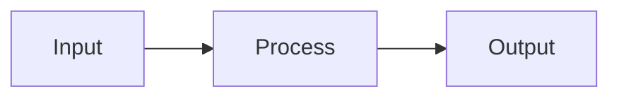

## claude-code-mastery

> This is a comprehensive, professional-grade course teaching developers how to master Claude Code (Anthropic's CLI coding agent). The course targets senior developers and will be published as:

# CLAUDE.md — Claude Code Mastery Course

## PROJECT OVERVIEW

This is a comprehensive, professional-grade course teaching developers how to master Claude Code (Anthropic's CLI coding agent). The course targets senior developers and will be published as:

- **Digital course** (Markdown → Docusaurus/MkDocs website)
- **NotebookLM source** (upload .md directly)
- **Printed book** (Markdown → Pandoc → DOCX → InDesign/Canva → Print)
- **Workshop material** (DEMO + PRACTICE sections used as live exercises)

**Languages**: English (`/en/`) and Vietnamese (`/vi/`) — always maintain both in sync.

**Author**: Ethan Nguyen (Senior Android Engineer, 12+ Years, Vietnam-based, KMP/Android/Backend expert)

---

## COURSE STRUCTURE

- **16 Phases** → **55 Modules** → **~200+ Topics**
- Each phase is a directory: `phase-XX-name/`
- Each module is a file: `XX-module-name.md`
- Both languages follow identical structure and numbering

### Directory Layout

```
claude-code-mastery/
├── CLAUDE.md                     ← THIS FILE (project rules for Claude Code)
├── README.md                     ← Course overview (bilingual)
├── SUMMARY.md                    ← Full table of contents
│
├── en/                           ← English content
│   ├── phase-01-foundation/
│   │   ├── 01-installation.md
│   │   ├── 02-interfaces-modes.md
│   │   └── 03-context-basics.md
│   ├── phase-02-security/
│   │   └── ...
│   └── ...
│
├── vi/                           ← Vietnamese content
│   ├── phase-01-foundation/
│   │   ├── 01-installation.md
│   │   └── ...
│   └── ...
│
├── assets/
│   ├── diagrams/                 ← Mermaid source + exported PNG
│   └── screenshots/              ← Annotated screenshots
│
├── cheatsheets/
│   ├── en/
│   └── vi/
│
├── templates/                    ← CLAUDE.md templates, prompt recipes
│   ├── claude-md-kmp.md
│   ├── claude-md-backend.md
│   └── ...
│
└── scripts/
    ├── build-pdf.sh              ← Pandoc build pipeline
    ├── build-docx.sh
    └── build-site.sh
```

---

## TEACHING METHODOLOGY: Progressive Hands-on Hybrid

Every module MUST follow the **7-Block Structure** exactly. No exceptions. This ensures consistency across all 55 modules, both languages, and all output formats.

### The 7 Blocks (Mandatory)

| # | Block | Purpose | Target Length |
|---|-------|---------|--------------|
| 1 | **WHY** | Real pain point, motivation | 3-5 sentences |
| 2 | **CONCEPT** | Core mental model, theory | 1-2 paragraphs + diagram |
| 3 | **DEMO** | Step-by-step walkthrough | 5-15 steps, copy-paste ready |
| 4 | **PRACTICE** | Hands-on exercise | 1-3 exercises with expected output |
| 5 | **CHEAT SHEET** | Quick reference table | 1 page max, scannable |
| 6 | **PITFALLS** | Common mistakes | 3-7 items, ❌ Wrong → ✅ Right format |
| 7 | **REAL CASE** | Production scenario | 1 concrete story from real projects |

---

## MODULE TEMPLATE

Every module file MUST start with this exact structure:

```markdown
# Module X.Y: [Module Title]

> **Estimated time**: ~XX minutes
> **Prerequisite**: Module X.Z (or "None")
> **Outcome**: After this module, you will be able to [specific skill]

---

## 1. WHY — Why This Matters

[2-5 sentences describing a REAL pain point. Start with a scenario the reader
can relate to. Make them feel "yes, I need this." No fluff.]

---

## 2. CONCEPT — Core Ideas

[Explain the mental model. Use analogies. Include a diagram (Mermaid) if the
concept involves flow, architecture, or relationships.

If a diagram is needed, use this format:]



[Keep theory concise. This is NOT a textbook — just enough to understand
the WHY behind each command/feature.]

---

## 3. DEMO — Step by Step

[Numbered steps. Each step has:
1. What to do (command or action)
2. What you'll see (expected output)
3. Why it matters (1 sentence explanation)

ALL commands must be real, tested, copy-paste ready.
Use realistic project names and file structures.]

**Step 1: [Action]**
```bash
command here
```
Expected output:
```
output here
```

**Step 2: [Action]**
...

---

## 4. PRACTICE — Try It Yourself

### Exercise 1: [Title]
**Goal**: [What to accomplish]
**Instructions**:
1. ...
2. ...
3. ...

**Expected result**: [What success looks like]

<details>
<summary>💡 Hint</summary>
[Hint without giving full answer]
</details>

<details>
<summary>✅ Solution</summary>
[Full solution with explanation]
</details>

---

## 5. CHEAT SHEET

| Command / Feature | Description | Example |
|---|---|---|
| `command` | What it does | `usage example` |

---

## 6. PITFALLS — Common Mistakes

| ❌ Mistake | ✅ Correct Approach |
|---|---|
| Doing X without Y | Always do Y first because... |

---

## 7. REAL CASE — Production Story

**Scenario**: [Brief description of real situation]
**Problem**: [What went wrong or what was needed]
**Solution**: [How Claude Code was used to solve it]
**Result**: [Outcome with specific metrics if possible]

---

> **Next**: [Module X.Z: Title](link) →
```

---

## WRITING RULES

### Voice & Tone
- **Conversational but authoritative** — like a senior dev mentoring a colleague
- Use "you" (English) / "bạn" (Vietnamese) — direct address
- Short sentences. No academic language
- Humor is OK when natural. Don't force it
- Be opinionated — recommend best practices, don't hedge everything

### Technical Content
- ALL commands must be real and tested. NEVER invent flags or APIs
- Show BOTH the command AND its output
- Include version numbers where relevant (e.g., "Claude Code v1.x+")
- If a feature is beta or may change, mark it: `⚠️ Beta feature — may change`
- Terminal examples use `$` prefix for user input, no prefix for output
- Code blocks MUST specify language: ````bash`, ````json`, ````typescript`, etc.

### Formatting Rules
- H1 (`#`) = Module title only (one per file)
- H2 (`##`) = The 7 block headers only
- H3 (`###`) = Sub-sections within blocks
- **Bold** for key terms on first introduction
- `code` for commands, flags, filenames, config keys
- Use tables for comparisons and cheat sheets
- Use `<details>` for solutions/hints (collapsible)
- Diagrams: prefer Mermaid (renders everywhere). Fallback to ASCII art
- Max line width: 100 characters (for PDF rendering)

### Length Guidelines
- Module total: **800-1500 words** (sweet spot for 20-40 min reading + practice)
- WHY: 50-100 words
- CONCEPT: 150-300 words
- DEMO: 200-400 words
- PRACTICE: 150-300 words
- CHEAT SHEET: 100-200 words (table format)
- PITFALLS: 100-200 words
- REAL CASE: 100-200 words

### Bilingual Rules
- Vietnamese is NOT a word-for-word translation — it's a natural rewrite
- Technical terms stay in English: "context window", "token", "sandbox", "hook"
- Vietnamese explanations can add cultural context (e.g., Vietnamese bank examples)
- Both versions must cover identical topics and structure
- Vietnamese can be slightly longer (Vietnamese sentences tend to be longer)

---

## TECHNICAL ACCURACY RULES

These rules are critical. Violating them undermines the entire course's credibility.

### General Rules
1. NEVER invent CLI commands, flags, URLs, or API endpoints. If you are not 100% certain a command exists, mark it with `⚠️ Needs verification` and leave a comment for the author to check.
2. NEVER invent version numbers. Use placeholder format like `X.Y.Z` instead of fake specific numbers.
3. NEVER mark official methods as "deprecated" unless you can cite the deprecation notice.
4. When showing expected output, use realistic but clearly placeholder content. Mark with `# Output may vary` comment.
5. Installation commands change frequently. For Phase 1 modules specifically: every install command, URL, and package name MUST be verified against live documentation before writing.

### Verification Protocol
Before writing any DEMO or CHEAT SHEET section:
- Ask yourself: "Am I 100% certain this command exists with this exact syntax?"
- If YES → write it
- If NO → write it with `⚠️ Needs verification` suffix
- NEVER guess and present it as fact

### Commands Known to Exist (verified)
Keep this list updated as modules are written:
- `claude` — start interactive session
- `claude -p "prompt"` — one-shot mode
- `claude config` — configuration management
- `/help` — list commands inside session
- `/compact` — compress context
- `/clear` — reset context
- `/cost` — show token usage
- `/init` — initialize CLAUDE.md for project

### Commands That Need Verification
- `/status` — may or may not exist
- `/model` — model selection method unclear
- `brew install --cask claude-code` — unverified
- Native installer URL — unverified

---

## SECURITY CONTENT RULES

Phase 2 (Security & Sandboxing) requires the highest standard of accuracy in the entire course. Wrong security advice is actively dangerous — it's worse than no advice at all.

### Mandatory Rules for Security Modules
1. NEVER state that a security feature exists unless you are 100% certain. Mark ALL uncertain security claims with `⚠️ Needs verification — test in your environment before relying on this`.
2. NEVER give false reassurance. Do not say "Claude Code cannot access X" unless you can verify this is enforced. Use language like "By default, Claude Code may have access to X" — assume the worst, verify the best.
3. Always assume MAXIMUM risk in threat models. If unsure whether Claude Code can read ~/.ssh/, assume it CAN and advise accordingly.
4. Distinguish between:
   - VERIFIED protections (confirmed by docs/testing)
   - RECOMMENDED practices (best practices, not enforced)
   - ASSUMED risks (things that might be possible, treat as real)
5. Security commands and configurations MUST include verification steps. Don't just say "run X to be safe" — show how to VERIFY it worked.
6. For sandbox/Docker content: test all Dockerfiles mentally for obvious issues. Include comments explaining security-relevant lines.
7. For secret management: NEVER show real API key formats that could be mistaken for actual keys. Use obviously fake values like `sk-FAKE-DO-NOT-USE-xxxxxxxxxxxx`.
8. When discussing permissions: always mention what happens if the protection FAILS. What's the blast radius?

### Tone for Security Content
- Be direct, even blunt. "This WILL expose your keys" not "This might potentially lead to exposure"
- Use concrete attack scenarios, not abstract risks
- Every mitigation must answer: "How do I verify this is working?"

---

## PHASE & MODULE CURRICULUM (Complete)

### Phase 1: Foundation
- 1.1 Installation & Configuration
- 1.2 Interfaces & Modes
- 1.3 Context Window Basics

### Phase 2: Security & Sandboxing
- 2.1 Threat Model — Understanding Risks
- 2.2 Permission System Deep Dive
- 2.3 Sandbox Environments
- 2.4 Secret Management
- 2.5 System Control & Monitoring

### Phase 3: Core Workflows
- 3.1 Reading & Understanding Codebases
- 3.2 Writing & Editing Code
- 3.3 Git Integration
- 3.4 Terminal & Shell Operations

### Phase 4: Prompt Engineering & Memory
- 4.1 Prompting Techniques
- 4.2 CLAUDE.md — Project Memory
- 4.3 Slash Commands
- 4.4 Memory System

### Phase 5: Context Mastery
- 5.1 Controlling Context
- 5.2 Context Optimization
- 5.3 Image & Visual Context

### Phase 6: Thinking & Planning Modes
- 6.1 Think Mode (Extended Thinking)
- 6.2 Plan Mode
- 6.3 Think + Plan Combo Strategies

### Phase 7: Multi-Agent & Full Auto Coding
- 7.1 Auto Coding Levels
- 7.2 Full Auto Workflow
- 7.3 Multi-Agent Architecture
- 7.4 Agentic Loop Patterns
- 7.5 Multi-Agent Orchestration Tools

### Phase 8: Meta-Debugging — Debugging the AI
- 8.1 Hallucination Detection & Prevention
- 8.2 Loop Detection & Breaking
- 8.3 Context Confusion
- 8.4 Quality Assessment
- 8.5 Emergency Procedures

### Phase 9: Legacy Code & Brownfield Projects
- 9.1 Archeology Mode — Excavating Old Code
- 9.2 Incremental Refactoring
- 9.3 Legacy Test Generation
- 9.4 Tech Debt Analysis

### Phase 10: Team Collaboration Protocol
- 10.1 Synchronized Team CLAUDE.md
- 10.2 Git Conventions for AI
- 10.3 Code Review Protocol
- 10.4 Knowledge Sharing
- 10.5 Governance & Policy

### Phase 11: Automation & Headless
- 11.1 Headless Mode
- 11.2 Claude Code SDK
- 11.3 Hooks System
- 11.4 GitHub Actions Integration
- 11.5 MCP (Model Context Protocol)

### Phase 12: n8n & Workflow Integration
- 12.1 Claude Code + n8n
- 12.2 Workflow Patterns
- 12.3 n8n + SDK Orchestration

### Phase 13: Data & Analysis
- 13.1 Data Analysis
- 13.2 Report Generation
- 13.3 Log & Error Analysis

### Phase 14: Optimization & Performance
- 14.1 Task Optimization
- 14.2 Speed Optimization
- 14.3 Quality Optimization
- 14.4 Cost Optimization

### Phase 15: Templates, Skills & Ecosystem
- 15.1 CLAUDE.md Templates
- 15.2 Command Templates & Prompt Recipes
- 15.3 Claude Code Skills
- 15.4 Community Ecosystem
- 15.5 Custom Skill Development

### Phase 16: Real-World Mastery
- 16.1 Case Studies
- 16.2 Role-Specific Workflows
- 16.3 Teaching & Workshop Design

---

## QUALITY CHECKLIST (Run for every module)

Before considering a module complete, verify ALL items:

- [ ] Follows 7-block structure exactly (no missing blocks)
- [ ] H1 is module title, H2 are the 7 blocks only
- [ ] WHY section has a relatable pain point (not generic)
- [ ] CONCEPT includes diagram where helpful
- [ ] DEMO commands are real, tested, copy-paste ready
- [ ] DEMO shows expected output for each command
- [ ] PRACTICE has at least 1 exercise with solution in `<details>`
- [ ] CHEAT SHEET fits on one page when printed
- [ ] PITFALLS use ❌/✅ format
- [ ] REAL CASE is specific (not generic "imagine you...")
- [ ] All code blocks have language specified
- [ ] Technical terms are accurate (no hallucinated flags/APIs)
- [ ] Word count is 800-1500
- [ ] Vietnamese version exists and matches structure
- [ ] Cross-references to other modules use correct numbering
- [ ] Metadata block (time, prerequisite, outcome) is filled

---

## COMMANDS FOR CLAUDE CODE

When working on this project, use these conventions:

```bash
# Generate a new module
# Always specify: phase number, module number, language
# Example: "Write module 2.3 in English following the template"

# Build commands
./scripts/build-pdf.sh en        # Build English PDF
./scripts/build-pdf.sh vi        # Build Vietnamese PDF
./scripts/build-docx.sh en       # Build English DOCX
./scripts/build-site.sh          # Build website (both languages)
```

---

## IMPORTANT NOTES

1. **Never invent Claude Code features**. If unsure whether a flag/command exists, say so. Mark uncertain features with `⚠️ Verify`.
2. **Security content (Phase 2) must be extra careful** — wrong security advice is worse than no advice.
3. **Vietnamese version is NOT a translation** — it's a parallel authoring in Vietnamese voice. Technical terms stay English.
4. **Each module is self-contained** — can be read independently, but references related modules.
5. **Diagrams**: use Mermaid when possible. Store exported PNGs in `assets/diagrams/` for PDF builds.
6. **Screenshots**: store in `assets/screenshots/` with descriptive names like `02-permission-prompt.png`.
7. **When writing REAL CASE sections**: prefer examples relevant to Vietnamese developers (Vietnamese banking apps, Shopee ecosystem, KMP mobile projects) but keep universal appeal.

---
> Source: [ShipWithAI/claude-code-mastery](https://github.com/ShipWithAI/claude-code-mastery) — distributed by [TomeVault](https://tomevault.io).
<!-- tomevault:4.0:gemini_md:2026-04-22 -->
