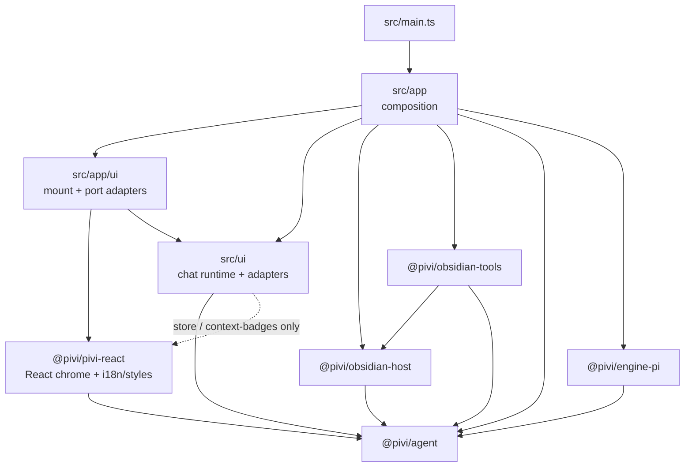
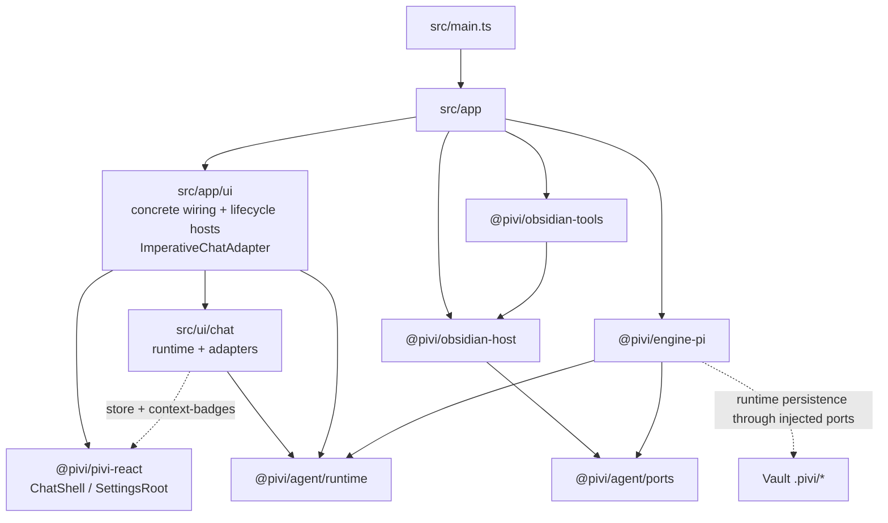
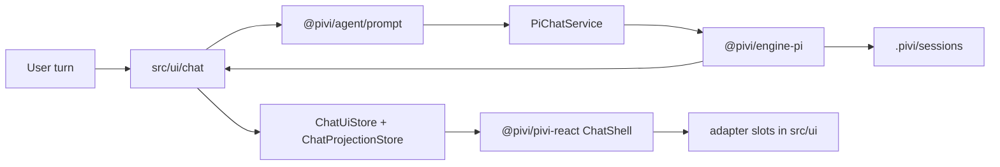
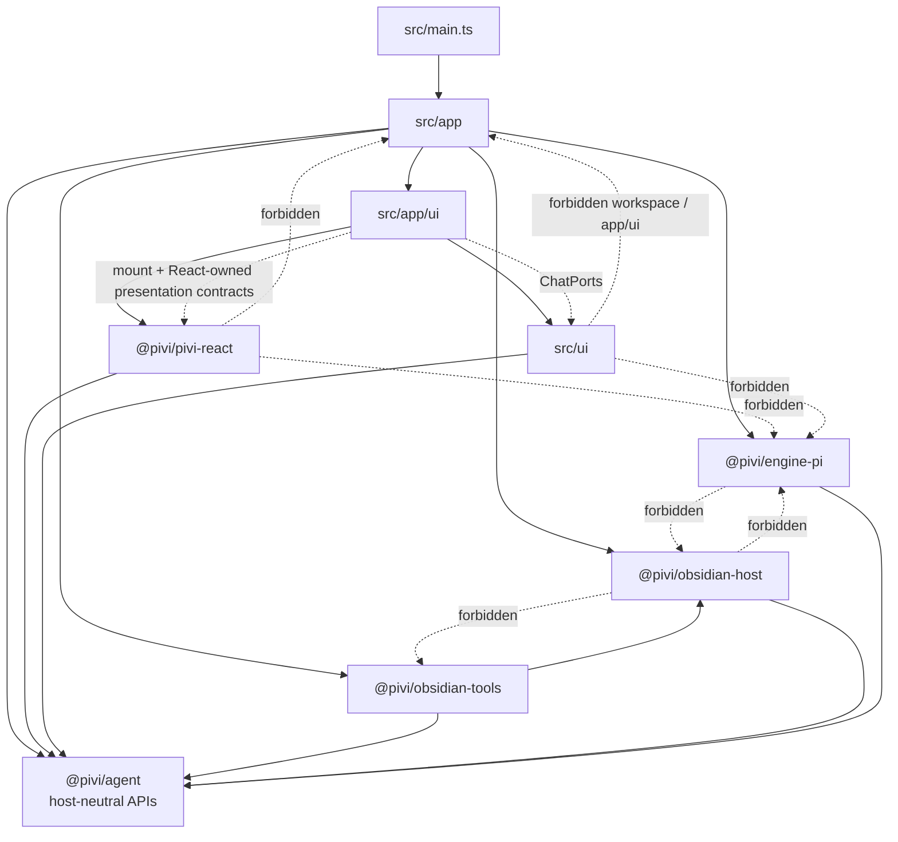

## obsidian-pivi

> Welcome to the **Pivi** developer reference guide. This document is the **operational** entry point for build, test, lint, release, project glossary, quality gates, and repo-wide seam rules.

# Pivi Developer Guide

Welcome to the **Pivi** developer reference guide. This document is the **operational** entry point for build, test, lint, release, project glossary, quality gates, and repo-wide seam rules.

---

## 📚 Project guidance

Pivi keeps the new-developer architecture, technology rationale, end-to-end flows, and contribution routes in the [`docs/` handbook](docs/README.md). Durable operational guidance remains in layered `AGENTS.md` files: root guidance covers repo-wide build, test, release, and seam rules; package-local files cover package purpose, public entrypoints, boundaries, and verification notes.

For README architecture / workflow diagrams, prefer fenced Mermaid diagrams (` ```mermaid `) because GitHub renders them natively.

| Layer | Location | When to update |
|-------|----------|----------------|
| Developer handbook | `docs/README.md`, `docs/[0-9][0-9]-*.md` | User-visible behavior, end-to-end flows, public interfaces, persistence/configuration, boundaries, technology choices, development/release routes, or roadmap changes |
| Long-running specs | `specs/README.md`, `specs/NNN-*.md` | Multi-agent work breakdown, decisions, handoffs, verification, and completion tracking |
| Repo operations | `AGENTS.md` | Build/test/release/spec workflow changes |
| Package contracts | `packages/*/AGENTS.md` | Package entrypoints, dependency boundaries, or gotchas change |
| Feature maps | `src/ui/AGENTS.md`, `src/ui/chat/AGENTS.md`, `src/ui/chat/rendering/AGENTS.md`, `src/ui/shared/AGENTS.md`, `src/app/AGENTS.md`, `packages/pivi-react/AGENTS.md`, `packages/pivi-react/src/i18n/AGENTS.md`, `packages/pivi-react/styles/AGENTS.md`, `src/ui/chat/ui/file-context/AGENTS.md`, `src/ui/chat/ui/file-context/state/AGENTS.md`, `src/ui/chat/ui/file-context/view/AGENTS.md` | Local UI/runtime flow or seam rules change |
| Glossary/overview | `AGENTS.md` | Project identity or canonical terminology changes |
| Releases | GitHub Releases / generated `CHANGELOG.md` | User-visible release history |

**Workflow**

1. Explore in Obsidian / Heptabase (optional).
2. For long-running or multi-agent work, create and index a tracked spec from [`specs/000-template.md`](specs/000-template.md) before delegating work. Keep its decisions, workstreams, verification, and handoffs current.
3. Implement in the owning package or app area.
4. Update the closest `AGENTS.md` whenever code invalidates its map, seam rules, terminology, or gotchas. Start with the directory you changed and walk upward until guidance remains accurate.
5. Update the relevant numbered developer document in the same change whenever code changes user-visible behavior, an end-to-end flow, a public interface/type, configuration or persistence, a package boundary, a technology choice, development/release commands, or roadmap status. Keep package-local operational invariants in the owning `AGENTS.md` and link to the handbook for narrative detail.
6. Before completing and archiving a spec, synchronize every durable conclusion into the relevant numbered docs and the nearest affected `AGENTS.md` files, walking upward until the guidance remains accurate.
7. Before committing, review the staged diff and confirm the active spec, handbook, and nearest `AGENTS.md` files still describe it. Behavior-preserving internal refactors and test-only changes do not require documentation churn unless they invalidate a path, command, map, or verification rule.
8. Let release-please generate release notes and `CHANGELOG.md` from Conventional Commits in release PRs; keep README version changes in `node scripts/sync-version.js`, not release-please README markers.

For UI or runtime changes that the user needs to inspect inside Obsidian, run the project build and reload the plugin before handing back control. The normal path is `npm run build` followed by `obsidian plugin:reload id=pivi`, unless the user explicitly asks not to reload or the Obsidian CLI is unavailable.

**PR checklist** (include in description when applicable):

```markdown
Related guidance:
- Package: packages/<name>/AGENTS.md
- Local: <nearest>/AGENTS.md
```

| Change size | Documentation |
|-------------|----------------|
| Small fix | Code comment only when the why is non-obvious |
| Medium feature | Active spec when work is long-running/multi-agent; relevant numbered developer doc plus owning package/local `AGENTS.md` when its map or rules change |
| Architecture / framework | Active spec, developer handbook, root guidance, and affected package/local `AGENTS.md` |
| Stable module API | Relevant developer doc plus owning package `AGENTS.md` |
| User-visible UI text | Always `packages/pivi-react/src/i18n/` in the **same commit** (see Coding Standards) |

---

## 🤖 Agent skills

This repo does not track repo-local agent skills. Keep developer narrative in `docs/` and operational project guidance in this file and package/local `AGENTS.md` files; runtime vault skills live under each vault's `.pivi/skills/` directory.

**Vault default bundle** (end users, not this repo): first vault load may prompt to install [kepano/obsidian-skills](https://github.com/kepano/obsidian-skills) into `<vault>/.pivi/skills/`, but installation/updating must happen only after explicit user confirmation.

Do not add speculative skill placeholders. If a repo-local skill becomes necessary, add the implementation and matching lockfile entry intentionally, then update this section in the same change.

Nested `AGENTS.md` files under `src/`, `tests/`, and `packages/` are directory/package maps (`init-deep` or hand-maintained); treat root `AGENTS.md` as authoritative for cross-cutting rules. The hierarchy is:

- **Root** `AGENTS.md` — repo-wide build, test, release, seam rules, glossary, and quality gates.
- **Package** `packages/*/AGENTS.md` — package purpose, entrypoints, boundaries, verification. `packages/agent/AGENTS.md` covers host-neutral agent foundations; `packages/engine-pi/AGENTS.md` covers the Pi SDK adapter package.
- **App** `src/app/AGENTS.md` — composition shell, host contracts, workspace services.
- **UI** `src/ui/AGENTS.md` → `src/ui/chat/AGENTS.md` → `src/ui/chat/rendering/AGENTS.md`, `src/ui/chat/ui/file-context/AGENTS.md` → `state/AGENTS.md` / `view/AGENTS.md`, `src/ui/shared/AGENTS.md` — app-side runtime and imperative adapter maps.
- **React UI** `packages/pivi-react/AGENTS.md` — presentation boundary, locale catalogs, styles, and React ownership rules.
- **i18n** `packages/pivi-react/src/i18n/AGENTS.md` — translator API, locale catalogs, translation commit policy.
- **Styles** `packages/pivi-react/styles/AGENTS.md` — CSS architecture, manifest order, build flow, conventions.
- **Tests** `tests/AGENTS.md` — Jest topology, commands, layout.
- **Scripts** `scripts/AGENTS.md` — build/test/version helper scripts.

---

## 🚀 Project Overview

**Pivi** (ID: `pivi`) is an Obsidian community plugin that embeds the **Pi agent** (`@earendil-works/pi-agent-core`) as its sole agent runtime inside an Obsidian sidebar view.

**Minimum Obsidian:** `1.12.0` (provider API keys use `app.secretStorage` / keychain).

### Architecture Status
- **React presentation boundary**: `@pivi/pivi-react` follows the Pivi product and owns chat and settings presentation independently of a note-host SDK. `src/app` owns Obsidian lifecycle shells, the injected `PresentationPlatform` (localized host/workspace/secure-storage terminology, icons, and tooltips), host tool/integration/featured-skill descriptors, and concrete feature-port adapters (`createChatUiPorts` / `createSettingsUiPorts`). React ports use host-neutral `workspace` / `secureStorage` names, and React-owned DOM/CSS use only `pivi-*` classes plus `--pivi-host-*` theme tokens. Application-facing `ChatPorts` are owned by `@pivi/agent/runtime/chatPorts` and are captured by the app-owned imperative adapter closure; `mountChatView` never imports, receives, or forwards them, while `ChatShell` consumes snapshots/actions. Live chrome flows through immutable `ChatUiStore` snapshots, while virtualized messages use `ChatProjectionStore` structure subscriptions for row shells and reconciled block/tool subscriptions for hot interiors; each subagent remains the nested snapshot on its stable tool entity. Unchanged entity identities are preserved across whole-message upserts. `ChatState` emits one sequenced in-memory projection event plane, while the store rejects ownership/order anomalies and publishes active visible work by owner-window animation frame or hidden/inactive work by a 250 ms owner-realm timer. `ActiveChatUiBridge` selects both stores plus explicit portal/viewport targets and marks projection surface activity. Product UI may reach React only through the exact `store` and `context-badges` presentation subpaths; mention parsing, slash matching, streaming-math transforms, and usage projection live in `@pivi/agent` domain subpaths. React snapshots stay free of DOM/runtime objects; Obsidian Markdown, uncontrolled contenteditable, rich tool bodies, and stored nested subagents remain explicit imperative adapters mounted into isolated empty containers and updated in place for a stable entity generation.
- **Settings search compatibility**: `PiviSettingTabHost` exposes localized declarative setting metadata for Obsidian 1.13 settings search while retaining `display()` for the 1.12 minimum. Both routes share the same React mount, generation guard, and disposal logic; locale changes refresh the declarative index.
- **Registration-first lifecycle**: plugin load reads required settings and registers views/commands/settings before workspace I/O. A single-flight, retryable workspace readiness promise starts from a visible surface or `onLayoutReady`; fully initialized services are injected into mounts. Unload invalidates in-flight initialization and disposes instance-owned MCP OAuth, provider, bridge, and connection-pool resources, including connections that complete during shutdown.
- **Pi-only Architecture**: `src/main.ts` is the Obsidian plugin composition root; `src/app/` owns lifecycle, service graph, commands, views, and workspace services; `src/ui/chat/` owns chat runtime orchestration and imperative adapters. Chat runtime/session/model/catalog/settings capabilities arrive only through `@pivi/agent`-owned application `ChatPorts`; its `PiviChatHost` contains only the Obsidian `app`. Wide settings, facades, view enumeration, and tab-state persistence stay on composition-only `PiviChatCompositionHost`. App code controls a mounted chat view through semantic `PiviChatViewHandle.commands` / `.maintenance` operations and must not inspect `TabManager`, `TabData`, controller, UI, or DOM aggregates; `ImperativeChatAdapter` is the sole owner allowed to translate those semantic operations onto the internal graph. App composition reaches the concrete Pi engine through `@pivi/engine-pi`; React settings consume React-owned `SettingsPorts` implemented by app wiring, while product orchestration reaches Pi through injected `ChatPorts`, `PiChatService` / `AuxQueryRunner`, and other non-engine `@pivi/*` APIs.
- **Pivi Agent Package**: `@pivi/agent` is the host-neutral aggregate entrypoint for reusable agent foundations. It exposes package namespaces (`foundation`, `tools`, `session`, `mcp`, `skills`, `context`, `prompt`, `runtime`, `engine`, `auth`, `plugins`, `ports`, and `workspace`) and has no Pi SDK dependencies; concrete host/tool wiring stays in app and adapter packages.
- **Pi Engine Package**: `@pivi/engine-pi` (`packages/engine-pi/`) is the sole Pi SDK adapter. It owns the three exact `@earendil-works/pi-*` pins, in-process `Agent` construction, pi-ai model/provider setup, Pi chat runtime, settings/auth facades over canonical ports, tool adapters, JSONL compatibility, and auxiliary query runners. Only `src/app/**` and `src/main.ts` (and tests) may import it. Pivi deliberately does not construct pi-coding-agent `AgentSession`: it duplicates Pivi's runtime/session/compaction ownership and, with `@earendil-works/pi-coding-agent@0.81.1` (the pin at measurement time; see the root and `@pivi/engine-pi` package manifests for the current exact pin), a production bundle experiment increased `main.js` from about 3.0 MiB to 7.9 MiB by pulling CLI/TUI/resource/export dependencies. Keep transient provider retry in the narrow Pivi turn lifecycle unless upstream exposes an Obsidian-safe core entrypoint whose shipped bundle is measured and accepted.
- **Vault-local MCP**: `.pivi/mcp.json` and `.pivi/mcp-oauth/` only—no global host MCP configs. Remote `headers` and stdio `env` use structured `ConfigValueRef` maps; secret values live in `SecretStorage` (`pivi-mcp-v-*`), not synced JSON. Settings enable/disable owns availability; the system prompt auto-lists enabled servers/tools. Optional `/server` slash tokens remain composer emphasis (`/server` → `/server MCP` in the API prompt). Startup/settings prefetch warms enabled remote servers only; stdio remains lazy until explicit settings diagnostics or the agent's first search/list/call.
- **Device-local environment registry**: structured environment entries (`plain`, `secret`, `systemEnvironment`) live in vault-scoped local storage (`pivi.environment.v1`); secret values reference `SecretStorage` (`pivi-env-*`). Synced `.pivi/settings.json` must not persist `sharedEnvironmentVariables`, top-level `environmentVariables`, or `agentSettings.environmentVariables`; runtime still projects resolved maps in memory for consumers. Secret-like keys default to `SecretStorage`; recognized provider/web keys migrate to canonical credential stores; `KEY=$NAME` bulk import becomes `systemEnvironment` without copying host values.
- **External read tools**: `obsidian_read_external` and `obsidian_list_external` read/list files by absolute path outside the vault using `@pivi/obsidian-host/externalFileApi`. They require `allowExternalRead`; when a path is outside configured roots, Pivi shows a sidebar inline confirmation (Deny / once / session / always) instead of a modal. Always allow appends the directory root to device-local `externalReadDirectories` and refreshes runtime tools; session grants clear on session switch. Host-side realpath containment prevents reads outside allowed roots. Absolute paths never enter synced `.pivi/settings.json` or session JSONL; Obsidian's public vault-scoped local-storage API supplies the per-device cache and historical UI overlay.
- **Durable generated titles**: Title generation remains a background auxiliary query. A successful model result must append `pivi/session-meta` with `titleSource: "model"` before mutating the open-session title or publishing UI; persistence failure keeps the fallback title, logs the error, and shows a localized Notice.
- **Session cloud recovery**: Vault-scoped device-local write-ahead journal (`pivi.session-journal.v1`) seals locally completed JSONL continuations; startup reconciliation recovers cloud replacement/rollback into an explicit recovered session with visible provenance and never overwrites the externally changed source. Recovery source rewrites are atomic (temp + rename with temp cleanup), the recovered-identity map is bounded, and a corrupt device-local journal blob resets to empty with a warning instead of silent history loss. Rebuildable JSONL indexes live under `~/.pivi/session-indexes/<vault-key>/`, not beside synced `.pivi/sessions/`. The live stale-write guard remains; a stale, corrupt, or missing index during post-append refresh is rebuilt from the authoritative JSONL instead of aborting an already-validated turn, with the rebuilt tail verified against the exact appended entry IDs.
- **Pi exact pins and private adapter**: The three `@earendil-works/pi-*` packages share one exact synchronized version owned by `@pivi/engine-pi` (`check:pi-pins`). Private SessionManager members for eager rewrite/truncate live only in `@pivi/engine-pi/session/piSessionManagerPrivateAdapter` with actionable capability failures. Run `npm run test:pi-compat` before bumping the pin.
- **Optional Bash tool**: `obsidian_bash` is disabled by default and controlled by the Bash tool toggle (`allowBash`) plus `bashAllowlist`. On allowlist miss, Pivi shows a sidebar inline confirmation (Deny / once / session / always); choosing Always allow for a multi-token command shows a second step to persist the full command or the first-token prefix to `bashAllowlist`. Commands run as single-line strings through the user's login shell (`$SHELL -lc`), so terminal PATH and shell init (pixi, Homebrew, nvm, etc.) apply. Default, settings, session, and always-prefix authorization share shell-safe argv-prefix matching; control operators, substitution, pipelines, redirects, newline/control syntax, and extra commands cannot inherit prefix authority. Cwd is constrained to the vault before invoking `@pivi/obsidian-host/systemProcessRunner`.
- **Vault skills**: Install/update uses the exact pinned `skills` dependency as `node <cli.mjs>` with `shell: forbidden`; staged trees reject symlinks/escapes and enforce size/`SKILL.md` limits before atomic publish. Failed install/update leaves the previous version and active state unchanged.
- **UI-package i18n/styles**: Locale runtime and JSON live in `packages/pivi-react/src/i18n/`; app-owned imperative adapters share the translator through `@/app/i18n`, while React roots receive the same instance through `I18nProvider`. CSS source and its ordered manifest live in `packages/pivi-react/styles/` and still build to the root `styles.css` release artifact via `npm run build:css`.
- **Scoped HTTP egress**: All Pivi network traffic uses purpose-scoped clients from `@pivi/obsidian-host/createPiviNetworkClients` with host-neutral policy in `@pivi/agent/network`. App composition injects clients into Pi providers, MCP/OAuth, WebSearch/WebFetch, image generation, skills, and connectivity. Pivi does not patch `window.fetch`; the production bundle injects scoped `fetch` for upstream SDK identifiers only. WebFetch rejects local/private network targets before any extractor or direct attempt; configured MCP and custom-provider private origins receive session-scoped grants (re-issued on settings save, cleared on unload) so local LLM providers work without a global private bypass. See `SECURITY.md`.
- **Bounded local process execution**: `ProcessRunRequest` requires explicit stdout/stderr byte limits, timeout, shell policy (forbidden by default), cwd policy (vault or approved root), and optional `AbortSignal`. The host runner streams bounded output, terminates the owned process tree on timeout/abort with SIGTERM→SIGKILL escalation, and reports exit/signal/timeout/abort/spawn-error/forced-kill terminations without double-resolve.
- **Vault mutation containment**: Mutating vault APIs use `requireVaultRelativeMutationPath` (separate from display/read `normalizePathForVault`) so every write/edit/delete/move/mkdir path is a non-empty canonical vault-relative path that cannot escape via absolute/UNC/traversal/symlink parents. Agent-facing mutations additionally use `requireAgentVaultMutationPath`, which rejects Pivi-managed MCP/Skills/Commands namespaces (exact, descendant, and recursive-ancestor targets) and directs the Agent to `pivi_mcp` / `pivi_skills` / `pivi_commands`. Bash/eval remain separate authorities. Eligible note overwrites still capture Obsidian File Recovery before the first write.
- **CLI, Web Search, Model, and Subagent Settings**: Pivi settings support default-off official CLI integration settings (`cliEnabled`, `cliPath`, `cliTimeoutMs` for tools like tasks and history), a device-local ordered Web provider queue (`webSearchTools.providerOrder` / `disabledProviders` in `pivi.providers.v1`) shared by WebSearch and WebFetch across Brave, Tavily, Exa, and AnySearch, a device-local sortable model-provider registry whose `addedProviders` order also controls composer model groups, and Subagents limits/toggles (`subagents.enabled`, `subagents.maxConcurrentSubagents`, `subagents.allowBackground`). Provider failures fall through in user order; Exa public MCP and direct HTTP remain fixed terminal fallbacks for search and fetch respectively. The background subagent limit is plugin-wide across tabs: admission reserves a slot atomically before async agent construction, overflow waits FIFO, and completed-job retention is independent of concurrency. Composer chrome never mirrors active subagent state.

### Repo terminology glossary

Use this glossary as the source of truth when naming docs, UI concepts, types, and persistence fields. Prefer the canonical term for new code.

#### Architecture and runtime terms

| Term | Meaning | Use in code/docs | Avoid / legacy wording |
|---|---|---|---|
| **PiChatService** | Narrow UI/app-facing contract for the one Pi chat lifecycle: prepare turns, stream, sync session, rewind, cleanup. | UI and app service typing; only contract product UI may depend on for chat. | Generic `ChatService` names or direct Pi runtime dependencies. |
| **PiChatRuntime** | Concrete `PiChatService` implementation backed by an in-process Pi `Agent`. Constructed only in app composition (`createChatService`). | Runtime implementation, app factories, and engine tests. | Importing `PiChatRuntime` from `src/ui/**`. |
| **Pi engine package** | `@pivi/engine-pi`, the owner of low-level Pi SDK imports, Pi prompts consumption, event adaptation, auth/model helpers, auxiliary queries, tool adaptation, and Obsidian-safe Pi SDK shims. | Package boundary docs and imports. | Scattering raw `@earendil-works/*` imports into UI/tools/host packages. |
| **Pivi ToolSpec** | Minimal tool protocol type owned by `@pivi/agent/tools`; concrete implementations return `ToolSpec` values before runtime adaptation. | Tool protocol, Obsidian tools, runtime registry. | Raw Pi `AgentTool` outside `@pivi/engine-pi`. |
| **Obsidian host package** | `@pivi/obsidian-host`, the adapter package for vault APIs, file stores, settings persistence, shared/secret storage, host context, paths, and renderer compatibility. | Obsidian-facing package boundaries and concrete host adapters. | Inventing a monolithic `ObsidianHost` aggregate, treating workspace/editor UI as host context, or importing Obsidian APIs in platform-neutral packages. |
| **Obsidian tool package** | `@pivi/obsidian-tools`, the concrete implementation package for Obsidian-backed Pivi tools. | Tool execution docs and imports. | Putting Obsidian tool execution in `@pivi/agent/tools` or UI renderers. |
| **Auxiliary query** | Short Pi run for title generation or refine, without a full chat session lifecycle. | Title generation and refine flows. | Calling it a session or chat turn unless it persists into session history. |
| **Runtime state** | In-memory Pi `Agent` / `PiChatRuntime` state for an active tab. Rebuildable from session data. | Runtime sync and hydration. | Treating runtime state as the source of truth. |
| **Subagent card** | One transcript card for one delegated execution, keyed by its persisted spawn-tool ID and updated through the owning tool entity. | Prompt, nested tools, visible result, localized status, and running-only motion. | Grouping sibling subagents, composer activity shelves, or exposing report-protocol JSON. |
| **Memory boundary** | Low-contrast transcript divider/chip for compaction, recovery, or older-history paging; it is context metadata rather than a message. | Approximation-marked context transitions and paging boundaries. | Fake assistant messages or invented token values. |

#### Session and message terms

| Term | Meaning | Use in code/docs | Avoid / legacy wording |
|---|---|---|---|
| **Session** | Durable chat conversation persisted as JSONL under `.pivi/sessions/`. | User-facing history/resume/fork docs, storage specs, persisted state. | Old chat-thread wording for durable identity. |
| **Session file** | Vault-relative `.jsonl` path for one persisted conversation. | Persisted tab state, session stores, history list. | Hiding it inside opaque `agentState`. |
| **SessionRef** | Pivi durable session identity, normally `{ sessionFile }` plus the JSONL header session id. | Runtime/UI/session handoff and tab restore. | Runtime ids, UI tab ids, or `leafId` as durable history identity. |
| **Leaf** / **leafId** | Pi JSONL compatibility detail for old tree-shaped session files. Pivi no longer restores a specific leaf; opening history restores the complete linear session. Fork creates a new session file from a selected entry. | Low-level Pi session compatibility only. | Using leaf selection as product history/restore state. |
| **Tab binding** | UI tab's durable binding to `sessionFile` plus draft UI state such as selected model. | `.pivi/tab-manager-state.json` and tab restore logic; `data.json.tabManagerState` is legacy migration input only. | Deprecated chat-id fields or `leafId` as durable tab identity. |
| **Open session state** / **OpenSessionState** | In-memory UI projection of a session used while rendering and streaming an open tab. Rebuildable from JSONL. | Controllers, presenters, transient UI state. | Treating it as durable identity. |
| **openSessionId** | In-memory identifier for open session state. | Feature-layer tab/state lookup only. | Persisting it as tab restore identity. |
| **Checkpoint** | Versioned structured continuation state stored additively in `compaction.details.piviCheckpoint` while retaining the readable Pi summary. | Compaction persistence, chained decision/artifact ledger, future checkpoint presentation. | Replacing Pi compaction fields or treating malformed details as required context. |
| **Agent report** | Versioned compact result emitted by a subagent for parent context: objective/outcome plus optional summary, findings, decisions, vault-relative artifacts, and open questions. | `spawn_agent` parent handoff and persisted recovery; terminal text remains fallback/UI trace. | Treating the complete child trace as the structured report or persisting absolute artifact paths. |
| **Turn** | One user submission plus resulting assistant/tool stream and persisted updates. | Runtime, prompt, streaming, tests. | “Message” when referring to the whole request/response cycle. |
| **Message** | A user/assistant/tool content item inside a turn/session. | Rendering, JSONL message entries, chat state. | “Message” for the whole session or turn lifecycle. |

#### Prompt, MCP, and tool terms

| Term | Meaning | Use in code/docs | Avoid / legacy wording |
|---|---|---|---|
| **System prompt** | Long-lived agent instructions assembled by `@pivi/agent/prompt` and consumed by the Pi engine. | Runtime configuration, prompt architecture docs. | Per-message context payloads. |
| **Turn prompt** | Per-message payload built by runtime prompt helpers; may include context files XML and MCP mention transforms. | Turn preparation, prompt/context specs. | API-transformed prompt text as user-visible history. |
| **MCP mention** | User-facing `/server` or `/server/tool` slash token; turn finalization may append ` MCP` for the API prompt. Optional emphasis — settings-enabled servers are already available. | Composer slash badges, prompt transforms. | Requiring toolbar selection or an at-sign server token as the only activation path. |
| **Built-in tool mention** | A slash token backed by a Settings > Tools capability rather than a prompt command. `/generate-image` is currently the sole built-in tool mention and maps to `obsidian_generate_image` only while that tool is enabled. | Slash selector, composer/history badge, API-only prompt transform. | Storing an expanded prompt template in the composer/session or listing the token under Commands settings. |
| **Proxy MCP tool** | Single Pi tool `mcp` that searches/calls vault MCP servers instead of exposing one Pi tool per MCP tool. | Pi tool registry, MCP bridge docs. | Describing vault MCP tools as top-level Pi tools. |
| **Vault-local MCP** | `.pivi/mcp.json` plus `.pivi/mcp-oauth/`; Pivi does not read or write host-global MCP configs. | MCP settings, OAuth, storage docs. | Global paths such as `~/.config/mcp` or IDE host MCP configs. |
| **TodoVisualizationModel** | UI-facing todo projection derived from TodoWrite tool input: items, active item, progress counts, and source. | `@pivi/agent/tools`, todo presenters/renderers, session restore. | Parsing raw TodoWrite payloads in renderers. |


### Current module map

#### L0 — packages and `src/` (boundary overview)



Allowed edges at this layer: composition (`src/main.ts` and `src/app`) may depend on every package and on `src/ui`. Presentation (`@pivi/pivi-react`) may depend on non-engine `@pivi/agent` contracts/models. Product adapters (`src/ui`) may depend on non-engine `@pivi/agent` APIs, the two approved React presentation subpaths, public Obsidian APIs, narrowly scoped Node `fs`/`os`/`path` modules used by imperative adapters, `@/app/i18n`, `@/app/hostPlatform`, and type-only host contracts. Host and tools never import UI or `@pivi/engine-pi`. `@pivi/engine-pi` never imports `@pivi/obsidian-host` and its `PiRuntimeHost` has no workspace peek. Only `src/app/ui` may call chat/settings package mount APIs or implement their feature ports. `src/ui` must not import `src/app/ui` or call `getPiWorkspace()`, `getUiFacades()`, `saveSettings()`, or `getAllViews()` (enforced by architecture checks). Chat ports take an explicit workspace argument from composition; `PiviChatHost` remains an `app`-only runtime host, while `PiviChatCompositionHost` carries composition-only capabilities.

#### L1 — module map (composition detail)



#### L1 — chat turn data flow



Chat chrome and settings live in `@pivi/pivi-react`. The app-owned imperative adapter closure captures `@pivi/agent`-owned `ChatPorts` for `TabManager`; the React mount contract never sees them. `ChatShell` consumes snapshots/actions, while `SettingsRoot` consumes React-owned `SettingsPorts` implemented in `src/app/ui`. Chrome/usage state reaches React through `ChatUiStore`; virtual message order/entities reach it through `ChatProjectionStore`; `ActiveChatUiBridge` selects both. `src/ui/chat` owns runtime orchestration and imperative content adapters only.

#### L1 — package dependency direction



`src/app` composes everything. `@pivi/obsidian-host` implements host capabilities against `@pivi/agent/ports` and may consume host-relevant `@pivi/agent` `foundation`, `session`, and `auth` contracts, but must not import `@pivi/engine-pi`, skills, or tools. Product UI must not construct `PiChatRuntime` or import `src/app/workspace/**`; the app-owned chat adapter receives `@pivi/agent`-owned `ChatPorts`, the settings root receives React-owned `SettingsPorts`, and `src/ui` uses `PiChatService` / `ChatPorts` (no `getPiWorkspace()`).

## 🛠️ Development & Build Commands

**Node.js:** `>=24` (see `package.json` `engines` and `.nvmrc`). CI and release workflows use Node 24.x.

Use `npm ci` for a clean install. `.npmrc` enables `legacy-peer-deps=true`; `postinstall` creates `.env.local` from `.env.local.example` outside CI when missing.

### TypeScript and dependency resolution

- `typescript` is the TS6 compatibility compiler (`npm:@typescript/typescript6`), used by ESLint and ts-jest. Editors should use this project compiler.
- `typescript-native` is TS7 and is the authoritative root CLI checker: `npm run typecheck` runs source and test projects through `node_modules/typescript-native/bin/tsc`.
- Do not add workspace `typecheck` forwarding scripts: the root command owns all `src/` and `packages/` source, while `tests/tsconfig.json` owns Jest types.
- Keep `legacy-peer-deps=true` until `npm install --dry-run --ignore-scripts --legacy-peer-deps=false` succeeds. As of 2026-07-11, `obsidian@1.13.1` requires exact `@codemirror/state@6.5.0` while Pivi uses `^6.7.1`; `eslint-plugin-obsidianmd` also brings ESLint-9-only peers under an ESLint 10 root.
- Consolidate onto TS7 only after ts-jest, typescript-eslint, and dependent plugins explicitly support its compiler API. If TS7 CLI checking regresses, temporarily point root `typecheck` at `node_modules/typescript/bin/tsc6 --noEmit`; retain both aliases for rollback.

All development flows should be managed using the following standard `npm` scripts (the lint script covers `src/`, `tests/`, and `packages/`):

```bash
# Install exact dependencies
npm ci

# Build CSS once, then start esbuild in watch mode
npm run dev

# Concatenate and validate CSS import graph
npm run build:css

# Run typechecking (tsc)
npm run typecheck

# Run linter checks (ESLint + simple-import-sort + obsidianmd rules)
npm run lint

# Automatically fix linting and import-sorting issues
npm run lint:fix

# Run all unit tests with Jest
npm run test

# Run tests in watch mode
npm run test:watch

# Generate test coverage reports
npm run test:coverage

# Compile production CSS and package bundle (main.js + styles.css)
npm run build

# Generate metafile.json for bundle inspection
npm run analyze:bundle
```

`build/` owns shared esbuild options, externals, runtime compatibility shims, dynamic `node:` import postprocessing, and Obsidian artifact deployment. Production and bundle analysis must both use `createBuildOptions`; change output rewrite regexes only with a matching fixture and regression test.

```bash
# Sync package version into manifest.json, versions.json, and the README badge
node scripts/sync-version.js
```

### Focused Jest commands

Always run Jest through `npm run test` / `scripts/run-jest.js`; the wrapper supplies the Node localStorage file used by tests.

```bash
# One file
npm run test -- tests/unit/pi/piMcpBridge.test.ts

# One file in-band
npm run test -- --runInBand tests/unit/pi/piMcpBridge.test.ts

# By test name
npm run test -- -t "prefetches enabled remote servers but leaves stdio lazy"

# By directory/path fragment
npm run test -- tests/unit/utils
```

### Agent default post-implementation workflow

Unless the user opts out, after completing an implementation in this repo the agent should deploy to the configured vault and reload Obsidian:

```bash
npm run build && obsidian plugin:reload id=pivi
```

Requires `.env.local` with `OBSIDIAN_VAULT` (see manual integration testing below). Optional sanity check: `obsidian dev:errors` (expect `No errors captured.`).

For changes that affect **rendered CSS** (sizing, hit boxes, hover/focus emphasis, spacing, color, layout, motion), do not commit or push until the user has visually confirmed the result in the reloaded UI. The agent cannot see the rendered UI and must not self-attest visual QA (see Coding Standards #11); innocuous CSS such as an accessibility `min-width: 32px` hit box can produce visible regressions that automated gates and code review do not catch.

**Obsidian plugin folder layout:** Deploy only `main.js`, `manifest.json`, and `styles.css`. Obsidian may also create `data.json` at runtime. Do not copy CLI entrypoints, `node_modules`, or other pi-coding-agent artifacts into `.obsidian/plugins/pivi/` — the esbuild `copy-to-obsidian` plugin prunes stale files on each build.

---

## 🧪 Testing Workflows

### 1. Automated Testing (Unit & Integration Tests)
We use Jest (multi-project config) for unit and integration tests. Unit tests live under `tests/unit/**` and integration tests under `tests/integration/**`, both using mocks in `tests/__mocks__/` and helpers in `tests/helpers/`.

To run all tests:
```bash
npm run test
```

The test runner automatically mounts `tests/setupWindow.ts` to mock renderer globals (`window`, `requestAnimationFrame`, `cancelAnimationFrame`) and maps `obsidian` plus Pi package imports to unified mocks under `tests/__mocks__/`.

CI runs the stronger coverage command across all Jest projects:

```bash
npm run test:coverage
```

---

### 2. Manual Integration Testing (Obsidian CLI & Auto-Deploy)
To verify the plugin in a live Obsidian vault environment, utilize the built-in esbuild auto-deploy pipeline and the `obsidian` CLI:

#### Step A: Configure local vault path
Create a `.env.local` file in the root of the project and specify your active vault's absolute path:
```env
OBSIDIAN_VAULT=/path/to/your/vault
```

#### Step B: Build and auto-deploy
Run the production build command. The `copy-to-obsidian` esbuild plugin will automatically copy the generated files (`main.js`, `manifest.json`, `styles.css`) directly into your vault:
```bash
npm run build
```

#### Step C: Enable the plugin on first install
Enable `pivi` after the first deployment; this step is not needed for subsequent builds:
```bash
obsidian plugin:enable id=pivi
```

#### Step D: Reload the plugin
Reload only `pivi` after subsequent builds so the rest of the vault remains undisturbed:
```bash
obsidian plugin:reload id=pivi
```

#### Step E: Trigger active commands
Open the sidebar chat view via the CLI:
```bash
obsidian command id=pivi:open-view
```

#### Step F: Verify stability (Console Logs)
Check Obsidian developer errors log to confirm initialization ran cleanly with zero errors:
```bash
obsidian dev:errors
# Output should return: "No errors captured."
```

---

## 📈 Quality gates and current risks

Keep this section durable. Do not record point-in-time test counts, coverage percentages, bundle byte counts, dated audits, or completed action ledgers here; derive current values from the repository checks and keep historical release evidence in the numbered handbook or archived specs.

- **Release readiness:** keep `npm run typecheck && npm run lint && npm run check:boundaries && npm run test:coverage && npm run build && npm run check:bundle-size` green. CI also runs focused `test:platform-security` on macOS/Windows. Release publication uses the same shared quality-gate action for the exact tag commit. Configuration files and CI are the source of truth for thresholds, including direct branch thresholds on security-critical modules.
- **Review discipline:** treat new `any`, direct production `console` calls, complexity, and max-lines warnings as review blockers unless the owning code documents a concrete reason.
- **Coverage risk:** app-layer imperative settings and mention interactions remain broader than their focused regression coverage. Add behavior-level tests when changing settings hotkey/port wiring or the mention controller; do not infer surface completeness from global coverage alone.
- **Chat performance:** keep deterministic Jest invariants and the real-Obsidian measurement protocol aligned with `docs/11-chat-ui-evolution.md`; do not publish timing, memory, or bundle claims without a fresh measurement.
- **Release evidence:** keep migration provenance and environment-dependent live verification in `docs/10-roadmap-release-and-maintenance.md`, not in this operational guide.
- **CSS and UI copy:** `build-css.mjs` enforces zero `!important` across build inputs; Obsidian sentence-case lint and `scripts/check-i18n-dead-keys.mjs` must remain green.
- **Rendered-CSS visual sign-off:** any change to rendered CSS requires human visual confirmation in the reloaded UI before commit; an agent must not self-attest visual QA (see Coding Standards #11). Automated gates do not catch visual regressions such as an oversized emphasis block on an enlarged icon hit box.
- **Service boundary:** preserve the narrow injected `PiChatService`; never import `PiChatRuntime` from `src/ui/**`.

---

## 📝 Coding Standards & Guidelines

1. **Pi-only Service Boundary**: Feature/app code uses Pivi-owned package APIs (`@pivi/*`) and the app shell. Avoid importing low-level external Pi SDK packages or MCP SDKs outside `@pivi/engine-pi`.
2. **Ports & DI for host capabilities**: `@pivi/agent` and `@pivi/engine-pi` depend on `@pivi/agent/ports` contracts, not `@pivi/obsidian-host`. App composition injects host adapters (files, secrets, HTTP, process).
3. **UI over service contracts**: `src/ui/**` may use `PiChatService` / `AuxQueryRunner` from `@pivi/agent/runtime`, injected `@pivi/agent`-owned `ChatPorts`, and the `app`-only `PiviChatHost`. Chat runtime/session/model/catalog/settings behavior must use `ChatPorts`; `PiviChatCompositionHost` and `PiviSettingsHost` stay in app composition. UI must not import `@pivi/engine-pi/**`, `src/app/workspace/**`, `@/app/ui/**`, or `@pivi/obsidian-host/**` (use `@/app/hostPlatform` instead), and must never call `getPiWorkspace()`, `getUiFacades()`, `saveSettings()`, or `getAllViews()`.
4. **One-way app → UI composition**: `src/app/workspace/**` must not import `@/ui/**`. Host contracts must not import concrete `PiviViewHost`, app workspace implementation modules, or `@pivi/engine-pi` types. Composition root (`serviceGraph`, registrations, `src/app/ui`) may import UI modules to mount React roots and wire adapters. Do not inject a settings renderer into the service graph—settings mount only via `PiviSettingTabHost` + `SettingsPorts`.
5. **Comment Why, Not What**: Code should be self-documenting for "what" it does. Write comments specifically to describe "why" design choices, protocols, or edge cases were handled.
6. **Centralized production logging**: Do not call `console.log`, `console.warn`, or `console.error` directly outside the shared logger/bootstrap boundary. Route actionable warnings and errors through `PluginLogger`; keep intentional best-effort cleanup explicit without dumping user data.
7. **Pi Dependency Boundary**: `packages/engine-pi/` (`@pivi/engine-pi`) is the sole Pi SDK boundary. UI, tools, host, MCP, and skills packages depend on `@pivi/agent` contracts, not raw Pi SDK packages.
8. **Pre-push Integrity Check**: CI-equivalent local check is `npm run typecheck && npm run lint && npm run check:boundaries && npm run test:coverage && npm run build && npm run check:bundle-size`. Husky pre-commit runs `typecheck` + `lint` + `check:architecture`. CI runs the combined boundary checks (including `check:pi-pins`) before tests and enforces the bundle-size ceiling after the production build. Release tags rerun the shared quality gates before publish. Third-party Actions in privileged workflows are pinned to full commit SHAs.
9. **Document decisions**: Keep architecture rationale and end-to-end flows in the relevant numbered `docs/` page. Keep enforceable boundaries, local invariants, gotchas, and verification notes in the nearest owning `AGENTS.md`; prefer package-local guidance over growing root guidance.
10. **UI text requires i18n (every commit)**: Any change that adds or edits **user-visible** UI copy (settings labels/descriptions, buttons, Notices, placeholders, aria-labels, command/ribbon names, chat chrome, empty states, tool display labels, modals, etc.) **must** ship i18n in the **same commit**:
   - Add/update keys in `packages/pivi-react/src/i18n/locales/en.json` (canonical), then mirror the key tree in **all** other locale JSON files with translations.
   - Legacy imperative UI uses the app-owned translator from `@/app/i18n`; React package components use `useT()` under `I18nProvider`. Do not leave new hard-coded English (or any single language) in product UI.
   - Prefer sentence case for settings/UI copy (ESLint `obsidianmd/ui/sentence-case`).
   - Packages other than `@pivi/pivi-react` receive translated strings when host/package code surfaces Notices or labels; they must not import app translator state.
   - Intentional exceptions: technical identifiers (tool ids, model/provider ids), brand names used as identifiers, and raw user content.
   - Details and catalog workflow: `packages/pivi-react/src/i18n/AGENTS.md`.
11. **Rendered-CSS changes need human visual sign-off**: CSS changes that affect what is rendered (sizing, hit boxes, hover/focus emphasis, spacing, color, layout, motion) must not be committed or pushed on automated-gates-green alone. The agent must `npm run build` and reload the plugin, then hand the affected surface back to the user for visual confirmation in the live UI before committing. The agent must never self-attest visual QA, mark a visual verification item done, or claim a rendering change "looks right" or "is verified" on its own, because an agent cannot see the rendered UI. Innocuous-looking CSS (for example a textbook accessibility `min-width: 32px` hit box) can produce visible regressions (an oversized hover/outline block around a small icon) that automated tests and code review do not catch; only eyes on the UI catch them. When enlarging a control's hit box beyond its visible glyph, keep hover/focus emphasis scoped to the glyph, not the full hit box.

### File naming

- Use `PascalCase.ts` for UI files whose primary export is a PascalCase class, component, modal, controller, manager, presenter, renderer, or similarly named UI object (for example `MessageRenderer.ts`, `InputController.ts`, `SlashCommandDropdown.ts`).
- Use `lowerCamelCase.ts` for helper modules, parsing/formatting utilities, data mappers, state helpers, and modules whose primary exports are functions or constants.
- Keep package-layer modules under `packages/*/src` lowerCamelCase by default; reserve PascalCase there only for a primary exported type/object that benefits from matching file and symbol names.
- Do not keep UI-named facade files that only re-export package-layer helpers. Import those helpers from the owning `@pivi/*` package instead, or delete the unused facade.

### CI/CD and release

- `.github/workflows/ci.yaml` runs on PRs and pushes to `main`: `npm ci`, `npm run typecheck`, `npm run lint`, `npm run check:boundaries`, `npm run test:coverage`, `npm run build`, and `npm run check:bundle-size`.
- **Obsidian release invariant:** the Git tag and GitHub Release tag must exactly equal the **published** `manifest.json.version` with **no leading `v`**. On `main`, root `manifest.json` tracks the stable community-plugin channel; beta tags may keep the committed root manifest on the previous stable version while the tag-push release workflow writes the release asset manifest from `package.json`.
- **Beta / pre-release route:** publish semver prerelease tags from the `next` or `beta` branch with `npm run version:beta`, push the annotated tag, and let `.github/workflows/release.yaml` mark the GitHub Release as a Pre-release. Do not bump root `manifest.json` / `versions.json` / the README badge for prerelease versions; `scripts/sync-version.js` skips those files automatically. Full maintainer and tester guidance lives in [docs/10-roadmap-release-and-maintenance.md](docs/10-roadmap-release-and-maintenance.md).
- **Standard release path (preferred):** use Conventional Commits on `main`, let Release Please open the release PR, and review/merge the generated version, `CHANGELOG.md`, and synchronized Obsidian metadata. Release Please runs with `skip-github-release: true`; after merging, pull the release commit, create an annotated `x.y.z` tag with no leading `v`, and push that tag. The `push.tags` event directly triggers `.github/workflows/release.yaml` and builds the exact tagged commit. While Pivi is pre-1.0, `fix` commits produce patch releases and `feat` commits produce minor releases. README version badge updates come from `node scripts/sync-version.js`; do not add release-please README markers.
- **Release Please branch naming:** keep the upstream-generated `release-please--branches--<target>--components--<component>` name. Release Please uses the head branch name as lifecycle metadata and does not expose a manifest or action option for a custom version-shaped name such as `release-x.y.z`; do not rename it in a follow-up workflow.
- **Post-merge branch cleanup:** after every PR merge, delete the merged source branch locally and from `origin` once no open PR or worktree still uses it. Apply the same rule to Release Please's generated `release-please--branches--<target>--components--<component>` branch after merging a release PR; if Release Please has already opened or updated the next release PR on that branch, leave the remote branch in place until that PR is merged or closed.
- **Manual patch/hotfix path:** only when explicitly requested, bump with the appropriate `npm version patch|minor|major --no-git-tag-version`, run `node scripts/sync-version.js`, update `.release-please-manifest.json` and `CHANGELOG.md`, commit as `chore(release): prepare x.y.z`, and push `main`. Then create an annotated tag with `git tag -a x.y.z -m "x.y.z"` and push it with `git push origin x.y.z`. The tag push is the only publishing trigger.
- Both release publishing paths must avoid GitHub artifact attestations until Obsidian's live automated reviewer accepts the current GitHub/Sigstore bundles. Valid attestations that pass strict GitHub CLI verification currently fail the directory's cryptographic check, while newly accepted community plugins without attestations pass. Keep the release job at `contents: write` only. The build embeds the package version in JavaScript and CSS banners so every release asset has an unambiguous version-specific digest. The workflow must download the published assets and compare them byte-for-byte with the tag build before succeeding.
- Do **not** mix the two paths for the same version. Manual `chore(release): ...` commits are ignored by Release Please to avoid stale release PRs.
- `.github/workflows/release.yaml` is the single tag-push builder, release-note publisher, and asset uploader. Stable releases must have a non-empty matching `CHANGELOG.md` section; prerelease tags may use the workflow's short fallback note. Do not add `release`, `workflow_dispatch`, or main-branch fallbacks for publishing, and do not duplicate release builds in the Release Please workflow.

#### Version metadata SOP

Release Please is responsible for deciding the next version, updating package/release metadata in the release PR, and generating `CHANGELOG.md`. It intentionally does not create tags or GitHub Releases. The tag-push workflow extracts the exact matching changelog section as the GitHub Release notes and rejects missing or empty notes. Release Please must not edit README via generic `extra-files` markers because Obsidian review scans treat those markers as unfilled template content.

`node scripts/sync-version.js` is the local source of truth for **stable** derived version metadata. It copies `package.json.version` into `manifest.json`, adds the matching `versions.json` entry, and rewrites the README version badge. Prerelease `package.json` versions skip that sync so the community-plugin channel stays stable. Beta tags rely on `scripts/write-release-manifest.js` inside `release.yaml` to emit a release asset manifest that matches the tag. Run `sync-version.js` after any manual stable `npm version --no-git-tag-version` bump and let the release-please workflow run it on release PR branches to keep Obsidian metadata aligned.


### Obsidian Plugin API reference

Pivi-native agent tools (`packages/obsidian-tools/`) prefer the **in-process Obsidian Plugin API**. The official CLI is used only where the public API cannot satisfy the operation: history, tasks, daily notes, Base queries, and the separately gated `command` / `eval` tools.

| Resource | URL |
|----------|-----|
| **API repo (types)** | [github.com/obsidianmd/obsidian-api](https://github.com/obsidianmd/obsidian-api) |
| **DeepWiki (Q&A)** | [deepwiki.com/obsidianmd/obsidian-api](https://deepwiki.com/obsidianmd/obsidian-api) |
| **Hybrid tool guidance** | `packages/obsidian-tools/AGENTS.md` |

Public API covers `app.vault`, `app.metadataCache` (links, tags, frontmatter), `app.fileManager` (rename, trash, frontmatter, attachment paths), and `app.workspace` (open files). There is **no** public vault-wide full-text search API — Pivi implements scan-based search in `ObsidianVaultApi.searchNotes()`. There is also no public task index/mutation API, so `obsidian_tasks` remains CLI-backed.

---
> Source: [shuuul/obsidian-pivi](https://github.com/shuuul/obsidian-pivi) — distributed by [TomeVault](https://tomevault.io).
<!-- tomevault:4.0:gemini_md:2026-08-13 -->
