## esim-tools

> > 专为 Giffgaff 和 Simyo 用户设计的 eSIM 管理工具集

# eSIM-Tools 项目指导文件

> 专为 Giffgaff 和 Simyo 用户设计的 eSIM 管理工具集
> 版本: 2.0.0 | Node: >=18.0.0 | 部署平台: Netlify

---

## 变更记录

| 时间 | 变更内容 |
|------|----------|
| 2026-05-03 22:11:20 | 增量扫描更新：重新扫描全仓，更新模块索引与覆盖率报告 |
| 2026-04-28 19:11:10 | 增量扫描更新：重新扫描全仓，更新模块索引与覆盖率报告 |
| 2025-12-11 | 初始扫描：完成全仓清点与文档生成 |

---

## 项目愿景

eSIM-Tools 是一个 JAMstack 架构的 Web 应用，为 Giffgaff 和 Simyo 用户提供 eSIM 申请、配置和管理的完整工具链。项目采用无框架原生 JavaScript + Serverless 后端，通过 Netlify 全球边缘网络部署。

**生产环境**: https://esim.cosr.eu.org
**仓库地址**: https://github.com/Silentely/eSIM-Tools

---

## 架构总览

### 技术栈

| 层级 | 技术 | 用途 |
|------|------|------|
| **前端** | 原生 JavaScript (ES2021+) | 无框架设计，避免依赖和打包体积 |
| **后端** | Netlify Functions (Node.js) + Edge Functions (Deno) | Serverless API 和 BFF 代理 |
| **构建** | Webpack 5 + Babel + PostCSS | 模块打包、转译、压缩 |
| **部署** | Netlify (JAMstack) | 静态托管 + Serverless + Edge |
| **监控** | Sentry (前后端) | 错误追踪与性能监控 |
| **测试** | Jest 30.3.0 (jsdom) | 单元测试 |

### 关键架构决策

1. **无框架设计**: 使用原生 JavaScript 避免框架依赖，保持最小打包体积
2. **Serverless 优先**: 所有后端逻辑通过 Netlify Functions 实现
3. **BFF 模式**: Edge Functions 作为 Backend-For-Frontend 代理层，注入 ACCESS_KEY 并验证验证码
4. **中间件统一**: 通过 `withAuth` 中间件统一处理鉴权、CORS、验证
5. **双入口架构**: 同时维护 legacy (HTML 内联) 和 modular (Webpack 打包) 两套前端

### 部署流程

```
本地开发 -> 构建静态资源 -> 部署到 Netlify
  npm run dev          (本地开发服务器 + 热重载)
  npm run build        (Webpack 打包优化)
  npm run deploy       (部署到 Netlify 生产环境)
```

---

## 模块结构图

```mermaid
graph TD
    A["eSIM-Tools (根)"] --> B["src/js/modules/giffgaff"];
    A --> C["src/js/modules/simyo"];
    A --> D["src/js/modules (通用工具)"];
    A --> E["netlify/functions"];
    A --> F["netlify/edge-functions"];
    A --> G["scripts"];
    A --> H["tests"];
    A --> I["docs"];
    A --> J["src/giffgaff (legacy)"];
    A --> K["src/simyo (legacy)"];

    B --> B1["app.js - 主控制器"];
    B --> B2["oauth.js - OAuth PKCE"];
    B --> B3["api.js - GraphQL 交互"];
    B --> B4["state.js - 状态管理"];

    C --> C1["app.js - 主控制器"];
    C --> C2["api.js - Simyo API"];

    D --> D1["logger.js"];
    D --> D2["captcha-manager.js"];
    D --> D3["api-service.js"];
    D --> D4["html-sanitizer.js"];
    D --> D5["secure-storage.js"];

    E --> E1["giffgaff-token-exchange.js"];
    E --> E2["giffgaff-graphql.js"];
    E --> E3["giffgaff-mfa-challenge.js"];
    E --> E4["giffgaff-sms-activate.js"];
    E --> E5["_shared/middleware.js"];

    F --> F1["bff-proxy.js"];

    click B "./src/js/modules/giffgaff/CLAUDE.md" "查看 Giffgaff 模块文档"
    click C "./src/js/modules/simyo/CLAUDE.md" "查看 Simyo 模块文档"
    click D "./src/js/modules/CLAUDE.md" "查看通用工具模块文档"
    click E "./netlify/functions/CLAUDE.md" "查看 Functions 模块文档"
    click F "./netlify/edge-functions/CLAUDE.md" "查看 Edge Functions 模块文档"
    click G "./scripts/CLAUDE.md" "查看构建脚本文档"
    click H "./tests/CLAUDE.md" "查看测试文档"
```



---

## 模块索引

| 模块 | 路径 | 职责 | 语言 |
|------|------|------|------|
| **Giffgaff 前端** | `src/js/modules/giffgaff/` | Giffgaff eSIM 管理流程 (OAuth/MFA/GraphQL) | JavaScript |
| **Simyo 前端** | `src/js/modules/simyo/` | Simyo eSIM 管理流程 (登录/设备更换/激活) | JavaScript |
| **通用工具** | `src/js/modules/` | 可复用前端工具模块 (日志/存储/安全/性能) | JavaScript |
| **Netlify Functions** | `netlify/functions/` | Serverless 后端逻辑 (11 个函数) | JavaScript (Node.js) |
| **Edge Functions** | `netlify/edge-functions/` | BFF 代理层 (密钥注入 + 验证码验证) | JavaScript (Deno) |
| **构建脚本** | `scripts/` | 构建、质量检查、安全扫描 (22 个脚本) | JavaScript/Shell |
| **测试** | `tests/` | 单元测试 (Jest + jsdom) | JavaScript |
| **文档** | `docs/` | 使用指南、API 参考、修复记录 | Markdown |
| **Legacy Giffgaff** | `src/giffgaff/` | 旧版 Giffgaff HTML 页面 (保留兼容) | HTML/JS |
| **Legacy Simyo** | `src/simyo/` | 旧版 Simyo HTML 页面 (保留兼容) | HTML/JS |

---

## 运行与开发

### 环境要求

- Node.js >= 18.0.0
- npm >= 8.0.0

### 本地开发

```bash
# 1. 安装依赖
npm install

# 2. 配置环境变量
cp env.example .env
# 编辑 .env 填写 ACCESS_KEY 等

# 3. 启动开发服务器
npm run dev              # Express 服务器 (localhost:3000)
npm run netlify-dev      # Netlify Dev 完整模拟 (localhost:8888)
```

### 构建与部署

```bash
npm run build            # Webpack 打包到 dist/
npm run quality-check    # 代码质量检查 (14 项)
npm run security-check   # 安全配置扫描
npm run deploy           # 部署到 Netlify 生产环境
```

### 测试

```bash
npm test                 # 运行所有测试
npm run test:watch       # 监听模式
npm run test:coverage    # 生成覆盖率报告
```

### 环境变量

关键环境变量 (参考 `env.example`):

| 变量 | 必填 | 说明 |
|------|------|------|
| `ACCESS_KEY` | 是 | Functions 访问密钥 (openssl rand -hex 32) |
| `ALLOWED_ORIGIN` | 是 | CORS 允许来源 (默认 https://esim.cosr.eu.org) |
| `GIFFGAFF_CLIENT_ID` | 是 | Giffgaff OAuth Client ID |
| `GIFFGAFF_CLIENT_SECRET` | 是 | Giffgaff OAuth Client Secret (Base64) |
| `CAPTCHA_PROVIDER` | 否 | 验证码提供商 (turnstile/recaptcha/off) |
| `SENTRY_DSN` | 否 | Sentry 错误监控 DSN |
| `NODE_ENV` | 否 | 环境 (development/production) |

---

## 测试策略

- **框架**: Jest 30.3.0 + jsdom 环境
- **覆盖率阈值**: 60% (branches/functions/lines/statements)
- **测试文件**: `tests/giffgaff/` 和 `tests/simyo/`
- **Mock**: `tests/__mocks__/` (styleMock, fileMock)
- **运行**: `npm test` / `npm run test:coverage`

---

## 编码规范

- **缩进**: 2 空格
- **引号**: 单引号 (避免转义时允许双引号)
- **分号**: 必须使用
- **命名**: 类名 PascalCase, 变量/函数 camelCase, 常量 UPPER_SNAKE_CASE, 文件 kebab-case
- **Import 顺序**: Node 内置 -> 第三方依赖 -> 本地模块
- **严格模式**: 所有文件顶部 `'use strict'`
- **ESLint**: `eslint:recommended` + 自定义规则 (见 `.eslintrc.json`)

---

## AI 使用指引

1. **修改 Functions 时**: 必须通过 `withAuth` 中间件包装 handler
2. **修改前端模块时**: 注意 Webpack 别名 `@modules`, `@utils`
3. **添加新 Function 时**: 在 `server.js` 中注册 Express 路由 (本地开发)
4. **测试变更时**: 运行 `npm test` 确保通过
5. **部署前**: 运行 `npm run quality-check && npm run security-check`

---

## 项目联系

- **仓库**: https://github.com/Silentely/eSIM-Tools
- **问题反馈**: https://github.com/Silentely/eSIM-Tools/issues
- **许可证**: MIT

---
> Source: [Silentely/eSIM-Tools](https://github.com/Silentely/eSIM-Tools) — distributed by [TomeVault](https://tomevault.io).
<!-- tomevault:4.0:gemini_md:2026-05-04 -->
