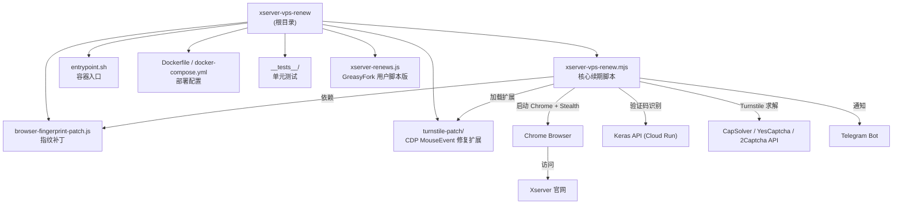

## xserver-vps-renew

> > 自动为 Xserver 免费 VPS 执行续期操作，基于 Puppeteer Stealth + rebrowser-patches 绕过 Cloudflare Turnstile 检测。

# Xserver VPS 自动续期工具

> 自动为 Xserver 免费 VPS 执行续期操作，基于 Puppeteer Stealth + rebrowser-patches 绕过 Cloudflare Turnstile 检测。

## 变更记录 (Changelog)

| 日期 | 变更内容 |
|------|----------|
| 2026-08-27 | 十轮迭代打磨：日志时间戳 `Intl.DateTimeFormat` 按 tz 缓存（每条日志不再新建 Intl 对象）；轮询路径日志降噪（`getTurnstileToken` 读取失败 error→debug；求解成功/链路/域名代理提示去重降 debug）；提交结果轮询自适应退避 `resolveSubmissionPollIntervalMs`（10s/30s 两段，120s 窗口 CDP 往返 ≈300→≈90）；`TURNSTILE_PROVIDER_ORDER` 拼写错误启动 warn（`listUnknownTurnstileProviderNames`）；entrypoint `show_cron_schedule` 支持「27 */4」错峰文案；diagnostics.sh 状态文件可写性探测；用户脚本到期判定对齐主脚本 #5（仅今天到期进续期页）+ 面板关闭按钮键盘可达（1.0.7）；通知 `<strong>`→`<b>` 统一 + `handleCaptchaPage` 边界防御；启动日志新增运行环境行（25 文件 / 479 用例） |
| 2026-08-22 | 任务 41：收尾任务 40——npm 纯构建期工具，`npm ci` 后整体从运行时镜像移除（含 npx/corepack/yarn，node 基础镜像自带的包管理器全清），根治 npm 捆绑运行期依赖的 CVE 打地鼠（picomatch/sigstore→升 npm、tar→显式升级均为该类别）；运行时仅依赖 node，entrypoint 直接执行主脚本；镜像体积略减，Trivy 无 HIGH/CRITICAL |
| 2026-08-22 | 任务 40：修复 CI Trivy 门禁（CVE-2026-73566 node-tar DoS，HIGH）：npm 官方 tarball 捆绑的运行期依赖 tar 7.5.19 落后于修复版 7.5.21，`npm install -g npm@latest` 直接解包捆绑依赖、不会按 semver 重新解析（第三次 npm 内嵌依赖漏洞：picomatch/sigstore→升 npm、本次 tar→显式升级），Dockerfile 在 npm 升级后显式 `npm install -g tar@7.5.22` 并覆盖进 `/usr/local/lib/node_modules/npm/node_modules/tar`（7.5.19 与 7.5.22 包结构一致，main/exports/dist 兼容；本地已下载 tarball + trivy 复现确认） |
| 2026-08-22 | 任务 39：修复两次手动运行暴露的两个竞态——(1) 提交结果判定过早：官方 /extend/do 处理需 60-90s，`evaluateSubmissionResult` 对「停留 conf 无失败标识」从即时 retry 改为 `pending`，`waitForSubmissionResult` 长轮询至 `SUBMISSION_RESULT_TIMEOUT_MS`（新配置，默认 120s，三处同步），避免重试导航中止在途 POST（ERR_ABORTED）把可成功的提交误判失败；(2) Turnstile token 注入撞 detached frame：新增 `injectTurnstileTokenWithRetry`（frame 脱离类错误原地重试 2 次），失败原因区分「求解失败」与「注入失败」并透传至通知；顺带 debug 日志埋点请求失败降噪 `isBenignRequestFailure`（GA/广告回传被导航中止不再刷屏）（24 文件 / 458 用例） |
| 2026-08-11 | 任务 37 十轮迭代：成功路径状态文件读取合并（3 次→2 次 I/O，`priorTotalRuns` 由 `totalRuns>1` 推导）；debug 级浏览器 console/pageerror/requestfailed 监听（条数上限防刷屏）；失败通知附验证码重试次数 `captchaRetries`（`error.captchaAttempts`，+2 用例）；日志超长截断 `clampLogMessage`（+3 用例）与 `[步骤N]` 序号；用户脚本 Turnstile token 监听改轮询主路径（原 MutationObserver 仅观察 attribute 恒等超时）；用户脚本状态面板标题/关闭按钮/success 3s 自动收起；22 个多余导出收敛 + `pollTurnstileTaskResult` 拆分 + theme/action 精简；CLI `--version/--help` + 启动横幅文档入口；人工确认通知「下次执行」→「下次检查」（23 文件 / 439 用例） |
| 2026-08-08 | 任务 36 十轮迭代：Turnstile 截图按 debug 按需写入（`SAVE_TURNSTILE_SCREENSHOTS`）；`page.close` 异常防御 `safeClosePage` 防双通知；自然通过降级立即点击；VPS 行解析纯函数 `extractVpsInfoFromCellTexts`；skip 日志去重；人工确认通知补本地 Node 重跑命令；用户脚本 Turnstile 超时不再强制提交；诊断脚本代理地址脱敏；新到期日提取收敛 `extractNewExpireDate`；entrypoint/cron-run/diagnostics 时间戳显式 `TZ`（23 文件 / 430 用例） |
| 2026-08-07 | 迭代打磨：分阶段耗时日志（pushStep 每步耗时）；`waitForSubmissionResult` 提交后轮询成功信号替代固定 2s（+4 用例）；Turnstile 注入后 token 软等待；通知/日志时间格式统一（`formatTokyoDateTime` 委托 `formatLogTimestamp`）；失败通知补「下次检查」行；Turnstile 轮询 debug 日志降噪（每 5 轮）；启动日志打印上次运行结果摘要；用户脚本 UI 无障碍（reduced-motion/aria-live/滚动）；`diagnostics.sh` 新增 Keras + 打码平台 API 连通性探测（22 文件 / 410 用例） |
| 2026-08-07 | 打磨：日志增加 [DEBUG]/[INFO]/[WARN]/[ERROR] 级别标签（formatLogLine）；关键告警提级 warn（failover 失败/熔断）；时间戳单源化 formatLogTimestamp + renewal-status 接入 logger；通知「下次执行」→「下次检查」+ 成功通知「连续成功 N 次」（countConsecutiveSuccesses）；Telegram 响应体 ok:false 校验（parseTelegramSendResult）；Turnstile/验证码图等待改软等待 waitForSelectorSoft；指纹体检 analyzeFingerprintHealth；用户脚本状态面板状态色/动画（21 文件 / 403 用例） |
| 2026-08-06 | 打磨：Turnstile 参数属性双名兼容（`data-c-data`/`data-cdata` 等，防 Anti-Captcha cData 漏取）；抽取 `getBodyText`/`listFailedTurnstileProviders`/`FAILURE_CATEGORY_LABELS` 消除重复；`checkRenewalNeeded` 统一 `nowMs` 基准；修复 `resolveCaptchaRetryUrl` 的 `/index` 重复 `extend` 段路径 bug；登录失败抛错附带页面提示（19 文件 / 364 用例） |
| 2026-08-06 | 代码质量重构：主脚本 1638→795 行（Turnstile UI 层 → `src/turnstile-flow.mjs`、面板流程 → `src/panel-flow.mjs`、页面工具 → `src/page-utils.mjs`）；消除 notify↔turnstile 跨模块 magic string 重复（委托 `isTurnstileOutageError`）；修复 Turnstile callback 双重触发；`extractTurnstileParams` 与 `readTurnstileWidgetParams` 共享属性名常量（单一来源）；结构化分级 logger 取代 `isNoisyModuleLog` 字符串嗅探（净删）；失败路径 outage 判定单次求值；`isRenewalDue` 移除死参数、`formatTokyoDateTime` 尊重 `TZ`；新增 cron 白名单防漂移测试（20 文件 / 372 用例） |
| 2026-08-06 | 防漂移：`env-whitelist.test.mjs` 校验 cron-run.sh 白名单 ↔ 主脚本 CONFIG ↔ .env.example 三处同步（21 文件 / 376 用例） |
| 2026-08-05 | 修复：官方新增「個人情報の取り扱いについて」同意页（`/xapanel/myaccount/agreement`），登录后未同意即被重定向导致误判「未找到免费 VPS」；新增 `ensureAgreementAccepted` / 用户脚本 `handleAgreement` 自动勾选 `#agree_flag_1` 并提交；自动处理无效时（同意页改版/未进入面板页）发 `buildManualConfirmNotifyMessage` 提醒用户人工确认后重跑容器；`checkRenewalNeeded` 增加表格等待与页面结构诊断（诊断日志定位到本根因）（19 文件 / 359 用例） |
| 2026-08-04 | 修复：`finishWithSkip` 越界引用 try 块内 `page`，导致「无需续期」场景双通知（skip+failure）且退出码 1；`page` 改显式传参（19 文件 / 356 用例全绿） |
| 2026-08-04 | 重构：拆分 `src/notify.mjs`（Telegram 通知构建）；utils 收纳 `escapeHtml`/`findChromePath`/`cleanChromeLocks`/`formatTokyoDateTime`；主脚本去除死重导出与模块包装层 |
| 2026-08-04 | 打磨：emitLog 单次取时间戳修复跨秒双时间戳、skip 通知统一出口、parsePositiveInt 严格校验、文档测试清单同步（19 文件 / 356 用例） |
| 2026-07-31 | 修复 #10 附带发现：Docker cron 下通知「下次执行」恒回退 +6h；cron-run 透传仅展示用 `CRON_SCHEDULE_DISPLAY`（不作模式开关） |
| 2026-07-31 | 采纳 #9：compose 默认调度 `0 */6` → `27 */4`（每 4h 错峰 27 分，任意 12h 续期窗口内 ≥3 次尝试） |
| 2026-07-29 | 修复 #7：entrypoint `--once` 优先于 `CRON_SCHEDULE`，cron-run 调用时清空调度变量，避免嵌套 supercronic 死锁 |
| 2026-07-26 | Turnstile：先注入 token 再对齐 UA；未通过禁止提交；重试回 index?id_vps；文档提醒 AntiCaptcha 域名代理 Proxyless IP 不一致 |
| 2026-07-25 | 日志与 Telegram：耗时/截断、LOG_LEVEL、失败分类、距可续窗口、TG_NOTIFY_SKIP、cron 白名单 |
| 2026-07-24 | Turnstile 多平台 failover + Anti-Captcha；全挂时最高级删机风险 Telegram 告警 |
| 2026-07-23 | 修复 #5：纯日期误判「明天到期」可续；识别官方「12時間前」拦截页并软跳过，避免误等验证码图 |
| 2026-07-22 | Telegram：每次执行均推送（含无需续期）；`TG_NOTIFY_DETAIL=full\|compact` 控制完整/简洁摘要（#4） |
| 2026-07-20 | 新增 YesCaptcha 作为 Turnstile 可选备选（CapSolver > YesCaptcha > 2Captcha） |
| 2026-07-16 | 文档强调：必须配置 CapSolver API（Turnstile），否则成功率极低 |
| 2026-07-14 | 适配官方 4GB 规则：最长 24h / 剩余≤12h 可续；CAPTCHA_API 默认公共端点；cron 默认每 6h |
| 2026-07-11 | renewal-logic 纯函数、超时可配置、Docker /data 持久化、15 文件 / 209 用例 |
| 2026-07-11 | 修复状态文件路径/DEFAULT_UA、utils 纯函数模块、配置校验 |
| 2026-07-11 | 文档同步：测试清单、supercronic、覆盖率阈值、Docker 非 root 运行说明 |
| 2026-06-30 | 初始化架构文档，扫描全仓生成根级 CLAUDE.md |

---

## 项目愿景

通过自动化浏览器操作，按官方 4GB 规则（最长 **24 小时**，剩余 **≤12 小时** 可续期）检查到期状态并在窗口内自动完成续期流程（登录 → 检查到期 → 续期申请 → 验证码识别 → Turnstile 通过 → 提交），避免因忘记续期导致 VPS 被回收。建议调度每 4 小时一次（compose 默认错峰 27 分）。

---

## 架构总览

### 技术栈

| 类别 | 技术选型 |
|------|----------|
| 运行时 | Node.js 22 (ESM) |
| 浏览器自动化 | rebrowser-puppeteer-core + puppeteer-extra Stealth |
| 验证码识别 | Keras 模型 API（Cloud Run 部署） |
| Turnstile 求解 | CapSolver / **Anti-Captcha** / YesCaptcha / 2Captcha（**多 key 串行 failover**；建议至少 2 家） |
| 通知 | Telegram Bot API |
| 容器化 | Docker + docker-compose（非 root `appuser`） |
| 定时调度 | supercronic（容器内，由 `CRON_SCHEDULE` 控制） |
| 测试 | Vitest |
| 依赖更新 | Renovate |
| CI/CD | GitHub Actions → GHCR |

### 目录结构

```
xserver-vps-renew/
├── xserver-vps-renew.mjs      # 编排入口（Chrome 启动 + 流程控制 + 通知）
├── src/                       # 可复用模块
│   ├── panel-flow.mjs         # Xserver 面板业务流程（登录/同意页/到期检查/续期确认/验证码提交）
│   ├── turnstile-flow.mjs     # Turnstile 浏览器交互（自然通过降级/求解后注入与 UA 对齐编排）
│   ├── page-utils.mjs         # 页面通用工具（导航等待/元素文本/正文读取）
│   ├── captcha.mjs            # 验证码处理（标准化/识别/平假名转换）
│   ├── turnstile.mjs          # Turnstile 求解（参数构建/API 调用/token 注入/多平台 failover）
│   ├── renewal-status.mjs     # 续期结果持久化与健康检查
│   ├── renewal-logic.mjs      # 续期业务纯逻辑（到期/提交结果/URL 构建）
│   ├── notify.mjs             # Telegram 通知构建（消息文案/失败分类/下次执行估算）
│   └── utils.mjs              # 通用纯函数（脱敏/东京日期/超时 fetch/HTML 转义/Chrome 工具）
├── browser-fingerprint-patch.js  # 浏览器指纹注入补丁
├── xserver-renews.js           # GreasyFork 用户脚本版本（参考实现）
├── turnstile-patch/            # Chrome 扩展：修复 CDP MouseEvent 坐标异常
│   ├── manifest.json
│   └── content.js
├── entrypoint.sh               # Docker 入口脚本（定时/单次模式）
├── diagnostics.sh              # 容器网络与环境诊断脚本
├── Dockerfile                  # 容器构建文件（appuser + supercronic）
├── docker-compose.yml          # 容器编排配置
├── package.json                # 依赖与脚本
├── vitest.config.mjs           # 测试配置
├── renovate.json               # 自动依赖更新配置
├── .env.example                # 环境变量模板
├── README.md / CHANGELOG.md / RUNBOOK.md
├── .github/workflows/          # CI/CD
│   └── docker-publish.yml
└── __tests__/unit/             # 单元测试（25 个文件，479 个用例）
    ├── buildTurnstileTask.test.mjs
    ├── captcha.recognize.test.mjs
    ├── cleanChromeLocks.test.mjs
    ├── convertHiraganaToNumber.test.mjs
    ├── cronScheduleDisplay.test.mjs
    ├── dependency-security.test.mjs
    ├── diagnostics.statusFile.test.mjs
    ├── entrypoint.once-mode.test.mjs
    ├── findChromePath.test.mjs
    ├── getTurnstileProvider.test.mjs
    ├── injectTurnstileToken.test.mjs
    ├── normalizeCaptchaCode.test.mjs
    ├── normalizeCaptchaCode.edge.test.mjs
    ├── notify.test.mjs
    ├── pageUtils.test.mjs
    ├── panelFlow.submission.test.mjs
    ├── renewalLogic.test.mjs
    ├── renewalStatus.test.mjs
    ├── env-whitelist.test.mjs
    ├── turnstile.extract.test.mjs
    ├── turnstile.failover.test.mjs
    ├── turnstile.solve.test.mjs
    ├── turnstileFlow.inject.test.mjs
    ├── turnstileFlow.token.test.mjs
    └── utils.test.mjs
```

### 系统结构图



---

## 模块索引

| 路径 | 职责 | 入口/关键函数 |
|------|------|---------------|
| `xserver-vps-renew.mjs` | 编排入口（Chrome 启动 + 流程控制 + 通知） | `main()`, `finishWithSkip()` |
| `src/panel-flow.mjs` | Xserver 面板业务流程（浏览器步骤） | `handleLogin()`, `ensureAgreementAccepted()`, `checkRenewalNeeded()`, `handleRenewalConfirm()`, `handleCaptchaPage()`, `navigateForCaptchaRetry()`, `waitForSubmissionResult()`, `resolveSubmissionPollIntervalMs()` |
| `src/turnstile-flow.mjs` | Turnstile 浏览器交互（自然通过降级 + 求解后注入编排） | `waitForTurnstile()`, `waitForTurnstileToken()`, `clickTurnstileFallback()`, `getTurnstileToken()`, `humanMouseMove()` |
| `src/page-utils.mjs` | 页面通用工具 | `waitForNav()`, `getText()`, `getBodyText()` |
| `src/captcha.mjs` | 验证码处理（纯函数） | `normalizeCaptchaCode()`, `convertHiraganaToNumber()`, `recognizeCaptchaWithKerasAPI()`, `recognizeCaptcha()` |
| `src/turnstile.mjs` | Turnstile 求解（参数构建/API 调用/token 注入/多平台 failover） | `listTurnstileProviders()`, `listUnknownTurnstileProviderNames()`, `getTurnstileProvider()`, `solveTurnstileWithFailover()`, `solveTurnstileViaAPI()`, `buildTurnstileTask()`, `injectTurnstileToken()`, `readTurnstileWidgetParams()`, `isTurnstileOutageError()` |
| `src/renewal-status.mjs` | 续期持久化（纯函数） | `readRenewalStatus()`, `writeRenewalStatus()`, `buildRenewalRecord()`, `countConsecutiveFailures()`, `getRenewalStatus()` |
| `src/utils.mjs` | 通用纯工具 | `maskProxyAddress()`, `getTokyoDateString()`, `fetchWithTimeout()`, `validateRequiredConfig()`, `parsePositiveInt()`, `escapeHtml()`, `formatTokyoDateTime()`, `findChromePath()`, `cleanChromeLocks()`, `NOOP_LOGGER` |
| `src/renewal-logic.mjs` | 续期业务纯逻辑（含 24h/12h 政策常量） | `isRenewalDue()`, `parseExpireTimestamp()`, `getRemainingHours()`, `detectRenewalWindowBlocked()`, `extractRetryAfterFromText()`, `buildRenewUrl()`, `resolveCaptchaRetryNavigation()`, `needsUserAgentAlignment()`, `shouldSubmitAfterTurnstile()`, `evaluateSubmissionResult()`, `extractExpireDateFromText()` |
| `src/notify.mjs` | Telegram 通知构建（纯函数） | `buildSuccessNotifyMessage` / `buildSkipNotifyMessage` / `buildFailureNotifyMessage`, `classifyRenewalFailure()`, `buildFailureHints()`, `buildProxyHint()`, `resolveNextRunAt()`, `parseNotifyDetail()`, `clampTelegramMessage()`, `formatProcessSteps()`, `listFailedTurnstileProviders()`, `FAILURE_CATEGORY_LABELS` |
| `browser-fingerprint-patch.js` | 浏览器指纹伪装（WebGL/Canvas/Plugins/Connection 等） | `injectBrowserFingerprint(page)` |
| `turnstile-patch/content.js` | 修复 CDP 导致的 MouseEvent.screenX/screenY 异常 | Chrome 扩展 content script |
| `entrypoint.sh` | Docker 容器入口（单次模式 / 定时模式 / supercronic 调度） | `run_renew()`, `cleanup()` |
| `diagnostics.sh` | 容器网络连通性与环境诊断 | 独立诊断脚本 |
| `xserver-renews.js` | GreasyFork 用户脚本版本（浏览器端直接运行参考） | `main()` 路由分发 |

---

## 运行与开发

### 本地运行

```bash
# 安装依赖
npm install

# 配置环境变量
cp .env.example .env
# 编辑 .env 填写 XSERVER_MEMBER_ID、XSERVER_PASSWORD（CAPTCHA_API 可选）

# 单次执行
npm start
# 或
node xserver-vps-renew.mjs
```

### Docker 部署

```bash
# 构建并启动
docker-compose up -d

# 查看日志
docker logs -f xserver-vps-renew

# 手动触发一次续期
docker exec xserver-vps-renew ./entrypoint.sh --once
```

### 测试

```bash
# 运行测试
npm test

# 覆盖率报告
npm run test:coverage

# 监听模式
npm run test:watch
```

---

## 环境变量配置

### 必填

| 变量 | 说明 |
|------|------|
| `XSERVER_MEMBER_ID` | Xserver 会员 ID |
| `XSERVER_PASSWORD` | Xserver 登录密码 |
| `CAPSOLVER_API_KEY` | **CapSolver API 密钥（推荐主平台）**：Turnstile 人机验证。未配置任何平台时成功率极低 |

### 可选

| 变量 | 说明 | 默认值 |
|------|------|--------|
| `CAPTCHA_API` | Keras 验证码识别 API 地址（Cloud Run，可自建覆盖） | `https://captcha-api-216250547992.us-central1.run.app` |
| `ANTICAPTCHA_API_KEY` | Anti-Captcha API 密钥（推荐异构备份，参与 failover） | 无 |
| `ANTICAPTCHA_SOFT_ID` | Anti-Captcha 开发者 softId（可选） | 无 |
| `YESCAPTCHA_API_KEY` | YesCaptcha API 密钥（参与 failover） | 无 |
| `YESCAPTCHA_API_BASE` | YesCaptcha API 节点（国际默认；国内可用 `https://cn.yescaptcha.com`） | `https://api.yescaptcha.com` |
| `YESCAPTCHA_TASK_TYPE` | YesCaptcha 任务类型 | `TurnstileTaskProxyless` |
| `TWOCAPTCHA_API_KEY` | 2Captcha API 密钥（参与 failover） | 无 |
| `TURNSTILE_PROVIDER_ORDER` | failover 顺序（逗号分隔） | CapSolver,AntiCaptcha,YesCaptcha,2Captcha |
| `TURNSTILE_PROVIDER_MAX_FAILURES` | 单平台连续失败后切换阈值 | `3` |
| `PROXY_TYPE` | 代理类型：http / socks4 / socks5 | 无 |
| `PROXY_ADDRESS` | 代理地址 | 无 |
| `PROXY_PORT` | 代理端口 | 无 |
| `PROXY_LOGIN` | 代理用户名 | 无 |
| `PROXY_PASSWORD` | 代理密码 | 无 |
| `TG_BOT_TOKEN` | Telegram Bot Token | 无 |
| `TG_CHAT_ID` | Telegram Chat ID | 无 |
| `TG_NOTIFY_DETAIL` | 通知详细程度：`full`（完整摘要含过程）/ `compact`（简洁） | `full` |
| `TG_NOTIFY_SKIP` | 是否推送「无需续期/跳过」通知 | `true` |
| `LOG_LEVEL` | 日志级别：`debug` / `info` / `warn` / `error` | `info` |
| `SAVE_TURNSTILE_SCREENSHOTS` | 强制保存 Turnstile 求解前后截图（默认仅 `LOG_LEVEL=debug` 时写盘；排查问题时可在 info 级别开启） | `false` |
| `CHROME_PATH` | Chrome 可执行文件路径 | 自动检测 |
| `CHROME_USER_DATA` | Chrome 用户数据目录 | `/data/chrome-profile` |
| `TZ` | 时区 | `Asia/Tokyo` |
| `CRON_SCHEDULE` | Cron 定时表达式（设置后启用定时模式；compose 默认 `27 */4 * * *`，每 4h 错峰 27 分，适配 12h 续期窗口） | 无（单次模式） |
| `ENABLE_DIAGNOSTICS` | 启用容器环境诊断（true/false） | 无 |
| `RENEWAL_STATUS_FILE` | 续期记录持久化文件路径 | `/data/chrome-profile/renewal-status.json` |
| `ALERT_AFTER_FAILURES` | 连续失败达到此次值时触发告警升级 | `3` |
| `NAVIGATION_TIMEOUT_MS` | 页面导航超时（毫秒） | `30000` |
| `TURNSTILE_TIMEOUT_MS` | Turnstile 自然通过等待超时 | `60000` |
| `TURNSTILE_API_TIMEOUT_MS` | Turnstile API 求解轮询超时 | `120000` |
| `CAPTCHA_MAX_RETRY` | 验证码识别最大重试次数 | `3` |
| `SUBMISSION_RESULT_TIMEOUT_MS` | 提交后等待服务端处理结果的轮询上限（官方处理需 60-90s；过短会中止在途提交导致误判失败） | `120000` |

---

## 核心流程详解

### 续期主流程 (`main()`)

```
启动 → 清理 Chrome 锁文件 → 启动 Chrome (rebrowser + Stealth)
  → 注入浏览器指纹补丁 → 登录 → 检查到期状态
  → [无需续期] 结束
  → [需要续期] 续期确认 → 验证码识别 → Turnstile 求解 → 提交
  → 提取新到期日 → Telegram 通知（成功 / 失败 / 无需续期均推送；`TG_NOTIFY_DETAIL` 控制 full/compact）
```

### 验证码处理 (`handleCaptchaPage()`)

1. 等待验证码图片元素（Base64 内嵌）
2. 调用 Keras API 识别（最多重试 3 次）
3. 验证码标准化（支持平假名转数字、全角转半角、混合内容提取）
4. 模拟人类输入（带延迟）
5. Turnstile 多平台 failover 求解（CapSolver → AntiCaptcha → YesCaptcha → 2Captcha）
6. **仅当 Turnstile `ok`（或页面已预填 token）时提交**；未通过则抛错重试，禁止强解 disabled 硬提交
7. 失败重试：优先 `handleRenewalConfirm(renewUrl)` 回 `index?id_vps=` 再进 conf（勿裸 goto `/conf`）

### Turnstile 求解策略

- **多平台串行 failover**（默认顺序）：CapSolver → AntiCaptcha → YesCaptcha → 2Captcha
- **CapSolver**：`CAPSOLVER_API_KEY`（`AntiTurnstileTaskProxyLess`，不支持代理）
- **Anti-Captcha**：`ANTICAPTCHA_API_KEY`（`TurnstileTaskProxyless`；仅当 `PROXY_ADDRESS` 为 IP 时用 `TurnstileTask`；域名为代理时自动 Proxyless；官方字段 `cData`/`chlPageData`；不提交自定义 UA）
  - **风险**：域名代理 → Proxyless 时工人 IP ≠ 浏览器代理出口，易 `認証に失敗`；宜作备份而非「仅 AntiCaptcha + 域名代理」主路径（详见 README / RUNBOOK）
- **YesCaptcha**：`YESCAPTCHA_API_KEY`（`TurnstileTaskProxyless` / `M1`；`softID: 97020`）
- **2Captcha**：`TWOCAPTCHA_API_KEY`（支持代理）
- 单平台连续失败 `TURNSTILE_PROVIDER_MAX_FAILURES`（默认 3）次后切换；全部熔断 → `TURNSTILE_ALL_PROVIDERS_FAILED` + 最高级 Telegram 告警
- **降级（不推荐）**：无 API 密钥时等待自然通过——生产环境请勿依赖
- 求解成功后：**先**注入 token / 触发 callback，**再**尽力对齐 API 返回的 UA（`setUserAgent` 失败不阻断）

### 浏览器反检测措施

| 措施 | 实现位置 |
|------|----------|
| rebrowser-patches 修复 Runtime.Enable 泄露 | `rebrowser-puppeteer-core` |
| Stealth 插件隐藏自动化特征 | `puppeteer-extra-plugin-stealth` |
| 浏览器指纹注入（WebGL/Canvas/Plugins 等） | `browser-fingerprint-patch.js` |
| CDP MouseEvent.screenX/screenY 修复 | `turnstile-patch/` Chrome 扩展 |
| 真实 UA（Chrome 149 Edge） | `CONFIG` 中 `DEFAULT_UA` |

---

## 测试策略

- **框架**：Vitest + v8 覆盖率
- **覆盖范围**：`src/**/*.mjs` + `xserver-vps-renew.mjs`
- **已测试模块**（25 个测试文件，479 个用例）：
  - `src/captcha.mjs` — `normalizeCaptchaCode`（含边界）、`convertHiraganaToNumber`、`recognizeCaptcha` / `recognizeCaptchaWithKerasAPI`
  - `src/turnstile.mjs` — `listTurnstileProviders` / failover、`getTurnstileProvider`（含 AntiCaptcha/YesCaptcha）、`buildTurnstileTask`、`buildCreateTaskPayload`、`solveTurnstileViaAPI`、`solveTurnstileWithFailover`、`injectTurnstileToken`、`extractTurnstileParams` / `readTurnstileWidgetParams`（属性名双名兼容）
  - `src/page-utils.mjs` — `waitForNav`（成功/失败/默认 logger）、`getText`、`getBodyText`（含 evaluate 异常容错）、`waitForSelectorSoft`（软等待替代固定 sleep）
  - `src/panel-flow.mjs` — `waitForSubmissionResult`（提交后轮询成功信号提前返回 / 未命中等待至超时 / 失败同样等待避免过早误判 / 默认 logger）、`resolveSubmissionPollIntervalMs`（10s/30s 自适应退避）
  - `src/turnstile-flow.mjs`（部分） — `waitForTurnstileToken`（降级模式立即点击 / 10s 间隔重试）、`injectTurnstileTokenWithRetry`（frame 脱离重试）、`getTurnstileToken`（读取失败降 debug 并回退空串）
  - `diagnostics.sh` — `check_status_file_writability`（状态文件目录/文件可写性四态探测，bash 运行时求值真实函数）
  - `src/renewal-status.mjs` — `readRenewalStatus`（含 logger 注入）、`writeRenewalStatus`、`buildRenewalRecord`、`countConsecutiveFailures`、`countConsecutiveSuccesses`、`getRenewalStatus`
  - `src/renewal-logic.mjs` — 到期判定（含 24h/12h 规则与时分解析）、URL 构建、提交结果、到期日提取
  - `src/notify.mjs` — 通知文案（成功/跳过/失败 + 过程摘要 + 连续成功）、失败分类与处置建议、下次执行估算、详情模式解析、消息截断、`parseTelegramSendResult`（200+ok:false 逻辑错误识别）
  - `src/utils.mjs` — `maskProxyAddress`、`getTokyoDateString`、`fetchWithTimeout`、`validateRequiredConfig`、`parsePositiveInt`、`escapeHtml`、`formatTokyoDateTime`、`formatLogTimestamp`、`formatLogLine`（级别标签）、`analyzeFingerprintHealth`、`findChromePath`、`cleanChromeLocks`、`NOOP_LOGGER`
  - **配置同步防漂移**：`env-whitelist.test.mjs` — cron-run.sh 白名单 ↔ 主脚本 CONFIG ↔ .env.example 三处清单一致性（含 #7 有意排除项与内部透传例外）
- **未覆盖**：端到端浏览器操作流程（登录 / 续期确认 / 完整提交流程需集成测试或手动验证）；`src/panel-flow.mjs`（除 `waitForSubmissionResult` / `resolveSubmissionPollIntervalMs` 外的浏览器步骤）、`src/turnstile-flow.mjs` 的浏览器编排段（`waitForTurnstile` 等）、`xserver-vps-renew.mjs` 为浏览器步骤与编排入口，依赖真实页面，无单元覆盖（与原主脚本内联时一致）
- **CI 门禁**（`vitest.config.mjs`）：分支覆盖率 ≥ 25%；functions / lines / statements ≥ 28%

---

## 编码规范

- ESM 模块（`"type": "module"`），使用 `import`/`export`
- 日志统一格式：`YYYY-MM-DD HH:mm:ss` 前缀（东京时区）
- 所有用户可见输出使用简体中文
- 环境变量通过 `CONFIG` 集中管理
- 敏感信息（代理地址、密码）在日志中 mask 处理
- 导出纯函数以支持单元测试

---

## AI 使用指引

- 修改核心流程时，请先理解 `main()` 中的步骤顺序和错误处理逻辑
- 验证码识别和 Turnstile 求解是关键路径，修改需谨慎
- 文档与示例须强调 **至少配置 1 家 Turnstile 平台**，并**建议第 2 家异构备份**（如 Anti-Captcha）以实现 failover
- 浏览器反检测措施（指纹补丁、CDP 修复）是绕过 Cloudflare 的核心，不宜随意变更
- 新增配置项需同步更新 `.env.example` 和本文档
- 纯函数修改后需补充对应单元测试
- `xserver-renews.js` 是 GreasyFork 用户脚本版本，与主脚本逻辑独立，修改时注意是否需要同步

---
> Source: [Silentely/xserver-vps-renew](https://github.com/Silentely/xserver-vps-renew) — distributed by [TomeVault](https://tomevault.io).
<!-- tomevault:4.0:gemini_md:2026-09-24 -->
