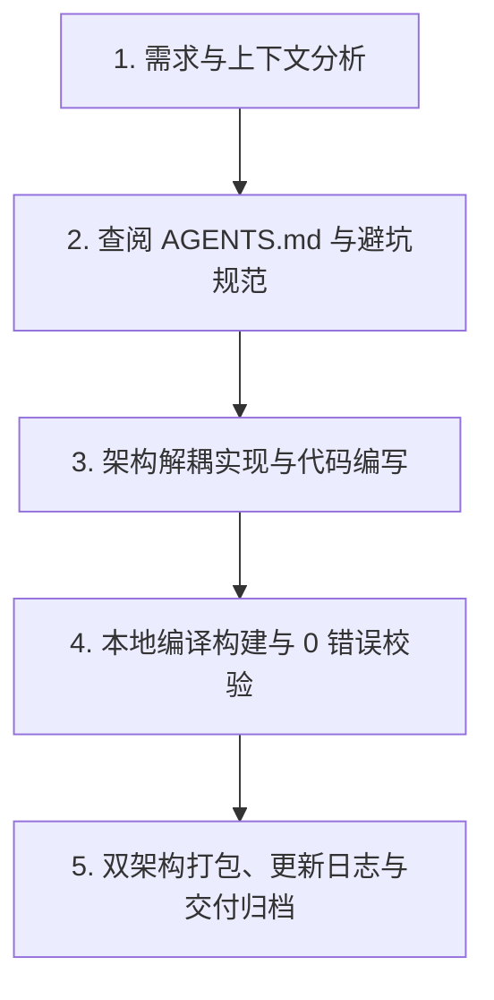

## starpie

> > **致未来的 AI Agent 与开发者**：

# StarPie (星盘) - 核心架构与多轮开发继承规范 (AGENTS.md)

> **致未来的 AI Agent 与开发者**：  
> 本文档是 **StarPie (原 WinPieGestures)** 项目的唯一权威工程架构与协作规范指南。当你在新的对话轮次或全新环境中接手本项目时，**必须首先通读本文档**，严格遵循本规范中所确立的架构分层、设计哲学、避坑指南与发布工作流，确保项目在持续迭代中保持高内聚、高品质、零退化与丝滑流畅。

---

## 目录
1. [🌟 项目起源、使命与设计哲学](#1-项目起源使命与设计哲学)
2. [🏗️ 源码架构与核心模块分工](#2-源码架构与核心模块分工)
3. [⚙️ 核心技术机制与避坑规范](#3-核心技术机制与避坑规范)
4. [🧩 插件系统运行时重构](#4-插件系统运行时重构)
5. [🔄 代码生成、编译与发布流水线](#5-代码生成编译与发布流水线)
6. [🎨 UI/UX 与视觉设计规范](#6-uiux-与视觉设计规范)
7. [📜 版本演进与发布记录](CHANGELOG.md)
8. [🤝 Agent 接力协作与交付验收闭环](#8-agent-接力协作与交付验收闭环)

---

## 1. 🌟 项目起源、使命与设计哲学

### 1.1 灵感来源与初衷
- **创作者背景**：机械设计制造及其自动化专业学生，深度使用工业 CAD 软件 **SolidWorks**。
- **灵感核心**：SolidWorks 内置的**鼠标笔势手势轮盘 (Mouse Gestures Wheel)** 能在三维建模中带来行云流水般的盲操提效体验。本项目旨在将这种**工业级的高效轮盘交互迁移至 Windows 桌面全局**，使所有用户在日常办公、代码编写、设计创作与游戏多任务中，均能享受指尖翻飞的极速操作。
- **开源仓库**：GitHub `SoftBlack42/StarPie`。

### 1.2 产品三大工程红线 (Core Non-Negotiables)
1. **极致轻量与低内存驻留 (Ultra-Lightweight & Efficient Working Set)**：
   - **分态务实内存基准**（基于原生 .NET 8 WPF + Win32 真实运行时物理工作集）：
     - **静默后台守护态**（仅托盘与全局底层钩子常驻，控制台未打开）：物理内存平稳驻留于 **15MB ~ 30MB**（系统深睡整理后约 **10MB ~ 20MB**），远优于 Electron 框架应用（普遍 150MB ~ 300MB+）；
     - **轮盘唤出与手势交互态**（DirectX 硬件加速透明渲染、瞬时视觉树与图标缓存）：峰值控制在 **25MB ~ 50MB**，确保热代码常驻物理 RAM，绝不因硬缺页引发掉帧卡顿；
     - **控制台全量 UI 开启态**（4 标签页、实时交互 Canvas、复杂控件树与应用搜索）：控制在 **60MB ~ 110MB**，窗口关闭 30 秒按需释放后平稳回落至后台驻留态；
   - 杜绝引入重量级第三方 UI 库（如 Electron、MAUI、Heavy Chromium），纯基于原生 **.NET 8 WPF + Win32 P/Invoke API** 深度调优；
   - 绘图画刷、笔刷必须显式调用 `Freezable.Freeze()` 消除内存泄漏与 GC 抖动；严禁在常驻数据模型或 `config.json` 中塞入巨型 Base64 字符串，防止 .NET 大对象堆 (LOH) 碎片化导致工作集异常膨胀。
2. **零延迟与极致丝滑 (Zero Latency & 60/120 FPS Fluidity)**：
   - 鼠标右键/中键/侧键按下到轮盘完全呈现场景延迟必须 **< 16ms**；
   - 扇区高亮动画与光晕过渡采用贝塞尔平滑插值，杜绝卡顿与掉帧；
   - 钩子回调线程内绝不执行耗时 IO 或复杂计算，纯轻量位运算捕获。
3. **肌肉记忆与确定性 (Muscle Memory & Reliability)**：
   - 扇区角度与操作严格绑定空间极坐标方向（4 字键、8 字键、12 字键预设档，均为 360°/N 等分且第 0 位固定正东）；
   - 盲操触发命中率 100%，杜绝误触、漂移与错选。

---

## 2. 🏗️ 源码架构与核心模块分工

### 2.1 目录结构全景
```text
g:\Users\2 Better\Desktop\design\
├── WinPieGestures/                # 主工程源码目录 (.NET 8.0 WPF)
│   ├── WinPieGestures.csproj      # 项目配置文件 (版本号、依赖与打包参数)
│   ├── App.xaml / App.xaml.cs     # 应用宿主、单例互斥锁、Hook/托盘/设置窗口生命周期
│   ├── TrayController.cs          # 进程级系统托盘控制器（菜单、主题、UIPI 防护、提示与退出）
│   ├── RadialWindow.xaml(.cs)     # 核心悬浮轮盘窗口 (硬件加速透明渲染、高频动画)
│   ├── SettingsWindow.xaml(.cs)   # 按需创建的控制台主界面（配置面板、实时交互画布）
│   ├── SubActionEditorWindow.xaml(.cs) # 二级级联子动作独立编辑器
│   ├── HotkeyBuilderDialog.xaml(.cs)   # 快捷键拼装组合器 (自包含样式、一键预设芯片)
│   ├── ColorPickerWindow.xaml(.cs)     # 颜色选择器 (色盘选择、色相环与屏幕实时吸色)
│   ├── IconPickerWindow.xaml(.cs)      # 内置矢量 SVG / 图标提取器
│   ├── ProgramPickerWindow.xaml(.cs)   # 软件检索器 (模糊搜索、拼音索引、MRU缓存)
│   ├── InputDialog.xaml(.cs)      # 通用文本输入与配置重命名弹窗
│   ├── GestureController.cs       # 手势状态机 (拖拽位移、极坐标计算、命中测试)
│   ├── MouseHook.cs               # 低级鼠标全局钩子 (WH_MOUSE_LL)
│   ├── KeyboardHook.cs            # 低级键盘全局钩子 (WH_KEYBOARD_LL)
│   ├── ActionExecutor.cs          # 动作调度与 Win32 SendInput 模拟执行引擎
│   ├── ConfigManager.cs           # 配置序列化、持久化、导入/导出与注册表自启管理
│   ├── AppConfig.cs               # 全局配置数据模型 (主题、尺寸、动作、白名单等)
│   ├── WheelProfile.cs            # 单个轮盘方案数据模型 (扇区数、动作槽位列表)
│   ├── CustomColorPreset.cs       # 自定义配色方案模型
│   ├── AppThemeManager.cs         # 窗口深浅色主题画刷注入管理器
│   ├── FullScreenHelper.cs        # 独占全屏检测与 Windows Explorer 穿透识别
│   ├── ActiveWindowHelper.cs      # 前台活动窗口探测器
│   ├── MemoryOptimizer.cs         # 内存整理与工作集压缩工具
│   ├── I18n.cs                    # 多语言国际化字典 (zh-CN, zh-TW, en-US, ja-JP)
│   ├── Renderers/                 # 轮盘切削形态渲染器策略族
│   │   ├── IRadialStyleRenderer.cs    # 渲染器通用抽象接口
│   │   ├── BaseStyleRenderer.cs       # 几何切削基础类
│   │   ├── StyleRendererFactory.cs    # 渲染器工厂
│   │   ├── ClassicRingRenderer.cs     # 经典圆弧与圆角胶囊渲染器
│   │   ├── CleanSectorsRenderer.cs    # 悬浮圆角矩形渲染器
│   │   └── GlassmorphismRenderer.cs   # 液态毛玻璃渲染器
│   └── Plugin/                    # ★ 插件系统宿主实现（详见第 4 节）
│       ├── PluginHost.cs              # 执行/校验/安装的唯一入口接缝
│       ├── PluginRuntime.cs           # 路径注册、激活、调用与异步停用公共运行时
│       ├── PluginPathModules.cs       # 动作/交互事件/轮盘结构三条强类型路径模块
│       ├── PluginCatalog.cs           # 贡献点注册表 + 注册会话（暂存→提交的原子性）
│       ├── PluginLoadContext.cs       # 可回收 ALC（停用即卸载，需重启比例是硬指标）
│       ├── PluginInstance.cs          # 单个插件的运行时状态机与加载计量
│       ├── PluginScanner.cs           # 纯静态 PE 识别（不加载程序集即可读清单与 TFM）
│       ├── PluginManifestReader.cs    # plugin.json / 程序集元数据双通道清单读取
│       ├── PluginInvoker.cs           # 动作调用与超时/取消/串行化调度
│       ├── PluginParameterValidator.cs # 声明式参数约束校验（Required/MaxLength/Min/Max/Regex）
│       ├── PluginParameterForm.cs     # 参数表单动态渲染（9 种 ParameterFieldType）
│       ├── PluginActionBinding.cs     # 「Type + PluginActionRef ⇄ 单 Tag」双向投影
│       ├── ActionParameterProjection.cs # 认领动作的宿主裸字段 → 参数字典投影
│       ├── PluginActionClaimRegistry.cs # 官方在线动作的顶层 Type 认领快照与冲突拒绝
│       ├── OfficialPluginClient.cs    # 官方 catalog 拉取、.spkg 下载与 SHA-256 校验
│       ├── BuiltinActionCatalog.cs     # 仅保留 Hotkey 的进程内动作目录
│       ├── BuiltinActions/             # 内建动作的插件模型适配实现
│       ├── PluginCapabilityLabels.cs   # 能力位 → 安装确认风险文案
│       ├── PluginI18n.cs              # 插件词条 key 的统一解析（短键 ⇄ 全键）
│       ├── PluginListItem.cs          # 插件管理页的列表项 DTO
│       ├── PluginSelfTest.cs          # --plugin-selftest 无界面端到端自检通道
│       ├── PluginSettings.cs          # 插件私有持久化（settings.json）
│       ├── PluginPaths.cs             # 插件目录/清单/日志/便携模式判定
│       ├── PluginRegistryStore.cs     # 启用状态与哈希登记（registry.json）
│       ├── PluginLogger.cs            # 按插件分文件的日志
│       ├── PluginContext.cs           # IPluginContext 实现 + 能力门禁 + 词条注册表
│       └── PluginHostServices.cs      # 动作执行/窗口/剪贴板/通知等宿主服务实现
├── plugin/                       # ★ 插件开发资源（文档、归档与示例）
│   ├── README.md                 # 插件开发统一入口
│   ├── sdk/
│   │   └── StarPie.Plugin.Abstractions/ # 插件 SDK 契约（主程序与插件共享）
│   ├── docs/
│   │   ├── plugin-development-quickstart.md      # 插件开发快速入门
│   │   ├── plugin-system-api-and-performance.md  # 当前 API 与性能参考
│   │   ├── plugin-system-architecture.md         # 插件系统现行架构与动作执行路径
│   │   └── archive/                              # 历史设计与早期实现说明
│   └── samples/
│       ├── HelloAction/          # 社区参考模板
│       ├── ScreenBrightness/     # P/Invoke + COM + 耗时 IO 压力测试样本
│       └── FloatingBall/         # 常驻形态样本：插件自画 WPF 球窗 + 经 IHostWheelService 呼出宿主轮盘
├── releases/                      # 正式发行包构建归档目录
│   └── vX.Y.Z/
│       ├── Lightweight/           # 依赖运行时的轻量绿色包 (~2.5MB)
│       ├── Standalone/            # 独立单文件免安装自解压包 (~65MB)
│       ├── StarPie-vX.Y.Z-Lightweight-win-x64.zip
│       └── StarPie-vX.Y.Z-Standalone-win-x64.zip
├── assets/                        # 品牌素材（app_icon / tray_icon / 各版 logo / screenshots）
├── attachments/                   # 文档与演示动图素材库 (GIF / PNG)
├── 主题尺寸配置文件/               # 轮盘尺寸预设 JSON（用户可在「高级与系统设置」最下方导入）
├── scratch/                       # 一次性开发工具与验证脚本 —— 不参与构建，可随时清理
│   ├── IconGenerator/             # 从 attachments/cover.v3.png 生成 logo / app_icon / tray_icon
│   ├── Issue17Demo/               # 复现用户反馈用的小 Demo 工程
│   ├── Everything-SDK/            # 本地搜索联调用的 SDK 头文件
│   └── *.ps1 / *.png / test_v170.cs   # 临时验证脚本与对照截图
├── tests/                         # UI 回归套件（pywinauto + UIA；会弹 GUI，由用户手动运行）
│   ├── conftest.py                # 隔离 AppData 沙箱 fixture（另导出 find_exe / launch_app 供需要自控启动的用例复用）
│   ├── test_settings.py           # 设置窗口回归
│   ├── test_plugins.py            # 插件页回归
│   ├── test_i18n.py               # 「切英文后整页已翻译」棘轮回归（台账驱动）
│   └── i18n_baseline.json         # 上述用例的台账基线 —— 只允许变少，新增即红
├── installer/                     # Inno Setup 打包
│   ├── StarPie.iss                # 安装脚本（语言文件在 Languages/）
│   └── build-installer.ps1        # 打包入口 —— 版本号 6 处同步点之一（$Version 兜底值）
├── PLUGIN_FIRST_ROADMAP.md        # 插件化边界规划（三问判据；定位是规划，不是现状描述）
├── AGENTS.md                      # 本架构与继承开发规范
└── CHANGELOG.md                   # 完整版本演进与发布日志
```

---

## 3. ⚙️ 核心技术机制与避坑规范

### 3.1 极坐标分区与扇区命中测试 (Hit-Testing)
- **极坐标基准**：
  $$\theta = \text{atan2}(\Delta y, \Delta x) \in [-\pi, \pi]$$
  角度 $0$ 为右侧，$\pi/2$ 为正下方（WPF 坐标系 Y 轴向下）。
- **一级轮盘与外圈子环 (Outer Sub-Ring)**：
  根据扇区数量 $N \in \{4, 8, 12\}$ 均匀划分扇区角度 $\Delta \theta = 2\pi / N$，扇区中心角 $\theta_i = -\pi/2 + i \cdot \Delta \theta$。
- **蜂窝扇 (Honeycomb Fan)**：
  - 二级菜单以被选中的主扇区为圆心展开（最多 3 项）；
  - **命中判定算法**：**严禁使用欧几里得圆心欧氏距离判定**！必须采用极坐标夹角绝对距离最近邻划分：
    $$\text{TargetIndex} = \arg\min_j |\text{NormalizeAngle}(\theta_{\text{mouse}} - \theta_j)|$$
    使得光标向左划动时必然命中左侧子叶，向右划动时必然命中右侧子叶，彻底杜绝判定左右颠倒的缺陷。

### 3.2 Win32 `SendInput` 模拟与硬件扫描码注入
- **硬件扫描码映射 (Scan Code)**：
  Windows 部分应用（如 Photoshop、Illustrator、3D CAD 等）直接监听底层硬件扫描码而非虚拟键码。下发按键时必须使用 Win32 `MapVirtualKey(vk, MAPVK_VK_TO_VSC)` 转换扫描码，并为方向键、Delete、Insert、PageUp/Down、Home/End、Win 等键打上 `KEYEVENTF_EXTENDEDKEY` 标志。
- **修饰键时延保持 (Modifier Hold Delay)**：
  下发 `Ctrl + G` 或 `Ctrl + Shift + G` 等组合键时，必须在修饰键按下和主键按下之间保留 **10ms ~ 15ms** 保持时延，并在主键释放后再释放修饰键，避免宿主应用因时序竞争丢失修饰键而误判为单键 `G`。
- **连续数值与文本注入**：
  遇到多位数值（如 `"100"`、`"1920"`）或字符串时，采用 `KEYEVENTF_UNICODE` 字符流逐字符发送，完美规避输入法阻断。

### 3.3 快捷键录制框 (`HotkeyRecorderBox`) 焦点规范
- **禁止 WPF 默认焦点跳转**：
  `Tab` 是 WPF 系统的焦点切换键。在 `HotkeyRecorderBox` 控件中必须在构造函数中执行：
  ```csharp
  KeyboardNavigation.SetTabNavigation(this, KeyboardNavigationMode.None);
  KeyboardNavigation.SetDirectionalNavigation(this, KeyboardNavigationMode.None);
  KeyboardNavigation.SetControlTabNavigation(this, KeyboardNavigationMode.None);
  ```
  确保按下 `Tab`、`Alt + Tab`、`Win + Tab` 时控件不丢失焦点，并能在 `OnPreviewKeyDown` 中拦截 `Key.Tab` / `Key.System` 顺利完成组合录制。

### 3.4 场景隔离、全屏检测与白名单穿透
- **Windows Explorer 进程穿透**：
  桌面窗口（`Progman`、`WorkerW`、`SHELLDLL_DefView`、`SysListView32`）与任务栏（`Shell_TrayWnd`、`Shell_SecondaryTrayWnd`）在全屏检测中必须显式穿透，不得被判定为全屏独占应用。
- **白名单优先级**：
  在「全屏游戏/独占应用自动禁用手势」开启时，位于 `WhitelistedProcesses` 白名单中的程序（如 Photoshop、CAD、Visual Studio 等）具有**最高旁路优先级**，无论是否全屏独占均能呼出轮盘。

### 3.5 配置持久化与自定义配色无损导入/导出
- **数据完整性**：
  `ConfigManager.ExportConfig` 必须将全局 `CustomColorPresets` 列表连同当前主题选择、微调色彩参数、几何尺寸全部导出至 JSON。
- **导入即时刷新**：
  `ImportConfigButton_Click` 导入成功后，必须立即调用：
  ```csharp
  ReloadThemePresets(); // 重构一二级主题下拉列表
  RefreshSlots();       // 刷新动作列表绑定
  RenderLiveWheelPreview(); // 刷新实时交互画布
  ```
  杜绝由于 `_isUpdatingUi` 状态锁导致界面控件脱节的问题。

### 3.6 应用宿主、托盘与设置窗口生命周期
- **进程级所有权**：`App` 是程序宿主，负责持有 `MouseHook`、`KeyboardHook`、`GestureController`、`TrayController`，并通过 `ShowSettingsWindow(int tabIndex = -1)` 统一管理 `SettingsWindow` 的创建与显示。
- **托盘必须独立于设置窗口**：
  - `NotifyIcon`、托盘菜单、暂停/恢复、主题、本地化、提权、退出和提示气泡统一由 `TrayController` 管理；
  - 管理员权限运行时的 `ChangeWindowMessageFilter` / `ChangeWindowMessageFilterEx` UIPI 消息放行必须保留在 `TrayController`；
  - 严禁重新把托盘生命周期放回 `SettingsWindow`，否则静默启动会再次加载完整控制台 UI。
- **设置窗口按需创建**：
  - 静默启动、开机自启时严禁直接 `new SettingsWindow()`；
  - 普通启动、托盘菜单、第二实例唤醒，以及轮盘动作「打开 StarPie 控制台」都必须调用 `App.ShowSettingsWindow()`；
  - 严禁使用 `App.MainSettingsWindow?.ShowSettings()` 作为入口，因为窗口释放后该调用会静默失效。
- **30 秒延迟释放策略**：
  - 用户关闭控制台时先 `Hide()` 并启动 30 秒一次性计时器；
  - 30 秒内重新打开时取消计时器并复用原窗口；
  - 空闲超过 30 秒后才真正 `Close()`，解除外部事件、停止计时器、取消下载/更新任务并释放 ViewModel；
  - 最终释放后只允许调用 `MemoryOptimizer.TrimMemory(force: false)`，不得在日常关闭路径执行 Full GC 与强制工作集剥离，避免下一次轮盘唤起发生硬缺页或卡顿。
- **初始化不得产生系统副作用**：WPF 给 `CheckBox.IsChecked` 赋值时也可能触发 `Checked/Unchecked`。加载自启动状态时必须同时使用 `_isUpdatingUi`、`_isUiInitializing` 与 `_isLoadingAutoStartState` 防护，并比较已加载状态；只有用户实际修改开关时才能调用 `ConfigManager.SetAutoStart()`，严禁打开控制台时创建或删除计划任务。
- **显式退出模式**：`App.xaml` 必须保持 `ShutdownMode="OnExplicitShutdown"`，关闭最后一个设置窗口不能结束后台 Hook 与托盘进程；只有托盘退出、提权重启或明确的应用退出流程可以调用 `Shutdown()`。

---

## 4. 🧩 插件系统：契约、边界与运行时实现

> 本节同时规定插件 SDK、安装与贡献契约、官方/社区插件边界，以及当前统一运行时、路径模块、活动调用租约和异步停用状态机。这里的规则是插件系统的统一工程约束。

### 4.1 插件契约、边界与开发纪律

- **三层分界，任何一层都不许越界**：
  - **SDK 契约层** `plugin/sdk/StarPie.Plugin.Abstractions/`（独立程序集，插件唯一允许引用的 StarPie 程序集）。改动它等于改公共契约，只增不改；
  - **宿主实现层** `WinPieGestures/Plugin/`（`PluginHost` 是主程序唯一的调用接缝）；
  - **示例层** `plugin/samples/`（`HelloAction` 是社区参考模板，`ScreenBrightness` 是 P/Invoke + COM + 耗时 IO 的压力测试样本，`FloatingBall` 是常驻形态样本 —— 插件自己画窗口、自己从动作参数取外观、经宿主服务呼出轮盘）。
- **插件工程的四条硬约束**（改错任一条都会导致加载失败或类型身份分裂）：
  1. `TargetFramework` 不得高于宿主（`net8.0-windows` / `net8.0-windows10.0.19041.0`），宿主直接读 `TargetFrameworkAttribute` 核对；
  2. `ProjectReference` 必须带 `<Private>false</Private>`，否则产物里会多出一份 `StarPie.Plugin.Abstractions.dll`，出现两份 `IStarPiePlugin` 类型身份，强转全部失败；
  3. 只允许引用 SDK 与 BCL，**严禁引用主程序 `StarPie.dll`**；
  4. **零 NuGet 依赖**（项目内存红线的一部分，也是「插件不得成为新的依赖黑洞」的保证）。
- **注册会话的原子性**：插件在 `Initialize` 期间的一切注册（动作、图标、词条）都只是**暂存**，必须等 `Initialize` 成功返回后才由 `PluginCatalog.Commit` 一次性落表。失败则 `Discard`，绝不留下半套贡献点。
- **⚠️ 词条时序坑（易复发）**：显示名解析发生在 `Actions.Register` 的当时，而词条要等 `Commit` 才写进 `I18n`。若只在注册当时解析，带 `DisplayNameKey` 的动作会**全部落空并静默退回字面文案** —— 而字面文案与译文常常一模一样，所以这个缺陷在中文环境下不露面，等用户切成英文才发现。修法是 `Commit` 落完词条后调用 `ResolveStagedDisplayNames` 补解析一次。**不要**改成「让解析去读暂存表」，那会要求插件遵守「词条必须写在动作之前」这种没人记得的顺序约定。
- **参数契约 = 声明式，插件不提供 XAML**：
  - 插件只声明 `ParameterField`（9 种类型：`Text` / `MultilineText` / `Number` / `Bool` / `Folder` / `File` / `Enum` / `Hotkey` / `Color`），控件由 `PluginParameterForm` 用主程序的隐式样式创建 —— 深浅色、字体、圆角因此由宿主统一保证，主程序改版也不会让插件界面错位；
  - **两层校验，同一入口**：`PluginHost.ValidateActionParameters` 先跑宿主底线 `PluginParameterValidator`（只认 `Required` / `MaxLength` / `Min` / `Max` / `ValidationRegex` 声明，不依赖插件是否记得自查），再跑插件自定义 `IActionContribution.Validate`。**「保存动作」与「执行前」必须都走这一个方法**，否则迟早分叉成「存的时候没事、一触发说参数不合法」。
  - `Bool` 字段未填视为 `false`，**不算必填失败**，也不要「空值即删除」——取消勾选必须显式落盘 `false`，否则插件读到的会是它自己的兜底值（可能为 `true`），表现为「取消勾选没生效」。
  - 数值参数一律用 `InvariantCulture` 读写（宿主侧与 `PluginActionInput.Int/Double` 都是），否则德法等以逗号作小数点的区域会把 `0.5` 解析失败并静默退回默认值。`PluginSettings`（插件的 `settings.json`）从 1.6 起也走这条，包括 `GetInt` / `GetDouble`。
- **插件级参数页（SDK 1.6，`ISettingsPageRegistry`）**：插件可以声明一张「跟着插件走」的参数表，宿主在插件管理卡片上渲染「设置」按钮与参数页窗口。
  - **同一个参数有两种来源时，优先级固定为「动作参数 > 插件级设置 > 插件内置默认」**。动作参数是用户在**那条扇区**上覆盖的值，插件级设置是用户对该插件的全局默认，内置默认是插件代码里的兜底。反过来（让插件级设置盖掉动作参数）会让用户在一个扇区上的定制被另一个扇区的改动冲掉。示例见 `samples/FloatingBall` 的 `BallPreference.FromAction`。
  - **契约只加声明，不加回调、不加事件订阅、不加能力位**。插件读自己当前值走 `ISettingsPageRegistry.GetValue`（写穿语义：宿主与插件共用同一个 `PluginSettings` 实例，用户一改，插件下一次 `Settings.Get` 就读到新值），**不需要**「设置变了」的通知 —— 加了事件就有事件顺序、订阅释放、插件在回调里做重活这一整类新问题，而插件真正需要的只是**下一次用到时读到新值**。能力位同理：`Settings` 不构成一种后果（它写的是插件自己的 `settings.json`，那本来就是 `Settings` 服务的权限），加一个空门禁位只会让安装确认页多一个没有对应物的勾选项，正是能力门禁一节要消除的东西。
  - **页面不写进 `plugin.json`**。清单里的 `contributions` 只是「装之前给宿主看个大概」的摘要、不设权限，把字段表搬进去就成了第 4 份真相（声明、渲染、校验、写盘），而且没有任何强制力 —— 参数页由插件在 `Initialize` 里代码声明，字段标签才能走词条。
  - **值落在插件 `settings.json` 的同一命名空间**，包括与插件私有键混住。这是刻意的：私有键（缓存、上次运行时间）与设置字段本来就同属「这个插件的持久状态」。**代价**是通用表单的「配置里有本版本未声明的键」提示必须能按目标关掉 —— `IPluginParameterTarget.ReportsUndeclaredValues`：动作参数表是封闭的（多出来的键一定是残留，要提醒），插件设置是开放的（多出来的键大概率是插件自己的），在设置页吓到用户没有任何好处。
  - **不要为了支持插件级设置再写一套表单。** 渲染、回填、校验、写穿统一走 `PluginParameterForm` + `IPluginParameterTarget`；后者把「值存在哪」抽掉，`ActionItemParameterTarget` 写 `ActionItem.ExtensionData`、`PluginSettingsParameterTarget` 写 `settings.json`。**两套表单迟早漂**：一边修了深色模式对比度、另一边没修，用户在两个界面看到同一个字段长得不一样、校验行为也不一样。
  - **标题与字段标签的解析时机是「点击「设置」的那一刻」**（`PluginSettingsPageService.Open`）。词条在注册期还在暂存区，那里解析必空 —— 见上面那个时序坑。**入口判据 `HasPage` 要求至少一个字段**：声明了页却是空表，点开是一张什么都没有的窗口，比不出现更让人觉得程序坏了。
  - **`GetValue` 的回落语义**：已存值优先，从未填写才回落到字段声明的 `DefaultValue`。这层回落是它存在的**全部理由** —— 没有它，插件得在「字段声明里的默认值」和「自己代码里的兜底常量」写两遍同一个数字，那两处迟早漂。因此**「清空」与「从未填过」在配置里是同一个状态**（键被删掉），读回来都是默认值；`Bool` 字段仍显式落 `false`（沿用上面那条）。
  - **落盘时机是关窗口**，不是每次按键：文本框每敲一个字符就触发一次变化，逐字符重写整份 JSON 是纯浪费。所以页面**没有「保存」也没有「取消」** —— 它是写穿的，插件随时在读；校验问题只显示、不拦关闭（拦了等于把用户输入偷偷丢掉）。
  - **v1 已知欠账**：「设置」按钮只对本会话**已加载并声明过页**的插件出现（判据来自贡献点表），未启用的插件看不到入口。不做惰性激活 —— 为了显示一个按钮而加载插件，代价和收益不成比例。
- **动作调度类别 `ActionKind`**：`Sequential` 占用唯一的动作线程，**任何可能上百毫秒的操作（DDC/CI、网络、目录遍历）都必须声明为 `Background`**，否则用户会明显感到「触发后轮盘卡一下」，直接违背零延迟红线。
- **熔断与「伪失败」**：宿主对连续失败 5 次的动作会判定为插件缺陷并自动 `Quarantined`。因此**环境不具备条件不是插件失败**（如显示器未开启 DDC/CI），必须返回 `ActionResult.Ok(..., silent: false)` 并说明原因；返回 `Fail` 会让用户连点几次就把一个正常插件弄成「已隔离」。装机时用户可以在确认页上不勾某项能力，所以「清单没勾 → 干不了活」也走这条，不是 `Fail`。
- **⚠️ 会画窗口的插件：`Dispatcher.Post` 只在真有活要干时投**：宿主的 ALC 卸载探针靠 `WeakReference` 判定，而一次投递会在 UI 线程队列里留下一个握着插件闭包的 `DispatcherOperation` —— **即使那个闭包什么也不做**。实测现象就是 `--plugin-selftest` 的 `[5]` 报「释放租约后插件仍未停止」、`[6]` 卸载失败、`[3d]` 连带判成已安装。所以恢复窗口之前先读一次设置开关、关闭窗口之前先确认窗口真的存在，别把判断整个塞进闭包里。
- **界面接缝：动作类型下拉「收敛成一个类型 + 一个子下拉」**：插件动作在数据模型上仍是 `ActionItem.Type = "Plugin"` + `PluginActionRef`（`PluginId` + `ContributionId` + `FullId`），但界面上**类型下拉只承载一个选项**「插件动作」，具体是哪个动作由紧随其后的子下拉决定。因此：
  - 类型下拉的 `Tag` 就是**裸 `Plugin`**，不需要也不应该编码身份（历史上有过 `Plugin:<贡献点全ID>` 的编码与配套的 `TryParseTag`/`ProjectTag` 退化逻辑，收敛后全部成了死代码，已删除）；
  - 子下拉用 `ListCollectionView` + `PropertyGroupDescription(GroupName)` 按插件名分组，分组头不是 `ComboBoxItem`，**天然不可选中** —— 从结构上排除「选中了插件名却不是一个动作」这种非法状态；
  - **`PluginActionOptions` 每次求值都新建视图**，所以它只能在**类型切换**时通知重建（`Type` / `AggregatedType` 的 setter），**绝不能**纳入 `NotifyAllPropertiesChanged`：否则任何无关属性变更都会重建视图，而 `ItemsSource` 一变 `ComboBox` 就会把 `SelectedValue` 置空，用户配好的动作会被静默清掉。同理 `SelectedPluginActionFullId` 的 setter 要**忽略空值写入**；
  - **切换类型时不要清空插件引用**：来回切一次类型就把配置弄丢，是最容易被当成「软件有 bug」的行为。
  - 分组名必须**按插件去重统计**重名：直接对注册动作逐个取名，一个有 9 个动作的插件会被数成 9 次，「重名」于是永远成立，组标题会莫名其妙拖上一串插件 ID。
- **图标 key 前缀**：插件图标形如 `plugin:<pluginId>:<shortKey>`，由 `IconHelper.GetSvgPathByKey` 在 `IconMap` 命中之后、裸 path 判定之前解析。插件 SVG 必须用最朴素的 `M/A/L/H/V/Z` 构造 —— 语法一错会让轮盘几何解析抛异常，收益远小于风险。
- **官方在线模块是手动安装来源**：12 个原内建动作的源码、打包和发布均在 `StarPie-Official-Plugins` 仓库完成；主仓库不得再引用、构建、复制或随发行包携带这些 DLL。
  - 主程序启动时不自动读取、下载或安装官方模块。用户必须在设置页手动刷新官方 catalog，并点击具体模块的安装按钮；安装前后仍校验包大小、包 SHA-256、`module.manifest.json` 和程序集 SHA-256。
  - 网络请求、下载和解压严禁进入鼠标钩子、轮盘显示或动作执行热路径；网络失败只记录日志，本地已安装版本继续可用。
  - 当前阶段只使用哈希校验；不得下载或依赖 `cosign.exe`、`module-catalog.sigstore.json` 或其他外部验签程序。
- **两个插件目录，职责严格分开**：
  - **社区插件候选区** `程序目录\plugin\`（`PluginPaths.ScanRoot`）：只供用户手动安装社区 `.dll`；宿主只读、只扫描，绝不创建、写入或删除。`starpie.*` 保留 ID 不得通过这里安装。
  - **可写宿主区** `%LOCALAPPDATA%\StarPie\plugin-data\`（`PluginPaths.Root`）：官方在线模块、社区插件、`registry.json`、`health.json`、插件私有 `data\` 都在这里。
  - 本次插件系统尚未进入主分支发布，`registry.json` 不承担旧版兼容义务；可直接按官方在线模块模型演进。
- **顶层类型认领（Type Claim）**：只有 `Official=true` 的官方在线模块能认领 `Launch`、`Command` 等历史 `ActionItem.Type`。`PluginActionClaimRegistry` 从登记表快照构造路由，不加载 DLL；冲突认领必须整组拒绝。
  - 官方模块安装后必须把 `ClaimedTypes` 写入登记表，并在安装、启用、停用、卸载后重建路由表。
  - 保留 ID 前缀只在官方在线安装和已登记官方模块的装载路径放行；社区手动安装必须拒绝保留 ID。
  - 认领类型的宿主裸字段仍通过 `ActionParameterProjection` 以显式白名单投影为参数字典；不投影外观字段。
- **派发顺序不可改变**：`ActionExecutor` 固定按「内建 Hotkey → 官方类型认领 → 普通 `Type="Plugin"`」执行；已完成官方插件交割的类型不再进入历史 switch，历史裸字段只通过对应官方插件路由。
- **能力门禁（Capability Gate）：六个服务面、五个能力位，每一位都对应一个真实强制点**：
  - 带门禁的是六个「产生不可忽略后果」的服务：`IHostCommandService.Run`（命令）与 `IHostShellService.Invoke`（Shell 动词里有 UAC 提权的 `Windows.RunAs`、清空回收站这类不可撤销操作）挂 `Process`；`IHostWindowService` 的五个执行方法（挪走 / 置顶 / 改透明度 / 切走用户正在用的窗口）挂 `WindowControl`；`IHostScreenCaptureService.CaptureAndRecognize`（会抓走用户整个屏幕的内容）挂 `ScreenCapture`；`IHostSystemService.RunPreset`（系统控制既起进程也发按键）挂 `InputSimulation`；`IHostWheelService.ShowWheel`（呼出的是**用户配置的**轮盘，且显示期间由全屏遮罩接管全部点击）挂 `Wheel`。清单未声明对应能力时直接抛 `PluginCapabilityDeniedException`，**绝不静默降级**。
  - **每个服务认自己那项能力，不复用别人的**。`WindowControl` 刻意不与 `Process` 合并：安装确认页上展示的能力必须对应一个真实后果，用户看到「进程」想的是「它要启动程序」，而实际后果是他的窗口被挪走 —— 那是标签名不副实。`Ui` 同样不符，而且它比 `Process` 更容易被误当成够了 —— 它的语义是「打开自己的窗口」，而 `Wheel` 唤起的是宿主渲染的轮盘、扇区执行的是用户配置的动作，用户在盘上点下去的每一个扇区都不是插件自己的代码；勾了 `Ui` 就允许接管点击，等于把「它能画窗口」偷换成「它能替你做决定」。`InputSimulation` 也刻意不与 `Process` 合并，虽然「系统控制」里两者都会发生：`Process` 的后果是**多出一个后台进程**，`InputSimulation` 的后果是**往用户正在打字的那个窗口里按键** —— 用户能接受前者不代表能接受后者。六个服务的门禁实现共用一个基类（`PluginGatedService`），所以**复制粘贴时把 required 传错不会有任何编译错误** —— 自检 `[3j]` 用「只声明 A 的插件调 B 的服务」这一组交叉断言守它，否则「认错能力标志」会让上面那些断言照样全绿。
  - **门禁必须在 `Guard` 之外**。若挪进 `Guard` 里，异常会被吞掉、转成一个 `false` 返回值，用户看到的是「命令没执行」而不是「本插件缺少「进程」能力」—— 前者会被当成软件 bug 反复报，后者才指向真正该改的地方。
  - **元数据（`Terminals` / `Verbs` / `Layouts` / `OpacityMinPercent` …）刻意不受门禁约束**：插件的 `Parameters` 是属性、声明期（注册前）就要读这几份清单，在那里抛异常会让一个「忘了声明能力」的插件在注册阶段整个崩掉 —— 而它其实只是不能在运行时干活而已。**门禁拦的是「产生后果」的调用**。
  - **`PluginCapabilityDeniedException` 刻意不继承 `PluginContractException`**：后者的语义是「违反注册契约」，宿主会因此把插件整体标记为加载失败并卸载；而「清单里漏了一行能力声明」远不到那个程度。真继承上去，用户看到的是「插件突然坏了 / 被系统禁用了」，排查方向会完全跑偏。
  - **必须说清它换来的不是安全**：进程内插件本来就能自己 `Process.Start` / P/Invoke `SetWindowPos`，SDK 拦不住。门禁换到的是「安装确认页上展示的能力真的对应一个后果」—— 漏掉它，那个勾选在运行时没有任何对应物，才是真正骗人的地方。
  - **只能加在新接口上**。`IHostActionInvoker` 的七个方法是既有契约，补门禁会让已发布、未声明该能力的插件突然失败（破坏性变更）。
  - **新增能力项要一次只加「有强制点的那一项」**。S3a 只加了 `WindowControl`（同时落地了它的门禁），`ScreenCapture` / `InputSimulation` 各自等 `IHostScreenCaptureService`（S4a）/ `IHostSystemService`（S4b）落地时再加（均已落地）—— 提前加会出现「安装确认页展示了这个能力、运行时却没有任何对应物」，正是上面那条要消除的东西。**配套纪律**：确认页能力文案集中在 `PluginCapabilityLabels`，枚举每加一个非空能力位必须同步加文案，自检 `[3j]` 有机器护栏 —— 文案缺失的症状是用户在确认页看到一个勾选项却读不到它意味着什么。表里存的是**词条键**而不是文案（存文案的话，`static readonly` 只在类型初始化时求值一次，切完语言确认页还是旧语言）；键名写错时 `I18n.T` 会原样返回键名 ⇒ 界面上出现一行裸键名，既不空白也不像错的，`[3j]` 专门判了这一种；英文页漏翻由自检 `[3e]` 守（见 §5.1）。
  - **选探针时用「注定无副作用」的调用**：`[3j]` 验门禁一律传空参数（空命令 / 空动词 / 空布局码 / 空预设键），验 `Wheel` 时传 `NaN` 坐标。这样即使门禁真的写错了、调用被放行，也只会撞上服务内部的空值短路或会话入口的坐标有限性检查并返回 `false`，**不会动到自检者自己的窗口、起一个真进程，也不会在屏幕上摆出一个真的轮盘等人去点** —— 否则门禁一错，自检就会顺手改掉用户窗口的状态、甚至弹出一个挡住全屏的遮罩，而那时所有人都在看报错，没人会想到这个附加副作用。
- **宿主服务面的元数据必须只有一份来源**：`PluginCommandService.Terminals` 是终端清单的**唯一事实来源**（外移后的「运行命令」动作直接读它，不在插件里另抄一份），所以不存在「宿主改了下拉、插件没跟上」的漂移。**每次访问都重取词条、不缓存** —— `I18n` 的当前语言可以在运行时切换，缓存住的话用户切到英文之后下拉里还是中文。
  - 同理 `PluginShellService.Verbs` 取 `ShellToolItem.Id`（`copy_path`）而不是 `Verb`（`Windows.CopyAsPath`）：用户配置里存的是短 ID，而 `Verb` 是执行体 `switch` 里的规范名。**传错这一个字段，动作会静默无效** —— 因为 `ExecuteShellTool` 的 `default` 分支是空的。
  - 同理 `PluginWindowService.Layouts` 由 `WindowTiler.LayoutKeys` + `LayoutDisplayName` 现取，三个标记（`Cycle` / `CycleBack` / `Restore`）与透明度范围（`MinOpacityPercent` / `MaxOpacityPercent`）也一律转发宿主常量。**这些值写死在插件里必然漂**：宿主加一个布局、或把透明度上界从 100 调到 90，插件那份会继续把旧范围展示给用户并据此判断合法性。自检 `[3j]` 用 `SequenceEqual` 逐项比对（连顺序都比 —— 顺序即下拉顺序）。
  - **`Verbs` 不是白名单**：`ExecuteShellTool` 的每个功能同时接受 `Id` 与 `Verb` 两套命名，按清单校验会把另一套命名的老配置整体判死。它只用来做下拉与展示。
  - **ShellTool 的参数刻意声明成自由文本而不是 `Enum`**：它的正式入口是带搜索/分类的 `ShellActionPickerWindow`，压进通用下拉是体验降级、还会让清单出现两份；而执行体接受两套命名，按清单校验会判死老配置。
- **`PluginApi.ApiVersion` 那处重复无法用语言特性消除**：`public const string ApiVersion = $"{ApiVersionMajor}.{ApiVersionMinor}"` 编译不过（CS0133 —— C# 的常量插值只对 `string` 常量成立，这两个组成部分是 `int`）。所以它手写在 `PluginApi` 里，改版时必须两处同改，由自检 `[3j]` 断言两者一致。**当前契约版本 1.6**，演进清单以 `PluginApi.ApiVersionMinor` 的注释为准（1.1 新增能力门禁 + `IHostCommandService` / `IHostShellService` / `IHostInfo.HasCapability`；1.2 新增 `IHostWindowService` + `WindowControl`；1.3 新增 `IHostScreenCaptureService` + `ScreenCapture`；1.4 新增 `IHostSystemService` + `InputSimulation`；1.5 新增 `IHostWheelService` + `Wheel`；1.6 新增 `IPluginContext.SettingsPage`（`ISettingsPageRegistry` + `SettingsPageDescriptor`），纯增量、旧插件不实现也能装）。**每加一个服务面就在那份注释里补一条，别只改数字。**

---

### 4.2 统一运行时、路径模块与生命周期

> 以下规则描述当前已采用的运行时形态；详细执行流程和类职责见 [`plugin/docs/plugin-system-architecture.md`](plugin/docs/plugin-system-architecture.md)。

- **详细架构文档**：宿主分层、插件加载与原子注册、`PluginInstance` 包装、活动调用租约、异步停用和动作执行全链路统一维护在 [`plugin/docs/plugin-system-architecture.md`](plugin/docs/plugin-system-architecture.md)。
- **统一调用入口与路径模块**：`PluginHost` 仍是主程序唯一接缝，其后由 `PluginRuntime` 登记并分流 `action-execution` / `interaction-event` / `wheel-structure` 路径。路径公共接口只统一生命周期通知与异常隔离，具体请求和结果必须保持强类型；严禁退化成 `Invoke(path, object)` 或中央巨型 `switch`。新增路径应注册新的 `PluginPathModule`，不得复制一套插件状态、停用和卸载逻辑。
- **激活机制公用、加载策略归路径所有**：`PluginActivationCoordinator` 只负责查找实例、检查启用/隔离/兼容状态、合并并发加载和执行 `PluginInstance.Load`，绝不擅自修改用户的 `Entry.Enabled` 偏好。动作执行允许对“已启用但未加载”的插件惰性加载；交互事件不得因广播而加载插件；轮盘结构将来只允许按明确 Provider 引用有条件加载并配合缓存回退。用户停用、更新与卸载必须先把 `Entry.Enabled=false` 落盘，再开始撤销与卸载；插件系统总开关和应用退出只停止当前运行时，不得清空插件自身的启用偏好。实例级加载锁内还要复核一次，防止停用与首次调用交错后重新拉起插件。
- **动作路径拥有完整执行语义**：`ActionExecutionPathModule` 负责从 `ActionItem` 复制不可变 `PluginActionRequest`，再按“公用激活 → FullId 查询 → 同一 registration 参数校验 → `PluginInvoker` 调度”执行。设置页校验复用同一校验实现但不得触发惰性加载；动作解析和执行逻辑不得重新塞回 `PluginHost`。
- **活动调用租约由宿主自动维护**：每次进入插件自定义 `Validate`、`ExecuteAsync`、事件回调或结构查询前，必须从 `PluginInstance` 获取内部 `PluginInvocationLease`；插件开发者不可见也不手动维护。`PluginInstance` 按实例保存 `_activeCallCount`、`_acceptingCalls` 与停止取消源，进入 `Stopping` 后原子拒绝新租约。Background 与超时任务的租约必须保持到真实 `Task` 结束，不能在排队或向用户报告超时后提前释放。
- **停用是异步状态机**：`DisableAsync` 必须先关闭 `Entry.Enabled` 和新租约入口，再撤销路径路由、发送取消并等待活动租约归零，最后才允许 `Shutdown` 与 ALC 卸载。普通停用默认等待 5 秒；超时后返回 `Pending`、保持后台观察且不得强制卸载。热重载、覆盖安装和卸载只有拿到完全停止结果后才能继续；设置页不得在 UI 线程同步等待。
  - **「设置页不得在 UI 线程同步等待」这条规则曾被 5 个「测试」按钮整片违反**（2026-09-20 修）。症状极像插件缺陷：设置页点「测试」⇒ 3 秒后报「执行超时（3s）」，而**同一个动作从轮盘上触发完全正常**。根因是 `ActionExecutor.Execute` 是同步的，而插件那条路上 `PluginInvoker` 用 `task.Wait(超时)` 等结果 —— 在 UI 线程上调它，等于让 UI 线程去等一个「要等 UI 线程空出来才能完成」的任务（`await Dispatcher.InvokeAsync` 的插件必然中招，也就是所有要画窗口的插件）。真机日志抓到的就是这一条：`12:41:41 → 12:41:45` 报超时，而**线程名是 `[Thread-1]`**，同时成功的那几条线程名是 `[StarPie.ActionExecutor]` —— 线程名是这类「同一段代码在两条线程上行为不同」问题最快的入口。
    - **修法用的是宿主本来就有的通道**：`ActionExecutor.ExecuteForTesting` 投 `EnqueueAction`（真实手势与轮盘走的都是它），并投 `Clone()` 快照而不是界面上那个活实例 —— 入队意味着执行发生在稍后的另一条线程上，而那一刻用户可能已经在继续改这个动作。没有新造线程池，顺带让「测试」与真实触发走同一条线程，「测试通过」这才对得上「轮盘上也会通过」。五个入口：扇区 / 焦点动作 / 手势映射 / 取消动作 / 子动作。
    - **它有静态护栏**：`scratch/check_test_button_thread.py`。这条约束编译器抓不到（`Execute` 与 `ExecuteForTesting` 都是合法调用），UI 回归套件也够不着（要复现得在沙箱里装一个真插件再点一次按钮，属 §5.4 那条「沙箱里没有已安装插件 ⇒ 渲染不出来」的盲区）。判据限定在**名字里带 `Test` 的 `_Click` 处理器**这个作用域，不是全仓禁 `Execute` —— `GestureController` 等真实触发路径按自己的方式调用是有意的。变异测试：把其中一个调用换回 `Execute` ⇒ 报 `SettingsWindow.xaml.cs:8496 FocusTestActionBtn_Click 里同步调用了 ActionExecutor.Execute(...)`。


---

## 5. 🔄 代码生成、编译与发布流水线

### 5.1 代码构建与修改原则
- **优先直接维护 `WinPieGestures/` 源码**：项目源码已完整解耦，可以直接在 `WinPieGestures` 中进行修改、扩展与调试。
- **流水线工具 `scratch/Decompiler/Program.cs`**：当需要批量从基线生成或大范围重构时，同步维护 `Program.cs` 并通过 `dotnet run --project scratch/Decompiler` 生成源码。
- **`PluginSelfTest.cs` 的段落号是结构契约，不是装饰。** 它承载 `[0]`…`[7]`（含 `[3b]`/`[3c]`/`[3d]`/`[3e]`/`[3f]`/`[3g]`/`[3h]`/`[3j]`）共十七段断言，而本文件是全仓**唯一**没有单测保护的执行体 —— 它自己就是验证手段。任何「整文件重写」或「解决冲突整体取一侧」都可能在无人察觉的情况下整段顶掉断言。
  - **真实事故**：`refactor` 分支在旧基线上重写了本文件（2813 行 → 945 行），合并时整体取它，导致 `devplugin` 侧后加的 `[3j]`（宿主服务面与能力门禁，~200 行，含跨能力交叉断言）连同 `[3k]`/`[3m]` 一起消失。此后 `AGENTS.md` §4、`PluginCapabilityLabels` 类注释、`PluginHostServices.RunPreset` 注释**仍在引用 `[3j]`**，也就是说后续所有「已由 `[3j]` 守」的结论全都没有依据。已于 2026-09-19 恢复（按现行服务名重写，非照抄）。
  - **改本文件前后都要比对段落号集合**：`grep -o '\[[0-9][a-z]*\]' WinPieGestures/Plugin/PluginSelfTest.cs | sort -u`。少一段就得回答「它守的东西现在由谁守」，答不上来就是回归。这条纪律同样适用于其它「文档/注释在引用它」的断言集合（见技能 `merge-integrity-audit`）。
  - **新增断言要自证有效**：`[3j]` 恢复时用变异测试验过 —— 把 `PluginWindowService` 的 required 从 `WindowControl` 改成 `Process`，构建**仍 0 警告**（编译器抓不到），自检当场报 3 条 [FAIL]。一条从没红过的断言不算护栏。
  - **`[3f]` 守「插件管理页卡片文案」**（2026-09-19 加）。这一段的存在理由是**别的手段都够不着**：卡片在 `ListBox.ItemTemplate` 里，`DataTemplate` 命名域不同 ⇒ `Name` 无效（静态差集的「具名控件漏接 = 0」看不见）；而用例沙箱里**没有已安装插件** ⇒ 列表为空、模板从未实例化（台账也看不见）。所以「卡片翻没翻」只能靠**真的构建一次卡片**来断言：① 逐 `PluginRuntimeState` 成员驱动 `PluginListItem.DescribeState`，断言非空、**不是裸键名**、有图标，并单独判 `Active`/`Installed` 的两种处境文案不同；② 逐语言 `PluginListItem.Build`，英文卡片的**宿主部分**（先按**长度降序**摘掉插件自带数据）不许有方块字与全角标点；③ 详情里必须含 `pluginId`（否则「没有中文」可能只是「什么都没拼」）；④ 四语言卡片两两不同。段落刻意排在 `[4]` **之前** —— `--skip-invoke` 在 `[4]` 开头提前 return，排后面等于日常回归不执行。
    - **前提是文案构造得待在纯静态、非窗口类里**：`BuildPluginListItem` / `DescribePluginState` 原本是 `SettingsWindow` 的私有成员，自检够不着。搬进 `PluginListItem` 才写得成这段断言 —— **可测性是靠摆放位置换来的，不是靠加工具**。同理 `DescribeState` 拆了一个「值驱动」重载供 `Enum.GetValues` 逐成员遍历。
    - **它的判据有明确边界**：裸键名判据是**前缀形状**（「以 `PluginsState` 开头」），因为键名只存在于 `DescribeState` 内部。保留前缀的错写会红；**前缀整个写错**（`PluginStateActive`）运行时看不见，由 `check_i18n.py` 的「引用但未定义」静态兜 —— 两者是分工，别以为运行时那条覆盖了全部。
    - **判据必须与 `tests/test_i18n.py` 的 `CJK_RE` 一致**（尤其**刻意不含 U+3000**）。漂了就会得到「自检绿、UI 套件红」的自相矛盾。同理 `[3f]` 摘插件自带数据时必须**按长度降序**：插件名常是描述里的一段，先摘短的会破坏长串匹配，报出一个看不懂的「摘要里有中文」。
  - **`[3g]` 守「插件动作面板文案」**（2026-09-19 加）。与 `[3f]` 同源：这块文案原先全是 `SettingsWindow` 私有方法里的**代码拼串**，自检够不着；搬进 `Plugin/PluginActionPanelText.cs` 之后才写得成断言。四条：
    ① 四种处境（未选择·有候选 / 未选择·无候选 / 引用失效 / 正常）× 四种语言，标题与正文非空且**不是裸键名**，提示行「要么非空、要么老实是 `null`」（调用方据它决定显不显示）；
    ② 同一处境在四种语言下必须给出四份不同正文；
    ③ **四种处境的正文必须四句不同** —— 共用一句意味着有两处处境被串到了一起，用户照提示去操作会走错地方（本文正是「有候选 → 去下拉框里挑」与「无候选 → 去插件页装」两条引导）；
    ④ 英文面板的**宿主部分**无方块字与全角标点，插件自带数据**按值降序**摘除（沿用 `[3f]` 踩过的坑）。
    - **入参刻意是基本类型**（不是 `PluginActionRegistration`）：注册表字段随时会长，而自检里构造一个合法 registration 要连带填一堆无关字段；基本类型让「驱动一次」变成一行。
    - **变异测试**：把一条英文词条换回中文 ⇒ 报「英文面板的『正常』里出现『串』(U+4E32)」；让「有候选 / 无候选」共用一句话 ⇒ 报「四种面板处境的正文只得到 3 份不同文案」。
  - **`[3h]` 守「插件级参数页」这条数据流**（2026-09-20 加，SDK 1.6）。这一段刻意**不建窗口**，全部只走 `PluginSettingsPageService` 的静态面 —— 一建窗口，断言就退化成「得有人去点一下」，而这条链路上最容易坏的恰恰是没人点的时候：声明 → 拷贝进贡献点表 → 渲染面 → 校验 → 写穿 → 插件读回，五步各自都可能断。五组断言：
    ① **入口判据**：未声明页的插件 `HasPage` 与 `Open` 都必须给「无」。**未声明也要留这条** —— 判据存在的全部意义就是不让卡片上出现一个点开的空按钮，而它坏的时候正是「判据返回真、页是空的」；
    ② **字段面逐位核对**：`Page.Fields` 的数量与键序必须等于声明（差一个键就是「用户填的表」和「插件以为的表」不再是同一张，用户填了、插件读不到，两边都不报错）；
    ③ **标题与字段标签在每一种语言下都解析得开**，判据不是「等于我期望的译文」而是**等于词条里那个值**（宿主不认识插件写的文案，只能核对它真的取自词条表）。这抓的正是 `ResolveStagedDisplayNames` 那个历史坑：键前缀换算写错会**静默退回字面中文**，而中文标题在英文界面既不违反「非空」、也不违反「不是裸键名」，只能拿表里的值比出来；
    ④ **声明的 `Min`/`Max` 必须在渲染面上真被校验读过**，探针打在 `Page.Fields` 而不是声明本体 —— 只校验声明等于又测一遍 `PluginParameterValidator`（那是 `[3b]` 的活），证明不了注册链交出来的那一份还带着范围；
    ⑤ **读写往返四步**（宿主写→插件 `Settings.Get` 同值→插件 `SettingsPage.GetValue` 同值→清空→键被删→读回声明的默认值）＋ **重复注册当场拒绝**、暂存丢弃后真实表未被污染。
    - **段落排在 `[4]` 之前**（同 `[3f]`/`[3g]`：`--skip-invoke` 在 `[4]` 开头提前 return）。它复用 `[3f]` 那次构造的 `cardInstance`，所以必须排在其后。
    - **变异测试**（两条都是上线当天实测，不是推演）：把 `Open` 的写穿目标换成**新构造的** `PluginSettings`（即「宿主写一份、插件读另一份」这个真实缺陷形状）⇒ 报「宿主写进参数页的值没落到插件的 settings.json」；把标题解析换成插件给的字面文案 ⇒ 报「En 下参数页标题显示成「悬浮球」，而词条里是「Floating ball」」。
  - **面板文案是「代码拼串」时，切语言必须重渲染 —— 否则同一个窗口里两种语言并存。** 实测 `ApplyLocalization()` 此前**从不调用** `UpdateFocusEditorUi()`：切完语言后侧边栏 / 页签 / 按钮全换了，而动作编辑器那一整块（插件面板，以及 `Hotkey`/`Launch`/`WebUrl`/`Folder`/`Command`/`WindowManager`/`System`/`Ocr`/`ShellTool` 九个面板）还停在旧语言 —— 那正是用户改动作时盯着看的地方。现已在 `ApplyLocalization()` 末尾补一次重渲染，并用 `if (IsLoaded)` 挡住构造期那次调用。`UpdateFocusEditorUi` 自带重入守卫、幂等，与它 40+ 个既有调用点同路；`PluginParameterForm.Build` 会从 `ActionItem.ExtensionData` **回填已保存的值**，所以重建不会清空用户输入。
    - **这一条目前没有机器护栏**，原因见 §5.4：UI 套件一律在**启动前**把语言写进 `config.json`（app 内切换在 pywinauto 下因 emoji 被剥而脆弱，故有意不用它采集）。目前只有 `test_settings.py::test_v138_i18n_multilanguage_support` 真的在 app 内切了一次语言、证明这条路径**不炸**，但它不校验内容 —— 属已知欠账，别把「它绿了」读成「重渲染是对的」。
  - **穷尽 switch 当护栏时，`#pragma warning disable CS8524` 是必需的、且不会连 CS8509 一起吞掉**：`CS8524` 抱怨的是**未命名**枚举值（`(PluginRuntimeState)9` 这类强制转换产物）。本枚举只在宿主内部赋值、没有反序列化或强制转换来源，那种值不存在；不屏蔽的话「穷尽」特性根本用不了。实测漏一个具名成员时 CS8509 **仍会出现**（先例：`PluginScanResult.cs` 的 `PluginScanFailureText`，以及 `PluginListItem.DescribeState`）。
  - **`[3e]` 守「确认页整页随语言切换」**（2026-09-19 加）。安装确认页是最不能含糊的一页（用户在这里决定要不要让这段代码在自己电脑上跑），而它的正文里唯一的非词条来源是清单字段与文件路径 —— 所以自检用**合成**的扫描结果（全 ASCII）构造正文，逐语言断言：① 无未替换的 `{n}` 占位符；② **英文页里一个方块字、假名或全角标点都不许有**；③ 四种语言产生四份互不相同的正文；④ 关键字段真的拼进去了；⑤ 两种「装完是否立即启用」产生不同正文。另有一条守「每个状态位都有安装后果文案」，判据写成「共用兜底措辞的状态集合正好是哪几个」—— 新增状态位忘了配文案时会落进那个集合，断言随即变红（写成列举式的话，新状态位根本没机会被这条断言看见）。
    - **这条断言上线当天就抓到一个真实漏翻**：能力位说明（`PluginCapabilityLabels`）整块是硬编码中文，且**能力连接符是写死的顿号**。它藏在「已经接好 i18n 的确认页」内部 —— 只读那页的代码、或只看词表覆盖率，都发现不了；只有真的切到英文才会看见「This plugin declares the following capabilities: · 启动进程 / 执行命令」。**教训**：`string.Join("、", …)` 这类「分隔符也算文案」的漏翻，是 i18n 审查最稳定的盲区（`PluginScanFailureSeparator` 当初就是为同一件事建的）。
    - 能写出来是因为正文被搬进了 `PluginInstallConfirmationText`（纯函数、不碰控件不弹窗）。**留在 `SettingsWindow` 里的话，无界面自检根本碰不到它** —— 这就是「可测性」与「机器护栏」之间那条直接通路。
  - **`[3b] ①b` 守「两道校验不许对『什么都没填』给出相反结论」**（2026-09-20 加，起因是一起真机事故）。`samples/FloatingBall` 在**用户一个参数都没填**的情况下 7 次触发全部失败，报「直径要在 24 到 160 之间」：它的 `TryReadDouble` 把「键不存在」读成 `0` 再交给范围校验，而宿主侧的 `PluginParameterValidator` 因为没有必填项放了行。而**自检当时是 PASS 的** —— 「自检绿、真机红」是这套验证手段最坏的失效形态，所以这条断言的优先级高于它的篇幅。
    - **`[3b]` 原有的 ④ 为什么看不见它**：④ 确实走的是统一校验入口（`PluginHost.ValidateActionParameters`，会连带调插件自己的 `Validate`），但它喂的是**按声明默认值填满**的那一份输入，而缺陷只在**键缺失**时显形。更根本的一层是 `PluginHost.CreateActionItem` 会主动用 `ParameterField.DefaultValue` 填充参数表 —— 于是「传一个空字典进去」这种写法会**静默地变成「传默认值进去」**，探针看着像空输入、其实不是（第一版就是这么写的，跑出来照旧绿）。要造真实的空输入必须**手搓** `ActionItem`＋`ExtensionData = new Dictionary<…>()` 绕开它。**教训**：借别人造好的构造函数做探针，得先确认那个构造函数会不会替你做「贴心」的补齐 —— 补齐动作在探针眼里会让断言变成空转。
    - **①b 判失败、④ 只警告，这个不对称是有依据的**：④ 那种「规则与默认值互斥」（起止时间默认相同）在空输入上不成立 —— 声明层放行、插件层拒绝只有两种解释（该字段本该 `Required`，或插件把「未填」当成了非法值），两种都是插件作者当场改得掉的。所以判据写成「仅当 `emptyIssues.Count == 0`（声明层放行）时才要求插件层也放行」，声明层本来就拦住的场合跳过（前者先拦，用户看不到后者）。
    - **变异测试**（按上面「新增断言要自证有效」的规矩）：拿改动前那份坏 dll（`a2527edb…`，部署在 `plugin\` 里）喂给新自检 ⇒ `[FAIL] 「showBall」的声明校验放行全空输入，插件自己的校验却拒绝（直径要在 24 到 160 之间。）`，报出的正是真机那条用户可见文案；换成修好的 dll ⇒ ①b 通过、整体 PASS。两个方向都验过，才算这条护栏成立。
    - **插件侧的写法约定：不要用 `0` 当「未填」的哨兵**。可选数值参数应当区分「未提供 / 提供了但非法 / 提供了且合法」三态（本仓样本用 `out double?` ＋一个 `OutOfRange(double?, min, max)`），范围校验只在真的填了值时执行。本分支此前写的 `value > 0 &&` 短路正是这种哨兵的变体 —— 它修掉了「空输入被判越界」，代价是把**显式填的 0** 当成没填：校验放行、`BallPreference.FromAction` 再把它钳成下限，于是界面上不报错、球却不是用户写的那个尺寸。改成按存在性判之后，0 与 200 一样是「填了且越界」，当场报红。

### 5.2 标准构建与发布命令集
```powershell
# 1. 编译 Release 版本并校验 0 错误
dotnet build "g:\Users\2 Better\Desktop\design\WinPieGestures" -c Release

# 2. 发布轻量版 (Lightweight, 需本地 .NET 8 运行时, 体积 ~2.5MB)
dotnet publish "g:\Users\2 Better\Desktop\design\WinPieGestures" -c Release -r win-x64 --no-self-contained -o "g:\Users\2 Better\Desktop\design\releases\vX.Y.Z\Lightweight"

# 3. 发布独立免安装版 (Standalone, 自带运行时, 单文件绿色版, 体积 ~65MB)
dotnet publish "g:\Users\2 Better\Desktop\design\WinPieGestures" -c Release -r win-x64 --self-contained true -p:PublishSingleFile=true -p:IncludeNativeLibrariesForSelfExtract=true -o "g:\Users\2 Better\Desktop\design\releases\vX.Y.Z\Standalone"

# 4. 编译 Inno Setup 自动化安装包 (Setup.exe, 自包含 .NET 8 独立运行时, LZMA2 固实压缩, 体积 ~30MB)
# (需本地安装 Inno Setup 6, 或直接运行 powershell installer/build-installer.ps1)
& "C:\Program Files (x86)\Inno Setup 6\ISCC.exe" "/DMyAppVersion=X.Y.Z" "/DSourceDir=g:\Users\2 Better\Desktop\design\releases\vX.Y.Z\Standalone" "/DOutputDir=g:\Users\2 Better\Desktop\design\releases\vX.Y.Z" "/DOutputBaseFilename=StarPie-vX.Y.Z-Setup-win-x64" "g:\Users\2 Better\Desktop\design\installer\StarPie.iss"

# 5. 自动化打包生成 ZIP 压缩归档
powershell -Command "Compress-Archive -Path 'g:\Users\2 Better\Desktop\design\releases\vX.Y.Z\Lightweight\*' -DestinationPath 'g:\Users\2 Better\Desktop\design\releases\vX.Y.Z\StarPie-vX.Y.Z-Lightweight-win-x64.zip' -Force; Compress-Archive -Path 'g:\Users\2 Better\Desktop\design\releases\vX.Y.Z\Standalone\*' -DestinationPath 'g:\Users\2 Better\Desktop\design\releases\vX.Y.Z\StarPie-vX.Y.Z-Standalone-win-x64.zip' -Force"
```

> **发布前校验：主程序发布包不得再包含官方插件 DLL 或旧的 `plugin\` 随包来源区。** 官方模块只在用户手动安装时从 `StarPie-Official-Plugins` 的 GitHub Release catalog 下载；安装包只需包含主程序、SDK 契约程序集和插件运行时。
>
> 发布前至少验证：干净 `plugin-data` 下启动不会自动下载模块；用户手动安装流程可用；已安装模块在离线时仍可加载。

### 5.3 版本号同步检查清单 (Version Sync Checklist)
每次发布新版本 `vX.Y.Z` 时，必须同步更新以下位置（`AppVersionInfo` 是运行时版本的唯一来源，界面 / 日志 / 托盘 / User-Agent 全部从它取，**不要再在别处写版本字面量**）：
1. `WinPieGestures.csproj`：`<Version>X.Y.Z</Version>`, `<AssemblyVersion>X.Y.Z.0</AssemblyVersion>`, `<FileVersion>X.Y.Z.0</FileVersion>`（`<Version>` 经 `AssemblyInformationalVersion` 驱动 `AppVersionInfo`）
2. `AppVersionInfo.cs`：`FallbackVersion` 兜底值（取不到程序集元数据时用）
3. `SettingsWindow.xaml`：设计期占位文本（侧边栏版本、关于卡片徽标、更新页「当前运行版本」、关于页里程碑），共 4 处
4. `CHANGELOG.md`：在顶部添加规范的 `## [vX.Y.Z] - YYYY-MM-DD` 详细变更日志
5. `installer/build-installer.ps1`：`$Version` 兜底值（正常情况下脚本从 csproj 读）
6. `installer/StarPie.iss`：`MyAppVersion` 与 `MyAppNumericVersion` 两个兜底值（正常情况下由脚本以 `/D` 覆盖）

### 5.4 UI 回归套件（pywinauto + UIA）

```bash
/c/Users/23836/.workbuddy/binaries/python/envs/default/Scripts/python.exe -m pytest tests/ -v
```

**由用户手动运行**（会弹 GUI）。改 UI 后必须重跑；AI 侧只跑 `--plugin-selftest` 与 `scratch/` 下的静态护栏脚本。

| 文件 | 只管 |
| --- | --- |
| `test_settings.py` | 设置窗口交互（滑块、标签页、方案管理、快捷键录制…） |
| `test_plugins.py` | 插件页渲染与扫描目录语义 |
| `test_i18n.py` | **切英文后整页翻干净没有**（台账驱动） |
| `conftest.py` | 沙箱与启动夹具。另导出 `find_exe()` / `launch_app()`，供需要自己控制启动现场的用例复用（**别再抄一份候选路径列表**） |

#### `test_i18n.py` 是台账（棘轮）断言，不是「一条中文都不许有」

判据是**集合包含**：本次观测集合 ⊆ `tests/i18n_baseline.json`。**只允许变少，新增即红。**

之所以不写成「清零」，是因为漏接的真实量级是「一整批无名控件从没接过线」：`SettingsWindow.xaml` 里含中文的
`Text`/`Content` 有 **441 处没有 `Name`**，其中 **376 处词表里压根没建键**。这批控件既进不了静态差集
（`scratch/check_i18n.py` 只扫带 `Name="X"` 的），也进不了按 auto_id 查询的 UI 断言 —— 静态与动态双双漏掉。
先落一张网挡住**新增**，比等全部还清再上护栏有用得多。

**修完一批漏接后收紧台账**：

```bash
STARPIE_I18N_UPDATE_BASELINE=1 <venv>/python.exe -m pytest tests/test_i18n.py -v
```

它会用**同一条采集代码路径**重采（所以台账不会与用例逻辑漂移），该用例以 `skipped` 结束 ——
标定不是验收，别当成跑过了。跑完 `git diff tests/i18n_baseline.json`：**少掉多少条**就是这一轮的真实战果。

**若 diff 为空，那也是一个有效结论**：说明这一轮改的界面不在这张网的射程内（典型是上方盲区 5
那种「沙箱里根本渲染不出来」的控件）。这时该做的是补一条**够得着那个界面**的断言
（例如自检的 `[3f]`），**不要**反复重跑采集，更不要为了「看起来有进展」去动台账。

**已知盲区**（别把「这条绿了」当成「全站已翻译」）：
1. 只覆盖**遍历到的页签**里、真的渲染出来且含中文的控件（折叠页签的内容不进自动化树）；
2. `tab_4`（关于 / 更新日志）**不在范围内**：正文是发行说明散文，项目有意只发中文，
   纳入台账会让「每次发版新增一条 release note」都变成一次失败，从而训练人去改台账；
3. 数字已归一化为 `#`（版本号 / 时间戳 / 扇区号每次运行都会变）；CJK 判据**刻意不含 U+3000**
   （表意空格在本项目里当作排版分隔符用，与语言无关）；
4. 操作系统提供的窗口按钮（`关闭` / `最大化` / `最小化`）跟随系统语言而非应用语言，属假阳性，已排除；
5. **`DataTemplate` 里的文案看不到**：命名域不同，`Name` 对它无效，正确解法只能是
   `{Binding}` 到视图模型的**本地化属性**或 `AutomationProperties.AutomationId`。
   这里还叠着第二层原因，**比命名域更彻底**：本用例的沙箱里**没有任何已安装插件**，
   插件列表为空 ⇒ `ListBox.ItemTemplate` 从未实例化 ⇒ 采集代码再怎么遍历也采不到一个字符。
   **实测证据（2026-09-19）**：把插件卡片整块接进 i18n 之后重采台账，与旧台账**逐字节相同**
   （`git diff tests/i18n_baseline.json` 为空）—— 这张网对那批改动一条都没看见。
   所以**别再指望往台账里塞条目来覆盖插件卡片**；要覆盖就得动夹具（在沙箱里先装一个插件），
   那属独立改动。卡片的机器护栏落在 `--plugin-selftest` 的 **`[3f]`**（见 §5.1）。
   > **该盲区下的历史欠账已还清**：`SettingsWindow.xaml:3990` 的 `Content="🗑 卸载"` /
   > `Content="启用"`（已改 `{Binding}`），以及 `BuildPluginListItem` / `DescribePluginState`
   > 里 `作者` / `贡献 N 个动作` / `未加载` / `声明能力：` / `已签名` / `未签名` / `外部路径`
   > 与 11 个状态名（已搬进 `PluginListItem` 并整表接词条）—— 共 **37 个词条**。
   > 仍欠的是 `RefreshFocusPluginPanel` 那 19 条：它**只在切换动作类型时被调用**，
   > 切语言不会重渲染，接完会残留旧语言 ⇒ 须连带一个重渲染钩子，属独立改动。

**为什么用例要主动掐网**：主程序启动时不会自动安装官方模块，但打开插件页会主动刷新官方 catalog。
网络返回时机和目录内容会改变插件页的观测集合，使台账随机红。所以 `test_i18n.py` 把
`HTTP(S)_PROXY` / `ALL_PROXY` 指向一个必然拒绝连接的本地端口（`127.0.0.1:1`），固定为离线现场。
该操作只阻止目录刷新，不改变「官方模块必须由用户手动点击安装」的产品规则。

> **连带影响（记在这，免得日后查错方向）**：断网后 `tab_3` 的两条更新状态文案停在
> `正在检查更新...` / `上次检查: 未检查`（联网时是「当前已是最新版本」与带时间戳的另一份）。
> 它们是「网络可达性」的函数，不是界面接线的结果，台账冻结的是断网那一份。
> **若恰好只有这两条报红，先确认代理变量是否仍生效。**

#### 夹具纪律（`test_plugins.py` 与 `test_i18n.py` 都踩过）

- **要改「进程启动前的现场」，就自己用 `launch_app()` 启动**，别指望 `app` 夹具能替你改 ——
  它启动的时机比用例早。`test_i18n.py` 即以此把 `Language` 写进 `config.json`，绕开
  `combo.select("🌐 [EN] English")` 因 emoji 被剥掉而抛的 `IndexError`。
- **别自己拼一份假配置**：`EnsureConfigHealth` 只校验、不补默认数据，写一个 `{"Language":"en"}`
  得到的是**空轮盘**（动作名显示占位符、子动作数 0）。`test_i18n.py` 的做法是先让程序
  自己生成默认配置、再改语言那一个字段，这样标定到的才是**真实首装现场**。

---

## 6. 🎨 UI/UX 与视觉设计规范

### 6.1 界面布局与卡片规范 (Settings Console)
- **四标签页导航**：
  1. 🎨 **外观与形态**：主轮盘/二级轮盘尺寸、内径、外径、倒角、图标大小、文字字号、切削形态（经典圆弧、圆角胶囊、极简扇区、蜂巢六边形）、主题与自定义配色面板；
  2. ⚡ **手势与动作**：触发按键（右键/中键/侧键）、多级轮盘总开关、二级菜单展示样式（外圈子环 / 蜂窝扇）、动作映射列表（支持 `[ ⚙️ 拼装 ]` 与直接录入）；
  3. 🛡️ **触发与场景**：黑白名单切换、全屏独占检测、手势容差距离、外甩脱离取消开关与灵敏度；
  4. ⚙️ **高级与系统**：开机静默自启、语言切换（四语系）、配置导入/导出备份、版本里程碑。
- **实时交互画布 (Live Preview)**：
  - 位于主界面右侧常驻，支持鼠标悬停、扇区高亮动画即时反馈；
  - 顶部配备 `[ 🔘 一级主轮盘配置    🌟 二级级联轮盘配置 ]` 分段切换开关，左侧尺寸与配色面板随之联动。

### 6.2 深色模式高对比度规范
- 在极夜曜黑（`ObsidianDark`）与钛金深灰（`TitaniumGray`）主题下：
  - 标题、常规文本与开关控件文字的前景颜色必须严格绑定为高亮度白色（`#F8FAFC` / `#FFFFFF`）；
  - 严禁出现与背景色（`#0F172A` / `#18181B`）对比度低于 4.5:1 的灰暗文字。

### 6.3 对话框与子窗口自包含规范
- 所有弹窗（如 `HotkeyBuilderDialog`、`InputDialog`、`ColorPickerWindow`）：
  - 必须在 `<Window.Resources>` 内置完整的自包含按钮与控件样式；
  - 必须在构造函数中调用 `AppThemeManager.ApplyTheme(this, ConfigManager.CurrentConfig?.AppTheme ?? "System")`，跟随主程序主题。

---

## 7. 📜 版本演进与发布记录

完整的版本发布时间、功能新增、问题修复与架构演进记录统一维护在：

- [CHANGELOG.md](CHANGELOG.md)

为避免版本信息在多个文件中重复维护并产生偏差，`AGENTS.md` 不再保存版本里程碑明细；发布或调整版本时，应直接更新 `CHANGELOG.md`。

---

## 8. 🤝 Agent 接力协作与交付验收闭环

当新的 AI Agent 会话开始时，请务必执行以下**五步交付闭环**：



1. **需求理解与方案规划**：确认修改范围，严防破坏既有轮盘手感、内存优化与场景隔离逻辑；
2. **规范核对**：检查样式是否自包含、快捷键是否支持扫描码、命中判定是否使用极坐标、文字对比度是否达标；
3. **精准编码**：修改对应模块，保持命名规范与注释完整性；
4. **编译与验证**：执行 `dotnet build WinPieGestures -c Release` 确保 **0 错误**；
5. **打包与日志归档**：
   - 运行轻量版与独立版发布命令；
   - 生成 `StarPie-vX.Y.Z-Lightweight-win-x64.zip` 与 `StarPie-vX.Y.Z-Standalone-win-x64.zip`；
   - 更新 `CHANGELOG.md` 与 `WinPieGestures.csproj` 版本号。

---
*StarPie 致力于将工业级的极速手感带给每一位创作者。遵循本规范，共同打造最纯粹、极致的 Windows 轮盘工具！*

---
> Source: [SoftBlack42/StarPie](https://github.com/SoftBlack42/StarPie) — distributed by [TomeVault](https://tomevault.io).
<!-- tomevault:4.0:gemini_md:2026-09-24 -->
