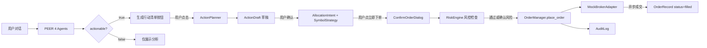

## wealthpilot

> > WealthPilot 项目级 AI Agent 协作说明

# AGENTS.md

> WealthPilot 项目级 AI Agent 协作说明
> 当前版本：v3.6.0 | 最后更新：2026-05-13

本文件遵循 [AGENTS.md 开放标准](https://agents.md/)，为 AI 编程助手（Claude Code / Cursor / Cline 等）提供项目上下文与协作约定。

## 项目概述

WealthPilot 是 AI 驱动的个人投资决策工作台。本地运行，数据私有，帮助个人投资者从"凭直觉"过渡到"系统化决策"。

核心能力覆盖 5 种意图：
- PositionDecision：单标决策（买入/持有/减仓/止损/止盈）
- PortfolioReview：组合健康度全面评估
- AssetAllocation：资产配置方案生成
- PerformanceAnalysis：收益表现归因分析
- Education：投资知识科普 / 通用对话

## 当前架构（v3.2）

WealthPilot v3.2 是 Multi-Agent + Skills 协议架构，参考蚂蚁 agentUniverse PEER 模式与 Anthropic Skills 开放标准。v3.2 新增投资行动模块，实现从"AI 分析建议"到"用户确认下单"的完整闭环。

### PEER 4 Agent

| Agent | 职责 | 关键代码 |
|-------|------|---------|
| PlanningAgent | 意图识别 + Skill 选择 + 路由（position_single / position_multi / portfolio / general） | `backend/agents/planning_agent.py` |
| ExecutingAgent | 数据加载（持仓/纪律/投研/市场行情）+ 信号生成 + 市场数据多源 fallback（Futu/AV/Tiger）+ 新建仓分支（v3.4 M8,target_position=None+买入意图） | `backend/agents/executing_agent.py` |
| ExpressingAgent | LLM 流式输出（唯一 AsyncGenerator）+ actionable 硬规则判断 + 新建仓 prompt 模板（v3.4 M8,_CHAT_FORMAT_NEW_ENTRY） | `backend/agents/expressing_agent.py` |
| ReviewingAgent | 硬校验（必填字段/格式）+ LLM 评分（0-1）+ retry/fallback 决策 | `backend/agents/reviewing_agent.py` |

数据契约：`backend/agents/contracts.py`（PlanningOutput / ExecutionOutput / ExpressionOutput / ReviewOutput）
类型适配：`backend/agents/adapters.py`（Tool Output → 业务对象转换）

#### Actionable 判断（ExpressingAgent）

ExpressingAgent 在流式输出完成后，基于 `structured_payload.decisionType` 判断是否可生成行动清单：
- `decisionType ∈ {buy_init, buy_more, trim, exit}` → `actionable=true`，前端显示"生成行动清单"按钮
- 其他 decisionType → `actionable=false`，按钮不出现

### 12 个原子能力 Skill

原子 Skill（10 个）：
- 数据获取：`wp-fetch-holdings` / `wp-fetch-research` / `wp-check-discipline`
- 知识检索：`wp-retrieve-principles`（v3.6 新增，检索投资纪律/风格/配置原则）
- 计算分析：`wp-calc-allocation-deviation` / `wp-generate-signals` / `wp-propose-allocation`
- LLM 推理：`wp-reasoning`（参数化 prompt 模板）
- 输出规范：`wp-citation-rules` / `wp-output-validator`

组合 Skill（1 个）：
- `wp-load-context`（封装 data_loader.load 装配逻辑，含 v3.6 RAG 第 7a/7b 步）

旁路 Skill（1 个）：
- `wp-action-planner`（不在 PEER 主链路上，由用户点击"生成行动清单"按钮触发）

#### 知识检索 Skill 语义二分法（v3.6）

| Skill | 语义边界 | 数据源 |
|-------|---------|--------|
| `wp-fetch-research` | 标的相关投研（"这个标的怎么样"） | 联网搜索 + 盈米 MCP + 本地投研卡 + 知识库 RAG |
| `wp-retrieve-principles` | 用户原则（"我的约束是什么"） | 知识库 RAG（纪律 + 风格 + 配置原则） |

代码位置：`skills/wp-*/SKILL.md`

#### wp-action-planner 详解

- **角色**：旁路调用，用户点击按钮 → 前端调 `/api/action/drafts/generate` → 后端调 ActionPlanner
- **输入**：对话上下文 + expressing_output（含 decisionType / recommendedAction / target_position / current_price / estimated_shares）
- **输出**：ActionListDraft（symbol_strategies[] / allocation_intents[] / risk_notes[] / missing_fields[]）
- **推算规则**（PRD v0.6 "积极推算"模式）：
  - quantity：从目标仓位% + estimated_shares 反算具体股数
  - limit_price：对话有明确限价用对话值；无明确限价用 current_price 兜底；current_price 未知才放 missing_fields
  - value_sources：每个推算字段标注依据
- **代码位置**：`backend/services/action/action_planner.py`

### 投资行动模块架构

三层状态机（从粗到细）：

```
AllocationIntent（组合级调整意图）
  ├── SymbolStrategy（单标的执行策略）1:N
  │     ├── OrderRecord（券商订单）1:N
  │     │     状态: created → submitted_to_broker → filled/rejected/cancelled
  │     │     MockBrokerAdapter 异步 5s 模拟成交
  │     └── cumulative_filled_quantity 自动回写
  └── status: active ↔ paused → completed | discarded
```

核心组件：

| 组件 | 职责 | 代码位置 |
|------|------|---------|
| OrderManager | 草稿 CRUD + 策略暂停/恢复/作废 + 订单创建/提交/状态同步 | `backend/services/action/order_manager.py` |
| RiskEngine | 下单前风控检查（3 条规则） | `backend/services/action/risk_engine.py` |
| BrokerAdapter | 券商抽象接口（place_order / get_order_status） | `backend/services/action/brokers/base.py` |
| TigerBrokerAdapter | Tiger 老虎证券（美股+港股 LIMIT 单,v3.4） | `backend/services/action/brokers/tiger.py` |
| MockBrokerAdapter | Mock 券商（异步 5s 成交，用于开发/演示） | `backend/services/action/brokers/mock.py` |
| CredentialProvider | 凭证管理抽象层（Keyring / InMemory,v3.4） | `backend/services/action/brokers/credentials.py` |
| OrderPoller | 订单状态后台轮询（3-5s 间隔,v3.4） | `backend/services/action/order_poller.py` |
| StateMachine | 状态流转校验（draft/strategy/order 三层独立） | `backend/services/action/state_machine.py` |
| AuditLog | 审计日志（append-only，含 ip_address / user_agent） | `backend/services/action/models.py` |

RiskEngine 三条规则：
1. 单笔金额占总资产 >5% → warning（需文字确认"我已知晓风险并坚持下单"）
2. 操作后单标的持仓占比 >40% → warning（卖出操作跳过此检查）
3. 纪律违反（复用 wp-check-discipline 简化版）→ warning

### 端到端数据流



## 技术栈

### 前端
- React 19 + Vite + TypeScript
- Tailwind CSS v4（`index.css` @theme 注册 Ocean 色系）
- Radix UI（Dialog）+ lucide-react 图标
- SSE 流式消费（fetch + ReadableStream）

### 后端
- FastAPI + SQLAlchemy + SQLite
- OpenAI SDK（GPT-4.1 主模型 + GPT-4.1-mini 评分/ActionPlanner 模型）
- Anthropic Skills 协议（12 个 SKILL.md）
- MCP 协议（盈米基金诊断 MCP 接入）
- 市场数据多源：Futu OpenD（optional）/ Alpha Vantage / Tiger OpenAPI

### 评测
- 18 个 yaml 用例（5 意图覆盖）
- L1（intent）/ L2（决策质量）/ L3（端到端）三层评测
- HTML 报告生成

## 目录结构（关键路径）

```
backend/
  agents/              PEER 4 Agent + 数据契约 + Adapter
    contracts.py       4 个 dataclass（A2A 字段对齐）
    planning_agent.py  意图识别 + Skill Selector
    executing_agent.py 数据加载 + 信号 + 纪律 + 市场数据（Futu optional）
    expressing_agent.py LLM 流式输出 + actionable 判断
    reviewing_agent.py 硬校验 + LLM 评分
    adapters.py        Tool Output → 业务对象转换
  skills/              SkillsLoader + invoke
  graph/               Tool Layer + LangGraph + DecisionValidator
    tools.py           15 个 Tool 注册（call_tool 统一入口）
  services/
    decision_service.py    主入口（委托 v3 路径 + 共享辅助函数）
    decision_service_v3.py PEER 4 Agent 协作链路（SSE 流式输出）
    action/                投资行动模块
      action_planner.py    ActionPlanner Skill（行动清单推算）
      order_manager.py     OrderManager（草稿/策略/订单 CRUD）
      risk_engine.py       RiskEngine（3 条风控规则）
      state_machine.py     三层状态机校验
      models.py            ORM 模型（5 张表）
      brokers/             券商适配层
        base.py            BrokerAdapter ABC
        mock.py            MockBrokerAdapter
  market_data/           市场数据适配层（Futu/AV/Tiger）
  mcp_client/            盈米 MCP 客户端
skills/                  12 个 SKILL.md
decision_engine/         核心引擎（data_loader / rule_engine / signal_engine / llm_engine）
app/                     ORM 模型 + 业务服务 + 汇率服务
frontend/
  src/pages/Action.tsx   投资行动页面（行动清单 + 行动记录）
  src/components/
    ConfirmOrderDialog.tsx 人工确认下单弹窗
    ActionDraftCard.tsx    行动清单草稿编辑弹窗
    Toast.tsx              Toast 通知组件
    shared/PageHeader.tsx  公共页面标题组件
docs/                    活文档（PRD + 设计规范 + 评测报告）
docs/archive/            历史归档文档
data/                    SQLite + 纪律手册
```

## 重要约定

### 跑评测
```bash
AV_DEV_MOCK=1 python scripts/m5_e2e_18_cases.py
```

### 重构硬底线
任何重构必须保证 m5 评测 18/18 不退化。这是项目的工程纪律——不容妥协。

### 启动开发环境
```bash
# 后端
/Users/songbin/opt/anaconda3/envs/wealthpilot/bin/uvicorn backend.main:app --port 8000 --host 127.0.0.1 --reload

# 前端
cd frontend && npm run dev
```

### 数据隐私
- 所有用户数据存于本地 SQLite（`data/wealthpilot.db`）
- 不向云端上传任何持仓 / 交易数据
- 投研观点通过本地投研卡 + 第三方公开数据源（盈米 MCP / 联网搜索）获取

### 外部依赖 optional 原则
所有外部数据源（Futu OpenD / Tiger / Alpha Vantage）必须当 optional 处理：
- 连接失败 → graceful degrade（数据为 None，流程继续）
- 不允许外部依赖阻断核心业务流

## 不要做的事

### 不要重新引入双轨制 feature flag
v3 PEER Agents 是唯一决策路径。v2.6 代码已在 M7.1.5 清理中删除。不要添加 `USE_V3_AGENTS` 或类似开关。

### 不要修改 decision_engine/ 核心引擎
`decision_engine/`（data_loader / rule_engine / signal_engine / llm_engine）是 v2.6 已稳定的底层——v3 Agents 通过 invoke_skill 调用它们，不直接修改。

### 不要绕开评测体系
任何代码改动必须跑 `m5_e2e_18_cases.py` 验证。直接改代码不跑评测是反模式。

### 不要在 ExecutingAgent 内部做硬编码业务逻辑
v3 设计是通过 `invoke_skill()` 调用——新增能力的正确做法是写新 Skill + Tool，不是在 Agent 内部加 if-else。

### 不要修改 SKILL.md 的 frontmatter 字段名
`type` / `entry_point` / `tool_name` 等字段名是 SkillsLoader 的契约——改字段名等于破坏 invoke 机制。

### 不要往 git 提交本地配置
`.claude/` / `.claire/` / `data/*.db` / `.env` 等已加入 .gitignore，不要 force add。

## 已知边界 / 技术债

| 问题 | 影响 | 计划 |
|------|------|------|
| symbol 字段不一致（LI vs 理想汽车） | ActionPlanner 有时输出 ticker、有时输出中文名，前端展示混乱 | v3.3 统一 symbol 规范 |
| 单标的决策没走 allocation_intent | PositionDecision 直接生成 SymbolStrategy，跳过意图层 | v3.3 数据模型重构 |
| 集中度风控买入场景未验证 | RiskEngine 集中度规则对卖出跳过已验证，买入触发未实测 | v3.3 补集成测试 |
| ActionPlanner LLM 异常兜底文案偏技术性 | 失败时显示"AI 生成失败，请手动填写: {error}" | v3.3 优化用户文案 |
| Futu 数据源无超时上限 | 预检 0.5s 够快，但 SDK 内部仍可能慢 | v3.3 加 asyncio.wait_for |
| tests/test_analyzer.py 失败 | v3.2 数据清理后 analyzer 对老 Portfolio 模型的测试断言失败 | v3.3 更新 analyzer 测试 |

## 知识层（v3.6 新增）

WealthPilot 从 v3.6 起引入私有知识库，采用 **File-as-Source-of-Truth** 架构：Markdown 文件是知识真相源，Chroma 向量库是索引层（可随时从 MD 文件重建），Git 管理知识演进。

### knowledge_base/ 目录结构

```
backend/knowledge_base/
├── investment_principles/    投资纪律手册（MD + RULES_CONFIG 双载体）
├── investment_style/         投资理念（价值主张、决策框架、纪律哲学）
├── allocation_principles/    资产配置原则（多元配置、再平衡、目标区间）
├── research_views/           投研观点（按标的子目录，MD 落盘）
└── _index/                   系统生成（Chroma 持久化 + file_index.json）
```

### RAG 检索流程

决策时通过 `data_loader.load()` 的两步 RAG 注入知识上下文：
- **第 7a 步**：`wp-fetch-research` 内部 RAG（`source_types=["research_views"]`，按标的过滤）
- **第 7b 步**：`wp-retrieve-principles`（`source_types=["investment_principles", "investment_style", "allocation_principles"]`）

general/Education 路由通过 `_execute_general()` 单独调用 `wp-retrieve-principles`（仅 allocation_principles），子意图关键词判断防止闲聊被知识污染。

知识库不可用时 graceful degrade：RAG 返回空列表，Education 走 `WEALTHPILOT_ALLOCATION_PRINCIPLES` 常量 fallback，决策流程不崩。

## 演进路径

### v3.2 ✅
- 投资行动模块完整实现（M1-M7）
- v2.6 死代码清理 + Streamlit 代码删除
- `USE_V3_AGENTS` feature flag 移除
- 视觉对齐设计规范 + 信息架构重构

### v3.3 ✅
- 资产配置模块融合到投资决策
- 用户画像导航名简化
- 组合级意图路由守门

### v3.4 ✅
- Tiger 老虎证券真实接入（TigerBrokerAdapter,美股+港股 LIMIT 单）
- Symbol 标准化（全系统统一 TICKER:MARKET 格式）
- 新建仓评估能力（美股,Alpha Vantage 数据驱动）
- 凭证管理 keyring 集成
- 订单状态轮询 + 孤儿订单扫描
- 前端：订单等待态 + 撤单按钮 + 部分成交展示

### v3.5 ✅
- 多会话管理与消息持久化
- 长对话记忆压缩（短期窗口 + 中期摘要）

### v3.6（当前版本）✅
- 知识层基础设施：Markdown 文件 + Chroma 向量库 + OpenAI Embedding
- `wp-retrieve-principles` Skill（原则类知识检索）
- 投研观点 MD 落盘 + RAG 语义召回
- 投资纪律手册迁移到 knowledge_base/
- 资产配置原则从硬编码迁移到知识库
- Education 意图支持 RAG 召回
- 决策输出附引用来源

### v3.6.1（近期）
- 投资理念 UI 输入框
- 时效类型标签 UI
- LLM rerank（召回质量优化）

### v4.0（中期）
- 高级 Memory（Mem0 用户偏好 / 知识图谱标的关系）
- 多 Agent 真实 A2A 通信（跨进程能力扩展）
- 投资纪律完整 11 条（当前简化版仅检查纪律 3）
- 接入 LangSmith 做结构化 trace + 可观测性

### 不在路线图（明确决策）
- Computer-Use / 自动下单：金融合规问题，AI 不应自动执行交易
- SaaS 化：违背"本地优先 / 数据私有"产品哲学

## 参考文档

- [README.md](./README.md)：用户视角的产品介绍 + 快速开始
- [CHANGELOG.md](./CHANGELOG.md)：完整版本变更历史（v2.0.0 → v3.2.0）
- [docs/](./docs/)：活文档（PRD + 设计规范 + 评测报告）
- [docs/archive/](./docs/archive/)：历史归档文档

---
> Source: [song-buaa/WealthPilot](https://github.com/song-buaa/WealthPilot) — distributed by [TomeVault](https://tomevault.io).
<!-- tomevault:4.0:gemini_md:2026-06-25 -->
