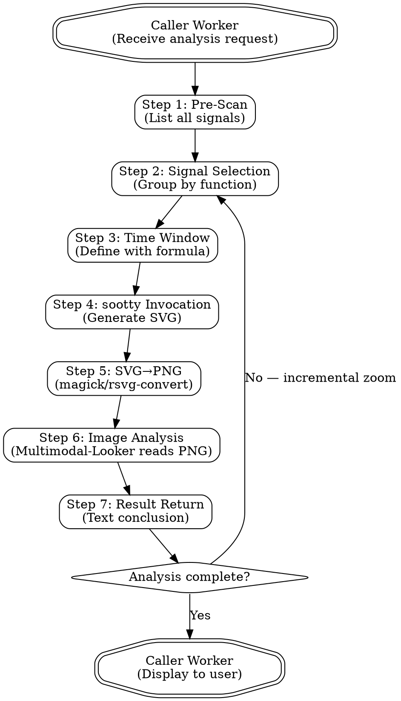

## waveform-view-skill

> 当非多模态大模型（DeepSeek V4 等）需要分析硬件仿真波形文件（VCD/EVCD/FST）中的关键信号与时序行为时使用此 Skill。通过编排 Multimodal-Looker → sootty → magick 管道，将波形转换为可视化的 PNG 波形图，由多模态 Agent 读图分析并返回文本结论。适用于 RTL 调试、信号时序检查、握手协议验证、总线行为分析等场景。


# Waveform View Skill

使非多模态大模型（如 DeepSeek V4、Claude 3.5 Sonnet 等）能够分析硬件仿真波形文件（waveform file）—— VCD、EVCD、FST 格式——通过调用多模态 Agent 读取由 sootty 生成的可视化波形图（waveform plot），返回结构化的文本分析结论。

**核心原则（Core Principle）：** 波形分析是一条严格的管道（pipeline）：Caller Worker 提出分析需求 → Multimodal-Looker Agent 执行 sootty + magick 生成 PNG → Multimodal-Looker 读图分析 → 返回文本结论给 Caller Worker。任何试图绕过可视化步骤、直接阅读原始 VCD 文本的行为都是无效的。

---

## Non-Negotiables

- **REQUIRED COMPANION AGENT:** 必须搭配 `multimodal-looker` Agent 使用（注意正确拼写：`multimodal-looker`，非 `mulitmodal-looker`）。本 Skill 不替代 `multimodal-looker`，而是定义 Caller Worker 与 Multimodal-Looker 之间的交互协议。
- **NO OTHER SKILLS:** 当此 Skill 适用时，仅使用 `waveform-view-skill` 外加 `multimodal-looker` Agent。不要加载其他 Skill（如 `pdf`、`academic-paper-writer-pro` 等）。所有波形分析的分组、管道编排、失败处理逻辑均已在本文档中定义。
- **sootty MUST be available:** sootty 必须作为 CLI 命令可用（`sootty --help` 应返回正常退出码 0）。不依赖 sootty 的 Python API（当前环境不支持）。
- **SVG→PNG 转换工具 MUST be available:** 优先使用 `magick`（ImageMagick 7）；如果 magick 不可用，fallback 为 `rsvg-convert`。如果两者均不可用，必须报告为阻塞性错误（blocker），不得继续。
- **对于大型波形文件（>100KB）：** 每次 sootty 调用必须指定信号列表（`-w`）和时间窗口（`-s`/`-e` 或 `-l`）。禁止在大型文件上运行无限制的 `sootty [file] -o`。
- **分析结论 MUST be text:** Multimodal-Looker 返回的结论必须是纯文本（text），不得返回图片路径作为最终分析结果。
- **单次 sootty 调用信号数量上限：** `-w` 列表中的信号数量不得超过 12 个（超过将导致波形图不可读）。
- **禁止绕过可视化管道：** 不得尝试直接读取 VCD/FST 原始文本作为分析依据。非多模态模型无法从 VCD 文本中理解波形行为。

## Skill Boundary

- **Allowed companion agent:** `multimodal-looker` 仅此一个。Multimodal-Looker 承担所有图像生成和图像读取任务。
- **Allowed tools:** `sootty`（CLI），`magick`（ImageMagick 7 CLI），`rsvg-convert`（fallback），`pywellen`（可选，仅 FST 格式需要）。
- **Forbidden:** 
  - 将此 Skill 视为独立分析工具（必须搭配 Multimodal-Looker）
  - 使用 sootty 的 Python API 调用方式
  - 绕过 sootty 直接使用其他波形查看器
  - 加载其他 Skill 替代本文档中已定义的管道逻辑
- **此 Skill 管辖的范围：** Caller Worker 与 Multimodal-Looker 之间的交互协议——包括任务描述格式、管道步骤顺序、失败处理策略、效率优化规则。
- **此 Skill 不管辖的范围：** sootty 的具体实现、VCD 文件格式解析、Multimodal-Looker 的图像识别能力本身、RTL 仿真流程。

## Required Outcome

默认的成功交付物为：

- 由 Multimodal-Looker 返回的文本分析结论，内容应包含：
  - 信号名称列表及各自行为描述
  - 关键时序事件（时钟边沿、信号跳变时刻、握手完成时刻等）
  - 异常行为识别（毛刺 glitch、时序违例 timing violation、协议错误 protocol error）
  - 分析问题的直接回答
- 中间产物（SVG 文件、PNG 文件）保存于 `/tmp/` 目录，以 `wave_` 为前缀

以下情况不属于成功完成：

- 仅返回 SVG 或 PNG 路径作为"分析结果"
- 分析结论仅表述"波形看起来正常"而未引用具体信号行为
- 在未检查 `sootty` 和 `magick` 可用性的情况下声称分析完成
- 直接阅读 VCD 文本并从中推断时序行为
- 跳过预扫描（pre-scan）步骤而猜测信号名称

## When to Use

当用户提出以下需求时，触发此 Skill：

**中文触发词（Chinese triggers）：**
- "分析波形" / "查看波形" / "看波形"
- "检查这个 VCD" / "打开这个 evcd" / "分析 FST"
- "检查信号时序" / "查看时序关系"
- "仿真波形分析" / "RTL 调试波形" / "调试这个波形"
- "看一下 clk 和 data 的关系" / "抓一下波形"
- "帮我看看这个信号的波形" / "波形debug"
- "验证握手协议" / "检查 AXI 时序"
- "这个信号有没有 glitch" / "找毛刺"

**English triggers:**
- "analyze waveform" / "debug waveform" / "view waveform"
- "inspect VCD" / "check VCD file" / "open evcd"
- "check signal timing" / "verify handshake protocol"
- "look at the waveform" / "show me the waveform"
- "is there a glitch on this signal" / "find timing violation"
- "compare signals" / "check bus behavior"

**不适用此 Skill 的情况（What NOT to use for）：**
- **逻辑综合（logic synthesis）或形式验证（formal verification）** —— 这些是 EDA 工具链问题，不是波形可视化问题
- **RTL 仿真执行本身** —— 此 Skill 不运行仿真，只分析已生成的波形文件
- **纯文本日志分析** —— 如果用户提供的是仿真日志（log file）而非波形文件，不适用此 Skill
- **电路原理图（schematic）分析** —— 波形图与电路图不同
- **功率分析（power analysis）或时序报告（timing report）** —— 需专门的 EDA 工具
- **单信号简单询问** —— 如用户仅问"VCD 里有哪些信号"，无需走完整管道；仅需预扫描即可

## Portability

- 本 Skill 不假设任何特定的硬件平台或操作系统。
- sootty 命令假定为全局可用的 CLI 命令（通过 `nix`、`pip`、或系统包管理器安装）。
- `magick`（ImageMagick 7）和 `rsvg-convert` 任选其一即可；文档中的命令示例应同时覆盖两者。
- `pywellen`（FST 格式支持）为可选项：仅在需要处理 FST 文件时才需检查。
- 所有中间输出（SVG、PNG）使用 `/tmp/` 目录，不依赖任何特定用户目录结构。
- 不假设 `multimodal-looker` 以外的任何自定义 Agent 存在。
- 示例波形文件路径引用 sootty 官方仓库的 `example/` 目录（https://github.com/Ben1152000/sootty），而非任何本机路径。

## Workflow Model

本 Skill 定义三个角色（roles）：

### 角色 1: Caller Worker（调用方主 Worker）

调用方 Worker（如 Sisyphus、Claude Code 主 Agent）的职责：

- 接收用户的分析需求并识别波形分析场景
- 传递以下信息给 Multimodal-Looker：
  - 波形文件路径（waveform file path）
  - 分析问题描述（analysis question）—— 具体要查什么
  - 建议的信号列表（suggested signal list）—— 如果用户已指定
  - 建议的时间范围（suggested time range）—— 如果用户已指定
- 接收 Multimodal-Looker 返回的文本分析结论
- 将结论以人类可读的格式呈现给用户

### 角色 2: Multimodal-Looker Agent（多模态观察 Agent）

Multimodal-Looker（只读 Agent）是本 Skill 的执行核心，负责：

- 执行波形预扫描（signal pre-scan）获取信号列表
- 选择合适的信号和时间窗口
- 通过 bash 工具执行 `sootty` CLI 命令生成 SVG
- 通过 bash 工具执行 `magick`（或 `rsvg-convert`）将 SVG 转换为 PNG
- 使用其多模态视觉能力读取 PNG 波形图
- 分析波形行为并返回文本结论

Multimodal-Looker 的约束：

- 只读 Agent，不修改任何源文件
- 必须使用 sootty CLI（非 Python API）
- 生成的中间文件放在 `/tmp/` 目录
- 每次 sootty 调用必须携带明确的分析问题

### 角色 3: sootty（CLI 工具）

sootty 是一个命令行工具，位于 https://github.com/Ben1152000/sootty ，负责：

- 读取 VCD、EVCD、FST 格式的波形文件
- 根据指定的信号列表和时间窗口生成 SVG 格式的波形图
- 提供 formula 语言用于精确定义时间窗口和断点

## Dispatch Rules

Caller Worker 与 Multimodal-Looker 之间的任务派发规则：

- **单次派发原则：** Caller Worker 一次派发一个分析任务给 Multimodal-Looker。不要在单次派发中混合多个无关的分析问题。
- **任务描述必须包含：**
  1. 波形文件路径（绝对路径）
  2. 具体的分析问题（不是"看看波形"，而是"检查 clk 和 data 的建立时间是否满足"）
  3. 已知的信号名称（如果有）
  4. 已知的关键时间点（如果有）
- **Multimodal-Looker 可以自行决策：** 信号选择、时间窗口大小、是否需要多轮缩放、使用哪个转换工具。Caller Worker 不应微观管理（micromanage）每一步。
- **并行分析：** 如果分析任务涉及多个信号组之间的时序关系，单个 Multimodal-Looker 内部可以通过分批调用来完成，无需 Caller Worker 多次派发。
- **失败重试：** 如果 Multimodal-Looker 报告管道中某一步失败（如 sootty 报错、PNG 转换失败），Caller Worker 应分析失败原因并调整参数后重新派发，而非放弃。

## Execution Flow



### Step 1: Pre-Scan — 信号预扫描（Signal Pre-Scan）

**目的：** 在用户未明确指定信号名称时，发现波形文件中的所有可用信号，避免盲目猜测信号名称导致的无效 sootty 调用。

**命令示例：**

```bash
# 方法 A: 使用不存在信号名触发错误输出（部分 sootty 版本会列出可用信号）
sootty example/CLA.vcd -w "nonexistent_signal" -o 2>&1 | head -30

# 方法 B: 读取 VCD 文件头部的 $var 声明
grep -E '\$var' example/CLA.vcd | head -50

# 方法 C: 对于大型文件，输出到临时文件再分析
sootty example/example3.vcd -w "clk" -l 5 -o > /dev/null 2>&1
# 观察 stderr 输出中的提示信息
```

**注意：** 预扫描步骤的具体方法取决于 sootty 版本和文件格式。如果上述方法 A 不生效（不输出信号列表），则使用方法 B 直接从 VCD 文本头部解析信号声明。VCD 文件头部包含 `$var` 声明行，格式为 `$var wire 1 ! signal_name $end`。

**成功标准：** 获得波形文件中所有可用信号的完整列表。

### Step 2: Signal Selection — 信号选择与分组（Signal Selection and Clustering）

**目的：** 根据分析需求选择合适的信号，按功能分组（每组 8-12 个信号），避免单次调用放入过多信号导致波形图不可读。

**分组策略：**

1. **时钟与复位组（Clock and Reset Group）：** `clk`, `rst_n`, `reset` 等基础信号 —— 几乎每次调用都需要
2. **握手协议组（Handshake Group）：** `req`, `ack`, `gnt`, `valid`, `ready` 等
3. **数据总线组（Data Bus Group）：** `data[7:0]`, `addr[15:0]`, `wdata`, `rdata` 等
4. **控制信号组（Control Group）：** `wr_en`, `rd_en`, `cs_n`, `mode`, `opcode` 等
5. **状态机信号组（State Machine Group）：** `state[3:0]`, `next_state`, `fsm_out` 等
6. **调试关注组（Debug Focus Group）：** 用户特别关注的异常信号

**注意事项：**
- 每次 sootty 调用的 `-w` 列表中信号数量 ≤ 12
- 时钟信号通常应包含在每一轮调用中，作为时间参考基准
- 涉及总线（bus）时，使用位宽表示法（如 `data[7:0]`）而非单独列出每一位

### Step 3: Time Window Definition — 时间窗口定义（Time Window Definition）

**目的：** 使用 sootty formula 语言精确定义分析的时间范围，避免渲染全量时间轴造成的资源浪费和视觉噪音。

**sootty Formula 语言基础：**

sootty 支持强大的 formula 语言用于精确指定时间窗口边界：

| 类别 | 操作符/表达式 | 说明 |
|------|--------------|------|
| 基本表达式 | `wire_name` | 信号名称（区分大小写） |
| 常量 | `const N` | 常数值 `N` |
| 时间 | `time N` | 时间点 `N` |
| 一元运算 | `~X`, `!X`, `-X` | 按位取反（bitwise NOT）、逻辑非（logical NOT）、取负（negation） |
| 算术运算 | `X + Y`, `X - Y`, `X % Y` | 加、减、取模 |
| 移位运算 | `X << Y`, `X >> Y` | 左移、右移 |
| 按位运算 | `X & Y`, `X \| Y`, `X ^ Y` | 按位与、或、异或 |
| 关系运算 | `X == Y`, `X != Y`, `X > Y`, `X >= Y`, `X < Y`, `X <= Y` | 等于、不等于、大于、大于等于、小于、小于等于 |
| 逻辑运算 | `X && Y`, `X \|\| Y` | 逻辑与、逻辑或 |
| 时序操作 | `from X`, `after X`, `until X`, `before X` | 从/之后/直到/之前某事件 |
| 时序操作 | `next X`, `N next X`, `prev X`, `N prev X` | 下一次/前一次某事件 |
| 时序操作 | `acc X` | 累积匹配 |

**运算符优先级（precedence）：** `()` → 一元运算 → `%` → `+` `-` → `<<` `>>` → `&` `|` `^` → 关系运算 → `&&` `||`

**窗口语义：** 时间窗口为 `[start, end)` —— 起始边界包含，结束边界不包含。

**关键约束：** `-l`（长度）和 `-e`（结束位置）互斥，不能同时使用。

**命令示例：**

```bash
# 使用绝对时间边界
sootty example/CLA.vcd -w "clk,a,b,sum" -s "time 100" -e "time 200" -o > /tmp/wave.svg

# 使用事件驱动的时间窗口（时钟上升沿触发）
sootty example/CLA.vcd -w "clk,req,ack,data[7:0]" \
  -s "after req && ack" -e "before timeout" -o > /tmp/wave.svg

# 使用周期数长度
sootty example/example1.vcd -w "clk,rst_n,counter[3:0]" -l 50 -o > /tmp/wave.svg

# 使用断点定位关键事件
sootty example/example2.vcd -w "clk,state[2:0]" \
  -b "state == const 5" --btable -o > /tmp/wave.svg
```

**注意事项：**
- Formula 中的信号名称必须精确匹配波形文件中的名称（区分大小写）
- 优先使用事件驱动的 formula（如 `after req && ack`）而非绝对时间，因为事件驱动更具语义意义
- 对于长时间仿真，始终使用 `-s`/`-e` 或 `-l` 限制范围；不加限制的 `sootty [file] -o` 可能导致数 MB 的 SVG 输出

### Step 4: sootty Invocation — 生成 SVG 波形图（Generate SVG Waveform）

**目的：** 使用 sootty CLI 将指定的波形片段转换为 SVG 格式的波形图。

**完整 CLI 参数清单（与 `sootty --help` 一致）：**

| 参数 | 长格式 | 说明 |
|------|--------|------|
| `-h` | `--help` | 显示帮助信息 |
| `-s FORMULA` | `--start FORMULA` | 时间窗口起始（formula 表达式） |
| `-e FORMULA` | `--end FORMULA` | 时间窗口结束（formula 表达式） |
| `-b FORMULA` | `--break FORMULA` | 高亮断点位置（formula 表达式） |
| `--btable` | | 打印断点表到标准输出 |
| `-l LENGTH` | `--length LENGTH` | 显示的周期数 |
| `-o` | `--output` | 将 SVG 输出到标准输出（stdout） |
| `-w LIST` | `--wires LIST` | 逗号分隔的信号列表 |
| `-r RADIX` | `--radix RADIX` | 数据显示进制（2-36） |
| `-S SAVENAME` | `--save SAVENAME` | 保存当前查询到 .txt 文件 |
| `-R SAVENAME` | `--reload SAVENAME` | 加载已保存的查询 |
| （位置参数） | `FILENAME` | 输入的 .vcd / .evcd / .fst 文件 |

**命令示例：**

```bash
# 基础调用：指定信号 + 周期数 + 输出到文件
sootty example/CLA.vcd -w "clk,a,b,sum,cout" -l 40 -o > /tmp/wave_basic.svg

# 完整调用：时间窗口 + 信号 + 进制 + 输出
sootty example/example1.vcd -w "clk,rst_n,counter[3:0],enable" \
  -s "time 50" -e "time 150" -r 10 -o > /tmp/wave_full.svg

# 断点高亮调用：标记状态转换
sootty example/example2.vcd -w "clk,state[2:0],output" \
  -b "state == const 3" -l 30 -o > /tmp/wave_bp.svg

# 保存查询供后续复用
sootty example/CLA.vcd -w "clk,a,b,sum" -l 50 -o -S my_query > /tmp/wave.svg

# 重新加载已保存的查询
sootty example/CLA.vcd -R my_query -o > /tmp/wave_reloaded.svg
```

**注意事项：**
- `-o` 标志位将 SVG 输出到 stdout；必须使用 shell 重定向（`>`）写入文件
- 不要使用 `-o` 时不加 `>` 重定向（SVG 内容会打印到终端，无法被后续步骤使用）
- `-r` 参数指定数据显示的进制（默认二进制），适用于总线信号的可读性改善
- 对于 EVCD 文件，sootty 原生支持；对于 FST 文件，需要 `pywellen`（`pip install pywellen`）
- `-S` 和 `-R` 可保存/加载查询参数，适用于需要反复分析同一组信号的场景

### Step 5: SVG→PNG Conversion — SVG 转 PNG（SVG to PNG Conversion）

**目的：** 将 sootty 生成的 SVG 矢量图转换为 PNG 位图，供 Multimodal-Looker 读取。SVG 是矢量格式，多模态模型对 PNG 的识别效果通常优于直接读取 SVG。

**主方案（Primary）：ImageMagick 7（`magick`）**

```bash
# 基础转换
magick /tmp/wave.svg /tmp/wave.png

# 带分辨率的转换（提高清晰度）
magick -density 150 /tmp/wave.svg /tmp/wave.png

# 对于大型 SVG，设置尺寸上限避免内存溢出
magick -density 150 /tmp/wave.svg -resize 2400x /tmp/wave.png
```

**备用方案（Fallback）：`rsvg-convert`（librsvg）**

```bash
# 基础转换
rsvg-convert -o /tmp/wave.png /tmp/wave.svg

# 指定输出宽度
rsvg-convert -w 2400 -o /tmp/wave.png /tmp/wave.svg
```

**工具可用性检查（在管道开始前执行）：**

```bash
# 检查 magick
which magick && magick --version | head -1

# 检查 rsvg-convert（仅当 magick 不可用时）
which rsvg-convert

# 如果两者均不存在，报告 BLOCKER 并停止管道
```

**注意事项：**
- 优先使用 `magick`（ImageMagick 7），因其功能更全面、输出质量更稳定
- 如果两者均不可用，必须报告为阻塞性错误（blocker），向 Caller Worker 返回 SVG 路径并建议用户手动打开
- 生成的 PNG 文件应保存在 `/tmp/` 目录，文件名以 `wave_` 为前缀
- 如果在容器或受限环境中运行，`magick` 的安全策略（`policy.xml`）可能限制 SVG→PNG 转换；如遇 `not authorized` 错误，切换到 `rsvg-convert`

### Step 6: Image Analysis — 图像分析（Image Analysis by Multimodal-Looker）

**目的：** Multimodal-Looker 读取 PNG 波形图，根据分析问题对波形进行语义级别分析。

**Multimodal-Looker 的分析维度：**

1. **时序关系（Timing Relationship）：** 时钟边沿与数据变化的时序对齐、建立时间（setup time）/保持时间（hold time）的相对关系
2. **信号跳变（Signal Transitions）：** 信号在何时从 0→1 或 1→0，变化的频率和模式
3. **协议行为（Protocol Behavior）：** 握手协议（handshake）的正确性（如 req 和 ack 的先后关系）、总线协议（bus protocol）的合规性
4. **异常检测（Anomaly Detection）：** 毛刺（glitch）、意外的信号翻转、不符合预期的状态序列
5. **数据一致性（Data Consistency）：** 总线数据的值与控制信号的对应关系是否正确

**Multimodal-Looker 接收的任务描述格式（由 Caller Worker 或本 Skill 指令提供）：**

```
波形文件: /path/to/waveform.vcd
分析问题: 检查 clk 上升沿时 data[7:0] 是否稳定（setup/hold 是否满足）
关注信号: clk, data[7:0], valid, ready
时间范围: 仿真时刻 100ns 到 500ns
附加说明: 重点关注 valid 为高时的数据传输周期
```

**注意事项：**
- Multimodal-Looker 必须具体描述观察到的信号行为（如 "在 clk 第 15 个上升沿处，data 在时钟边沿后 3ns 发生变化"），而非笼统判断（如 "时序看起来正常"）
- 如果 PNG 图像质量不足以判断细节（如信号过多导致密集不可辨），应返回 INCONCLUSIVE 并建议缩小信号列表或时间范围
- 分析结论应直接回答分析问题，不应引入与问题无关的信号讨论

### Step 7: Result Return — 结果返回（Result Return to Caller Worker）

**目的：** Multimodal-Looker 将分析结论以结构化文本格式返回给 Caller Worker。

**返回内容规范：**

1. **分析摘要（Executive Summary）：** 1-2 句总结，直接回答分析问题
2. **信号行为描述（Signal Behavior）：** 按信号逐一说明观察到的行为
3. **关键时序事件（Key Timing Events）：** 重要时刻的精确描述
4. **异常发现（Anomalies Found）：** 如有异常，详细说明异常类型和发生位置
5. **分析置信度（Confidence Level）：** High（图像清晰，行为明确）/ Medium（可识别但有模糊区域）/ Low（图像质量不足，建议缩小范围重试）
6. **后续建议（Next Steps）：** 如果置信度为 Medium 或 Low，建议下一轮分析的方向（缩小时间窗口、减少信号数量、提高分辨率等）

**返回格式示例：**

```
[分析摘要] clk 上升沿时 data[7:0] 在 valid=1 期间稳定保持，未观察到 setup/hold 违例。

[信号行为]
- clk: 周期 10ns，占空比 50%，无异常
- data[7:0]: 在 valid=1 的时钟上升沿前 2ns 稳定，在时钟上升沿后保持 5ns
- valid: 在第 3、7、12 个时钟周期为高，持续 1 个周期
- ready: 持续为高，从端始终就绪

[关键时序] 无违例。数据建立时间约 2ns，保持时间约 5ns。

[异常发现] 无。所有数据传输周期行为正常。

[置信度] High

[后续建议] 如需进一步验证，可检查 valid 和 ready 的握手机制在更长时间范围内的行为。
```

**注意事项：**
- 如果分析置信度为 Low，Caller Worker 应自动触发增量缩放策略（缩小时间窗口或减少信号数量后重新派发）
- 绝对不要仅返回"波形看起来正常"而不附带任何具体行为描述
- 如果发现异常，应标注异常发生的大致位置（在波形图中的相对位置），便于下一轮精确定位

---

## Efficiency Strategies

以下策略从 AI Agent 的执行效率角度出发，旨在最小化 sootty 调用次数、减少 Multimodal-Looker 往返轮次、提升分析精度。

### 策略 1: 信号预扫描（Pre-Scan Strategy）

首次分析一个波形文件时，先执行一轮极简扫描获取完整信号列表。不要基于名称猜测或用户口述而直接构造 `-w` 参数。

**操作方式：**
```bash
# 使用 grep 解析 VCD 头部的 $var 声明，获取所有信号名
grep -oP '\$var\s+\w+\s+\d+\s+\S+\s+(\S+)' waveform.vcd | awk '{print $NF}'
```

**效率原理：** 一次解析 ≈ 零成本；盲猜失败 → 浪费一次完整的 sootty 调用（解析 + 渲染）。

### 策略 2: 信号簇分组（Signal Clustering）

按功能将相关信号分为一簇（cluster），每簇 8-12 个信号，一次 sootty 调用处理一簇。单次调用信号过多（>12）将导致波形图不可读，信号过少（<3）则浪费调用次数。

**分组示例：**
- **握手协议簇：** `clk, rst_n, req, ack, gnt, valid, ready`（7 个信号）
- **AXI 写通道簇：** `clk, awvalid, awready, awaddr[31:0], wvalid, wready, wdata[31:0], wstrb[3:0]`（8 个信号，含 2 个总线）
- **状态机调试簇：** `clk, rst_n, state[3:0], next_state[3:0], input_sig, output_sig`（6 个信号）

**效率原理：** 分组避免了一张图上画 50 条线造成的完全不可读；合理的分组使每张图都有独立的分析价值。

### 策略 3: 时间窗口精确化（Precise Time Windowing）

始终使用 formula 语言指定精确的时间边界，而非依赖 sootty 的默认行为渲染全量时间轴。

**精确化原则：**
- 如果有已知的时间边界（如仿真时间 100ns-500ns），使用 `-s "time 100" -e "time 500"`
- 如果有已知的事件边界（如请求信号有效后），使用 `-s "after req && ack" -e "before timeout"`
- 如果没有任何参考点，先使用短周期数（如 `-l 50`）获得概览

**效率原理：** 全量渲染长波形 = 巨大的 SVG（可能数 MB）+ 无用的视觉信息 + 长转换时间。精确的时间窗口 ≈ 小而精准的 SVG + 快速转换 + 清晰的波形图。

### 策略 4: 增量缩放（Incremental Zoom）

采用"宽范围概览 → 发现异常 → 精准缩放"的 2-3 轮迭代策略，而非一开始就渲染极高精度的时间窗口。

**操作模式：**
1. **Round 1（概览，Wide Scan）：** 多信号（8-12 个）、中长时间窗口（-l 100~200），获取全局视角
2. **Round 2（定位，Pinpoint）：** 发现异常点后，缩小到异常区域（-l 20~50），减少到关键信号（3-6 个）
3. **Round 3（细节，Detail Zoom）：** 如需极精确分析，使用断点（`-b`）高亮关键事件，最小化信号列表

**效率原理：** 直接高精度渲染 = 可能渲染了无关区域；增量缩放 = 每轮调用都有明确目的，总调用次数可控。

### 策略 5: 缓存复用（Cache Awareness）

对于同一波形文件 + 同一组信号 + 同一时间窗口的重复请求，复用已生成的 PNG 文件，避免重复调用 sootty + magick。

**操作方式：**
- 使用固定的文件命名约定：`/tmp/wave_<file_hash>_<signal_hash>_<window_hash>.png`
- 在生成 PNG 之前检查同名文件是否已存在
- 如果 Multimodal-Looker 需要重新查看同一图像（如确认某个细节），无需重新生成 PNG

**效率原理：** sootty 解析大型波形文件是最耗时的步骤；缓存复用避免了不必要的重复解析和转换。

### 策略 6: 分层分析（Hierarchical Analysis）

分析按层级递进：控制流（control flow）→ 数据流（data flow）→ 细节验证（detail verification）。

**分析层级：**
1. **第一层 控制流：** 时钟（clk）、复位（rst_n）、握手协议（req/ack/valid/ready）—— 确认系统基本运作
2. **第二层 数据流：** 数据总线（data bus）、地址总线（addr bus）、控制寄存器 —— 确认数据传输正确性
3. **第三层 细节验证：** 关键路径信号、状态机跳转、边界条件 —— 精准定位问题

**效率原理：** 层级递进避免了在握手协议都未确立时就深入分析数据总线内容（可能完全无效）。

### 策略 7: 最少调用原则（Minimal Invocation Principle）

**每一次 sootty 调用必须携带明确的分析问题。** 禁止无目的的"看看波形长什么样"调用。

**有效调用示例：**
- "检查 clk 上升沿时 data 是否稳定"
- "验证 req 上升后 2 个周期内 ack 是否会响应"
- "查找 state 从 IDLE 跳到 ERROR 的触发条件"

**无效调用示例：**
- "先生成个波形图看看"（无明确分析目标）
- "把所有信号都画出来"（信号过多 + 无目标）
- "从第 0 时刻开始渲染全部"（无时间窗口 + 无分析目标）

**效率原理：** 无目标的调用 = 浪费的 tokens + 无意义的分析结论 + 潜在的重新调用。每次调用必须有明确的"要回答什么问题"。

### 策略 8: 并行请求合并（Request Batching）

当分析多个独立信号组（如 AXI 读通道和写通道可以独立分析），将这些请求合并到单次 Multimodal-Looker 派发中，由 Multimodal-Looker 内部顺序执行。

**操作方式：**
- Caller Worker 将多个相关分析问题打包为一次任务派发
- Multimodal-Looker 内部依次执行每个子任务（生成 PNG → 读图 → 记录结论）
- 最后将所有子任务结论汇总为一份报告返回

**效率原理：** 减少 Caller Worker 与 Multimodal-Looker 之间的往返次数（round-trips），每次往返都有通信开销。

### 策略 9: 查询保存与复用（Query Save and Reload）

对于需要反复分析同一组信号但不同时间窗口的场景，使用 `-S` 保存查询参数，后续使用 `-R` 重新加载。

```bash
# 首次：保存查询
sootty example/CLA.vcd -w "clk,a,b,sum,cout" -l 50 -o -S cla_query > /tmp/wave1.svg

# 后续：加载查询，仅改变时间范围
sootty example/CLA.vcd -R cla_query -s "time 200" -e "time 300" -o > /tmp/wave2.svg
```

**效率原理：** 避免每次手动重新输入相同的 `-w` 列表，减少拼写错误和信号遗漏。

### 策略 10: 断点驱动调试（Breakpoint-Driven Debugging）

使用 `-b`（断点 formula）和 `--btable`（断点表）精确定位状态转换或关键事件，比手动在波形图上寻找更高效。

```bash
# 标记所有状态从 IDLE(0) 变为 BUSY(2) 的时刻
sootty example/example2.vcd -w "clk,state[2:0]" \
  -b "next state == const 2" --btable -l 50 -o > /tmp/wave_bp.svg
```

**效率原理：** 断点表提供了精确的事件时刻列表，Multimodal-Looker 可以快速验证断点位置与波形图的一致性。

---

## Common Failure Modes

以下是常见的失败场景（failure modes）及应对策略。Multimodal-Looker 在执行管道时应主动检查并处理这些情况。

### 失败 1: VCD 文件损坏或格式不正确（Corrupted or Invalid VCD File）

**症状：** sootty 返回解析错误（parse error），如 `Error: unable to parse VCD header` 或 `Error: unexpected token at line N`。

**对策：**
```bash
# 检查文件是否为有效的 VCD/EVCD
file waveform.vcd
# 检查 VCD 头部声明
head -10 waveform.vcd | grep -E '\$date|\$version|\$timescale'
```

如果文件确实损坏，向 Caller Worker 报告具体错误信息，建议用户重新生成波形文件。

### 失败 2: 请求的信号名称不存在（Requested Signal Does Not Exist）

**症状：** sootty 报错 `Error: wire 'signal_name' not found in the waveform file`。

**对策：** 
1. 执行预扫描（Step 1）获取实际信号名称列表
2. 将用户指定的名称与实际名称对照（检查大小写、下划线、位宽语法差异）
3. 如果信号确实不存在，向 Caller Worker 返回实际可用的信号列表，建议替代信号

### 失败 3: 时间窗口超出波形实际范围（Time Window Exceeds Waveform Range）

**症状：** sootty 将时间窗口 clamp 到文件的实际时间范围（start 截断到 0，end 截断到文件最大时间）。SVG 输出可能生成成功，但显示的波形范围与预期不符。

**对策：**
1. 检查 SVG 输出中的时间轴标注，确认实际渲染的时间范围
2. 如果范围被截断，调整 `-s`/`-e` formula 使其落在文件实际范围内
3. 向 Caller Worker 报告实际可用的时间范围

### 失败 4: SVG 输出过大（Oversized SVG Output）

**症状：** 生成的 SVG 文件超过 10MB，magick 转换超时或内存溢出。

**对策：**
1. 检查是否使用了过大的 `-l` 值（如 `-l 10000`）或未指定时间窗口
2. 减少周期数（`-l 100` 或更小）
3. 减少信号数量（最多 12 个）
4. 拆分长波形为多个短窗口分段分析

### 失败 5: PNG 不可读 — 信号过多导致图像拥挤（Unreadable PNG — Signal Overcrowding）

**症状：** Multimodal-Looker 报告 PNG 图像中波形线过于密集，无法区分单个信号的行为。

**对策：**
1. 将 `-w` 列表缩减到 8 个或更少信号
2. 按功能分组重新调用（如握手信号一组、数据总线一组）
3. 增大 PNG 输出分辨率（`magick -density 200`）

### 失败 6: magick 和 rsvg-convert 均不可用（Neither Converter Available）

**症状：** `which magick` 和 `which rsvg-convert` 均返回空。

**对策：**
1. 报告为 BLOCKER（阻塞性错误）
2. 向 Caller Worker 返回 sootty 生成的 SVG 文件路径
3. 建议用户：安装 ImageMagick（`apt install imagemagick` 或 `brew install imagemagick`）或 librsvg（`apt install librsvg2-bin`），或手动用浏览器打开 SVG 文件
4. 在未解决转换工具问题前，不得继续管道

### 失败 7: FST 文件但 pywellen 未安装（FST File without pywellen）

**症状：** sootty 处理 `.fst` 文件时报错 `Error: pywellen is required for FST support`。

**对策：**
1. 检查 pywellen 是否已安装：`python3 -c "import pywellen" 2>&1`
2. 如果未安装，向 Caller Worker 建议：
   - 安装 pywellen：`pip install pywellen`
   - 或将 FST 文件转换为 VCD 格式（使用 GTKWave 等工具：`fst2vcd input.fst output.vcd`）

### 失败 8: SVG 输出未正确重定向到文件（SVG Output Not Redirected to File）

**症状：** 使用了 `-o` 标志位但未使用 shell 重定向（`>`），SVG 内容输出到了终端。

**对策：**
1. 修正命令格式：`sootty [file] -w "..." -l N -o > /tmp/wave.svg`
2. 确保 `-o` 和 `>` 同时使用（`-o` 负责将 SVG 输出到 stdout，`>` 负责将 stdout 写入文件）

### 失败 9: 分析结论无实质内容（Analysis Conclusion Has No Substance）

**症状：** Multimodal-Looker 返回"波形正常"但不提供任何具体信号行为描述或时序数据。

**对策：**
1. 向 Multimodal-Looker 重新派发，要求提供具体的信号跳变时刻、时序关系数值、协议状态序列
2. 如果仍然无法提供，则可能图像质量不足（回到失败 5 的处理流程）
3. 确保分析结论包含至少 3 个具体的观察点

---

## Rationalization Table

下表列出了 AI Agent 在波形分析中可能产生的常见借口（excuse）与现实（reality）的对照。用于 Caller Worker 在审查 Multimodal-Looker 返回结果时识别 AI Slop（AI 生成的无效输出）。

| Excuse（借口） | Reality（现实） |
|----------------|-----------------|
| "我可以直接阅读 VCD 文本描述波形行为"（I can describe the waveform from raw VCD text） | VCD 文本对非多模态模型是不可读的数字序列；可视化（visualization）是唯一可靠的分析路径。任何声称能从 VCD 文本直接理解波形的结论都是幻觉（hallucination）。 |
| "一次 sootty 调用把 50 个信号都画上就行"（One sootty call with all 50 signals is fine） | 12 个信号以上波形图将变得拥挤不可读。每条线的垂直空间不足，Multimodal-Looker 无法区分信号。必须分组（cluster）。 |
| "从时间 0 开始渲染整个波形"（Just render the entire waveform from time 0） | 时间窗口必须精确。全量渲染浪费 sootty 计算时间、浪费 magick 转换时间、浪费 Multimodal-Looker 的图像 tokens，且波形细节在全局视图下不可辨认。 |
| "不需要预扫描，信号名猜就行"（I don't need to pre-scan signals, I can guess names） | 猜测信号名浪费一次完整的 sootty 调用。预扫描只需 grep 解析 VCD 头部的 `$var` 声明行，成本几乎为零。 |
| "magick 没有就算了，用 rsvg-convert"（magick not available? Just use rsvg-convert） | Fallback 是可接受的，但前提是 rsvg-convert 确实存在。必须检查。如果两者都不存在，必须报告为 blocker。 |
| "分析结论可以是'信号看起来正常'"（The analysis is 'signals look normal'） | 必须引用具体信号行为描述。"正常"是无意义的结论。应报告：具体信号在哪些时刻发生了何种变化、时序关系数值。 |
| "我用 sootty Python API 可以更好地控制"（I can use sootty's Python API for better control） | 当前环境中 sootty Python API 不可用。CLI 是唯一经过验证的调用方式。使用 Python API 的尝试会失败。 |
| "FST 和 VCD 一样处理就行"（FST files work the same as VCD） | FST 是二进制格式，需要 pywellen 支持。缺少 pywellen 时，sootty 无法解析 FST 文件。需先安装 pywellen 或转换格式。 |
| "SVG 转 PNG 随便怎么转都行"（Just convert SVG to PNG any way possible） | 已验证的转换路径是 sootty → SVG → magick/rsvg-convert → PNG。其他转换工具（如 Inkscape、浏览器截图）未经测试，不应在管道中使用。 |
| "每个信号单独调用一次更精确"（One call per signal is more precise） | 违反最少调用原则（Minimal Invocation Principle）。信号之间需要放在同一张图上才能分析时序关系。分离调用无法观察信号间的时序依赖。 |
| "长波形没关系，magick 会自动处理"（Long waveform is fine, magick will handle it） | 超大 SVG（>10MB）会导致 magick 转换超时或内存溢出。必须通过 `-l` 或 `-s`/`-e` 限制时间范围。 |
| "Multimodal-Looker 看波形图就行了，不需要具体问题"（Multimodal-Looker just needs to see the waveform, no specific question needed） | 没有具体分析问题的波形查看是盲目的。Multimodal-Looker 不知道要看什么，可能返回无关信息或遗漏关键细节。 |

---

## Red Flags

以下行为标志（red flags）表示管道执行中出现了严重偏差，应当立即停止并修正。Caller Worker 在审查 Multimodal-Looker 的行为或 Multimodal-Looker 在自查时应警惕这些信号。

- **绕过 Multimodal-Looker：** Caller Worker 试图直接阅读 VCD 文本或调用 sootty 而不派发给 Multimodal-Looker → 立即停止。非多模态模型无法从 VCD 文本获得波形理解。
- **大型文件上的无限制 sootty 调用：** 对 >100KB 的波形文件执行 `sootty [file] -o` 而不加 `-w` 和 `-s`/`-e`/`-l` → 立即停止。可能导致巨大的 SVG 输出和系统资源耗竭。
- **未指定时间窗口的长波形渲染：** 未使用 `-s`/`-e` 或 `-l` 参数 → 立即停止。全量渲染既无效率也无分析价值。
- **分析结论无具体信号行为：** 结论不含任何信号名称、跳变时刻、时序关系描述 → 视为无效，重新派发。
- **使用 sootty Python API：** 尝试 `import sootty` 或 `from sootty import ...` → 立即切换到 CLI 方式。
- **`-w` 列表中超过 12 个信号：** 单次调用信号过多 → 立即分组，分拆为多个调用。
- **跳过预扫描而直接猜测信号名：** 在未获取信号列表的情况下构造 `-w` 参数 → 先执行预扫描。
- **magick/rsvg-convert 未检查就假设可用：** 在管道开始前应先执行工具可用性检查。如果都没有，报告 blocker。
- **结论返回为图像路径而非文本：** 最终结果必须是文本分析结论，不是 "PNG 已生成在 /tmp/wave.png"。
- **分析问题缺失：** sootty 调用前没有明确的 "这个调用要回答什么问题" → 先确定分析问题。
- **FST 文件未检查 pywellen：** 对 `.fst` 文件直接调用 sootty 而不检查 pywellen → 先检查，如果没有则报告。
- **重复生成相同参数的 PNG：** 同一文件 + 同一信号 + 同一窗口的重复调用 → 应缓存复用。
- **结论中使用绝对路径：** 结论中引用 `/home/xxx/...` 等机器特定路径 → 使用相对路径或标准化的 `/tmp/` 路径。

所有以上 red flags 出现时，意味着：停止当前步骤，修正违规行为，然后重新执行受影响的管道步骤。

---

## License

本项目采用 MIT License。详见项目根目录的 `LICENSE.txt` 文件。

Copyright (c) 2026 srcres258

---

## References

- sootty 官方仓库: https://github.com/Ben1152000/sootty
- ImageMagick: https://imagemagick.org
- librsvg (rsvg-convert): https://wiki.gnome.org/Projects/LibRsvg
- pywellen (FST 支持): https://pypi.org/project/pywellen/
- OpenCode Agent 平台: https://github.com/OhMyOpenCode

---
> Source: [srcres258/waveform-view-skill](https://github.com/srcres258/waveform-view-skill) — distributed by [TomeVault](https://tomevault.io).
<!-- tomevault:4.0:gemini_md:2026-06-17 -->
