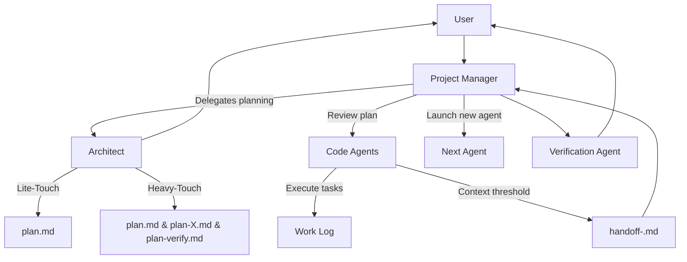

## roo-prompts

> The following Mermaid diagram summarizes the adaptive workflow outlined in `readme.md`.

# Adaptive Mode Workflow

The following Mermaid diagram summarizes the adaptive workflow outlined in `readme.md`.

---
> Converted and distributed by [TomeVault](https://tomevault.io/claim/strawgate) — claim your Tome and manage your conversions.
<!-- tomevault:4.0:gemini_md:2026-04-13 -->
