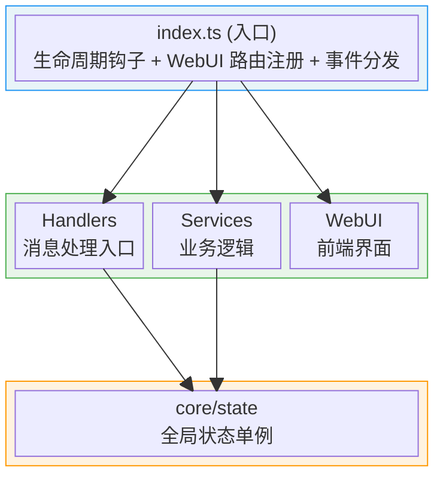
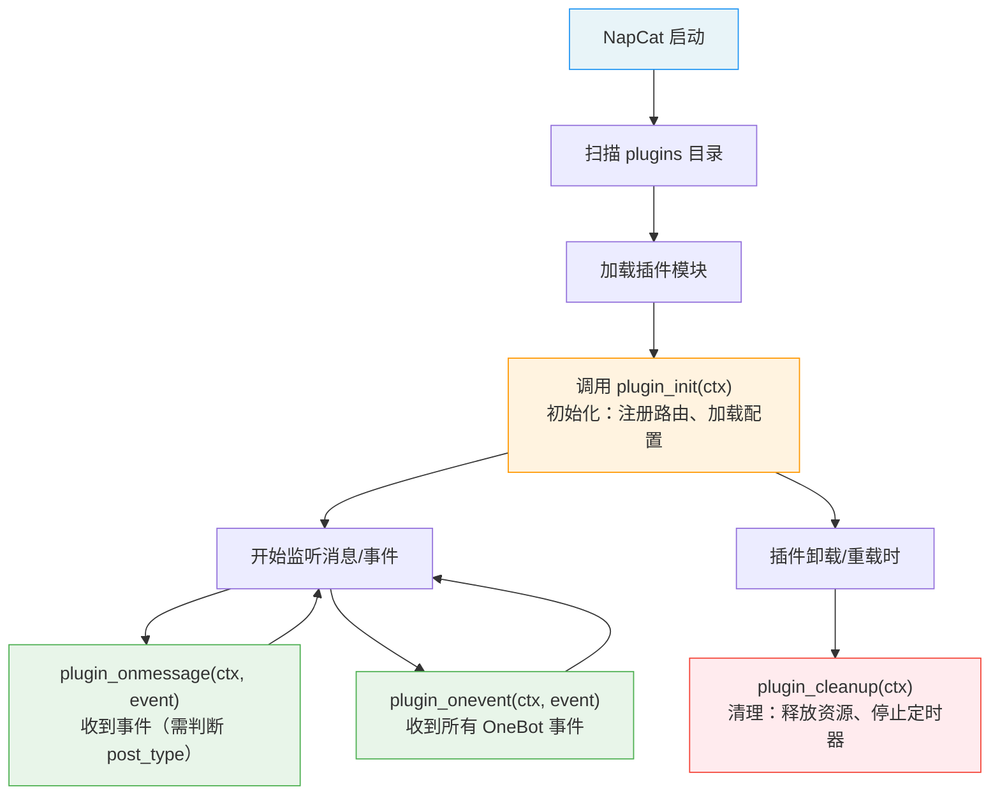

## qq-farm-query-plugin

> 为 AI 编程代理提供立即可用的、与本仓库紧密相关的上下文：架构要点、开发/构建流程、约定与关键集成点，便于自动完成改进、修复与小功能。

# Copilot Instructions for NapCat Plugin Template

## 目标

为 AI 编程代理提供立即可用的、与本仓库紧密相关的上下文：架构要点、开发/构建流程、约定与关键集成点，便于自动完成改进、修复与小功能。

---

## 一句话概览

这是一个面向 NapCat 的插件开发模板（TypeScript，ESM），使用 Vite 打包到 `dist/index.mjs` 作为插件入口；包含消息处理、配置管理和 WebUI 支持。

---

## 架构设计

### 分层架构



### 核心设计模式

| 模式 | 实现位置 | 说明 |
|------|----------|------|
| 单例状态 | `src/core/state.ts` | `pluginState` 全局单例，持有 ctx、config 引用 |
| 服务分层 | `src/services/*.ts` | 按职责拆分业务逻辑 |
| 配置校验 | `sanitizeConfig()` | 类型安全的运行时配置验证 |

---

## 关键文件与职责

### 入口与生命周期

| 文件 | 职责 |
|------|------|
| `src/index.ts` | 插件入口，导出生命周期钩子 (`plugin_init`, `plugin_onmessage`, `plugin_onevent`, `plugin_cleanup`) 和配置管理钩子 |
| `src/config.ts` | 默认配置 `DEFAULT_CONFIG` 和 WebUI 配置 Schema 构建 (`buildConfigSchema`) |

### 核心状态

| 文件 | 职责 |
|------|------|
| `src/core/state.ts` | 全局状态单例 `pluginState`，管理 ctx 引用、配置持久化、数据文件读写、selfId、定时器、统计信息 |
| `src/types.ts` | TypeScript 类型定义（`PluginConfig`, `GroupConfig`, `ApiResponse`） |

### 业务服务

| 文件 | 职责 |
|------|------|
| `src/services/api-service.ts` | WebUI API 路由注册（状态、配置、群管理接口） |

### 消息处理

| 文件 | 职责 |
|------|------|
| `src/handlers/message-handler.ts` | 消息事件入口，命令解析、CD 冷却、消息发送工具（含合并转发消息）、权限检查 |

### 前端 WebUI

| 文件 | 职责 |
|------|------|
| `src/webui/` | React + Vite 前端项目，管理界面用于配置和状态展示 |

---

## 插件生命周期



### 生命周期函数一览

| 函数名 | 是否必选 | 说明 |
|--------|---------|------|
| `plugin_init` | 必选 | 插件加载时调用，初始化资源、注册路由 |
| `plugin_onmessage` | 可选 | 收到事件时调用（需通过 `event.post_type` 判断事件类型） |
| `plugin_onevent` | 可选 | 收到所有 OneBot 事件时调用 |
| `plugin_cleanup` | 可选 | 插件卸载/重载时调用，必须清理资源 |
| `plugin_config_ui` | 可选 | 导出配置 Schema，用于 WebUI 生成配置面板 |
| `plugin_get_config` | 可选 | 自定义配置读取 |
| `plugin_set_config` | 可选 | 自定义配置保存 |
| `plugin_on_config_change` | 可选 | 配置变更回调（reactive 字段变化时触发） |
| `plugin_config_controller` | 可选 | 配置 UI 控制器，运行时动态控制配置界面 |

---

## NapCatPluginContext 核心属性

`ctx` 是插件与 NapCat 交互的核心桥梁：

| 属性 | 类型 | 说明 |
|------|------|------|
| `ctx.actions` | `ActionMap` | OneBot11 Action 调用器（最常用） |
| `ctx.logger` | `PluginLogger` | 日志记录器（自动带插件名前缀） |
| `ctx.router` | `PluginRouterRegistry` | 路由注册器（API、页面、静态文件） |
| `ctx.pluginName` | `string` | 当前插件名称 |
| `ctx.pluginPath` | `string` | 插件所在目录路径 |
| `ctx.configPath` | `string` | 插件配置文件路径 |
| `ctx.dataPath` | `string` | 插件数据存储目录路径 |
| `ctx.NapCatConfig` | `NapCatConfigClass` | 配置构建工具类 |
| `ctx.adapterName` | `string` | 适配器名称 |
| `ctx.pluginManager` | `IPluginManager` | 插件管理器 |
| `ctx.core` | `NapCatCore` | NapCat 底层核心实例（高级用法） |
| `ctx.oneBot` | `NapCatOneBot11Adapter` | OneBot11 适配器实例（高级用法） |
| `ctx.getPluginExports` | `<T>(id) => T` | 获取其他插件的导出对象 |

---

## 开发流程

### 环境准备

```bash
# 安装依赖
pnpm install

# 类型检查
pnpm run typecheck

# 完整构建（自动构建 WebUI 前端 + 后端 + 资源复制，一步完成）
pnpm run build
# 输出: dist/index.mjs + dist/package.json + dist/webui/

# WebUI 前端开发服务器（实时预览，推荐纯前端开发时使用）
pnpm run dev:webui
```

---

## 热重载开发说明

本模板已集成热重载开发能力，极大提升插件开发效率。依赖 Vite 插件 `napcatHmrPlugin`（已在 `vite.config.ts` 配置），需配合 NapCat 端安装并启用 `napcat-plugin-debug` 插件。

### 常用命令

```bash
# 一键部署：构建 → 自动复制到远程插件目录 → 自动重载
pnpm run push

# 开发模式：watch 构建 + 每次构建后自动部署 + 热重载（单进程）
pnpm run dev
```

> `push` = `vite build`（构建完成时 Vite 插件自动部署+重载）  
> `dev` = `vite build --watch`（每次重新构建后 Vite 插件自动部署+重载）

### 构建流程说明

每次执行 `pnpm run build`、`pnpm run deploy` 或 `pnpm run dev`（后端文件变化时），`vite.config.ts` 中的 `copyAssetsPlugin` 会在 `writeBundle` 阶段自动：

1. 构建 WebUI 前端（在 `src/webui` 目录执行 `pnpm run build`）
2. 复制 WebUI 构建产物到 `dist/webui/`
3. 生成精简的 `dist/package.json`
4. 复制 `templates/` 目录（如果存在）

然后 `napcatHmrPlugin` 会自动：
1. 连接调试服务（WebSocket）
2. 获取远程插件目录路径
3. 复制 `dist/` 到远程
4. 复制 WebUI 产物到远程插件目录的 `webui/` 子目录
5. 调用 `reloadPlugin` 热重载插件

> **注意**：`pnpm run dev` 仅监听插件后端（`src/` 下非 webui 的文件）的变化。修改 WebUI 前端代码后，随便改动一下后端文件即可触发重新构建（每次后端构建时会自动构建并部署 WebUI）。
>
> 如果只开发 WebUI 前端，推荐使用 `pnpm run dev:webui` 启动前端开发服务器，可实时预览。

如需自定义调试服务地址或 token：

```typescript
napcatHmrPlugin({
    wsUrl: 'ws://192.168.1.100:8998',
    token: 'mySecret',
    webui: {
        distDir: './src/webui/dist',
        targetDir: 'webui',
    },
})
```

### CLI 交互模式（可选）

```bash
# 独立运行 CLI，进入交互模式（REPL）
npx napcat-debug

# 常用参数
npx napcat-debug ws://host:port     # 指定调试服务地址
npx napcat-debug -t mySecret        # 带认证 token
npx napcat-debug -w ./my-plugin     # 监听目录自动热重载
npx napcat-debug -W                 # 监听远程所有插件
npx napcat-debug -d [dir]           # 部署插件到远程并重载

# 交互命令
debug> list              # 列出所有插件及其状态
debug> reload <id>       # 重载指定插件
debug> load <id>         # 加载指定插件
debug> unload <id>       # 卸载指定插件
debug> info <id>         # 查看插件详细信息
debug> deploy [dir]      # 部署插件到远程并重载
debug> watch <dir>       # 开始监听目录
debug> unwatch           # 停止监听
debug> status            # 查看调试服务状态
debug> ping              # 心跳测试
```

---

### CI/CD

- `.github/workflows/release.yml`：推送 `v*` tag 自动构建并创建 GitHub Release
- `.github/workflows/update-index.yml`：Release 发布后自动 fork 索引仓库、更新 `plugins.v4.json`，通过 `push-to-fork` 向官方索引仓库提交 PR（需配置 `INDEX_PAT` Secret）
- 构建产物由 `vite.config.ts` 中的 `copyAssetsPlugin` 自动处理

---

## 编码约定

### ESM 模块规范

- `package.json` 中 `type: "module"`
- Vite 打包输出为 `dist/index.mjs`

### 类型导入

使用 `napcat-types` 包的深路径导入：

```typescript
import type { NapCatPluginContext, PluginModule, PluginConfigSchema } from 'napcat-types/napcat-onebot/network/plugin/types';
import type { OB11Message, OB11PostSendMsg } from 'napcat-types/napcat-onebot';
import { EventType } from 'napcat-types/napcat-onebot/event/index';
```

### 状态访问模式

```typescript
import { pluginState } from '../core/state';

// 通过单例访问配置
const isEnabled = pluginState.config.enabled;

// 通过单例访问日志器（等价于 ctx.logger）
pluginState.logger.info('处理消息');

// 通过单例访问上下文
const ctx = pluginState.ctx;

// 获取机器人自身 QQ 号（init 时自动获取）
const selfId = pluginState.selfId;
```

### 数据持久化

除配置文件外，插件通常需要持久化业务数据（订阅列表、定时任务、推送历史等）。使用 `pluginState` 提供的通用数据文件读写方法：

```typescript
// 读取数据文件（文件不存在时返回默认值）
const subs = pluginState.loadDataFile<SubscriptionData>('subscriptions.json', { groups: [], users: [] });

// 保存数据文件
pluginState.saveDataFile('subscriptions.json', subs);

// 获取数据文件完整路径（如需直接操作文件）
const filePath = pluginState.getDataFilePath('cache.json');
```

> 数据文件存储在 `ctx.dataPath` 目录下，init 时会自动创建该目录。

### 定时器管理

使用 `pluginState.timers` Map 统一管理定时器，确保 cleanup 时全部清理：

```typescript
// 添加定时器
const timer = setInterval(() => { /* ... */ }, 60 * 1000);
pluginState.timers.set('my_job_id', timer);

// 移除定时器
const existing = pluginState.timers.get('my_job_id');
if (existing) {
    clearInterval(existing);
    pluginState.timers.delete('my_job_id');
}

// cleanup 时会自动清理所有 timers，无需手动处理
```

### OneBot Action 调用

统一使用 `ctx.actions.call()` 四参数模式：

```typescript
// 发送消息
const params: OB11PostSendMsg = {
    message: 'Hello',
    message_type: 'group',
    group_id: '123456',
};
await ctx.actions.call('send_msg', params, ctx.adapterName, ctx.pluginManager.config);

// 无参数 Action（传 {} 而非 void 0）
await ctx.actions.call('get_login_info', {}, ctx.adapterName, ctx.pluginManager.config);

// 获取群列表
const groups = await ctx.actions.call(
    'get_group_list', {}, ctx.adapterName, ctx.pluginManager.config
) as Array<{ group_id: number; group_name: string; member_count: number; max_member_count: number }>;

// 获取群成员信息
const memberInfo = await ctx.actions.call(
    'get_group_member_info',
    { group_id: '123456', user_id: '654321' },
    ctx.adapterName,
    ctx.pluginManager.config
) as { nickname: string; card: string; role: string };
```

### 合并转发消息

发送合并转发消息（多条消息合并为一条卡片）：

```typescript
import { sendForwardMsg, ForwardNode } from './handlers/message-handler';

// 构造转发节点
const nodes: ForwardNode[] = [
    {
        type: 'node',
        data: {
            nickname: '消息来源',
            user_id: pluginState.selfId || '10000',
            content: [{ type: 'text', data: { text: '第一条消息' } }],
        },
    },
    {
        type: 'node',
        data: {
            nickname: '消息来源',
            user_id: pluginState.selfId || '10000',
            content: [{ type: 'image', data: { file: 'https://example.com/image.png' } }],
        },
    },
];

// 发送到群
await sendForwardMsg(ctx, groupId, true, nodes);

// 发送到私聊
await sendForwardMsg(ctx, userId, false, nodes);
```

### 权限检查

在群聊中检查是否为管理员/群主：

```typescript
import { isAdmin } from './handlers/message-handler';

// 在消息处理中检查权限
if (!isAdmin(event)) {
    await sendReply(ctx, event, '只有管理员才能执行此操作');
    return;
}
```

### API 响应格式

```typescript
// 成功
res.json({ code: 0, data: { ... } });

// 错误
res.status(500).json({ code: -1, message: '错误描述' });
```

### 事件类型判断

```typescript
import { EventType } from 'napcat-types/napcat-onebot/event/index';

// 在 plugin_onmessage 中过滤非消息事件
if (event.post_type !== EventType.MESSAGE) return;
```

### 路由注册

```typescript
// 需要鉴权的 API → /api/Plugin/ext/<plugin-id>/
ctx.router.get('/endpoint', handler);
ctx.router.post('/endpoint', handler);

// 无需鉴权的 API → /plugin/<plugin-id>/api/
ctx.router.getNoAuth('/endpoint', handler);
ctx.router.postNoAuth('/endpoint', handler);

// 静态文件 → /plugin/<plugin-id>/files/<urlPath>/
ctx.router.static('/static', 'webui');

// 页面注册 → /plugin/<plugin-id>/page/<path>
ctx.router.page({ path: 'dashboard', title: '面板', htmlFile: 'webui/index.html' });

// 内存静态文件 → /plugin/<plugin-id>/mem/<urlPath>/
ctx.router.staticOnMem('/dynamic', [{ path: '/config.json', content: '{}', contentType: 'application/json' }]);
```

### 配置 Schema 构建

```typescript
// 使用 ctx.NapCatConfig 构建器
const schema = ctx.NapCatConfig.combine(
    ctx.NapCatConfig.boolean('enabled', '启用', true, '描述'),
    ctx.NapCatConfig.text('key', '标签', '默认值', '描述'),
    ctx.NapCatConfig.number('count', '数量', 10, '描述'),
    ctx.NapCatConfig.select('mode', '模式', [
        { label: '选项A', value: 'a' },
        { label: '选项B', value: 'b' }
    ], 'a'),
    ctx.NapCatConfig.multiSelect('features', '功能', [...], []),
    ctx.NapCatConfig.html('<p>说明</p>'),
    ctx.NapCatConfig.plainText('纯文本说明'),
);
```

---

## 注意事项

- **日志**：统一使用 `ctx.logger` 或 `pluginState.logger`，提供 `log/debug/info/warn/error` 方法
- **配置持久化**：通过 `pluginState.updateConfig()` / `pluginState.replaceConfig()` 保存
- **数据持久化**：通过 `pluginState.loadDataFile()` / `pluginState.saveDataFile()` 读写业务数据文件
- **机器人 QQ 号**：通过 `pluginState.selfId` 获取（init 时自动异步获取）
- **群配置**：使用 `pluginState.isGroupEnabled(groupId)` 检查
- **定时器管理**：将定时器存入 `pluginState.timers` Map，cleanup 时会自动全部清理
- **资源清理**：在 `plugin_cleanup` 中必须清理定时器、关闭连接，否则会导致内存泄漏
- **数据存储**：使用 `ctx.dataPath` 获取插件专属数据目录
- **插件间通信**：使用 `ctx.getPluginExports<T>(pluginId)` 获取其他插件的导出
- **Action 调用**：无参数的 Action 传 `{}` 而非 `void 0`，避免类型问题

### 图标与表情约定

- **禁止使用 emoji**：代码中不要使用 Unicode emoji 字符（如 `📁`、`🚀`、`✅` 等）
- **后端日志**：如需要输出装饰性字符，使用颜文字（kaomoji），例如：
  ```typescript
  ctx.logger.info('(｡･ω･｡) 插件初始化完成');
  ctx.logger.warn('(；′⌒`) 配置项缺失，使用默认值');
  ctx.logger.error('(╥﹏╥) 连接失败');
  ```
- **前端图标**：使用 SVG 图标，不要使用 emoji。推荐方式：
  - 将 SVG 封装为 React 组件（参考 `src/webui/src/components/icons.tsx`）
  - 或使用 inline SVG `<svg>` 标签
  ```tsx
  // 正确：SVG 图标组件
  export const CheckIcon = () => (
      <svg xmlns="http://www.w3.org/2000/svg" viewBox="0 0 24 24" fill="currentColor" width="16" height="16">
          <path d="M9 16.17L4.83 12l-1.42 1.41L9 19 21 7l-1.41-1.41z" />
      </svg>
  );

  // 错误：使用 emoji
  // <span>✅</span>
  ```

### 模板字符串与反引号安全

> **模板字符串内禁止出现未转义的反引号，含反引号的文本（如颜文字表情）必须使用字符串拼接或转义处理。**

在使用模板字符串（反引号 `` ` `` 包裹的字符串）时，严禁在字符串内容中出现未转义的反引号字符。部分颜文字包含反引号（如 `` (；′⌒`) ``、`` (`ω´) ``），其中的 `` ` `` 会被解析器误认为模板字符串的结束符，导致字符串提前闭合，后续代码作用域和结构全部错乱。

处理方式：

```typescript
// 正确：字符串拼接
ctx.logger.warn("(；′⌒`) 任务 " + jobId + " 已移除");

// 正确：转义反引号
ctx.logger.warn(`(；′⌒\`) 任务 ${jobId} 已移除`);

// 错误：未转义的反引号，会导致语法错误！
// ctx.logger.warn(`(；′⌒`) 任务 ${jobId} 已移除`);
```

**安全的颜文字**（不含反引号，可直接用于模板字符串）：

```typescript
ctx.logger.info(`(｡･ω･｡) 处理完成`);       // 安全
ctx.logger.error(`(╥﹏╥) 连接失败`);          // 安全
ctx.logger.info(`(≧▽≦) 启动成功`);           // 安全
```

**含反引号的颜文字**（必须转义或拼接）：

```typescript
ctx.logger.warn("(；′⌒`) 配置项缺失");       // 拼接方式
ctx.logger.warn(`(；′⌒\`) 配置项缺失`);      // 转义方式
```

### WebUI 前端开发风格

- **主题色**：统一使用粉色系（`primary: #FB7299`），参考 `tailwind.config.js` 中的 `brand` 色阶（`brand-50` ~ `brand-900`）
- **禁止渐变配色**：不要使用 CSS 渐变（`linear-gradient`、`radial-gradient` 等）作为背景或装饰。使用纯色代替。配置 Schema 头部 HTML 统一使用 `background: #FB7299`（主题粉色），不要用渐变
- **延续现有风格**：新增页面和组件应与现有 WebUI 保持一致的设计语言：
  - 卡片使用 `.card` 样式类（白底圆角 + 细边框 + 微阴影）
  - 激活态/选中态使用 `bg-primary text-white`
  - 按钮高亮使用 `bg-primary hover:bg-brand-600`
  - 暗色模式使用 `dark:bg-[#1e1e20]` 等已有暗色变量
  - 阴影使用 `rgba(251, 114, 153, 0.3)` 等粉色系阴影
- **配色速查**：

  | 用途 | 色值 | Tailwind class |
  |------|------|----------------|
  | 主色 | `#FB7299` | `bg-primary` / `text-primary` |
  | 浅粉背景 | `#fff1f3` | `bg-brand-50` |
  | 悬浮态 | `#e05a80` | `bg-brand-600` |
  | 深粉强调 | `#c4446a` | `bg-brand-700` |
  | 粉色阴影 | `rgba(251,114,153,0.3)` | 自定义 `box-shadow` |

---

## API 查阅方式

- **使用 AI 查询**：`.vscode/mcp.json` 中已预配置 [napcat.apifox.cn](https://napcat.apifox.cn/) 的 MCP 服务器，可在 Copilot Chat 中自然语言查询 OneBot API
- **手动查阅**：访问 https://napcat.apifox.cn/
- **开发文档**：参考 `.example/plugin/` 目录下的完整开发文档

---

## 发布流程

1. 修改 `package.json` 中的 `name`（必须以 `napcat-plugin-` 开头）、`plugin`（显示名称）、`description`、`author` 等字段
2. 配置仓库 Secret `INDEX_PAT`（GitHub PAT，需 `public_repo` 权限）
3. 推送 `v*` tag 触发自动发布：
   ```bash
   git tag v1.0.0
   git push origin v1.0.0
   ```
4. CI 自动构建 → 创建 Release → 向索引仓库提交 PR

---
> Source: [suoboge/qq-farm-query-plugin](https://github.com/suoboge/qq-farm-query-plugin) — distributed by [TomeVault](https://tomevault.io).
<!-- tomevault:4.0:gemini_md:2026-09-24 -->
