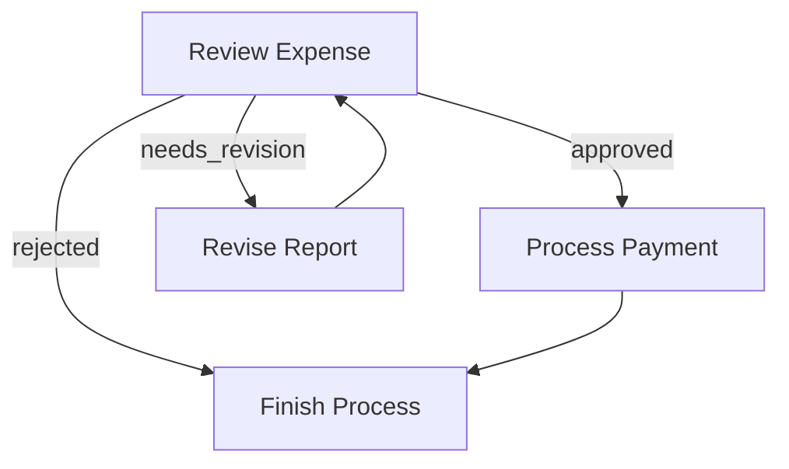
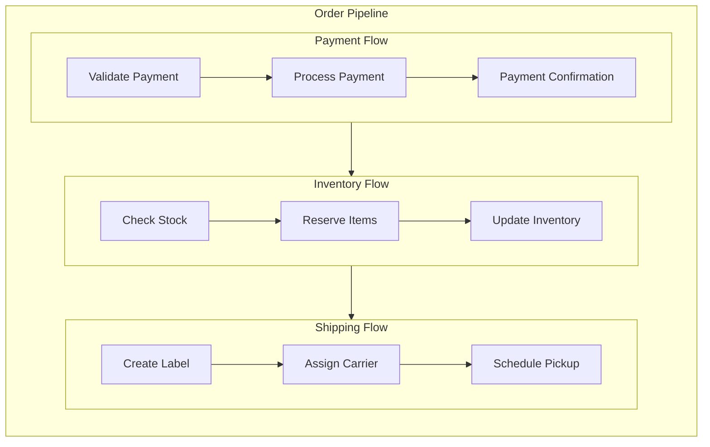

## pocketflow-typescript

> ================================================

================================================
File: docs/guide.md
================================================

---

layout: default
title: "Agentic Coding"

---

# Agentic Coding: Humans Design, Agents code!

> If you are an AI agents involved in building LLM Systems, read this guide **VERY, VERY** carefully! This is the most important chapter in the entire document. Throughout development, you should always (1) start with a small and simple solution, (2) design at a high level (`docs/design.md`) before implementation, and (3) frequently ask humans for feedback and clarification.
> {: .warning }

## Agentic Coding Steps

Agentic Coding should be a collaboration between Human System Design and Agent Implementation:

| Steps             |   Human    |     AI     | Comment                                                                                        |
| :---------------- | :--------: | :--------: | :--------------------------------------------------------------------------------------------- |
| 1. Requirements   |  ★★★ High  |  ★☆☆ Low   | Humans understand the requirements and context.                                                |
| 2. Flow           | ★★☆ Medium | ★★☆ Medium | Humans specify the high-level design, and the AI fills in the details.                         |
| 3. Utilities      | ★★☆ Medium | ★★☆ Medium | Humans provide available external APIs and integrations, and the AI helps with implementation. |
| 4. Node           |  ★☆☆ Low   |  ★★★ High  | The AI helps design the node types and data handling based on the flow.                        |
| 5. Implementation |  ★☆☆ Low   |  ★★★ High  | The AI implements the flow based on the design.                                                |
| 6. Optimization   | ★★☆ Medium | ★★☆ Medium | Humans evaluate the results, and the AI helps optimize.                                        |
| 7. Reliability    |  ★☆☆ Low   |  ★★★ High  | The AI writes test cases and addresses corner cases.                                           |

1. **Requirements**: Clarify the requirements for your project, and evaluate whether an AI system is a good fit.

   - Understand AI systems' strengths and limitations:
     - **Good for**: Routine tasks requiring common sense (filling forms, replying to emails)
     - **Good for**: Creative tasks with well-defined inputs (building slides, writing SQL)
     - **Not good for**: Ambiguous problems requiring complex decision-making (business strategy, startup planning)
   - **Keep It User-Centric:** Explain the "problem" from the user's perspective rather than just listing features.
   - **Balance complexity vs. impact**: Aim to deliver the highest value features with minimal complexity early.

2. **Flow Design**: Outline at a high level, describe how your AI system orchestrates nodes.

   - Identify applicable design patterns (e.g., [Map Reduce](./design_pattern/mapreduce.md), [Agent](./design_pattern/agent.md), [RAG](./design_pattern/rag.md)).
     - For each node in the flow, start with a high-level one-line description of what it does.
     - If using **Map Reduce**, specify how to map (what to split) and how to reduce (how to combine).
     - If using **Agent**, specify what are the inputs (context) and what are the possible actions.
     - If using **RAG**, specify what to embed, noting that there's usually both offline (indexing) and online (retrieval) workflows.
   - Outline the flow and draw it in a mermaid diagram. For example:

     ```mermaid
     flowchart LR
         start[Start] --> batch[Batch]
         batch --> check[Check]
         check -->|OK| process
         check -->|Error| fix[Fix]
         fix --> check

         subgraph process[Process]
           step1[Step 1] --> step2[Step 2]
         end

         process --> endNode[End]
     ```

   - > **If Humans can't specify the flow, AI Agents can't automate it!** Before building an LLM system, thoroughly understand the problem and potential solution by manually solving example inputs to develop intuition.  
     > {: .best-practice }

3. **Utilities**: Based on the Flow Design, identify and implement necessary utility functions.

   - Think of your AI system as the brain. It needs a body—these _external utility functions_—to interact with the real world:
       <div align="center"></div>

     - Reading inputs (e.g., retrieving Slack messages, reading emails)
     - Writing outputs (e.g., generating reports, sending emails)
     - Using external tools (e.g., calling LLMs, searching the web)
     - **NOTE**: _LLM-based tasks_ (e.g., summarizing text, analyzing sentiment) are **NOT** utility functions; rather, they are _core functions_ internal in the AI system.

   - For each utility function, implement it and write a simple test.
   - Document their input/output, as well as why they are necessary. For example:
     - `name`: `getEmbedding` (`src/utils/getEmbedding.ts`)
     - `input`: `string`
     - `output`: a vector of 3072 numbers
     - `necessity`: Used by the second node to embed text
   - Example utility implementation:

     ```typescript
     // src/utils/callLlm.ts
     import { OpenAI } from "openai";

     export async function callLlm(prompt: string): Promise<string> {
       const client = new OpenAI({
         apiKey: process.env.OPENAI_API_KEY,
       });

       const response = await client.chat.completions.create({
         model: "gpt-4o",
         messages: [{ role: "user", content: prompt }],
       });

       return response.choices[0].message.content || "";
     }
     ```

   - > **Sometimes, design Utilies before Flow:** For example, for an LLM project to automate a legacy system, the bottleneck will likely be the available interface to that system. Start by designing the hardest utilities for interfacing, and then build the flow around them.
     > {: .best-practice }

4. **Node Design**: Plan how each node will read and write data, and use utility functions.

   - One core design principle for PocketFlow is to use a [shared store](./core_abstraction/communication.md), so start with a shared store design:

     - For simple systems, use an in-memory object.
     - For more complex systems or when persistence is required, use a database.
     - **Don't Repeat Yourself**: Use in-memory references or foreign keys.
     - Example shared store design:

       ```typescript
       interface SharedStore {
         user: {
           id: string;
           context: {
             weather: { temp: number; condition: string };
             location: string;
           };
         };
         results: Record<string, unknown>;
       }

       const shared: SharedStore = {
         user: {
           id: "user123",
           context: {
             weather: { temp: 72, condition: "sunny" },
             location: "San Francisco",
           },
         },
         results: {}, // Empty object to store outputs
       };
       ```

   - For each [Node](./core_abstraction/node.md), describe its type, how it reads and writes data, and which utility function it uses. Keep it specific but high-level without codes. For example:
     - `type`: Node (or BatchNode, or ParallelBatchNode)
     - `prep`: Read "text" from the shared store
     - `exec`: Call the embedding utility function
     - `post`: Write "embedding" to the shared store

5. **Implementation**: Implement the initial nodes and flows based on the design.

   - 🎉 If you've reached this step, humans have finished the design. Now _Agentic Coding_ begins!
   - **"Keep it simple, stupid!"** Avoid complex features and full-scale type checking.
   - **FAIL FAST**! Avoid `try` logic so you can quickly identify any weak points in the system.
   - Add logging throughout the code to facilitate debugging.

6. **Optimization**:

   - **Use Intuition**: For a quick initial evaluation, human intuition is often a good start.
   - **Redesign Flow (Back to Step 3)**: Consider breaking down tasks further, introducing agentic decisions, or better managing input contexts.
   - If your flow design is already solid, move on to micro-optimizations:

     - **Prompt Engineering**: Use clear, specific instructions with examples to reduce ambiguity.
     - **In-Context Learning**: Provide robust examples for tasks that are difficult to specify with instructions alone.

   - > **You'll likely iterate a lot!** Expect to repeat Steps 3–6 hundreds of times.
     >
     > <div align="center"></div>
     > {: .best-practice }

7. **Reliability**
   - **Node Retries**: Add checks in the node `exec` to ensure outputs meet requirements, and consider increasing `maxRetries` and `wait` times.
   - **Logging and Visualization**: Maintain logs of all attempts and visualize node results for easier debugging.
   - **Self-Evaluation**: Add a separate node (powered by an LLM) to review outputs when results are uncertain.

## Example LLM Project File Structure

```
my-project/
├── src/
│   ├── index.ts
│   ├── nodes.ts
│   ├── flow.ts
│   ├── types.ts
│   └── utils/
│       ├── callLlm.ts
│       └── searchWeb.ts
├── docs/
│   └── design.md
├── package.json
└── tsconfig.json
```

- **`docs/design.md`**: Contains project documentation for each step above. This should be _high-level_ and _no-code_.
- **`src/types.ts`**: Contains shared type definitions and interfaces used throughout the project.
- **`src/utils/`**: Contains all utility functions.
  - It's recommended to dedicate one TypeScript file to each API call, for example `callLlm.ts` or `searchWeb.ts`.
  - Each file should export functions that can be imported elsewhere in the project
  - Include test cases for each utility function using `utilityFunctionName.test.ts`
- **`src/nodes.ts`**: Contains all the node definitions.

  ```typescript
  // src/types.ts
  export interface QASharedStore {
    question?: string;
    answer?: string;
  }
  ```

  ```typescript
  // src/nodes.ts
  import { Node } from "pocketflow";
  import { callLlm } from "./utils/callLlm";
  import { QASharedStore } from "./types";
  import PromptSync from "prompt-sync";

  const prompt = PromptSync();

  export class GetQuestionNode extends Node<QASharedStore> {
    async exec(): Promise<string> {
      // Get question directly from user input
      const userQuestion = prompt("Enter your question: ") || "";
      return userQuestion;
    }

    async post(
      shared: QASharedStore,
      _: unknown,
      execRes: string
    ): Promise<string | undefined> {
      // Store the user's question
      shared.question = execRes;
      return "default"; // Go to the next node
    }
  }

  export class AnswerNode extends Node<QASharedStore> {
    async prep(shared: QASharedStore): Promise<string> {
      // Read question from shared
      return shared.question || "";
    }

    async exec(question: string): Promise<string> {
      // Call LLM to get the answer
      return await callLlm(question);
    }

    async post(
      shared: QASharedStore,
      _: unknown,
      execRes: string
    ): Promise<string | undefined> {
      // Store the answer in shared
      shared.answer = execRes;
      return undefined;
    }
  }
  ```

- **`src/flow.ts`**: Implements functions that create flows by importing node definitions and connecting them.

  ```typescript
  // src/flow.ts
  import { Flow } from "pocketflow";
  import { GetQuestionNode, AnswerNode } from "./nodes";
  import { QASharedStore } from "./types";

  export function createQaFlow(): Flow {
    // Create nodes
    const getQuestionNode = new GetQuestionNode();
    const answerNode = new AnswerNode();

    // Connect nodes in sequence
    getQuestionNode.next(answerNode);

    // Create flow starting with input node
    return new Flow<QASharedStore>(getQuestionNode);
  }
  ```

- **`src/index.ts`**: Serves as the project's entry point.

  ```typescript
  // src/index.ts
  import { createQaFlow } from "./flow";
  import { QASharedStore } from "./types";

  // Example main function
  async function main(): Promise<void> {
    const shared: QASharedStore = {
      question: undefined, // Will be populated by GetQuestionNode from user input
      answer: undefined, // Will be populated by AnswerNode
    };

    // Create the flow and run it
    const qaFlow = createQaFlow();
    await qaFlow.run(shared);
    console.log(`Question: ${shared.question}`);
    console.log(`Answer: ${shared.answer}`);
  }

  // Run the main function
  main().catch(console.error);
  ```

- **`package.json`**: Contains project metadata and dependencies.

- **`tsconfig.json`**: Contains TypeScript compiler configuration.

================================================
File: docs/index.md
================================================

---

layout: default
title: "Home"
nav_order: 1

---

---
layout: default
title: "Home"
nav_order: 1
---

# PocketFlow.js

A [100-line](https://github.com/The-Pocket/PocketFlow-Typescript/blob/main/src/index.ts) minimalist LLM framework for _Agents, Task Decomposition, RAG, etc_.

- **Lightweight**: Just the core graph abstraction in 100 lines. ZERO dependencies, and vendor lock-in.
- **Expressive**: Everything you love from larger frameworks—([Multi-](./design_pattern/multi_agent.html))[Agents](./design_pattern/agent.html), [Workflow](./design_pattern/workflow.html), [RAG](./design_pattern/rag.html), and more.
- **Agentic-Coding**: Intuitive enough for AI agents to help humans build complex LLM applications.

<div align="center">
  
</div>

## Core Abstraction

We model the LLM workflow as a **Graph + Shared Store**:

- [Node](./core_abstraction/node.md) handles simple (LLM) tasks.
- [Flow](./core_abstraction/flow.md) connects nodes through **Actions** (labeled edges).
- [Shared Store](./core_abstraction/communication.md) enables communication between nodes within flows.
- [Batch](./core_abstraction/batch.md) nodes/flows allow for data-intensive tasks.
- [(Advanced) Parallel](./core_abstraction/parallel.md) nodes/flows handle I/O-bound tasks.

<div align="center">
  
</div>

## Design Pattern

From there, it’s easy to implement popular design patterns:

- [Agent](./design_pattern/agent.md) autonomously makes decisions.
- [Workflow](./design_pattern/workflow.md) chains multiple tasks into pipelines.
- [RAG](./design_pattern/rag.md) integrates data retrieval with generation.
- [Map Reduce](./design_pattern/mapreduce.md) splits data tasks into Map and Reduce steps.
- [Structured Output](./design_pattern/structure.md) formats outputs consistently.
- [(Advanced) Multi-Agents](./design_pattern/multi_agent.md) coordinate multiple agents.

<div align="center">
  
</div>

## Utility Function

We **do not** provide built-in utilities. Instead, we offer _examples_—please _implement your own_:

- [LLM Wrapper](./utility_function/llm.md)
- [Viz and Debug](./utility_function/viz.md)
- [Web Search](./utility_function/websearch.md)
- [Chunking](./utility_function/chunking.md)
- [Embedding](./utility_function/embedding.md)
- [Vector Databases](./utility_function/vector.md)
- [Text-to-Speech](./utility_function/text_to_speech.md)

**Why not built-in?**: I believe it's a _bad practice_ for vendor-specific APIs in a general framework:

- _API Volatility_: Frequent changes lead to heavy maintenance for hardcoded APIs.
- _Flexibility_: You may want to switch vendors, use fine-tuned models, or run them locally.
- _Optimizations_: Prompt caching, batching, and streaming are easier without vendor lock-in.

## Ready to build your Apps?

Check out [Agentic Coding Guidance](./guide.md), the fastest way to develop LLM projects with PocketFlow.js!

================================================
File: docs/core_abstraction/batch.md
================================================

---

layout: default
title: "Batch"
parent: "Core Abstraction"
nav_order: 4

---

# Batch

**Batch** makes it easier to handle large inputs in one Node or **rerun** a Flow multiple times. Example use cases:

- **Chunk-based** processing (e.g., splitting large texts).
- **Iterative** processing over lists of input items (e.g., user queries, files, URLs).

## 1. BatchNode

A **BatchNode** extends `Node` but changes `prep()` and `exec()`:

- **`prep(shared)`**: returns an **array** of items to process.
- **`exec(item)`**: called **once** per item in that iterable.
- **`post(shared, prepRes, execResList)`**: after all items are processed, receives a **list** of results (`execResList`) and returns an **Action**.

### Example: Summarize a Large File

```typescript
type SharedStorage = {
  data: string;
  summary?: string;
};

class MapSummaries extends BatchNode<SharedStorage> {
  async prep(shared: SharedStorage): Promise<string[]> {
    // Chunk content into manageable pieces
    const content = shared.data;
    const chunks: string[] = [];
    const chunkSize = 10000;

    for (let i = 0; i < content.length; i += chunkSize) {
      chunks.push(content.slice(i, i + chunkSize));
    }

    return chunks;
  }

  async exec(chunk: string): Promise<string> {
    const prompt = `Summarize this chunk in 10 words: ${chunk}`;
    return await callLlm(prompt);
  }

  async post(
    shared: SharedStorage,
    _: string[],
    summaries: string[]
  ): Promise<string> {
    shared.summary = summaries.join("\n");
    return "default";
  }
}

// Usage
const flow = new Flow(new MapSummaries());
await flow.run({ data: "very long text content..." });
```

---

## 2. BatchFlow

A **BatchFlow** runs a **Flow** multiple times, each time with different `params`. Think of it as a loop that replays the Flow for each parameter set.

### Example: Summarize Many Files

```typescript
type SharedStorage = {
  files: string[];
};

type FileParams = {
  filename: string;
};

class SummarizeAllFiles extends BatchFlow<SharedStorage> {
  async prep(shared: SharedStorage): Promise<FileParams[]> {
    return shared.files.map((filename) => ({ filename }));
  }
}

// Create a per-file summarization flow
const summarizeFile = new SummarizeFile();
const summarizeAllFiles = new SummarizeAllFiles(summarizeFile);

await summarizeAllFiles.run({ files: ["file1.txt", "file2.txt"] });
```

### Under the Hood

1. `prep(shared)` returns a list of param objects—e.g., `[{filename: "file1.txt"}, {filename: "file2.txt"}, ...]`.
2. The **BatchFlow** loops through each object and:
   - Merges it with the BatchFlow's own `params`
   - Calls `flow.run(shared)` using the merged result
3. This means the sub-Flow runs **repeatedly**, once for every param object.

---

## 3. Nested Batches

You can nest BatchFlows to handle hierarchical data processing:

```typescript
type DirectoryParams = {
  directory: string;
};

type FileParams = DirectoryParams & {
  filename: string;
};

class FileBatchFlow extends BatchFlow<SharedStorage> {
  async prep(shared: SharedStorage): Promise<FileParams[]> {
    const directory = this._params.directory;
    const files = await getFilesInDirectory(directory).filter((f) =>
      f.endsWith(".txt")
    );

    return files.map((filename) => ({
      directory, // Pass on directory from parent
      filename, // Add filename for this batch item
    }));
  }
}

class DirectoryBatchFlow extends BatchFlow<SharedStorage> {
  async prep(shared: SharedStorage): Promise<DirectoryParams[]> {
    return ["/path/to/dirA", "/path/to/dirB"].map((directory) => ({
      directory,
    }));
  }
}

// Process all files in all directories
const processingNode = new ProcessingNode();
const fileFlow = new FileBatchFlow(processingNode);
const dirFlow = new DirectoryBatchFlow(fileFlow);
await dirFlow.run({});
```

================================================
File: docs/core_abstraction/communication.md
================================================

---

layout: default
title: "Communication"
parent: "Core Abstraction"
nav_order: 3

---

# Communication

Nodes and Flows **communicate** in 2 ways:

1. **Shared Store (for almost all the cases)**

   - A global data structure (often an in-mem dict) that all nodes can read ( `prep()`) and write (`post()`).
   - Great for data results, large content, or anything multiple nodes need.
   - You shall design the data structure and populate it ahead.
   - > **Separation of Concerns:** Use `Shared Store` for almost all cases to separate _Data Schema_ from _Compute Logic_! This approach is both flexible and easy to manage, resulting in more maintainable code. `Params` is more a syntax sugar for [Batch](./batch.md).
     > {: .best-practice }

2. **Params (only for [Batch](./batch.md))**
   - Each node has a local, ephemeral `params` dict passed in by the **parent Flow**, used as an identifier for tasks. Parameter keys and values shall be **immutable**.
   - Good for identifiers like filenames or numeric IDs, in Batch mode.

If you know memory management, think of the **Shared Store** like a **heap** (shared by all function calls), and **Params** like a **stack** (assigned by the caller).

---

## 1. Shared Store

### Overview

A shared store is typically an in-mem dictionary, like:

```typescript
interface SharedStore {
  data: Record<string, unknown>;
  summary: Record<string, unknown>;
  config: Record<string, unknown>;
  // ...other properties
}

const shared: SharedStore = { data: {}, summary: {}, config: {} /* ... */ };
```

It can also contain local file handlers, DB connections, or a combination for persistence. We recommend deciding the data structure or DB schema first based on your app requirements.

### Example

```typescript
interface SharedStore {
  data: string;
  summary: string;
}

class LoadData extends Node<SharedStore> {
  async post(
    shared: SharedStore,
    prepRes: unknown,
    execRes: unknown
  ): Promise<string | undefined> {
    // We write data to shared store
    shared.data = "Some text content";
    return "default";
  }
}

class Summarize extends Node<SharedStore> {
  async prep(shared: SharedStore): Promise<unknown> {
    // We read data from shared store
    return shared.data;
  }

  async exec(prepRes: unknown): Promise<unknown> {
    // Call LLM to summarize
    const prompt = `Summarize: ${prepRes}`;
    const summary = await callLlm(prompt);
    return summary;
  }

  async post(
    shared: SharedStore,
    prepRes: unknown,
    execRes: unknown
  ): Promise<string | undefined> {
    // We write summary to shared store
    shared.summary = execRes as string;
    return "default";
  }
}

const loadData = new LoadData();
const summarize = new Summarize();
loadData.next(summarize);
const flow = new Flow(loadData);

const shared: SharedStore = { data: "", summary: "" };
flow.run(shared);
```

Here:

- `LoadData` writes to `shared.data`.
- `Summarize` reads from `shared.data`, summarizes, and writes to `shared.summary`.

---

## 2. Params

**Params** let you store _per-Node_ or _per-Flow_ config that doesn't need to live in the shared store. They are:

- **Immutable** during a Node's run cycle (i.e., they don't change mid-`prep->exec->post`).
- **Set** via `setParams()`.
- **Cleared** and updated each time a parent Flow calls it.

> Only set the uppermost Flow params because others will be overwritten by the parent Flow.
>
> If you need to set child node params, see [Batch](./batch.md).
> {: .warning }

Typically, **Params** are identifiers (e.g., file name, page number). Use them to fetch the task you assigned or write to a specific part of the shared store.

### Example

```typescript
interface SharedStore {
  data: Record<string, string>;
  summary: Record<string, string>;
}

interface SummarizeParams {
  filename: string;
}

// 1) Create a Node that uses params
class SummarizeFile extends Node<SharedStore, SummarizeParams> {
  async prep(shared: SharedStore): Promise<unknown> {
    // Access the node's param
    const filename = this._params.filename;
    return shared.data[filename] || "";
  }

  async exec(prepRes: unknown): Promise<unknown> {
    const prompt = `Summarize: ${prepRes}`;
    return await callLlm(prompt);
  }

  async post(
    shared: SharedStore,
    prepRes: unknown,
    execRes: unknown
  ): Promise<string | undefined> {
    const filename = this._params.filename;
    shared.summary[filename] = execRes as string;
    return "default";
  }
}

// 2) Set params
const node = new SummarizeFile();

// 3) Set Node params directly (for testing)
node.setParams({ filename: "doc1.txt" });
node.run(shared);

// 4) Create Flow
const flow = new Flow<SharedStore>(node);

// 5) Set Flow params (overwrites node params)
flow.setParams({ filename: "doc2.txt" });
flow.run(shared); // The node summarizes doc2, not doc1
```

================================================
File: docs/core_abstraction/flow.md
================================================

---

layout: default
title: "Flow"
parent: "Core Abstraction"
nav_order: 2

---

# Flow

A **Flow** orchestrates a graph of Nodes. You can chain Nodes in a sequence or create branching depending on the **Actions** returned from each Node's `post()`.

## 1. Action-based Transitions

Each Node's `post()` returns an **Action** string. By default, if `post()` doesn't return anything, we treat that as `"default"`.

You define transitions with the syntax:

1. **Basic default transition**: `nodeA.next(nodeB)`
   This means if `nodeA.post()` returns `"default"`, go to `nodeB`.
   (Equivalent to `nodeA.on("default", nodeB)`)

2. **Named action transition**: `nodeA.on("actionName", nodeB)`
   This means if `nodeA.post()` returns `"actionName"`, go to `nodeB`.

It's possible to create loops, branching, or multi-step flows.

## 2. Method Chaining

The transition methods support **chaining** for more concise flow creation:

### Chaining `on()` Methods

The `on()` method returns the current node, so you can chain multiple action definitions:

```typescript
// All transitions from the same node
nodeA.on("approved", nodeB).on("rejected", nodeC).on("needs_review", nodeD);

// Equivalent to:
nodeA.on("approved", nodeB);
nodeA.on("rejected", nodeC);
nodeA.on("needs_review", nodeD);
```

### Chaining `next()` Methods

The `next()` method returns the target node, allowing you to create linear sequences in a single expression:

```typescript
// Creates a linear A → B → C → D sequence
nodeA.next(nodeB).next(nodeC).next(nodeD);

// Equivalent to:
nodeA.next(nodeB);
nodeB.next(nodeC);
nodeC.next(nodeD);
```

### Combining Chain Types

You can combine both chaining styles for complex flows:

```typescript
nodeA
  .on("action1", nodeB.next(nodeC).next(nodeD))
  .on("action2", nodeE.on("success", nodeF).on("failure", nodeG));
```

## 3. Creating a Flow

A **Flow** begins with a **start** node. You call `const flow = new Flow(someNode)` to specify the entry point. When you call `flow.run(shared)`, it executes the start node, looks at its returned Action from `post()`, follows the transition, and continues until there's no next node.

### Example: Simple Sequence

Here's a minimal flow of two nodes in a chain:

```typescript
nodeA.next(nodeB);
const flow = new Flow(nodeA);
flow.run(shared);
```

- When you run the flow, it executes `nodeA`.
- Suppose `nodeA.post()` returns `"default"`.
- The flow then sees `"default"` Action is linked to `nodeB` and runs `nodeB`.
- `nodeB.post()` returns `"default"` but we didn't define a successor for `nodeB`. So the flow ends there.

### Example: Branching & Looping

Here's a simple expense approval flow that demonstrates branching and looping. The `ReviewExpense` node can return three possible Actions:

- `"approved"`: expense is approved, move to payment processing
- `"needs_revision"`: expense needs changes, send back for revision
- `"rejected"`: expense is denied, finish the process

We can wire them like this:

```typescript
// Define the flow connections
review.on("approved", payment); // If approved, process payment
review.on("needs_revision", revise); // If needs changes, go to revision
review.on("rejected", finish); // If rejected, finish the process

revise.next(review); // After revision, go back for another review
payment.next(finish); // After payment, finish the process

const flow = new Flow(review);
```

Let's see how it flows:

1. If `review.post()` returns `"approved"`, the expense moves to the `payment` node
2. If `review.post()` returns `"needs_revision"`, it goes to the `revise` node, which then loops back to `review`
3. If `review.post()` returns `"rejected"`, it moves to the `finish` node and stops



### Running Individual Nodes vs. Running a Flow

- `node.run(shared)`: Just runs that node alone (calls `prep->exec->post()`), returns an Action.
- `flow.run(shared)`: Executes from the start node, follows Actions to the next node, and so on until the flow can't continue.

> `node.run(shared)` **does not** proceed to the successor.
> This is mainly for debugging or testing a single node.
>
> Always use `flow.run(...)` in production to ensure the full pipeline runs correctly.
> {: .warning }

## 4. Nested Flows

A **Flow** can act like a Node, which enables powerful composition patterns. This means you can:

1. Use a Flow as a Node within another Flow's transitions.
2. Combine multiple smaller Flows into a larger Flow for reuse.
3. Node `params` will be a merging of **all** parents' `params`.

### Flow's Node Methods

A **Flow** is also a **Node**, so it will run `prep()` and `post()`. However:

- It **won't** run `exec()`, as its main logic is to orchestrate its nodes.
- `post()` always receives `undefined` for `execRes` and should instead get the flow execution results from the shared store.

### Basic Flow Nesting

Here's how to connect a flow to another node:

```typescript
// Create a sub-flow
nodeA.next(nodeB);
const subflow = new Flow(nodeA);

// Connect it to another node
subflow.next(nodeC);

// Create the parent flow
const parentFlow = new Flow(subflow);
```

When `parentFlow.run()` executes:

1. It starts `subflow`
2. `subflow` runs through its nodes (`nodeA->nodeB`)
3. After `subflow` completes, execution continues to `nodeC`

### Example: Order Processing Pipeline

Here's a practical example that breaks down order processing into nested flows:

```typescript
// Payment processing sub-flow
validatePayment.next(processPayment).next(paymentConfirmation);
const paymentFlow = new Flow(validatePayment);

// Inventory sub-flow
checkStock.next(reserveItems).next(updateInventory);
const inventoryFlow = new Flow(checkStock);

// Shipping sub-flow
createLabel.next(assignCarrier).next(schedulePickup);
const shippingFlow = new Flow(createLabel);

// Connect the flows into a main order pipeline
paymentFlow.next(inventoryFlow).next(shippingFlow);

// Create the master flow
const orderPipeline = new Flow(paymentFlow);

// Run the entire pipeline
orderPipeline.run(sharedData);
```

This creates a clean separation of concerns while maintaining a clear execution path:



================================================
File: docs/core_abstraction/node.md
================================================

---

layout: default
title: "Node"
parent: "Core Abstraction"
nav_order: 1

---

# Node

A **Node** is the smallest building block. Each Node has 3 steps `prep->exec->post`:

<div align="center">
  
</div>

1. `prep(shared)`

   - **Read and preprocess data** from `shared` store.
   - Examples: _query DB, read files, or serialize data into a string_.
   - Return `prepRes`, which is used by `exec()` and `post()`.

2. `exec(prepRes)`

   - **Execute compute logic**, with optional retries and error handling (below).
   - Examples: _(mostly) LLM calls, remote APIs, tool use_.
   - ⚠️ This shall be only for compute and **NOT** access `shared`.
   - ⚠️ If retries enabled, ensure idempotent implementation.
   - Return `execRes`, which is passed to `post()`.

3. `post(shared, prepRes, execRes)`
   - **Postprocess and write data** back to `shared`.
   - Examples: _update DB, change states, log results_.
   - **Decide the next action** by returning a _string_ (`action = "default"` if _None_).

> **Why 3 steps?** To enforce the principle of _separation of concerns_. The data storage and data processing are operated separately.
>
> All steps are _optional_. E.g., you can only implement `prep` and `post` if you just need to process data.
> {: .note }

### Fault Tolerance & Retries

You can **retry** `exec()` if it raises an exception via two parameters when define the Node:

- `max_retries` (int): Max times to run `exec()`. The default is `1` (**no** retry).
- `wait` (int): The time to wait (in **seconds**) before next retry. By default, `wait=0` (no waiting).
  `wait` is helpful when you encounter rate-limits or quota errors from your LLM provider and need to back off.

```typescript
const myNode = new SummarizeFile(3, 10); // maxRetries = 3, wait = 10 seconds
```

When an exception occurs in `exec()`, the Node automatically retries until:

- It either succeeds, or
- The Node has retried `maxRetries - 1` times already and fails on the last attempt.

You can get the current retry times (0-based) from `this.currentRetry`.

### Graceful Fallback

To **gracefully handle** the exception (after all retries) rather than raising it, override:

```typescript
execFallback(prepRes: unknown, error: Error): unknown {
  return "There was an error processing your request.";
}
```

By default, it just re-raises the exception.

### Example: Summarize file

```typescript
type SharedStore = {
  data: string;
  summary?: string;
};

class SummarizeFile extends Node<SharedStore> {
  prep(shared: SharedStore): string {
    return shared.data;
  }

  exec(content: string): string {
    if (!content) return "Empty file content";

    const prompt = `Summarize this text in 10 words: ${content}`;
    return callLlm(prompt);
  }

  execFallback(_: string, error: Error): string {
    return "There was an error processing your request.";
  }

  post(shared: SharedStore, _: string, summary: string): string | undefined {
    shared.summary = summary;
    return undefined; // "default" action
  }
}

// Example usage
const node = new SummarizeFile(3); // maxRetries = 3
const shared: SharedStore = { data: "Long text to summarize..." };
const action = node.run(shared);

console.log("Action:", action);
console.log("Summary:", shared.summary);
```

================================================
File: docs/core_abstraction/parallel.md
================================================

---

layout: default
title: "(Advanced) Parallel"
parent: "Core Abstraction"
nav_order: 6

---

# (Advanced) Parallel

**Parallel** Nodes and Flows let you run multiple operations **concurrently**—for example, summarizing multiple texts at once. This can improve performance by overlapping I/O and compute.

> Parallel nodes and flows excel at overlapping I/O-bound work—like LLM calls, database queries, API requests, or file I/O. TypeScript's Promise-based implementation allows for truly concurrent execution of asynchronous operations.
> {: .warning }

> - **Ensure Tasks Are Independent**: If each item depends on the output of a previous item, **do not** parallelize.
>
> - **Beware of Rate Limits**: Parallel calls can **quickly** trigger rate limits on LLM services. You may need a **throttling** mechanism.
>
> - **Consider Single-Node Batch APIs**: Some LLMs offer a **batch inference** API where you can send multiple prompts in a single call. This is more complex to implement but can be more efficient than launching many parallel requests and mitigates rate limits.
>   {: .best-practice }

## ParallelBatchNode

Like **BatchNode**, but runs operations in **parallel** using Promise.all():

```typescript
class TextSummarizer extends ParallelBatchNode<SharedStorage> {
  async prep(shared: SharedStorage): Promise<string[]> {
    // e.g., multiple texts
    return shared.texts || [];
  }

  async exec(text: string): Promise<string> {
    const prompt = `Summarize: ${text}`;
    return await callLlm(prompt);
  }

  async post(
    shared: SharedStorage,
    prepRes: string[],
    execRes: string[]
  ): Promise<string | undefined> {
    shared.summaries = execRes;
    return "default";
  }
}

const node = new TextSummarizer();
const flow = new Flow(node);
```

## ParallelBatchFlow

Parallel version of **BatchFlow**. Each iteration of the sub-flow runs **concurrently** using Promise.all():

```typescript
class SummarizeMultipleFiles extends ParallelBatchFlow<SharedStorage> {
  async prep(shared: SharedStorage): Promise<Record<string, any>[]> {
    return (shared.files || []).map((f) => ({ filename: f }));
  }
}

const subFlow = new Flow(new LoadAndSummarizeFile());
const parallelFlow = new SummarizeMultipleFiles(subFlow);
await parallelFlow.run(shared);
```

================================================
File: docs/design_pattern/agent.md
================================================

---

layout: default
title: "Agent"
parent: "Design Pattern"
nav_order: 1

---

# Agent

Agent is a powerful design pattern in which nodes can take dynamic actions based on the context.

<div align="center">
  
</div>

## Implement Agent with Graph

1. **Context and Action:** Implement nodes that supply context and perform actions.
2. **Branching:** Use branching to connect each action node to an agent node. Use action to allow the agent to direct the [flow](../core_abstraction/flow.md) between nodes—and potentially loop back for multi-step.
3. **Agent Node:** Provide a prompt to decide action—for example:

```typescript
`
### CONTEXT
Task: ${task}
Previous Actions: ${prevActions}
Current State: ${state}

### ACTION SPACE
[1] search
  Description: Use web search to get results
  Parameters: query (str)

[2] answer
  Description: Conclude based on the results
  Parameters: result (str)

### NEXT ACTION
Decide the next action based on the current context.
Return your response in YAML format:

\`\`\`yaml
thinking: <reasoning process>
action: <action_name>
parameters: <parameters>
\`\`\``;
```

The core of building **high-performance** and **reliable** agents boils down to:

1. **Context Management:** Provide _relevant, minimal context._ For example, rather than including an entire chat history, retrieve the most relevant via [RAG](./rag.md).

2. **Action Space:** Provide _a well-structured and unambiguous_ set of actions—avoiding overlap like separate `read_databases` or `read_csvs`.

## Example Good Action Design

- **Incremental:** Feed content in manageable chunks instead of all at once.
- **Overview-zoom-in:** First provide high-level structure, then allow drilling into details.
- **Parameterized/Programmable:** Enable parameterized or programmable actions.
- **Backtracking:** Let the agent undo the last step instead of restarting entirely.

## Example: Search Agent

This agent:

1. Decides whether to search or answer
2. If searches, loops back to decide if more search needed
3. Answers when enough context gathered

````typescript
interface SharedState {
  query?: string;
  context?: Array<{ term: string; result: string }>;
  search_term?: string;
  answer?: string;
}

class DecideAction extends Node<SharedState> {
  async prep(shared: SharedState): Promise<[string, string]> {
    const context = shared.context
      ? JSON.stringify(shared.context)
      : "No previous search";
    return [shared.query || "", context];
  }

  async exec([query, context]: [string, string]): Promise<any> {
    const prompt = `
Given input: ${query}
Previous search results: ${context}
Should I: 1) Search web for more info 2) Answer with current knowledge
Output in yaml:
\`\`\`yaml
action: search/answer
reason: why this action
search_term: search phrase if action is search
\`\`\``;
    const resp = await callLlm(prompt);
    const yamlStr = resp.split("```yaml")[1].split("```")[0].trim();
    return yaml.load(yamlStr);
  }

  async post(
    shared: SharedState,
    _: [string, string],
    result: any
  ): Promise<string> {
    if (result.action === "search") {
      shared.search_term = result.search_term;
    }
    return result.action;
  }
}

class SearchWeb extends Node<SharedState> {
  async prep(shared: SharedState): Promise<string> {
    return shared.search_term || "";
  }

  async exec(searchTerm: string): Promise<string> {
    return await searchWeb(searchTerm);
  }

  async post(shared: SharedState, _: string, execRes: string): Promise<string> {
    shared.context = [
      ...(shared.context || []),
      { term: shared.search_term || "", result: execRes },
    ];
    return "decide";
  }
}

class DirectAnswer extends Node<SharedState> {
  async prep(shared: SharedState): Promise<[string, string]> {
    return [
      shared.query || "",
      shared.context ? JSON.stringify(shared.context) : "",
    ];
  }

  async exec([query, context]: [string, string]): Promise<string> {
    return await callLlm(`Context: ${context}\nAnswer: ${query}`);
  }

  async post(
    shared: SharedState,
    _: [string, string],
    execRes: string
  ): Promise<undefined> {
    shared.answer = execRes;
    return undefined;
  }
}

// Connect nodes
const decide = new DecideAction();
const search = new SearchWeb();
const answer = new DirectAnswer();

decide.on("search", search);
decide.on("answer", answer);
search.on("decide", decide); // Loop back

const flow = new Flow(decide);
await flow.run({ query: "Who won the Nobel Prize in Physics 2024?" });
````

================================================
File: docs/design_pattern/mapreduce.md
================================================

---

layout: default
title: "Map Reduce"
parent: "Design Pattern"
nav_order: 4

---

# Map Reduce

MapReduce is a design pattern suitable when you have either:

- Large input data (e.g., multiple files to process), or
- Large output data (e.g., multiple forms to fill)

and there is a logical way to break the task into smaller, ideally independent parts.

<div align="center">
  
</div>

You first break down the task using [BatchNode](../core_abstraction/batch.md) in the map phase, followed by aggregation in the reduce phase.

### Example: Document Summarization

```typescript
type SharedStorage = {
  files?: Record<string, string>;
  file_summaries?: Record<string, string>;
  all_files_summary?: string;
};

class SummarizeAllFiles extends BatchNode<SharedStorage> {
  async prep(shared: SharedStorage): Promise<[string, string][]> {
    return Object.entries(shared.files || {}); // [["file1.txt", "aaa..."], ["file2.txt", "bbb..."], ...]
  }

  async exec([filename, content]: [string, string]): Promise<[string, string]> {
    const summary = await callLLM(`Summarize the following file:\n${content}`);
    return [filename, summary];
  }

  async post(
    shared: SharedStorage,
    _: [string, string][],
    summaries: [string, string][]
  ): Promise<string> {
    shared.file_summaries = Object.fromEntries(summaries);
    return "summarized";
  }
}

class CombineSummaries extends Node<SharedStorage> {
  async prep(shared: SharedStorage): Promise<Record<string, string>> {
    return shared.file_summaries || {};
  }

  async exec(summaries: Record<string, string>): Promise<string> {
    const text_list = Object.entries(summaries).map(
      ([fname, summ]) => `${fname} summary:\n${summ}\n`
    );

    return await callLLM(
      `Combine these file summaries into one final summary:\n${text_list.join(
        "\n---\n"
      )}`
    );
  }

  async post(
    shared: SharedStorage,
    _: Record<string, string>,
    finalSummary: string
  ): Promise<string> {
    shared.all_files_summary = finalSummary;
    return "combined";
  }
}

// Create and connect flow
const batchNode = new SummarizeAllFiles();
const combineNode = new CombineSummaries();
batchNode.on("summarized", combineNode);

// Run the flow with test data
const flow = new Flow(batchNode);
flow.run({
  files: {
    "file1.txt":
      "Alice was beginning to get very tired of sitting by her sister...",
    "file2.txt": "Some other interesting text ...",
  },
});
```

> **Performance Tip**: The example above works sequentially. You can speed up the map phase by using `ParallelBatchNode` instead of `BatchNode`. See [(Advanced) Parallel](../core_abstraction/parallel.md) for more details.
> {: .note }

================================================
File: docs/design_pattern/rag.md
================================================

---

layout: default
title: "RAG"
parent: "Design Pattern"
nav_order: 3

---

# RAG (Retrieval Augmented Generation)

For certain LLM tasks like answering questions, providing relevant context is essential. One common architecture is a **two-stage** RAG pipeline:

<div align="center">
  
</div>

1. **Offline stage**: Preprocess and index documents ("building the index").
2. **Online stage**: Given a question, generate answers by retrieving the most relevant context.

---

## Stage 1: Offline Indexing

We create three Nodes:

1. `ChunkDocs` – [chunks](../utility_function/chunking.md) raw text.
2. `EmbedDocs` – [embeds](../utility_function/embedding.md) each chunk.
3. `StoreIndex` – stores embeddings into a [vector database](../utility_function/vector.md).

```typescript
type SharedStore = {
  files?: string[];
  allChunks?: string[];
  allEmbeds?: number[][];
  index?: any;
};

class ChunkDocs extends BatchNode<SharedStore> {
  async prep(shared: SharedStore): Promise<string[]> {
    return shared.files || [];
  }

  async exec(filepath: string): Promise<string[]> {
    const text = fs.readFileSync(filepath, "utf-8");
    // Simplified chunking for example
    const chunks: string[] = [];
    const size = 100;
    for (let i = 0; i < text.length; i += size) {
      chunks.push(text.substring(i, i + size));
    }
    return chunks;
  }

  async post(
    shared: SharedStore,
    _: string[],
    chunks: string[][]
  ): Promise<undefined> {
    shared.allChunks = chunks.flat();
    return undefined;
  }
}

class EmbedDocs extends BatchNode<SharedStore> {
  async prep(shared: SharedStore): Promise<string[]> {
    return shared.allChunks || [];
  }

  async exec(chunk: string): Promise<number[]> {
    return await getEmbedding(chunk);
  }

  async post(
    shared: SharedStore,
    _: string[],
    embeddings: number[][]
  ): Promise<undefined> {
    shared.allEmbeds = embeddings;
    return undefined;
  }
}

class StoreIndex extends Node<SharedStore> {
  async prep(shared: SharedStore): Promise<number[][]> {
    return shared.allEmbeds || [];
  }

  async exec(allEmbeds: number[][]): Promise<unknown> {
    return await createIndex(allEmbeds);
  }

  async post(
    shared: SharedStore,
    _: number[][],
    index: unknown
  ): Promise<undefined> {
    shared.index = index;
    return undefined;
  }
}

// Create indexing flow
const chunkNode = new ChunkDocs();
const embedNode = new EmbedDocs();
const storeNode = new StoreIndex();

chunkNode.next(embedNode).next(storeNode);
const offlineFlow = new Flow(chunkNode);
```

---

## Stage 2: Online Query & Answer

We have 3 nodes:

1. `EmbedQuery` – embeds the user's question.
2. `RetrieveDocs` – retrieves top chunk from the index.
3. `GenerateAnswer` – calls the LLM with the question + chunk to produce the final answer.

```typescript
type OnlineStore = SharedStore & {
  question?: string;
  qEmb?: number[];
  retrievedChunk?: string;
  answer?: string;
};

class EmbedQuery extends Node<OnlineStore> {
  async prep(shared: OnlineStore): Promise<string> {
    return shared.question || "";
  }

  async exec(question: string): Promise<number[]> {
    return await getEmbedding(question);
  }

  async post(
    shared: OnlineStore,
    _: string,
    qEmb: number[]
  ): Promise<undefined> {
    shared.qEmb = qEmb;
    return undefined;
  }
}

class RetrieveDocs extends Node<OnlineStore> {
  async prep(shared: OnlineStore): Promise<[number[], any, string[]]> {
    return [shared.qEmb || [], shared.index, shared.allChunks || []];
  }

  async exec([qEmb, index, chunks]: [
    number[],
    any,
    string[]
  ]): Promise<string> {
    const [ids] = await searchIndex(index, qEmb, { topK: 1 });
    return chunks[ids[0][0]];
  }

  async post(
    shared: OnlineStore,
    _: [number[], any, string[]],
    chunk: string
  ): Promise<undefined> {
    shared.retrievedChunk = chunk;
    return undefined;
  }
}

class GenerateAnswer extends Node<OnlineStore> {
  async prep(shared: OnlineStore): Promise<[string, string]> {
    return [shared.question || "", shared.retrievedChunk || ""];
  }

  async exec([question, chunk]: [string, string]): Promise<string> {
    return await callLlm(`Question: ${question}\nContext: ${chunk}\nAnswer:`);
  }

  async post(
    shared: OnlineStore,
    _: [string, string],
    answer: string
  ): Promise<undefined> {
    shared.answer = answer;
    return undefined;
  }
}

// Create query flow
const embedQNode = new EmbedQuery();
const retrieveNode = new RetrieveDocs();
const generateNode = new GenerateAnswer();

embedQNode.next(retrieveNode).next(generateNode);
const onlineFlow = new Flow(embedQNode);
```

Usage example:

```typescript
const shared = {
  files: ["doc1.txt", "doc2.txt"], // any text files
};
await offlineFlow.run(shared);
```

================================================
File: docs/design_pattern/structure.md
================================================

---

layout: default
title: "Structured Output"
parent: "Design Pattern"
nav_order: 5

---

# Structured Output

In many use cases, you may want the LLM to output a specific structure, such as a list or a dictionary with predefined keys.

There are several approaches to achieve a structured output:

- **Prompting** the LLM to strictly return a defined structure.
- Using LLMs that natively support **schema enforcement**.
- **Post-processing** the LLM's response to extract structured content.

In practice, **Prompting** is simple and reliable for modern LLMs.

### Example Use Cases

- Extracting Key Information

```yaml
product:
  name: Widget Pro
  price: 199.99
  description: |
    A high-quality widget designed for professionals.
    Recommended for advanced users.
```

- Summarizing Documents into Bullet Points

```yaml
summary:
  - This product is easy to use.
  - It is cost-effective.
  - Suitable for all skill levels.
```

## TypeScript Implementation

When using PocketFlow with structured output, follow these TypeScript patterns:

1. **Define Types** for your structured input/output
2. **Implement Validation** in your Node methods
3. **Use Type-Safe Operations** throughout your flow

### Example Text Summarization

````typescript
// Define types
type SummaryResult = {
  summary: string[];
};

type SharedStorage = {
  text?: string;
  result?: SummaryResult;
};

class SummarizeNode extends Node<SharedStorage> {
  async prep(shared: SharedStorage): Promise<string | undefined> {
    return shared.text;
  }

  async exec(text: string | undefined): Promise<SummaryResult> {
    if (!text) return { summary: ["No text provided"] };

    const prompt = `
Please summarize the following text as YAML, with exactly 3 bullet points

${text}

Output:
\`\`\`yaml
summary:
  - bullet 1
  - bullet 2
  - bullet 3
\`\`\``;

    // Simulated LLM call
    const response =
      "```yaml\nsummary:\n  - First point\n  - Second insight\n  - Final conclusion\n```";

    // Parse YAML response
    const yamlStr = response.split("```yaml")[1].split("```")[0].trim();

    // Extract bullet points
    const result: SummaryResult = {
      summary: yamlStr
        .split("\n")
        .filter((line) => line.trim().startsWith("- "))
        .map((line) => line.trim().substring(2)),
    };

    // Validate
    if (!result.summary || !Array.isArray(result.summary)) {
      throw new Error("Invalid summary structure");
    }

    return result;
  }

  async post(
    shared: SharedStorage,
    _: string | undefined,
    result: SummaryResult
  ): Promise<string | undefined> {
    shared.result = result;
    return "default";
  }
}
````

### Why YAML instead of JSON?

Current LLMs struggle with escaping. YAML is easier with strings since they don't always need quotes.

**In JSON**

```json
{
  "dialogue": "Alice said: \"Hello Bob.\\nHow are you?\\nI am good.\""
}
```

**In YAML**

```yaml
dialogue: |
  Alice said: "Hello Bob.
  How are you?
  I am good."
```

================================================
File: docs/design_pattern/workflow.md
================================================

---

layout: default
title: "Workflow"
parent: "Design Pattern"
nav_order: 2

---

# Workflow

Many real-world tasks are too complex for one LLM call. The solution is to **Task Decomposition**: decompose them into a [chain](../core_abstraction/flow.md) of multiple Nodes.

<div align="center">
  
</div>

> - You don't want to make each task **too coarse**, because it may be _too complex for one LLM call_.
> - You don't want to make each task **too granular**, because then _the LLM call doesn't have enough context_ and results are _not consistent across nodes_.
>
> You usually need multiple _iterations_ to find the _sweet spot_. If the task has too many _edge cases_, consider using [Agents](./agent.md).
> {: .best-practice }

### Example: Article Writing

```typescript
interface SharedState {
  topic?: string;
  outline?: string;
  draft?: string;
  final_article?: string;
}

// Helper function to simulate LLM call
async function callLLM(prompt: string): Promise<string> {
  return `Response to: ${prompt}`;
}

class GenerateOutline extends Node<SharedState> {
  async prep(shared: SharedState): Promise<string> {
    return shared.topic || "";
  }

  async exec(topic: string): Promise<string> {
    return await callLLM(
      `Create a detailed outline for an article about ${topic}`
    );
  }

  async post(shared: SharedState, _: string, outline: string): Promise<string> {
    shared.outline = outline;
    return "default";
  }
}

class WriteSection extends Node<SharedState> {
  async prep(shared: SharedState): Promise<string> {
    return shared.outline || "";
  }

  async exec(outline: string): Promise<string> {
    return await callLLM(`Write content based on this outline: ${outline}`);
  }

  async post(shared: SharedState, _: string, draft: string): Promise<string> {
    shared.draft = draft;
    return "default";
  }
}

class ReviewAndRefine extends Node<SharedState> {
  async prep(shared: SharedState): Promise<string> {
    return shared.draft || "";
  }

  async exec(draft: string): Promise<string> {
    return await callLLM(`Review and improve this draft: ${draft}`);
  }

  async post(
    shared: SharedState,
    _: string,
    final: string
  ): Promise<undefined> {
    shared.final_article = final;
    return undefined;
  }
}

// Connect nodes in sequence
const outline = new GenerateOutline();
const write = new WriteSection();
const review = new ReviewAndRefine();

outline.next(write).next(review);

// Create and run flow
const writingFlow = new Flow(outline);
writingFlow.run({ topic: "AI Safety" });
```

For _dynamic cases_, consider using [Agents](./agent.md).

================================================
File: docs/utility_function/llm.md
================================================

---

layout: default
title: "LLM Wrapper"
parent: "Utility Function"
nav_order: 1

---

# LLM Wrappers

Check out popular libraries like [LangChain](https://github.com/langchain-ai/langchainjs) (13.8k+ GitHub stars), [ModelFusion](https://github.com/vercel/modelfusion) (1.2k+ GitHub stars), or [Firebase GenKit](https://firebase.google.com/docs/genkit) for unified LLM interfaces.
Here, we provide some minimal example implementations:

1. OpenAI

   ```typescript
   import { OpenAI } from "openai";

   async function callLlm(prompt: string): Promise<string> {
     const client = new OpenAI({ apiKey: "YOUR_API_KEY_HERE" });
     const r = await client.chat.completions.create({
       model: "gpt-4o",
       messages: [{ role: "user", content: prompt }],
     });
     return r.choices[0].message.content || "";
   }

   // Example usage
   callLlm("How are you?").then(console.log);
   ```

   > Store the API key in an environment variable like OPENAI_API_KEY for security.
   > {: .best-practice }

2. Claude (Anthropic)

   ```typescript
   import Anthropic from "@anthropic-ai/sdk";

   async function callLlm(prompt: string): Promise<string> {
     const client = new Anthropic({
       apiKey: "YOUR_API_KEY_HERE",
     });
     const response = await client.messages.create({
       model: "claude-3-7-sonnet-20250219",
       max_tokens: 3000,
       messages: [{ role: "user", content: prompt }],
     });
     return response.content[0].text;
   }
   ```

3. Google (Vertex AI)

   ```typescript
   import { VertexAI } from "@google-cloud/vertexai";

   async function callLlm(prompt: string): Promise<string> {
     const vertexAI = new VertexAI({
       project: "YOUR_PROJECT_ID",
       location: "us-central1",
     });

     const generativeModel = vertexAI.getGenerativeModel({
       model: "gemini-1.5-flash",
     });

     const response = await generativeModel.generateContent({
       contents: [{ role: "user", parts: [{ text: prompt }] }],
     });

     return response.response.candidates[0].content.parts[0].text;
   }
   ```

4. Azure (Azure OpenAI)

   ```typescript
   import { AzureOpenAI } from "openai";

   async function callLlm(prompt: string): Promise<string> {
     const client = new AzureOpenAI({
       apiKey: "YOUR_API_KEY_HERE",
       azure: {
         apiVersion: "2023-05-15",
         endpoint: "https://<YOUR_RESOURCE_NAME>.openai.azure.com/",
       },
     });

     const r = await client.chat.completions.create({
       model: "<YOUR_DEPLOYMENT_NAME>",
       messages: [{ role: "user", content: prompt }],
     });

     return r.choices[0].message.content || "";
   }
   ```

5. Ollama (Local LLM)

   ```typescript
   import ollama from "ollama";

   async function callLlm(prompt: string): Promise<string> {
     const response = await ollama.chat({
       model: "llama2",
       messages: [{ role: "user", content: prompt }],
     });
     return response.message.content;
   }
   ```

## Improvements

Feel free to enhance your `callLlm` function as needed. Here are examples:

- Handle chat history:

```typescript
interface Message {
  role: "user" | "assistant" | "system";
  content: string;
}

async function callLlm(messages: Message[]): Promise<string> {
  const client = new OpenAI({ apiKey: "YOUR_API_KEY_HERE" });
  const r = await client.chat.completions.create({
    model: "gpt-4o",
    messages: messages,
  });
  return r.choices[0].message.content || "";
}
```

- Add in-memory caching

```typescript
import { memoize } from "lodash";

const callLlmMemoized = memoize(async (prompt: string): Promise<string> => {
  // Your implementation here
  return "";
});

async function callLlm(prompt: string, useCache = true): Promise<string> {
  if (useCache) {
    return callLlmMemoized(prompt);
  }
  // Call the underlying function directly
  return callLlmInternal(prompt);
}

class SummarizeNode {
  private curRetry = 0;

  async exec(text: string): Promise<string> {
    return callLlm(`Summarize: ${text}`, this.curRetry === 0);
  }
}
```

- Enable logging:

```typescript
async function callLlm(prompt: string): Promise<string> {
  console.info(`Prompt: ${prompt}`);
  // Your implementation here
  const response = ""; // Response from your implementation
  console.info(`Response: ${response}`);
  return response;
}
```

---
> Source: [The-Pocket/PocketFlow-Typescript](https://github.com/The-Pocket/PocketFlow-Typescript) — distributed by [TomeVault](https://tomevault.io).
<!-- tomevault:4.0:gemini_md:2026-05-18 -->
