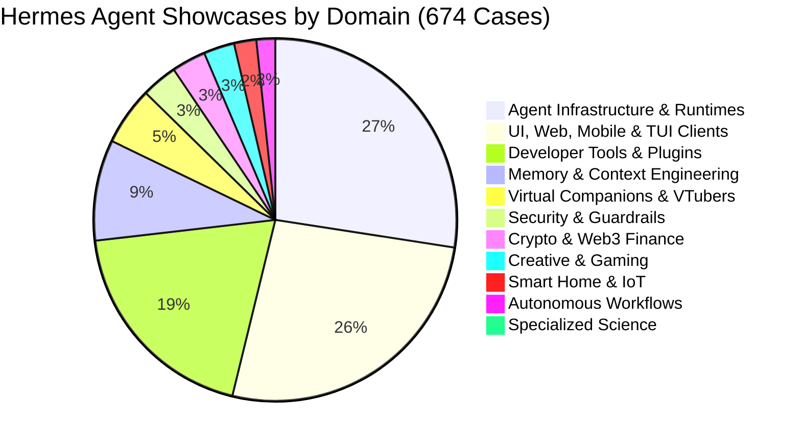

## hermes-advisor-skill

> > **Project Mission:** Ingest, structure, enrich, and analyze the complete community history of **Hermes Agent** and Nous Research models from the official Discord archives (`teknium1/nous-discord-archive`), and power an autonomous **Hybrid-RAG Idea & Architecture Advisory Engine (`hermes-advisor`)**.

# Hermes Agent Ecosystem Intelligence & Advisory Project (`AGENTS.md`)

> **Project Mission:** Ingest, structure, enrich, and analyze the complete community history of **Hermes Agent** and Nous Research models from the official Discord archives (`teknium1/nous-discord-archive`), and power an autonomous **Hybrid-RAG Idea & Architecture Advisory Engine (`hermes-advisor`)**.

---

## 1. Project Overview & Key Achievements

1. **Complete Community Archive Ingestion:**
   - **883 Community Showcase Threads** parsed from `archives/community-projects-showcase/`.
   - **487 Community Plugins, Skills & Skins** parsed from `archives/plugins-skills-and-skins/`.
   - All raw text files preserved locally in [`data/raw/`](file:///Users/pedrorocha/Sites/hermesshowcases/data/raw/).
2. **Standardized Inference & Enrichment Pipeline:**
   - Applied a rigorous 22-attribute schema to **674 Hermes Agent cases** covering Problem, Solution, Market TAM, Target Audience, Monetization Blueprint, Unit Economics, Tech Stack, and Hermes Role.
   - Generated clean JSON, CSV spreadsheet, and queryable SQLite database exports.
3. **Local Hybrid-RAG Engine with SQLite FTS5:**
   - Sub-millisecond ranked BM25 full-text search indexing all 674 showcases and 487 plugins in [`data/enriched/hermes_rag.sqlite`](file:///Users/pedrorocha/Sites/hermesshowcases/data/enriched/hermes_rag.sqlite).
4. **Interactive Standalone Web Explorer:**
   - Zero-dependency, single-file HTML/CSS/JS dashboard in [`web/index.html`](file:///Users/pedrorocha/Sites/hermesshowcases/web/index.html) with live search, 11-domain filtering, profitability metrics, and modal detail views.
5. **Native `hermes-advisor` Skill & CLI Tools:**
   - Installed in [`.agents/skills/hermes-advisor/`](file:///Users/pedrorocha/Sites/hermesshowcases/.agents/skills/hermes-advisor/) so any agent can brainstorm ideas, recommend technical architectures, and generate build blueprints.

---

## 2. Directory Layout & Key Files

```
hermesshowcases/
├── AGENTS.md                                   # Root project specification (this file)
├── data/
│   ├── raw/                                    # Mirrored raw forum text files
│   │   ├── community-projects-showcase/        # 883 raw showcase threads
│   │   └── plugins-skills-and-skins/           # 487 raw plugin/skill files
│   ├── processed/                              # Clean parsed JSON records
│   │   ├── parsed_showcases.json
│   │   └── parsed_plugins.json
│   └── enriched/                               # Enriched structured datasets & databases
│       ├── all_showcases_enriched.json         # All 883 community showcases enriched
│       ├── hermes_agent_cases_enriched.json    # 674 Hermes Agent specific cases
│       ├── hermes_cases.csv                    # Spreadsheet export (Excel/Sheets)
│       ├── hermes_cases.sqlite                 # Queryable SQL database (table: hermes_cases)
│       └── hermes_rag.sqlite                   # SQLite FTS5 full-text search RAG database
├── scripts/                                    # Python data & retrieval pipelines
│   ├── parse_showcases.py                      # Raw forum .txt parser
│   ├── enrich_showcases.py                     # 22-attribute inference & enrichment pipeline
│   ├── build_rag_index.py                      # Compiles SQLite FTS5 virtual tables
│   ├── query_knowledge.py                      # Hybrid-RAG BM25 query tool
│   ├── advisor_cli.py                          # Interactive blueprint generator
│   ├── build_web_viewer.py                     # Compiles web/index.html
│   ├── generate_reports.py                     # Generates comprehensive study report
│   └── generate_playbook.py                    # Generates monetization playbook
├── .agents/skills/hermes-advisor/              # Project skill discovered by Antigravity
│   ├── SKILL.md                                # Skill instructions & triggers
│   ├── scripts/                                # query_knowledge.py & advisor_cli.py
│   └── references/                             # Taxonomy & plugin catalogs
├── skills/hermes-advisor/                      # Standalone copy of the skill
├── web/
│   └── index.html                              # Standalone visual dashboard
├── reports/
│   ├── HERMES_AGENT_SHOWCASE_STUDY.md          # Comprehensive ecosystem research report
│   └── MONETIZATION_PLAYBOOK.md                # Commercialization & pricing playbook
└── docs/                                       # Detailed modular documentation
    ├── dataset.md                              # Data schema & pipeline specifications
    ├── taxonomy.md                             # 11-domain taxonomy & tech stacks
    ├── rag_and_skill.md                        # RAG engine & hermes-advisor skill guide
    ├── monetization.md                         # Unit economics & business models
    └── showcase_spotlights.md                  # Deep-dive spotlights on flagship cases
```

---

## 3. The 11-Domain Taxonomy Overview



1. **Agent Infrastructure & Runtimes (180 cases):** Local GGUF, AMD ROCm (*hipfire*), Apple Containers.
2. **UI, Web, Mobile & TUI Clients (173 cases):** Rust/Ratatui TUIs (*Hermes Gate*, *Herm*), Zed IDE integration.
3. **Developer Tools, Skills & Plugins (127 cases):** MCP bridges, automated skill testing (*Skill Autoresearch*).
4. **Memory & Context Engineering (59 cases):** *Mnemosyne*, *Anamnesis 5.0*, *RTK* token compressors.
5. **Virtual Companions & VTubers (34 cases):** *Hermes Waifu*, Live2D sprites, low-latency TTS/STT.
6. **Security & Guardrails (21 cases):** *CaMeL Guard*, prompt injection defense, sandboxing.
7. **Crypto, Web3 & Autonomous Finance (20 cases):** *Whale Signals Bot*, on-chain trading (*Molt Club*).
8. **Creative Media, Gaming & Worldsim (18 cases):** Godot 3D worldsim, interactive game NPCs.
9. **Smart Home, IoT & Telephony (13 cases):** Home Assistant add-on, *op.inc* un-sandboxed telephony.
10. **Autonomous Workflows & RPA (11 cases):** *MTG TCG Store*, *GroktoCrawl* self-hosted crawler.
11. **Specialized Science & Verticals (3 cases):** Quantum computing data fine-tunes, Sanskrit translation.

---

## 4. Quick Command Reference

| Task | Command |
| :--- | :--- |
| **Search Showcases / Plugins (RAG)** | `python3 scripts/query_knowledge.py "query" --limit 5` |
| **Generate Build Blueprint (CLI)** | `python3 scripts/advisor_cli.py "domain name"` |
| **Rebuild SQLite FTS5 RAG Index** | `python3 scripts/build_rag_index.py` |
| **Recompile Web Dashboard** | `python3 scripts/build_web_viewer.py` |
| **Re-run Full Enrichment Pipeline** | `python3 scripts/enrich_showcases.py` |

---

## 5. How AI Agents Should Use This Workspace

When helping users design, build, or monetize agents using Hermes:
1. **Activate `hermes-advisor`:** Check [`.agents/skills/hermes-advisor/SKILL.md`](file:///.agents/skills/hermes-advisor/SKILL.md) for reasoning guidelines.
2. **Run Knowledge Queries:** Use `scripts/query_knowledge.py` to retrieve verified community proofs and matching plugins before suggesting architectures.
3. **Reference Flagship Implementations:** Cite real project repositories (e.g. *Anamnesis* for memory, *CaMeL Guard* for security, *GroktoCrawl* for scraping).
4. **Structure Outputs:** Always output ideas in the standardized **Hermes Build Blueprint Card** format (Problem, Solution, Architecture, Community Precedents, Monetization, Implementation Roadmap).

---

## 6. Detailed Documentation Index (`docs/`)

- [**`docs/dataset.md`**](file:///Users/pedrorocha/Sites/hermesshowcases/docs/dataset.md): Complete data schema, pipeline scripts, and SQLite table definitions.
- [**`docs/taxonomy.md`**](file:///Users/pedrorocha/Sites/hermesshowcases/docs/taxonomy.md): In-depth breakdown of the 11 domain categories and technical patterns.
- [**`docs/rag_and_skill.md`**](file:///Users/pedrorocha/Sites/hermesshowcases/docs/rag_and_skill.md): Hybrid-RAG engine architecture and `hermes-advisor` skill guide.
- [**`docs/monetization.md`**](file:///Users/pedrorocha/Sites/hermesshowcases/docs/monetization.md): Unit economics, commercial archetypes, and market opportunities.
- [**`docs/showcase_spotlights.md`**](file:///Users/pedrorocha/Sites/hermesshowcases/docs/showcase_spotlights.md): Technical deep-dives into flagship community showcases.

---
> Source: [thebrightnest/hermes-advisor-skill](https://github.com/thebrightnest/hermes-advisor-skill) — distributed by [TomeVault](https://tomevault.io).
<!-- tomevault:4.0:gemini_md:2026-09-12 -->
