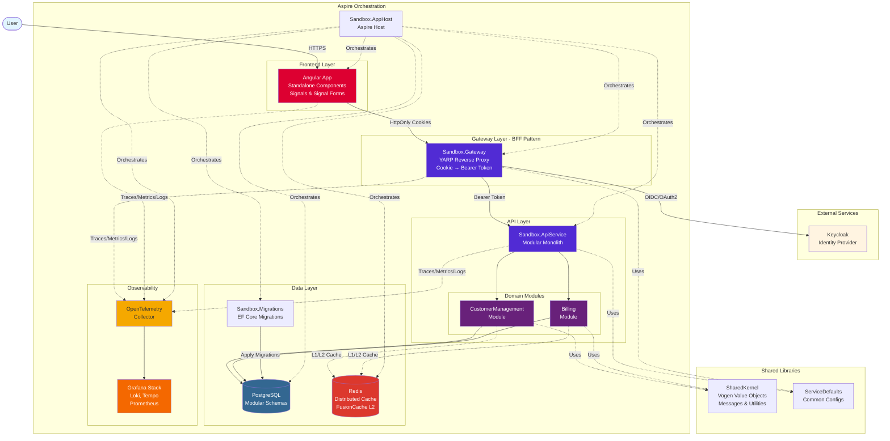
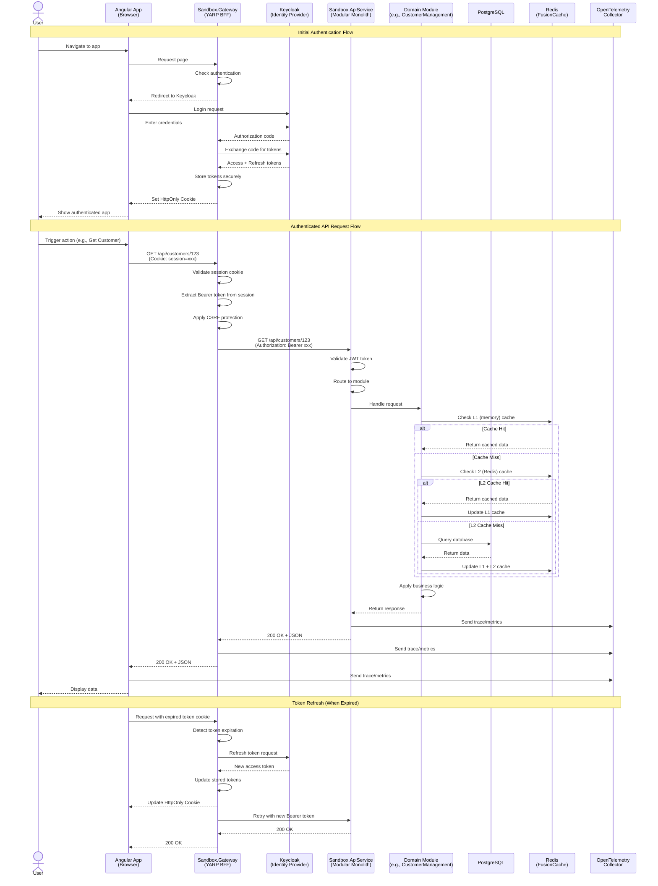
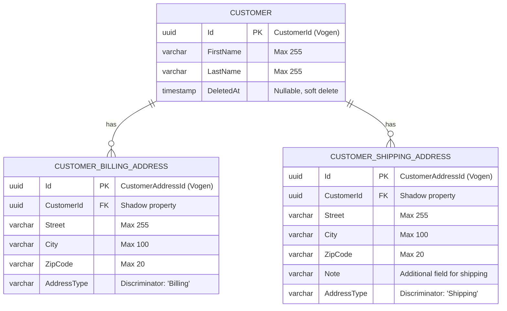

## sandbox

> The Sandbox Application is a monorepo containing an a .NET backend and a Angular frontend. It has a comprehensive testing strategy including unit, integration, architecture, and end-to-end tests.

# Critical System Understanding: Sandbox Application

The Sandbox Application is a monorepo containing an a .NET backend and a Angular frontend. It has a comprehensive testing strategy including unit, integration, architecture, and end-to-end tests.

## Architecture Foundation

**Monorepo**: All backend and frontend code lives in a single repository, enabling easier cross-team collaboration, consistent tooling, and simplified dependency management.

**Modular Monolith** + DDD: Clear bounded contexts. Each module implements IModule with separate schemas, DbContexts, and caching strategies. Always use TUnit for testing.

**BFF Pattern**: Gateway uses YARP to proxy requests, managing authentication server-side. Frontend never touches tokens—only HttpOnly cookies. The gateway automatically transforms cookies to Bearer tokens for API calls.

**Angular Frontend**: Modern Angular 21 app using standalone components, signals, and signal forms. Always Vitest for testing.

**Aspire Orchestration**: Aspire hosts the modular monolith, managing service lifecycles, configurations, and dependencies.

**Observability**: OpenTelemetry collector for metrics, traces, and logs across backend and frontend. Grafana (with loki, tempo, blackbox, prometheus) dashboards for visualization.

### System Architecture

The application follows a modular monolith architecture hosted by .NET Aspire with a BFF (Backend for Frontend) pattern for secure authentication:



**Key Architectural Decisions:**

- **Aspire Orchestration**: Single command (`dotnet run --project ./Sandbox.AppHost`) starts entire stack
- **BFF Pattern**: Gateway handles authentication, transforms cookies to Bearer tokens
- **Modular Monolith**: Each module has its own DbContext, schema, and bounded context
- **Security-First**: Tokens never exposed to frontend, only secure HttpOnly cookies
- **Observability-Ready**: OpenTelemetry integrated at all layers

### Request Flow

The following diagram illustrates how a typical authenticated API request flows through the system using the BFF pattern:



**Flow Highlights:**

1. **Authentication**: User logs in via Keycloak, Gateway stores tokens server-side and issues HttpOnly cookies to browser
2. **Cookie-to-Token Transform**: Gateway automatically converts session cookies to Bearer tokens for API calls
3. **CSRF Protection**: Gateway validates anti-forgery tokens via YARP transformers
4. **Hybrid Caching**: FusionCache provides L1 (in-memory) and L2 (Redis) caching with automatic backplane synchronization
5. **Token Refresh**: Gateway handles token refresh transparently without user interaction
6. **Observability**: Every layer emits traces/metrics to OpenTelemetry collector
7. **Security**: Frontend never sees tokens, only cookies; reduces XSS attack surface

### Technologies

- **Backend**: .NET 10, Entity Framework Core, YARP, Vogen, TUnit, ArchUnitNET.
- **Frontend**: Angular 21, TypeScript, no UI-library, Angular Testing Library, Vitest, Playwright.

## Core Commands

### Development

- **Start development**: `dotnet run --project ./Sandbox.AppHost`

### Build

- **Build .NET**: `dotnet build`
- **Build Angular**: `pnpm --filter="sandbox.angular-workspace" build`

### Test

- **Run all .NET tests**: `dotnet test`
- **Run Angular tests**: `pnpm --filter="sandbox.angular-workspace" test --watch=false`
- **Run End-to-end tests**: `pnpm --filter="sandbox.e2e" test --reporter=dot`

### Styling

- **Lint all frontend**: `pnpm -r lint`
- **Format .NET**: `dotnet format --severity info`
- **Format all**: `pnpm prettier --write .`

### Database Operations

- **EF migrations**: `dotnet ef migrations add <name> -project Sandbox.Migrations`.
- Migrations are applied automatically at startup.

### Major Components

#### Backend (.NET)

- **`Sandbox.AppHost`**: Aspire application host for service orchestration
- **`Sandbox.Gateway`**: YARP-based API gateway with BFF authentication (Keycloak)
- **`Sandbox.ApiService`**: Main API service, hosting the different domain modules
- **`Sandbox.Migrations`**: Database migration service
- **`Sandbox.ServiceDefaults`**: Shared service configurations
- **`Sandbox.SharedKernel`**: Domain primitives as value objects (Vogen), shared contracts (messages), common utilities
- **`Directory.Packages.props`**: Centralized package management

#### Domain Modules

- **`Sandbox.Modules.CustomerManagement`**: Customer domain with billing/shipping addresses
- **`Sandbox.Modules.Billing`**: Billing domain module

#### Frontend

- **`Sandbox.AngularWorkspace`**: Angular workspace with multiple projects
    - `sandbox-app`: Main application
    - `form-validation-lib`: Form validation library
    - `opentelemetry-lib`: OpenTelemetry instrumentation library
- **`pnpm-workspace.yaml`**: Use pnpm workspaces with catalogs for package management. For commands, always use `pnpm` at the root level with filters when needed.

#### Testing Projects

- **`Sandbox.Modules.*.Tests`**: Unit tests for each module (TUnit)
- **`Sandbox.IntegrationTests`**: Service integration tests (TUnit) in combination with test containers
- **`Sandbox.EndToEndTests`**: Playwright E2E tests with Keycloak authentication
- **`Sandbox.AngularWorkspace`**: Vitest unit tests for Angular following the syntax `*.spec.ts`
- **`Sandbox.Architectural.Tests`**: Architecture compliance tests (ArchUnitNET)

### Data Stores

- **Primary Database**: PostgreSQL (with option to switch to SQL Server)
- **Distributed Cache**: Redis with FusionCache hybrid L1/L2 caching and backplane for replica synchronization
- **Monitoring**: OpenTelemetry collector for metrics, traces, and logs.

### Database Schema

The application uses a modular database schema with separate schemas per module:



**Key Design Patterns:**

- **Strongly-typed IDs**: CustomerId and CustomerAddressId are Vogen value objects wrapping GUIDs
- **Table-per-Hierarchy (TPH)**: CustomerBillingAddress and CustomerShippingAddress share the `customeraddresses` table with discriminator column `AddressType`
- **Complex Properties**: FullName (FirstName + LastName) and Address (Street, City, ZipCode) are configured as owned types
- **Soft Deletes**: Global query filters automatically exclude entities where DeletedAt is not null
- **Shadow Properties**: Foreign keys like CustomerId are configured as shadow properties (not exposed in entity classes)
- **Modular Schemas**: Each module has its own database schema (customermanagement, billing) for clear bounded contexts

## Feature Flags

### When to Use Feature Flags

Use feature flags to:

- **Gate entire modules**: Enable/disable a domain module (e.g., `billing-enabled`) across both backend endpoints and frontend routes without deploying new code.
- **Gradual rollouts**: Ship a feature to production but keep it off until ready, then enable it through flagd without redeploying application code.
- **Safe cleanup**: A flag that has been enabled and stable can be removed. A flag introduced recently is still needed.

### Why This Approach

- **OpenFeature standard**: The backend uses the [OpenFeature](https://openfeature.dev/) SDK with the flagd provider, so the provider can be swapped later without changing application code.
- **Server-side authority**: Flags are resolved on the backend. The frontend receives values for known `FeatureFlagKeys` via the BFF endpoint, while flag values are managed by flagd.
- **Observability built-in**: `TracingHook`, `MetricsHook`, and `LoggingHook` are registered automatically so every flag evaluation is traced, measured, and logged.
- **Aspire-managed flag server**: `Sandbox.AppHost` hosts flagd and passes its connection string to API and Gateway resources.

### How Feature Flags Work

**Configuration** — Flag values are defined in `config/flagd/flagd.json` and synchronized into the Aspire-managed flagd container:

```json
{
  "flags": {
    "billing-enabled": {
      "state": "ENABLED",
      "variants": {
        "on": true,
        "off": false
      },
      "defaultVariant": "on"
    }
  }
}
```

Known feature flag keys live in `Sandbox.SharedKernel.FeatureFlags.FeatureFlagKeys`.

**Backend — gating an endpoint** — Call `.WithFeatureFlag("flag-key")` on any minimal-API route. The `FeatureFlagEndpointFilter` returns `404` when the flag is disabled:

```csharp
app.MapGet("/billing/invoices", ...)
   .WithFeatureFlag("billing-enabled");
```

**Backend — setup** — Call `builder.AddFeatureFlags()` once in each service (`ApiService`, `Gateway`) startup. This registers OpenFeature with the flagd provider, uses the Aspire-provided `flagd` connection string when available, and wires up all observability hooks.

**Frontend — checking a flag** — Inject the `FeatureFlags` service and call `isEnabled(flagKey)`. The service fetches the flag list from `/bff/feature-flags` on startup:

```typescript
const featureFlags = inject(FeatureFlags);
featureFlags.isEnabled('billing-enabled'); // boolean
```

**Frontend — guarding a route** — Use `featureFlagGuard('flag-key')` as a `canMatch` guard. It waits until flags are loaded, then allows or blocks navigation:

```typescript
{
  path: 'billing',
  canMatch: [() => featureFlagGuard('billing-enabled')],
  loadComponent: () => import('./billing/billing.component'),
}
```

**Full flow summary:**

1. `Sandbox.AppHost` starts flagd and syncs `config/flagd/flagd.json` into the container.
2. API and Gateway receive the `flagd` connection string through Aspire resource references.
3. Backend routes use OpenFeature with the flagd provider to evaluate flags.
4. Gateway exposes `GET /bff/feature-flags` returning flags listed in `FeatureFlagKeys`, with values evaluated from flagd.
5. Angular `FeatureFlags` service fetches this list and makes it available as signals.
6. Backend routes use `WithFeatureFlag` to return 404 for disabled flags.
7. Frontend routes use `featureFlagGuard` to redirect away when a flag is off.

## Security

### User Authentication

- **Identity Provider**: Keycloak
- **BFF Pattern**: with YARP
- **Cookies**: for session management, no tokens in frontend storage
- **Token Management**: Automatic token refresh in BFF layer, not exposed to frontend but used in API projects

### Security Features

- **OWASP Top 10**: Always consider during development ( Broken Access Control, Insecure Design, Mishandling of Exceptional Conditions, etc.)
- **CSRF Protection**: Custom antiforgery tokens via YARP transformers
- **Cookie Security**: Only secure, HttpOnly cookies for session tokens

### Secret Management

Use SOPS for encrypting sensitive configuration files.
When a change is made to the appsettings, always update the encrypted version as well.

- **Encrypted Config**: `config/appsettings.encrypted.json`
- **Decrypt**: `sops --decrypt "config/appsettings.encrypted.json" > "Sandbox.AppHost/appsettings.json"`
- **Encrypt**: `sops --encrypt "Sandbox.AppHost/appsettings.json" > "config/appsettings.encrypted.json"`
- **Pattern**: Only fields matching `Secret|Password|Key|Token` are encrypted

---
> Source: [timdeschryver/Sandbox](https://github.com/timdeschryver/Sandbox) — distributed by [TomeVault](https://tomevault.io).
<!-- tomevault:4.0:gemini_md:2026-05-20 -->
