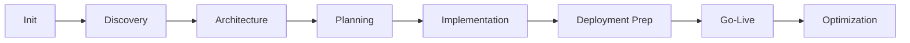

## prps-agentic-eng

> This file provides guidance to Claude Code when working with the distributed agent coordination system and PRP methodology in this repository.

# CLAUDE.md - Agent Coordination & PRP Framework

This file provides guidance to Claude Code when working with the distributed agent coordination system and PRP methodology in this repository.

## 🎯 Project Nature

This is a **Distributed Agent Coordination Framework** with **PRP (Product Requirement Prompt) Methodology**. The system enables 10 specialized AI agents to work in parallel with minimal context loading, delivering production-ready code through orchestrated collaboration.

## 🤖 Agent System Overview

### The 10 Specialized Agents

1. **PRP Orchestrator** - Coordinates workflow, manages phases, ensures quality gates
2. **Business Analyst** - Requirements, user stories, success metrics, ROI analysis
3. **Context Researcher** - Codebase investigation, documentation research, gotcha identification
4. **Implementation Specialist** - Core development, code implementation, feature building
5. **Validation Engineer** - Testing, quality assurance, acceptance criteria validation
6. **Integration Architect** - System design, API contracts, service integration
7. **Documentation Curator** - Documentation generation, user guides, API docs
8. **Security Auditor** - Security assessment, compliance verification, threat modeling
9. **Performance Optimizer** - Performance tuning, optimization, scalability planning
10. **DevOps Engineer** - Deployment, infrastructure, CI/CD, monitoring

### Optional: Archon MCP Server Enhancement

The framework supports optional integration with [Archon MCP Server](https://github.com/coleam00/Archon) for enhanced capabilities:

- 🧠 **Knowledge Base**: RAG-powered search across PRPs, docs, and code
- 📊 **Visual Dashboard**: Web UI for project and task management
- 👥 **Team Collaboration**: Real-time sync across multiple developers
- 🤖 **AI-Enhanced**: Smart task suggestions and context retrieval
- 🔌 **Optional**: File-based system continues to work without Archon

**See [ARCHON-INTEGRATION.md](ARCHON-INTEGRATION.md) for setup and usage.**

### Agent Coordination Principles

```yaml
coordination:
  task_assignment: "Lock-free claiming via session files"
  context_loading: "Agent-specific views (2-5KB vs 50KB+)"
  communication: "JSON-based registry and sync files"
  handoffs: "Structured protocol with notes and file tracking"
  parallel_work: "Multiple agents on different features simultaneously"
```

## 📁 Core Architecture

### Distributed Workspace Structure

```
.agent-system/              # Agent coordination layer
├── registry/               # Lightweight task management
│   ├── tasks.json         # Central task registry (minimal, efficient)
│   └── dependencies.json  # Task dependency graph
├── sessions/              # Multi-session coordination
│   ├── active/*.lock      # Current session locks
│   └── history/           # Completed sessions
├── agents/{agent}/        # Per-agent workspace
│   ├── context.json       # Agent configuration
│   ├── tasks.json         # Assigned tasks
│   └── changelog.md       # Change history
└── sync/                  # Cross-agent communication
    ├── broadcasts.json    # Important updates all agents see
    ├── handoffs.json      # Task transitions between agents
    └── conflicts.json     # Merge conflict tracking
```

### Context Minimization Strategy

The framework uses a multi-layer approach to minimize context loading:

#### Layer 1: Agent-Specific Views (PRPs/.cache/agent-views/)
```bash
# Generate lightweight views (2-5KB each from 50KB+ PRPs)
python scripts/generate-agent-views.py --all

# Result: 90-95% context reduction
# Business Analyst: Goal, Why, Success Criteria sections only
# Implementation: Technical details, no planning docs
# Validation: Test requirements, no architecture
```

#### Layer 2: Context Loader Configuration (.claude/context-loader.yaml)
```yaml
agents:
  implementation-specialist:
    always_load: [context.json, current_task.json]  # ~2KB
    conditional_load: [task_brief.md, api_contract.md]  # ~3KB
    never_load: [full_prps/*.md, other_agents/logs]  # Saves 45KB+
    max_context_tokens: 8000

  business-analyst:
    always_load: [context.json, tasks.json]
    conditional_load: [requirements.md, user-stories.md]
    max_context_tokens: 8000

  validation-engineer:
    always_load: [context.json, tasks.json]
    conditional_load: [test-requirements.md]
    never_load: [architecture/*.md, planning/*.md]
    max_context_tokens: 8000
```

#### Layer 3: Task-Specific Briefs (PRPs/.cache/task-briefs/)
```bash
# Generate brief for specific task (contains only relevant context)
python scripts/generate-agent-views.py --task TASK-001

# Task brief includes:
# - Task metadata (title, status, priority)
# - Referenced PRP sections only
# - Specific file paths
# - Acceptance criteria
```

**Context Budget**: Maximum 50,000 tokens total across all agents per session
**Per-Agent Budget**: 6,000-12,000 tokens depending on role complexity
**Actual Usage**: 2,000-5,000 tokens after optimization

## 🔄 Workflow Orchestration

### Phase-Based Execution



### Workflow Types

| Type | Duration | Agents | Use Case |
|------|----------|--------|----------|
| **Standard** | 1-2 weeks | All 10 | Complex features |
| **Hotfix** | 2-4 hours | 3-4 | Emergency fixes |
| **Small Feature** | <1 day | 4-5 | Simple additions |
| **Research** | Variable | 2-3 | Technical investigation |

## 🛠️ Development Commands

### Agent Task Management

**File-Based (Default)**:
```bash
# Create new task
python scripts/agent-task-manager.py create \
  --title "Implement feature X" \
  --priority high \
  --hours 8

# Agent claims task
python scripts/agent-task-manager.py claim \
  --agent implementation-specialist \
  --task TASK-001

# Complete task
python scripts/agent-task-manager.py complete \
  --task TASK-001 \
  --notes "Implementation complete, tests passing"

# Handoff to another agent
python scripts/agent-task-manager.py handoff \
  --task TASK-001 \
  --to-agent validation-engineer \
  --notes "Ready for integration testing"
```

**With Archon MCP (Optional)**:
```bash
# Create task with MCP sync
python scripts/agent-task-manager.py create \
  --title "Implement feature X" \
  --priority high \
  --hours 8 \
  --use-mcp archon

# Sync tasks between local and Archon
python scripts/archon-sync.py sync-to    # Upload to Archon
python scripts/archon-sync.py sync-from  # Download from Archon

# Search knowledge base
python scripts/archon-sync.py search --query "authentication patterns"

# View in Archon Web UI
open http://localhost:3000
```

### Context Generation

```bash
# Generate lightweight agent views (2-5KB each)
python scripts/generate-agent-views.py --all

# Generate specific agent view
python scripts/generate-agent-views.py --agent implementation-specialist

# Generate task brief
python scripts/generate-agent-views.py --task TASK-001
```

### PRP Execution with Agents

```bash
# Orchestrator coordinates PRP execution
/prp-planning-create [feature description]
/prp-base-execute PRPs/[feature].md

# Interactive mode with agent
uv run PRPs/scripts/prp_runner.py --prp [name] --interactive
```

## 📋 Critical Success Patterns

### Agent Collaboration Patterns

#### Parallel Execution
```python
# Multiple agents work simultaneously
tracks = {
    "backend": ["implementation-specialist", "validation-engineer"],
    "frontend": ["implementation-specialist", "documentation-curator"],
    "infrastructure": ["devops-engineer", "security-auditor"]
}
```

#### Sequential Handoff
```python
# Clear handoff protocol
handoff = {
    "from": "implementation-specialist",
    "to": "validation-engineer",
    "task": "TASK-001",
    "status": "implementation-complete",
    "files_modified": ["src/auth.py", "tests/test_auth.py"],
    "next_actions": ["Run integration tests", "Verify security"]
}
```

### PRP Methodology with Agents

1. **Phase 0**: Orchestrator initializes, loads context
2. **Phase 1**: Business Analyst creates requirements
3. **Phase 2**: Integration Architect designs system
4. **Phase 3**: Orchestrator creates implementation PRPs
5. **Phase 4**: Implementation Specialist executes
6. **Phase 5**: DevOps prepares deployment
7. **Phase 6**: DevOps deploys, all agents monitor
8. **Phase 7**: Performance Optimizer tunes system

### Validation Gates (Per Phase)

```bash
# Phase 1: Requirements Complete
[ ] User stories documented
[ ] Success metrics defined
[ ] Stakeholder approval

# Phase 2: Architecture Approved
[ ] API contracts defined
[ ] Security requirements integrated
[ ] Performance targets set

# Phase 4: Implementation Complete
[ ] Code coverage >80%
[ ] All tests passing
[ ] Security scan clean

# Phase 6: Deployment Ready
[ ] Infrastructure configured
[ ] Monitoring active
[ ] Rollback tested
```

## 🚫 Anti-Patterns to Avoid

### Agent Coordination Anti-Patterns
- ❌ Don't load full PRPs for every agent (wastes context)
- ❌ Don't skip handoff protocols (causes confusion)
- ❌ Don't bypass validation gates (quality suffers)
- ❌ Don't let agents work without session locks (conflicts)
- ❌ Don't ignore the orchestrator (chaos ensues)

### Context Loading Anti-Patterns
- ❌ Don't load other agents' changelogs
- ❌ Don't load full documentation when brief suffices
- ❌ Don't keep stale context in memory
- ❌ Don't load files outside agent's scope

## 🎯 Working with This Framework

### Quick Start Guide

#### 1. Initialize the System (First Time)

```bash
# Bootstrap the workspace structure
./init-agent-workspace.sh

# Verify setup
python scripts/agent-task-manager.py status
ls .agent-system/agents
ls PRPs/.cache/agent-views
```

#### 2. Start a New Project

```bash
# In Claude Code, initialize agents
/prime-core
"Load AGENT-ORCHESTRATION.md and initialize all agents for: [project description]"

# Orchestrator coordinates workflow
"PRP Orchestrator, initiate standard workflow for [project]"
```

#### 3. Track Progress

```bash
# View PRP status
ls PRPs/planning/active/          # Currently being planned
ls PRPs/implementation/in-progress/  # Currently being built

# View task status
python scripts/agent-task-manager.py status
python scripts/agent-task-manager.py list --status in-progress

# View agent activity
ls .agent-system/sessions/active/    # Active agent sessions
tail .agent-system/agents/*/changelog.md  # Recent changes
```

#### 4. Context Optimization

```bash
# ALWAYS regenerate agent views after PRP changes
python scripts/generate-agent-views.py --all

# Check context sizes
ls -lh PRPs/.cache/agent-views/

# Clean stale cache
python scripts/generate-agent-views.py --clean --all
```

### When Starting a Project

1. **Always start with Phase 0**:
   ```
   /prime-core
   "Load AGENT-ORCHESTRATION.md and initialize all agents"
   ```

2. **Let Orchestrator coordinate**:
   ```
   "PRP Orchestrator, initiate standard workflow for [project]"
   ```

3. **Follow phase progression**:
   - Complete validation gates before proceeding
   - Use decision points to determine next steps
   - Move PRPs through lifecycle: backlog → active → completed

### When an Agent Works on a Task

1. **Claim the task**:
   ```python
   # Creates session lock, updates registry
   claim_task(agent_name="implementation-specialist", task_id="TASK-001")
   ```

2. **Load minimal context**:
   ```python
   # Agent loads only their view (2-5KB)
   context = load_agent_view("implementation-specialist")
   task_brief = load_task_brief("TASK-001")
   ```

3. **Execute work**:
   - Follow task brief
   - Update changelog
   - Modify assigned files

4. **Handoff or complete**:
   ```python
   # Either complete or handoff to next agent
   complete_task("TASK-001") or handoff_task("TASK-001", "validation-engineer")
   ```

### Command Usage with Agents

#### Orchestration Commands
- `/prime-core` - Initialize system
- `/prp-planning-create` - Phase 1 planning
- `/api-contract-define` - Phase 2 contracts
- `/prp-base-execute` - Phase 4 execution

#### Agent-Specific Commands
- Business Analyst: `/user-story-rapid`, `/task-list-init`
- Implementation: `/prp-task-execute`, `/refactor-simple`
- Validation: `/review-general`, `/review-staged-unstaged`
- DevOps: `/smart-commit`, `/create-pr`

## 📊 Monitoring & Metrics

### Task Registry Statistics
```json
{
  "total": 45,
  "completed": 32,
  "in_progress": 5,
  "blocked": 2,
  "pending": 6
}
```

### Agent Utilization
```bash
# Check agent activity
find .agent-system/agents -name "changelog.md" -exec tail -n 5 {} \;

# Active sessions
ls -la .agent-system/sessions/active/
```

### Phase Completion Tracking
```bash
# Milestone status
cat .agent-system/registry/milestones.md

# Phase reports
ls reports/phase-completions/
```

## 🔧 Configuration

### Context Loader Configuration
```yaml
# .claude/context-loader.yaml
global:
  max_total_context: 50000
  compression_enabled: true
  cache_duration_minutes: 30

agents:
  orchestrator:
    max_context_tokens: 12000  # Needs more for coordination
  implementation-specialist:
    max_context_tokens: 8000   # Focused on code
```

### Stack Detection
```yaml
# stacks/.stack-detection.yaml
rules:
  - pattern: "**/*.py"
    stack: "python"
    tools: [pytest, black, mypy]
  - pattern: "**/*.java"
    stack: "java"
    tools: [junit, maven]
```

## 💡 Best Practices

### For Optimal Agent Coordination

1. **Minimize Context**: Always use agent views, not full documents
2. **Clear Handoffs**: Use structured handoff protocol with notes
3. **Respect Gates**: Don't proceed until validation passes
4. **Track Changes**: Maintain detailed changelogs per agent
5. **Parallel Work**: Leverage multi-agent capabilities
6. **Session Management**: One task per session, clear locks
7. **Progressive Enhancement**: Start simple, validate, enhance

### For PRP Success

1. **Context is King**: Include all necessary documentation
2. **Validation Loops**: Provide executable tests
3. **Information Dense**: Use codebase patterns
4. **Structured Format**: Follow PRP templates

## 🚀 Quick Reference

### Initialize System
```bash
/prime-core
"Load AGENT-ORCHESTRATION.md and initialize all agents"
```

### Start Project
```bash
"PRP Orchestrator, initiate standard workflow for [project]"
```

### Emergency Response
```bash
"All agents, emergency collaboration on [critical issue]"
```

### Check Status
```bash
python scripts/agent-task-manager.py status
cat .agent-system/registry/milestones.md
```

---

**Remember**: This framework enables **parallel agent coordination with minimal context loading**. The goal is **one-pass implementation success** through **comprehensive orchestration** and **intelligent task distribution**.

**Version**: 2.0.0 | **Framework**: Distributed Agent Coordination with PRP Methodology

---
> Converted and distributed by [TomeVault](https://tomevault.io/claim/TobiAiHawk) — claim your Tome and manage your conversions.
<!-- tomevault:4.0:gemini_md:2026-04-09 -->
