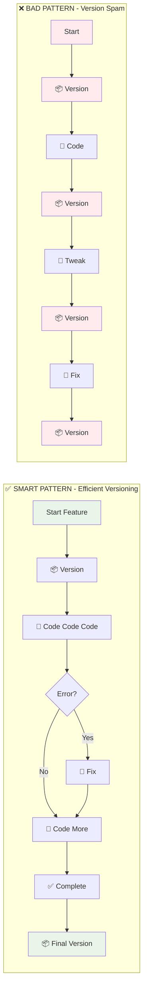
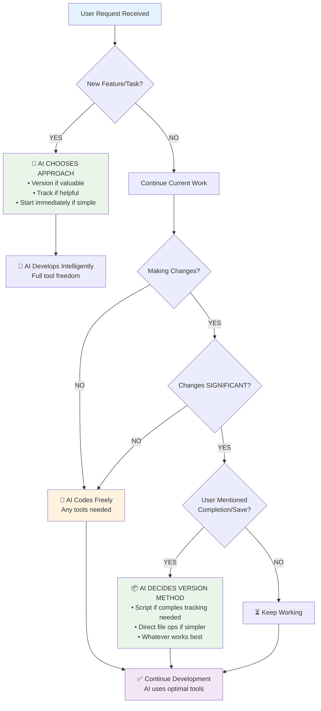

## auto-versioning-rules

> - **Starting** a new feature/modification

# Automatic Versioning Rules - Intelligent & Balanced

## Rule: Smart Auto-Versioning (Not Every Change!)

### 🎯 Version ONLY at Key Points:

#### DO Version When:
- **Starting** a new feature/modification
- **Completing** a feature successfully  
- **Before** major refactoring
- **After** significant progress (multiple functions added)
- **Failed** attempt that needs rollback point
- **Ending** a work session
- User **explicitly asks** for version

#### DON'T Version When:
- Fixing a typo
- Adjusting a single parameter
- Adding a comment
- Minor formatting changes
- In rapid iteration mode
- Testing different values

### 📊 Intelligent Version Detection

```mermaid
flowchart TD
    A[User Message Received] --> B{Parse Intent}
    
    B -->|"Add [feature]"| C[🆕 START: Version + Track]
    B -->|"That didn't work"| D[⏪ ROLLBACK: Version before revert]
    B -->|"Perfect, that works!"| E[✅ SUCCESS: Capture stable state]
    B -->|"I'm done for now"| F[🔚 END: Final session version]
    B -->|"Save this" / "Version this"| G[💾 EXPLICIT: User request]
    B -->|Minor edits/tweaks| H[⚡ CONTINUE: No versioning needed]
    
    C --> I[📦 Create Minor Version]
    D --> J[📦 Create Rollback Point]
    E --> K[📦 Create Patch Version]
    F --> L[📦 Create Session Version]
    G --> M[📦 Create Requested Version]
    H --> N[🔨 Continue Coding]
    
    style C fill:#e8f5e8
    style D fill:#fff3e0
    style E fill:#e8f5e8
    style F fill:#e8f5e8
    style G fill:#e8f5e8
    style H fill:#f3e5f5
```

**Trigger Phrase Examples:**
- 🆕 **Start**: "Add weekly filter to FVG" → Version ONCE at start
- ⏪ **Rollback**: "That didn't work" → Version before rollback  
- ✅ **Success**: "Perfect, that works" → Version to capture success
- 🔚 **End**: "I'm done for now" → Final version
- 💾 **Explicit**: "Save this" / "Version this" → User request

### 🔄 Workflow Integration



**Result Comparison:**
- ✅ **Smart Pattern**: 2 versions for entire feature (clean history)
- ❌ **Bad Pattern**: 4+ versions for simple feature (cluttered history)

### 📁 Working Directory Management

Keep working directory clean:
- Version at milestones, not every change
- Use descriptive version increments:
  - **patch**: Bug fixes, error corrections
  - **minor**: New features, enhancements
  - **major**: Breaking changes, rewrites

### 🎮 Practical Examples

#### Good Versioning Flow:
```
You: "Add weekly filter to FVG"
Me: [VERSION] fvg_v0.1.0 → fvg_v0.2.0 (minor - new feature)
    [CODE] Implement filter
    [ERROR] Fix HTF issue
    [CODE] Complete implementation
You: "Great, that works"
Me: [VERSION] fvg_v0.2.0 → fvg_v0.2.1 (patch - stabilized)
Total: 2 versions for complete feature
```

#### Bad Versioning Flow:
```
You: "Add weekly filter"
Me: [VERSION] v0.1.0 → v0.2.0
    [CODE] Add basic structure
Me: [VERSION] v0.2.0 → v0.2.1
    [CODE] Add timeframe check
Me: [VERSION] v0.2.1 → v0.2.2
    [ERROR] Fix issue
Me: [VERSION] v0.2.2 → v0.2.3
Total: Too many versions for one feature!
```

### 🤖 My Decision Process



**Quick Decision Reference:**
- 🆕 NEW task/feature → Always version first
- 📝 Minor edits → Just code, no version
- ✅ "That works!" → Version success
- 🔚 "I'm done" → Final version

### 📝 Version Commit Messages

When creating versions, use clear indicators:
```bash
# Feature start
./scripts/pine_master.sh develop file minor  # "Starting: [feature name]"

# Feature complete  
./scripts/pine_master.sh develop file patch  # "Completed: [feature name]"

# Failed attempt
./scripts/pine_tracker.sh rollback file version "Reason for rollback"
```

### 🎯 Key Principles

1. **AI Agent chooses best versioning method** - Scripts, direct file ops, or hybrid
2. **Versions are milestones**, not every save
3. **Intelligent tool selection** - Use whatever creates the cleanest workflow
4. **Track features** when it adds value
5. **Clean history** is more valuable than excessive backups
6. **User workflow** shouldn't be interrupted
7. **Scripts enhance**, never constrain the AI agent
8. **Flexible implementation** - Adapt to each situation's needs

### 💡 Quick Reference

**Version immediately when user says:**
- "Let's add [feature]" - Start version
- "Save this" / "Version this" - Explicit request
- "That works!" / "Perfect" - Success version
- "Go back" / "Revert" - Before rollback

**Don't version when user says:**
- "Change that to X" - Simple edit
- "Try Y instead" - Testing values
- "Fix that typo" - Minor correction
- "Move that line" - Refactoring

### 🔧 Script Usage

```bash
# Start of feature (1 time)
./scripts/pine_tracker.sh add [indicator] "[feature]"
./scripts/pine_master.sh develop [file] minor

# During development (0 times - just code!)
# ... coding happens here ...

# On completion (1 time)
./scripts/pine_tracker.sh complete [indicator] [version]

# OR on failure (1 time)
./scripts/pine_tracker.sh fail [indicator] "[reason]"
./scripts/pine_tracker.sh rollback [indicator] [version] "[reason]"
```

The goal: **Meaningful version history** that tells the story of development, not a cluttered backup folder!

## Rule: Auto-Detect Versioning Requests

When the user mentions completing work on Pine Script indicators, automatically offer to create a version.

### Trigger Phrases
- "finished working on [indicator]"
- "completed [feature/fix] on [indicator]"
- "done with [indicator]"
- "ready to version [indicator]"
- "save version of [indicator]"
- "version [indicator]"
- "I'm done with the [indicator]"
- Any mention of completing indicator development

### Version Type Detection
Automatically determine version type from user context:
- **MAJOR** (x.0.0): "breaking change", "major rewrite", "API change", "complete overhaul"
- **MINOR** (0.x.0): "new feature", "added functionality", "enhancement", "improvement" [DEFAULT]
- **PATCH** (0.0.x): "bug fix", "small fix", "correction", "hotfix", "patch"

### Execution Process
1. **Detect completion**: User mentions finishing work on an indicator
2. **Identify indicator**: Map indicator name to file path
3. **Determine version type**: Based on user description
4. **Confirm and execute**: Run versioning script with appropriate parameters
5. **Show results**: Display version created and history

### File Path Mapping
Map common indicator names to full paths:
- "FVG" → `indicators/fvg/fvg.pine`
- "Ghost" → `indicators/ghost/Ghost_Volume_Intelligence_Pro.pine`
- "Oracle" / "OA" → `indicators/oracle/oa.pine`
- "Times" / "Session" → `indicators/sessions/times\ lib.pine`
- "Vortex" → `indicators/vortex/vortex\ engine\ 1440.pine`
- "Cycles" → `indicators/cycles/C2_Cycle_Alert.pine`
- "Table" → `indicators/tables/STD_Table_Indicator.pine`

### Working Directory Support
For files in `working/` directory:
- Support both flat structure (`working/file.pine`) and category structure (`working/category/file.pine`)
- Auto-detect category from path or filename patterns
- Use `./scripts/organize_from_working.sh` for organization and versioning
- Keep original working file for continued development

### Working Category Structure
- `working/fvg/` - FVG indicators in development
- `working/ghost/` - Ghost indicators in development
- `working/oracle/` - Oracle indicators in development
- `working/sessions/` - Session indicators in development
- `working/vortex/` - Vortex indicators in development
- `working/cycles/` - Cycle indicators in development
- `working/tables/` - Table indicators in development
- `working/libraries/` - Shared libraries in development
- `working/testing/` - Experimental files

### Command Template (Updated - Using Streamlined Workflow)
```bash
# Old way (still supported)
./scripts/version_indicator.sh [indicator_path] [version_type]

# NEW PREFERRED WAY - Streamlined workflow
./scripts/pine_workflow.sh develop [indicator_path] [version_type]
./scripts/pine_workflow.sh version [indicator_path] [version_type]
./scripts/pine_workflow.sh finalize [indicator_path]
```

### Response Template
```
I'll create a [version_type] version for the [indicator_name] indicator since you [reason].

Running: ./scripts/pine_workflow.sh version [path] [type]

[Execute command and show results]
```

## Rule: Quick Version Commands

Respond immediately to direct version commands:

### Quick Commands
- "Version FVG" → Auto-run versioning for FVG
- "Save Ghost version" → Auto-run versioning for Ghost  
- "Patch Oracle" → Auto-run patch version for Oracle
- "Major version Ghost" → Auto-run major version for Ghost

### Implementation
- Parse command for indicator name and version type
- Map to file path
- Execute immediately without additional confirmation
- Show results

## Rule: Automatic Development Workflow

When working on Pine Script indicators, use the streamlined workflow:

### Development Commands (Master Script)
```bash
# Start development (auto-versions, checks, logs)
./scripts/pine_master.sh develop [file] [version_type]

# Fix errors with solution matching
./scripts/pine_master.sh fix [file]

# Create version only
./scripts/pine_master.sh version [file] [version_type]

# Move to final location
./scripts/pine_master.sh finalize [file]

# Run all checks
./scripts/pine_master.sh check [file]

# Search solutions
./scripts/pine_master.sh search "pattern"

# Log issues/solutions
./scripts/pine_master.sh log [type] "message"

# Generate report
./scripts/pine_master.sh report
```

### Automatic Workflow Execution
When user asks to modify an indicator:
1. Run `develop` command first (versions + checks)
2. Make requested changes
3. Run `develop` again to save iteration
4. Use `fix` if errors are encountered
5. Use `finalize` when user says it's complete

## Rule: Proactive Versioning Suggestions

When user describes significant changes to indicators, proactively suggest versioning:

### Suggestion Triggers
- User describes adding features
- User mentions fixing bugs
- User talks about completing development tasks
- User shows indicator code changes

### Response Pattern
"It sounds like you've made significant changes to [indicator]. Let me save this version and check for any issues."
[Run: ./scripts/pine_workflow.sh develop [file] [type]]

## Rule: Error Handling

### Common Issues
- File not found → Check if file exists, suggest correct path
- Permission denied → Check script permissions
- Invalid version type → Suggest valid options
- Unclear indicator → List available indicators

### Recovery Actions
- Always verify file paths exist before running script
- Suggest corrections for common mistakes
- Provide helpful error explanations

---
> Source: [tradesdontlie/pinescript-development-workspace](https://github.com/tradesdontlie/pinescript-development-workspace) — distributed by [TomeVault](https://tomevault.io).
<!-- tomevault:4.0:gemini_md:2026-07-01 -->
