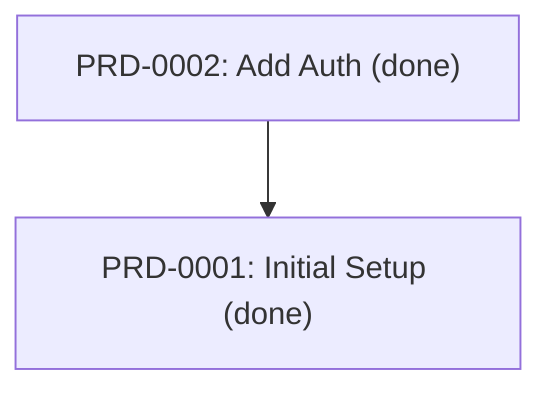
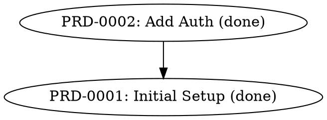

## microralph

> This document provides detailed workflows and troubleshooting for AI coding agents working in this repository.

# microralph — Agents Guide

This document provides detailed workflows and troubleshooting for AI coding agents working in this repository.

## Workspace Overview

This project is a Cargo workspace with the root binary crate and optional sub-crates:

- `src/`: Main Rust source code (root `microralph` crate — the `mr` binary)
  - `commands/`: CLI command implementations (bootstrap, devcontainer, graph, init, refactor, reindex, run, status, suggest, validate, worktree)
  - `config/`: Configuration loading and constitution editing
  - `prd/`: PRD types, parsing, indexing, and operations (edit, new, finalize)
  - `prompt/`: Prompt loading and expansion
  - `runner/`: Runner implementations (copilot, claude, codex, mock)
  - `util/`: Shared utilities (colors, spinner, qa_workflow)
  - `worktree/`: Worktree orchestration (types, state, git helpers, IPC, daemon)
  - `main.rs`: CLI entry point
  - `changelog.rs`: Changelog generation
- `crates/mr-ui/`: UI dashboard crate (feature-gated behind `ui` feature in root)
  - Built with Leptos 0.8, Axum 0.8, and Thaw UI 0.5
  - Feature-gated: only compiled when `--features ui` is passed
  - Has `ssr` and `hydrate` features for server and client compilation
- `.mr/`: microralph state directory
  - `prds/`: PRD files
  - `templates/`: PRD templates
  - `prompts/`: Static prompt files for each stage
  - `skills/`: Agent-managed persistent skills (learned techniques reused across runs)
  - `PRDS.md`: Auto-generated PRD index
  - `worktrees/`: Worktree orchestration state (state.yaml, daemon.sock, daemon.pid)

## Quick Start

```bash
# Build
cargo build

# Test
cargo make test

# Full CI (fmt, clippy, test)
cargo make ci

# UAT (the one true gate)
cargo make uat

# Dev container (start and exec into container)
cargo make devcontainer
```

## PRD Creation Workflow (`mr new`)

The `mr new` command creates a new PRD through a single-phase interactive flow:

1. **Interactive Session**: The user is dropped directly into an interactive chat session with the underlying agent (Copilot or Claude). The agent has full project context (existing PRDs, constitution, codebase scan) injected via the prompt — along with the next PRD ID and target file path. The agent gathers info from the user, writes the PRD file directly to disk in `.mr/prds/`, and tells the user to exit.
2. **Validation**: On clean exit, the Rust side scans `.mr/prds/` for the newly created PRD file, validates it, and regenerates the index. If no file was created, a placeholder PRD is generated.
3. **Abort on Ctrl+C**: If the user force-quits (Ctrl+C / SIGINT) during the interactive session, PRD creation is aborted entirely — no partial PRD is created.

### Runner Interactive Mode

The `Runner` trait provides `execute_interactive(prompt, working_dir)` which spawns the CLI with `Stdio::inherit()` for direct user interaction. The agent writes the PRD file directly to disk during this session.

### Error Handling

- **`RunnerError::Interrupted`**: Returned when the interactive process is killed by a signal (e.g., SIGINT from Ctrl+C). Detected on Unix via `ExitStatusExt::signal()`.
- **`RunnerError::ProcessFailed`**: Returned for non-zero exit codes without signal interruption.
- Both error types abort PRD creation entirely with no file written.

### Prompts

- **Interactive prompt** (`prd_new_interactive.md`): Single prompt that instructs the agent to gather information from the user interactively and then write the PRD file directly to disk. Includes `{{next_id}}`, `{{prd_path}}`, and `{{slug}}` placeholders so the agent knows where to write. Defined in `src/commands/init.rs` as `PROMPT_PRD_NEW_INTERACTIVE`.

### Important Notes

- **Single-phase architecture**: The agent both gathers info and writes the PRD during the interactive session. There is no separate synthesis phase.
- **No Q/A workflow**: The old multi-round Q/A loop has been fully removed. There is no `--legacy` or `--non-interactive` fallback.
- **Prompt management**: All prompts are defined in `src/commands/init.rs` and materialized to `.mr/prompts/` per constitution rule 7.
- **Mock testing**: `MockRunner` supports `set_interactive_error()` for testing error paths without requiring actual CLI tools.

## PRD Edit Workflow (`mr prd edit`)

The `mr prd edit` command modifies an existing PRD through a single-phase interactive flow, matching the pattern established by `mr new`:

1. **Interactive Session**: The user is dropped into an interactive chat session with the underlying agent. The agent receives full context — existing PRD content, constitution, existing PRDs list, the PRD file path, and optional user-provided `--context`. The agent discusses changes with the user and writes the updated PRD directly to disk (overwriting the original file).
2. **Validation**: On clean exit, the Rust side re-reads the PRD file, validates it, and regenerates the index.
3. **Abort on Ctrl+C**: If the user force-quits (Ctrl+C / SIGINT) during the interactive session, the edit is aborted — the original PRD is preserved unchanged.

### Usage

```bash
# Edit a PRD interactively
mr prd edit PRD-0001

# Edit with upfront context to guide the session
mr prd edit PRD-0001 --context "add a new task for logging"

# Use a specific runner and model
mr prd edit PRD-0001 --runner claude --model claude-sonnet-4.5
```

### Flags Reference

| Flag        | Default | Description                                         |
| ----------- | ------- | --------------------------------------------------- |
| `--context` | None    | Optional upfront context to guide the edit session   |
| `--runner`  | copilot | Runner to use (copilot, claude, codex)                |
| `--model`   | None    | Model override for the runner                        |

### Prompts

- **Interactive prompt** (`prd_edit_interactive.md`): Instructs the agent to read the existing PRD, engage the user in conversation about desired changes, and write the updated PRD directly to disk. Includes `{{prd_path}}`, `{{prd_content}}`, `{{context}}`, `{{constitution}}`, and `{{existing_prds}}` placeholders. Defined in `src/commands/init.rs` as `PROMPT_PRD_EDIT_INTERACTIVE`.

### Important Notes

- **Mirrors `prd new`**: The edit flow uses the same single-phase interactive architecture — no separate synthesis phase, no Q/A loop.
- **PRD ID preserved**: The PRD ID must not change during editing (enforced by prompt instructions and post-session validation).
- **History preserved**: Existing History entries in the PRD are preserved across edits.
- **No `--stream` flag**: Interactive mode inherits stdio directly, so streaming is not applicable.
- **Mock testing**: `MockRunner` supports `set_interactive_error()` for testing error paths without requiring actual CLI tools.

## Suggest Command Workflow

The `mr suggest` command uses AI to analyze the codebase and generate PRD suggestions:

1. **Analysis Phase**: Scans repository structure, existing PRDs, git history, TODO comments, and dependency versions
2. **Generation**: Produces exactly 5 suggestions with title, description, category, effort estimate, and rationale
3. **Selection**: Displays numbered picker (1-5 or 'q' to quit) for user to choose a suggestion
4. **Integration**: Selected suggestion flows into `mr new` with pre-filled context

Suggestions balance strategic features with quick wins. The command follows existing CLI patterns from PRD-0009.

## Bootstrap Workflow

The `mr bootstrap` command reconstructs PRDs from git history by default:

1. **Git Analysis**: LLM analyzes commits, tags, and major changes to identify historical milestones
2. **PRD Creation**: Creates PRDs for each milestone with `status: done` and `reconstructed: true`
3. **Dependency Inference**: Infers `depends_on` relationships from temporal order
4. **Idempotency**: Skips existing PRDs to avoid duplication

### Usage

```bash
# Reconstruct PRDs from git history (default behavior)
mr bootstrap

# With specific runner and model
mr bootstrap --runner claude --model claude-sonnet-4.5

# With language hint
mr bootstrap --language rust

# Scaffold mode: skip git history analysis and create an initial PRD for bootstrapping
mr bootstrap --scaffold
```

### Flags Reference

| Flag         | Default | Description                                                                      |
| ------------ | ------- | -------------------------------------------------------------------------------- |
| `--scaffold` | false   | Skip git history analysis; create an initial PRD for bootstrapping new projects |
| `--runner`   | copilot | Runner to use (copilot, claude, codex)                                           |
| `--model`    | None    | Model override for the runner                                                    |
| `--language` | None    | Target language hint (rust, python, node, go, java)                              |
| `--stream`   | false   | Stream runner output in real-time                                                |

### Important Notes

- **Default is reconstruct**: Running `mr bootstrap` without flags analyzes git history to create PRDs for completed work
- **Scaffold mode**: Use `--scaffold` for new projects or when you want to skip git history analysis and create a fresh starting PRD
- **Reconstructed PRDs**: Created with `reconstructed: true` in frontmatter to distinguish from manually created PRDs
- **Dependency inference**: Uses temporal ordering of commits/tags to infer `depends_on` relationships
- **Existing PRD awareness**: Scans existing PRDs and avoids creating duplicates for already-documented work

## Graph Command Workflow

The `mr graph` command visualizes PRD dependencies in multiple output formats:

1. **Graph Building**: Scans all PRDs and builds a dependency graph from `depends_on` fields
2. **Missing Reference Handling**: References to non-existent PRDs are shown as dashed/special nodes with warnings
3. **Format Rendering**: Outputs graph in chosen format (ASCII, Mermaid, or DOT)

### Usage

```bash
# Render ASCII art graph in terminal
mr graph ascii

# Render Mermaid flowchart syntax (for GitHub/GitLab rendering)
mr graph mermaid

# Render Graphviz DOT format
mr graph dot

# Left-to-right layout (Mermaid and DOT only)
mr graph mermaid --lr
mr graph dot --lr

# Hide titles, show only PRD IDs
mr graph ascii --no-titles

# Limit title length
mr graph ascii --max-title-len 20
```

### Subcommands

| Subcommand | Description                                       |
| ---------- | ------------------------------------------------- |
| `ascii`    | Render as ASCII art for terminal viewing          |
| `mermaid`  | Output Mermaid flowchart syntax for GitHub/GitLab |
| `dot`      | Output Graphviz DOT format for external tools     |

### Flags Reference

| Flag              | Default | Subcommands      | Description                                     |
| ----------------- | ------- | ---------------- | ----------------------------------------------- |
| `--no-titles`     | false   | all              | Show only PRD IDs, hide titles                  |
| `--max-title-len` | 40      | all              | Maximum title length before truncation          |
| `--lr`            | false   | mermaid, dot     | Render left-to-right instead of top-to-bottom   |

### Output Examples

**ASCII output** shows nodes with dependencies indented:
```
PRD Dependency Graph
====================
[PRD-0001] Initial Setup (done)
├── [PRD-0002] Add Auth (done)
└── [PRD-0003] Add API (active)
    └── [PRD-0004] Add Tests (todo)
```

**Mermaid output** can be embedded in GitHub READMEs:


**DOT output** can be rendered with Graphviz:


### Important Notes

- **Missing references**: If a PRD references a non-existent `depends_on` ID, it appears as a dashed node with a warning
- **PRDS.md integration**: The index now includes a Dependencies section showing `depends_on` relationships
- **Reindex enhancement**: Running `mr reindex` will auto-fix `depends_on` relationships using LLM analysis

## Refactor Command Workflow

The `mr refactor` command runs an iterative AI-driven loop to improve code quality:

1. **Iteration Loop**: Runs up to N iterations (default: 3, configurable with `--max`)
2. **Analysis**: Agent analyzes codebase against constitution principles
3. **Application**: Agent applies one focused refactor per iteration
4. **Verification**: Runs `cargo make uat` to ensure no regressions
5. **Commit**: Each iteration commits separately (unless `--no-commit`)

### Usage

```bash
# Basic usage (3 iterations)
mr refactor

# Custom iteration count
mr refactor --max 5

# Focus on specific improvements
mr refactor --context "improve error handling"

# Constrain to specific path
mr refactor --path src/runner/

# Preview without applying (dry-run)
mr refactor --dry-run

# Skip commits (for manual review)
mr refactor --no-commit

# Use specific runner and model
mr refactor --runner claude --model claude-sonnet-4.5

# Stream output in real-time
mr refactor --stream
```

### Flags Reference

| Flag          | Default | Description                                                 |
| ------------- | ------- | ----------------------------------------------------------- |
| `--max`       | 3       | Maximum number of refactor iterations                       |
| `--context`   | None    | Focus hint for the agent (takes priority over constitution) |
| `--path`      | None    | Constrain scope to specific directory/file pattern          |
| `--dry-run`   | false   | Preview suggestions without applying changes                |
| `--no-commit` | false   | Leave changes uncommitted for manual review                 |
| `--runner`    | copilot | Runner to use (copilot, claude, codex)                      |
| `--model`     | None    | Model override for the runner                               |
| `--stream`    | false   | Stream runner output in real-time                           |

### Termination Signals

- **`NO-MORE-REFACTORS`**: Agent signals no more impactful refactors remain (early termination)
- **`PREVIEW-COMPLETE`**: Agent completed dry-run suggestion (in preview mode)

### Constitution Integration

When no `--context` is provided, the agent uses the project's constitution (`.mr/constitution.md`) to guide refactor selection. Common constitution-driven improvements include:
- DRY (Don't Repeat Yourself) violations
- Separation of Concerns improvements
- Consistency with existing patterns
- Root cause fixes over workarounds

### Important Notes

- **Self-contained iterations**: Each iteration is independent (no cross-iteration memory)
- **UAT gating**: Refactors are only committed if UATs pass
- **Minimal changes**: Each iteration makes one focused change
- **Git safety**: Always use `git diff` to review changes before pushing

## Restore Command Workflow

The `mr restore` command overwrites `.mr/prompts/`, `.mr/templates/`, `constitution.md`, and `config.toml` with built-in defaults:

1. **Pre-flight check**: Verifies that `mr init` has been run (`.mr/` directory exists)
2. **Deletion phase**: Removes `.mr/prompts/` and `.mr/templates/` directories using `std::fs::remove_dir_all`
3. **Recreation phase**: Calls `init::init_prompts_and_templates()` to recreate directories with built-in defaults
4. **Config restoration**: Calls `init::init_constitution_and_config()` to overwrite `constitution.md` and `config.toml`
5. **Skills preservation**: Calls `init::init_skills()` to create `.mr/skills/` and `SKILLS.md` if missing, but preserves existing skills
6. **No auto-commit**: Leaves changes uncommitted so users can review via Git workflow

### Use Cases

- **Reset customizations**: Agents who have modified prompts/templates/constitution/config can restore defaults to test baseline behavior
- **Update after upgrade**: After microralph version upgrades, restore to get latest built-in prompts/templates
- **Compare customizations**: Use Git diff to see differences between custom and default prompts

### Important Notes

- **Destructive**: Overwrites existing files with no backup (Git is the safety net)
- **Git workflow**: Always use `git diff` to review changes before committing
- **Scope**: Affects `.mr/prompts/`, `.mr/templates/`, `constitution.md`, and `config.toml` (not PRDs, PRDS.md, or skills)
- **Idempotent**: Running multiple times produces the same result (all files overwritten with built-in defaults)

### Implementation Pattern

The restore command follows the DRY principle by reusing `init::init_prompts_and_templates()`, which is also used by `mr init`. This ensures consistent file-writing logic and reduces code duplication.

## Worktree Orchestration (`mr wt`)

The `mr wt` command group enables parallel PRD execution via git worktrees. Each worktree is tied to a specific PRD and managed by a lightweight daemon on the main branch. The daemon coordinates state, detects completions, auto-merges results, and uses agents for conflict resolution.

### Architecture Overview

- **Worktrees**: Isolated git working directories (sibling to main checkout) for parallel PRD execution
- **Daemon**: Single-threaded event loop on main that manages worktree lifecycle via heartbeat and IPC
- **State file**: `.mr/worktrees/state.yaml` — YAML file on main tracking all worktree state
- **IPC**: JSON-over-Unix-domain-socket protocol (`daemon.sock`) for worktree-to-daemon communication
- **Advisory locking**: `flock`-based locking via `state.lock` for concurrent state access

### Source Layout

| File | Purpose |
| ---- | ------- |
| `src/worktree/types.rs` | State schema: `WorktreeState`, `WorktreeEntry`, `WorktreeEvent`, `IpcMessage`, `OverlapWarning` |
| `src/worktree/state.rs` | `StateManager` — read/write/modify `state.yaml` with advisory locking |
| `src/worktree/git.rs` | Git helpers: resolve main worktree, create/remove worktrees, branches, modified files, merge/rebase ops |
| `src/worktree/ipc.rs` | `IpcClient` / `IpcServer` — newline-delimited JSON over Unix domain socket |
| `src/worktree/daemon.rs` | `Daemon` — heartbeat loop, auto-merge, conflict resolution, crash recovery, state commits |
| `src/commands/worktree.rs` | CLI command handlers for all `mr wt` subcommands |

### Usage

```bash
# Start parallel execution of a PRD in a new worktree
mr wt run PRD-0039
mr wt run PRD-0039 --runner claude --model claude-sonnet-4.5 --stream

# List all registered worktrees with status
mr wt list

# Show detailed status (daemon overview or specific worktree)
mr wt status
mr wt status PRD-0039

# Manually merge a worktree into target branch
mr wt merge PRD-0039
mr wt merge PRD-0039 --into develop --runner claude

# Visualize worktree overlap risk
mr wt graph ascii
mr wt graph mermaid
mr wt graph dot

# Remove a worktree and clean up
mr wt remove PRD-0039
mr wt remove PRD-0039 --delete-branch

# Daemon management
mr wt daemon start
mr wt daemon stop
mr wt daemon status
```

### Subcommands Reference

| Subcommand | Description |
| ---------- | ----------- |
| `wt run <prd-id>` | Creates branch, worktree, auto-starts daemon, spawns detached `mr run` in worktree |
| `wt list` | Displays table of all worktrees: PRD ID, branch, status, modified files count, last event |
| `wt status [prd-id]` | Daemon overview (no arg) or detailed worktree status with event history |
| `wt merge <prd-id>` | Manual merge trigger with rebase-first strategy, UAT gating, agent conflict resolution |
| `wt graph <format>` | Overlap risk visualization (ASCII/Mermaid/DOT) with risk-colored nodes |
| `wt remove <prd-id>` | Removes worktree, optionally deletes branch, updates state (refuses if `Merging`) |
| `wt daemon start` | Manually start the daemon |
| `wt daemon stop` | Send SIGTERM to the running daemon |
| `wt daemon status` | Show daemon PID, uptime, active worktree count |

### Flags Reference

| Flag | Subcommands | Default | Description |
| ---- | ----------- | ------- | ----------- |
| `--runner` | run, merge | copilot | Runner to use (copilot, claude, codex) |
| `--model` | run, merge | None | Model override for the runner |
| `--stream` | run | false | Stream runner output in real-time |
| `--into` | merge | main | Target branch for merge |
| `--delete-branch` | remove | false | Also delete the associated git branch |

### Daemon Lifecycle

1. **Auto-start**: On `mr wt run`, the daemon is started automatically if not already running
2. **Heartbeat**: Two-tier heartbeat system:
   - **Tier 1** (every 30s, mechanical): polls worktree liveness via `kill -0`, updates `modified_files`, recomputes file-overlap warnings
   - **Tier 2** (event-driven): agent-based merge decisions, conflict resolution, and state summary commits
3. **Auto-merge**: When a worktree completes, daemon auto-merges using rebase-first strategy with UAT gating
4. **Auto-exit**: Daemon exits after 3 hours with no active worktrees
5. **Crash recovery**: On restart, detects and recovers from partial merges, orphaned worktrees, stale PIDs

### IPC Protocol

Communication between `mr run` (in worktree) and the daemon uses newline-delimited JSON over a Unix domain socket at `.mr/worktrees/daemon.sock`.

**Message types** (worktree → daemon):
- `run_started` — `mr run` has started (includes PID)
- `task_started` / `task_completed` — task lifecycle events
- `run_completed` / `run_failed` — run lifecycle events
- `heartbeat_request` — liveness probe

**Response**: `{"status": "ok"}` or `{"status": "error", "message": "..."}`

### State File Schema (`state.yaml`)

```yaml
version: 1
daemon:
  pid: 12345
  started_at: "2026-03-04T22:00:00Z"
  idle_timeout_hours: 3
  last_heartbeat: "2026-03-04T22:30:00Z"
worktrees:
  - id: wt-001
    prd: PRD-0039
    branch: microralph-prd-39
    path: /home/user/microralph-prd-39
    status: active           # active | completed | merging | merged | merge_failed | conflicted | abandoned
    run_pid: 54321
    created_at: "2026-03-04T22:00:00Z"
    updated_at: "2026-03-04T22:30:00Z"
    merge_target: main
    modified_files:
      - src/main.rs
    events:
      - timestamp: "2026-03-04T22:00:00Z"
        type: created
      - timestamp: "2026-03-04T22:01:00Z"
        type: run_started
        detail: "T-001"
overlap_warnings:
  - worktrees: [wt-001, wt-002]
    files: [src/main.rs]
    risk: high               # low | medium | high
```

### Worktree Naming Convention

- **Branch**: `<repo>-prd-<id>` (e.g., `microralph-prd-39`)
- **Directory**: `../<repo>-prd-<id>/` (sibling to main checkout)

### Merge Strategy

1. **Integrate target**: Rebase worktree branch onto target (main), fallback to merge if rebase fails
2. **Conflict resolution**: If conflicts arise and a runner is available, spawn agent to resolve
3. **UAT verification**: Run `cargo make uat` after merge — only proceed if tests pass
4. **Merge into target**: Fast-forward merge of resolved branch into target
5. **State commit**: Agent generates summary commit message and commits `state.yaml`

### Troubleshooting

- **Stale daemon**: If `daemon.pid` exists but process is dead, `mr wt daemon start` or any `mr wt run` will clean up and restart
- **Stuck merging state**: Daemon crash recovery auto-detects `Merging` status with no active merge operation and resets to `Completed`
- **Orphaned worktrees**: Recovery detects worktree paths that no longer exist on disk and marks them `Abandoned`
- **Dead run processes**: Recovery detects Active worktrees with dead PIDs and marks them `Completed`
- **Socket not reachable**: Check `daemon.pid` with `mr wt daemon status`; restart with `mr wt daemon start`
- **Refusing to remove merging worktree**: Wait for merge to complete or manually resolve, then remove

### Important Notes

- **Backward compatible**: `mr run` without a daemon works identically to before — IPC is optional
- **No LLM cost for non-agent ops**: `wt run`, `wt list`, `wt status`, `wt remove` are pure git operations
- **Agent involvement**: Only for conflict resolution, strategic merge ordering, and state summary commits
- **State on main**: All orchestration state lives in `.mr/worktrees/state.yaml` on the main branch, designed for future Web UI consumption
- **Advisory locking**: All state mutations go through `StateManager::modify()` which holds a flock for safe concurrent access

## Control UI Dashboard (`mr ui`)

The `mr ui` command starts a local web dashboard for visualizing and controlling worktree orchestration. Built with Leptos 0.8, Axum 0.8, and Thaw UI 0.5 — full-stack Rust, no JS build tooling.

### Architecture Overview

```
Browser (WASM hydration)
  ↕ WebSocket (ws://host:port/ws/state, /ws/logs/{id})
Axum Server (mr ui)
  ├── Leptos SSR (initial HTML render)
  ├── Server Functions (PRD creation, worktree kickoff)
  ├── WebSocket Handlers (state push, log streaming)
  └── StateService (polls state.yaml + .mr/prds/ every 2s)
        ↕ Filesystem
  state.yaml, .mr/prds/, run.log files
```

The UI server is a separate process from the daemon. It reads the same `state.yaml` file but does not interfere with daemon operation. Write operations (create PRD, kick off worktree) shell out to existing `mr` CLI commands via `tokio::process::Command`.

### Running the UI

```bash
# Start the dashboard (default: http://127.0.0.1:3939)
mr ui

# Custom host and port
mr ui --port 8080 --host 0.0.0.0

# Auto-open browser
mr ui --open
```

**Note**: Requires the `ui` feature to be enabled (`cargo build --features ui`).

### Development Workflow

```bash
# Hot-reload development server via cargo-leptos watch
cargo make ui-dev

# Production build (SSR binary + hydrated WASM bundle)
cargo make ui-build

# Run UI-specific tests
cargo make ui-test

# Lint UI crate with pedantic clippy
cargo make ui-clippy

# Full UI CI (clippy + test)
cargo make ui-ci
```

### Crate Structure

The UI lives in `crates/mr-ui/` as a separate workspace member, feature-gated behind `ui` in the root `Cargo.toml`.

```
crates/mr-ui/
  Cargo.toml          # leptos 0.8, axum 0.8, thaw 0.5, tower-http, tracing
  src/
    lib.rs            # Client-side hydration entrypoint
    main.rs           # Server-side dev entrypoint (cargo-leptos)
    serve.rs          # Production server (called from root mr binary)
    app.rs            # Root App component, router, HTML shell
    state.rs          # StateService: polls state.yaml + PRDs, broadcasts changes
    types.rs          # Shared types (AppState, WorktreeState, PrdSummary, etc.)
    ws.rs             # WebSocket handlers (state push + log streaming)
    components/
      mod.rs          # Component module registry
      dashboard.rs    # Home: overview cards, daemon health, recent events
      layout.rs       # App shell: sidebar, topbar, content area
      sidebar.rs      # Collapsible sidebar nav
      theme.rs        # Dark/light theme provider and toggle
      worktrees.rs    # Worktree list table with real-time status
      worktree_detail.rs  # Worktree detail: timeline, tasks, files, merge info
      log_viewer.rs   # Real-time log tail via WebSocket
      prd_list.rs     # PRD list with status and dependencies
      prd_create.rs   # PRD creation form (invokes mr new server-side)
      wt_kickoff.rs   # Worktree kickoff dialog (invokes mr wt run)
      overlap_matrix.rs   # File overlap risk visualization
  style/
    main.css          # Custom CSS overrides for Thaw theme tokens
```

### State Flow: Daemon → UI

1. The worktree daemon writes to `.mr/worktrees/state.yaml` on state changes.
2. `StateService` (in `state.rs`) polls `state.yaml` and `.mr/prds/` every 2 seconds.
3. On change, it updates a shared `Arc<RwLock<AppState>>` and broadcasts via `tokio::sync::broadcast`.
4. The WebSocket handler (`ws.rs` → `/ws/state`) sends the current snapshot on connect, then streams updates.
5. The client-side WASM app (`app.rs` → `connect_state_ws`) receives updates and patches a `RwSignal<Option<AppState>>`.
6. Leptos fine-grained reactivity updates only affected DOM nodes.

### Log Streaming Flow

1. `mr wt run` redirects stdout/stderr to `.mr/worktrees/<wt-id>/run.log`.
2. The WebSocket handler (`ws.rs` → `/ws/logs/{id}`) tails the log file via async I/O (polling every 200ms).
3. New lines are pushed to the client and rendered in a terminal-styled container with auto-scroll.
4. Error lines (containing "error", "panic", "fatal") are highlighted in red.

### Pages and Routes

| Route | Component | Description |
| ----- | --------- | ----------- |
| `/` | `DashboardHome` | Overview cards, daemon health, recent events |
| `/worktrees` | `WorktreeList` | Table of all worktrees with real-time status |
| `/worktrees/:id` | `WorktreeDetail` | Event timeline, task progress, files, merge info |
| `/worktrees/:id/logs` | `LogViewer` | Real-time log tail for a worktree |
| `/prds` | `PrdList` | All PRDs with status, dependencies, kickoff button |
| `/prds/new` | `PrdCreate` | Form to create a new PRD via `mr new` |
| `/overlap` | `OverlapMatrix` | File overlap risk visualization |

### Feature Gates

- **`ssr`**: Server-side rendering — enables Axum, tokio, leptos_axum, tower-http, serde_yaml.
- **`hydrate`**: Client-side WASM — enables wasm-bindgen, web-sys, console_error_panic_hook.
- **Root `ui`**: Enables the `mr ui` command in the root binary and pulls in `mr-ui` with `ssr`.

### Important Notes

- **No authentication**: Local-only dashboard, binds to 127.0.0.1 by default.
- **No JS tooling**: Pure Rust — Leptos compiles to WASM. No npm, webpack, or JS build tools.
- **Read-mostly**: Reads state from daemon's `state.yaml`. Write ops shell out to `mr` CLI.
- **Daemon independence**: UI server and daemon are separate processes.
- **Clippy pedantic**: All production code passes `clippy::pedantic`.
- **Theme**: Dark by default with light mode toggle. Status colors: green (active/merged), yellow (merging), red (failed/conflicted), gray (abandoned).

## Build & Test

### Prerequisites

```bash
# Install cargo-make (if not present)
cargo install cargo-make
```

### Commands

```bash
# Format code
cargo make fmt

# Run clippy
cargo make clippy

# Run tests with nextest
cargo make test

# Run full CI pipeline
cargo make ci
```

## Prompt vs Constitution Philosophy

microralph separates agent guidance into two distinct concerns:

- **Prompts** (`.mr/prompts/`): Define **what to do** — workflow steps, required actions, and task-specific constraints. Prompts are operational and workflow-focused.
- **Constitution** (`.mr/constitution.md`): Defines **how to behave** — behavioral rules, coding principles, and project-wide constraints like DRY, minimal changes, and consistency.

This separation provides a single source of truth for agent behavior. To change how agents behave across all workflows, edit the constitution. Individual prompts remain focused on their specific workflow without duplicating behavioral guidance.

### Customization Guide

- **Change agent behavior globally**: Edit `.mr/constitution.md` only
- **Change a specific workflow**: Edit the relevant prompt in `.mr/prompts/`
- **Reset to defaults**: Run `mr restore` to overwrite prompts and templates with built-in defaults

## Conventions for Agents

- Keep changes minimal and focused; avoid unrelated refactors.
- Follow existing style; don't add license headers.
- Use `anyhow::Result` for fallible functions.
- Prefer `tracing` over `println!` for diagnostics.
- All dev commands route through `cargo make`.

### Code Style

- Use vertical whitespace generously to separate logical sections.
- Prefer explicitness over implicitness.
- Reduce nesting by using guard clauses and early returns.
- Prefer functional programming techniques where appropriate.

### Runner Implementation Patterns

When implementing new runners (e.g., ClaudeRunner, CopilotRunner, CodexRunner):

- **Mirror the CopilotRunner surface area**: New runners should provide the same API as existing runners for consistency.
- **Config struct with permission modes**: Each runner has a config struct (e.g., `ClaudeConfig`, `CodexConfig`) with fields for binary path, permission mode (Yolo/Manual), no_ask_user flag, and optional model.
- **Build args method**: Implement `build_args()` to construct CLI flags based on config. Keep this private and unit-testable.
- **Token usage parsing**: Parse token usage from CLI output if available. For Claude, use `--output-format json` and extract from the `usage` object. For Codex, use `--json` and extract from the `usage` object. Return `Option<UsageInfo>` with `input_tokens`, `output_tokens`, and `total_tokens`.
- **Output stripping**: Implement a public `strip_usage_stats()` method to remove metadata from CLI output. For JSON-based CLIs (like Claude and Codex), extract only the `result` field. For text-based CLIs (like Copilot), use regex to strip stats sections.
- **Mock for tests**: All runner tests should use mocked binaries (via test-only constructors) and never require actual CLI installation. This ensures CI can run without external dependencies.
- **Default to yolo mode**: Runners default to non-interactive mode with permissions auto-granted (`--dangerously-skip-permissions` for Claude, `--full-auto` for Codex, similar for others) to enable autonomous operation.
- **Streaming support**: Implement both `execute()` (non-streaming) and `execute_streaming()` (real-time output) methods from the `Runner` trait.
- **Interactive support**: Implement `build_interactive_args()` on `CliRunnerConfig` to enable `execute_interactive()`. Interactive mode spawns the CLI with `Stdio::inherit()` for direct user interaction.

## PRD Format

PRDs are Markdown files with YAML frontmatter containing:

- `id`: Unique identifier (e.g., PRD-0001)
- `title`: Human-readable title
- `status`: draft | active | done | parked
- `depends_on`: Optional list of PRD IDs this PRD depends on (e.g., `["PRD-0001", "PRD-0003"]`)
- `reconstructed`: Optional boolean, true if PRD was created via `mr bootstrap` (git history reconstruction)
- `tasks`: List of tasks with id, title, priority, status

History entries are appended by `mr run` at the bottom of the PRD.

## Quick Tasks Reference

```bash
# Format
cargo make fmt

# Lint
cargo make clippy

# Test
cargo make test

# Full CI
cargo make ci

# UAT
cargo make uat

# Dev container
cargo make devcontainer
```

## Release Workflow

microralph uses a fully automated release process powered by cargo-make tasks.

### Automated Release (Recommended)

```bash
# Single command: CI → changelog → bump → commit → push → wait for artifacts
cargo make release

# After artifacts are downloaded, publish:
cargo make publish-all vX.Y.Z
```

The `release` task automatically:
1. Runs full CI pipeline (fmt, clippy, test)
2. Generates changelog with git-cliff
3. Bumps version using cargo-release
4. Commits and pushes changes (including tags)
5. Waits for GitHub Actions to complete
6. Downloads artifacts to `target/release-artifacts/`

### Manual Release Workflow (Advanced)

For more control, run individual tasks:

```bash
# Generate/update changelog from conventional commits
cargo make changelog

# Version bump with cargo-release (dry-run to preview)
cargo make release-bump

# Build platform-specific binaries (done automatically by CI on main)
cargo make build-linux
cargo make build-macos
cargo make build-windows
cargo make build-wasm

# Publish to crates.io (dry-run recommended first)
cargo make publish-crates -- --dry-run
cargo make publish-crates

# Create GitHub release with binaries
cargo make github-release v0.1.0
cargo make github-release v0.1.0 --draft  # Create as draft
```

### Release Tasks Reference

| Task                   | Description                                                            |
| ---------------------- | ---------------------------------------------------------------------- |
| `release`              | Fully automated: CI → changelog → bump → commit → push → wait/download |
| `release-bump`         | Bumps version using cargo-release                                      |
| `publish-all <tag>`    | Publishes to crates.io and creates GitHub release in one go            |
| `changelog`            | Generates CHANGELOG.md from conventional commits                       |
| `publish-crates`       | Publishes to crates.io with pre-publish checks                         |
| `github-release <tag>` | Creates GitHub release with artifacts                                  |
| `build-linux`          | Builds Linux x86_64 binary                                             |
| `build-macos`          | Builds macOS ARM binary                                                |
| `build-windows`        | Builds Windows x86_64 binary                                           |
| `build-wasm`           | Builds WASM32-WASIP2 binary                                            |
| `build-oci`            | Alias for build-wasm (for OCI publishing)                              |
| `publish-oci`          | Publishes WASM binary to GitHub Container Registry                     |

## Dev Container Workflow

microralph supports development containers for consistent, sandboxed environments. The `devcontainer` cargo-make task automates the entire setup:

```bash
# One command to install dependencies, start container, and exec into it
cargo make devcontainer
```

This task:
1. Checks for `@devcontainers/cli` and installs it via npm if missing
2. Verifies `.devcontainer/devcontainer.json` exists (prompts to generate if not)
3. Starts the dev container with `--remove-existing-container` (equivalent to `--rm`)
4. Execs into the container with bash

### Prerequisites

- **Node.js/npm**: Required to install `@devcontainers/cli`
- **Docker**: Must be installed and running
- **Dev container config**: Generate with `cargo run -- devcontainer generate`

### Manual Steps (if needed)

```bash
# Generate config
cargo run -- devcontainer generate

# Then use the automated task
cargo make devcontainer

# Or manual approach:
npm install -g @devcontainers/cli
devcontainer up --workspace-folder . --remove-existing-container
devcontainer exec --workspace-folder . bash
```

## Troubleshooting

- If `cargo-make` is missing: `cargo install cargo-make`
- If `cargo-nextest` is missing: `cargo binstall cargo-nextest --no-confirm`
- For faster tool installation, use cargo-binstall:
  ```bash
  curl -L --proto '=https' --tlsv1.2 -sSf https://raw.githubusercontent.com/cargo-bins/cargo-binstall/main/install-from-binstall-release.sh | bash
  ```

---

---
> Source: [twitchax/microralph](https://github.com/twitchax/microralph) — distributed by [TomeVault](https://tomevault.io).
<!-- tomevault:4.0:gemini_md:2026-05-09 -->
