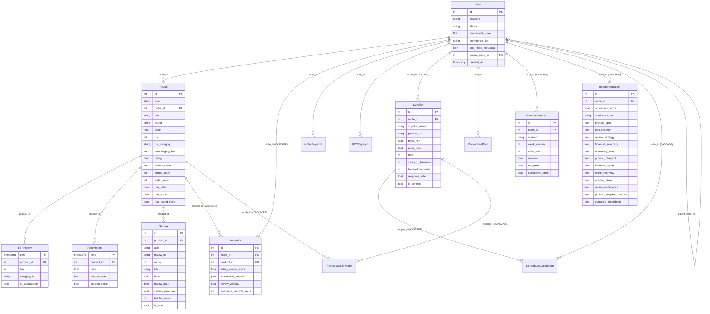
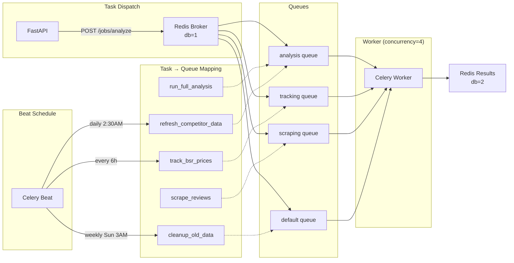
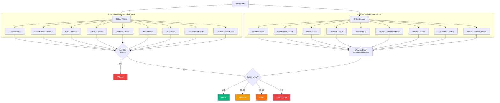
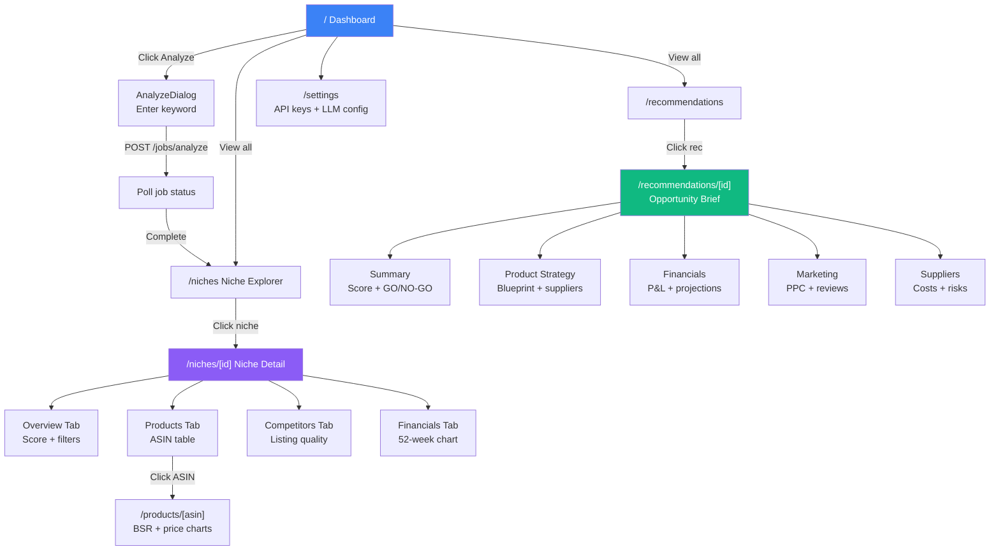

## amazon-omniscient

> Omniscient is an Amazon Product Research Engine. It identifies profitable FBA product opportunities by analyzing demand, competition, suppliers, ad costs, review barriers, and sales velocity. It outputs a scored recommendation (0-100 Omniscient Score) with a 52-week financial projection across bull/base/bear scenarios.

# CLAUDE.md — Project Context for Claude Code

## What is this project?

Omniscient is an Amazon Product Research Engine. It identifies profitable FBA product opportunities by analyzing demand, competition, suppliers, ad costs, review barriers, and sales velocity. It outputs a scored recommendation (0-100 Omniscient Score) with a 52-week financial projection across bull/base/bear scenarios.

## Tech stack

- **Backend:** Python 3.12, FastAPI (async), SQLAlchemy 2.0 (async ORM), Alembic migrations, Celery + Redis for background tasks
- **Frontend:** Next.js 14 (App Router), TypeScript, Tailwind CSS, Recharts for charts
- **Database:** PostgreSQL 16 with TimescaleDB extension (hypertables for BSR and price time-series)
- **LLM:** Configurable provider system — Qwen (default via DashScope), Anthropic Claude, OpenAI GPT. All implement `BaseLLMClient` abstract class.
- **Scraping:** Playwright headless Chromium with rotating proxies (free via proxyscrape.com or paid residential via BrightData/SmartProxy)

## Project layout

```
omniscient/
├── backend/
│   ├── app/
│   │   ├── main.py            # FastAPI app factory, lifespan, middleware
│   │   ├── config.py          # Pydantic Settings from env vars
│   │   ├── dependencies.py    # DI: get_db, get_redis, get_llm_client
│   │   ├── api/               # FastAPI route handlers (28 endpoints)
│   │   ├── models/            # SQLAlchemy 2.0 ORM models (14 tables)
│   │   ├── schemas/           # Pydantic v2 request/response schemas
│   │   ├── services/          # Business logic layer (16 service modules)
│   │   ├── core/              # Utilities (BSR regression, FBA calc, proxy, cache)
│   │   ├── llm/               # LLM provider abstraction + implementations
│   │   └── workers/           # Celery app, tasks, beat schedule
│   ├── migrations/            # Alembic migrations (001-004)
│   ├── tests/                 # pytest suite
│   └── pyproject.toml         # Python deps
├── frontend/
│   └── src/
│       ├── app/               # Next.js App Router pages (incl. /docs)
│       ├── components/        # UI components (sidebar, charts, cards)
│       ├── lib/               # API client (axios), utilities
│       └── types/             # TypeScript type definitions
├── docker-compose.yml
└── .env.example
```

## Service Dependency Graph

```mermaid
graph TD
    subgraph "API Layer"
        NICHES["niches.py"]
        PRODUCTS["products.py"]
        RECS["recommendations.py"]
        JOBS["jobs.py"]
    end

    subgraph "Task Orchestration"
        TASKS["tasks.py<br/>(13-step pipeline)"]
    end

    subgraph "Scraping Services"
        SCRAPER["ScraperService<br/>Amazon pages"]
        SUPP_SCRAPER["SupplierScraper<br/>1688.com"]
        AMZ_LOGIN["AmazonLoginService"]
        ALI_LOGIN["AlibabaLoginService"]
    end

    subgraph "Analysis Services"
        COMP["CompetitorService"]
        REVIEW["ReviewAnalyzer"]
        NICHE_INTEL["NicheIntelligence"]
        BLUEPRINT["ProductBlueprint"]
        SPEC["SpecGenerator"]
        SUPP_MATCH["SupplierMatchService"]
    end

    subgraph "Financial Services"
        SCORING["ScoringService"]
        SUPPLIER["SupplierService"]
        FORECAST["SalesForecast"]
        PPC["PPCService"]
        REV_STRAT["ReviewStrategy"]
        MARKETING["MarketingService"]
        FIN_REPORT["FinancialReport"]
        REC_ENGINE["RecommendationEngine"]
    end

    subgraph "Core Utilities"
        BSR["BSR Regression"]
        FBA["FBA Calculator"]
        PROXY["ProxyManager"]
        COOKIE["CookieManager"]
        LLM["LLM Client"]
    end

    JOBS -->|dispatch| TASKS
    TASKS --> SCRAPER
    TASKS --> SUPP_SCRAPER
    TASKS --> COMP
    TASKS --> REVIEW
    TASKS --> NICHE_INTEL
    TASKS --> BLUEPRINT
    TASKS --> SPEC
    TASKS --> SUPP_MATCH
    TASKS --> SCORING
    TASKS --> SUPPLIER
    TASKS --> FORECAST
    TASKS --> PPC
    TASKS --> REV_STRAT
    TASKS --> MARKETING
    TASKS --> FIN_REPORT
    TASKS --> REC_ENGINE

    SCRAPER --> PROXY
    SUPP_SCRAPER --> PROXY
    SUPP_SCRAPER --> COOKIE
    AMZ_LOGIN --> COOKIE
    ALI_LOGIN --> COOKIE

    REVIEW --> LLM
    NICHE_INTEL --> LLM
    BLUEPRINT --> LLM
    SPEC --> LLM
    SUPP_MATCH --> LLM
    PPC --> LLM
    REV_STRAT --> LLM
    MARKETING --> LLM
    FIN_REPORT --> LLM

    SCORING --> BSR
    SCORING --> FBA
    SUPPLIER --> FBA
    FORECAST --> FBA

    style TASKS fill:#f59e0b,color:#fff
    style LLM fill:#8b5cf6,color:#fff
    style SCRAPER fill:#3b82f6,color:#fff
    style SCORING fill:#10b981,color:#fff
```



## Database Entity Relationship Diagram



## Key architectural decisions

- **Async everywhere:** FastAPI + SQLAlchemy async sessions + asyncpg. Celery workers run in sync context but use `_run_async()` helper to call async service methods.
- **BSR regression:** `app/core/bsr_regression.py` converts BSR to estimated sales using `sales = A * BSR^(-B)` with category-specific coefficients. Handles both main-category and sub-category BSR (10x scaling factor).
- **TimescaleDB hypertables:** `bsr_history` and `price_history` use composite PKs `(time, product_id)` with `implicit_returning=False` for TimescaleDB compatibility.
- **LLM abstraction:** All LLM calls go through `BaseLLMClient.generate_json()` which handles JSON extraction, code fence stripping, and retries.
- **Scoring:** `ScoringService` computes 9 weighted sub-scores (0-100 each) — demand, competition, margin, revenue, trend, review feasibility, supplier, PPC viability, launch feasibility — and applies 9 hard disqualification filters. Any filter failure = FAIL tier.
- **Free proxy system:** `ProxyManager` supports three modes: `none` (direct), `free` (public proxies from proxyscrape.com with auto-rotation and failure tracking), and paid providers (`brightdata`/`smartproxy` with session-based rotation).

## How to run

```bash
# Full stack via Docker
docker compose up --build
docker compose exec backend alembic upgrade head

# Or locally
cd backend && pip install -e ".[dev]" && uvicorn app.main:app --reload
cd frontend && npm install && npm run dev
```

## Database

- 14 tables, 2 hypertables (bsr_history, price_history)
- Migrations in `backend/migrations/versions/` (4 versions)
- Migration 001: initial schema with all tables + TimescaleDB hypertables
- Migration 002: BSR sub-category columns + review velocity gap support
- Migration 003: product blueprint tables
- Migration 004: niche status tracking

## Testing

```bash
cd backend
pytest                    # all tests
pytest -v -k scoring      # just scoring tests
pytest --cov=app          # with coverage
```

Tests across 4 modules: scoring_service, sales_forecast, supplier_service, recommendation_engine.

## Common patterns

- **Service constructors** accept `AsyncSession` and optionally `BaseLLMClient`
- **API routes** use `Depends(get_db)` for database sessions
- **Pydantic schemas** use `model_config = ConfigDict(from_attributes=True)` for ORM conversion
- **Frontend pages** are `"use client"` components that fetch from `/api/v1/*` via the axios instance in `src/lib/api.ts`
- **Frontend routing** uses Next.js App Router: `app/niches/[nicheId]/page.tsx`, `app/recommendations/[id]/page.tsx`

## Important files to know

| File | Purpose |
|------|---------|
| `backend/app/services/scoring_service.py` | Omniscient Score calculation (9 sub-scores + 9 filters) |
| `backend/app/services/recommendation_engine.py` | Master orchestrator that coordinates all services |
| `backend/app/services/sales_forecast.py` | 52-week bull/base/bear projections |
| `backend/app/services/competitor_service.py` | Listing quality scoring + vulnerability detection |
| `backend/app/services/supplier_service.py` | Landed cost calculator + margin analysis |
| `backend/app/services/supplier_scraper.py` | 1688.com supplier scraping (factory prices, MOQ, ratings) |
| `backend/app/services/product_blueprint.py` | AI-driven complaint-based product design |
| `backend/app/services/financial_report.py` | Consolidated P&L report with scenario analysis |
| `backend/app/core/bsr_regression.py` | BSR-to-sales conversion model |
| `backend/app/core/fba_calculator.py` | FBA fee estimation (storage, fulfillment, referral) |
| `backend/app/core/proxy_manager.py` | Rotating proxy (free proxyscrape + paid BrightData/SmartProxy) |
| `backend/app/workers/tasks.py` | Celery task definitions (full analysis pipeline) |
| `backend/app/llm/base_client.py` | LLM provider abstract interface |
| `frontend/src/components/sidebar.tsx` | Navigation sidebar with active link highlighting |
| `frontend/src/app/page.tsx` | Dashboard |
| `frontend/src/app/docs/page.tsx` | Documentation page |
| `frontend/src/app/recommendations/[id]/page.tsx` | Opportunity brief (5 tabs) |

## Environment variables

All config is in `backend/app/config.py`. Key vars:
- `DATABASE_URL` — Postgres connection string
- `REDIS_URL` — Redis connection string
- `LLM_PROVIDER` — `qwen` | `anthropic` | `openai`
- `DASHSCOPE_API_KEY` / `ANTHROPIC_API_KEY` / `OPENAI_API_KEY` — LLM auth
- `SP_API_*` — Amazon Selling Partner API credentials
- `AMAZON_ADS_*` — Amazon Advertising API credentials
- `PROXY_PROVIDER` — `none` | `free` | `brightdata` | `smartproxy`
- `PROXY_HOST` / `PROXY_PORT` / `PROXY_USERNAME` / `PROXY_PASSWORD` — Paid proxy config (not needed for `free` mode)
- `ALIBABA_APP_KEY` / `ALIBABA_APP_SECRET` — 1688.com supplier API credentials
- `CELERY_BROKER_URL` — Celery Redis broker

## Celery Task Routing



## Scoring Logic Flow



## Frontend Page Flow



## License

Proprietary. All rights reserved. Source is public for reference only.

---
> Source: [Umair706/amazon-omniscient](https://github.com/Umair706/amazon-omniscient) — distributed by [TomeVault](https://tomevault.io).
<!-- tomevault:4.0:gemini_md:2026-08-11 -->
