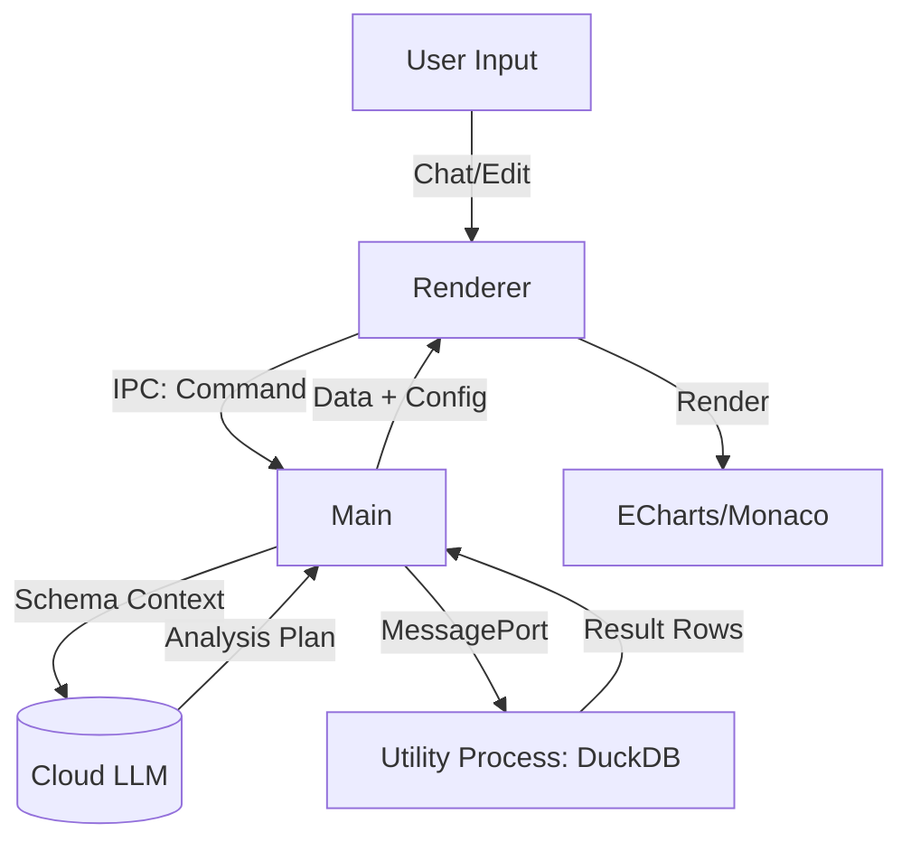

## wansan-studio

> **Wansan Studio** is a **Local-First**, privacy-focused Business Intelligence (BI) desktop application. It empowers users to generate professional-grade visual reports from Excel/CSV data using natural language, without uploading sensitive row data to the cloud.

# Wansan Studio (万三) - Developer Context

## 1. Project Vision & Principles
**Wansan Studio** is a **Local-First**, privacy-focused Business Intelligence (BI) desktop application. It empowers users to generate professional-grade visual reports from Excel/CSV data using natural language, without uploading sensitive row data to the cloud.

*   **Privacy First**: Raw data rows remain locally on the user's device. Only schema metadata is sent to the AI.
*   **Zero Latency**: Leverages local compute (DuckDB Native) for instant analysis of large datasets.
*   **Ownership**: Users own their data, API keys, and generated report files.

## 2. Tech Stack (v1.5)

### 2.1 Core & Backend
*   **Runtime**: Electron (Main + Renderer + Utility Process architecture).
*   **Language**: TypeScript.
*   **Database**: **DuckDB Native** (`@duckdb/node-api`) running in a separate Utility Process.
*   **Ingestion**: `ExcelJS` (Streaming) + `fs-extra` + DuckDB `read_csv_auto`.
*   **Build**: `electron-builder` (ASAR unpack enabled for native modules).

### 2.2 Frontend (Renderer)
*   **Framework**: React 18 + Vite.
*   **State**: Zustand (Global Store) + TanStack Query (Async Ops).
*   **UI System**: Tailwind CSS v4 + Shadcn UI.
*   **Design Language**: **"Wansan Airy"** (Zero-border, Large Radius, Soft Shadows).
*   **Visualization**: Apache ECharts (Canvas).
*   **Editors**:
    *   **SQL**: `monaco-editor` (VS Code engine).
    *   **Rich Text**: `MDXEditor` (Markdown).

## 3. Architecture & Data Flow

### Key Patterns
*   **Sidecar Pattern**: Heavy database operations run in a dedicated Utility Process to keep the UI responsive.
*   **Lazy Ingestion**: Files are previewed via lightweight CSV conversion and only ingested into the DB upon confirmation with type enforcement.
*   **Project Bundles**: Data is persisted in `.wansan` folders containing `source.duckdb` (Data) and `wansan.json` (Metadata).

## 4. Key Features

### 4.1 AI Kernel
*   **Schema-Only Protocol**: Only table names and column types are sent to the LLM.
*   **Smart Metrics**: User-defined logic (e.g., `profit = sales - cost`) is baked into DuckDB Views (`v_sales`), forcing the AI to use correct formulas.
*   **Auto-Fix Loop**: If SQL fails, the system automatically feeds the error back to the AI for self-correction.

### 4.2 Interactive Storytelling
*   **AI Insight**: Generates structured narratives (Summary, Findings, Recommendations) from aggregated data.
*   **Visual Anchoring**: Hovering over text findings highlights the corresponding chart elements (Series/Axis).
*   **Smart SQL Lab**: Context-aware SQL editor with schema autocomplete and safety quoting.

### 4.3 Reporting & Export
*   **Continuous Flow**: Vertical, seamless report layout supporting drag-and-drop organization.
*   **Web Export**: Generates a standalone, offline-capable `.html` file containing a lightweight React runtime and data snapshot.

## 5. Engineering Standards

### 5.1 Privacy Rules (CRITICAL)
1.  **NEVER** send row data (values) to the LLM.
2.  **NEVER** log raw SQL results to external services.
3.  **Local Execution**: All data processing happens in the embedded DuckDB instance.

### 5.2 Safety & Quality Protocols (STRICT MANDATES)
1.  **Zero-Omission Policy**: NEVER use ellipses (`...`) or `// skip lines` placeholders in any file-writing tool calls. Provide the full, executable content.
2.  **Atomic Modification**: For files exceeding 100 lines, prioritize using multiple small `replace` calls instead of a single `write_file` to minimize the risk of accidental code deletion.
3.  **Destructive Guardrails**: Any operation that performs physical deletion (`fs.remove`, `DROP TABLE`, etc.) MUST include path validation (e.g., ensuring paths are within `os.tmpdir()`) to prevent user data loss.
4.  **Immediate Verification**: Execute `npm run type-check` immediately after modifying `.tsx` or `.ts` files to catch syntax or logic regressions early.

### 5.3 Development Guidelines
*   **I18n**: Use `i18next` with namespaces (`common`, `analysis`, `settings`).
*   **Type Safety**: All IPC payloads must be typed in `src/shared/electron-api.ts`.
*   **Temp Files**: Strict lifecycle management via `TempFileManager` to prevent disk bloat.

## 6. The "Wansan Workflow" (MANDATORY)

You MUST follow this strict **Dual-Mode Protocol**. Do not write code unless asked.

### 🔵 MODE A: Planning (Brainstorming)
*   **Trigger**: Open questions ("How should we...", "Review this...", "Next steps?").
*   **Action**: Discuss options, critique UX, propose solutions.
*   **Output**: Conversational text. **NO Code Instructions.**

### 🔴 MODE B: Execution (Implementation)
*   **Trigger**: Direct commands ("Implement...", "Fix this", "Go ahead").
*   **Action**: Choose the correct track:
    *   **Track 1: Blueprint (Complex)** -> Generate a `docs/SPEC_[FEATURE].md` first.
    *   **Track 2: Direct (Simple)** -> Output a specific code block instruction for the Code Agent.

**Crucial Rule**: When executing a Spec, do NOT paste the whole spec content. Instead, say: *"Context: Read `docs/SPEC_NAME.md` and implement..."*

---
> Source: [wansanai/wansan-studio](https://github.com/wansanai/wansan-studio) — distributed by [TomeVault](https://tomevault.io).
<!-- tomevault:4.0:gemini_md:2026-05-04 -->
